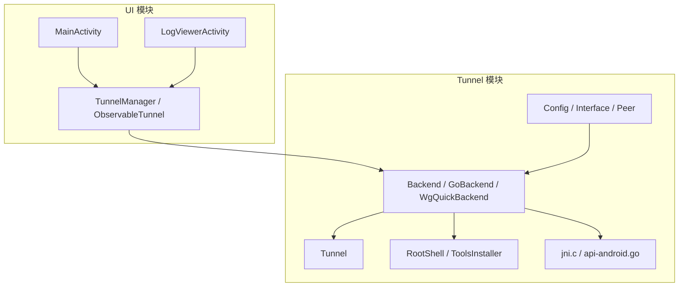
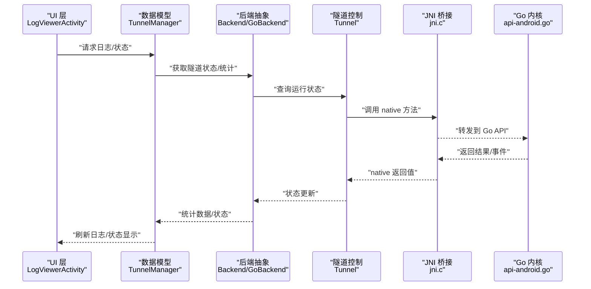
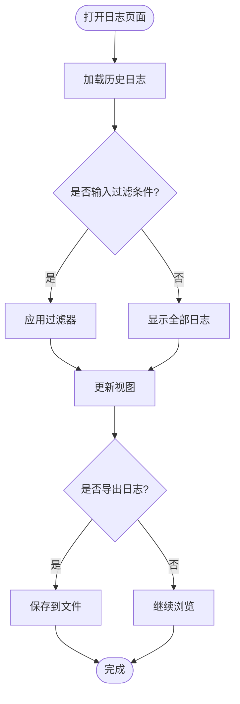
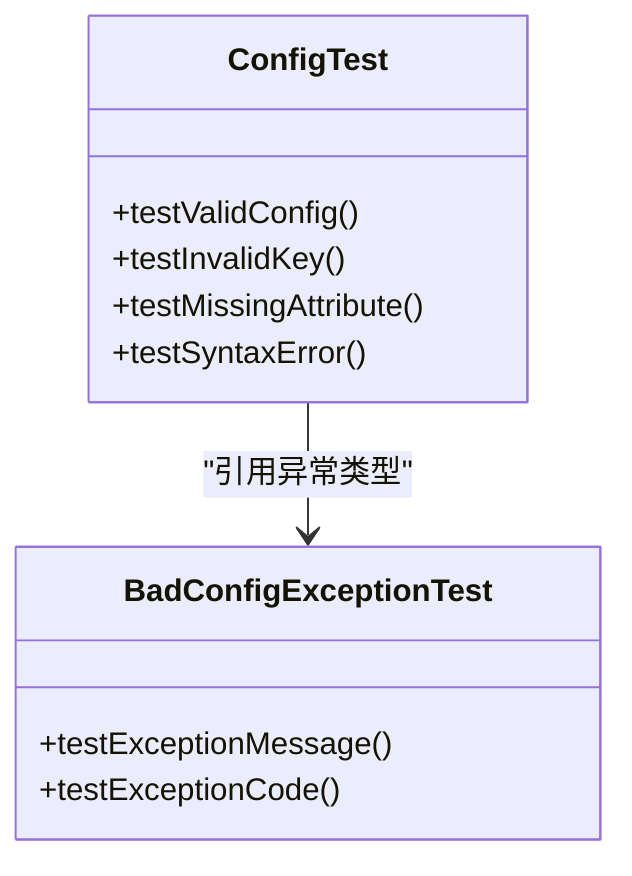
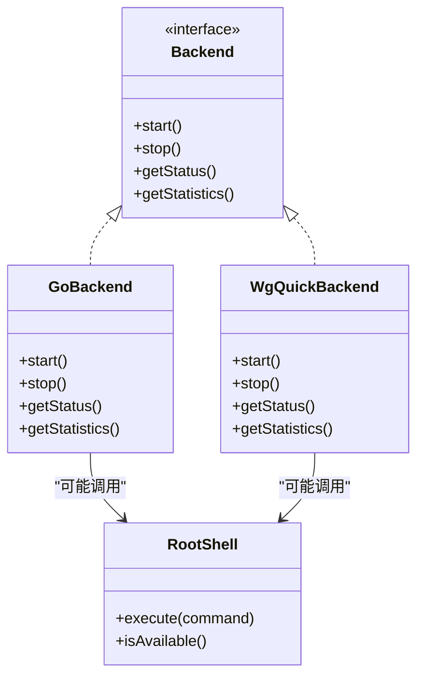
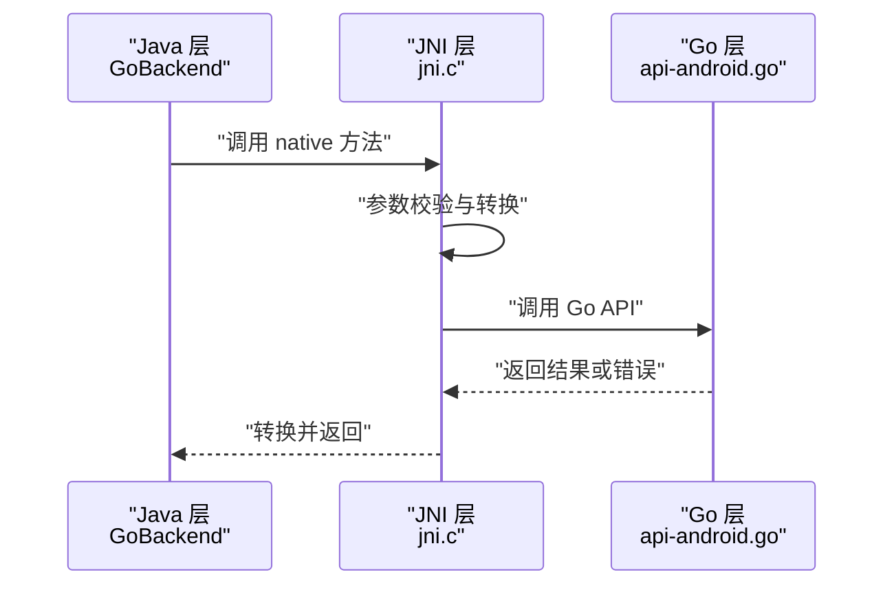
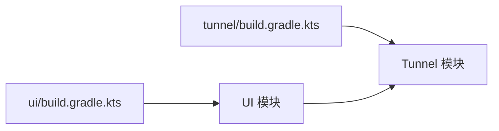

# 调试与测试

<cite>
**本文档引用的文件**   
- [LogViewerActivity.kt](file://ui/src/main/java/com/wireguard/android/activity/LogViewerActivity.kt)
- [ConfigTest.java](file://tunnel/src/test/java/com/wireguard/config/ConfigTest.java)
- [BadConfigExceptionTest.java](file://tunnel/src/test/java/com/wireguard/config/BadConfigExceptionTest.java)
- [Backend.java](file://tunnel/src/main/java/com/wireguard/android/backend/Backend.java)
- [GoBackend.java](file://tunnel/src/main/java/com/wireguard/android/backend/GoBackend.java)
- [Tunnel.java](file://tunnel/src/main/java/com/wireguard/android/backend/Tunnel.java)
- [WgQuickBackend.java](file://tunnel/src/main/java/com/wireguard/android/backend/WgQuickBackend.java)
- [RootShell.java](file://tunnel/src/main/java/com/wireguard/android/util/RootShell.java)
- [jni.c](file://tunnel/tools/libwg-go/jni.c)
- [api-android.go](file://tunnel/tools/libwg-go/api-android.go)
- [AndroidManifest.xml](file://ui/src/main/AndroidManifest.xml)
- [build.gradle.kts](file://tunnel/build.gradle.kts)
- [build.gradle.kts](file://ui/build.gradle.kts)
</cite>

## 目录
1. [简介](#简介)
2. [项目结构](#项目结构)
3. [核心组件](#核心组件)
4. [架构总览](#架构总览)
5. [详细组件分析](#详细组件分析)
6. [依赖关系分析](#依赖关系分析)
7. [性能考虑](#性能考虑)
8. [故障排查指南](#故障排查指南)
9. [结论](#结论)
10. [附录](#附录)

## 简介
本指南面向 WireGuard Android 项目的开发与维护人员，聚焦于调试与测试实践。内容涵盖：
- Android Studio 调试技巧（断点、变量检查、内存分析）
- 日志查看与分析（内置 LogViewerActivity 与系统日志过滤）
- 单元测试编写方法（以 ConfigTest.java 为参考模式）
- 集成测试框架选择与用例设计
- 网络调试技巧（VPN 连接模拟与抓包工具）
- 性能分析与内存泄漏检测
- 常见调试场景（JNI 调用问题、权限问题、系统兼容性）

## 项目结构
WireGuard Android 采用多模块组织：
- tunnel 模块：核心隧道逻辑、配置解析、加密原语、与 Go/JNI 后端交互
- ui 模块：用户界面、活动与片段、设置、日志查看器、应用列表等

**图表来源**
- [LogViewerActivity.kt](file://ui/src/main/java/com/wireguard/android/activity/LogViewerActivity.kt)
- [Backend.java](file://tunnel/src/main/java/com/wireguard/android/backend/Backend.java)
- [GoBackend.java](file://tunnel/src/main/java/com/wireguard/android/backend/GoBackend.java)
- [Tunnel.java](file://tunnel/src/main/java/com/wireguard/android/backend/Tunnel.java)
- [WgQuickBackend.java](file://tunnel/src/main/java/com/wireguard/android/backend/WgQuickBackend.java)
- [RootShell.java](file://tunnel/src/main/java/com/wireguard/android/util/RootShell.java)
- [jni.c](file://tunnel/tools/libwg-go/jni.c)
- [api-android.go](file://tunnel/tools/libwg-go/api-android.go)

**章节来源**
- [AndroidManifest.xml](file://ui/src/main/AndroidManifest.xml)
- [build.gradle.kts](file://tunnel/build.gradle.kts)
- [build.gradle.kts](file://ui/build.gradle.kts)

## 核心组件
- 日志查看器：LogViewerActivity 提供应用内日志浏览与过滤能力，便于快速定位问题。
- 后端抽象：Backend 接口统一了不同实现（GoBackend、WgQuickBackend），屏蔽底层差异。
- 隧道控制：Tunnel 封装了启动、停止、状态查询等生命周期操作。
- 配置模型：Config、Interface、Peer 等类负责解析与校验配置文件。
- JNI 桥接：jni.c 与 api-android.go 构成 Java 与 Go 之间的通信层。

**章节来源**
- [LogViewerActivity.kt](file://ui/src/main/java/com/wireguard/android/activity/LogViewerActivity.kt)
- [Backend.java](file://tunnel/src/main/java/com/wireguard/android/backend/Backend.java)
- [GoBackend.java](file://tunnel/src/main/java/com/wireguard/android/backend/GoBackend.java)
- [WgQuickBackend.java](file://tunnel/src/main/java/com/wireguard/android/backend/WgQuickBackend.java)
- [Tunnel.java](file://tunnel/src/main/java/com/wireguard/android/backend/Tunnel.java)
- [jni.c](file://tunnel/tools/libwg-go/jni.c)
- [api-android.go](file://tunnel/tools/libwg-go/api-android.go)

## 架构总览
下图展示了从 UI 到后端再到 JNI/Go 的调用链路，以及日志输出路径。

**图表来源**
- [LogViewerActivity.kt](file://ui/src/main/java/com/wireguard/android/activity/LogViewerActivity.kt)
- [Backend.java](file://tunnel/src/main/java/com/wireguard/android/backend/Backend.java)
- [GoBackend.java](file://tunnel/src/main/java/com/wireguard/android/backend/GoBackend.java)
- [Tunnel.java](file://tunnel/src/main/java/com/wireguard/android/backend/Tunnel.java)
- [jni.c](file://tunnel/tools/libwg-go/jni.c)
- [api-android.go](file://tunnel/tools/libwg-go/api-android.go)

## 详细组件分析

### 日志查看与分析（LogViewerActivity）
- 功能要点
  - 实时滚动显示日志条目，支持关键字过滤与级别筛选
  - 可导出日志以便离线分析
  - 与系统日志联动，便于跨进程追踪
- 使用建议
  - 在复现问题时开启详细日志级别
  - 结合时间戳与线程名定位并发问题
  - 对敏感信息进行脱敏处理后再导出

**图表来源**
- [LogViewerActivity.kt](file://ui/src/main/java/com/wireguard/android/activity/LogViewerActivity.kt)

**章节来源**
- [LogViewerActivity.kt](file://ui/src/main/java/com/wireguard/android/activity/LogViewerActivity.kt)

### 单元测试编写（ConfigTest.java 模式）
- 目标
  - 验证配置解析的正确性与健壮性
  - 覆盖异常分支（非法键值、缺失字段、语法错误等）
- 实践要点
  - 使用资源文件作为测试数据（如 broken.conf、invalid-key.conf）
  - 针对每种错误类型构造断言
  - 保持测试数据与业务逻辑解耦

**图表来源**
- [ConfigTest.java](file://tunnel/src/test/java/com/wireguard/config/ConfigTest.java)
- [BadConfigExceptionTest.java](file://tunnel/src/test/java/com/wireguard/config/BadConfigExceptionTest.java)

**章节来源**
- [ConfigTest.java](file://tunnel/src/test/java/com/wireguard/config/ConfigTest.java)
- [BadConfigExceptionTest.java](file://tunnel/src/test/java/com/wireguard/config/BadConfigExceptionTest.java)

### 后端抽象与实现（Backend / GoBackend / WgQuickBackend）
- 设计模式
  - 通过 Backend 接口统一不同后端实现，便于替换与扩展
  - GoBackend 基于 Go 运行时，WgQuickBackend 基于 wg-quick 脚本
- 调试关注点
  - 接口方法调用的参数与返回值
  - 异常传播与错误码映射
  - 与 RootShell 的交互（权限与命令执行）

**图表来源**
- [Backend.java](file://tunnel/src/main/java/com/wireguard/android/backend/Backend.java)
- [GoBackend.java](file://tunnel/src/main/java/com/wireguard/android/backend/GoBackend.java)
- [WgQuickBackend.java](file://tunnel/src/main/java/com/wireguard/android/backend/WgQuickBackend.java)
- [RootShell.java](file://tunnel/src/main/java/com/wireguard/android/util/RootShell.java)

**章节来源**
- [Backend.java](file://tunnel/src/main/java/com/wireguard/android/backend/Backend.java)
- [GoBackend.java](file://tunnel/src/main/java/com/wireguard/android/backend/GoBackend.java)
- [WgQuickBackend.java](file://tunnel/src/main/java/com/wireguard/android/backend/WgQuickBackend.java)
- [RootShell.java](file://tunnel/src/main/java/com/wireguard/android/util/RootShell.java)

### JNI 桥接（jni.c / api-android.go）
- 职责
  - 将 Java 方法调用转换为 Go 函数调用
  - 处理数据类型转换与异常映射
- 调试要点
  - 在 jni.c 中设置断点观察入参出参
  - 在 Go 侧打印关键路径日志
  - 注意线程安全与内存管理

**图表来源**
- [GoBackend.java](file://tunnel/src/main/java/com/wireguard/android/backend/GoBackend.java)
- [jni.c](file://tunnel/tools/libwg-go/jni.c)
- [api-android.go](file://tunnel/tools/libwg-go/api-android.go)

**章节来源**
- [jni.c](file://tunnel/tools/libwg-go/jni.c)
- [api-android.go](file://tunnel/tools/libwg-go/api-android.go)

## 依赖关系分析
- 模块间依赖
  - UI 模块依赖 tunnel 模块提供的后端与模型
  - tunnel 模块依赖 JNI 与系统工具（RootShell）
- 构建配置
  - Gradle 脚本定义了编译选项、NDK 配置与测试任务

**图表来源**
- [build.gradle.kts](file://ui/build.gradle.kts)
- [build.gradle.kts](file://tunnel/build.gradle.kts)

**章节来源**
- [build.gradle.kts](file://ui/build.gradle.kts)
- [build.gradle.kts](file://tunnel/build.gradle.kts)

## 性能考虑
- 日志性能
  - 避免在主线程进行大量 I/O 操作
  - 使用异步写入与缓冲策略
- 内存管理
  - 监控 JNI 层的对象创建与释放
  - 使用 Android Profiler 分析 GC 行为
- 网络性能
  - 统计吞吐量与延迟指标
  - 优化数据包处理路径

[本节为通用指导，不直接分析具体文件]

## 故障排查指南
- 日志定位
  - 使用 LogViewerActivity 过滤关键字与级别
  - 结合系统日志（logcat）进行跨进程追踪
- 单元测试失败
  - 检查测试数据文件完整性
  - 确认异常类型与消息匹配
- 后端启动失败
  - 检查 RootShell 可用性与权限
  - 查看 Go 后端初始化日志
- JNI 调用异常
  - 在 jni.c 中增加调试输出
  - 验证参数类型与长度
- 权限问题
  - 确认 VPN 服务权限已授予
  - 检查 SELinux 与系统限制

**章节来源**
- [LogViewerActivity.kt](file://ui/src/main/java/com/wireguard/android/activity/LogViewerActivity.kt)
- [ConfigTest.java](file://tunnel/src/test/java/com/wireguard/config/ConfigTest.java)
- [BadConfigExceptionTest.java](file://tunnel/src/test/java/com/wireguard/config/BadConfigExceptionTest.java)
- [RootShell.java](file://tunnel/src/main/java/com/wireguard/android/util/RootShell.java)
- [jni.c](file://tunnel/tools/libwg-go/jni.c)

## 结论
通过系统化调试与测试实践，可有效提升 WireGuard Android 的稳定性和可维护性。建议团队遵循本指南中的最佳实践，持续完善日志、测试与性能监控体系。

[本节为总结性内容，不直接分析具体文件]

## 附录
- 常用调试工具
  - Android Studio Debugger
  - Android Profiler
  - logcat 与 adb shell
- 测试数据准备
  - 使用真实配置文件样本
  - 构造边界条件与异常场景

[本节为补充信息，不直接分析具体文件]