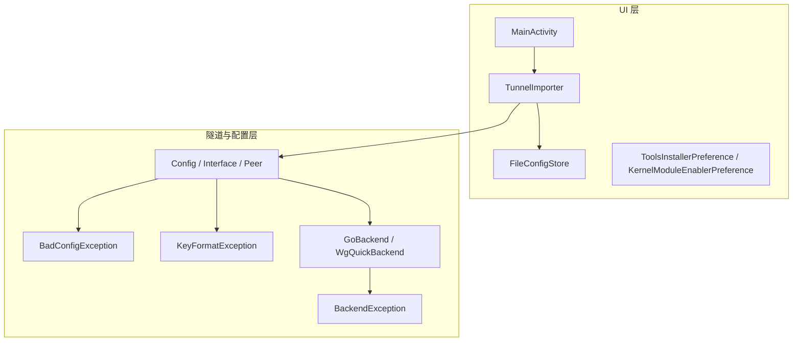
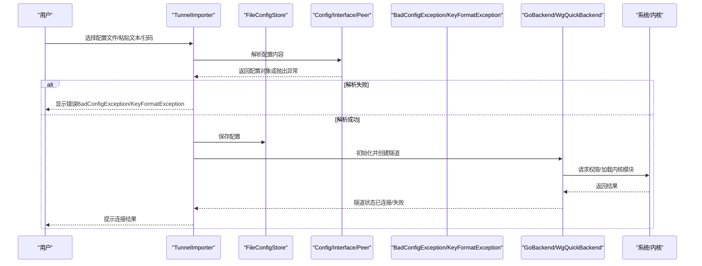
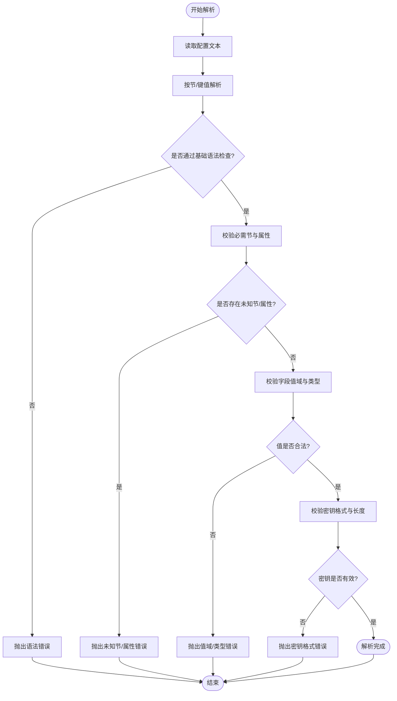
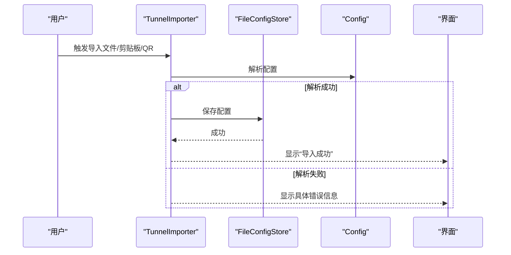
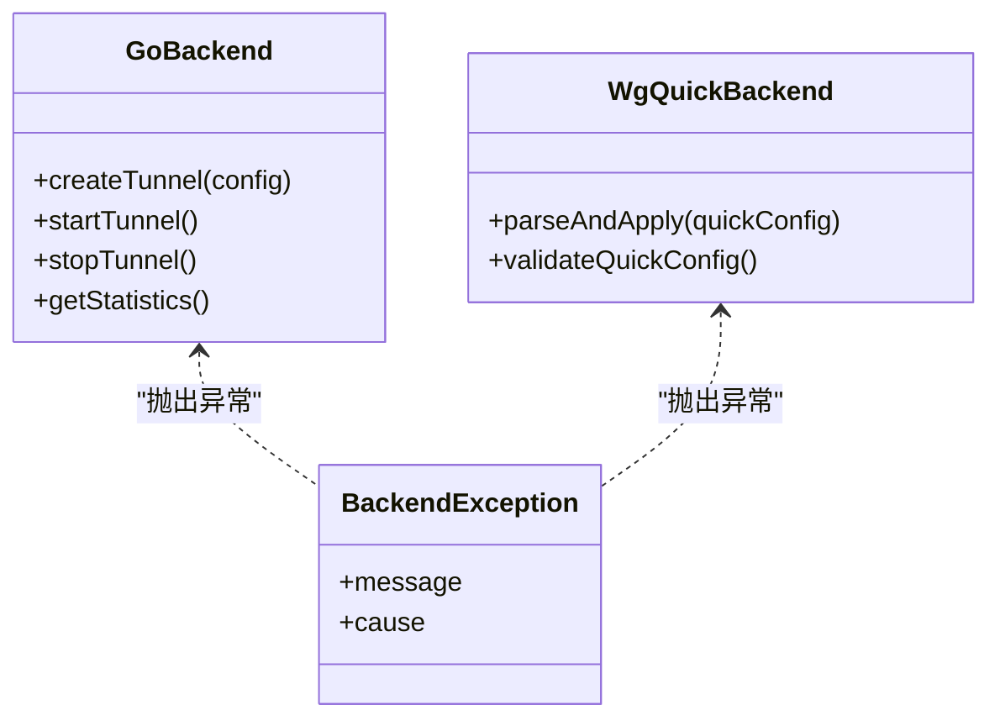
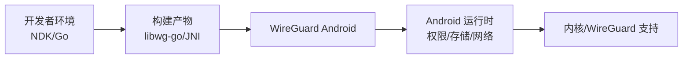

# 安装与配置问题

<cite>
**本文引用的文件**   
- [README.md](file://README.md)
- [AndroidManifest.xml（ui）](file://ui/src/main/AndroidManifest.xml)
- [AndroidManifest.xml（tunnel）](file://tunnel/src/main/AndroidManifest.xml)
- [BadConfigException.java](file://tunnel/src/main/java/com/wireguard/config/BadConfigException.java)
- [Config.java](file://tunnel/src/main/java/com/wireguard/config/Config.java)
- [Interface.java](file://tunnel/src/main/java/com/wireguard/config/Interface.java)
- [Peer.java](file://tunnel/src/main/java/com/wireguard/config/Peer.java)
- [KeyFormatException.java](file://tunnel/src/main/java/com/wireguard/crypto/KeyFormatException.java)
- [BackendException.java](file://tunnel/src/main/java/com/wireguard/android/backend/BackendException.java)
- [GoBackend.java](file://tunnel/src/main/java/com/wireguard/android/backend/GoBackend.java)
- [WgQuickBackend.java](file://tunnel/src/main/java/com/wireguard/android/backend/WgQuickBackend.java)
- [TunnelImporter.kt](file://ui/src/main/java/com/wireguard/android/util/TunnelImporter.kt)
- [FileConfigStore.kt](file://ui/src/main/java/com/wireguard/android/configStore/FileConfigStore.kt)
- [ToolsInstallerPreference.kt](file://ui/src/main/java/com/wireguard/android/preference/ToolsInstallerPreference.kt)
- [KernelModuleEnablerPreference.kt](file://ui/src/main/java/com/wireguard/android/preference/KernelModuleEnablerPreference.kt)
- [Broken.conf](file://tunnel/src/test/resources/broken.conf)
- [Invalid-key.conf](file://tunnel/src/test/resources/invalid-key.conf)
- [Syntax-error.conf](file://tunnel/src/test/resources/syntax-error.conf)
- [Missing-section.conf](file://tunnel/src/test/resources/missing-section.conf)
- [Unknown-section.conf](file://tunnel/src/test/resources/unknown-section.conf)
- [Unknown-attribute.conf](file://tunnel/src/test/resources/unknown-attribute.conf)
- [Working.conf](file://tunnel/src/test/resources/working.conf)
</cite>

## 目录
1. [简介](#简介)
2. [项目结构](#项目结构)
3. [核心组件](#核心组件)
4. [架构总览](#架构总览)
5. [详细组件分析](#详细组件分析)
6. [依赖关系分析](#依赖关系分析)
7. [性能考虑](#性能考虑)
8. [故障排查指南](#故障排查指南)
9. [结论](#结论)
10. [附录](#附录)

## 简介
本文件面向 WireGuard Android 的安装与配置排错，聚焦以下目标：
- 应用安装失败的常见原因与解决方案（系统权限、存储空间不足、版本兼容性等）
- 配置文件导入失败的诊断方法（文件格式错误、语法问题、密钥格式不正确等）
- 配置验证错误的含义与修正步骤（重点解释 BadConfigException 的常见情况）
- 环境变量与依赖库缺失的处理方法（NDK、Go 工具链、内核模块等）
- 不同 Android 版本的特殊配置要求
- 配置备份与恢复操作指南
- 常见配置模板与最佳实践

## 项目结构
WireGuard Android 由 UI 层与应用后端组成：
- ui：用户界面、配置导入导出、设置项、更新器等
- tunnel：核心隧道逻辑、配置解析、与 Go 后端的交互、异常定义等

**图表来源**
- [AndroidManifest.xml（ui）](file://ui/src/main/AndroidManifest.xml)
- [AndroidManifest.xml（tunnel）](file://tunnel/src/main/AndroidManifest.xml)
- [TunnelImporter.kt](file://ui/src/main/java/com/wireguard/android/util/TunnelImporter.kt)
- [FileConfigStore.kt](file://ui/src/main/java/com/wireguard/android/configStore/FileConfigStore.kt)
- [Config.java](file://tunnel/src/main/java/com/wireguard/config/Config.java)
- [BadConfigException.java](file://tunnel/src/main/java/com/wireguard/config/BadConfigException.java)
- [KeyFormatException.java](file://tunnel/src/main/java/com/wireguard/crypto/KeyFormatException.java)
- [GoBackend.java](file://tunnel/src/main/java/com/wireguard/android/backend/GoBackend.java)
- [WgQuickBackend.java](file://tunnel/src/main/java/com/wireguard/android/backend/WgQuickBackend.java)
- [BackendException.java](file://tunnel/src/main/java/com/wireguard/android/backend/BackendException.java)

**章节来源**
- [README.md](file://README.md)

## 核心组件
- 配置解析与校验
  - Config、Interface、Peer：负责解析 wg/wg-quick 风格配置，校验字段与值域
  - BadConfigException：抛出配置验证失败的具体原因
  - KeyFormatException：处理密钥格式错误（Base64、长度、前缀等）
- 后端与系统交互
  - GoBackend/WgQuickBackend：封装与底层 Go 实现的通信，创建/启动/停止隧道
  - BackendException：封装后端调用异常（权限、内核模块、系统限制等）
- 导入与存储
  - TunnelImporter：从文件/剪贴板/二维码导入配置
  - FileConfigStore：持久化配置到本地文件

**章节来源**
- [Config.java](file://tunnel/src/main/java/com/wireguard/config/Config.java)
- [Interface.java](file://tunnel/src/main/java/com/wireguard/config/Interface.java)
- [Peer.java](file://tunnel/src/main/java/com/wireguard/config/Peer.java)
- [BadConfigException.java](file://tunnel/src/main/java/com/wireguard/config/BadConfigException.java)
- [KeyFormatException.java](file://tunnel/src/main/java/com/wireguard/crypto/KeyFormatException.java)
- [GoBackend.java](file://tunnel/src/main/java/com/wireguard/android/backend/GoBackend.java)
- [WgQuickBackend.java](file://tunnel/src/main/java/com/wireguard/android/backend/WgQuickBackend.java)
- [BackendException.java](file://tunnel/src/main/java/com/wireguard/android/backend/BackendException.java)
- [TunnelImporter.kt](file://ui/src/main/java/com/wireguard/android/util/TunnelImporter.kt)
- [FileConfigStore.kt](file://ui/src/main/java/com/wireguard/android/configStore/FileConfigStore.kt)

## 架构总览
下图展示“导入配置—解析校验—加载后端—建立隧道”的关键流程。

**图表来源**
- [TunnelImporter.kt](file://ui/src/main/java/com/wireguard/android/util/TunnelImporter.kt)
- [FileConfigStore.kt](file://ui/src/main/java/com/wireguard/android/configStore/FileConfigStore.kt)
- [Config.java](file://tunnel/src/main/java/com/wireguard/config/Config.java)
- [BadConfigException.java](file://tunnel/src/main/java/com/wireguard/config/BadConfigException.java)
- [KeyFormatException.java](file://tunnel/src/main/java/com/wireguard/crypto/KeyFormatException.java)
- [GoBackend.java](file://tunnel/src/main/java/com/wireguard/android/backend/GoBackend.java)
- [WgQuickBackend.java](file://tunnel/src/main/java/com/wireguard/android/backend/WgQuickBackend.java)

## 详细组件分析

### 配置解析与校验（BadConfigException 与 KeyFormatException）
- 典型错误场景
  - 缺少必要节/属性（如 [Interface]、PrivateKey、AllowedIPs 等）
  - 未知节/属性（拼写错误或废弃字段）
  - 数值越界或非法值（端口、MTU、Keepalive 等）
  - 语法错误（括号不匹配、注释位置不当、行尾字符问题）
  - 密钥格式错误（非 Base64、长度不符、缺少前缀/后缀）
- 诊断建议
  - 使用测试资源中的示例文件进行对比定位
  - 逐步移除可疑段/属性，缩小范围
  - 对密钥进行在线校验或重新生成

**图表来源**
- [Config.java](file://tunnel/src/main/java/com/wireguard/config/Config.java)
- [Interface.java](file://tunnel/src/main/java/com/wireguard/config/Interface.java)
- [Peer.java](file://tunnel/src/main/java/com/wireguard/config/Peer.java)
- [BadConfigException.java](file://tunnel/src/main/java/com/wireguard/config/BadConfigException.java)
- [KeyFormatException.java](file://tunnel/src/main/java/com/wireguard/crypto/KeyFormatException.java)

**章节来源**
- [BadConfigException.java](file://tunnel/src/main/java/com/wireguard/config/BadConfigException.java)
- [KeyFormatException.java](file://tunnel/src/main/java/com/wireguard/crypto/KeyFormatException.java)
- [broken.conf](file://tunnel/src/test/resources/broken.conf)
- [syntax-error.conf](file://tunnel/src/test/resources/syntax-error.conf)
- [missing-section.conf](file://tunnel/src/test/resources/missing-section.conf)
- [unknown-section.conf](file://tunnel/src/test/resources/unknown-section.conf)
- [unknown-attribute.conf](file://tunnel/src/test/resources/unknown-attribute.conf)
- [invalid-key.conf](file://tunnel/src/test/resources/invalid-key.conf)
- [working.conf](file://tunnel/src/test/resources/working.conf)

### 导入与存储（TunnelImporter 与 FileConfigStore）
- 导入路径
  - 从文件选择器导入 .conf/.zip
  - 从剪贴板粘贴文本
  - 扫描 QR 码
- 存储策略
  - 将解析后的配置写入应用私有存储
  - 支持导出为 zip（含多个配置）
- 常见问题
  - 文件编码/换行符不一致导致解析失败
  - 大文件或损坏压缩包导致导入中断
  - 权限不足无法访问下载目录

**图表来源**
- [TunnelImporter.kt](file://ui/src/main/java/com/wireguard/android/util/TunnelImporter.kt)
- [FileConfigStore.kt](file://ui/src/main/java/com/wireguard/android/configStore/FileConfigStore.kt)
- [Config.java](file://tunnel/src/main/java/com/wireguard/config/Config.java)

**章节来源**
- [TunnelImporter.kt](file://ui/src/main/java/com/wireguard/android/util/TunnelImporter.kt)
- [FileConfigStore.kt](file://ui/src/main/java/com/wireguard/android/configStore/FileConfigStore.kt)

### 后端与系统交互（GoBackend/WgQuickBackend）
- 职责
  - 创建/启动/停止隧道
  - 与底层 Go 实现通信（JNI）
  - 上报统计与状态
- 常见失败原因
  - 未授予“创建网络接口”权限
  - 内核模块未加载或不兼容
  - 系统 API 级别不支持某些功能
  - 设备厂商定制 ROM 限制

**图表来源**
- [GoBackend.java](file://tunnel/src/main/java/com/wireguard/android/backend/GoBackend.java)
- [WgQuickBackend.java](file://tunnel/src/main/java/com/wireguard/android/backend/WgQuickBackend.java)
- [BackendException.java](file://tunnel/src/main/java/com/wireguard/android/backend/BackendException.java)

**章节来源**
- [GoBackend.java](file://tunnel/src/main/java/com/wireguard/android/backend/GoBackend.java)
- [WgQuickBackend.java](file://tunnel/src/main/java/com/wireguard/android/backend/WgQuickBackend.java)
- [BackendException.java](file://tunnel/src/main/java/com/wireguard/android/backend/BackendException.java)

## 依赖关系分析
- 构建与运行时依赖
  - NDK：用于编译原生库（Go 绑定）
  - Go 工具链：编译 libwg-go
  - Android 系统 API：网络栈、权限模型、存储访问框架
- 运行时依赖
  - 内核模块或系统内置 WireGuard 支持
  - 必要的系统权限（创建网络接口、后台运行等）

[本图为概念性依赖图，无需列出图表来源]

**章节来源**
- [AndroidManifest.xml（ui）](file://ui/src/main/AndroidManifest.xml)
- [AndroidManifest.xml（tunnel）](file://tunnel/src/main/AndroidManifest.xml)

## 性能考虑
- 配置解析复杂度与输入规模相关，避免超大配置或包含大量 Peer
- 频繁 I/O（导入/导出）应批量处理，减少 UI 卡顿
- 统计与日志输出需控制频率，避免影响主线程

[本节为通用指导，无需列出章节来源]

## 故障排查指南

### 应用安装失败
- 可能原因
  - 存储空间不足
  - 签名或包名冲突
  - 系统版本过低（API 级别不满足最低要求）
  - 企业策略/设备管理员限制安装
- 解决步骤
  - 清理存储空间，卸载旧版本或冲突应用
  - 确认 APK 来源可信，重新下载
  - 升级系统至支持的最低版本
  - 关闭企业策略限制或联系管理员

**章节来源**
- [AndroidManifest.xml（ui）](file://ui/src/main/AndroidManifest.xml)

### 配置文件导入失败
- 文件格式错误
  - 非 UTF-8 编码、Windows CRLF 换行符导致解析异常
  - 压缩文件损坏或包含非法文件名
- 语法问题
  - 节/键值顺序错误、括号不匹配、注释位置不当
- 密钥格式不正确
  - 非 Base64、长度不符合规范、缺少必要前缀/后缀
- 诊断方法
  - 对照 working.conf 与 broken.conf、syntax-error.conf、invalid-key.conf 等样例
  - 逐步删除可疑段/属性，定位问题
  - 使用在线工具校验密钥格式

**章节来源**
- [TunnelImporter.kt](file://ui/src/main/java/com/wireguard/android/util/TunnelImporter.kt)
- [FileConfigStore.kt](file://ui/src/main/java/com/wireguard/android/configStore/FileConfigStore.kt)
- [broken.conf](file://tunnel/src/test/resources/broken.conf)
- [syntax-error.conf](file://tunnel/src/test/resources/syntax-error.conf)
- [invalid-key.conf](file://tunnel/src/test/resources/invalid-key.conf)

### 配置验证错误（BadConfigException）
- 常见含义
  - 缺少必需节/属性（如 [Interface]、PrivateKey、Address、DNS、ListenPort 等）
  - 未知节/属性（拼写错误或废弃字段）
  - 数值越界或非法值（端口范围、MTU、Keepalive）
  - AllowedIPs/Curve/PresharedKey 等字段格式错误
- 修正步骤
  - 根据错误消息定位具体字段
  - 参考 working.conf 补齐或修正
  - 对密钥类字段重新生成并校验

**章节来源**
- [BadConfigException.java](file://tunnel/src/main/java/com/wireguard/config/BadConfigException.java)
- [Config.java](file://tunnel/src/main/java/com/wireguard/config/Config.java)
- [Interface.java](file://tunnel/src/main/java/com/wireguard/config/Interface.java)
- [Peer.java](file://tunnel/src/main/java/com/wireguard/config/Peer.java)
- [missing-section.conf](file://tunnel/src/test/resources/missing-section.conf)
- [unknown-section.conf](file://tunnel/src/test/resources/unknown-section.conf)
- [unknown-attribute.conf](file://tunnel/src/test/resources/unknown-attribute.conf)

### 密钥格式错误（KeyFormatException）
- 常见原因
  - 非标准 Base64 编码
  - 长度不符合曲线要求（如 Curve25519）
  - 多余空白或不可见字符
- 修正步骤
  - 重新生成密钥或使用官方工具转换
  - 去除多余空格/换行，确保纯 Base64

**章节来源**
- [KeyFormatException.java](file://tunnel/src/main/java/com/wireguard/crypto/KeyFormatException.java)

### 后端与系统权限问题（BackendException）
- 常见原因
  - 未授予“创建网络接口”权限
  - 内核模块未加载或不兼容
  - 系统 API 级别不支持某些功能
  - 厂商 ROM 限制（如禁止第三方 VPN 或修改路由）
- 解决步骤
  - 在系统设置中授予所需权限
  - 启用内核模块或升级系统以支持内置 WireGuard
  - 尝试在不同设备上复现，排除 ROM 限制

**章节来源**
- [BackendException.java](file://tunnel/src/main/java/com/wireguard/android/backend/BackendException.java)
- [GoBackend.java](file://tunnel/src/main/java/com/wireguard/android/backend/GoBackend.java)
- [WgQuickBackend.java](file://tunnel/src/main/java/com/wireguard/android/backend/WgQuickBackend.java)

### 环境变量与依赖库缺失
- 构建阶段
  - 缺少 NDK 或 Go 工具链导致无法编译 libwg-go
  - 环境变量未正确设置（ANDROID_NDK_HOME、GOROOT 等）
- 运行阶段
  - 缺少必要的系统库或内核模块
- 处理方法
  - 安装并配置 NDK/Go 工具链，确保 PATH 正确
  - 在设备上启用内核模块或升级到支持的系统版本

**章节来源**
- [ToolsInstallerPreference.kt](file://ui/src/main/java/com/wireguard/android/preference/ToolsInstallerPreference.kt)
- [KernelModuleEnablerPreference.kt](file://ui/src/main/java/com/wireguard/android/preference/KernelModuleEnablerPreference.kt)

### 不同 Android 版本的特殊要求
- 低版本系统
  - 可能缺少内置 WireGuard 支持，需要内核模块
  - 权限模型差异，部分权限需手动授权
- 高版本系统
  - 更严格的后台限制与网络隔离
  - 可能需要额外声明网络权限或白名单

**章节来源**
- [AndroidManifest.xml（ui）](file://ui/src/main/AndroidManifest.xml)
- [AndroidManifest.xml（tunnel）](file://tunnel/src/main/AndroidManifest.xml)

### 配置备份与恢复
- 备份
  - 使用应用内导出功能生成 zip（包含所有配置）
  - 或将配置文件复制到外部存储/云盘
- 恢复
  - 通过导入功能选择 zip 或单个 .conf 文件
  - 从剪贴板粘贴文本或扫描二维码导入
- 注意事项
  - 备份时注意隐私保护（密钥敏感）
  - 恢复后检查配置有效性，必要时重新生成密钥

**章节来源**
- [FileConfigStore.kt](file://ui/src/main/java/com/wireguard/android/configStore/FileConfigStore.kt)
- [TunnelImporter.kt](file://ui/src/main/java/com/wireguard/android/util/TunnelImporter.kt)

### 常见配置模板与最佳实践
- 最小可用模板
  - [Interface]：PrivateKey、Address、DNS、ListenPort
  - [Peer]：PublicKey、AllowedIPs、Endpoint、PersistentKeepalive
- 最佳实践
  - 使用强随机密钥，定期轮换
  - AllowedIPs 精确限定，避免 0.0.0.0/0 除非确有必要
  - 合理设置 PersistentKeepalive 以穿越 NAT
  - 保持 MTU 与服务器一致，避免分片问题
  - 使用 wg-quick 扩展时遵循官方语法

[本节为通用指导，无需列出章节来源]

## 结论
通过理解配置解析、密钥校验、后端权限与系统依赖等关键环节，可以快速定位并修复安装与配置问题。建议优先核对配置样例与错误消息，逐步缩小问题范围；对于系统与权限问题，结合设备型号与系统版本进行针对性处理。

[本节为总结性内容，无需列出章节来源]

## 附录
- 常用测试样例文件
  - working.conf：正常配置示例
  - broken.conf：整体结构损坏
  - syntax-error.conf：语法错误
  - missing-section.conf：缺少必需节
  - unknown-section.conf：未知节
  - unknown-attribute.conf：未知属性
  - invalid-key.conf：密钥格式错误

**章节来源**
- [working.conf](file://tunnel/src/test/resources/working.conf)
- [broken.conf](file://tunnel/src/test/resources/broken.conf)
- [syntax-error.conf](file://tunnel/src/test/resources/syntax-error.conf)
- [missing-section.conf](file://tunnel/src/test/resources/missing-section.conf)
- [unknown-section.conf](file://tunnel/src/test/resources/unknown-section.conf)
- [unknown-attribute.conf](file://tunnel/src/test/resources/unknown-attribute.conf)
- [invalid-key.conf](file://tunnel/src/test/resources/invalid-key.conf)