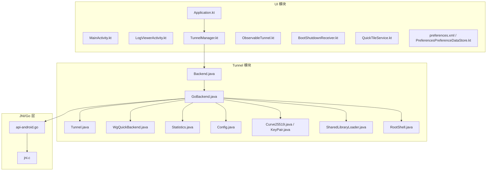
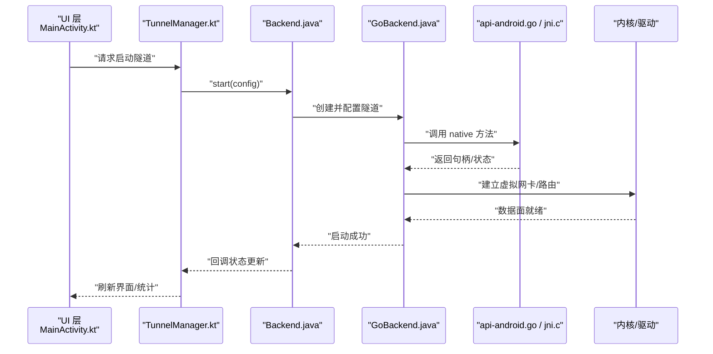
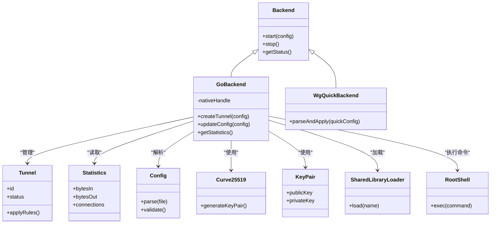

# 性能问题与优化

<cite>
**本文引用的文件**
- [README.md](file://README.md)
- [build.gradle.kts](file://build.gradle.kts)
- [settings.gradle.kts](file://settings.gradle.kts)
- [gradle.properties](file://gradle.properties)
- [tunnel/build.gradle.kts](file://tunnel/build.gradle.kts)
- [ui/build.gradle.kts](file://ui/build.gradle.kts)
- [tunnel/src/main/java/com/wireguard/android/backend/Backend.java](file://tunnel/src/main/java/com/wireguard/android/backend/Backend.java)
- [tunnel/src/main/java/com/wireguard/android/backend/GoBackend.java](file://tunnel/src/main/java/com/wireguard/android/backend/GoBackend.java)
- [tunnel/src/main/java/com/wireguard/android/backend/Tunnel.java](file://tunnel/src/main/java/com/wireguard/android/backend/Tunnel.java)
- [tunnel/src/main/java/com/wireguard/android/backend/WgQuickBackend.java](file://tunnel/src/main/java/com/wireguard/android/backend/WgQuickBackend.java)
- [tunnel/src/main/java/com/wireguard/android/backend/Statistics.java](file://tunnel/src/main/java/com/wireguard/android/backend/Statistics.java)
- [tunnel/src/main/java/com/wireguard/android/util/SharedLibraryLoader.java](file://tunnel/src/main/java/com/wireguard/android/util/SharedLibraryLoader.java)
- [tunnel/src/main/java/com/wireguard/android/util/RootShell.java](file://tunnel/src/main/java/com/wireguard/android/util/RootShell.java)
- [tunnel/src/main/java/com/wireguard/config/Config.java](file://tunnel/src/main/java/com/wireguard/config/Config.java)
- [tunnel/src/main/java/com/wireguard/crypto/Curve25519.java](file://tunnel/src/main/java/com/wireguard/crypto/Curve25519.java)
- [tunnel/src/main/java/com/wireguard/crypto/KeyPair.java](file://tunnel/src/main/java/com/wireguard/crypto/KeyPair.java)
- [ui/src/main/java/com/wireguard/android/Application.kt](file://ui/src/main/java/com/wireguard/android/Application.kt)
- [ui/src/main/java/com/wireguard/android/activity/MainActivity.kt](file://ui/src/main/java/com/wireguard/android/activity/MainActivity.kt)
- [ui/src/main/java/com/wireguard/android/activity/LogViewerActivity.kt](file://ui/src/main/java/com/wireguard/android/activity/LogViewerActivity.kt)
- [ui/src/main/java/com/wireguard/android/model/TunnelManager.kt](file://ui/src/main/java/com/wireguard/android/model/TunnelManager.kt)
- [ui/src/main/java/com/wireguard/android/model/ObservableTunnel.kt](file://ui/src/main/java/com/wireguard/android/model/ObservableTunnel.kt)
- [ui/src/main/java/com/wireguard/android/BootShutdownReceiver.kt](file://ui/src/main/java/com/wireguard/android/BootShutdownReceiver.kt)
- [ui/src/main/java/com/wireguard/android/QuickTileService.kt](file://ui/src/main/java/com/wireguard/android/QuickTileService.kt)
- [ui/src/main/java/com/wireguard/android/updater/Updater.kt](file://ui/src/main/java/com/wireguard/android/updater/Updater.kt)
- [ui/src/main/java/com/wireguard/android/preference/PreferencesPreferenceDataStore.kt](file://ui/src/main/java/com/wireguard/android/preference/PreferencesPreferenceDataStore.kt)
- [ui/src/main/res/xml/preferences.xml](file://ui/src/main/res/xml/preferences.xml)
- [tunnel/tools/libwg-go/api-android.go](file://tunnel/tools/libwg-go/api-android.go)
- [tunnel/tools/libwg-go/jni.c](file://tunnel/tools/libwg-go/jni.c)
</cite>

## 目录
1. [简介](#简介)
2. [项目结构](#项目结构)
3. [核心组件](#核心组件)
4. [架构总览](#架构总览)
5. [详细组件分析](#详细组件分析)
6. [依赖关系分析](#依赖关系分析)
7. [性能考量](#性能考量)
8. [故障排查指南](#故障排查指南)
9. [结论](#结论)
10. [附录](#附录)

## 简介
本指南聚焦 WireGuard Android 的性能问题与优化，覆盖启动缓慢、内存使用过高与泄漏、CPU 占用高、电池消耗过大、网络传输性能监控与优化、日志级别调优与调试输出控制、不同设备适配策略以及基准测试方法与工具推荐。文档基于仓库中的实际代码结构与模块职责进行梳理，帮助开发者快速定位瓶颈并实施改进。

## 项目结构
WireGuard Android 采用多模块组织：
- tunnel 模块：封装底层隧道能力（Java/JNI 到 Go 后端）、配置解析、加密原语等。
- ui 模块：Android 应用界面、后台服务、系统广播接收器、设置与偏好存储等。

图表来源
- [ui/src/main/java/com/wireguard/android/Application.kt](file://ui/src/main/java/com/wireguard/android/Application.kt)
- [ui/src/main/java/com/wireguard/android/model/TunnelManager.kt](file://ui/src/main/java/com/wireguard/android/model/TunnelManager.kt)
- [tunnel/src/main/java/com/wireguard/android/backend/Backend.java](file://tunnel/src/main/java/com/wireguard/android/backend/Backend.java)
- [tunnel/src/main/java/com/wireguard/android/backend/GoBackend.java](file://tunnel/src/main/java/com/wireguard/android/backend/GoBackend.java)
- [tunnel/src/main/java/com/wireguard/android/backend/Tunnel.java](file://tunnel/src/main/java/com/wireguard/android/backend/Tunnel.java)
- [tunnel/src/main/java/com/wireguard/android/backend/WgQuickBackend.java](file://tunnel/src/main/java/com/wireguard/android/backend/WgQuickBackend.java)
- [tunnel/src/main/java/com/wireguard/android/backend/Statistics.java](file://tunnel/src/main/java/com/wireguard/android/backend/Statistics.java)
- [tunnel/src/main/java/com/wireguard/config/Config.java](file://tunnel/src/main/java/com/wireguard/config/Config.java)
- [tunnel/src/main/java/com/wireguard/crypto/Curve25519.java](file://tunnel/src/main/java/com/wireguard/crypto/Curve25519.java)
- [tunnel/src/main/java/com/wireguard/crypto/KeyPair.java](file://tunnel/src/main/java/com/wireguard/crypto/KeyPair.java)
- [tunnel/src/main/java/com/wireguard/android/util/SharedLibraryLoader.java](file://tunnel/src/main/java/com/wireguard/android/util/SharedLibraryLoader.java)
- [tunnel/src/main/java/com/wireguard/android/util/RootShell.java](file://tunnel/src/main/java/com/wireguard/android/util/RootShell.java)
- [tunnel/tools/libwg-go/api-android.go](file://tunnel/tools/libwg-go/api-android.go)
- [tunnel/tools/libwg-go/jni.c](file://tunnel/tools/libwg-go/jni.c)

章节来源
- [README.md](file://README.md)
- [build.gradle.kts](file://build.gradle.kts)
- [settings.gradle.kts](file://settings.gradle.kts)
- [gradle.properties](file://gradle.properties)
- [tunnel/build.gradle.kts](file://tunnel/build.gradle.kts)
- [ui/build.gradle.kts](file://ui/build.gradle.kts)

## 核心组件
- 后端抽象与实现
  - Backend.java：定义统一的隧道后端接口，屏蔽具体实现差异。
  - GoBackend.java：通过 JNI 调用 libwg-go，负责隧道生命周期、统计信息、配置下发等。
  - WgQuickBackend.java：兼容 wg-quick 风格的配置管理。
  - Tunnel.java：表示单个隧道的运行时状态与操作。
  - Statistics.java：聚合流量与连接统计指标。
- 配置与加密
  - Config.java：解析与校验 WireGuard 配置文件。
  - Curve25519.java、KeyPair.java：密钥对生成与曲线运算封装。
- 系统交互与工具
  - SharedLibraryLoader.java：动态加载 native 库，影响冷启动时间。
  - RootShell.java：执行需要 root 权限的命令（如 iptables/nftables）。
- UI 与应用入口
  - Application.kt：应用初始化、全局配置、后台任务调度。
  - MainActivity.kt：主界面逻辑，触发隧道启停、展示状态。
  - LogViewerActivity.kt：日志查看器，用于调试与性能分析。
  - BootShutdownReceiver.kt：开机自启与关机清理。
  - QuickTileService.kt：快捷开关服务，快速启停隧道。
  - preferences.xml / PreferencesPreferenceDataStore.kt：用户偏好与设置持久化。

章节来源
- [tunnel/src/main/java/com/wireguard/android/backend/Backend.java](file://tunnel/src/main/java/com/wireguard/android/backend/Backend.java)
- [tunnel/src/main/java/com/wireguard/android/backend/GoBackend.java](file://tunnel/src/main/java/com/wireguard/android/backend/GoBackend.java)
- [tunnel/src/main/java/com/wireguard/android/backend/WgQuickBackend.java](file://tunnel/src/main/java/com/wireguard/android/backend/WgQuickBackend.java)
- [tunnel/src/main/java/com/wireguard/android/backend/Tunnel.java](file://tunnel/src/main/java/com/wireguard/android/backend/Tunnel.java)
- [tunnel/src/main/java/com/wireguard/android/backend/Statistics.java](file://tunnel/src/main/java/com/wireguard/android/backend/Statistics.java)
- [tunnel/src/main/java/com/wireguard/config/Config.java](file://tunnel/src/main/java/com/wireguard/config/Config.java)
- [tunnel/src/main/java/com/wireguard/crypto/Curve25519.java](file://tunnel/src/main/java/com/wireguard/crypto/Curve25519.java)
- [tunnel/src/main/java/com/wireguard/crypto/KeyPair.java](file://tunnel/src/main/java/com/wireguard/crypto/KeyPair.java)
- [tunnel/src/main/java/com/wireguard/android/util/SharedLibraryLoader.java](file://tunnel/src/main/java/com/wireguard/android/util/SharedLibraryLoader.java)
- [tunnel/src/main/java/com/wireguard/android/util/RootShell.java](file://tunnel/src/main/java/com/wireguard/android/util/RootShell.java)
- [ui/src/main/java/com/wireguard/android/Application.kt](file://ui/src/main/java/com/wireguard/android/Application.kt)
- [ui/src/main/java/com/wireguard/android/activity/MainActivity.kt](file://ui/src/main/java/com/wireguard/android/activity/MainActivity.kt)
- [ui/src/main/java/com/wireguard/android/activity/LogViewerActivity.kt](file://ui/src/main/java/com/wireguard/android/activity/LogViewerActivity.kt)
- [ui/src/main/java/com/wireguard/android/BootShutdownReceiver.kt](file://ui/src/main/java/com/wireguard/android/BootShutdownReceiver.kt)
- [ui/src/main/java/com/wireguard/android/QuickTileService.kt](file://ui/src/main/java/com/wireguard/android/QuickTileService.kt)
- [ui/src/main/res/xml/preferences.xml](file://ui/src/main/res/xml/preferences.xml)
- [ui/src/main/java/com/wireguard/android/preference/PreferencesPreferenceDataStore.kt](file://ui/src/main/java/com/wireguard/android/preference/PreferencesPreferenceDataStore.kt)

## 架构总览
WireGuard Android 的运行时路径为：UI 层通过 TunnelManager 调用后端抽象 Backend，GoBackend 经 JNI 调用 libwg-go（api-android.go），最终由内核或用户态驱动完成数据面转发。统计与配置在 Java 层解析与下发，加密原语由 crypto 模块提供。

图表来源
- [ui/src/main/java/com/wireguard/android/activity/MainActivity.kt](file://ui/src/main/java/com/wireguard/android/activity/MainActivity.kt)
- [ui/src/main/java/com/wireguard/android/model/TunnelManager.kt](file://ui/src/main/java/com/wireguard/android/model/TunnelManager.kt)
- [tunnel/src/main/java/com/wireguard/android/backend/Backend.java](file://tunnel/src/main/java/com/wireguard/android/backend/Backend.java)
- [tunnel/src/main/java/com/wireguard/android/backend/GoBackend.java](file://tunnel/src/main/java/com/wireguard/android/backend/GoBackend.java)
- [tunnel/tools/libwg-go/api-android.go](file://tunnel/tools/libwg-go/api-android.go)
- [tunnel/tools/libwg-go/jni.c](file://tunnel/tools/libwg-go/jni.c)

## 详细组件分析

### 启动缓慢分析与优化
- 关键瓶颈点
  - 共享库加载：SharedLibraryLoader.java 在首次加载时可能阻塞 UI 线程。
  - 配置解析与校验：Config.java 解析大配置或复杂规则会引入 CPU 开销。
  - 加密初始化：Curve25519.java、KeyPair.java 在首次使用时可能触发昂贵的初始化。
  - 后台服务与广播：BootShutdownReceiver.kt 在开机时可能触发耗时操作。
  - UI 初始化：Application.kt 与 MainActivity.kt 中若存在同步 I/O 或重型计算将拖慢首帧。
- 优化建议
  - 延迟加载：将非关键 native 库加载与配置解析移至后台线程，并在 UI 上显示进度。
  - 懒初始化：按需初始化加密原语与统计对象，避免冷启动全量构建。
  - 预取与缓存：对常用配置项与统计结果做轻量缓存，减少重复解析。
  - 精简广播处理：BootShutdownReceiver.kt 仅做必要检查，耗时任务交由 Service。
  - 渐进式渲染：UI 分片渲染，先展示关键信息，再异步填充详情。

章节来源
- [tunnel/src/main/java/com/wireguard/android/util/SharedLibraryLoader.java](file://tunnel/src/main/java/com/wireguard/android/util/SharedLibraryLoader.java)
- [tunnel/src/main/java/com/wireguard/config/Config.java](file://tunnel/src/main/java/com/wireguard/config/Config.java)
- [tunnel/src/main/java/com/wireguard/crypto/Curve25519.java](file://tunnel/src/main/java/com/wireguard/crypto/Curve25519.java)
- [tunnel/src/main/java/com/wireguard/crypto/KeyPair.java](file://tunnel/src/main/java/com/wireguard/crypto/KeyPair.java)
- [ui/src/main/java/com/wireguard/android/BootShutdownReceiver.kt](file://ui/src/main/java/com/wireguard/android/BootShutdownReceiver.kt)
- [ui/src/main/java/com/wireguard/android/Application.kt](file://ui/src/main/java/com/wireguard/android/Application.kt)
- [ui/src/main/java/com/wireguard/android/activity/MainActivity.kt](file://ui/src/main/java/com/wireguard/android/activity/MainActivity.kt)

### 内存使用过高与内存泄漏检测
- 常见原因
  - 长生命周期对象持有 Activity/Fragment 引用导致泄漏。
  - 监听器未注销（如观察者、广播、回调）造成引用链无法回收。
  - 大对象（配置、日志缓冲）未及时释放或复用不足。
- 检测工具与技巧
  - Android Studio Profiler：内存快照对比、GC 触发观察、分配热点。
  - LeakCanary：集成后自动检测泄漏并生成报告。
  - MAT/Heap Dump：定位强引用链与潜在泄漏点。
- 优化实践
  - 使用弱引用或 ViewModel/Lifecycle 管理生命周期。
  - 及时释放资源（关闭流、解除监听、清空缓存）。
  - 对大对象采用池化或分段加载。

章节来源
- [ui/src/main/java/com/wireguard/android/model/ObservableTunnel.kt](file://ui/src/main/java/com/wireguard/android/model/ObservableTunnel.kt)
- [ui/src/main/java/com/wireguard/android/activity/LogViewerActivity.kt](file://ui/src/main/java/com/wireguard/android/activity/LogViewerActivity.kt)

### CPU 占用率高原因与优化
- 常见原因
  - 频繁的配置解析与校验（Config.java）。
  - 加密运算集中（Curve25519.java、KeyPair.java）。
  - 统计上报与 UI 刷新过于频繁（Statistics.java、ObservableTunnel.kt）。
  - 后台命令执行阻塞（RootShell.java）。
- 优化策略
  - 合并与节流：批量处理统计与 UI 更新，降低频率。
  - 异步化：将耗时计算与 I/O 放入协程或线程池。
  - 算法与数据结构：减少不必要的拷贝与中间对象。
  - 条件编译与特性开关：根据设备能力启用更高效的实现。

章节来源
- [tunnel/src/main/java/com/wireguard/config/Config.java](file://tunnel/src/main/java/com/wireguard/config/Config.java)
- [tunnel/src/main/java/com/wireguard/crypto/Curve25519.java](file://tunnel/src/main/java/com/wireguard/crypto/Curve25519.java)
- [tunnel/src/main/java/com/wireguard/crypto/KeyPair.java](file://tunnel/src/main/java/com/wireguard/crypto/KeyPair.java)
- [tunnel/src/main/java/com/wireguard/android/backend/Statistics.java](file://tunnel/src/main/java/com/wireguard/android/backend/Statistics.java)
- [ui/src/main/java/com/wireguard/android/model/ObservableTunnel.kt](file://ui/src/main/java/com/wireguard/android/model/ObservableTunnel.kt)
- [tunnel/src/main/java/com/wireguard/android/util/RootShell.java](file://tunnel/src/main/java/com/wireguard/android/util/RootShell.java)

### 电池消耗过大的排查与省电模式适配
- 排查要点
  - 后台服务是否常驻且无休眠策略。
  - 高频网络轮询与日志输出。
  - 唤醒锁使用不当或长时间持有。
- 适配策略
  - 使用 JobScheduler/WorkManager 替代长期轮询。
  - 在 Doze 模式下降低日志与统计频率。
  - 合理设置 KeepAlive 与重连退避策略。
  - 利用系统省电 API（PowerManager）判断并降级功能。

章节来源
- [ui/src/main/java/com/wireguard/android/QuickTileService.kt](file://ui/src/main/java/com/wireguard/android/QuickTileService.kt)
- [ui/src/main/java/com/wireguard/android/BootShutdownReceiver.kt](file://ui/src/main/java/com/wireguard/android/BootShutdownReceiver.kt)
- [ui/src/main/res/xml/preferences.xml](file://ui/src/main/res/xml/preferences.xml)

### 网络传输性能监控与优化
- 监控指标
  - 吞吐量、丢包率、RTT、重传次数、队列长度。
  - 统计来源：Statistics.java 与 Go 后端暴露的计数器。
- 优化建议
  - 调整 MTU 与窗口大小以匹配网络环境。
  - 合理使用 KeepAlive 与心跳，避免频繁握手。
  - 针对弱网场景启用重传与拥塞控制参数调优。
  - 避免在 UI 线程进行网络 I/O。

章节来源
- [tunnel/src/main/java/com/wireguard/android/backend/Statistics.java](file://tunnel/src/main/java/com/wireguard/android/backend/Statistics.java)
- [tunnel/src/main/java/com/wireguard/android/backend/GoBackend.java](file://tunnel/src/main/java/com/wireguard/android/backend/GoBackend.java)

### 日志级别调优与调试输出控制
- 日志层级
  - 开发阶段：开启 DEBUG/VERBOSE，便于定位问题。
  - 发布版本：限制为 INFO/WARN，减少 I/O 与 CPU 开销。
- 控制方式
  - 通过 preferences.xml 与 PreferencesPreferenceDataStore.kt 提供用户可切换的日志级别。
  - LogViewerActivity.kt 支持实时过滤与导出。
- 最佳实践
  - 避免在热路径打印大量日志。
  - 使用结构化日志，便于自动化分析。

章节来源
- [ui/src/main/res/xml/preferences.xml](file://ui/src/main/res/xml/preferences.xml)
- [ui/src/main/java/com/wireguard/android/preference/PreferencesPreferenceDataStore.kt](file://ui/src/main/java/com/wireguard/android/preference/PreferencesPreferenceDataStore.kt)
- [ui/src/main/java/com/wireguard/android/activity/LogViewerActivity.kt](file://ui/src/main/java/com/wireguard/android/activity/LogViewerActivity.kt)

### 不同设备性能差异的适配策略
- 识别设备能力
  - 根据 CPU 架构、内存大小、GPU/NPU 能力选择合适实现。
- 自适应行为
  - 低端设备：降低日志频率、禁用非必要动画、简化统计。
  - 高端设备：启用更精细的监控与诊断。
- 配置分发
  - 通过 build variants 与 preferences.xml 控制功能开关。

章节来源
- [ui/src/main/res/xml/preferences.xml](file://ui/src/main/res/xml/preferences.xml)
- [ui/build.gradle.kts](file://ui/build.gradle.kts)
- [tunnel/build.gradle.kts](file://tunnel/build.gradle.kts)

### 性能基准测试方法与工具推荐
- 工具
  - Android Studio Profiler：CPU/内存/电量/网络综合分析。
  - systrace/perfetto：系统级追踪，定位卡顿与调度问题。
  - ab/iPerf：网络吞吐与延迟基准。
  - JMH：Java/Kotlin 微基准测试。
- 方法
  - 设计稳定测试用例，固定环境变量与网络条件。
  - 多次采样取中位数，排除异常值。
  - 对比不同构建变体与配置选项的效果。

章节来源
- [ui/build.gradle.kts](file://ui/build.gradle.kts)
- [tunnel/build.gradle.kts](file://tunnel/build.gradle.kts)

## 依赖关系分析
- 模块内依赖
  - UI 层依赖 TunnelManager，后者依赖 Backend 抽象，GoBackend 实现具体逻辑。
  - Config 与 Crypto 被 GoBackend 与 UI 层共同使用。
- 外部依赖
  - JNI 桥接 api-android.go 与 jni.c，最终与内核交互。
- 耦合与内聚
  - Backend 抽象提升内聚性，降低 UI 与实现的耦合。
  - Statistics 与 ObservableTunnel 解耦状态与 UI 展示。

图表来源
- [tunnel/src/main/java/com/wireguard/android/backend/Backend.java](file://tunnel/src/main/java/com/wireguard/android/backend/Backend.java)
- [tunnel/src/main/java/com/wireguard/android/backend/GoBackend.java](file://tunnel/src/main/java/com/wireguard/android/backend/GoBackend.java)
- [tunnel/src/main/java/com/wireguard/android/backend/WgQuickBackend.java](file://tunnel/src/main/java/com/wireguard/android/backend/WgQuickBackend.java)
- [tunnel/src/main/java/com/wireguard/android/backend/Tunnel.java](file://tunnel/src/main/java/com/wireguard/android/backend/Tunnel.java)
- [tunnel/src/main/java/com/wireguard/android/backend/Statistics.java](file://tunnel/src/main/java/com/wireguard/android/backend/Statistics.java)
- [tunnel/src/main/java/com/wireguard/config/Config.java](file://tunnel/src/main/java/com/wireguard/config/Config.java)
- [tunnel/src/main/java/com/wireguard/crypto/Curve25519.java](file://tunnel/src/main/java/com/wireguard/crypto/Curve25519.java)
- [tunnel/src/main/java/com/wireguard/crypto/KeyPair.java](file://tunnel/src/main/java/com/wireguard/crypto/KeyPair.java)
- [tunnel/src/main/java/com/wireguard/android/util/SharedLibraryLoader.java](file://tunnel/src/main/java/com/wireguard/android/util/SharedLibraryLoader.java)
- [tunnel/src/main/java/com/wireguard/android/util/RootShell.java](file://tunnel/src/main/java/com/wireguard/android/util/RootShell.java)

章节来源
- [tunnel/src/main/java/com/wireguard/android/backend/Backend.java](file://tunnel/src/main/java/com/wireguard/android/backend/Backend.java)
- [tunnel/src/main/java/com/wireguard/android/backend/GoBackend.java](file://tunnel/src/main/java/com/wireguard/android/backend/GoBackend.java)
- [tunnel/src/main/java/com/wireguard/android/backend/WgQuickBackend.java](file://tunnel/src/main/java/com/wireguard/android/backend/WgQuickBackend.java)
- [tunnel/src/main/java/com/wireguard/android/backend/Tunnel.java](file://tunnel/src/main/java/com/wireguard/android/backend/Tunnel.java)
- [tunnel/src/main/java/com/wireguard/android/backend/Statistics.java](file://tunnel/src/main/java/com/wireguard/android/backend/Statistics.java)
- [tunnel/src/main/java/com/wireguard/config/Config.java](file://tunnel/src/main/java/com/wireguard/config/Config.java)
- [tunnel/src/main/java/com/wireguard/crypto/Curve25519.java](file://tunnel/src/main/java/com/wireguard/crypto/Curve25519.java)
- [tunnel/src/main/java/com/wireguard/crypto/KeyPair.java](file://tunnel/src/main/java/com/wireguard/crypto/KeyPair.java)
- [tunnel/src/main/java/com/wireguard/android/util/SharedLibraryLoader.java](file://tunnel/src/main/java/com/wireguard/android/util/SharedLibraryLoader.java)
- [tunnel/src/main/java/com/wireguard/android/util/RootShell.java](file://tunnel/src/main/java/com/wireguard/android/util/RootShell.java)

## 性能考量
- 启动时间
  - 延迟加载 native 库与配置解析，避免主线程阻塞。
- 内存占用
  - 控制日志与统计缓冲大小，及时释放临时对象。
- CPU 使用
  - 合并与节流统计与 UI 更新，避免频繁同步 I/O。
- 电池续航
  - 使用系统调度 API，适配 Doze 与省电模式。
- 网络性能
  - 调整 MTU、KeepAlive、重传策略，监控关键指标。

[本节为通用指导，不直接分析具体文件]

## 故障排查指南
- 启动失败
  - 检查 SharedLibraryLoader.java 的库加载顺序与权限。
  - 确认 BootShutdownReceiver.kt 的开机流程未阻塞。
- 隧道无法启动
  - 验证 Config.java 的解析与校验结果。
  - 查看 RootShell.java 执行的系统命令返回值。
- 性能退化
  - 使用 Android Studio Profiler 定位 CPU/内存热点。
  - 通过 LogViewerActivity.kt 过滤关键日志。
- 电池异常
  - 检查后台服务与唤醒锁的使用情况。
  - 降低日志与统计频率，启用省电模式适配。

章节来源
- [tunnel/src/main/java/com/wireguard/android/util/SharedLibraryLoader.java](file://tunnel/src/main/java/com/wireguard/android/util/SharedLibraryLoader.java)
- [ui/src/main/java/com/wireguard/android/BootShutdownReceiver.kt](file://ui/src/main/java/com/wireguard/android/BootShutdownReceiver.kt)
- [tunnel/src/main/java/com/wireguard/config/Config.java](file://tunnel/src/main/java/com/wireguard/config/Config.java)
- [tunnel/src/main/java/com/wireguard/android/util/RootShell.java](file://tunnel/src/main/java/com/wireguard/android/util/RootShell.java)
- [ui/src/main/java/com/wireguard/android/activity/LogViewerActivity.kt](file://ui/src/main/java/com/wireguard/android/activity/LogViewerActivity.kt)

## 结论
通过对启动流程、内存与 CPU 使用、电池消耗、网络性能与日志控制的系统性分析，结合实际的模块职责与依赖关系，可以为 WireGuard Android 的性能优化提供明确方向。建议在开发与发布各阶段持续使用性能工具进行度量与回归，确保在不同设备上获得稳定与高效的体验。

[本节为总结性内容，不直接分析具体文件]

## 附录
- 构建与变体
  - 使用 gradle.properties 与 build.gradle.kts 控制构建选项与优化开关。
- 参考文件
  - README.md 提供项目背景与使用说明。
  - settings.gradle.kts 与 build.gradle.kts 定义模块与依赖。

章节来源
- [README.md](file://README.md)
- [gradle.properties](file://gradle.properties)
- [build.gradle.kts](file://build.gradle.kts)
- [settings.gradle.kts](file://settings.gradle.kts)