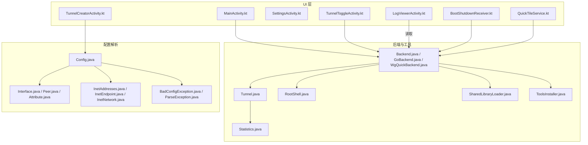
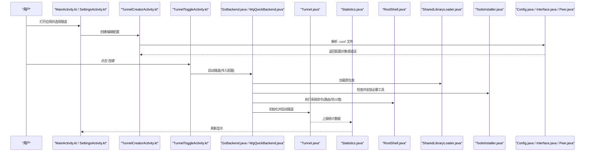
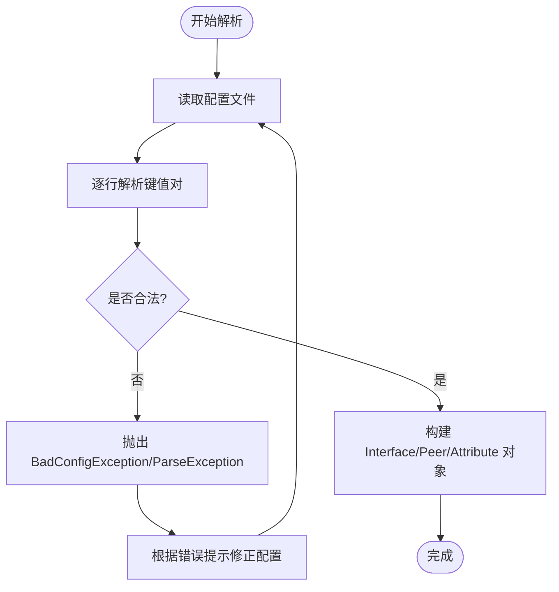
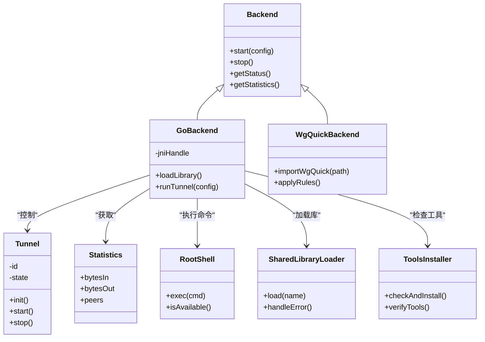
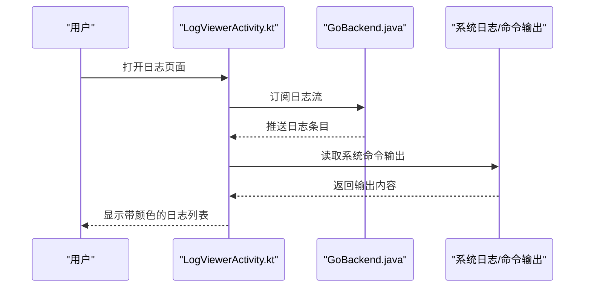
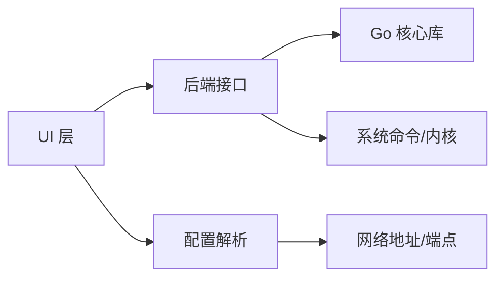

# 故障排除与常见问题

<cite>
**本文引用的文件**   
- [README.md](file://README.md)
- [AndroidManifest.xml](file://tunnel/src/main/AndroidManifest.xml)
- [Backend.java](file://tunnel/src/main/java/com/wireguard/android/backend/Backend.java)
- [BackendException.java](file://tunnel/src/main/java/com/wireguard/android/backend/BackendException.java)
- [GoBackend.java](file://tunnel/src/main/java/com/wireguard/android/backend/GoBackend.java)
- [WgQuickBackend.java](file://tunnel/src/main/java/com/wireguard/android/backend/WgQuickBackend.java)
- [Tunnel.java](file://tunnel/src/main/java/com/wireguard/android/backend/Tunnel.java)
- [Statistics.java](file://tunnel/src/main/java/com/wireguard/android/backend/Statistics.java)
- [RootShell.java](file://tunnel/src/main/java/com/wireguard/android/util/RootShell.java)
- [SharedLibraryLoader.java](file://tunnel/src/main/java/com/wireguard/android/util/SharedLibraryLoader.java)
- [ToolsInstaller.java](file://tunnel/src/main/java/com/wireguard/android/util/ToolsInstaller.java)
- [Config.java](file://tunnel/src/main/java/com/wireguard/config/Config.java)
- [BadConfigException.java](file://tunnel/src/main/java/com/wireguard/config/BadConfigException.java)
- [ParseException.java](file://tunnel/src/main/java/com/wireguard/config/ParseException.java)
- [Interface.java](file://tunnel/src/main/java/com/wireguard/config/Interface.java)
- [Peer.java](file://tunnel/src/main/java/com/wireguard/config/Peer.java)
- [Attribute.java](file://tunnel/src/main/java/com/wireguard/config/Attribute.java)
- [InetAddresses.java](file://tunnel/src/main/java/com/wireguard/config/InetAddresses.java)
- [InetEndpoint.java](file://tunnel/src/main/java/com/wireguard/config/InetEndpoint.java)
- [InetNetwork.java](file://tunnel/src/main/java/com/wireguard/config/InetNetwork.java)
- [LogViewerActivity.kt](file://ui/src/main/java/com/wireguard/android/activity/LogViewerActivity.kt)
- [MainActivity.kt](file://ui/src/main/java/com/wireguard/android/activity/MainActivity.kt)
- [SettingsActivity.kt](file://ui/src/main/java/com/wireguard/android/activity/SettingsActivity.kt)
- [TunnelCreatorActivity.kt](file://ui/src/main/java/com/wireguard/android/activity/TunnelCreatorActivity.kt)
- [TunnelToggleActivity.kt](file://ui/src/main/java/com/wireguard/android/activity/TunnelToggleActivity.kt)
- [BootShutdownReceiver.kt](file://ui/src/main/java/com/wireguard/android/BootShutdownReceiver.kt)
- [QuickTileService.kt](file://ui/src/main/java/com/wireguard/android/QuickTileService.kt)
- [ConfigStore.kt](file://ui/src/main/java/com/wireguard/android/configStore/ConfigStore.kt)
- [FileConfigStore.kt](file://ui/src/main/java/com/wireguard/android/configStore/FileConfigStore.kt)
- [ErrorMessages.kt](file://ui/src/main/java/com/wireguard/android/util/ErrorMessages.kt)
- [Extensions.kt](file://ui/src/main/java/com/wireguard/android/util/Extensions.kt)
- [AdminKnobs.kt](file://ui/src/main/java/com/wireguard/android/util/AdminKnobs.kt)
- [UserKnobs.kt](file://ui/src/main/java/com/wireguard/android/util/UserKnobs.kt)
- [PreferencesPreferenceDataStore.kt](file://ui/src/main/java/com/wireguard/android/preference/PreferencesPreferenceDataStore.kt)
- [ToolsInstallerPreference.kt](file://ui/src/main/java/com/wireguard/android/preference/ToolsInstallerPreference.kt)
- [KernelModuleEnablerPreference.kt](file://ui/src/main/java/com/wireguard/android/preference/KernelModuleEnablerPreference.kt)
- [logviewer_activity.xml](file://ui/src/main/res/layout/log_viewer_activity.xml)
- [logviewer_colors.xml](file://ui/src/main/res/values/logviewer_colors.xml)
- [strings.xml](file://ui/src/main/res/values-zh-rCN/strings.xml)
- [broken.conf](file://tunnel/src/test/resources/broken.conf)
- [invalid-key.conf](file://tunnel/src/test/resources/invalid-key.conf)
- [invalid-number.conf](file://tunnel/src/test/resources/invalid-number.conf)
- [invalid-value.conf](file://tunnel/src/test/resources/invalid-value.conf)
- [missing-attribute.conf](file://tunnel/src/test/resources/missing-attribute.conf)
- [missing-section.conf](file://tunnel/src/test/resources/missing-section.conf)
- [syntax-error.conf](file://tunnel/src/test/resources/syntax-error.conf)
- [unknown-attribute.conf](file://tunnel/src/test/resources/unknown-attribute.conf)
- [unknown-section.conf](file://tunnel/src/test/resources/unknown-section.conf)
- [working.conf](file://tunnel/src/test/resources/working.conf)
</cite>

## 目录
1. [简介](#简介)
2. [项目结构](#项目结构)
3. [核心组件](#核心组件)
4. [架构总览](#架构总览)
5. [详细组件分析](#详细组件分析)
6. [依赖关系分析](#依赖关系分析)
7. [性能注意事项](#性能注意事项)
8. [故障排除指南](#故障排除指南)
9. [结论](#结论)
10. [附录](#附录)

## 简介
本文件面向 WireGuard Android 用户与维护者，提供系统化的故障排除与常见问题解答。内容覆盖安装与配置、网络连接诊断、配置文件错误修复、性能分析与优化、日志查看与分析（含 LogViewer 使用技巧）、权限问题处理、不同 Android 版本兼容性、系统服务异常排查、用户反馈收集流程、技术支持获取方式以及标准问题报告模板与信息收集清单。文档基于代码仓库中的实现与资源进行归纳，确保可追溯与可操作性。

## 项目结构
WireGuard Android 由 UI 层、隧道后端与配置解析三大部分组成：
- UI 层：负责界面交互、设置、日志查看、快捷入口等。
- 隧道后端：封装 Go 实现的 WireGuard 内核接口，管理隧道生命周期、统计信息、工具安装与库加载。
- 配置解析：解析 .conf 配置文件，校验字段与值，抛出结构化异常便于定位问题。

图表来源
- [MainActivity.kt](file://ui/src/main/java/com/wireguard/android/activity/MainActivity.kt)
- [LogViewerActivity.kt](file://ui/src/main/java/com/wireguard/android/activity/LogViewerActivity.kt)
- [SettingsActivity.kt](file://ui/src/main/java/com/wireguard/android/activity/SettingsActivity.kt)
- [TunnelCreatorActivity.kt](file://ui/src/main/java/com/wireguard/android/activity/TunnelCreatorActivity.kt)
- [TunnelToggleActivity.kt](file://ui/src/main/java/com/wireguard/android/activity/TunnelToggleActivity.kt)
- [BootShutdownReceiver.kt](file://ui/src/main/java/com/wireguard/android/BootShutdownReceiver.kt)
- [QuickTileService.kt](file://ui/src/main/java/com/wireguard/android/QuickTileService.kt)
- [Backend.java](file://tunnel/src/main/java/com/wireguard/android/backend/Backend.java)
- [GoBackend.java](file://tunnel/src/main/java/com/wireguard/android/backend/GoBackend.java)
- [WgQuickBackend.java](file://tunnel/src/main/java/com/wireguard/android/backend/WgQuickBackend.java)
- [Tunnel.java](file://tunnel/src/main/java/com/wireguard/android/backend/Tunnel.java)
- [Statistics.java](file://tunnel/src/main/java/com/wireguard/android/backend/Statistics.java)
- [RootShell.java](file://tunnel/src/main/java/com/wireguard/android/util/RootShell.java)
- [SharedLibraryLoader.java](file://tunnel/src/main/java/com/wireguard/android/util/SharedLibraryLoader.java)
- [ToolsInstaller.java](file://tunnel/src/main/java/com/wireguard/android/util/ToolsInstaller.java)
- [Config.java](file://tunnel/src/main/java/com/wireguard/config/Config.java)
- [Interface.java](file://tunnel/src/main/java/com/wireguard/config/Interface.java)
- [Peer.java](file://tunnel/src/main/java/com/wireguard/config/Peer.java)
- [Attribute.java](file://tunnel/src/main/java/com/wireguard/config/Attribute.java)
- [InetAddresses.java](file://tunnel/src/main/java/com/wireguard/config/InetAddresses.java)
- [InetEndpoint.java](file://tunnel/src/main/java/com/wireguard/config/InetEndpoint.java)
- [InetNetwork.java](file://tunnel/src/main/java/com/wireguard/config/InetNetwork.java)
- [BadConfigException.java](file://tunnel/src/main/java/com/wireguard/config/BadConfigException.java)
- [ParseException.java](file://tunnel/src/main/java/com/wireguard/config/ParseException.java)

章节来源
- [README.md](file://README.md)

## 核心组件
- 后端抽象与实现
  - Backend.java：定义隧道后端的统一接口，供上层调用启动、停止、查询状态与统计。
  - GoBackend.java：通过 JNI 调用 Go 实现的 WireGuard 核心，负责底层数据面与控制面交互。
  - WgQuickBackend.java：支持 wg-quick 风格的配置导入与快速连接。
  - Tunnel.java：封装单个隧道的生命周期与运行时状态。
  - Statistics.java：聚合流量与连接统计，用于 UI 展示与性能分析。
- 工具与系统交互
  - RootShell.java：执行需要 root 权限的命令（如 iptables、ip 命令），用于路由与防火墙规则。
  - SharedLibraryLoader.java：动态加载 libwg-go.so 等原生库，处理加载失败场景。
  - ToolsInstaller.java：安装或更新必要的命令行工具（如 wg、wg-quick）。
- 配置解析与校验
  - Config.java、Interface.java、Peer.java、Attribute.java：解析并建模配置文件。
  - InetAddresses.java、InetEndpoint.java、InetNetwork.java：网络地址与端点解析。
  - BadConfigException.java、ParseException.java：抛出明确的配置错误类型，便于定位。

章节来源
- [Backend.java](file://tunnel/src/main/java/com/wireguard/android/backend/Backend.java)
- [GoBackend.java](file://tunnel/src/main/java/com/wireguard/android/backend/GoBackend.java)
- [WgQuickBackend.java](file://tunnel/src/main/java/com/wireguard/android/backend/WgQuickBackend.java)
- [Tunnel.java](file://tunnel/src/main/java/com/wireguard/android/backend/Tunnel.java)
- [Statistics.java](file://tunnel/src/main/java/com/wireguard/android/backend/Statistics.java)
- [RootShell.java](file://tunnel/src/main/java/com/wireguard/android/util/RootShell.java)
- [SharedLibraryLoader.java](file://tunnel/src/main/java/com/wireguard/android/util/SharedLibraryLoader.java)
- [ToolsInstaller.java](file://tunnel/src/main/java/com/wireguard/android/util/ToolsInstaller.java)
- [Config.java](file://tunnel/src/main/java/com/wireguard/config/Config.java)
- [Interface.java](file://tunnel/src/main/java/com/wireguard/config/Interface.java)
- [Peer.java](file://tunnel/src/main/java/com/wireguard/config/Peer.java)
- [Attribute.java](file://tunnel/src/main/java/com/wireguard/config/Attribute.java)
- [InetAddresses.java](file://tunnel/src/main/java/com/wireguard/config/InetAddresses.java)
- [InetEndpoint.java](file://tunnel/src/main/java/com/wireguard/config/InetEndpoint.java)
- [InetNetwork.java](file://tunnel/src/main/java/com/wireguard/config/InetNetwork.java)
- [BadConfigException.java](file://tunnel/src/main/java/com/wireguard/config/BadConfigException.java)
- [ParseException.java](file://tunnel/src/main/java/com/wireguard/config/ParseException.java)

## 架构总览
下图展示了从 UI 到后端再到系统资源的调用链，以及配置解析在导入与启动过程中的作用。

图表来源
- [MainActivity.kt](file://ui/src/main/java/com/wireguard/android/activity/MainActivity.kt)
- [SettingsActivity.kt](file://ui/src/main/java/com/wireguard/android/activity/SettingsActivity.kt)
- [TunnelCreatorActivity.kt](file://ui/src/main/java/com/wireguard/android/activity/TunnelCreatorActivity.kt)
- [TunnelToggleActivity.kt](file://ui/src/main/java/com/wireguard/android/activity/TunnelToggleActivity.kt)
- [GoBackend.java](file://tunnel/src/main/java/com/wireguard/android/backend/GoBackend.java)
- [WgQuickBackend.java](file://tunnel/src/main/java/com/wireguard/android/backend/WgQuickBackend.java)
- [Tunnel.java](file://tunnel/src/main/java/com/wireguard/android/backend/Tunnel.java)
- [Statistics.java](file://tunnel/src/main/java/com/wireguard/android/backend/Statistics.java)
- [RootShell.java](file://tunnel/src/main/java/com/wireguard/android/util/RootShell.java)
- [SharedLibraryLoader.java](file://tunnel/src/main/java/com/wireguard/android/util/SharedLibraryLoader.java)
- [ToolsInstaller.java](file://tunnel/src/main/java/com/wireguard/android/util/ToolsInstaller.java)
- [Config.java](file://tunnel/src/main/java/com/wireguard/config/Config.java)
- [Interface.java](file://tunnel/src/main/java/com/wireguard/config/Interface.java)
- [Peer.java](file://tunnel/src/main/java/com/wireguard/config/Peer.java)

## 详细组件分析

### 配置解析与常见错误
- 解析流程
  - 读取 .conf 文件，按节与键值对解析为 Interface、Peer、Attribute 等对象。
  - 校验必填字段、数值范围、IP/端口格式、加密参数合法性。
  - 遇到非法内容时抛出 BadConfigException 或 ParseException，包含具体位置与原因。
- 常见错误与修正
  - 语法错误：括号不匹配、键名拼写错误、缺少分隔符。
  - 未知节或属性：使用了不支持的字段或节名。
  - 缺失属性：必填项未填写（如 PrivateKey、ListenPort、AllowedIPs）。
  - 无效值：端口超出范围、IP 格式不正确、密钥长度不符。
  - 参考测试用例中的示例配置文件，帮助快速定位问题。

图表来源
- [Config.java](file://tunnel/src/main/java/com/wireguard/config/Config.java)
- [Interface.java](file://tunnel/src/main/java/com/wireguard/config/Interface.java)
- [Peer.java](file://tunnel/src/main/java/com/wireguard/config/Peer.java)
- [Attribute.java](file://tunnel/src/main/java/com/wireguard/config/Attribute.java)
- [BadConfigException.java](file://tunnel/src/main/java/com/wireguard/config/BadConfigException.java)
- [ParseException.java](file://tunnel/src/main/java/com/wireguard/config/ParseException.java)
- [broken.conf](file://tunnel/src/test/resources/broken.conf)
- [invalid-key.conf](file://tunnel/src/test/resources/invalid-key.conf)
- [invalid-number.conf](file://tunnel/src/test/resources/invalid-number.conf)
- [invalid-value.conf](file://tunnel/src/test/resources/invalid-value.conf)
- [missing-attribute.conf](file://tunnel/src/test/resources/missing-attribute.conf)
- [missing-section.conf](file://tunnel/src/test/resources/missing-section.conf)
- [syntax-error.conf](file://tunnel/src/test/resources/syntax-error.conf)
- [unknown-attribute.conf](file://tunnel/src/test/resources/unknown-attribute.conf)
- [unknown-section.conf](file://tunnel/src/test/resources/unknown-section.conf)
- [working.conf](file://tunnel/src/test/resources/working.conf)

章节来源
- [Config.java](file://tunnel/src/main/java/com/wireguard/config/Config.java)
- [BadConfigException.java](file://tunnel/src/main/java/com/wireguard/config/BadConfigException.java)
- [ParseException.java](file://tunnel/src/main/java/com/wireguard/config/ParseException.java)

### 后端启动与系统服务异常
- 启动流程
  - UI 触发连接请求，后端加载共享库，检查并安装工具，执行系统命令建立路由与防火墙规则，最后启动隧道。
- 常见异常与处理
  - 共享库加载失败：检查设备架构、NDK 兼容性与签名。
  - 工具缺失或不可用：自动安装或引导用户手动安装。
  - 权限不足：root 权限或网络栈访问受限，需授予相应权限。
  - 系统命令执行失败：检查 SELinux、厂商定制限制与内核模块可用性。

图表来源
- [Backend.java](file://tunnel/src/main/java/com/wireguard/android/backend/Backend.java)
- [GoBackend.java](file://tunnel/src/main/java/com/wireguard/android/backend/GoBackend.java)
- [WgQuickBackend.java](file://tunnel/src/main/java/com/wireguard/android/backend/WgQuickBackend.java)
- [Tunnel.java](file://tunnel/src/main/java/com/wireguard/android/backend/Tunnel.java)
- [Statistics.java](file://tunnel/src/main/java/com/wireguard/android/backend/Statistics.java)
- [RootShell.java](file://tunnel/src/main/java/com/wireguard/android/util/RootShell.java)
- [SharedLibraryLoader.java](file://tunnel/src/main/java/com/wireguard/android/util/SharedLibraryLoader.java)
- [ToolsInstaller.java](file://tunnel/src/main/java/com/wireguard/android/util/ToolsInstaller.java)

章节来源
- [GoBackend.java](file://tunnel/src/main/java/com/wireguard/android/backend/GoBackend.java)
- [WgQuickBackend.java](file://tunnel/src/main/java/com/wireguard/android/backend/WgQuickBackend.java)
- [Tunnel.java](file://tunnel/src/main/java/com/wireguard/android/backend/Tunnel.java)
- [Statistics.java](file://tunnel/src/main/java/com/wireguard/android/backend/Statistics.java)
- [RootShell.java](file://tunnel/src/main/java/com/wireguard/android/util/RootShell.java)
- [SharedLibraryLoader.java](file://tunnel/src/main/java/com/wireguard/android/util/SharedLibraryLoader.java)
- [ToolsInstaller.java](file://tunnel/src/main/java/com/wireguard/android/util/ToolsInstaller.java)

### 日志查看与分析（LogViewer）
- 功能要点
  - LogViewerActivity 提供实时日志滚动、颜色主题切换、搜索过滤等功能。
  - 日志来源包括后端输出、系统命令执行结果与应用内部事件。
- 使用技巧
  - 开启详细日志级别以捕获更多上下文。
  - 使用关键字过滤快速定位错误（如 “error”、“failed”、“permission”）。
  - 导出日志以便提交问题报告。
  - 夜间模式配色提升可读性。

图表来源
- [LogViewerActivity.kt](file://ui/src/main/java/com/wireguard/android/activity/LogViewerActivity.kt)
- [GoBackend.java](file://tunnel/src/main/java/com/wireguard/android/backend/GoBackend.java)
- [logviewer_activity.xml](file://ui/src/main/res/layout/log_viewer_activity.xml)
- [logviewer_colors.xml](file://ui/src/main/res/values/logviewer_colors.xml)

章节来源
- [LogViewerActivity.kt](file://ui/src/main/java/com/wireguard/android/activity/LogViewerActivity.kt)
- [logviewer_activity.xml](file://ui/src/main/res/layout/log_viewer_activity.xml)
- [logviewer_colors.xml](file://ui/src/main/res/values/logviewer_colors.xml)

### 权限相关问题
- 所需权限
  - 网络访问、前台服务、开机自启、系统级路由与防火墙操作（root）。
- 常见问题
  - 未授予必要权限导致无法建立隧道或修改路由。
  - 厂商省电策略限制后台运行与网络访问。
  - SELinux 或安全策略阻止关键系统调用。
- 解决步骤
  - 在系统设置中授予应用所需权限。
  - 关闭电池优化或允许后台活动。
  - 如需 root，确认已正确授权并验证 RootShell 可用。

章节来源
- [AndroidManifest.xml](file://tunnel/src/main/AndroidManifest.xml)
- [RootShell.java](file://tunnel/src/main/java/com/wireguard/android/util/RootShell.java)
- [AdminKnobs.kt](file://ui/src/main/java/com/wireguard/android/util/AdminKnobs.kt)
- [UserKnobs.kt](file://ui/src/main/java/com/wireguard/android/util/UserKnobs.kt)

### 不同 Android 版本的兼容性
- 差异点
  - 网络栈 API 变化、前台服务要求、权限模型升级。
  - 部分厂商 ROM 对 VPN 与路由的限制更严格。
- 建议
  - 优先使用官方支持的 Android 版本。
  - 遇到兼容性问题时，尝试禁用第三方安全软件或恢复默认网络设置。
  - 关注应用更新以适配新系统行为。

章节来源
- [MainActivity.kt](file://ui/src/main/java/com/wireguard/android/activity/MainActivity.kt)
- [SettingsActivity.kt](file://ui/src/main/java/com/wireguard/android/activity/SettingsActivity.kt)
- [BootShutdownReceiver.kt](file://ui/src/main/java/com/wireguard/android/BootShutdownReceiver.kt)

### 系统服务异常排查
- 常见症状
  - 启动后立即断开、无流量、DNS 解析失败、路由表异常。
- 排查方法
  - 检查后端状态与统计信息。
  - 查看系统命令执行结果与错误码。
  - 验证共享库加载与工具安装状态。
  - 使用 LogViewer 过滤关键词定位问题。

章节来源
- [Statistics.java](file://tunnel/src/main/java/com/wireguard/android/backend/Statistics.java)
- [RootShell.java](file://tunnel/src/main/java/com/wireguard/android/util/RootShell.java)
- [SharedLibraryLoader.java](file://tunnel/src/main/java/com/wireguard/android/util/SharedLibraryLoader.java)
- [ToolsInstaller.java](file://tunnel/src/main/java/com/wireguard/android/util/ToolsInstaller.java)

## 依赖关系分析
- 组件耦合
  - UI 层依赖后端接口，后端依赖系统工具与库加载器。
  - 配置解析独立于运行时，但影响后端启动成功率。
- 外部依赖
  - Go 实现的 WireGuard 核心库、系统命令（iptables/ip）、Android 系统 API。
- 潜在循环依赖
  - 当前设计分层清晰，未发现直接循环依赖。

图表来源
- [Backend.java](file://tunnel/src/main/java/com/wireguard/android/backend/Backend.java)
- [GoBackend.java](file://tunnel/src/main/java/com/wireguard/android/backend/GoBackend.java)
- [Config.java](file://tunnel/src/main/java/com/wireguard/config/Config.java)
- [InetAddresses.java](file://tunnel/src/main/java/com/wireguard/config/InetAddresses.java)
- [InetEndpoint.java](file://tunnel/src/main/java/com/wireguard/config/InetEndpoint.java)

章节来源
- [Backend.java](file://tunnel/src/main/java/com/wireguard/android/backend/Backend.java)
- [GoBackend.java](file://tunnel/src/main/java/com/wireguard/android/backend/GoBackend.java)
- [Config.java](file://tunnel/src/main/java/com/wireguard/config/Config.java)

## 性能注意事项
- 统计指标
  - 关注字节收发量、活跃对端数量、连接状态变化频率。
- 优化建议
  - 合理配置 KeepAlive 与 MTU，减少丢包与重传。
  - 避免频繁重启隧道，尽量复用现有连接。
  - 在弱网环境下降低并发对端数量。
- 监控手段
  - 使用 Statistics 提供的数据进行趋势分析。
  - 结合 LogViewer 观察延迟与错误峰值。

章节来源
- [Statistics.java](file://tunnel/src/main/java/com/wireguard/android/backend/Statistics.java)
- [LogViewerActivity.kt](file://ui/src/main/java/com/wireguard/android/activity/LogViewerActivity.kt)

## 故障排除指南

### 安装与配置问题
- 现象
  - 应用无法启动、导入配置失败、连接立即断开。
- 排查步骤
  - 检查 Android 版本与设备架构兼容性。
  - 确认共享库加载成功，工具安装完整。
  - 使用配置解析器验证 .conf 文件合法性。
  - 参考测试用例中的 working.conf 作为基准。

章节来源
- [SharedLibraryLoader.java](file://tunnel/src/main/java/com/wireguard/android/util/SharedLibraryLoader.java)
- [ToolsInstaller.java](file://tunnel/src/main/java/com/wireguard/android/util/ToolsInstaller.java)
- [Config.java](file://tunnel/src/main/java/com/wireguard/config/Config.java)
- [working.conf](file://tunnel/src/test/resources/working.conf)

### 网络连接问题诊断
- 现象
  - 无法访问目标网络、DNS 解析失败、间歇性断连。
- 诊断方法
  - 检查路由表与防火墙规则是否正确设置。
  - 验证 DNS 服务器可达性与解析结果。
  - 使用 LogViewer 过滤 “dns”、“route”、“firewall” 等关键词。
  - 对比 Statistics 的流量计数判断数据面是否正常。

章节来源
- [RootShell.java](file://tunnel/src/main/java/com/wireguard/android/util/RootShell.java)
- [LogViewerActivity.kt](file://ui/src/main/java/com/wireguard/android/activity/LogViewerActivity.kt)
- [Statistics.java](file://tunnel/src/main/java/com/wireguard/android/backend/Statistics.java)

### 配置文件常见错误与修正
- 错误类型
  - 语法错误、未知节/属性、缺失必填项、无效值。
- 修正方法
  - 对照 working.conf 逐项核对键名与值格式。
  - 使用错误消息定位具体行与字段。
  - 逐步简化配置以隔离问题。

章节来源
- [BadConfigException.java](file://tunnel/src/main/java/com/wireguard/config/BadConfigException.java)
- [ParseException.java](file://tunnel/src/main/java/com/wireguard/config/ParseException.java)
- [broken.conf](file://tunnel/src/test/resources/broken.conf)
- [syntax-error.conf](file://tunnel/src/test/resources/syntax-error.conf)
- [unknown-attribute.conf](file://tunnel/src/test/resources/unknown-attribute.conf)
- [missing-attribute.conf](file://tunnel/src/test/resources/missing-attribute.conf)
- [invalid-value.conf](file://tunnel/src/test/resources/invalid-value.conf)

### 性能问题分析与优化
- 分析方法
  - 观察 Statistics 的字节计数与连接状态。
  - 使用 LogViewer 分析错误与重试次数。
  - 调整 MTU、KeepAlive、对端数量等参数。
- 优化建议
  - 选择合适的服务器与网络环境。
  - 避免在高负载设备上同时启用过多隧道。

章节来源
- [Statistics.java](file://tunnel/src/main/java/com/wireguard/android/backend/Statistics.java)
- [LogViewerActivity.kt](file://ui/src/main/java/com/wireguard/android/activity/LogViewerActivity.kt)

### 日志查看与分析方法
- 使用技巧
  - 开启详细日志，过滤关键词，导出日志文件。
  - 结合系统日志与后端输出交叉验证。
- 常见问题定位
  - 权限错误、库加载失败、工具缺失、系统命令报错。

章节来源
- [LogViewerActivity.kt](file://ui/src/main/java/com/wireguard/android/activity/LogViewerActivity.kt)
- [logviewer_colors.xml](file://ui/src/main/res/values/logviewer_colors.xml)

### 权限相关问题解决
- 步骤
  - 授予网络与前台服务权限。
  - 关闭电池优化，允许后台活动。
  - 如需 root，确认 RootShell 可用并执行必要命令。

章节来源
- [AndroidManifest.xml](file://tunnel/src/main/AndroidManifest.xml)
- [RootShell.java](file://tunnel/src/main/java/com/wireguard/android/util/RootShell.java)
- [AdminKnobs.kt](file://ui/src/main/java/com/wireguard/android/util/AdminKnobs.kt)

### 系统服务异常排查
- 方法
  - 检查后端状态与统计信息。
  - 验证共享库与工具安装。
  - 使用 LogViewer 过滤错误关键词。

章节来源
- [GoBackend.java](file://tunnel/src/main/java/com/wireguard/android/backend/GoBackend.java)
- [WgQuickBackend.java](file://tunnel/src/main/java/com/wireguard/android/backend/WgQuickBackend.java)
- [Statistics.java](file://tunnel/src/main/java/com/wireguard/android/backend/Statistics.java)
- [LogViewerActivity.kt](file://ui/src/main/java/com/wireguard/android/activity/LogViewerActivity.kt)

### 用户反馈问题的收集与处理流程
- 收集渠道
  - 应用内反馈入口、社区论坛、问题跟踪平台。
- 处理流程
  - 接收问题描述与环境信息。
  - 复现问题并定位根因。
  - 提供临时解决方案与长期修复计划。
  - 更新文档与 FAQ。

章节来源
- [MainActivity.kt](file://ui/src/main/java/com/wireguard/android/activity/MainActivity.kt)
- [SettingsActivity.kt](file://ui/src/main/java/com/wireguard/android/activity/SettingsActivity.kt)

### 技术支持与社区帮助
- 渠道
  - 官方文档、社区论坛、GitHub Issues、邮件列表。
- 建议
  - 提交问题时附带日志与配置片段。
  - 遵循问题报告模板，提高沟通效率。

章节来源
- [README.md](file://README.md)

### 问题报告标准模板与信息收集清单
- 模板要素
  - 设备型号与 Android 版本。
  - 应用版本与构建号。
  - 问题描述与复现步骤。
  - 相关日志与配置片段（脱敏）。
  - 已尝试的解决方法。
- 信息收集清单
  - 网络环境（运营商、WiFi/移动数据）。
  - 是否启用其他 VPN 或代理。
  - 是否使用 root 或特殊权限。
  - 系统安全策略（SELinux、厂商限制）。

章节来源
- [ErrorMessages.kt](file://ui/src/main/java/com/wireguard/android/util/ErrorMessages.kt)
- [Extensions.kt](file://ui/src/main/java/com/wireguard/android/util/Extensions.kt)
- [strings.xml](file://ui/src/main/res/values-zh-rCN/strings.xml)

## 结论
通过系统化的故障排除流程、详细的日志分析方法与清晰的配置校验机制，用户可以高效定位并解决 WireGuard Android 的常见问题。建议在日常使用中保持配置简洁、及时更新应用与系统、充分利用内置日志与统计工具，以获得稳定可靠的连接体验。

## 附录
- 常用命令与路径
  - 查看系统路由与防火墙规则（需 root）。
  - 导出日志文件至下载目录。
- 参考资源
  - 官方 README 与社区文档。
  - 测试用例中的示例配置文件。

章节来源
- [README.md](file://README.md)
- [working.conf](file://tunnel/src/test/resources/working.conf)