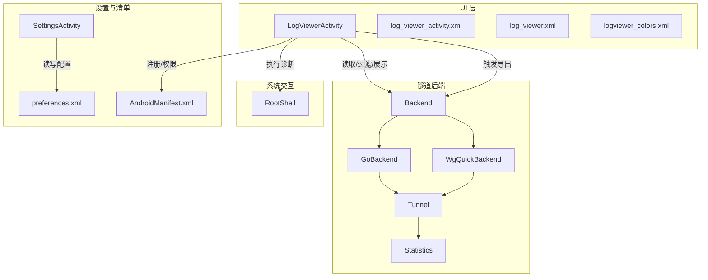
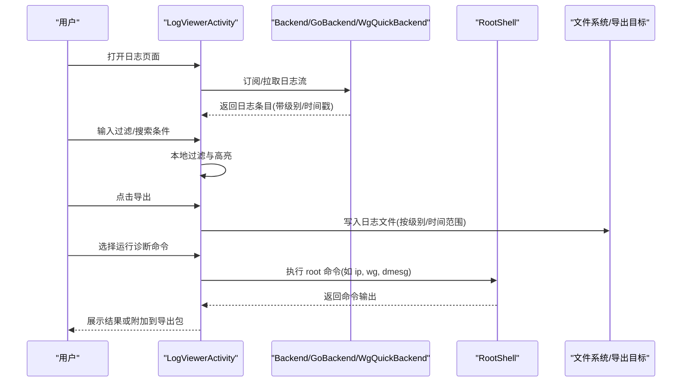
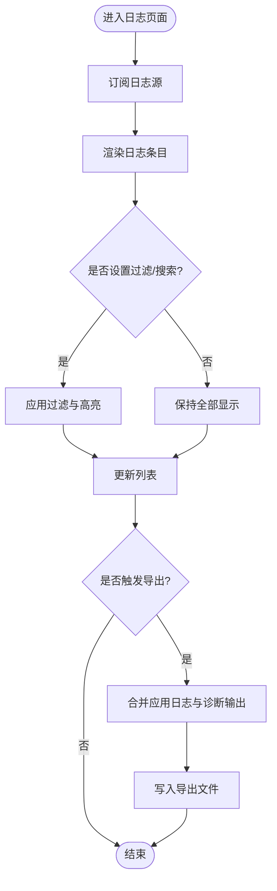
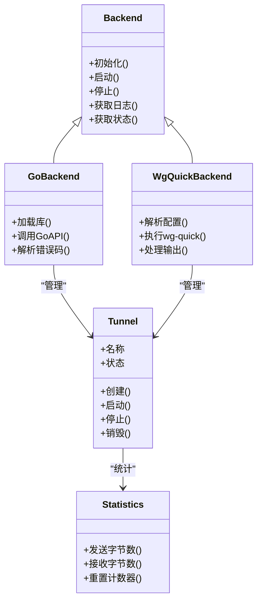
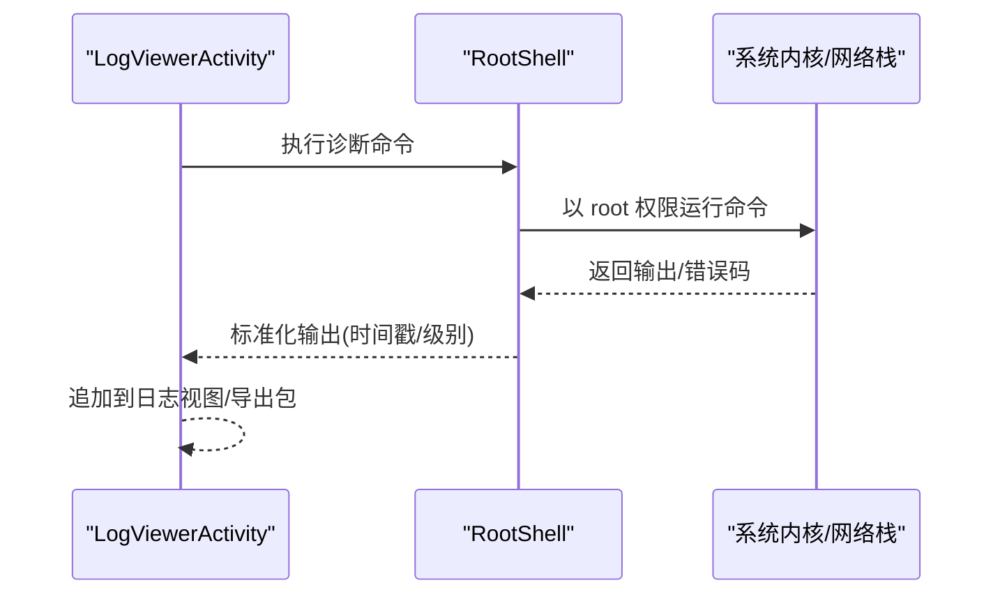
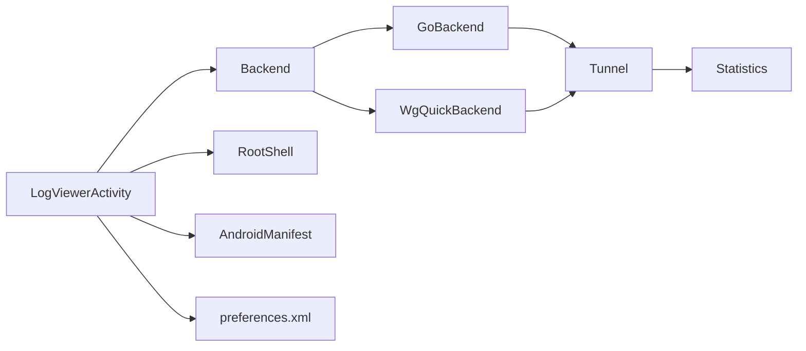

# 日志分析与调试

<cite>
**本文引用的文件**   
- [LogViewerActivity.kt](file://ui/src/main/java/com/wireguard/android/activity/LogViewerActivity.kt)
- [log_viewer_activity.xml](file://ui/src/main/res/layout/log_viewer_activity.xml)
- [log_viewer_entry.xml](file://ui/src/main/res/layout/log_viewer_entry.xml)
- [log_viewer.xml](file://ui/src/main/res/menu/log_viewer.xml)
- [logviewer_colors.xml](file://ui/src/main/res/values/logviewer_colors.xml)
- [RootShell.java](file://tunnel/src/main/java/com/wireguard/android/util/RootShell.java)
- [Backend.java](file://tunnel/src/main/java/com/wireguard/android/backend/Backend.java)
- [GoBackend.java](file://tunnel/src/main/java/com/wireguard/android/backend/GoBackend.java)
- [WgQuickBackend.java](file://tunnel/src/main/java/com/wireguard/android/backend/WgQuickBackend.java)
- [Tunnel.java](file://tunnel/src/main/java/com/wireguard/android/backend/Tunnel.java)
- [Statistics.java](file://tunnel/src/main/java/com/wireguard/android/backend/Statistics.java)
- [SettingsActivity.kt](file://ui/src/main/java/com/wireguard/android/activity/SettingsActivity.kt)
- [preferences.xml](file://ui/src/main/res/xml/preferences.xml)
- [AndroidManifest.xml](file://ui/src/main/AndroidManifest.xml)
</cite>

## 目录
1. [简介](#简介)
2. [项目结构](#项目结构)
3. [核心组件](#核心组件)
4. [架构总览](#架构总览)
5. [详细组件分析](#详细组件分析)
6. [依赖关系分析](#依赖关系分析)
7. [性能考虑](#性能考虑)
8. [故障排查指南](#故障排查指南)
9. [结论](#结论)
10. [附录](#附录)

## 简介
本指南面向 WireGuard Android 的开发者与高级用户，聚焦于日志分析与调试实践。内容涵盖：
- LogViewer 功能的使用说明（过滤、搜索、导出）
- 日志级别含义与重要性判断标准
- 关键日志信息的解读方法与常见问题识别技巧
- 如何启用详细调试模式并获取系统级日志
- RootShell 命令使用与常用诊断命令
- 日志分析工具与第三方调试工具的集成方法
- 常见错误日志的模式匹配与自动诊断规则
- 日志轮转与存储管理的配置选项

## 项目结构
与日志和调试相关的关键位置如下：
- UI 层：LogViewerActivity 及其布局、菜单、颜色资源
- 隧道后端：Backend/GoBackend/WgQuickBackend/Tunnel/Statistics 等负责日志输出与状态上报
- 系统交互：RootShell 用于执行 root 权限的诊断命令
- 设置项：SettingsActivity 与 preferences.xml 提供调试开关与行为配置
- 清单：AndroidManifest.xml 声明 Activity、权限与服务

**图表来源** 
- [LogViewerActivity.kt](file://ui/src/main/java/com/wireguard/android/activity/LogViewerActivity.kt)
- [log_viewer_activity.xml](file://ui/src/main/res/layout/log_viewer_activity.xml)
- [log_viewer.xml](file://ui/src/main/res/menu/log_viewer.xml)
- [logviewer_colors.xml](file://ui/src/main/res/values/logviewer_colors.xml)
- [Backend.java](file://tunnel/src/main/java/com/wireguard/android/backend/Backend.java)
- [GoBackend.java](file://tunnel/src/main/java/com/wireguard/android/backend/GoBackend.java)
- [WgQuickBackend.java](file://tunnel/src/main/java/com/wireguard/android/backend/WgQuickBackend.java)
- [Tunnel.java](file://tunnel/src/main/java/com/wireguard/android/backend/Tunnel.java)
- [Statistics.java](file://tunnel/src/main/java/com/wireguard/android/backend/Statistics.java)
- [RootShell.java](file://tunnel/src/main/java/com/wireguard/android/util/RootShell.java)
- [SettingsActivity.kt](file://ui/src/main/java/com/wireguard/android/activity/SettingsActivity.kt)
- [preferences.xml](file://ui/src/main/res/xml/preferences.xml)
- [AndroidManifest.xml](file://ui/src/main/AndroidManifest.xml)

**章节来源**
- [LogViewerActivity.kt](file://ui/src/main/java/com/wireguard/android/activity/LogViewerActivity.kt)
- [log_viewer_activity.xml](file://ui/src/main/res/layout/log_viewer_activity.xml)
- [log_viewer.xml](file://ui/src/main/res/menu/log_viewer.xml)
- [logviewer_colors.xml](file://ui/src/main/res/values/logviewer_colors.xml)
- [Backend.java](file://tunnel/src/main/java/com/wireguard/android/backend/Backend.java)
- [GoBackend.java](file://tunnel/src/main/java/com/wireguard/android/backend/GoBackend.java)
- [WgQuickBackend.java](file://tunnel/src/main/java/com/wireguard/android/backend/WgQuickBackend.java)
- [Tunnel.java](file://tunnel/src/main/java/com/wireguard/android/backend/Tunnel.java)
- [Statistics.java](file://tunnel/src/main/java/com/wireguard/android/backend/Statistics.java)
- [RootShell.java](file://tunnel/src/main/java/com/wireguard/android/util/RootShell.java)
- [SettingsActivity.kt](file://ui/src/main/java/com/wireguard/android/activity/SettingsActivity.kt)
- [preferences.xml](file://ui/src/main/res/xml/preferences.xml)
- [AndroidManifest.xml](file://ui/src/main/AndroidManifest.xml)

## 核心组件
- LogViewerActivity：提供日志查看、过滤、搜索、导出的主界面与交互逻辑
- Backend/GoBackend/WgQuickBackend：封装底层 Go 实现与 wg-quick 接口，负责日志采集与状态上报
- Tunnel/Statistics：隧道生命周期与统计信息，支撑“连接状态”“流量统计”等关键日志
- RootShell：以 root 权限执行系统命令，辅助定位内核/网络栈问题
- SettingsActivity/preferences.xml：提供调试开关、日志级别、导出路径等配置入口
- AndroidManifest.xml：声明必要的权限与组件，确保日志读取与导出可用

**章节来源**
- [LogViewerActivity.kt](file://ui/src/main/java/com/wireguard/android/activity/LogViewerActivity.kt)
- [Backend.java](file://tunnel/src/main/java/com/wireguard/android/backend/Backend.java)
- [GoBackend.java](file://tunnel/src/main/java/com/wireguard/android/backend/GoBackend.java)
- [WgQuickBackend.java](file://tunnel/src/main/java/com/wireguard/android/backend/WgQuickBackend.java)
- [Tunnel.java](file://tunnel/src/main/java/com/wireguard/android/backend/Tunnel.java)
- [Statistics.java](file://tunnel/src/main/java/com/wireguard/android/backend/Statistics.java)
- [RootShell.java](file://tunnel/src/main/java/com/wireguard/android/util/RootShell.java)
- [SettingsActivity.kt](file://ui/src/main/java/com/wireguard/android/activity/SettingsActivity.kt)
- [preferences.xml](file://ui/src/main/res/xml/preferences.xml)
- [AndroidManifest.xml](file://ui/src/main/AndroidManifest.xml)

## 架构总览
LogViewer 通过 UI 层发起操作，调用后端接口获取日志与状态；在需要时借助 RootShell 执行诊断命令；设置项控制日志级别与导出行为。

**图表来源** 
- [LogViewerActivity.kt](file://ui/src/main/java/com/wireguard/android/activity/LogViewerActivity.kt)
- [Backend.java](file://tunnel/src/main/java/com/wireguard/android/backend/Backend.java)
- [GoBackend.java](file://tunnel/src/main/java/com/wireguard/android/backend/GoBackend.java)
- [WgQuickBackend.java](file://tunnel/src/main/java/com/wireguard/android/backend/WgQuickBackend.java)
- [RootShell.java](file://tunnel/src/main/java/com/wireguard/android/util/RootShell.java)

## 详细组件分析

### LogViewerActivity：日志查看与导出
- 功能要点
  - 实时显示日志条目，支持按级别、关键字、时间范围过滤
  - 支持全文搜索与高亮匹配
  - 支持将当前视图或全量日志导出为文件（可包含系统诊断输出）
  - 根据 logviewer_colors.xml 对级别进行着色
- 交互流程
  - 进入页面后订阅后端日志源
  - 监听搜索框与过滤菜单变化，更新列表
  - 导出时合并应用日志与可选的系统命令输出
- 注意事项
  - 大量日志时注意内存与滚动性能
  - 导出前建议先过滤以减少体积
  - 导出路径需具备写入权限

**图表来源** 
- [LogViewerActivity.kt](file://ui/src/main/java/com/wireguard/android/activity/LogViewerActivity.kt)
- [log_viewer_activity.xml](file://ui/src/main/res/layout/log_viewer_activity.xml)
- [log_viewer.xml](file://ui/src/main/res/menu/log_viewer.xml)
- [logviewer_colors.xml](file://ui/src/main/res/values/logviewer_colors.xml)

**章节来源**
- [LogViewerActivity.kt](file://ui/src/main/java/com/wireguard/android/activity/LogViewerActivity.kt)
- [log_viewer_activity.xml](file://ui/src/main/res/layout/log_viewer_activity.xml)
- [log_viewer.xml](file://ui/src/main/res/menu/log_viewer.xml)
- [logviewer_colors.xml](file://ui/src/main/res/values/logviewer_colors.xml)

### 后端与隧道：日志来源与状态
- Backend/GoBackend/WgQuickBackend
  - 封装与 Go 实现的 JNI 调用以及 wg-quick 脚本交互
  - 负责将底层事件转换为结构化日志条目（含级别、模块、消息）
- Tunnel/Statistics
  - 管理隧道生命周期（创建、启动、停止、销毁）
  - 提供连接状态、流量计数、错误码等关键指标，便于快速定位问题

**图表来源** 
- [Backend.java](file://tunnel/src/main/java/com/wireguard/android/backend/Backend.java)
- [GoBackend.java](file://tunnel/src/main/java/com/wireguard/android/backend/GoBackend.java)
- [WgQuickBackend.java](file://tunnel/src/main/java/com/wireguard/android/backend/WgQuickBackend.java)
- [Tunnel.java](file://tunnel/src/main/java/com/wireguard/android/backend/Tunnel.java)
- [Statistics.java](file://tunnel/src/main/java/com/wireguard/android/backend/Statistics.java)

**章节来源**
- [Backend.java](file://tunnel/src/main/java/com/wireguard/android/backend/Backend.java)
- [GoBackend.java](file://tunnel/src/main/java/com/wireguard/android/backend/GoBackend.java)
- [WgQuickBackend.java](file://tunnel/src/main/java/com/wireguard/android/backend/WgQuickBackend.java)
- [Tunnel.java](file://tunnel/src/main/java/com/wireguard/android/backend/Tunnel.java)
- [Statistics.java](file://tunnel/src/main/java/com/wireguard/android/backend/Statistics.java)

### RootShell：系统级诊断
- 用途
  - 以 root 权限执行系统命令，如查询路由表、接口状态、内核日志等
- 常用命令示例（建议在 LogViewer 中直接执行并附加到导出包）
  - 网络与接口：ip addr, ip route, ip rule, ip neigh
  - WireGuard：wg show, wg showconf
  - 内核与系统：dmesg, cat /proc/net/if_inet6, lsmod | grep wireguard
  - DNS/防火墙：cat /etc/resolv.conf, iptables -L -n -v
- 安全提示
  - 仅在必要时启用 root 命令执行
  - 避免泄露敏感信息（密钥、私网地址）

**图表来源** 
- [RootShell.java](file://tunnel/src/main/java/com/wireguard/android/util/RootShell.java)
- [LogViewerActivity.kt](file://ui/src/main/java/com/wireguard/android/activity/LogViewerActivity.kt)

**章节来源**
- [RootShell.java](file://tunnel/src/main/java/com/wireguard/android/util/RootShell.java)
- [LogViewerActivity.kt](file://ui/src/main/java/com/wireguard/android/activity/LogViewerActivity.kt)

### 设置与调试开关
- SettingsActivity/preferences.xml
  - 提供日志级别、导出路径、是否包含系统诊断输出等开关
  - 建议开启“详细调试模式”以捕获更多上下文信息
- AndroidManifest.xml
  - 声明必要的权限（如读取系统日志、外部存储写入）
  - 确保 LogViewerActivity 可被正确启动

**章节来源**
- [SettingsActivity.kt](file://ui/src/main/java/com/wireguard/android/activity/SettingsActivity.kt)
- [preferences.xml](file://ui/src/main/res/xml/preferences.xml)
- [AndroidManifest.xml](file://ui/src/main/AndroidManifest.xml)

## 依赖关系分析
- UI 层依赖后端接口获取日志与状态
- 后端依赖 Go 实现与 wg-quick 脚本
- RootShell 作为独立工具类，供 UI 层按需调用
- 设置项影响日志级别与导出行为

**图表来源** 
- [LogViewerActivity.kt](file://ui/src/main/java/com/wireguard/android/activity/LogViewerActivity.kt)
- [Backend.java](file://tunnel/src/main/java/com/wireguard/android/backend/Backend.java)
- [GoBackend.java](file://tunnel/src/main/java/com/wireguard/android/backend/GoBackend.java)
- [WgQuickBackend.java](file://tunnel/src/main/java/com/wireguard/android/backend/WgQuickBackend.java)
- [Tunnel.java](file://tunnel/src/main/java/com/wireguard/android/backend/Tunnel.java)
- [Statistics.java](file://tunnel/src/main/java/com/wireguard/android/backend/Statistics.java)
- [RootShell.java](file://tunnel/src/main/java/com/wireguard/android/util/RootShell.java)
- [AndroidManifest.xml](file://ui/src/main/AndroidManifest.xml)
- [preferences.xml](file://ui/src/main/res/xml/preferences.xml)

**章节来源**
- [LogViewerActivity.kt](file://ui/src/main/java/com/wireguard/android/activity/LogViewerActivity.kt)
- [Backend.java](file://tunnel/src/main/java/com/wireguard/android/backend/Backend.java)
- [GoBackend.java](file://tunnel/src/main/java/com/wireguard/android/backend/GoBackend.java)
- [WgQuickBackend.java](file://tunnel/src/main/java/com/wireguard/android/backend/WgQuickBackend.java)
- [Tunnel.java](file://tunnel/src/main/java/com/wireguard/android/backend/Tunnel.java)
- [Statistics.java](file://tunnel/src/main/java/com/wireguard/android/backend/Statistics.java)
- [RootShell.java](file://tunnel/src/main/java/com/wireguard/android/util/RootShell.java)
- [AndroidManifest.xml](file://ui/src/main/AndroidManifest.xml)
- [preferences.xml](file://ui/src/main/res/xml/preferences.xml)

## 性能考虑
- 日志渲染
  - 采用虚拟列表与增量更新，避免一次性加载全部条目
  - 过滤与搜索应在后台线程执行，避免阻塞 UI
- 导出优化
  - 优先导出过滤后的片段，减少 I/O 压力
  - 大文件分块写入，避免 OOM
- 系统命令
  - 限制并发执行的诊断命令数量，避免系统负载过高
  - 对命令输出做截断与去重，降低内存占用

[本节为通用指导，不直接分析具体文件]

## 故障排查指南
- 常见错误日志模式与诊断规则
  - “无法加载库/符号未找到”：检查 Go 库加载与 ABI 匹配
  - “权限不足”：确认已授予必要权限，或在受控环境下执行 RootShell
  - “DNS 解析失败”：检查 resolv.conf 与上游 DNS 可达性
  - “路由冲突/默认路由异常”：核对 ip route 与策略路由
  - “握手失败/密钥错误”：核对配置文件中的公钥与预共享密钥
- 自动诊断建议
  - 在导出包中自动附加 ip/wg/dmesg 的输出片段
  - 对高频错误关键词进行标记与聚合统计
- 系统级日志获取
  - 通过 RootShell 执行 dmesg 与内核相关命令
  - 结合系统日志查看器（如 Logcat）交叉验证

**章节来源**
- [RootShell.java](file://tunnel/src/main/java/com/wireguard/android/util/RootShell.java)
- [LogViewerActivity.kt](file://ui/src/main/java/com/wireguard/android/activity/LogViewerActivity.kt)
- [Backend.java](file://tunnel/src/main/java/com/wireguard/android/backend/Backend.java)
- [GoBackend.java](file://tunnel/src/main/java/com/wireguard/android/backend/GoBackend.java)
- [WgQuickBackend.java](file://tunnel/src/main/java/com/wireguard/android/backend/WgQuickBackend.java)
- [Tunnel.java](file://tunnel/src/main/java/com/wireguard/android/backend/Tunnel.java)
- [Statistics.java](file://tunnel/src/main/java/com/wireguard/android/backend/Statistics.java)

## 结论
通过 LogViewer 与 RootShell 的组合，WireGuard Android 提供了从应用层到系统层的完整调试能力。合理设置日志级别、使用过滤与导出功能，并结合系统诊断命令，可以高效定位连接、路由、DNS 与内核相关问题。建议在生产环境中谨慎启用详细调试模式，并在导出包中去除敏感信息。

[本节为总结性内容，不直接分析具体文件]

## 附录
- 日志级别含义与重要性判断
  - 致命/错误：立即关注，通常伴随连接失败或崩溃风险
  - 警告：潜在问题，需尽快核查配置或环境
  - 信息：正常流程记录，有助于理解行为
  - 调试/详细：仅调试阶段启用，数据量大且可能包含敏感信息
- 日志轮转与存储管理
  - 在设置中配置最大日志大小与保留天数
  - 导出后自动清理临时文件，避免存储空间耗尽
  - 建议将导出文件保存到外部存储或云盘以便分享

[本节为通用指导，不直接分析具体文件]