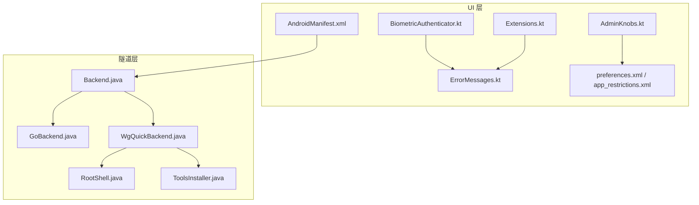
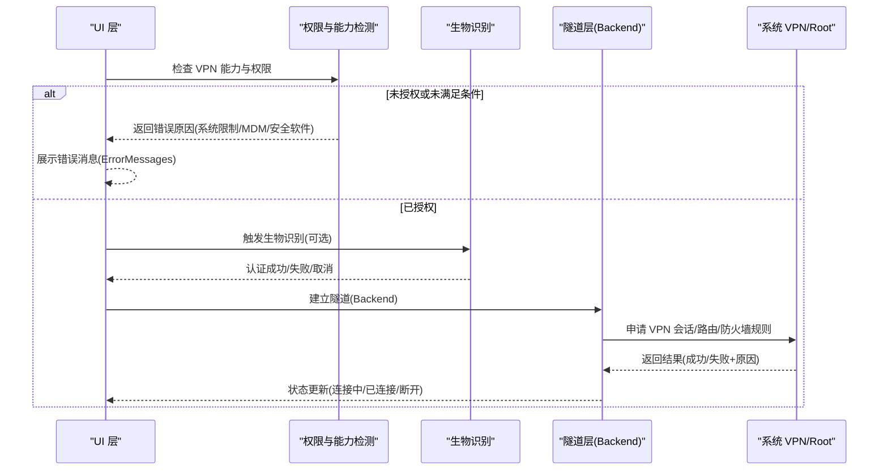
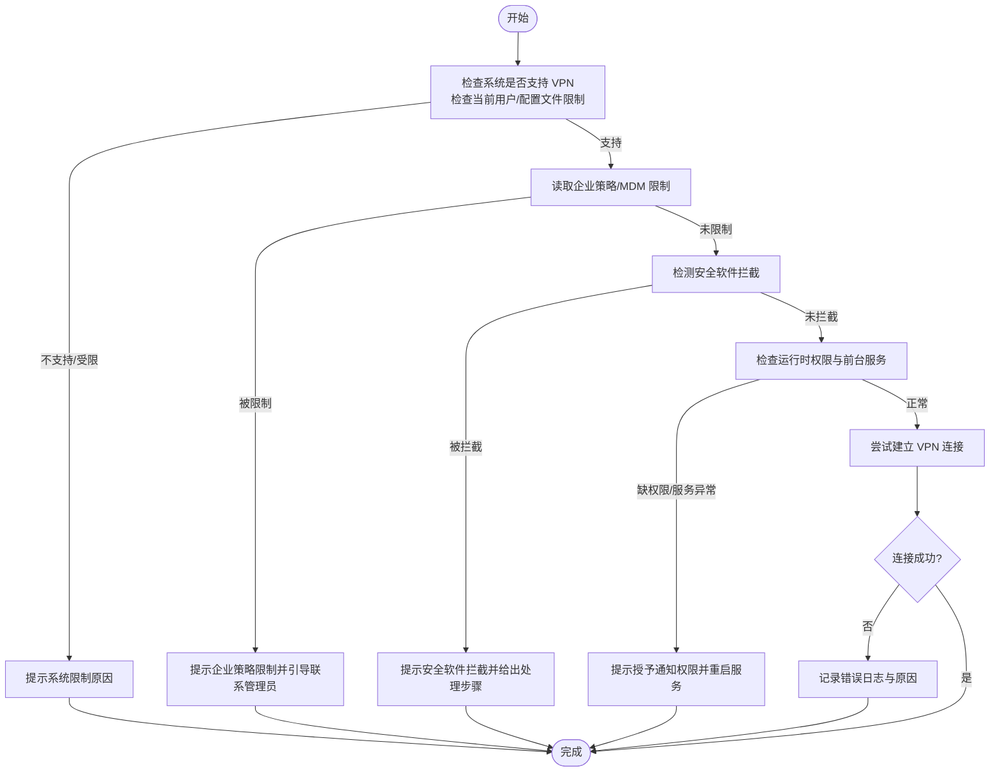
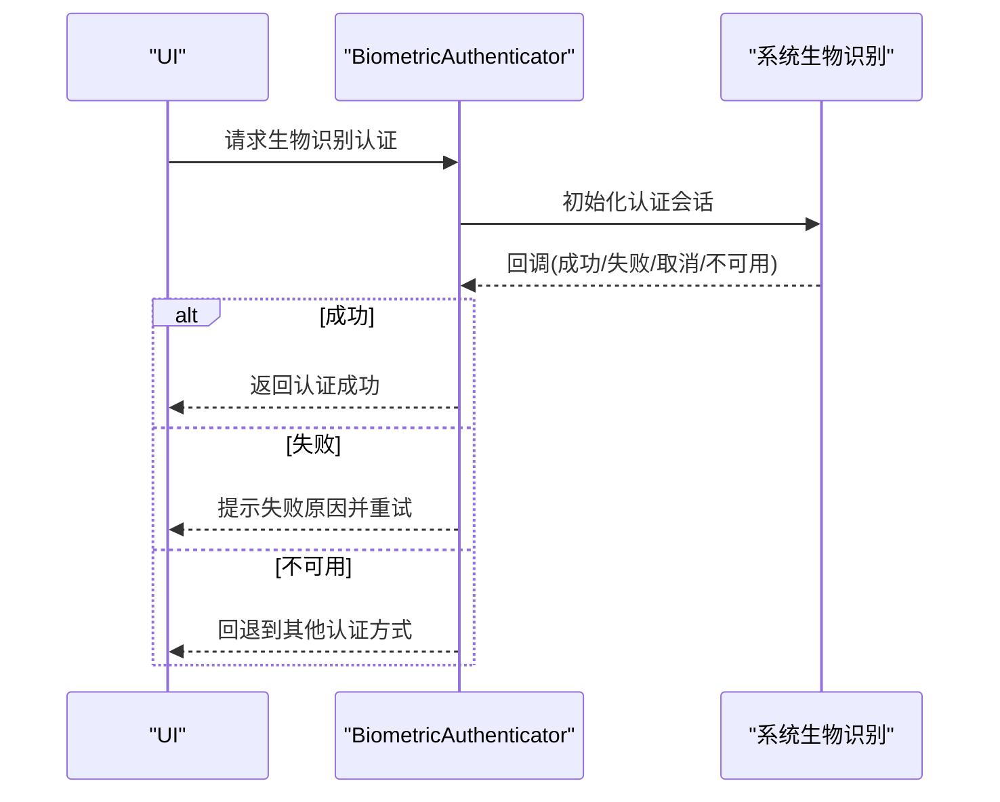
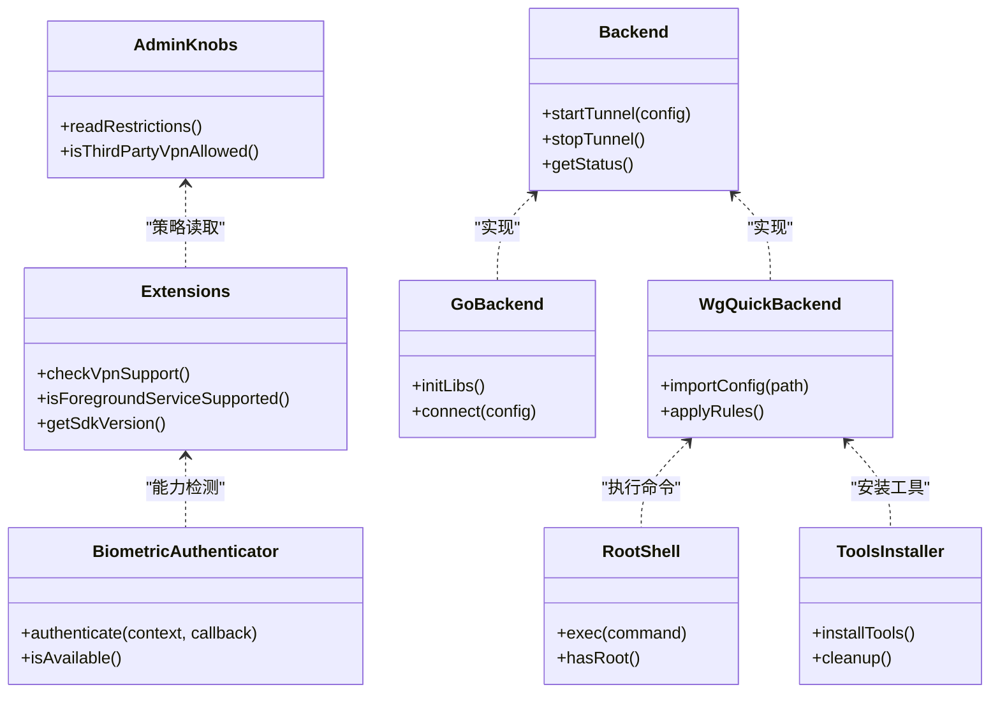

# 权限与安全相关问题

<cite>
**本文引用的文件**   
- [AndroidManifest.xml](file://ui/src/main/AndroidManifest.xml)
- [BiometricAuthenticator.kt](file://ui/src/main/java/com/wireguard/android/util/BiometricAuthenticator.kt)
- [AdminKnobs.kt](file://ui/src/main/java/com/wireguard/android/util/AdminKnobs.kt)
- [ErrorMessages.kt](file://ui/src/main/java/com/wireguard/android/util/ErrorMessages.kt)
- [Extensions.kt](file://ui/src/main/java/com/wireguard/android/util/Extensions.kt)
- [TunnelManager.kt](file://ui/src/main/java/com/wireguard/android/model/TunnelManager.kt)
- [Backend.java](file://tunnel/src/main/java/com/wireguard/android/backend/Backend.java)
- [GoBackend.java](file://tunnel/src/main/java/com/wireguard/android/backend/GoBackend.java)
- [WgQuickBackend.java](file://tunnel/src/main/java/com/wireguard/android/backend/WgQuickBackend.java)
- [RootShell.java](file://tunnel/src/main/java/com/wireguard/android/util/RootShell.java)
- [ToolsInstaller.java](file://tunnel/src/main/java/com/wireguard/android/util/ToolsInstaller.java)
- [AppRestrictionsXml](file://ui/src/main/res/xml/app_restrictions.xml)
- [PreferencesXml](file://ui/src/main/res/xml/preferences.xml)
- [strings.xml](file://ui/src/main/res/values-zh-rCN/strings.xml)
</cite>

## 目录
1. [简介](#简介)
2. [项目结构](#项目结构)
3. [核心组件](#核心组件)
4. [架构总览](#架构总览)
5. [详细组件分析](#详细组件分析)
6. [依赖关系分析](#依赖关系分析)
7. [性能与稳定性考虑](#性能与稳定性考虑)
8. [故障排除指南](#故障排除指南)
9. [结论](#结论)
10. [附录：合规检查清单与最佳实践](#附录合规检查清单与最佳实践)

## 简介
本文件面向 WireGuard Android 的权限与安全相关问题排查，覆盖以下主题：
- VPN 权限授予失败的原因与解决方法（系统限制、企业策略、安全软件拦截等）
- 生物识别认证失败的处理流程与排障步骤
- 网络安全相关警告与提示的含义及处理方式
- 不同 Android 版本的权限模型差异与适配方法
- 安全扫描与漏洞检测结果的处理方法
- 安全配置最佳实践与合规性检查清单
- 敏感数据保护与隐私设置配置指南
- 安全更新与证书验证相关问题

## 项目结构
与权限和安全相关的代码主要分布在 UI 层与隧道后端层：
- UI 层负责用户交互、权限请求、生物识别、错误信息展示、偏好设置与企业策略读取
- 隧道层负责与系统 VPN 服务交互、内核模块加载、工具安装与 Root 操作

**图表来源** 
- [AndroidManifest.xml](file://ui/src/main/AndroidManifest.xml)
- [BiometricAuthenticator.kt](file://ui/src/main/java/com/wireguard/android/util/BiometricAuthenticator.kt)
- [AdminKnobs.kt](file://ui/src/main/java/com/wireguard/android/util/AdminKnobs.kt)
- [ErrorMessages.kt](file://ui/src/main/java/com/wireguard/android/util/ErrorMessages.kt)
- [Extensions.kt](file://ui/src/main/java/com/wireguard/android/util/Extensions.kt)
- [Backend.java](file://tunnel/src/main/java/com/wireguard/android/backend/Backend.java)
- [GoBackend.java](file://tunnel/src/main/java/com/wireguard/android/backend/GoBackend.java)
- [WgQuickBackend.java](file://tunnel/src/main/java/com/wireguard/android/backend/WgQuickBackend.java)
- [RootShell.java](file://tunnel/src/main/java/com/wireguard/android/util/RootShell.java)
- [ToolsInstaller.java](file://tunnel/src/main/java/com/wireguard/android/util/ToolsInstaller.java)
- [PreferencesXml](file://ui/src/main/res/xml/preferences.xml)
- [AppRestrictionsXml](file://ui/src/main/res/xml/app_restrictions.xml)

**章节来源**
- [AndroidManifest.xml](file://ui/src/main/AndroidManifest.xml)
- [Backend.java](file://tunnel/src/main/java/com/wireguard/android/backend/Backend.java)
- [WgQuickBackend.java](file://tunnel/src/main/java/com/wireguard/android/backend/WgQuickBackend.java)

## 核心组件
- 权限与系统交互
  - AndroidManifest.xml：声明 VPN 权限、通知权限、前台服务、启动项等
  - Extensions.kt：封装系统能力检测（如是否支持 VPN、是否可创建 VPN 服务）
  - ErrorMessages.kt：统一错误消息与本地化文案
- 生物识别认证
  - BiometricAuthenticator.kt：调用系统生物识别 API，处理成功/失败/取消等回调
- 企业策略与管理员限制
  - AdminKnobs.kt：读取设备管理员或 MDM 限制，影响功能开关
  - preferences.xml / app_restrictions.xml：定义偏好与企业策略键值
- 隧道与 Root 工具
  - Backend.java / GoBackend.java / WgQuickBackend.java：封装 VPN 生命周期与内核接口
  - RootShell.java / ToolsInstaller.java：执行 Root 命令、安装/清理工具库

**章节来源**
- [AndroidManifest.xml](file://ui/src/main/AndroidManifest.xml)
- [Extensions.kt](file://ui/src/main/java/com/wireguard/android/util/Extensions.kt)
- [ErrorMessages.kt](file://ui/src/main/java/com/wireguard/android/util/ErrorMessages.kt)
- [BiometricAuthenticator.kt](file://ui/src/main/java/com/wireguard/android/util/BiometricAuthenticator.kt)
- [AdminKnobs.kt](file://ui/src/main/java/com/wireguard/android/util/AdminKnobs.kt)
- [PreferencesXml](file://ui/src/main/res/xml/preferences.xml)
- [AppRestrictionsXml](file://ui/src/main/res/xml/app_restrictions.xml)
- [Backend.java](file://tunnel/src/main/java/com/wireguard/android/backend/Backend.java)
- [GoBackend.java](file://tunnel/src/main/java/com/wireguard/android/backend/GoBackend.java)
- [WgQuickBackend.java](file://tunnel/src/main/java/com/wireguard/android/backend/WgQuickBackend.java)
- [RootShell.java](file://tunnel/src/main/java/com/wireguard/android/util/RootShell.java)
- [ToolsInstaller.java](file://tunnel/src/main/java/com/wireguard/android/util/ToolsInstaller.java)

## 架构总览
WireGuard Android 的权限与安全关键路径如下：
- UI 发起 VPN 连接请求，先进行权限与能力检测
- 若需要生物识别，则通过 BiometricAuthenticator 完成认证
- 通过后进入隧道层，由 Backend/GoBackend/WgQuickBackend 与系统 VPN 服务交互
- 如需 Root 权限或安装工具，则由 RootShell/ToolsInstaller 执行

**图表来源** 
- [Extensions.kt](file://ui/src/main/java/com/wireguard/android/util/Extensions.kt)
- [ErrorMessages.kt](file://ui/src/main/java/com/wireguard/android/util/ErrorMessages.kt)
- [BiometricAuthenticator.kt](file://ui/src/main/java/com/wireguard/android/util/BiometricAuthenticator.kt)
- [Backend.java](file://tunnel/src/main/java/com/wireguard/android/backend/Backend.java)
- [GoBackend.java](file://tunnel/src/main/java/com/wireguard/android/backend/GoBackend.java)
- [WgQuickBackend.java](file://tunnel/src/main/java/com/wireguard/android/backend/WgQuickBackend.java)

## 详细组件分析

### VPN 权限授予失败：原因与解决
常见原因分类：
- 系统限制
  - 设备不支持 VPN 或当前用户/配置文件不允许创建 VPN
  - 应用被禁用或处于受限用户模式
- 企业策略/MDM
  - 管理员禁止第三方 VPN 或要求使用指定 VPN
  - 应用未被加入白名单或签名校验失败
- 安全软件拦截
  - 防病毒/家长控制/沙箱阻止 VPN 创建或网络访问
- 运行时权限与前台服务
  - 缺少通知权限导致无法显示“正在运行”的通知
  - 后台启动限制（Doze、省电模式）导致服务被终止

定位与修复建议：
- 在 UI 层调用能力检测，确认系统是否允许创建 VPN 服务
- 检查企业策略键值，必要时引导用户联系管理员
- 对安全软件，提示用户添加信任或关闭拦截
- 确保通知权限已授予，并在 Android 8.0+ 正确启动前台服务
- 记录并展示具体错误码/消息，便于用户理解

**图表来源** 
- [Extensions.kt](file://ui/src/main/java/com/wireguard/android/util/Extensions.kt)
- [AdminKnobs.kt](file://ui/src/main/java/com/wireguard/android/util/AdminKnobs.kt)
- [ErrorMessages.kt](file://ui/src/main/java/com/wireguard/android/util/ErrorMessages.kt)

**章节来源**
- [Extensions.kt](file://ui/src/main/java/com/wireguard/android/util/Extensions.kt)
- [AdminKnobs.kt](file://ui/src/main/java/com/wireguard/android/util/AdminKnobs.kt)
- [ErrorMessages.kt](file://ui/src/main/java/com/wireguard/android/util/ErrorMessages.kt)

### 生物识别认证失败：处理流程与排障
触发场景：
- 首次启用敏感操作（如导入密钥、修改关键配置）前需生物识别
- 设备无生物识别硬件或传感器不可用

处理流程：
- 调用系统生物识别 API，处理成功、失败、取消、硬件不可用等回调
- 失败时提供重试次数上限与友好提示
- 硬件不可用时回退到密码/PIN 或其他受支持的认证方式

排障要点：
- 确认生物识别已录入且可用
- 检查应用是否有必要权限（部分厂商会限制生物识别权限）
- 避免在锁屏状态下频繁触发导致锁定
- 记录失败原因以便后续诊断

**图表来源** 
- [BiometricAuthenticator.kt](file://ui/src/main/java/com/wireguard/android/util/BiometricAuthenticator.kt)

**章节来源**
- [BiometricAuthenticator.kt](file://ui/src/main/java/com/wireguard/android/util/BiometricAuthenticator.kt)

### 网络安全相关警告与提示
常见警告类型：
- 未启用“始终开启的 VPN”时的流量泄露风险
- 非加密传输或弱加密套件
- 证书链不完整或不受信任
- 路由规则冲突导致部分流量绕过 VPN

处理方式：
- 在 UI 中明确提示风险并提供一键修复（如启用始终开启、修正路由）
- 对证书问题，引导用户更新 CA 或重新导入配置
- 对路由冲突，自动调整规则或提示用户卸载冲突应用

**章节来源**
- [ErrorMessages.kt](file://ui/src/main/java/com/wireguard/android/util/ErrorMessages.kt)
- [Extensions.kt](file://ui/src/main/java/com/wireguard/android/util/Extensions.kt)

### 不同 Android 版本的权限模型差异与适配
版本差异要点：
- Android 8.0+ 要求前台服务必须显示通知
- Android 10+ 对后台启动限制更严格，需使用显式意图或系统入口
- Android 11+ 对包可见性与系统 API 访问更严格
- Android 12+ 对位置权限与精确位置的限制增强（若涉及网络诊断）

适配方法：
- 根据 Build.VERSION.SDK_INT 分支处理
- 使用兼容性封装（Extensions.kt）屏蔽差异
- 对用户可见的操作（如启动服务）采用系统推荐入口

**章节来源**
- [Extensions.kt](file://ui/src/main/java/com/wireguard/android/util/Extensions.kt)
- [AndroidManifest.xml](file://ui/src/main/AndroidManifest.xml)

### 安全扫描与漏洞检测结果处理
处理方法：
- 将扫描结果分类为严重/高危/中危/低危
- 对严重问题立即阻断相关功能并提示用户
- 对可修复问题提供一键修复或升级指引
- 记录扫描时间、版本、设备信息与复现步骤

**章节来源**
- [ErrorMessages.kt](file://ui/src/main/java/com/wireguard/android/util/ErrorMessages.kt)

### 安全配置最佳实践与合规性检查清单
最佳实践：
- 最小权限原则：仅申请必要权限
- 默认安全：默认启用强加密与证书校验
- 透明提示：对关键操作进行风险提示与二次确认
- 审计日志：记录关键事件但不包含敏感数据

合规检查清单：
- 权限声明与使用说明一致
- 企业策略兼容性与白名单配置
- 证书链完整与可信根更新机制
- 数据最小化与本地存储加密

**章节来源**
- [PreferencesXml](file://ui/src/main/res/xml/preferences.xml)
- [AppRestrictionsXml](file://ui/src/main/res/xml/app_restrictions.xml)

### 敏感数据保护与隐私设置
保护措施：
- 密钥与私钥本地加密存储
- 不上传敏感数据至云端
- 日志脱敏，避免记录密钥与身份信息
- 提供隐私开关（如禁用遥测、限制日志级别）

配置指南：
- 在偏好设置中提供“隐私模式”开关
- 默认关闭非必要的数据收集
- 提供导出/清除敏感数据的入口

**章节来源**
- [PreferencesXml](file://ui/src/main/res/xml/preferences.xml)
- [ErrorMessages.kt](file://ui/src/main/java/com/wireguard/android/util/ErrorMessages.kt)

### 安全更新与证书验证相关问题
常见问题：
- 证书过期或根证书未更新
- 更新通道被安全软件拦截
- 签名校验失败导致无法安装新版本

处理方法：
- 提示用户更新系统 CA 或手动导入证书
- 引导用户从官方渠道下载更新
- 记录签名校验失败的具体原因与设备信息

**章节来源**
- [ErrorMessages.kt](file://ui/src/main/java/com/wireguard/android/util/ErrorMessages.kt)

## 依赖关系分析
组件间依赖关系如下：
- UI 层依赖 Extensions.kt 进行能力检测与版本适配
- BiometricAuthenticator.kt 依赖系统生物识别 API
- AdminKnobs.kt 依赖系统策略 API 与资源文件
- 隧道层依赖 Backend/GoBackend/WgQuickBackend 与系统 VPN 服务
- RootShell/ToolsInstaller 依赖 Root 权限与系统命令

**图表来源** 
- [Extensions.kt](file://ui/src/main/java/com/wireguard/android/util/Extensions.kt)
- [BiometricAuthenticator.kt](file://ui/src/main/java/com/wireguard/android/util/BiometricAuthenticator.kt)
- [AdminKnobs.kt](file://ui/src/main/java/com/wireguard/android/util/AdminKnobs.kt)
- [Backend.java](file://tunnel/src/main/java/com/wireguard/android/backend/Backend.java)
- [GoBackend.java](file://tunnel/src/main/java/com/wireguard/android/backend/GoBackend.java)
- [WgQuickBackend.java](file://tunnel/src/main/java/com/wireguard/android/backend/WgQuickBackend.java)
- [RootShell.java](file://tunnel/src/main/java/com/wireguard/android/util/RootShell.java)
- [ToolsInstaller.java](file://tunnel/src/main/java/com/wireguard/android/util/ToolsInstaller.java)

**章节来源**
- [Extensions.kt](file://ui/src/main/java/com/wireguard/android/util/Extensions.kt)
- [BiometricAuthenticator.kt](file://ui/src/main/java/com/wireguard/android/util/BiometricAuthenticator.kt)
- [AdminKnobs.kt](file://ui/src/main/java/com/wireguard/android/util/AdminKnobs.kt)
- [Backend.java](file://tunnel/src/main/java/com/wireguard/android/backend/Backend.java)
- [GoBackend.java](file://tunnel/src/main/java/com/wireguard/android/backend/GoBackend.java)
- [WgQuickBackend.java](file://tunnel/src/main/java/com/wireguard/android/backend/WgQuickBackend.java)
- [RootShell.java](file://tunnel/src/main/java/com/wireguard/android/util/RootShell.java)
- [ToolsInstaller.java](file://tunnel/src/main/java/com/wireguard/android/util/ToolsInstaller.java)

## 性能与稳定性考虑
- 减少不必要的 Root 调用与工具安装频率
- 缓存系统能力检测结果，避免重复检测
- 生物识别回调处理应避免阻塞主线程
- 隧道状态变更使用事件驱动，避免轮询

[本节为通用指导，无需特定文件引用]

## 故障排除指南
快速定位步骤：
- 查看错误消息（ErrorMessages.kt）中的本地化文案
- 检查系统能力（Extensions.kt）返回值
- 读取企业策略（AdminKnobs.kt）是否限制功能
- 确认生物识别可用性（BiometricAuthenticator.kt）
- 检查隧道状态与日志（Backend/GoBackend/WgQuickBackend）
- 验证 Root 权限与工具安装（RootShell/ToolsInstaller）

常见错误与处理：
- “无法创建 VPN 服务”：检查系统限制与企业策略
- “生物识别不可用”：回退到密码认证或引导用户录入
- “证书无效”：更新 CA 或重新导入配置
- “Root 权限不足”：引导用户授予 Root 或更换设备

**章节来源**
- [ErrorMessages.kt](file://ui/src/main/java/com/wireguard/android/util/ErrorMessages.kt)
- [Extensions.kt](file://ui/src/main/java/com/wireguard/android/util/Extensions.kt)
- [AdminKnobs.kt](file://ui/src/main/java/com/wireguard/android/util/AdminKnobs.kt)
- [BiometricAuthenticator.kt](file://ui/src/main/java/com/wireguard/android/util/BiometricAuthenticator.kt)
- [Backend.java](file://tunnel/src/main/java/com/wireguard/android/backend/Backend.java)
- [GoBackend.java](file://tunnel/src/main/java/com/wireguard/android/backend/GoBackend.java)
- [WgQuickBackend.java](file://tunnel/src/main/java/com/wireguard/android/backend/WgQuickBackend.java)
- [RootShell.java](file://tunnel/src/main/java/com/wireguard/android/util/RootShell.java)
- [ToolsInstaller.java](file://tunnel/src/main/java/com/wireguard/android/util/ToolsInstaller.java)

## 结论
通过系统化地分析权限与安全相关组件，可以准确定位 VPN 权限授予失败、生物识别认证失败、网络安全警告等问题。结合能力检测、企业策略读取、生物识别回调与隧道状态管理，能够为用户提供清晰的错误提示与修复指引。遵循最小权限、默认安全与透明提示的原则，有助于提升用户体验与合规性。

[本节为总结性内容，无需特定文件引用]

## 附录：合规检查清单与最佳实践
- 权限与隐私
  - 仅申请必要权限，并在设置中提供开关
  - 默认关闭非必要数据收集
  - 日志脱敏，避免记录敏感信息
- 安全配置
  - 强制强加密与证书校验
  - 提供“始终开启的 VPN”一键启用
  - 定期更新 CA 与证书链
- 企业环境
  - 兼容 MDM 策略与白名单
  - 提供管理员配置模板
- 更新与分发
  - 使用官方渠道发布更新
  - 签名校验失败时提供清晰提示

**章节来源**
- [PreferencesXml](file://ui/src/main/res/xml/preferences.xml)
- [AppRestrictionsXml](file://ui/src/main/res/xml/app_restrictions.xml)
- [ErrorMessages.kt](file://ui/src/main/java/com/wireguard/android/util/ErrorMessages.kt)