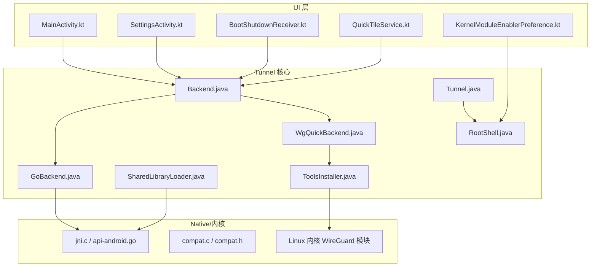
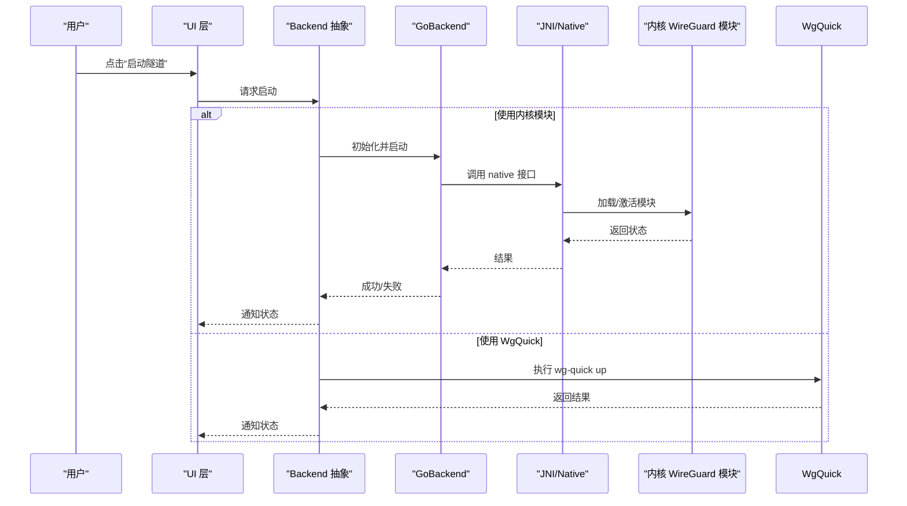
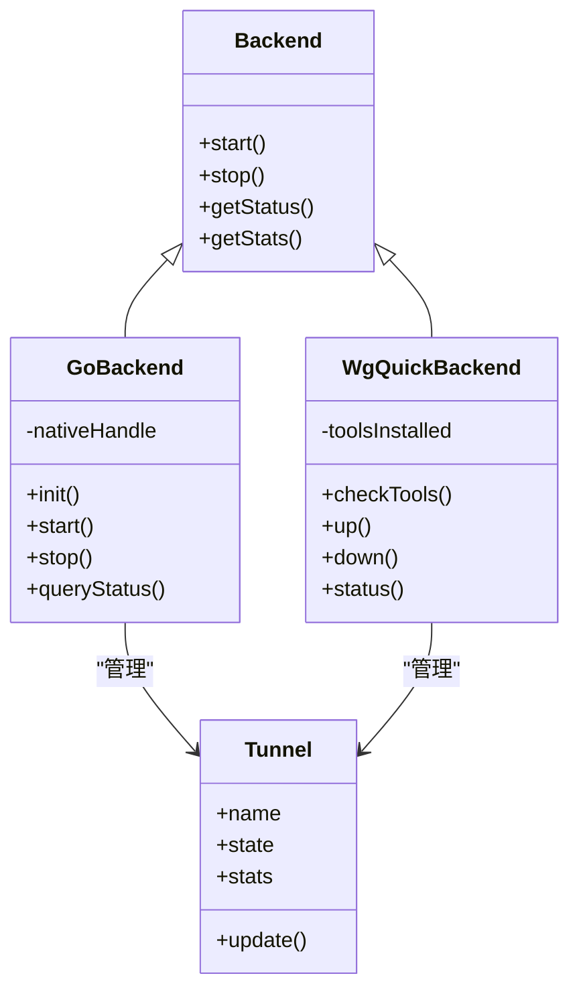
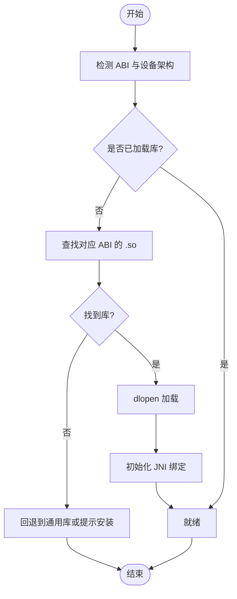
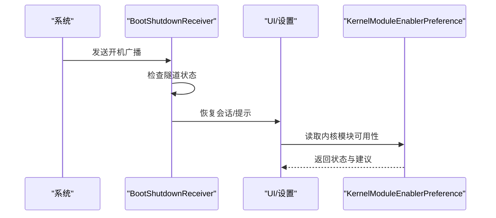
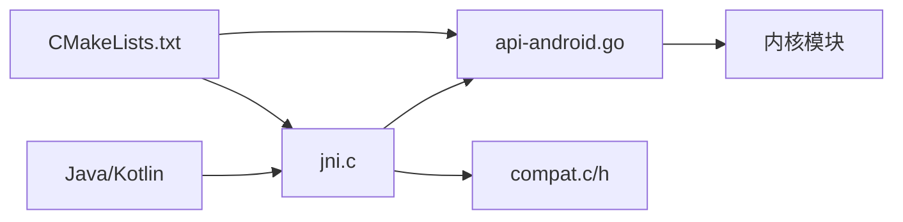
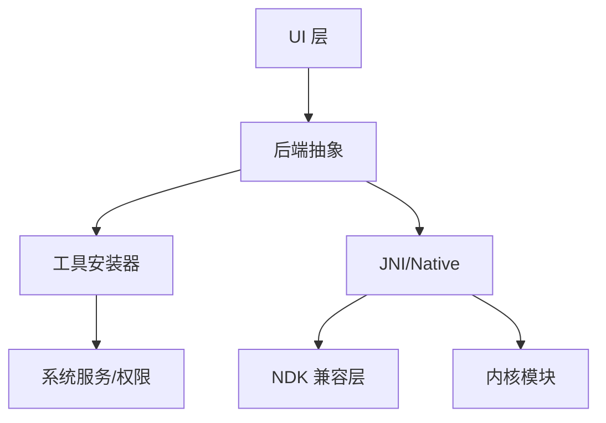

# 系统兼容性问题

<cite>
**本文引用的文件**   
- [AndroidManifest.xml](file://tunnel/src/main/AndroidManifest.xml)
- [Backend.java](file://tunnel/src/main/java/com/wireguard/android/backend/Backend.java)
- [GoBackend.java](file://tunnel/src/main/java/com/wireguard/android/backend/GoBackend.java)
- [WgQuickBackend.java](file://tunnel/src/main/java/com/wireguard/android/backend/WgQuickBackend.java)
- [Tunnel.java](file://tunnel/src/main/java/com/wireguard/android/backend/Tunnel.java)
- [RootShell.java](file://tunnel/src/main/java/com/wireguard/android/util/RootShell.java)
- [SharedLibraryLoader.java](file://tunnel/src/main/java/com/wireguard/android/util/SharedLibraryLoader.java)
- [ToolsInstaller.java](file://tunnel/src/main/java/com/wireguard/android/util/ToolsInstaller.java)
- [KernelModuleEnablerPreference.kt](file://ui/src/main/java/com/wireguard/android/preference/KernelModuleEnablerPreference.kt)
- [BootShutdownReceiver.kt](file://ui/src/main/java/com/wireguard/android/BootShutdownReceiver.kt)
- [QuickTileService.kt](file://ui/src/main/java/com/wireguard/android/QuickTileService.kt)
- [build.gradle.kts](file://tunnel/build.gradle.kts)
- [CMakeLists.txt](file://tunnel/tools/wireguard-tools/CMakeLists.txt)
- [compat.c](file://tunnel/tools/ndk-compat/compat.c)
- [compat.h](file://tunnel/tools/ndk-compat/compat.h)
- [api-android.go](file://tunnel/tools/libwg-go/api-android.go)
- [jni.c](file://tunnel/tools/libwg-go/jni.c)
- [README.md](file://README.md)
</cite>

## 目录
1. [简介](#简介)
2. [项目结构](#项目结构)
3. [核心组件](#核心组件)
4. [架构总览](#架构总览)
5. [详细组件分析](#详细组件分析)
6. [依赖关系分析](#依赖关系分析)
7. [性能与兼容性考量](#性能与兼容性考量)
8. [故障排查指南](#故障排查指南)
9. [结论](#结论)
10. [附录](#附录)

## 简介
本文件面向 WireGuard Android 的系统兼容性问题排查，覆盖不同 Android 版本的 API 差异、系统服务变更、权限模型变化、ROM 定制导致的特殊问题与绕过方法、内核模块加载失败原因与处理步骤、NDK 库在不同架构和设备上的兼容性问题、电池优化与后台限制对功能的影响及配置方法、不同厂商设备的适配要点，以及系统更新后的兼容性检查与修复流程。文档同时提供已知兼容性问题的清单与临时解决方案，帮助开发者与运维人员快速定位并解决问题。

## 项目结构
WireGuard Android 由 tunnel（核心后端与工具链）和 ui（用户界面与系统交互）两大模块组成：
- tunnel 模块负责与内核态 WireGuard 的交互、NDK/JNI 桥接、工具安装与权限管理。
- ui 模块负责设置项、启动/停止隧道、快捷开关、开机自启等系统级能力。

图表来源
- [Backend.java](file://tunnel/src/main/java/com/wireguard/android/backend/Backend.java)
- [GoBackend.java](file://tunnel/src/main/java/com/wireguard/android/backend/GoBackend.java)
- [WgQuickBackend.java](file://tunnel/src/main/java/com/wireguard/android/backend/WgQuickBackend.java)
- [Tunnel.java](file://tunnel/src/main/java/com/wireguard/android/backend/Tunnel.java)
- [RootShell.java](file://tunnel/src/main/java/com/wireguard/android/util/RootShell.java)
- [SharedLibraryLoader.java](file://tunnel/src/main/java/com/wireguard/android/util/SharedLibraryLoader.java)
- [ToolsInstaller.java](file://tunnel/src/main/java/com/wireguard/android/util/ToolsInstaller.java)
- [api-android.go](file://tunnel/tools/libwg-go/api-android.go)
- [jni.c](file://tunnel/tools/libwg-go/jni.c)
- [compat.c](file://tunnel/tools/ndk-compat/compat.c)
- [compat.h](file://tunnel/tools/ndk-compat/compat.h)

章节来源
- [AndroidManifest.xml](file://tunnel/src/main/AndroidManifest.xml)
- [README.md](file://README.md)

## 核心组件
- 后端抽象与实现
  - Backend：统一后端接口，屏蔽 Go 内核模块与 WgQuick 两种路径的差异。
  - GoBackend：通过 JNI 调用 libwg-go，直接对接内核 WireGuard 模块。
  - WgQuickBackend：基于 wg-quick 脚本方式管理隧道，适合无内核模块或受限环境。
- 隧道与工具
  - Tunnel：封装隧道生命周期、状态与统计。
  - RootShell：执行 root 命令，用于加载内核模块、创建 tun 设备、写入路由等。
  - SharedLibraryLoader：按 ABI 动态加载 NDK 库，解决多架构兼容。
  - ToolsInstaller：安装/校验 wg 工具与依赖，确保运行环境可用。
- 系统交互
  - BootShutdownReceiver：处理开机广播，恢复必要状态。
  - QuickTileService：系统快捷开关入口，需适配不同 Android 版本的服务注册与权限。
  - KernelModuleEnablerPreference：引导用户启用内核模块或提示替代方案。

章节来源
- [Backend.java](file://tunnel/src/main/java/com/wireguard/android/backend/Backend.java)
- [GoBackend.java](file://tunnel/src/main/java/com/wireguard/android/backend/GoBackend.java)
- [WgQuickBackend.java](file://tunnel/src/main/java/com/wireguard/android/backend/WgQuickBackend.java)
- [Tunnel.java](file://tunnel/src/main/java/com/wireguard/android/backend/Tunnel.java)
- [RootShell.java](file://tunnel/src/main/java/com/wireguard/android/util/RootShell.java)
- [SharedLibraryLoader.java](file://tunnel/src/main/java/com/wireguard/android/util/SharedLibraryLoader.java)
- [ToolsInstaller.java](file://tunnel/src/main/java/com/wireguard/android/util/ToolsInstaller.java)
- [BootShutdownReceiver.kt](file://ui/src/main/java/com/wireguard/android/BootShutdownReceiver.kt)
- [QuickTileService.kt](file://ui/src/main/java/com/wireguard/android/QuickTileService.kt)
- [KernelModuleEnablerPreference.kt](file://ui/src/main/java/com/wireguard/android/preference/KernelModuleEnablerPreference.kt)

## 架构总览
WireGuard Android 采用“UI + 后端抽象 + Native/JNI + 内核模块”的分层架构。UI 层通过后端抽象选择合适路径；Go 路径走 JNI 直连内核模块，WgQuick 路径走脚本工具；NDK 兼容层屏蔽不同 ABI 与系统差异；RootShell 负责特权操作。

图表来源
- [GoBackend.java](file://tunnel/src/main/java/com/wireguard/android/backend/GoBackend.java)
- [WgQuickBackend.java](file://tunnel/src/main/java/com/wireguard/android/backend/WgQuickBackend.java)
- [api-android.go](file://tunnel/tools/libwg-go/api-android.go)
- [jni.c](file://tunnel/tools/libwg-go/jni.c)

## 详细组件分析

### 后端抽象与实现（Backend/GoBackend/WgQuickBackend）
- 设计模式
  - 策略模式：根据设备能力与权限选择 GoBackend 或 WgQuickBackend。
  - 工厂/单例：在应用启动时探测可用后端并缓存实例。
- 关键职责
  - 启动/停止隧道、查询状态、统计流量、错误码映射。
  - 处理 Android 版本差异（如网络命名空间、VpnService 权限）。
- 兼容性与异常
  - 当内核模块不可用时回退到 WgQuick。
  - 捕获 JNI 异常并转换为上层可读的错误信息。

图表来源
- [Backend.java](file://tunnel/src/main/java/com/wireguard/android/backend/Backend.java)
- [GoBackend.java](file://tunnel/src/main/java/com/wireguard/android/backend/GoBackend.java)
- [WgQuickBackend.java](file://tunnel/src/main/java/com/wireguard/android/backend/WgQuickBackend.java)
- [Tunnel.java](file://tunnel/src/main/java/com/wireguard/android/backend/Tunnel.java)

章节来源
- [Backend.java](file://tunnel/src/main/java/com/wireguard/android/backend/Backend.java)
- [GoBackend.java](file://tunnel/src/main/java/com/wireguard/android/backend/GoBackend.java)
- [WgQuickBackend.java](file://tunnel/src/main/java/com/wireguard/android/backend/WgQuickBackend.java)
- [Tunnel.java](file://tunnel/src/main/java/com/wireguard/android/backend/Tunnel.java)

### 工具与权限（RootShell/ToolsInstaller/SharedLibraryLoader）
- RootShell
  - 执行 su/sh 命令，处理超时与权限拒绝。
  - 常见场景：insmod/modprobe、ip route、iptables/nftables、/dev/tun 节点访问。
- ToolsInstaller
  - 检测并安装 wg/wg-quick 二进制，校验签名与版本。
  - 适配不同 ABI 与系统路径，避免 ROM 修改导致的路径不一致。
- SharedLibraryLoader
  - 按 ABI 选择 .so 文件，处理缺失库与符号解析失败。
  - 支持热重载与降级策略。

图表来源
- [RootShell.java](file://tunnel/src/main/java/com/wireguard/android/util/RootShell.java)
- [ToolsInstaller.java](file://tunnel/src/main/java/com/wireguard/android/util/ToolsInstaller.java)
- [SharedLibraryLoader.java](file://tunnel/src/main/java/com/wireguard/android/util/SharedLibraryLoader.java)

章节来源
- [RootShell.java](file://tunnel/src/main/java/com/wireguard/android/util/RootShell.java)
- [ToolsInstaller.java](file://tunnel/src/main/java/com/wireguard/android/util/ToolsInstaller.java)
- [SharedLibraryLoader.java](file://tunnel/src/main/java/com/wireguard/android/util/SharedLibraryLoader.java)

### 系统交互（BootShutdownReceiver/QuickTileService/KernelModuleEnablerPreference）
- BootShutdownReceiver
  - 监听开机广播，恢复被杀进程或重新建立连接。
  - 适配不同 ROM 的广播延迟与白名单机制。
- QuickTileService
  - 提供系统快捷开关，需声明 Service 并在 AndroidManifest 中注册。
  - 处理 Android 12+ 的 TileService 权限与前台服务要求。
- KernelModuleEnablerPreference
  - 引导用户启用内核模块或切换到 WgQuick 模式。
  - 显示当前内核支持与可用路径。

图表来源
- [BootShutdownReceiver.kt](file://ui/src/main/java/com/wireguard/android/BootShutdownReceiver.kt)
- [KernelModuleEnablerPreference.kt](file://ui/src/main/java/com/wireguard/android/preference/KernelModuleEnablerPreference.kt)

章节来源
- [BootShutdownReceiver.kt](file://ui/src/main/java/com/wireguard/android/BootShutdownReceiver.kt)
- [QuickTileService.kt](file://ui/src/main/java/com/wireguard/android/QuickTileService.kt)
- [KernelModuleEnablerPreference.kt](file://ui/src/main/java/com/wireguard/android/preference/KernelModuleEnablerPreference.kt)

### Native/JNI 与 NDK 兼容（api-android.go/jni.c/compat.c/compat.h）
- api-android.go
  - 暴露给 JNI 的 Go 函数，处理时间源、随机数、内存对齐等平台差异。
- jni.c
  - Java 与 Go 之间的桥接，参数序列化、异常传播、线程安全。
- compat.c/compat.h
  - 针对 NDK 版本与 glibc/uClibc/musl 的差异进行兼容封装。
- CMakeLists.txt
  - 构建脚本，指定 ABI、编译选项、链接库与目标平台。

图表来源
- [api-android.go](file://tunnel/tools/libwg-go/api-android.go)
- [jni.c](file://tunnel/tools/libwg-go/jni.c)
- [compat.c](file://tunnel/tools/ndk-compat/compat.c)
- [compat.h](file://tunnel/tools/ndk-compat/compat.h)
- [CMakeLists.txt](file://tunnel/tools/wireguard-tools/CMakeLists.txt)

章节来源
- [api-android.go](file://tunnel/tools/libwg-go/api-android.go)
- [jni.c](file://tunnel/tools/libwg-go/jni.c)
- [compat.c](file://tunnel/tools/ndk-compat/compat.c)
- [compat.h](file://tunnel/tools/ndk-compat/compat.h)
- [CMakeLists.txt](file://tunnel/tools/wireguard-tools/CMakeLists.txt)

## 依赖关系分析
- 模块内依赖
  - UI 依赖后端抽象，后端依赖工具与 Native 层。
  - Native 层依赖 NDK 兼容与内核模块。
- 外部依赖
  - Android 系统服务（VpnService、TileService、BroadcastReceiver）。
  - Linux 内核 WireGuard 模块与网络栈。
  - 第三方工具（wg/wg-quick）。

图表来源
- [Backend.java](file://tunnel/src/main/java/com/wireguard/android/backend/Backend.java)
- [ToolsInstaller.java](file://tunnel/src/main/java/com/wireguard/android/util/ToolsInstaller.java)
- [api-android.go](file://tunnel/tools/libwg-go/api-android.go)
- [jni.c](file://tunnel/tools/libwg-go/jni.c)
- [compat.c](file://tunnel/tools/ndk-compat/compat.c)

章节来源
- [build.gradle.kts](file://tunnel/build.gradle.kts)
- [AndroidManifest.xml](file://tunnel/src/main/AndroidManifest.xml)

## 性能与兼容性考量
- 多 ABI 与架构
  - 确保为 arm64-v8a、armeabi-v7a、x86_64、x86 提供对应 .so 与工具二进制。
  - 使用 SharedLibraryLoader 按 ABI 选择库，避免运行时崩溃。
- 内核模块与系统服务
  - 老版本内核可能缺少 WireGuard 模块或存在 API 不兼容。
  - Android 12+ 对后台服务与前台服务有更强限制，需正确声明与申请权限。
- 电池优化与后台限制
  - 关闭省电策略、加入白名单、允许后台活动，保证隧道持久化。
  - 使用 VpnService 的前台服务与通知，降低被杀概率。
- ROM 定制
  - 部分厂商修改了网络命名空间、路由表或 iptables/nftables，需适配命令与路径。
  - 某些 ROM 禁用 insmod/modprobe，需改用预置模块或 WgQuick 模式。

[本节为通用指导，无需特定文件引用]

## 故障排查指南

### Android 版本与 API 级别差异
- 常见问题
  - Android 10+ 对网络命名空间与 VpnService 的限制增强。
  - Android 12+ TileService 需要前台服务与用户交互授权。
- 排查步骤
  - 检查 AndroidManifest 中的最小/目标 SDK 与权限声明。
  - 验证 VpnService、TileService、BroadcastReceiver 的注册与回调。
  - 使用 adb shell dumpsys 查看服务状态与权限授予情况。
- 解决方案
  - 升级目标 SDK，适配新 API 行为。
  - 对旧版本设备进行条件分支处理，提供降级路径。

章节来源
- [AndroidManifest.xml](file://tunnel/src/main/AndroidManifest.xml)
- [QuickTileService.kt](file://ui/src/main/java/com/wireguard/android/QuickTileService.kt)

### 系统服务变更与权限模型变化
- 常见问题
  - 后台启动限制、自动启动白名单、电池优化策略。
  - 分区存储与文件访问权限变化。
- 排查步骤
  - 检查系统设置中的“允许后台活动”、“忽略电池优化”。
  - 确认应用具有“VPN 权限”与“系统级网络控制”权限。
- 解决方案
  - 引导用户完成权限授予与白名单添加。
  - 使用前台服务与常驻通知提升优先级。

章节来源
- [BootShutdownReceiver.kt](file://ui/src/main/java/com/wireguard/android/BootShutdownReceiver.kt)
- [AndroidManifest.xml](file://tunnel/src/main/AndroidManifest.xml)

### ROM 定制导致的特殊问题与绕过方法
- 常见问题
  - 厂商修改了 insmod/modprobe、iptables/nftables 路径或行为。
  - 自定义内核未包含 WireGuard 模块或版本不匹配。
- 排查步骤
  - 在终端执行 lsmod 查看模块加载情况。
  - 检查 dmesg 日志获取内核错误信息。
  - 验证 wg 工具是否存在且可执行。
- 解决方案
  - 使用 WgQuick 模式绕过内核模块限制。
  - 预置模块或使用厂商提供的兼容包。
  - 调整路由与防火墙规则以适配 ROM 差异。

章节来源
- [RootShell.java](file://tunnel/src/main/java/com/wireguard/android/util/RootShell.java)
- [ToolsInstaller.java](file://tunnel/src/main/java/com/wireguard/android/util/ToolsInstaller.java)
- [KernelModuleEnablerPreference.kt](file://ui/src/main/java/com/wireguard/android/preference/KernelModuleEnablerPreference.kt)

### 内核模块加载失败的原因与处理步骤
- 常见原因
  - 内核未启用 CONFIG_WIREGUARD。
  - 模块版本与内核头不匹配。
  - SELinux 或安全策略阻止加载。
- 处理步骤
  - 使用 insmod 手动加载并观察 dmesg 输出。
  - 检查模块签名与完整性。
  - 切换至 WgQuick 模式作为临时方案。
- 预防措施
  - 在构建阶段校验内核版本与模块兼容性。
  - 提供一键诊断脚本收集系统信息。

章节来源
- [RootShell.java](file://tunnel/src/main/java/com/wireguard/android/util/RootShell.java)
- [GoBackend.java](file://tunnel/src/main/java/com/wireguard/android/backend/GoBackend.java)

### NDK 库在不同架构与设备上的兼容性问题
- 常见问题
  - ABI 不匹配导致 dlopen 失败。
  - NDK 版本与 glibc/uClibc/musl 差异引发符号解析错误。
- 排查步骤
  - 检查 app 的 abiFilters 与打包产物。
  - 使用 readelf/objdump 查看 .so 的依赖与符号。
- 解决方案
  - 为所有目标 ABI 提供完整库与工具。
  - 使用 compat.c/h 封装差异，确保跨平台一致。

章节来源
- [SharedLibraryLoader.java](file://tunnel/src/main/java/com/wireguard/android/util/SharedLibraryLoader.java)
- [compat.c](file://tunnel/tools/ndk-compat/compat.c)
- [compat.h](file://tunnel/tools/ndk-compat/compat.h)
- [CMakeLists.txt](file://tunnel/tools/wireguard-tools/CMakeLists.txt)

### 电池优化与后台限制对功能的影响及配置方法
- 影响表现
  - 应用被系统杀死，隧道断开。
  - 快捷开关无法响应或频繁失效。
- 配置方法
  - 进入系统设置，关闭“电池优化”，将应用加入“不受限制”。
  - 开启“允许后台活动”与“自启动”。
  - 保持前台服务与通知可见。
- 自动化引导
  - 在首次启动或检测到被杀后，引导用户完成设置。

章节来源
- [BootShutdownReceiver.kt](file://ui/src/main/java/com/wireguard/android/BootShutdownReceiver.kt)
- [QuickTileService.kt](file://ui/src/main/java/com/wireguard/android/QuickTileService.kt)

### 不同厂商设备的特殊适配指南
- 华为/荣耀
  - 严格后台管理，需加入“受保护应用”与“自启动白名单”。
- 小米/Redmi
  - 关闭“省电策略”，允许“后台弹出界面”与“自启动”。
- OPPO/一加
  - 关闭“深度睡眠”与“后台清理”，允许“后台活动”。
- vivo/iQOO
  - 开启“后台高耗电”与“自启动”，避免被系统回收。
- Samsung
  - 关闭“自适应电池”与“后台限制”，允许“始终允许”。

[本节为通用指导，无需特定文件引用]

### 系统更新后的兼容性检查与修复流程
- 检查清单
  - 确认内核版本与 WireGuard 模块兼容性。
  - 验证 NDK 库与 ABI 支持。
  - 检查系统服务与权限模型变化。
- 修复流程
  - 更新应用与工具版本。
  - 重新安装内核模块或切换 WgQuick 模式。
  - 重新配置电池优化与后台权限。
- 回归测试
  - 启动/停止隧道、网络连通性、流量统计、快捷开关。

章节来源
- [Build 配置](file://tunnel/build.gradle.kts)
- [AndroidManifest.xml](file://tunnel/src/main/AndroidManifest.xml)

### 已知兼容性问题的列表与临时解决方案
- 内核模块不可用
  - 临时方案：使用 WgQuick 模式。
- ABI 缺失或库加载失败
  - 临时方案：安装对应 ABI 的工具与库。
- 系统杀进程导致断连
  - 临时方案：开启白名单与前台服务。
- ROM 修改网络栈
  - 临时方案：调整路由与防火墙规则，或切换模式。

[本节为通用指导，无需特定文件引用]

## 结论
WireGuard Android 的兼容性涉及 Android 版本、系统服务、权限模型、ROM 定制、内核模块与 NDK 库等多个层面。通过分层架构与策略模式，应用能够在不同环境下选择最优路径。建议在生产环境中完善兼容性检测、引导用户完成权限与白名单配置，并提供回退方案与诊断工具，以提升用户体验与稳定性。

[本节为总结性内容，无需特定文件引用]

## 附录
- 常用命令与日志
  - dmesg | grep wireguard
  - lsmod | grep wireguard
  - ip link show
  - wg show
- 参考资源
  - Android 官方文档：VpnService、TileService、Battery Optimization
  - Linux 内核文档：WireGuard 模块与配置
  - NDK 文档：ABI 与兼容性

[本节为补充信息，无需特定文件引用]