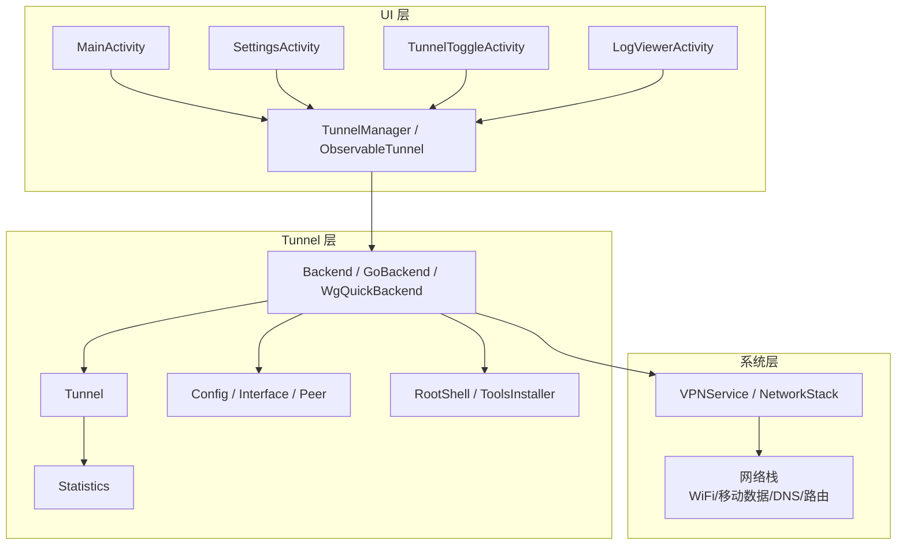
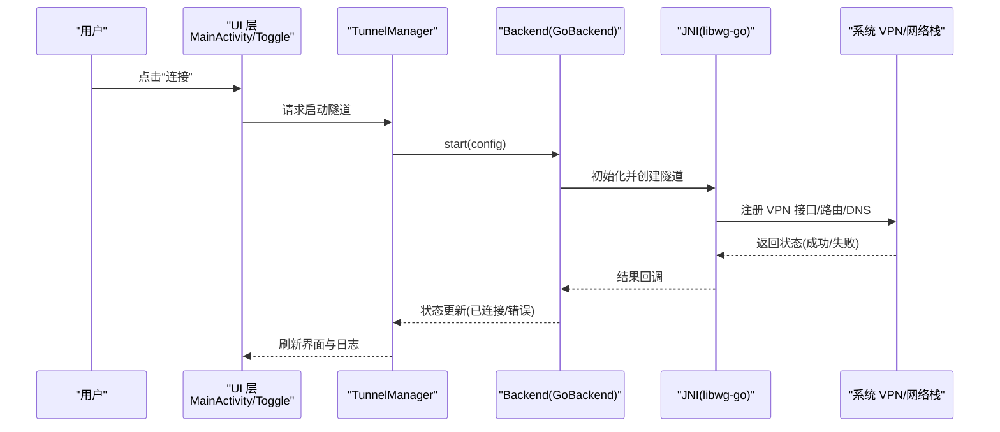
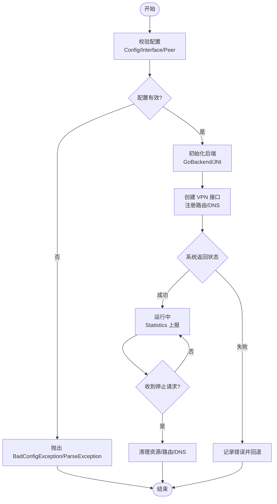
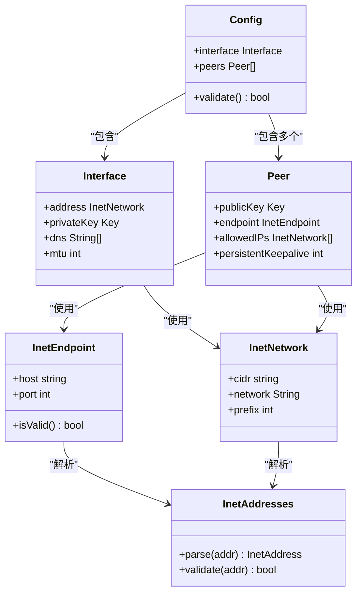
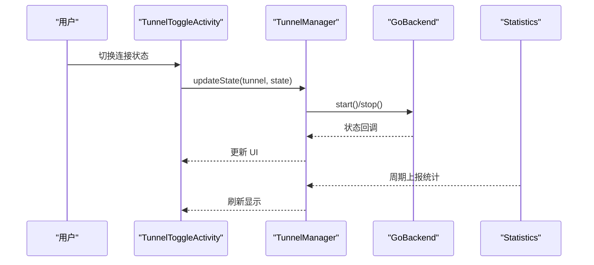
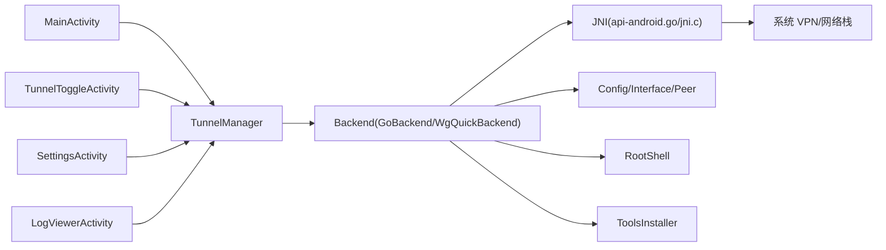

# 网络连接问题

<cite>
**本文引用的文件**   
- [README.md](file://README.md)
- [AndroidManifest.xml（tunnel）](file://tunnel/src/main/AndroidManifest.xml)
- [AndroidManifest.xml（ui）](file://ui/src/main/AndroidManifest.xml)
- [Backend.java](file://tunnel/src/main/java/com/wireguard/android/backend/Backend.java)
- [GoBackend.java](file://tunnel/src/main/java/com/wireguard/android/backend/GoBackend.java)
- [WgQuickBackend.java](file://tunnel/src/main/java/com/wireguard/android/backend/WgQuickBackend.java)
- [Tunnel.java](file://tunnel/src/main/java/com/wireguard/android/backend/Tunnel.java)
- [Statistics.java](file://tunnel/src/main/java/com/wireguard/android/backend/Statistics.java)
- [Config.java](file://tunnel/src/main/java/com/wireguard/config/Config.java)
- [Interface.java](file://tunnel/src/main/java/com/wireguard/config/Interface.java)
- [Peer.java](file://tunnel/src/main/java/com/wireguard/config/Peer.java)
- [BadConfigException.java](file://tunnel/src/main/java/com/wireguard/config/BadConfigException.java)
- [ParseException.java](file://tunnel/src/main/java/com/wireguard/config/ParseException.java)
- [InetAddresses.java](file://tunnel/src/main/java/com/wireguard/config/InetAddresses.java)
- [InetEndpoint.java](file://tunnel/src/main/java/com/wireguard/config/InetEndpoint.java)
- [InetNetwork.java](file://tunnel/src/main/java/com/wireguard/config/InetNetwork.java)
- [RootShell.java](file://tunnel/src/main/java/com/wireguard/android/util/RootShell.java)
- [ToolsInstaller.java](file://tunnel/src/main/java/com/wireguard/android/util/ToolsInstaller.java)
- [MainActivity.kt](file://ui/src/main/java/com/wireguard/android/activity/MainActivity.kt)
- [SettingsActivity.kt](file://ui/src/main/java/com/wireguard/android/activity/SettingsActivity.kt)
- [TunnelToggleActivity.kt](file://ui/src/main/java/com/wireguard/android/activity/TunnelToggleActivity.kt)
- [LogViewerActivity.kt](file://ui/src/main/java/com/wireguard/android/activity/LogViewerActivity.kt)
- [TunnelManager.kt](file://ui/src/main/java/com/wireguard/android/model/TunnelManager.kt)
- [ObservableTunnel.kt](file://ui/src/main/java/com/wireguard/android/model/ObservableTunnel.kt)
- [ErrorMessages.kt](file://ui/src/main/java/com/wireguard/android/util/ErrorMessages.kt)
- [Extensions.kt](file://ui/src/main/java/com/wireguard/android/util/Extensions.kt)
- [AdminKnobs.kt](file://ui/src/main/java/com/wireguard/android/util/AdminKnobs.kt)
- [UserKnobs.kt](file://ui/src/main/java/com/wireguard/android/util/UserKnobs.kt)
- [preferences.xml](file://ui/src/main/res/xml/preferences.xml)
- [strings.xml（中文）](file://ui/src/main/res/values-zh-rCN/strings.xml)
- [api-android.go](file://tunnel/tools/libwg-go/api-android.go)
- [jni.c](file://tunnel/tools/libwg-go/jni.c)
</cite>

## 目录
1. [简介](#简介)
2. [项目结构](#项目结构)
3. [核心组件](#核心组件)
4. [架构总览](#架构总览)
5. [详细组件分析](#详细组件分析)
6. [依赖关系分析](#依赖关系分析)
7. [性能考虑](#性能考虑)
8. [故障排查指南](#故障排查指南)
9. [结论](#结论)
10. [附录](#附录)

## 简介
本文件面向 WireGuard Android 的网络连接问题排查，覆盖 VPN 连接失败、权限与防火墙、路由冲突、超时与断开、DNS 解析、代理与网络切换、不同网络环境优化、性能测试与监控、常见错误码与修复、状态检测与自动重连等主题。文档基于代码仓库中的后端实现、配置模型、UI 交互与系统集成点进行系统化梳理，帮助开发者与高级用户快速定位并解决问题。

## 项目结构
WireGuard Android 由三个主要部分组成：
- tunnel 模块：封装底层 Go 实现的 JNI 接口、隧道生命周期管理、统计信息收集、工具安装与 Root Shell 调用。
- ui 模块：提供用户界面、设置项、日志查看器、隧道管理与状态展示。
- 配置文件与清单：定义应用权限、服务声明与偏好设置。

图表来源
- [MainActivity.kt](file://ui/src/main/java/com/wireguard/android/activity/MainActivity.kt)
- [SettingsActivity.kt](file://ui/src/main/java/com/wireguard/android/activity/SettingsActivity.kt)
- [TunnelToggleActivity.kt](file://ui/src/main/java/com/wireguard/android/activity/TunnelToggleActivity.kt)
- [LogViewerActivity.kt](file://ui/src/main/java/com/wireguard/android/activity/LogViewerActivity.kt)
- [TunnelManager.kt](file://ui/src/main/java/com/wireguard/android/model/TunnelManager.kt)
- [ObservableTunnel.kt](file://ui/src/main/java/com/wireguard/android/model/ObservableTunnel.kt)
- [Backend.java](file://tunnel/src/main/java/com/wireguard/android/backend/Backend.java)
- [GoBackend.java](file://tunnel/src/main/java/com/wireguard/android/backend/GoBackend.java)
- [WgQuickBackend.java](file://tunnel/src/main/java/com/wireguard/android/backend/WgQuickBackend.java)
- [Tunnel.java](file://tunnel/src/main/java/com/wireguard/android/backend/Tunnel.java)
- [Statistics.java](file://tunnel/src/main/java/com/wireguard/android/backend/Statistics.java)
- [Config.java](file://tunnel/src/main/java/com/wireguard/config/Config.java)
- [Interface.java](file://tunnel/src/main/java/com/wireguard/config/Interface.java)
- [Peer.java](file://tunnel/src/main/java/com/wireguard/config/Peer.java)
- [RootShell.java](file://tunnel/src/main/java/com/wireguard/android/util/RootShell.java)
- [ToolsInstaller.java](file://tunnel/src/main/java/com/wireguard/android/util/ToolsInstaller.java)

章节来源
- [README.md](file://README.md)
- [AndroidManifest.xml（tunnel）](file://tunnel/src/main/AndroidManifest.xml)
- [AndroidManifest.xml（ui）](file://ui/src/main/AndroidManifest.xml)

## 核心组件
- 后端抽象与实现
  - Backend：统一后端接口，封装启动、停止、状态查询、统计获取等能力。
  - GoBackend：通过 JNI 调用 libwg-go 的 API，负责实际隧道建立与数据面转发。
  - WgQuickBackend：兼容 wg-quick 风格的配置加载与处理。
- 隧道与统计
  - Tunnel：表示一个具体的 WireGuard 隧道实例，维护其生命周期与运行时状态。
  - Statistics：采集与暴露流量统计（上行/下行字节数、时间戳等）。
- 配置模型
  - Config/Interface/Peer：描述接口地址、密钥、对端端点、Keepalive、AllowedIPs 等。
  - InetAddresses/InetEndpoint/InetNetwork：IP 与端点的解析与校验。
- 工具与系统交互
  - RootShell：执行需要 root 权限的命令（如 iproute2、iptables/nftables）。
  - ToolsInstaller：按需安装或更新辅助工具。
- UI 与状态管理
  - MainActivity/SettingsActivity/TunnelToggleActivity/LogViewerActivity：用户操作入口与日志查看。
  - TunnelManager/ObservableTunnel：集中管理隧道列表与状态变化通知。
  - ErrorMessages/Extensions/AdminKnobs/UserKnobs：错误提示、扩展方法与开关配置。

章节来源
- [Backend.java](file://tunnel/src/main/java/com/wireguard/android/backend/Backend.java)
- [GoBackend.java](file://tunnel/src/main/java/com/wireguard/android/backend/GoBackend.java)
- [WgQuickBackend.java](file://tunnel/src/main/java/com/wireguard/android/backend/WgQuickBackend.java)
- [Tunnel.java](file://tunnel/src/main/java/com/wireguard/android/backend/Tunnel.java)
- [Statistics.java](file://tunnel/src/main/java/com/wireguard/android/backend/Statistics.java)
- [Config.java](file://tunnel/src/main/java/com/wireguard/config/Config.java)
- [Interface.java](file://tunnel/src/main/java/com/wireguard/config/Interface.java)
- [Peer.java](file://tunnel/src/main/java/com/wireguard/config/Peer.java)
- [InetAddresses.java](file://tunnel/src/main/java/com/wireguard/config/InetAddresses.java)
- [InetEndpoint.java](file://tunnel/src/main/java/com/wireguard/config/InetEndpoint.java)
- [InetNetwork.java](file://tunnel/src/main/java/com/wireguard/config/InetNetwork.java)
- [RootShell.java](file://tunnel/src/main/java/com/wireguard/android/util/RootShell.java)
- [ToolsInstaller.java](file://tunnel/src/main/java/com/wireguard/android/util/ToolsInstaller.java)
- [MainActivity.kt](file://ui/src/main/java/com/wireguard/android/activity/MainActivity.kt)
- [SettingsActivity.kt](file://ui/src/main/java/com/wireguard/android/activity/SettingsActivity.kt)
- [TunnelToggleActivity.kt](file://ui/src/main/java/com/wireguard/android/activity/TunnelToggleActivity.kt)
- [LogViewerActivity.kt](file://ui/src/main/java/com/wireguard/android/activity/LogViewerActivity.kt)
- [TunnelManager.kt](file://ui/src/main/java/com/wireguard/android/model/TunnelManager.kt)
- [ObservableTunnel.kt](file://ui/src/main/java/com/wireguard/android/model/ObservableTunnel.kt)
- [ErrorMessages.kt](file://ui/src/main/java/com/wireguard/android/util/ErrorMessages.kt)
- [Extensions.kt](file://ui/src/main/java/com/wireguard/android/util/Extensions.kt)
- [AdminKnobs.kt](file://ui/src/main/java/com/wireguard/android/util/AdminKnobs.kt)
- [UserKnobs.kt](file://ui/src/main/java/com/wireguard/android/util/UserKnobs.kt)

## 架构总览
WireGuard Android 采用“UI → 后端抽象 → JNI → 内核/系统网络栈”的分层架构。UI 层发起连接请求，后端抽象根据实现选择 GoBackend 或 WgQuickBackend；GoBackend 通过 JNI 调用 libwg-go 的 api-android.go 和 jni.c，最终由系统 VPN 服务接管流量并写入内核网络栈。

图表来源
- [GoBackend.java](file://tunnel/src/main/java/com/wireguard/android/backend/GoBackend.java)
- [api-android.go](file://tunnel/tools/libwg-go/api-android.go)
- [jni.c](file://tunnel/tools/libwg-go/jni.c)
- [TunnelManager.kt](file://ui/src/main/java/com/wireguard/android/model/TunnelManager.kt)
- [TunnelToggleActivity.kt](file://ui/src/main/java/com/wireguard/android/activity/TunnelToggleActivity.kt)

## 详细组件分析

### 后端与隧道生命周期
- 启动流程
  - UI 触发连接 → TunnelManager 调用 Backend.start → GoBackend 通过 JNI 初始化 libwg-go → 系统 VPN 服务建立接口、注入路由与 DNS → 返回连接状态。
- 停止流程
  - UI 触发断开 → Backend.stop → 清理路由/DNS → 释放资源 → 状态回传。
- 状态与统计
  - Statistics 周期性上报字节计数与时间戳，供 UI 展示与诊断。

图表来源
- [Backend.java](file://tunnel/src/main/java/com/wireguard/android/backend/Backend.java)
- [GoBackend.java](file://tunnel/src/main/java/com/wireguard/android/backend/GoBackend.java)
- [Config.java](file://tunnel/src/main/java/com/wireguard/config/Config.java)
- [BadConfigException.java](file://tunnel/src/main/java/com/wireguard/config/BadConfigException.java)
- [ParseException.java](file://tunnel/src/main/java/com/wireguard/config/ParseException.java)
- [Statistics.java](file://tunnel/src/main/java/com/wireguard/android/backend/Statistics.java)

章节来源
- [Backend.java](file://tunnel/src/main/java/com/wireguard/android/backend/Backend.java)
- [GoBackend.java](file://tunnel/src/main/java/com/wireguard/android/backend/GoBackend.java)
- [Tunnel.java](file://tunnel/src/main/java/com/wireguard/android/backend/Tunnel.java)
- [Statistics.java](file://tunnel/src/main/java/com/wireguard/android/backend/Statistics.java)
- [Config.java](file://tunnel/src/main/java/com/wireguard/config/Config.java)
- [BadConfigException.java](file://tunnel/src/main/java/com/wireguard/config/BadConfigException.java)
- [ParseException.java](file://tunnel/src/main/java/com/wireguard/config/ParseException.java)

### 配置模型与解析
- Config/Interface/Peer 定义了隧道的基本参数，包括本地地址、私钥、对端公钥、端点、Keepalive、AllowedIPs 等。
- InetAddresses/InetEndpoint/InetNetwork 负责 IP 地址与端点的解析与合法性检查。
- 解析失败会抛出 BadConfigException 或 ParseException，便于上层捕获并提示用户。

图表来源
- [Config.java](file://tunnel/src/main/java/com/wireguard/config/Config.java)
- [Interface.java](file://tunnel/src/main/java/com/wireguard/config/Interface.java)
- [Peer.java](file://tunnel/src/main/java/com/wireguard/config/Peer.java)
- [InetEndpoint.java](file://tunnel/src/main/java/com/wireguard/config/InetEndpoint.java)
- [InetNetwork.java](file://tunnel/src/main/java/com/wireguard/config/InetNetwork.java)
- [InetAddresses.java](file://tunnel/src/main/java/com/wireguard/config/InetAddresses.java)

章节来源
- [Config.java](file://tunnel/src/main/java/com/wireguard/config/Config.java)
- [Interface.java](file://tunnel/src/main/java/com/wireguard/config/Interface.java)
- [Peer.java](file://tunnel/src/main/java/com/wireguard/config/Peer.java)
- [InetEndpoint.java](file://tunnel/src/main/java/com/wireguard/config/InetEndpoint.java)
- [InetNetwork.java](file://tunnel/src/main/java/com/wireguard/config/InetNetwork.java)
- [InetAddresses.java](file://tunnel/src/main/java/com/wireguard/config/InetAddresses.java)

### UI 与状态管理
- MainActivity/SettingsActivity/TunnelToggleActivity/LogViewerActivity 提供连接控制、设置修改与日志查看。
- TunnelManager/ObservableTunnel 集中管理隧道列表与状态变更事件，驱动 UI 刷新。
- ErrorMessages/Extensions 提供错误消息与常用扩展方法，提升可观测性与用户体验。

图表来源
- [TunnelToggleActivity.kt](file://ui/src/main/java/com/wireguard/android/activity/TunnelToggleActivity.kt)
- [TunnelManager.kt](file://ui/src/main/java/com/wireguard/android/model/TunnelManager.kt)
- [ObservableTunnel.kt](file://ui/src/main/java/com/wireguard/android/model/ObservableTunnel.kt)
- [GoBackend.java](file://tunnel/src/main/java/com/wireguard/android/backend/GoBackend.java)
- [Statistics.java](file://tunnel/src/main/java/com/wireguard/android/backend/Statistics.java)

章节来源
- [MainActivity.kt](file://ui/src/main/java/com/wireguard/android/activity/MainActivity.kt)
- [SettingsActivity.kt](file://ui/src/main/java/com/wireguard/android/activity/SettingsActivity.kt)
- [TunnelToggleActivity.kt](file://ui/src/main/java/com/wireguard/android/activity/TunnelToggleActivity.kt)
- [LogViewerActivity.kt](file://ui/src/main/java/com/wireguard/android/activity/LogViewerActivity.kt)
- [TunnelManager.kt](file://ui/src/main/java/com/wireguard/android/model/TunnelManager.kt)
- [ObservableTunnel.kt](file://ui/src/main/java/com/wireguard/android/model/ObservableTunnel.kt)
- [ErrorMessages.kt](file://ui/src/main/java/com/wireguard/android/util/ErrorMessages.kt)
- [Extensions.kt](file://ui/src/main/java/com/wireguard/android/util/Extensions.kt)

## 依赖关系分析
- UI 层依赖 TunnelManager 与 ObservableTunnel 进行状态同步与事件分发。
- TunnelManager 依赖 Backend 抽象，具体实现为 GoBackend/WgQuickBackend。
- GoBackend 依赖 JNI 层（api-android.go/jni.c）与系统 VPN 服务。
- RootShell/ToolsInstaller 在需要时执行系统命令或安装工具。
- 配置模型被后端用于构建隧道参数。

图表来源
- [MainActivity.kt](file://ui/src/main/java/com/wireguard/android/activity/MainActivity.kt)
- [TunnelToggleActivity.kt](file://ui/src/main/java/com/wireguard/android/activity/TunnelToggleActivity.kt)
- [SettingsActivity.kt](file://ui/src/main/java/com/wireguard/android/activity/SettingsActivity.kt)
- [LogViewerActivity.kt](file://ui/src/main/java/com/wireguard/android/activity/LogViewerActivity.kt)
- [TunnelManager.kt](file://ui/src/main/java/com/wireguard/android/model/TunnelManager.kt)
- [GoBackend.java](file://tunnel/src/main/java/com/wireguard/android/backend/GoBackend.java)
- [WgQuickBackend.java](file://tunnel/src/main/java/com/wireguard/android/backend/WgQuickBackend.java)
- [api-android.go](file://tunnel/tools/libwg-go/api-android.go)
- [jni.c](file://tunnel/tools/libwg-go/jni.c)
- [Config.java](file://tunnel/src/main/java/com/wireguard/config/Config.java)
- [RootShell.java](file://tunnel/src/main/java/com/wireguard/android/util/RootShell.java)
- [ToolsInstaller.java](file://tunnel/src/main/java/com/wireguard/android/util/ToolsInstaller.java)

章节来源
- [TunnelManager.kt](file://ui/src/main/java/com/wireguard/android/model/TunnelManager.kt)
- [GoBackend.java](file://tunnel/src/main/java/com/wireguard/android/backend/GoBackend.java)
- [WgQuickBackend.java](file://tunnel/src/main/java/com/wireguard/android/backend/WgQuickBackend.java)
- [api-android.go](file://tunnel/tools/libwg-go/api-android.go)
- [jni.c](file://tunnel/tools/libwg-go/jni.c)
- [Config.java](file://tunnel/src/main/java/com/wireguard/config/Config.java)
- [RootShell.java](file://tunnel/src/main/java/com/wireguard/android/util/RootShell.java)
- [ToolsInstaller.java](file://tunnel/src/main/java/com/wireguard/android/util/ToolsInstaller.java)

## 性能考虑
- Keepalive 与 NAT 穿透
  - 合理设置 Peer.persistentKeepalive 以维持 NAT 映射，避免长时间空闲导致连接中断。
- MTU 与分片
  - 调整 Interface.mtu 以避免路径 MTU 问题导致的丢包或分片开销。
- 统计采样频率
  - Statistics 的上报频率需平衡精度与 CPU/电量消耗。
- 路由与 DNS 优化
  - 最小化 AllowedIPs 范围，减少不必要的流量进入隧道；优先使用可靠 DNS 服务器。
- 后台限制与省电策略
  - 确保应用未被系统省电策略限制，避免后台任务被杀导致连接不稳定。

[本节为通用指导，不直接分析具体文件]

## 故障排查指南

### VPN 连接失败的诊断与解决
- 权限与系统服务
  - 确认应用具备必要的 VPN 权限与前台服务权限；检查 AndroidManifest 中相关声明是否完整。
  - 若设备启用企业策略或受限模式，可能阻止 VPN 建立。
- 配置校验
  - 检查 Config/Interface/Peer 字段是否合法；错误的地址、端口或密钥将导致 BadConfigException/ParseException。
- 路由冲突
  - AllowedIPs 与现有路由冲突会导致无法建立或流量异常；必要时调整网段或排除冲突路由。
- 防火墙与安全软件
  - 第三方安全软件可能拦截 VPN 或 UDP 端口；临时禁用以验证是否为干扰源。
- 系统兼容性
  - 某些 ROM 或内核版本存在已知兼容性问题；尝试更新系统或固件。

章节来源
- [AndroidManifest.xml（ui）](file://ui/src/main/AndroidManifest.xml)
- [AndroidManifest.xml（tunnel）](file://tunnel/src/main/AndroidManifest.xml)
- [Config.java](file://tunnel/src/main/java/com/wireguard/config/Config.java)
- [BadConfigException.java](file://tunnel/src/main/java/com/wireguard/config/BadConfigException.java)
- [ParseException.java](file://tunnel/src/main/java/com/wireguard/config/ParseException.java)

### 网络权限、防火墙与路由冲突
- 网络权限
  - 确保应用拥有访问网络的权限；在部分设备上需授予“允许 VPN”与“后台活动”权限。
- 防火墙设置
  - 检查系统防火墙或路由器 ACL 是否放行 UDP 端口；必要时开放对应端口。
- 路由冲突
  - 使用系统路由表工具检查是否存在重复或更优路由；必要时调整 AllowedIPs 或添加排除规则。

章节来源
- [RootShell.java](file://tunnel/src/main/java/com/wireguard/android/util/RootShell.java)
- [ToolsInstaller.java](file://tunnel/src/main/java/com/wireguard/android/util/ToolsInstaller.java)
- [Config.java](file://tunnel/src/main/java/com/wireguard/config/Config.java)
- [Peer.java](file://tunnel/src/main/java/com/wireguard/config/Peer.java)

### 连接超时与断开的常见原因及修复
- 对端不可达
  - 检查 Peer.endpoint 的 host/port 是否正确；确认公网可达性与端口映射。
- NAT 超时
  - 增大 persistentKeepalive 值以减少 NAT 映射过期；避免长时间无心跳。
- 网络切换
  - WiFi/移动数据切换可能导致路由重建；确保应用支持网络切换并重试连接。
- 系统休眠
  - 关闭省电策略对应用的限制；保持前台服务运行。

章节来源
- [Peer.java](file://tunnel/src/main/java/com/wireguard/config/Peer.java)
- [Statistics.java](file://tunnel/src/main/java/com/wireguard/android/backend/Statistics.java)
- [TunnelManager.kt](file://ui/src/main/java/com/wireguard/android/model/TunnelManager.kt)

### DNS 解析问题的排查与配置
- 配置 DNS
  - 在 Interface.dns 中指定可靠的 DNS 服务器；避免使用不可达或延迟高的 DNS。
- 解析失败
  - 检查 DNS 可达性；必要时切换到公共 DNS（如 8.8.8.8/1.1.1.1）。
- 缓存与系统 DNS
  - 清除系统 DNS 缓存；在某些 ROM 上需重启网络栈。

章节来源
- [Interface.java](file://tunnel/src/main/java/com/wireguard/config/Interface.java)
- [InetAddresses.java](file://tunnel/src/main/java/com/wireguard/config/InetAddresses.java)

### 代理服务器与网络切换时的连接管理
- 代理影响
  - 若系统或应用级代理生效，可能干扰 UDP 流量；建议直连或配置例外。
- 网络切换
  - 监听网络状态变化，在切换后自动重试连接；必要时重置路由与 DNS。
- 多网络共存
  - 明确主用网络；避免同时激活多个 VPN 导致路由混乱。

章节来源
- [TunnelManager.kt](file://ui/src/main/java/com/wireguard/android/model/TunnelManager.kt)
- [Extensions.kt](file://ui/src/main/java/com/wireguard/android/util/Extensions.kt)

### 不同网络环境下的连接优化技巧
- WiFi
  - 通常带宽高、延迟低；注意企业 WiFi 的认证与 ACL。
- 移动数据
  - 关注运营商 NAT 与限速；适当增加 Keepalive 与重试间隔。
- 弱网环境
  - 降低 MTU、启用压缩（服务端支持）、减少 AllowedIPs 范围。

章节来源
- [Config.java](file://tunnel/src/main/java/com/wireguard/config/Config.java)
- [Interface.java](file://tunnel/src/main/java/com/wireguard/config/Interface.java)
- [Peer.java](file://tunnel/src/main/java/com/wireguard/config/Peer.java)

### 网络性能测试与监控的方法
- 流量统计
  - 使用 Statistics 上报的字节计数评估吞吐与延迟趋势。
- 日志分析
  - 通过 LogViewerActivity 查看连接与错误日志，定位关键时间点。
- 外部工具
  - 结合系统 ping/traceroute 与抓包工具验证端到端连通性。

章节来源
- [Statistics.java](file://tunnel/src/main/java/com/wireguard/android/backend/Statistics.java)
- [LogViewerActivity.kt](file://ui/src/main/java/com/wireguard/android/activity/LogViewerActivity.kt)

### 常见网络错误的错误码与解决方案
- 配置错误
  - BadConfigException/ParseException：检查字段格式与取值范围。
- 系统错误
  - VPN 服务拒绝或权限不足：确认权限与系统策略。
- 网络错误
  - 对端不可达/超时：检查 endpoint、NAT、防火墙与路由。
- 资源错误
  - 工具缺失或权限不足：使用 ToolsInstaller 安装必要工具并确保 root 权限。

章节来源
- [BadConfigException.java](file://tunnel/src/main/java/com/wireguard/config/BadConfigException.java)
- [ParseException.java](file://tunnel/src/main/java/com/wireguard/config/ParseException.java)
- [ToolsInstaller.java](file://tunnel/src/main/java/com/wireguard/android/util/ToolsInstaller.java)
- [RootShell.java](file://tunnel/src/main/java/com/wireguard/android/util/RootShell.java)

### 网络状态检测与自动重连机制的配置选项
- 状态检测
  - 通过 ObservableTunnel 监听连接状态变化；结合 Statistics 判断活跃性。
- 自动重连
  - 在网络切换或错误时触发重连；合理设置重试间隔与最大次数。
- 偏好设置
  - 在 preferences.xml 中调整重连策略、Keepalive、MTU 等参数。

章节来源
- [ObservableTunnel.kt](file://ui/src/main/java/com/wireguard/android/model/ObservableTunnel.kt)
- [TunnelManager.kt](file://ui/src/main/java/com/wireguard/android/model/TunnelManager.kt)
- [preferences.xml](file://ui/src/main/res/xml/preferences.xml)
- [UserKnobs.kt](file://ui/src/main/java/com/wireguard/android/util/UserKnobs.kt)
- [AdminKnobs.kt](file://ui/src/main/java/com/wireguard/android/util/AdminKnobs.kt)

## 结论
WireGuard Android 的连接问题通常源于权限、配置、路由与系统策略等因素。通过分层排查（UI → 后端 → JNI → 系统网络栈），结合日志与统计信息，可以快速定位并修复问题。合理配置 Keepalive、MTU、DNS 与 AllowedIPs，并在不同网络环境下优化策略，有助于提升连接的稳定性与性能。

[本节为总结，不直接分析具体文件]

## 附录
- 参考字符串与本地化
  - strings.xml（中文）提供界面文案与错误提示，便于用户理解与反馈。
- 关键入口与设置
  - SettingsActivity 与 preferences.xml 提供常用配置项；TunnelToggleActivity 提供快速切换。

章节来源
- [strings.xml（中文）](file://ui/src/main/res/values-zh-rCN/strings.xml)
- [SettingsActivity.kt](file://ui/src/main/java/com/wireguard/android/activity/SettingsActivity.kt)
- [preferences.xml](file://ui/src/main/res/xml/preferences.xml)
- [TunnelToggleActivity.kt](file://ui/src/main/java/com/wireguard/android/activity/TunnelToggleActivity.kt)