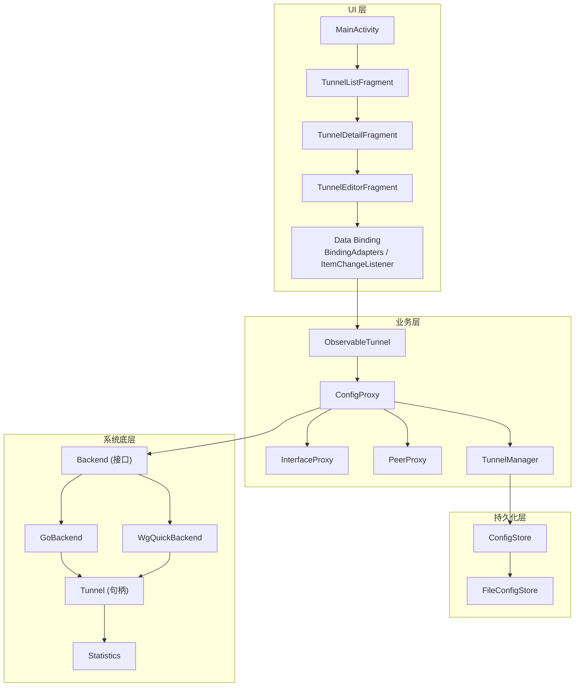
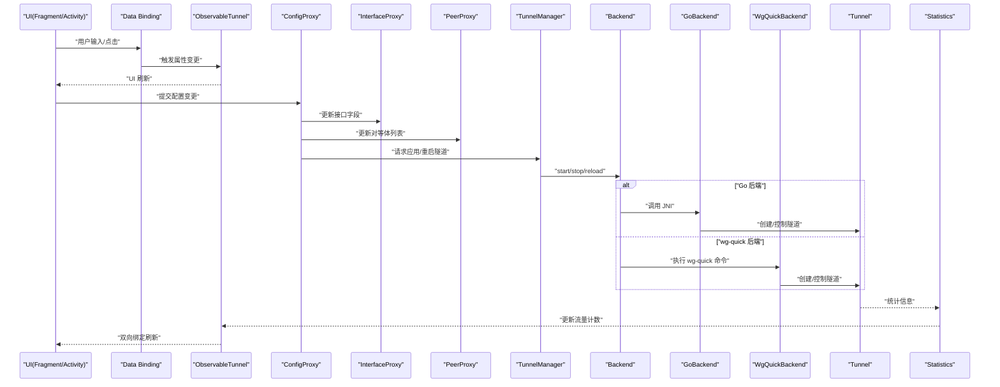
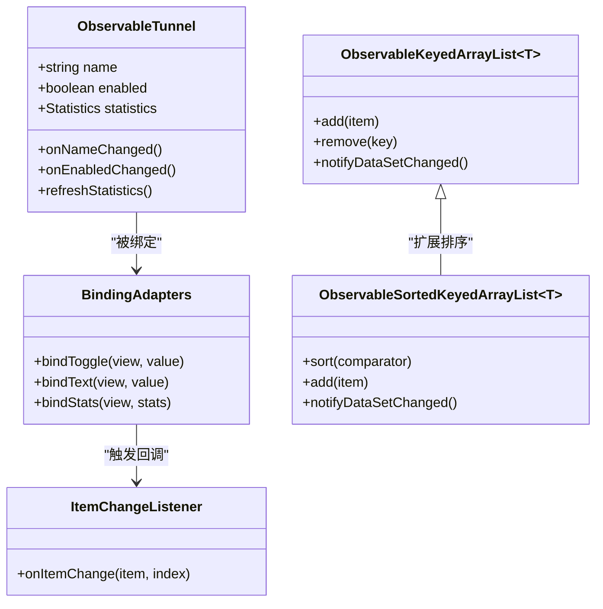
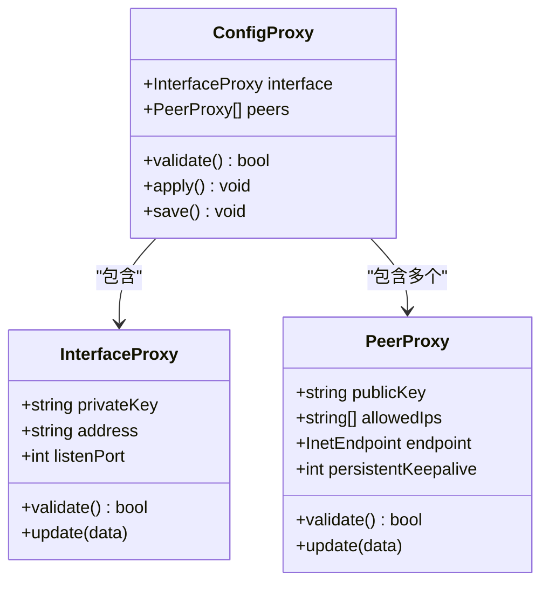
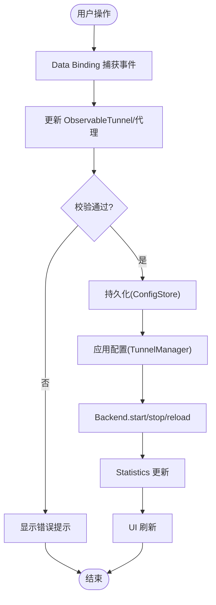
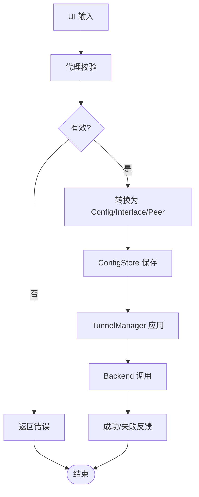
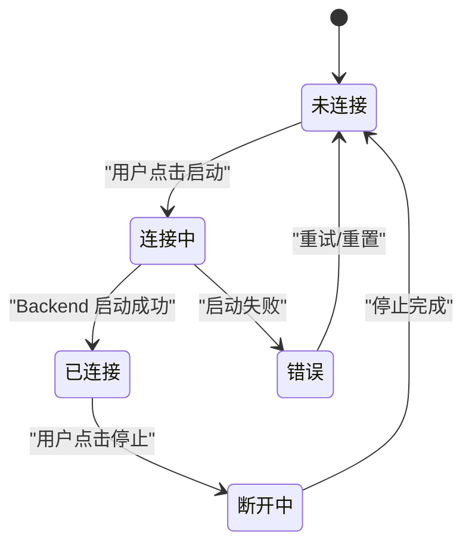
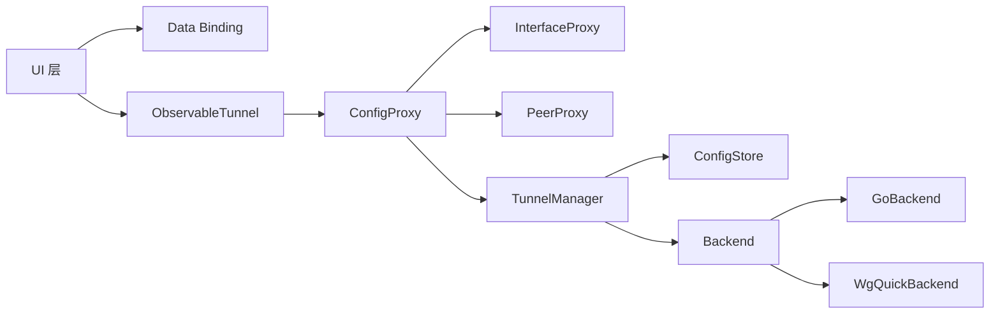

# 数据流设计

<cite>
**本文引用的文件**   
- [ObservableTunnel.kt](file://ui/src/main/java/com/wireguard/android/model/ObservableTunnel.kt)
- [TunnelManager.kt](file://ui/src/main/java/com/wireguard/android/model/TunnelManager.kt)
- [ConfigProxy.kt](file://ui/src/main/java/com/wireguard/android/viewmodel/ConfigProxy.kt)
- [InterfaceProxy.kt](file://ui/src/main/java/com/wireguard/android/viewmodel/InterfaceProxy.kt)
- [PeerProxy.kt](file://ui/src/main/java/com/wireguard/android/viewmodel/PeerProxy.kt)
- [BindingAdapters.kt](file://ui/src/main/java/com/wireguard/android/databinding/BindingAdapters.kt)
- [ItemChangeListener.kt](file://ui/src/main/java/com/wireguard/android/databinding/ItemChangeListener.kt)
- [ObservableKeyedArrayList.kt](file://ui/src/main/java/com/wireguard/android/databinding/ObservableKeyedArrayList.kt)
- [ObservableSortedKeyedArrayList.kt](file://ui/src/main/java/com/wireguard/android/databinding/ObservableSortedKeyedArrayList.kt)
- [ConfigStore.kt](file://ui/src/main/java/com/wireguard/android/configStore/ConfigStore.kt)
- [FileConfigStore.kt](file://ui/src/main/java/com/wireguard/android/configStore/FileConfigStore.kt)
- [MainActivity.kt](file://ui/src/main/java/com/wireguard/android/activity/MainActivity.kt)
- [TunnelListFragment.kt](file://ui/src/main/java/com/wireguard/android/fragment/TunnelListFragment.kt)
- [TunnelDetailFragment.kt](file://ui/src/main/java/com/wireguard/android/fragment/TunnelDetailFragment.kt)
- [TunnelEditorFragment.kt](file://ui/src/main/java/com/wireguard/android/fragment/TunnelEditorFragment.kt)
- [Backend.java](file://tunnel/src/main/java/com/wireguard/android/backend/Backend.java)
- [GoBackend.java](file://tunnel/src/main/java/com/wireguard/android/backend/GoBackend.java)
- [WgQuickBackend.java](file://tunnel/src/main/java/com/wireguard/android/backend/WgQuickBackend.java)
- [Tunnel.java](file://tunnel/src/main/java/com/wireguard/android/backend/Tunnel.java)
- [Statistics.java](file://tunnel/src/main/java/com/wireguard/android/backend/Statistics.java)
- [Config.java](file://tunnel/src/main/java/com/wireguard/config/Config.java)
- [Interface.java](file://tunnel/src/main/java/com/wireguard/config/Interface.java)
- [Peer.java](file://tunnel/src/main/java/com/wireguard/config/Peer.java)
</cite>

## 目录
1. [简介](#简介)
2. [项目结构](#项目结构)
3. [核心组件](#核心组件)
4. [架构总览](#架构总览)
5. [详细组件分析](#详细组件分析)
6. [依赖关系分析](#依赖关系分析)
7. [性能考虑](#性能考虑)
8. [故障排查指南](#故障排查指南)
9. [结论](#结论)
10. [附录](#附录)

## 简介
本文件面向 WireGuard Android 的数据流设计，聚焦从用户界面到业务逻辑再到系统底层（Go 后端）的完整数据路径。文档重点说明：
- ObservableTunnel、ViewModel 代理与 Data Binding 的数据绑定机制
- 状态管理、数据同步与事件处理模式
- 数据验证、转换与持久化流程
- 关键数据流图与状态转换图，展示组件间的数据传递方式

## 项目结构
UI 层通过 Fragment/Activity 驱动交互，使用 Data Binding 将 UI 与可观察数据模型绑定；业务层由 ViewModel 代理封装配置对象并协调变更；持久化由 ConfigStore 抽象并通过 FileConfigStore 实现；底层隧道控制通过 Backend 接口与 Go 后端通信。

图表来源
- [MainActivity.kt:1-200](file://ui/src/main/java/com/wireguard/android/activity/MainActivity.kt#L1-L200)
- [TunnelListFragment.kt:1-200](file://ui/src/main/java/com/wireguard/android/fragment/TunnelListFragment.kt#L1-L200)
- [TunnelDetailFragment.kt:1-200](file://ui/src/main/java/com/wireguard/android/fragment/TunnelDetailFragment.kt#L1-L200)
- [TunnelEditorFragment.kt:1-200](file://ui/src/main/java/com/wireguard/android/fragment/TunnelEditorFragment.kt#L1-L200)
- [BindingAdapters.kt:1-200](file://ui/src/main/java/com/wireguard/android/databinding/BindingAdapters.kt#L1-L200)
- [ObservableTunnel.kt:1-200](file://ui/src/main/java/com/wireguard/android/model/ObservableTunnel.kt#L1-L200)
- [ConfigProxy.kt:1-200](file://ui/src/main/java/com/wireguard/android/viewmodel/ConfigProxy.kt#L1-L200)
- [InterfaceProxy.kt:1-200](file://ui/src/main/java/com/wireguard/android/viewmodel/InterfaceProxy.kt#L1-L200)
- [PeerProxy.kt:1-200](file://ui/src/main/java/com/wireguard/android/viewmodel/PeerProxy.kt#L1-L200)
- [TunnelManager.kt:1-200](file://ui/src/main/java/com/wireguard/android/model/TunnelManager.kt#L1-L200)
- [ConfigStore.kt:1-200](file://ui/src/main/java/com/wireguard/android/configStore/ConfigStore.kt#L1-L200)
- [FileConfigStore.kt:1-200](file://ui/src/main/java/com/wireguard/android/configStore/FileConfigStore.kt#L1-L200)
- [Backend.java:1-200](file://tunnel/src/main/java/com/wireguard/android/backend/Backend.java#L1-L200)
- [GoBackend.java:1-200](file://tunnel/src/main/java/com/wireguard/android/backend/GoBackend.java#L1-L200)
- [WgQuickBackend.java:1-200](file://tunnel/src/main/java/com/wireguard/android/backend/WgQuickBackend.java#L1-L200)
- [Tunnel.java:1-200](file://tunnel/src/main/java/com/wireguard/android/backend/Tunnel.java#L1-L200)
- [Statistics.java:1-200](file://tunnel/src/main/java/com/wireguard/android/backend/Statistics.java#L1-L200)

章节来源
- [MainActivity.kt:1-200](file://ui/src/main/java/com/wireguard/android/activity/MainActivity.kt#L1-L200)
- [TunnelListFragment.kt:1-200](file://ui/src/main/java/com/wireguard/android/fragment/TunnelListFragment.kt#L1-L200)
- [TunnelDetailFragment.kt:1-200](file://ui/src/main/java/com/wireguard/android/fragment/TunnelDetailFragment.kt#L1-L200)
- [TunnelEditorFragment.kt:1-200](file://ui/src/main/java/com/wireguard/android/fragment/TunnelEditorFragment.kt#L1-L200)
- [BindingAdapters.kt:1-200](file://ui/src/main/java/com/wireguard/android/databinding/BindingAdapters.kt#L1-L200)
- [ObservableTunnel.kt:1-200](file://ui/src/main/java/com/wireguard/android/model/ObservableTunnel.kt#L1-L200)
- [ConfigProxy.kt:1-200](file://ui/src/main/java/com/wireguard/android/viewmodel/ConfigProxy.kt#L1-L200)
- [InterfaceProxy.kt:1-200](file://ui/src/main/java/com/wireguard/android/viewmodel/InterfaceProxy.kt#L1-L200)
- [PeerProxy.kt:1-200](file://ui/src/main/java/com/wireguard/android/viewmodel/PeerProxy.kt#L1-L200)
- [TunnelManager.kt:1-200](file://ui/src/main/java/com/wireguard/android/model/TunnelManager.kt#L1-L200)
- [ConfigStore.kt:1-200](file://ui/src/main/java/com/wireguard/android/configStore/ConfigStore.kt#L1-L200)
- [FileConfigStore.kt:1-200](file://ui/src/main/java/com/wireguard/android/configStore/FileConfigStore.kt#L1-L200)
- [Backend.java:1-200](file://tunnel/src/main/java/com/wireguard/android/backend/Backend.java#L1-L200)
- [GoBackend.java:1-200](file://tunnel/src/main/java/com/wireguard/android/backend/GoBackend.java#L1-L200)
- [WgQuickBackend.java:1-200](file://tunnel/src/main/java/com/wireguard/android/backend/WgQuickBackend.java#L1-L200)
- [Tunnel.java:1-200](file://tunnel/src/main/java/com/wireguard/android/backend/Tunnel.java#L1-L200)
- [Statistics.java:1-200](file://tunnel/src/main/java/com/wireguard/android/backend/Statistics.java#L1-L200)

## 核心组件
- ObservableTunnel：作为 UI 侧的可观察隧道模型，暴露名称、启用状态、统计等属性，并提供变更通知能力，供 Data Binding 订阅。
- ViewModel 代理（ConfigProxy、InterfaceProxy、PeerProxy）：对 tunnel 模块的配置对象进行包装，提供只读视图与受控写入通道，统一校验与变更回调。
- TunnelManager：集中管理隧道生命周期（创建、启动、停止、删除），协调 UI 与后端。
- ConfigStore/FileConfigStore：抽象并实现配置的持久化（导入/导出、保存/加载）。
- Backend/GoBackend/WgQuickBackend：定义统一的隧道控制接口，GoBackend 调用 libwg-go，WgQuickBackend 支持 wg-quick 风格配置。
- Statistics：封装隧道流量统计，供 UI 展示。

章节来源
- [ObservableTunnel.kt:1-200](file://ui/src/main/java/com/wireguard/android/model/ObservableTunnel.kt#L1-L200)
- [ConfigProxy.kt:1-200](file://ui/src/main/java/com/wireguard/android/viewmodel/ConfigProxy.kt#L1-L200)
- [InterfaceProxy.kt:1-200](file://ui/src/main/java/com/wireguard/android/viewmodel/InterfaceProxy.kt#L1-L200)
- [PeerProxy.kt:1-200](file://ui/src/main/java/com/wireguard/android/viewmodel/PeerProxy.kt#L1-L200)
- [TunnelManager.kt:1-200](file://ui/src/main/java/com/wireguard/android/model/TunnelManager.kt#L1-L200)
- [ConfigStore.kt:1-200](file://ui/src/main/java/com/wireguard/android/configStore/ConfigStore.kt#L1-L200)
- [FileConfigStore.kt:1-200](file://ui/src/main/java/com/wireguard/android/configStore/FileConfigStore.kt#L1-L200)
- [Backend.java:1-200](file://tunnel/src/main/java/com/wireguard/android/backend/Backend.java#L1-L200)
- [GoBackend.java:1-200](file://tunnel/src/main/java/com/wireguard/android/backend/GoBackend.java#L1-L200)
- [WgQuickBackend.java:1-200](file://tunnel/src/main/java/com/wireguard/android/backend/WgQuickBackend.java#L1-L200)
- [Statistics.java:1-200](file://tunnel/src/main/java/com/wireguard/android/backend/Statistics.java#L1-L200)

## 架构总览
下图展示了从 UI 到后端的端到端数据流：UI 通过 Data Binding 监听 ObservableTunnel 的变化；编辑操作经由 ViewModel 代理进行校验与转换；TunnelManager 负责调用 Backend；Backend 选择具体实现（GoBackend/WgQuickBackend）执行隧道操作；Statistics 周期性上报流量数据回 UI。

图表来源
- [BindingAdapters.kt:1-200](file://ui/src/main/java/com/wireguard/android/databinding/BindingAdapters.kt#L1-L200)
- [ObservableTunnel.kt:1-200](file://ui/src/main/java/com/wireguard/android/model/ObservableTunnel.kt#L1-L200)
- [ConfigProxy.kt:1-200](file://ui/src/main/java/com/wireguard/android/viewmodel/ConfigProxy.kt#L1-L200)
- [InterfaceProxy.kt:1-200](file://ui/src/main/java/com/wireguard/android/viewmodel/InterfaceProxy.kt#L1-L200)
- [PeerProxy.kt:1-200](file://ui/src/main/java/com/wireguard/android/viewmodel/PeerProxy.kt#L1-L200)
- [TunnelManager.kt:1-200](file://ui/src/main/java/com/wireguard/android/model/TunnelManager.kt#L1-L200)
- [Backend.java:1-200](file://tunnel/src/main/java/com/wireguard/android/backend/Backend.java#L1-L200)
- [GoBackend.java:1-200](file://tunnel/src/main/java/com/wireguard/android/backend/GoBackend.java#L1-L200)
- [WgQuickBackend.java:1-200](file://tunnel/src/main/java/com/wireguard/android/backend/WgQuickBackend.java#L1-L200)
- [Tunnel.java:1-200](file://tunnel/src/main/java/com/wireguard/android/backend/Tunnel.java#L1-L200)
- [Statistics.java:1-200](file://tunnel/src/main/java/com/wireguard/android/backend/Statistics.java#L1-L200)

## 详细组件分析

### ObservableTunnel 与 Data Binding 绑定机制
- 角色定位：UI 侧的可观察隧道模型，暴露名称、启用开关、统计等属性，支持观察者模式。
- 数据绑定：通过自定义 BindingAdapter 与 ItemChangeListener 将 UI 控件与 ObservableTunnel 属性双向绑定，减少样板代码。
- 集合绑定：ObservableKeyedArrayList 与 ObservableSortedKeyedArrayList 为 RecyclerView 提供有序且可观察的列表数据源，支持排序与键值去重。

图表来源
- [ObservableTunnel.kt:1-200](file://ui/src/main/java/com/wireguard/android/model/ObservableTunnel.kt#L1-L200)
- [BindingAdapters.kt:1-200](file://ui/src/main/java/com/wireguard/android/databinding/BindingAdapters.kt#L1-L200)
- [ItemChangeListener.kt:1-200](file://ui/src/main/java/com/wireguard/android/databinding/ItemChangeListener.kt#L1-L200)
- [ObservableKeyedArrayList.kt:1-200](file://ui/src/main/java/com/wireguard/android/databinding/ObservableKeyedArrayList.kt#L1-L200)
- [ObservableSortedKeyedArrayList.kt:1-200](file://ui/src/main/java/com/wireguard/android/databinding/ObservableSortedKeyedArrayList.kt#L1-L200)

章节来源
- [ObservableTunnel.kt:1-200](file://ui/src/main/java/com/wireguard/android/model/ObservableTunnel.kt#L1-L200)
- [BindingAdapters.kt:1-200](file://ui/src/main/java/com/wireguard/android/databinding/BindingAdapters.kt#L1-L200)
- [ItemChangeListener.kt:1-200](file://ui/src/main/java/com/wireguard/android/databinding/ItemChangeListener.kt#L1-L200)
- [ObservableKeyedArrayList.kt:1-200](file://ui/src/main/java/com/wireguard/android/databinding/ObservableKeyedArrayList.kt#L1-L200)
- [ObservableSortedKeyedArrayList.kt:1-200](file://ui/src/main/java/com/wireguard/android/databinding/ObservableSortedKeyedArrayList.kt#L1-L200)

### ViewModel 代理：ConfigProxy、InterfaceProxy、PeerProxy
- 职责划分：
  - ConfigProxy：聚合 InterfaceProxy 与 PeerProxy，提供配置的只读视图与受控写入方法，负责校验与变更广播。
  - InterfaceProxy：封装 Interface 配置（地址、私钥、监听端口等），提供字段级校验与变更通知。
  - PeerProxy：封装 Peer 配置（公钥、允许 IP、Endpoint、Keepalive 等），提供字段级校验与变更通知。
- 数据流：UI 通过代理修改配置，代理内部完成校验与转换，再向 TunnelManager 或 ConfigStore 提交持久化与应用。

图表来源
- [ConfigProxy.kt:1-200](file://ui/src/main/java/com/wireguard/android/viewmodel/ConfigProxy.kt#L1-L200)
- [InterfaceProxy.kt:1-200](file://ui/src/main/java/com/wireguard/android/viewmodel/InterfaceProxy.kt#L1-L200)
- [PeerProxy.kt:1-200](file://ui/src/main/java/com/wireguard/android/viewmodel/PeerProxy.kt#L1-L200)

章节来源
- [ConfigProxy.kt:1-200](file://ui/src/main/java/com/wireguard/android/viewmodel/ConfigProxy.kt#L1-L200)
- [InterfaceProxy.kt:1-200](file://ui/src/main/java/com/wireguard/android/viewmodel/InterfaceProxy.kt#L1-L200)
- [PeerProxy.kt:1-200](file://ui/src/main/java/com/wireguard/android/viewmodel/PeerProxy.kt#L1-L200)

### 状态管理与事件处理
- 状态管理：
  - UI 状态由 ObservableTunnel 持有，启用/禁用状态变化触发 UI 刷新。
  - 配置状态由 ConfigProxy 维护，变更时广播给订阅者（如 Fragment/Activity）。
- 事件处理：
  - Data Binding 通过 BindingAdapter 将 UI 事件映射到 ObservableTunnel 的回调。
  - ItemChangeListener 在列表项变更时通知上层进行后续处理（如保存、应用）。

图表来源
- [BindingAdapters.kt:1-200](file://ui/src/main/java/com/wireguard/android/databinding/BindingAdapters.kt#L1-L200)
- [ObservableTunnel.kt:1-200](file://ui/src/main/java/com/wireguard/android/model/ObservableTunnel.kt#L1-L200)
- [ConfigProxy.kt:1-200](file://ui/src/main/java/com/wireguard/android/viewmodel/ConfigProxy.kt#L1-L200)
- [ConfigStore.kt:1-200](file://ui/src/main/java/com/wireguard/android/configStore/ConfigStore.kt#L1-L200)
- [TunnelManager.kt:1-200](file://ui/src/main/java/com/wireguard/android/model/TunnelManager.kt#L1-L200)
- [Backend.java:1-200](file://tunnel/src/main/java/com/wireguard/android/backend/Backend.java#L1-L200)
- [Statistics.java:1-200](file://tunnel/src/main/java/com/wireguard/android/backend/Statistics.java#L1-L200)

章节来源
- [BindingAdapters.kt:1-200](file://ui/src/main/java/com/wireguard/android/databinding/BindingAdapters.kt#L1-L200)
- [ObservableTunnel.kt:1-200](file://ui/src/main/java/com/wireguard/android/model/ObservableTunnel.kt#L1-L200)
- [ConfigProxy.kt:1-200](file://ui/src/main/java/com/wireguard/android/viewmodel/ConfigProxy.kt#L1-L200)
- [ConfigStore.kt:1-200](file://ui/src/main/java/com/wireguard/android/configStore/ConfigStore.kt#L1-L200)
- [TunnelManager.kt:1-200](file://ui/src/main/java/com/wireguard/android/model/TunnelManager.kt#L1-L200)
- [Backend.java:1-200](file://tunnel/src/main/java/com/wireguard/android/backend/Backend.java#L1-L200)
- [Statistics.java:1-200](file://tunnel/src/main/java/com/wireguard/android/backend/Statistics.java#L1-L200)

### 数据验证、转换与持久化流程
- 数据验证：
  - InterfaceProxy/PeerProxy 对关键字段（私钥/公钥、IP、端口、Endpoint）进行格式与范围校验。
  - ConfigProxy 汇总校验结果，失败则阻止应用与保存。
- 数据转换：
  - 将 UI 输入转换为 tunnel 模块的 Config/Interface/Peer 对象。
  - 处理字符串与网络类型之间的转换（如 CIDR、InetEndpoint）。
- 持久化：
  - ConfigStore 抽象保存/加载接口，FileConfigStore 基于文件系统实现。
  - 支持导入/导出、覆盖写与增量更新。

图表来源
- [InterfaceProxy.kt:1-200](file://ui/src/main/java/com/wireguard/android/viewmodel/InterfaceProxy.kt#L1-L200)
- [PeerProxy.kt:1-200](file://ui/src/main/java/com/wireguard/android/viewmodel/PeerProxy.kt#L1-L200)
- [ConfigProxy.kt:1-200](file://ui/src/main/java/com/wireguard/android/viewmodel/ConfigProxy.kt#L1-L200)
- [ConfigStore.kt:1-200](file://ui/src/main/java/com/wireguard/android/configStore/ConfigStore.kt#L1-L200)
- [FileConfigStore.kt:1-200](file://ui/src/main/java/com/wireguard/android/configStore/FileConfigStore.kt#L1-L200)
- [TunnelManager.kt:1-200](file://ui/src/main/java/com/wireguard/android/model/TunnelManager.kt#L1-L200)
- [Backend.java:1-200](file://tunnel/src/main/java/com/wireguard/android/backend/Backend.java#L1-L200)

章节来源
- [InterfaceProxy.kt:1-200](file://ui/src/main/java/com/wireguard/android/viewmodel/InterfaceProxy.kt#L1-L200)
- [PeerProxy.kt:1-200](file://ui/src/main/java/com/wireguard/android/viewmodel/PeerProxy.kt#L1-L200)
- [ConfigProxy.kt:1-200](file://ui/src/main/java/com/wireguard/android/viewmodel/ConfigProxy.kt#L1-L200)
- [ConfigStore.kt:1-200](file://ui/src/main/java/com/wireguard/android/configStore/ConfigStore.kt#L1-L200)
- [FileConfigStore.kt:1-200](file://ui/src/main/java/com/wireguard/android/configStore/FileConfigStore.kt#L1-L200)
- [TunnelManager.kt:1-200](file://ui/src/main/java/com/wireguard/android/model/TunnelManager.kt#L1-L200)
- [Backend.java:1-200](file://tunnel/src/main/java/com/wireguard/android/backend/Backend.java#L1-L200)

### 隧道状态转换图
- 状态定义：未连接、连接中、已连接、断开中、错误。
- 转换规则：
  - 用户操作触发 start/stop 请求。
  - Backend 异步执行，成功后进入已连接，失败进入错误。
  - 统计更新与 UI 刷新在状态变更后发生。

图表来源
- [TunnelManager.kt:1-200](file://ui/src/main/java/com/wireguard/android/model/TunnelManager.kt#L1-L200)
- [Backend.java:1-200](file://tunnel/src/main/java/com/wireguard/android/backend/Backend.java#L1-L200)
- [GoBackend.java:1-200](file://tunnel/src/main/java/com/wireguard/android/backend/GoBackend.java#L1-L200)
- [WgQuickBackend.java:1-200](file://tunnel/src/main/java/com/wireguard/android/backend/WgQuickBackend.java#L1-L200)
- [Statistics.java:1-200](file://tunnel/src/main/java/com/wireguard/android/backend/Statistics.java#L1-L200)

章节来源
- [TunnelManager.kt:1-200](file://ui/src/main/java/com/wireguard/android/model/TunnelManager.kt#L1-L200)
- [Backend.java:1-200](file://tunnel/src/main/java/com/wireguard/android/backend/Backend.java#L1-L200)
- [GoBackend.java:1-200](file://tunnel/src/main/java/com/wireguard/android/backend/GoBackend.java#L1-L200)
- [WgQuickBackend.java:1-200](file://tunnel/src/main/java/com/wireguard/android/backend/WgQuickBackend.java#L1-L200)
- [Statistics.java:1-200](file://tunnel/src/main/java/com/wireguard/android/backend/Statistics.java#L1-L200)

## 依赖关系分析
- UI 层依赖 Data Binding 与 ObservableTunnel，间接依赖代理与管理器。
- 业务层依赖 ConfigStore 与 Backend，屏蔽底层差异。
- 后端层通过 GoBackend/WgQuickBackend 实现不同隧道控制策略。

图表来源
- [MainActivity.kt:1-200](file://ui/src/main/java/com/wireguard/android/activity/MainActivity.kt#L1-L200)
- [TunnelListFragment.kt:1-200](file://ui/src/main/java/com/wireguard/android/fragment/TunnelListFragment.kt#L1-L200)
- [TunnelDetailFragment.kt:1-200](file://ui/src/main/java/com/wireguard/android/fragment/TunnelDetailFragment.kt#L1-L200)
- [TunnelEditorFragment.kt:1-200](file://ui/src/main/java/com/wireguard/android/fragment/TunnelEditorFragment.kt#L1-L200)
- [BindingAdapters.kt:1-200](file://ui/src/main/java/com/wireguard/android/databinding/BindingAdapters.kt#L1-L200)
- [ObservableTunnel.kt:1-200](file://ui/src/main/java/com/wireguard/android/model/ObservableTunnel.kt#L1-L200)
- [ConfigProxy.kt:1-200](file://ui/src/main/java/com/wireguard/android/viewmodel/ConfigProxy.kt#L1-L200)
- [InterfaceProxy.kt:1-200](file://ui/src/main/java/com/wireguard/android/viewmodel/InterfaceProxy.kt#L1-L200)
- [PeerProxy.kt:1-200](file://ui/src/main/java/com/wireguard/android/viewmodel/PeerProxy.kt#L1-L200)
- [TunnelManager.kt:1-200](file://ui/src/main/java/com/wireguard/android/model/TunnelManager.kt#L1-L200)
- [ConfigStore.kt:1-200](file://ui/src/main/java/com/wireguard/android/configStore/ConfigStore.kt#L1-L200)
- [Backend.java:1-200](file://tunnel/src/main/java/com/wireguard/android/backend/Backend.java#L1-L200)
- [GoBackend.java:1-200](file://tunnel/src/main/java/com/wireguard/android/backend/GoBackend.java#L1-L200)
- [WgQuickBackend.java:1-200](file://tunnel/src/main/java/com/wireguard/android/backend/WgQuickBackend.java#L1-L200)

章节来源
- [MainActivity.kt:1-200](file://ui/src/main/java/com/wireguard/android/activity/MainActivity.kt#L1-L200)
- [TunnelListFragment.kt:1-200](file://ui/src/main/java/com/wireguard/android/fragment/TunnelListFragment.kt#L1-L200)
- [TunnelDetailFragment.kt:1-200](file://ui/src/main/java/com/wireguard/android/fragment/TunnelDetailFragment.kt#L1-L200)
- [TunnelEditorFragment.kt:1-200](file://ui/src/main/java/com/wireguard/android/fragment/TunnelEditorFragment.kt#L1-L200)
- [BindingAdapters.kt:1-200](file://ui/src/main/java/com/wireguard/android/databinding/BindingAdapters.kt#L1-L200)
- [ObservableTunnel.kt:1-200](file://ui/src/main/java/com/wireguard/android/model/ObservableTunnel.kt#L1-L200)
- [ConfigProxy.kt:1-200](file://ui/src/main/java/com/wireguard/android/viewmodel/ConfigProxy.kt#L1-L200)
- [InterfaceProxy.kt:1-200](file://ui/src/main/java/com/wireguard/android/viewmodel/InterfaceProxy.kt#L1-L200)
- [PeerProxy.kt:1-200](file://ui/src/main/java/com/wireguard/android/viewmodel/PeerProxy.kt#L1-L200)
- [TunnelManager.kt:1-200](file://ui/src/main/java/com/wireguard/android/model/TunnelManager.kt#L1-L200)
- [ConfigStore.kt:1-200](file://ui/src/main/java/com/wireguard/android/configStore/ConfigStore.kt#L1-L200)
- [Backend.java:1-200](file://tunnel/src/main/java/com/wireguard/android/backend/Backend.java#L1-L200)
- [GoBackend.java:1-200](file://tunnel/src/main/java/com/wireguard/android/backend/GoBackend.java#L1-L200)
- [WgQuickBackend.java:1-200](file://tunnel/src/main/java/com/wireguard/android/backend/WgQuickBackend.java#L1-L200)

## 性能考虑
- 数据绑定优化：使用 ObservableSortedKeyedArrayList 避免全量刷新，仅更新变更项。
- 统计更新节流：Statistics 以合理频率上报，避免频繁 UI 刷新。
- 后端调用批处理：TunnelManager 合并多次配置变更后再调用 Backend，减少 JNI/进程间开销。
- I/O 优化：FileConfigStore 采用缓冲读写，避免频繁磁盘访问。

[本节为通用指导，不直接分析具体文件]

## 故障排查指南
- 常见错误：
  - 配置校验失败：检查 Interface/Peer 字段格式（私钥/公钥、CIDR、端口范围）。
  - 启动失败：确认权限、内核模块、Go 库加载与 wg-quick 命令可用。
  - 统计异常：检查 Statistics 获取路径与线程调度。
- 调试建议：
  - 在代理层打印校验结果与转换前后对象。
  - 在 Backend 调用前后记录日志，区分 GoBackend/WgQuickBackend 行为。
  - 使用 Data Binding 断点追踪 UI 变更传播路径。

章节来源
- [InterfaceProxy.kt:1-200](file://ui/src/main/java/com/wireguard/android/viewmodel/InterfaceProxy.kt#L1-L200)
- [PeerProxy.kt:1-200](file://ui/src/main/java/com/wireguard/android/viewmodel/PeerProxy.kt#L1-L200)
- [ConfigProxy.kt:1-200](file://ui/src/main/java/com/wireguard/android/viewmodel/ConfigProxy.kt#L1-L200)
- [Backend.java:1-200](file://tunnel/src/main/java/com/wireguard/android/backend/Backend.java#L1-L200)
- [GoBackend.java:1-200](file://tunnel/src/main/java/com/wireguard/android/backend/GoBackend.java#L1-L200)
- [WgQuickBackend.java:1-200](file://tunnel/src/main/java/com/wireguard/android/backend/WgQuickBackend.java#L1-L200)
- [Statistics.java:1-200](file://tunnel/src/main/java/com/wireguard/android/backend/Statistics.java#L1-L200)

## 结论
WireGuard Android 的数据流以 ObservableTunnel 为核心，结合 ViewModel 代理与 Data Binding，实现了 UI 与业务逻辑的解耦与高效同步。通过 ConfigStore 与 Backend 抽象，系统具备良好的可扩展性与可测试性。状态管理与事件处理模式清晰，便于维护与扩展。

[本节为总结，不直接分析具体文件]

## 附录
- 数据模型参考：
  - Config/Interface/Peer：tunnel 模块的配置实体，用于描述隧道结构与参数。
  - Tunnel/Statistics：运行时隧道句柄与统计信息。

章节来源
- [Config.java:1-200](file://tunnel/src/main/java/com/wireguard/config/Config.java#L1-L200)
- [Interface.java:1-200](file://tunnel/src/main/java/com/wireguard/config/Interface.java#L1-L200)
- [Peer.java:1-200](file://tunnel/src/main/java/com/wireguard/config/Peer.java#L1-L200)
- [Tunnel.java:1-200](file://tunnel/src/main/java/com/wireguard/android/backend/Tunnel.java#L1-L200)
- [Statistics.java:1-200](file://tunnel/src/main/java/com/wireguard/android/backend/Statistics.java#L1-L200)