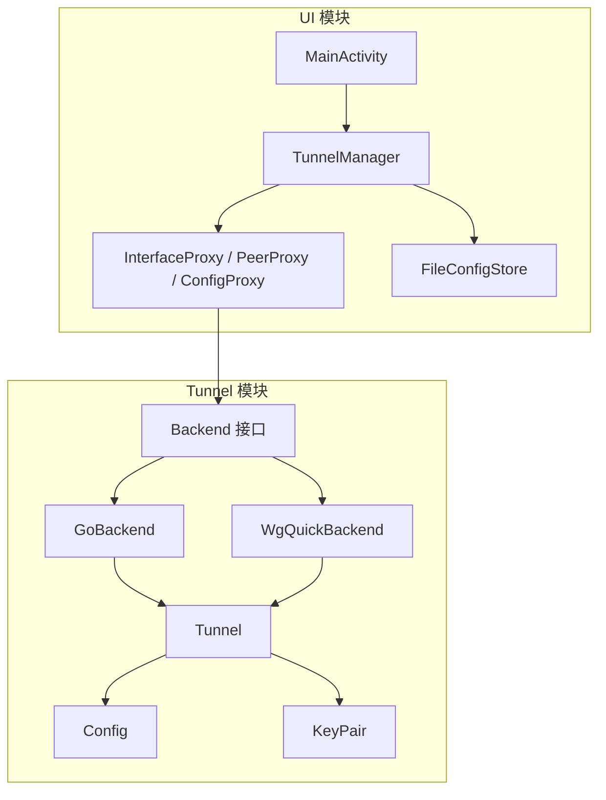
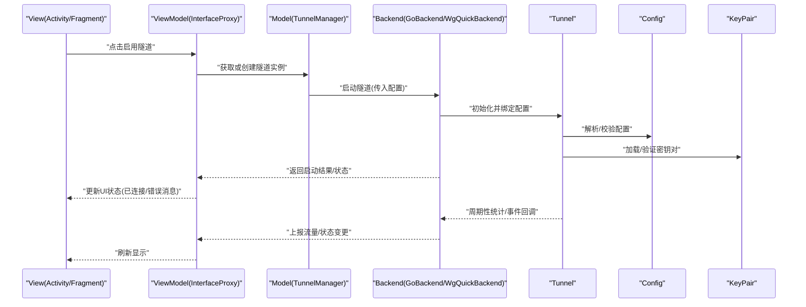
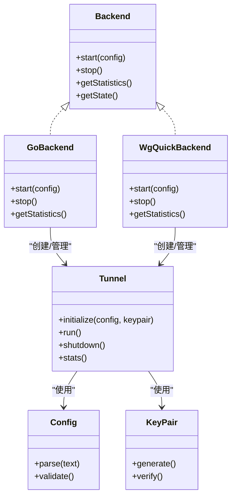
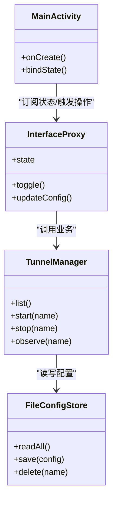
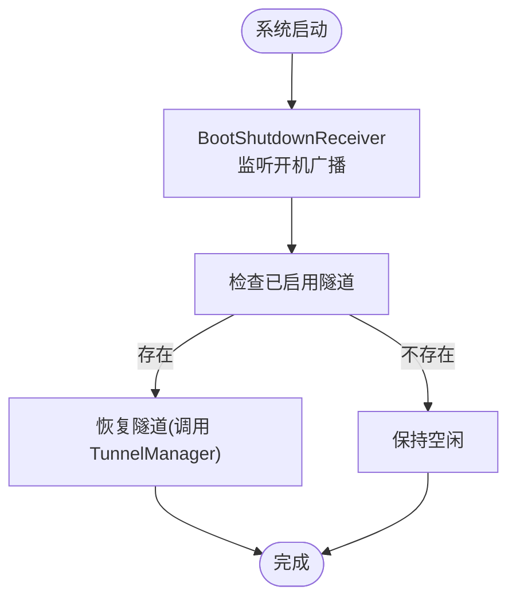
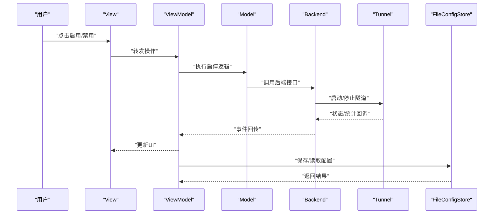
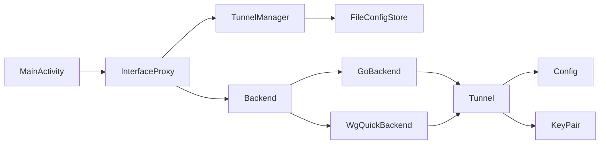

# 整体架构概览

<cite>
**本文档引用的文件**   
- [README.md](file://README.md)
- [build.gradle.kts](file://build.gradle.kts)
- [settings.gradle.kts](file://settings.gradle.kts)
- [tunnel/build.gradle.kts](file://tunnel/build.gradle.kts)
- [ui/build.gradle.kts](file://ui/build.gradle.kts)
- [tunnel/src/main/java/com/wireguard/android/backend/Backend.java](file://tunnel/src/main/java/com/wireguard/android/backend/Backend.java)
- [tunnel/src/main/java/com/wireguard/android/backend/GoBackend.java](file://tunnel/src/main/java/com/wireguard/android/backend/GoBackend.java)
- [tunnel/src/main/java/com/wireguard/android/backend/WgQuickBackend.java](file://tunnel/src/main/java/com/wireguard/android/backend/WgQuickBackend.java)
- [tunnel/src/main/java/com/wireguard/android/backend/Tunnel.java](file://tunnel/src/main/java/com/wireguard/android/backend/Tunnel.java)
- [tunnel/src/main/java/com/wireguard/config/Config.java](file://tunnel/src/main/java/com/wireguard/config/Config.java)
- [tunnel/src/main/java/com/wireguard/crypto/KeyPair.java](file://tunnel/src/main/java/com/wireguard/crypto/KeyPair.java)
- [ui/src/main/java/com/wireguard/android/Application.kt](file://ui/src/main/java/com/wireguard/android/Application.kt)
- [ui/src/main/java/com/wireguard/android/activity/MainActivity.kt](file://ui/src/main/java/com/wireguard/android/activity/MainActivity.kt)
- [ui/src/main/java/com/wireguard/android/model/TunnelManager.kt](file://ui/src/main/java/com/wireguard/android/model/TunnelManager.kt)
- [ui/src/main/java/com/wireguard/android/viewmodel/InterfaceProxy.kt](file://ui/src/main/java/com/wireguard/android/viewmodel/InterfaceProxy.kt)
- [ui/src/main/java/com/wireguard/android/configStore/FileConfigStore.kt](file://ui/src/main/java/com/wireguard/android/configStore/FileConfigStore.kt)
- [ui/src/main/java/com/wireguard/android/BootShutdownReceiver.kt](file://ui/src/main/java/com/wireguard/android/BootShutdownReceiver.kt)
- [ui/src/main/java/com/wireguard/android/QuickTileService.kt](file://ui/src/main/java/com/wireguard/android/QuickTileService.kt)
</cite>

## 目录
1. [简介](#简介)
2. [项目结构](#项目结构)
3. [核心组件](#核心组件)
4. [架构总览](#架构总览)
5. [详细组件分析](#详细组件分析)
6. [依赖关系分析](#依赖关系分析)
7. [性能考量](#性能考量)
8. [故障排查指南](#故障排查指南)
9. [结论](#结论)
10. [附录](#附录)（如有需要）

## 简介
本文件为 WireGuard Android 项目的整体架构概览，面向不同技术背景的读者，系统阐述应用的高层架构模式、模块化设计、分层架构与组件关系。重点说明 tunnel 模块与 ui 模块的职责分离及通信机制，解释 MVVM 架构在 View、ViewModel、Model 层的职责划分，记录系统边界、外部依赖集成点与数据流向，并通过架构图与组件交互图展示各模块如何协同工作以提供完整的 VPN 功能。

## 项目结构
项目采用多模块 Gradle 工程组织：
- tunnel 模块：封装 WireGuard 内核/用户态实现与配置解析、密钥处理等底层能力，通过 Java API 暴露给上层。
- ui 模块：基于 Kotlin + Android Jetpack（Activity/Fragment、ViewModel、DataBinding），负责界面、用户交互、状态管理与持久化。

图表来源
- [ui/src/main/java/com/wireguard/android/activity/MainActivity.kt](file://ui/src/main/java/com/wireguard/android/activity/MainActivity.kt)
- [ui/src/main/java/com/wireguard/android/model/TunnelManager.kt](file://ui/src/main/java/com/wireguard/android/model/TunnelManager.kt)
- [ui/src/main/java/com/wireguard/android/viewmodel/InterfaceProxy.kt](file://ui/src/main/java/com/wireguard/android/viewmodel/InterfaceProxy.kt)
- [ui/src/main/java/com/wireguard/android/configStore/FileConfigStore.kt](file://ui/src/main/java/com/wireguard/android/configStore/FileConfigStore.kt)
- [tunnel/src/main/java/com/wireguard/android/backend/Backend.java](file://tunnel/src/main/java/com/wireguard/android/backend/Backend.java)
- [tunnel/src/main/java/com/wireguard/android/backend/GoBackend.java](file://tunnel/src/main/java/com/wireguard/android/backend/GoBackend.java)
- [tunnel/src/main/java/com/wireguard/android/backend/WgQuickBackend.java](file://tunnel/src/main/java/com/wireguard/android/backend/WgQuickBackend.java)
- [tunnel/src/main/java/com/wireguard/android/backend/Tunnel.java](file://tunnel/src/main/java/com/wireguard/android/backend/Tunnel.java)
- [tunnel/src/main/java/com/wireguard/config/Config.java](file://tunnel/src/main/java/com/wireguard/config/Config.java)
- [tunnel/src/main/java/com/wireguard/crypto/KeyPair.java](file://tunnel/src/main/java/com/wireguard/crypto/KeyPair.java)

章节来源
- [build.gradle.kts](file://build.gradle.kts)
- [settings.gradle.kts](file://settings.gradle.kts)
- [tunnel/build.gradle.kts](file://tunnel/build.gradle.kts)
- [ui/build.gradle.kts](file://ui/build.gradle.kts)

## 核心组件
- 后端抽象 Backend：定义隧道生命周期管理、统计信息、启动/停止等统一接口，屏蔽具体实现差异。
- GoBackend：基于 Go 实现的 WireGuard 内核/用户态桥接，通过 JNI 调用 libwg-go。
- WgQuickBackend：兼容 wg-quick 风格的配置文件加载与隧道创建流程。
- Tunnel：封装单个隧道的运行时状态、统计、事件回调与资源管理。
- Config：WireGuard 配置模型与校验，包含接口、对端、网络地址等结构化数据。
- KeyPair：非对称密钥对生成与校验，用于握手与加密。
- UI 层 Activity/Fragment：承载页面与用户交互。
- ViewModel（Proxy）：InterfaceProxy/PeerProxy/ConfigProxy 作为 MVVM 的中间层，聚合业务逻辑并暴露可观察状态。
- Model：TunnelManager 管理多个隧道实例的生命周期与状态；FileConfigStore 负责配置的持久化。
- 系统扩展：BootShutdownReceiver 监听开机广播恢复隧道；QuickTileService 提供快捷开关入口。

章节来源
- [tunnel/src/main/java/com/wireguard/android/backend/Backend.java](file://tunnel/src/main/java/com/wireguard/android/backend/Backend.java)
- [tunnel/src/main/java/com/wireguard/android/backend/GoBackend.java](file://tunnel/src/main/java/com/wireguard/android/backend/GoBackend.java)
- [tunnel/src/main/java/com/wireguard/android/backend/WgQuickBackend.java](file://tunnel/src/main/java/com/wireguard/android/backend/WgQuickBackend.java)
- [tunnel/src/main/java/com/wireguard/android/backend/Tunnel.java](file://tunnel/src/main/java/com/wireguard/android/backend/Tunnel.java)
- [tunnel/src/main/java/com/wireguard/config/Config.java](file://tunnel/src/main/java/com/wireguard/config/Config.java)
- [tunnel/src/main/java/com/wireguard/crypto/KeyPair.java](file://tunnel/src/main/java/com/wireguard/crypto/KeyPair.java)
- [ui/src/main/java/com/wireguard/android/model/TunnelManager.kt](file://ui/src/main/java/com/wireguard/android/model/TunnelManager.kt)
- [ui/src/main/java/com/wireguard/android/viewmodel/InterfaceProxy.kt](file://ui/src/main/java/com/wireguard/android/viewmodel/InterfaceProxy.kt)
- [ui/src/main/java/com/wireguard/android/configStore/FileConfigStore.kt](file://ui/src/main/java/com/wireguard/android/configStore/FileConfigStore.kt)
- [ui/src/main/java/com/wireguard/android/BootShutdownReceiver.kt](file://ui/src/main/java/com/wireguard/android/BootShutdownReceiver.kt)
- [ui/src/main/java/com/wireguard/android/QuickTileService.kt](file://ui/src/main/java/com/wireguard/android/QuickTileService.kt)

## 架构总览
应用遵循“UI 层 - 业务层 - 数据层 - 后端抽象”的分层架构，结合 MVVM 模式：
- View（Activity/Fragment）：仅负责渲染与用户输入转发。
- ViewModel（Proxy）：持有可观察状态，编排业务逻辑，订阅后端事件，向 View 推送更新。
- Model（TunnelManager + FileConfigStore）：管理隧道集合与配置持久化。
- Backend（Backend 接口 + Go/WgQuick 实现）：屏蔽底层实现细节，向上提供统一的隧道控制与统计接口。

图表来源
- [ui/src/main/java/com/wireguard/android/activity/MainActivity.kt](file://ui/src/main/java/com/wireguard/android/activity/MainActivity.kt)
- [ui/src/main/java/com/wireguard/android/viewmodel/InterfaceProxy.kt](file://ui/src/main/java/com/wireguard/android/viewmodel/InterfaceProxy.kt)
- [ui/src/main/java/com/wireguard/android/model/TunnelManager.kt](file://ui/src/main/java/com/wireguard/android/model/TunnelManager.kt)
- [tunnel/src/main/java/com/wireguard/android/backend/Backend.java](file://tunnel/src/main/java/com/wireguard/android/backend/Backend.java)
- [tunnel/src/main/java/com/wireguard/android/backend/GoBackend.java](file://tunnel/src/main/java/com/wireguard/android/backend/GoBackend.java)
- [tunnel/src/main/java/com/wireguard/android/backend/WgQuickBackend.java](file://tunnel/src/main/java/com/wireguard/android/backend/WgQuickBackend.java)
- [tunnel/src/main/java/com/wireguard/android/backend/Tunnel.java](file://tunnel/src/main/java/com/wireguard/android/backend/Tunnel.java)
- [tunnel/src/main/java/com/wireguard/config/Config.java](file://tunnel/src/main/java/com/wireguard/config/Config.java)
- [tunnel/src/main/java/com/wireguard/crypto/KeyPair.java](file://tunnel/src/main/java/com/wireguard/crypto/KeyPair.java)

## 详细组件分析

### 后端抽象与实现（Backend/GoBackend/WgQuickBackend/Tunnel）
- Backend 接口：定义 start()/stop()/getStatistics() 等统一方法，确保 UI 与具体实现解耦。
- GoBackend：通过 JNI 调用 libwg-go，完成内核/用户态对接，具备高性能与跨平台优势。
- WgQuickBackend：支持 wg-quick 风格配置，便于迁移与兼容性。
- Tunnel：封装单隧道生命周期、统计、事件回调，内部依赖 Config 与 KeyPair。

图表来源
- [tunnel/src/main/java/com/wireguard/android/backend/Backend.java](file://tunnel/src/main/java/com/wireguard/android/backend/Backend.java)
- [tunnel/src/main/java/com/wireguard/android/backend/GoBackend.java](file://tunnel/src/main/java/com/wireguard/android/backend/GoBackend.java)
- [tunnel/src/main/java/com/wireguard/android/backend/WgQuickBackend.java](file://tunnel/src/main/java/com/wireguard/android/backend/WgQuickBackend.java)
- [tunnel/src/main/java/com/wireguard/android/backend/Tunnel.java](file://tunnel/src/main/java/com/wireguard/android/backend/Tunnel.java)
- [tunnel/src/main/java/com/wireguard/config/Config.java](file://tunnel/src/main/java/com/wireguard/config/Config.java)
- [tunnel/src/main/java/com/wireguard/crypto/KeyPair.java](file://tunnel/src/main/java/com/wireguard/crypto/KeyPair.java)

章节来源
- [tunnel/src/main/java/com/wireguard/android/backend/Backend.java](file://tunnel/src/main/java/com/wireguard/android/backend/Backend.java)
- [tunnel/src/main/java/com/wireguard/android/backend/GoBackend.java](file://tunnel/src/main/java/com/wireguard/android/backend/GoBackend.java)
- [tunnel/src/main/java/com/wireguard/android/backend/WgQuickBackend.java](file://tunnel/src/main/java/com/wireguard/android/backend/WgQuickBackend.java)
- [tunnel/src/main/java/com/wireguard/android/backend/Tunnel.java](file://tunnel/src/main/java/com/wireguard/android/backend/Tunnel.java)
- [tunnel/src/main/java/com/wireguard/config/Config.java](file://tunnel/src/main/java/com/wireguard/config/Config.java)
- [tunnel/src/main/java/com/wireguard/crypto/KeyPair.java](file://tunnel/src/main/java/com/wireguard/crypto/KeyPair.java)

### UI 层与 MVVM（Activity/Fragment + InterfaceProxy/PeerProxy/ConfigProxy）
- View：Activity/Fragment 仅做 UI 渲染与事件转发，不直接操作隧道。
- ViewModel（Proxy）：InterfaceProxy/PeerProxy/ConfigProxy 聚合业务逻辑，维护可观察状态，协调 Model 与 Backend。
- Model：TunnelManager 管理多个隧道实例；FileConfigStore 负责配置文件的读写与版本兼容。

图表来源
- [ui/src/main/java/com/wireguard/android/activity/MainActivity.kt](file://ui/src/main/java/com/wireguard/android/activity/MainActivity.kt)
- [ui/src/main/java/com/wireguard/android/viewmodel/InterfaceProxy.kt](file://ui/src/main/java/com/wireguard/android/viewmodel/InterfaceProxy.kt)
- [ui/src/main/java/com/wireguard/android/model/TunnelManager.kt](file://ui/src/main/java/com/wireguard/android/model/TunnelManager.kt)
- [ui/src/main/java/com/wireguard/android/configStore/FileConfigStore.kt](file://ui/src/main/java/com/wireguard/android/configStore/FileConfigStore.kt)

章节来源
- [ui/src/main/java/com/wireguard/android/activity/MainActivity.kt](file://ui/src/main/java/com/wireguard/android/activity/MainActivity.kt)
- [ui/src/main/java/com/wireguard/android/viewmodel/InterfaceProxy.kt](file://ui/src/main/java/com/wireguard/android/viewmodel/InterfaceProxy.kt)
- [ui/src/main/java/com/wireguard/android/model/TunnelManager.kt](file://ui/src/main/java/com/wireguard/android/model/TunnelManager.kt)
- [ui/src/main/java/com/wireguard/android/configStore/FileConfigStore.kt](file://ui/src/main/java/com/wireguard/android/configStore/FileConfigStore.kt)

### 系统边界与外部依赖集成
- 系统广播：BootShutdownReceiver 监听开机广播，自动恢复已启用的隧道。
- 快捷服务：QuickTileService 提供系统快捷开关，快速启停隧道。
- 外部库：tunnel 模块通过 JNI 集成 libwg-go，实现高性能 VPN 内核/用户态桥接。
- 配置存储：FileConfigStore 将配置序列化到本地文件，保证重启后状态可恢复。

图表来源
- [ui/src/main/java/com/wireguard/android/BootShutdownReceiver.kt](file://ui/src/main/java/com/wireguard/android/BootShutdownReceiver.kt)
- [ui/src/main/java/com/wireguard/android/model/TunnelManager.kt](file://ui/src/main/java/com/wireguard/android/model/TunnelManager.kt)

章节来源
- [ui/src/main/java/com/wireguard/android/BootShutdownReceiver.kt](file://ui/src/main/java/com/wireguard/android/BootShutdownReceiver.kt)
- [ui/src/main/java/com/wireguard/android/QuickTileService.kt](file://ui/src/main/java/com/wireguard/android/QuickTileService.kt)

### 数据流与状态流转
- 用户操作 -> ViewModel -> Model -> Backend -> Tunnel -> Config/KeyPair
- 反向事件：Tunnel 统计/状态变化 -> Backend -> ViewModel -> View 更新
- 配置持久化：ViewModel/Model 读写 FileConfigStore，确保一致性

图表来源
- [ui/src/main/java/com/wireguard/android/activity/MainActivity.kt](file://ui/src/main/java/com/wireguard/android/activity/MainActivity.kt)
- [ui/src/main/java/com/wireguard/android/viewmodel/InterfaceProxy.kt](file://ui/src/main/java/com/wireguard/android/viewmodel/InterfaceProxy.kt)
- [ui/src/main/java/com/wireguard/android/model/TunnelManager.kt](file://ui/src/main/java/com/wireguard/android/model/TunnelManager.kt)
- [ui/src/main/java/com/wireguard/android/configStore/FileConfigStore.kt](file://ui/src/main/java/com/wireguard/android/configStore/FileConfigStore.kt)
- [tunnel/src/main/java/com/wireguard/android/backend/Backend.java](file://tunnel/src/main/java/com/wireguard/android/backend/Backend.java)
- [tunnel/src/main/java/com/wireguard/android/backend/Tunnel.java](file://tunnel/src/main/java/com/wireguard/android/backend/Tunnel.java)

## 依赖关系分析
- UI 模块依赖 tunnel 模块提供的 Backend 接口，避免直接耦合具体实现。
- ViewModel 依赖 Model（TunnelManager）与配置存储（FileConfigStore）。
- Tunnel 依赖 Config 与 KeyPair，形成清晰的单向依赖链。
- 系统级组件（BootShutdownReceiver、QuickTileService）通过 Android 框架能力与 UI/Model 协作。

图表来源
- [ui/src/main/java/com/wireguard/android/activity/MainActivity.kt](file://ui/src/main/java/com/wireguard/android/activity/MainActivity.kt)
- [ui/src/main/java/com/wireguard/android/viewmodel/InterfaceProxy.kt](file://ui/src/main/java/com/wireguard/android/viewmodel/InterfaceProxy.kt)
- [ui/src/main/java/com/wireguard/android/model/TunnelManager.kt](file://ui/src/main/java/com/wireguard/android/model/TunnelManager.kt)
- [ui/src/main/java/com/wireguard/android/configStore/FileConfigStore.kt](file://ui/src/main/java/com/wireguard/android/configStore/FileConfigStore.kt)
- [tunnel/src/main/java/com/wireguard/android/backend/Backend.java](file://tunnel/src/main/java/com/wireguard/android/backend/Backend.java)
- [tunnel/src/main/java/com/wireguard/android/backend/GoBackend.java](file://tunnel/src/main/java/com/wireguard/android/backend/GoBackend.java)
- [tunnel/src/main/java/com/wireguard/android/backend/WgQuickBackend.java](file://tunnel/src/main/java/com/wireguard/android/backend/WgQuickBackend.java)
- [tunnel/src/main/java/com/wireguard/android/backend/Tunnel.java](file://tunnel/src/main/java/com/wireguard/android/backend/Tunnel.java)
- [tunnel/src/main/java/com/wireguard/config/Config.java](file://tunnel/src/main/java/com/wireguard/config/Config.java)
- [tunnel/src/main/java/com/wireguard/crypto/KeyPair.java](file://tunnel/src/main/java/com/wireguard/crypto/KeyPair.java)

章节来源
- [build.gradle.kts](file://build.gradle.kts)
- [settings.gradle.kts](file://settings.gradle.kts)
- [tunnel/build.gradle.kts](file://tunnel/build.gradle.kts)
- [ui/build.gradle.kts](file://ui/build.gradle.kts)

## 性能考量
- 后端选择：GoBackend 通过 JNI 调用 libwg-go，具备高吞吐与低延迟特性，适合高频数据包处理。
- 状态更新：ViewModel 中采用可观察状态，减少不必要的 UI 重绘与计算。
- 配置读写：FileConfigStore 应进行批量读写与缓存策略优化，避免频繁 I/O。
- 统计上报：Tunnel 统计回调频率需合理设置，避免阻塞主线程。

[本节为通用性能建议，不直接分析具体文件]

## 故障排查指南
- 启动失败：检查 Backend.start() 返回值与异常信息，确认 Config 与 KeyPair 有效性。
- 连接不稳定：关注 Tunnel 统计回调中的丢包/重传指标，定位网络问题。
- 配置不一致：核对 FileConfigStore 中的配置与内存状态是否同步。
- 系统重启未恢复：确认 BootShutdownReceiver 是否正确注册并触发恢复流程。
- 快捷开关无效：检查 QuickTileService 权限与系统版本兼容性。

章节来源
- [tunnel/src/main/java/com/wireguard/android/backend/Backend.java](file://tunnel/src/main/java/com/wireguard/android/backend/Backend.java)
- [tunnel/src/main/java/com/wireguard/android/backend/Tunnel.java](file://tunnel/src/main/java/com/wireguard/android/backend/Tunnel.java)
- [ui/src/main/java/com/wireguard/android/configStore/FileConfigStore.kt](file://ui/src/main/java/com/wireguard/android/configStore/FileConfigStore.kt)
- [ui/src/main/java/com/wireguard/android/BootShutdownReceiver.kt](file://ui/src/main/java/com/wireguard/android/BootShutdownReceiver.kt)
- [ui/src/main/java/com/wireguard/android/QuickTileService.kt](file://ui/src/main/java/com/wireguard/android/QuickTileService.kt)

## 结论
WireGuard Android 采用清晰的分层与模块化设计，UI 与隧道能力解耦，MVVM 模式有效隔离视图与业务逻辑。Backend 抽象统一了不同实现，Tunnel 聚焦单隧道生命周期，Config/KeyPair 提供基础数据结构。系统级组件完善用户体验与可靠性。该架构在保证高性能的同时，具备良好的可扩展性与可维护性。

[本节为总结性内容，不直接分析具体文件]

## 附录
- 参考文档：README.md 提供项目背景与使用说明。
- 构建脚本：build.gradle.kts/settings.gradle.kts 定义模块依赖与构建配置。

章节来源
- [README.md](file://README.md)
- [build.gradle.kts](file://build.gradle.kts)
- [settings.gradle.kts](file://settings.gradle.kts)