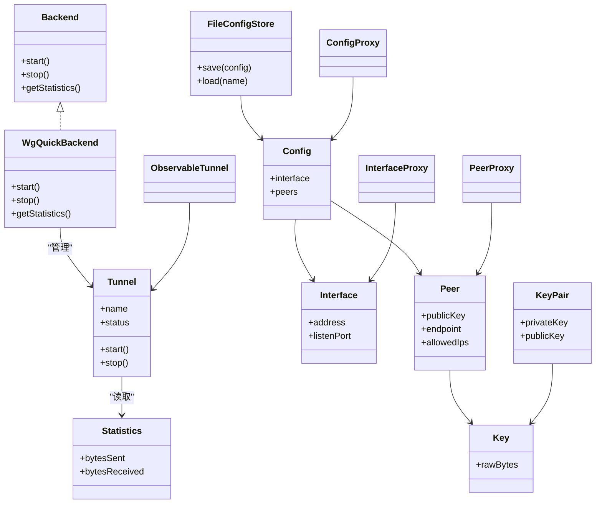
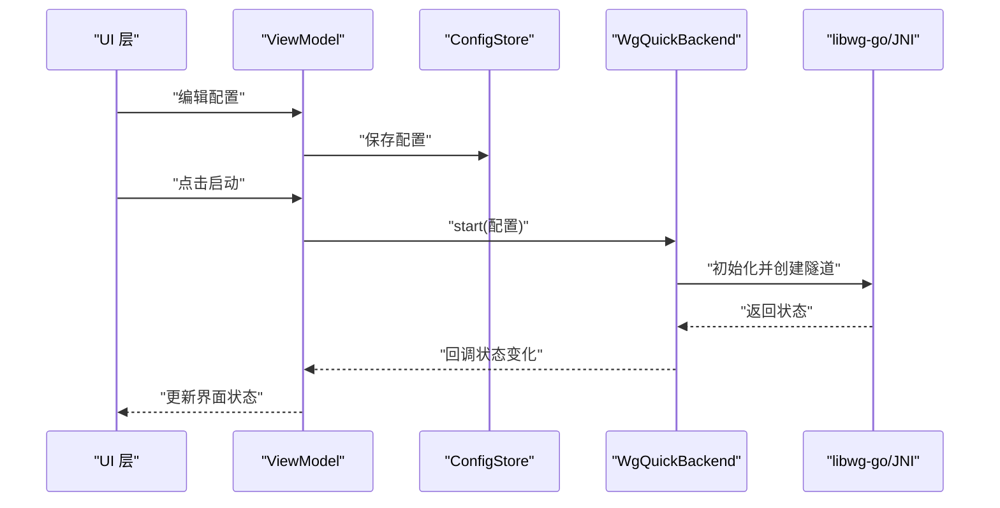
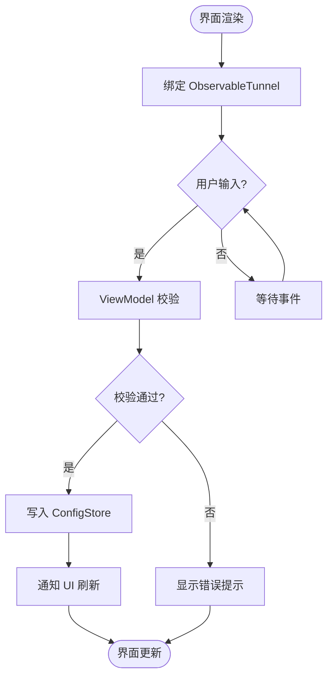
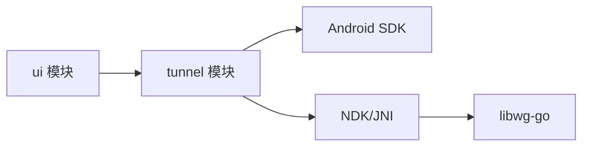

# 架构设计

<cite>
**本文引用的文件**   
- [README.md](file://README.md)
- [build.gradle.kts](file://build.gradle.kts)
- [settings.gradle.kts](file://settings.gradle.kts)
- [gradle.properties](file://gradle.properties)
- [tunnel/build.gradle.kts](file://tunnel/build.gradle.kts)
- [ui/build.gradle.kts](file://ui/build.gradle.kts)
- [tunnel/src/main/java/com/wireguard/android/backend/Backend.java](file://tunnel/src/main/java/com/wireguard/android/backend/Backend.java)
- [tunnel/src/main/java/com/wireguard/android/backend/WgQuickBackend.java](file://tunnel/src/main/java/com/wireguard/android/backend/WgQuickBackend.java)
- [tunnel/src/main/java/com/wireguard/android/backend/Tunnel.java](file://tunnel/src/main/java/com/wireguard/android/backend/Tunnel.java)
- [tunnel/src/main/java/com/wireguard/android/backend/Statistics.java](file://tunnel/src/main/java/com/wireguard/android/backend/Statistics.java)
- [tunnel/src/main/java/com/wireguard/config/Config.java](file://tunnel/src/main/java/com/wireguard/config/Config.java)
- [tunnel/src/main/java/com/wireguard/config/Interface.java](file://tunnel/src/main/java/com/wireguard/config/Interface.java)
- [tunnel/src/main/java/com/wireguard/config/Peer.java](file://tunnel/src/main/java/com/wireguard/config/Peer.java)
- [tunnel/src/main/java/com/wireguard/crypto/Key.java](file://tunnel/src/main/java/com/wireguard/crypto/Key.java)
- [tunnel/src/main/java/com/wireguard/crypto/KeyPair.java](file://tunnel/src/main/java/com/wireguard/crypto/KeyPair.java)
- [tunnel/src/main/java/com/wireguard/android/util/RootShell.java](file://tunnel/src/main/java/com/wireguard/android/util/RootShell.java)
- [tunnel/src/main/java/com/wireguard/android/util/SharedLibraryLoader.java](file://tunnel/src/main/java/com/wireguard/android/util/SharedLibraryLoader.java)
- [tunnel/tools/libwg-go/api-android.go](file://tunnel/tools/libwg-go/api-android.go)
- [tunnel/tools/libwg-go/jni.c](file://tunnel/tools/libwg-go/jni.c)
- [ui/src/main/java/com/wireguard/android/Application.kt](file://ui/src/main/java/com/wireguard/android/Application.kt)
- [ui/src/main/java/com/wireguard/android/activity/MainActivity.kt](file://ui/src/main/java/com/wireguard/android/activity/MainActivity.kt)
- [ui/src/main/java/com/wireguard/android/activity/TunnelCreatorActivity.kt](file://ui/src/main/java/com/wireguard/android/activity/TunnelCreatorActivity.kt)
- [ui/src/main/java/com/wireguard/android/activity/TunnelToggleActivity.kt](file://ui/src/main/java/com/wireguard/android/activity/TunnelToggleActivity.kt)
- [ui/src/main/java/com/wireguard/android/model/TunnelManager.kt](file://ui/src/main/java/com/wireguard/android/model/TunnelManager.kt)
- [ui/src/main/java/com/wireguard/android/model/ObservableTunnel.kt](file://ui/src/main/java/com/wireguard/android/model/ObservableTunnel.kt)
- [ui/src/main/java/com/wireguard/android/viewmodel/ConfigProxy.kt](file://ui/src/main/java/com/wireguard/android/viewmodel/ConfigProxy.kt)
- [ui/src/main/java/com/wireguard/android/viewmodel/InterfaceProxy.kt](file://ui/src/main/java/com/wireguard/android/viewmodel/InterfaceProxy.kt)
- [ui/src/main/java/com/wireguard/android/viewmodel/PeerProxy.kt](file://ui/src/main/java/com/wireguard/android/viewmodel/PeerProxy.kt)
- [ui/src/main/java/com/wireguard/android/configStore/FileConfigStore.kt](file://ui/src/main/java/com/wireguard/android/configStore/FileConfigStore.kt)
- [ui/src/main/java/com/wireguard/android/configStore/ConfigStore.kt](file://ui/src/main/java/com/wireguard/android/configStore/ConfigStore.kt)
- [ui/src/main/java/com/wireguard/android/BootShutdownReceiver.kt](file://ui/src/main/java/com/wireguard/android/BootShutdownReceiver.kt)
- [ui/src/main/java/com/wireguard/android/QuickTileService.kt](file://ui/src/main/java/com/wireguard/android/QuickTileService.kt)
</cite>

## 目录
1. [简介](#简介)
2. [项目结构](#项目结构)
3. [核心组件](#核心组件)
4. [架构总览](#架构总览)
5. [详细组件分析](#详细组件分析)
6. [依赖分析](#依赖分析)
7. [性能考虑](#性能考虑)
8. [故障排查指南](#故障排查指南)
9. [结论](#结论)
10. [附录](#附录)

## 简介
本架构设计文档面向 WireGuard Android 项目的整体设计与实现，重点阐述 MVVM 架构、模块化与接口抽象、组件交互关系、数据流与集成模式，以及技术决策与权衡。文档覆盖基础设施需求、可扩展性与部署拓扑，并给出系统上下文图与组件分解图。横切关注点包括安全性、监控与灾难恢复。同时明确 tunnel 模块与 ui 模块的职责分离及通信机制，记录技术栈、第三方依赖与版本兼容性。

## 项目结构
项目采用多模块 Gradle 工程：
- tunnel 模块：封装 WireGuard 内核/Go 后端、配置模型、加密原语与 Android 适配层（JNI/NDK）。
- ui 模块：基于 Kotlin + DataBinding + ViewModel 的 UI 层，负责用户交互、状态管理与持久化。
- 根构建脚本与设置脚本管理模块依赖、编译选项与产物。

```mermaid
graph TB
subgraph "应用进程"
UI["UI 模块<br/>Android 应用"]
TUNNEL["Tunnel 模块<br/>后端与配置"]
end
subgraph "系统层"
ANDROID["Android 框架<br/>Intent/Service/Receiver"]
KERNEL["Linux 内核<br/>WireGuard 驱动/Netlink"]
end
subgraph "外部库"
LIBWG["libwg-go<br/>Go 实现"]
JNI["JNI/NDK<br/>C 桥接"]
end
UI --> TUNNEL
TUNNEL --> JNI
JNI --> LIBWG
TUNNEL --> ANDROID
ANDROID --> KERNEL
```

图表来源
- [settings.gradle.kts](file://settings.gradle.kts)
- [tunnel/build.gradle.kts](file://tunnel/build.gradle.kts)
- [ui/build.gradle.kts](file://ui/build.gradle.kts)

章节来源
- [settings.gradle.kts](file://settings.gradle.kts)
- [build.gradle.kts](file://build.gradle.kts)
- [tunnel/build.gradle.kts](file://tunnel/build.gradle.kts)
- [ui/build.gradle.kts](file://ui/build.gradle.kts)

## 核心组件
- 隧道后端抽象与实现
  - Backend 接口定义统一的启动/停止/统计等能力。
  - WgQuickBackend 提供基于 wg-quick 的配置与生命周期管理。
  - Tunnel 表示单个隧道的运行时状态与操作。
  - Statistics 承载流量统计信息。
- 配置与加密
  - Config/Interface/Peer 描述 WireGuard 配置模型。
  - Key/KeyPair 提供密钥与密钥对处理。
- Android 适配与工具
  - RootShell 用于执行需要 root 权限的命令。
  - SharedLibraryLoader 加载 libwg-go 动态库。
  - api-android.go 与 jni.c 构成 Go/C/JNI 桥接。
- UI 层与 MVVM
  - Application/Activities/ViewModels 组织界面与业务编排。
  - ObservableTunnel 暴露可观察状态供 UI 绑定。
  - ConfigStore 抽象配置存储，FileConfigStore 实现文件持久化。
  - Proxy 类（ConfigProxy/InterfaceProxy/PeerProxy）将后端配置映射到 UI 视图模型。

章节来源
- [tunnel/src/main/java/com/wireguard/android/backend/Backend.java](file://tunnel/src/main/java/com/wireguard/android/backend/Backend.java)
- [tunnel/src/main/java/com/wireguard/android/backend/WgQuickBackend.java](file://tunnel/src/main/java/com/wireguard/android/backend/WgQuickBackend.java)
- [tunnel/src/main/java/com/wireguard/android/backend/Tunnel.java](file://tunnel/src/main/java/com/wireguard/android/backend/Tunnel.java)
- [tunnel/src/main/java/com/wireguard/android/backend/Statistics.java](file://tunnel/src/main/java/com/wireguard/android/backend/Statistics.java)
- [tunnel/src/main/java/com/wireguard/config/Config.java](file://tunnel/src/main/java/com/wireguard/config/Config.java)
- [tunnel/src/main/java/com/wireguard/config/Interface.java](file://tunnel/src/main/java/com/wireguard/config/Interface.java)
- [tunnel/src/main/java/com/wireguard/config/Peer.java](file://tunnel/src/main/java/com/wireguard/config/Peer.java)
- [tunnel/src/main/java/com/wireguard/crypto/Key.java](file://tunnel/src/main/java/com/wireguard/crypto/Key.java)
- [tunnel/src/main/java/com/wireguard/crypto/KeyPair.java](file://tunnel/src/main/java/com/wireguard/crypto/KeyPair.java)
- [tunnel/src/main/java/com/wireguard/android/util/RootShell.java](file://tunnel/src/main/java/com/wireguard/android/util/RootShell.java)
- [tunnel/src/main/java/com/wireguard/android/util/SharedLibraryLoader.java](file://tunnel/src/main/java/com/wireguard/android/util/SharedLibraryLoader.java)
- [tunnel/tools/libwg-go/api-android.go](file://tunnel/tools/libwg-go/api-android.go)
- [tunnel/tools/libwg-go/jni.c](file://tunnel/tools/libwg-go/jni.c)
- [ui/src/main/java/com/wireguard/android/Application.kt](file://ui/src/main/java/com/wireguard/android/Application.kt)
- [ui/src/main/java/com/wireguard/android/model/ObservableTunnel.kt](file://ui/src/main/java/com/wireguard/android/model/ObservableTunnel.kt)
- [ui/src/main/java/com/wireguard/android/configStore/ConfigStore.kt](file://ui/src/main/java/com/wireguard/android/configStore/ConfigStore.kt)
- [ui/src/main/java/com/wireguard/android/configStore/FileConfigStore.kt](file://ui/src/main/java/com/wireguard/android/configStore/FileConfigStore.kt)
- [ui/src/main/java/com/wireguard/android/viewmodel/ConfigProxy.kt](file://ui/src/main/java/com/wireguard/android/viewmodel/ConfigProxy.kt)
- [ui/src/main/java/com/wireguard/android/viewmodel/InterfaceProxy.kt](file://ui/src/main/java/com/wireguard/android/viewmodel/InterfaceProxy.kt)
- [ui/src/main/java/com/wireguard/android/viewmodel/PeerProxy.kt](file://ui/src/main/java/com/wireguard/android/viewmodel/PeerProxy.kt)

## 架构总览
系统采用分层与模块化结合的设计：
- UI 层（MVVM）：Activity/Fragment 作为 View，ViewModel 持有状态并与后端交互，DataBinding 驱动界面更新。
- 领域层（Tunnel）：以接口抽象后端能力，屏蔽具体实现差异；配置与加密为纯数据结构与算法。
- 平台适配层：通过 JNI/NDK 调用 libwg-go，借助 Android 框架访问网络栈与系统服务。
- 数据持久化：ConfigStore 抽象存储策略，默认文件实现。

图表来源
- [tunnel/src/main/java/com/wireguard/android/backend/Backend.java](file://tunnel/src/main/java/com/wireguard/android/backend/Backend.java)
- [tunnel/src/main/java/com/wireguard/android/backend/WgQuickBackend.java](file://tunnel/src/main/java/com/wireguard/android/backend/WgQuickBackend.java)
- [tunnel/src/main/java/com/wireguard/android/backend/Tunnel.java](file://tunnel/src/main/java/com/wireguard/android/backend/Tunnel.java)
- [tunnel/src/main/java/com/wireguard/android/backend/Statistics.java](file://tunnel/src/main/java/com/wireguard/android/backend/Statistics.java)
- [tunnel/src/main/java/com/wireguard/config/Config.java](file://tunnel/src/main/java/com/wireguard/config/Config.java)
- [tunnel/src/main/java/com/wireguard/config/Interface.java](file://tunnel/src/main/java/com/wireguard/config/Interface.java)
- [tunnel/src/main/java/com/wireguard/config/Peer.java](file://tunnel/src/main/java/com/wireguard/config/Peer.java)
- [tunnel/src/main/java/com/wireguard/crypto/Key.java](file://tunnel/src/main/java/com/wireguard/crypto/Key.java)
- [tunnel/src/main/java/com/wireguard/crypto/KeyPair.java](file://tunnel/src/main/java/com/wireguard/crypto/KeyPair.java)
- [ui/src/main/java/com/wireguard/android/configStore/FileConfigStore.kt](file://ui/src/main/java/com/wireguard/android/configStore/FileConfigStore.kt)
- [ui/src/main/java/com/wireguard/android/viewmodel/ConfigProxy.kt](file://ui/src/main/java/com/wireguard/android/viewmodel/ConfigProxy.kt)
- [ui/src/main/java/com/wireguard/android/viewmodel/InterfaceProxy.kt](file://ui/src/main/java/com/wireguard/android/viewmodel/InterfaceProxy.kt)
- [ui/src/main/java/com/wireguard/android/viewmodel/PeerProxy.kt](file://ui/src/main/java/com/wireguard/android/viewmodel/PeerProxy.kt)
- [ui/src/main/java/com/wireguard/android/model/ObservableTunnel.kt](file://ui/src/main/java/com/wireguard/android/model/ObservableTunnel.kt)

## 详细组件分析

### 隧道后端与配置子系统
- 职责
  - Backend 抽象统一的后端能力，WgQuickBackend 基于 wg-quick 实现。
  - Tunnel 封装单个隧道的生命周期与状态。
  - Config/Interface/Peer 描述配置模型，Key/KeyPair 处理密钥。
- 数据流
  - UI 通过 Proxy 对象修改配置，持久化由 ConfigStore 完成。
  - 启动时，WgQuickBackend 解析配置并调用底层库创建隧道。
  - 运行期，Statistics 周期性上报流量统计。
- 错误处理
  - 配置解析异常与密钥格式异常在配置层抛出。
  - 后端启动失败返回明确的错误码或异常类型。

图表来源
- [tunnel/src/main/java/com/wireguard/android/backend/WgQuickBackend.java](file://tunnel/src/main/java/com/wireguard/android/backend/WgQuickBackend.java)
- [tunnel/src/main/java/com/wireguard/config/Config.java](file://tunnel/src/main/java/com/wireguard/config/Config.java)
- [ui/src/main/java/com/wireguard/android/configStore/ConfigStore.kt](file://ui/src/main/java/com/wireguard/android/configStore/ConfigStore.kt)
- [tunnel/tools/libwg-go/api-android.go](file://tunnel/tools/libwg-go/api-android.go)
- [tunnel/tools/libwg-go/jni.c](file://tunnel/tools/libwg-go/jni.c)

章节来源
- [tunnel/src/main/java/com/wireguard/android/backend/Backend.java](file://tunnel/src/main/java/com/wireguard/android/backend/Backend.java)
- [tunnel/src/main/java/com/wireguard/android/backend/WgQuickBackend.java](file://tunnel/src/main/java/com/wireguard/android/backend/WgQuickBackend.java)
- [tunnel/src/main/java/com/wireguard/android/backend/Tunnel.java](file://tunnel/src/main/java/com/wireguard/android/backend/Tunnel.java)
- [tunnel/src/main/java/com/wireguard/config/Config.java](file://tunnel/src/main/java/com/wireguard/config/Config.java)
- [tunnel/src/main/java/com/wireguard/config/Interface.java](file://tunnel/src/main/java/com/wireguard/config/Interface.java)
- [tunnel/src/main/java/com/wireguard/config/Peer.java](file://tunnel/src/main/java/com/wireguard/config/Peer.java)
- [tunnel/src/main/java/com/wireguard/crypto/Key.java](file://tunnel/src/main/java/com/wireguard/crypto/Key.java)
- [tunnel/src/main/java/com/wireguard/crypto/KeyPair.java](file://tunnel/src/main/java/com/wireguard/crypto/KeyPair.java)

### UI 层与 MVVM 模式
- 职责
  - Activity/Fragment 负责展示与事件分发。
  - ViewModel 持有可观察状态（ObservableTunnel），协调后端与 UI。
  - Proxy 对象将后端配置映射为 UI 友好的数据结构。
- 数据绑定
  - DataBinding 直接绑定 ObservableTunnel 的属性变化。
  - 用户输入经 ViewModel 校验后写入 ConfigStore。
- 生命周期
  - Application 初始化全局依赖（如 ConfigStore、日志）。
  - BootShutdownReceiver 处理设备开机/关机事件，恢复或关闭隧道。

图表来源
- [ui/src/main/java/com/wireguard/android/model/ObservableTunnel.kt](file://ui/src/main/java/com/wireguard/android/model/ObservableTunnel.kt)
- [ui/src/main/java/com/wireguard/android/viewmodel/ConfigProxy.kt](file://ui/src/main/java/com/wireguard/android/viewmodel/ConfigProxy.kt)
- [ui/src/main/java/com/wireguard/android/configStore/FileConfigStore.kt](file://ui/src/main/java/com/wireguard/android/configStore/FileConfigStore.kt)

章节来源
- [ui/src/main/java/com/wireguard/android/activity/MainActivity.kt](file://ui/src/main/java/com/wireguard/android/activity/MainActivity.kt)
- [ui/src/main/java/com/wireguard/android/activity/TunnelCreatorActivity.kt](file://ui/src/main/java/com/wireguard/android/activity/TunnelCreatorActivity.kt)
- [ui/src/main/java/com/wireguard/android/activity/TunnelToggleActivity.kt](file://ui/src/main/java/com/wireguard/android/activity/TunnelToggleActivity.kt)
- [ui/src/main/java/com/wireguard/android/Application.kt](file://ui/src/main/java/com/wireguard/android/Application.kt)
- [ui/src/main/java/com/wireguard/android/model/ObservableTunnel.kt](file://ui/src/main/java/com/wireguard/android/model/ObservableTunnel.kt)
- [ui/src/main/java/com/wireguard/android/configStore/FileConfigStore.kt](file://ui/src/main/java/com/wireguard/android/configStore/FileConfigStore.kt)

### 配置存储与导入导出
- 存储抽象
  - ConfigStore 定义 save/load 接口，便于替换实现（如数据库、云同步）。
  - FileConfigStore 使用本地文件进行持久化。
- 导入导出
  - 支持从 QR/文本导入配置，导出为文件或分享。
  - 导入过程包含语法校验与密钥格式检查。

章节来源
- [ui/src/main/java/com/wireguard/android/configStore/ConfigStore.kt](file://ui/src/main/java/com/wireguard/android/configStore/ConfigStore.kt)
- [ui/src/main/java/com/wireguard/android/configStore/FileConfigStore.kt](file://ui/src/main/java/com/wireguard/android/configStore/FileConfigStore.kt)

### 系统广播与快捷入口
- BootShutdownReceiver 监听系统广播，确保开机后按策略恢复隧道。
- QuickTileService 提供快速开关入口，简化用户操作。

章节来源
- [ui/src/main/java/com/wireguard/android/BootShutdownReceiver.kt](file://ui/src/main/java/com/wireguard/android/BootShutdownReceiver.kt)
- [ui/src/main/java/com/wireguard/android/QuickTileService.kt](file://ui/src/main/java/com/wireguard/android/QuickTileService.kt)

## 依赖分析
- 模块依赖
  - ui 依赖 tunnel 提供的后端与配置模型。
  - tunnel 依赖 Android SDK 与 NDK 工具链。
- 外部依赖
  - libwg-go 提供 WireGuard 核心实现。
  - JNI/NDK 桥接 C/Go 与 Java/Kotlin。
- 版本与兼容性
  - gradle.properties 与 libs.versions.toml 集中管理版本。
  - 不同产品渠道可通过 build variants 控制清单与功能。

图表来源
- [settings.gradle.kts](file://settings.gradle.kts)
- [build.gradle.kts](file://build.gradle.kts)
- [gradle.properties](file://gradle.properties)

章节来源
- [settings.gradle.kts](file://settings.gradle.kts)
- [build.gradle.kts](file://build.gradle.kts)
- [gradle.properties](file://gradle.properties)

## 性能考虑
- 配置解析与验证应在后台线程执行，避免阻塞 UI。
- 统计信息采集应节流上报，降低频繁 I/O 与跨进程开销。
- 大文件导入/导出需分块处理，避免内存峰值过高。
- 动态库加载与初始化应延迟至首次使用，缩短冷启动时间。

## 故障排查指南
- 常见问题定位
  - 配置错误：检查 Config/Interface/Peer 字段合法性与密钥格式。
  - 启动失败：查看后端返回的错误码与日志输出。
  - 权限问题：确认 RootShell 是否具备所需权限。
- 调试建议
  - 启用详细日志，捕获 JNI/Go 层堆栈。
  - 使用 QuickTileService 快速复现开关流程。
  - 通过 FileConfigStore 导出/对比配置文件。

章节来源
- [tunnel/src/main/java/com/wireguard/android/util/RootShell.java](file://tunnel/src/main/java/com/wireguard/android/util/RootShell.java)
- [tunnel/tools/libwg-go/api-android.go](file://tunnel/tools/libwg-go/api-android.go)
- [tunnel/tools/libwg-go/jni.c](file://tunnel/tools/libwg-go/jni.c)

## 结论
本项目通过清晰的模块化与 MVVM 架构实现了 UI 与隧道后端的解耦，借助接口抽象与代理模式提升了可扩展性与可测试性。JNI/NDK 桥接使 Go 实现的 WireGuard 核心得以高效运行于 Android。配置与加密模型独立，便于扩展与验证。未来可在存储层引入更多实现，并在监控与诊断方面增强可观测性。

## 附录
- 技术栈
  - Kotlin/Java、Android SDK、Gradle、NDK/JNI、Go（libwg-go）。
- 第三方依赖
  - libwg-go 提供核心协议实现。
  - Android 系统服务（广播、快捷入口、权限）。
- 版本兼容性
  - 通过 gradle.properties 与 libs.versions.toml 统一管理。
  - 不同渠道构建变体支持差异化清单与功能。

章节来源
- [README.md](file://README.md)
- [gradle.properties](file://gradle.properties)