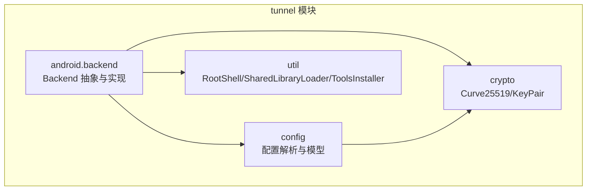
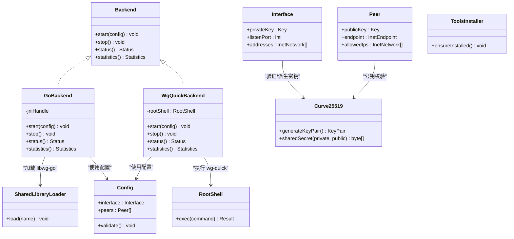
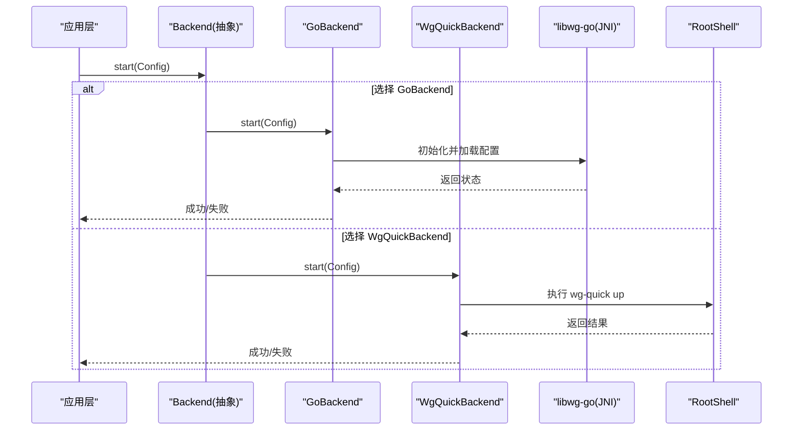
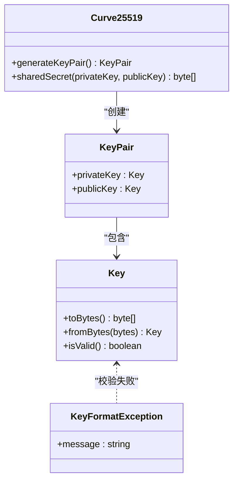
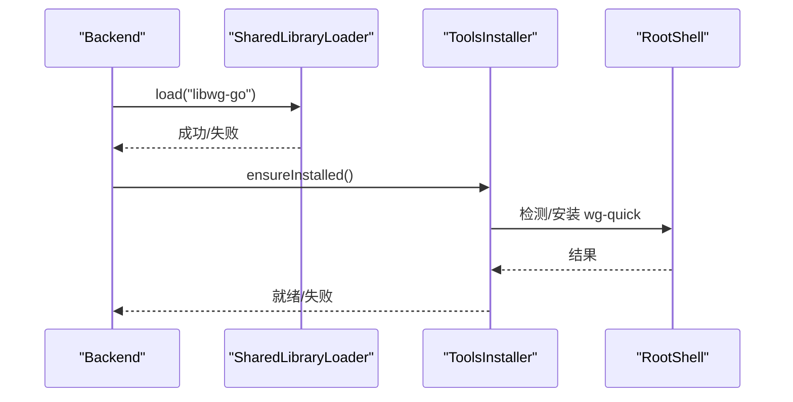
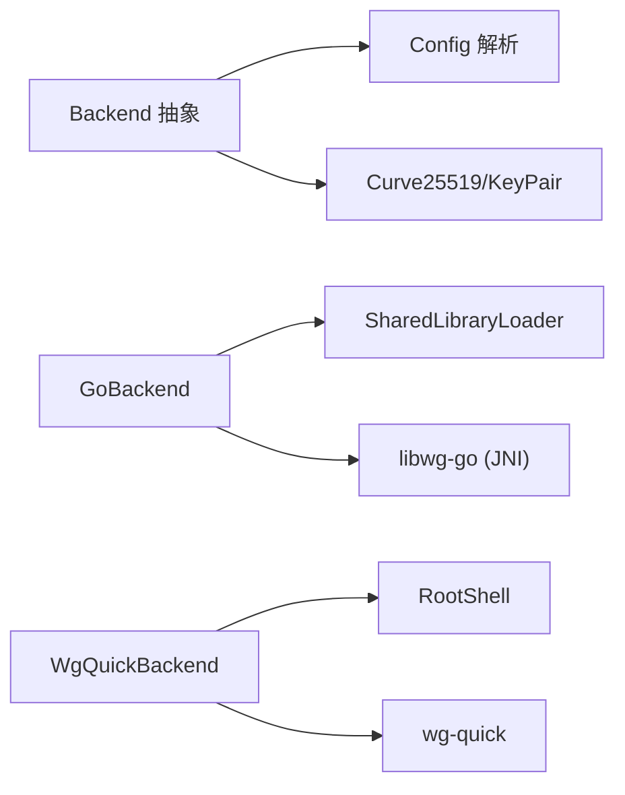

# Tunnel 核心模块设计

<cite>
**本文引用的文件**   
- [Backend.java](file://tunnel/src/main/java/com/wireguard/android/backend/Backend.java)
- [GoBackend.java](file://tunnel/src/main/java/com/wireguard/android/backend/GoBackend.java)
- [WgQuickBackend.java](file://tunnel/src/main/java/com/wireguard/android/backend/WgQuickBackend.java)
- [Tunnel.java](file://tunnel/src/main/java/com/wireguard/android/backend/Tunnel.java)
- [Statistics.java](file://tunnel/src/main/java/com/wireguard/android/backend/Statistics.java)
- [RootShell.java](file://tunnel/src/main/java/com/wireguard/android/util/RootShell.java)
- [SharedLibraryLoader.java](file://tunnel/src/main/java/com/wireguard/android/util/SharedLibraryLoader.java)
- [ToolsInstaller.java](file://tunnel/src/main/java/com/wireguard/android/util/ToolsInstaller.java)
- [Config.java](file://tunnel/src/main/java/com/wireguard/config/Config.java)
- [Interface.java](file://tunnel/src/main/java/com/wireguard/config/Interface.java)
- [Peer.java](file://tunnel/src/main/java/com/wireguard/config/Peer.java)
- [InetEndpoint.java](file://tunnel/src/main/java/com/wireguard/config/InetEndpoint.java)
- [InetNetwork.java](file://tunnel/src/main/java/com/wireguard/config/InetNetwork.java)
- [Attribute.java](file://tunnel/src/main/java/com/wireguard/config/Attribute.java)
- [BadConfigException.java](file://tunnel/src/main/java/com/wireguard/config/BadConfigException.java)
- [ParseException.java](file://tunnel/src/main/java/com/wireguard/config/ParseException.java)
- [Curve25519.java](file://tunnel/src/main/java/com/wireguard/crypto/Curve25519.java)
- [Key.java](file://tunnel/src/main/java/com/wireguard/crypto/Key.java)
- [KeyPair.java](file://tunnel/src/main/java/com/wireguard/crypto/KeyPair.java)
- [KeyFormatException.java](file://tunnel/src/main/java/com/wireguard/crypto/KeyFormatException.java)
- [api-android.go](file://tunnel/tools/libwg-go/api-android.go)
- [jni.c](file://tunnel/tools/libwg-go/jni.c)
</cite>

## 目录
1. [简介](#简介)
2. [项目结构](#项目结构)
3. [核心组件](#核心组件)
4. [架构总览](#架构总览)
5. [详细组件分析](#详细组件分析)
6. [依赖关系分析](#依赖关系分析)
7. [性能考虑](#性能考虑)
8. [故障排查指南](#故障排查指南)
9. [结论](#结论)
10. [附录](#附录)

## 简介
本设计文档聚焦 WireGuard Android 项目的 tunnel 核心模块，围绕 Backend 抽象层、配置解析器、加密工具库与系统工具接口四大主题展开。目标是帮助开发者理解该模块的架构设计、职责划分与关键数据流，并指导如何扩展新的后端实现或新增配置属性。

## 项目结构
tunnel 模块采用按功能域划分的包结构：
- android.backend：后端抽象与具体实现（GoBackend、WgQuickBackend）、隧道封装与统计
- config：WireGuard 配置文件解析与模型
- crypto：曲线密码学相关能力（Curve25519、密钥对等）
- util：系统工具（RootShell、SharedLibraryLoader、ToolsInstaller）

图表来源
- [Backend.java:1-200](file://tunnel/src/main/java/com/wireguard/android/backend/Backend.java#L1-L200)
- [Config.java:1-200](file://tunnel/src/main/java/com/wireguard/config/Config.java#L1-L200)
- [Curve25519.java:1-200](file://tunnel/src/main/java/com/wireguard/crypto/Curve25519.java#L1-L200)
- [RootShell.java:1-200](file://tunnel/src/main/java/com/wireguard/android/util/RootShell.java#L1-L200)

章节来源
- [Backend.java:1-200](file://tunnel/src/main/java/com/wireguard/android/backend/Backend.java#L1-L200)
- [Config.java:1-200](file://tunnel/src/main/java/com/wireguard/config/Config.java#L1-L200)
- [Curve25519.java:1-200](file://tunnel/src/main/java/com/wireguard/crypto/Curve25519.java#L1-L200)
- [RootShell.java:1-200](file://tunnel/src/main/java/com/wireguard/android/util/RootShell.java#L1-L200)

## 核心组件
- Backend 抽象层：定义统一的隧道生命周期与状态管理接口，屏蔽底层差异
- GoBackend：基于 libwg-go（JNI）的 Go 语言内核实现
- WgQuickBackend：基于 wg-quick 脚本的系统工具实现
- Config 解析器：将 .conf 文本解析为 Interface/Peer/Endpoint/Network 等对象模型
- Crypto：提供 Curve25519 密钥交换、KeyPair 生成与管理
- System Tools：RootShell 执行 root 命令、SharedLibraryLoader 加载动态库、ToolsInstaller 安装必要工具

章节来源
- [Backend.java:1-200](file://tunnel/src/main/java/com/wireguard/android/backend/Backend.java#L1-L200)
- [GoBackend.java:1-200](file://tunnel/src/main/java/com/wireguard/android/backend/GoBackend.java#L1-L200)
- [WgQuickBackend.java:1-200](file://tunnel/src/main/java/com/wireguard/android/backend/WgQuickBackend.java#L1-L200)
- [Config.java:1-200](file://tunnel/src/main/java/com/wireguard/config/Config.java#L1-L200)
- [Curve25519.java:1-200](file://tunnel/src/main/java/com/wireguard/crypto/Curve25519.java#L1-L200)
- [RootShell.java:1-200](file://tunnel/src/main/java/com/wireguard/android/util/RootShell.java#L1-L200)
- [SharedLibraryLoader.java:1-200](file://tunnel/src/main/java/com/wireguard/android/util/SharedLibraryLoader.java#L1-L200)
- [ToolsInstaller.java:1-200](file://tunnel/src/main/java/com/wireguard/android/util/ToolsInstaller.java#L1-L200)

## 架构总览
Backend 抽象层向上暴露统一 API，向下通过不同实现对接具体运行环境。GoBackend 通过 JNI 调用 libwg-go；WgQuickBackend 通过 RootShell 调用系统级 wg-quick 脚本。Config 解析器在启动前完成配置校验与转换，Crypto 负责密钥处理，System Tools 提供平台能力。

图表来源
- [Backend.java:1-200](file://tunnel/src/main/java/com/wireguard/android/backend/Backend.java#L1-L200)
- [GoBackend.java:1-200](file://tunnel/src/main/java/com/wireguard/android/backend/GoBackend.java#L1-L200)
- [WgQuickBackend.java:1-200](file://tunnel/src/main/java/com/wireguard/android/backend/WgQuickBackend.java#L1-L200)
- [Config.java:1-200](file://tunnel/src/main/java/com/wireguard/config/Config.java#L1-L200)
- [Interface.java:1-200](file://tunnel/src/main/java/com/wireguard/config/Interface.java#L1-L200)
- [Peer.java:1-200](file://tunnel/src/main/java/com/wireguard/config/Peer.java#L1-L200)
- [Curve25519.java:1-200](file://tunnel/src/main/java/com/wireguard/crypto/Curve25519.java#L1-L200)
- [RootShell.java:1-200](file://tunnel/src/main/java/com/wireguard/android/util/RootShell.java#L1-L200)
- [SharedLibraryLoader.java:1-200](file://tunnel/src/main/java/com/wireguard/android/util/SharedLibraryLoader.java#L1-L200)
- [ToolsInstaller.java:1-200](file://tunnel/src/main/java/com/wireguard/android/util/ToolsInstaller.java#L1-L200)

## 详细组件分析

### Backend 抽象层与实现
- 设计理念
  - 统一生命周期：start/stop/status/statistics 等接口保证上层无需关心底层差异
  - 错误隔离：异常封装为后端特定异常，便于上层区分处理
  - 可插拔：新增后端只需实现 Backend 接口
- GoBackend
  - 通过 JNI 调用 libwg-go，适合高性能与细粒度控制
  - 依赖 SharedLibraryLoader 加载动态库，依赖 RootShell 进行权限操作（如需要）
- WgQuickBackend
  - 通过 RootShell 调用系统级 wg-quick 脚本，部署简单，兼容性强
  - 适合快速集成与跨设备一致性

图表来源
- [Backend.java:1-200](file://tunnel/src/main/java/com/wireguard/android/backend/Backend.java#L1-L200)
- [GoBackend.java:1-200](file://tunnel/src/main/java/com/wireguard/android/backend/GoBackend.java#L1-L200)
- [WgQuickBackend.java:1-200](file://tunnel/src/main/java/com/wireguard/android/backend/WgQuickBackend.java#L1-L200)
- [api-android.go:1-200](file://tunnel/tools/libwg-go/api-android.go#L1-L200)
- [jni.c:1-200](file://tunnel/tools/libwg-go/jni.c#L1-L200)
- [RootShell.java:1-200](file://tunnel/src/main/java/com/wireguard/android/util/RootShell.java#L1-L200)

章节来源
- [Backend.java:1-200](file://tunnel/src/main/java/com/wireguard/android/backend/Backend.java#L1-L200)
- [GoBackend.java:1-200](file://tunnel/src/main/java/com/wireguard/android/backend/GoBackend.java#L1-L200)
- [WgQuickBackend.java:1-200](file://tunnel/src/main/java/com/wireguard/android/backend/WgQuickBackend.java#L1-L200)

### Config 配置解析器
- 支持格式
  - 标准 .conf 分段语法：[Interface]、[Peer] 等段与键值对
  - 字段类型：IP/网络、端口、布尔、十六进制/Base64 密钥等
- 验证机制
  - 必填字段检查（如 PrivateKey、PublicKey）
  - 格式校验（地址、端口范围、密钥长度与编码）
  - 语义校验（AllowedIPs 与 Endpoint 合理性）
- 错误处理
  - BadConfigException：结构性错误（缺失段、未知段）
  - ParseException：语法错误（非法字符、类型不匹配）
  - KeyFormatException：密钥格式错误

```mermaid
flowchart TD
Start(["开始解析"]) --> Read["读取配置文件"]
Read --> ParseSections["解析段落与键值"]
ParseSections --> ValidateSyntax{"语法正确?"}
ValidateSyntax --> |否| ErrSyntax["抛出 ParseException"]
ValidateSyntax --> |是| ValidateFields["字段校验"]
ValidateFields --> ValidateSemantics{"语义有效?"}
ValidateSemantics --> |否| ErrSemantic["抛出 BadConfigException"]
ValidateSemantics --> |是| BuildModel["构建 Interface/Peer 模型"]
BuildModel --> End(["完成"])
```

图表来源
- [Config.java:1-200](file://tunnel/src/main/java/com/wireguard/config/Config.java#L1-L200)
- [Interface.java:1-200](file://tunnel/src/main/java/com/wireguard/config/Interface.java#L1-L200)
- [Peer.java:1-200](file://tunnel/src/main/java/com/wireguard/config/Peer.java#L1-L200)
- [InetEndpoint.java:1-200](file://tunnel/src/main/java/com/wireguard/config/InetEndpoint.java#L1-L200)
- [InetNetwork.java:1-200](file://tunnel/src/main/java/com/wireguard/config/InetNetwork.java#L1-L200)
- [Attribute.java:1-200](file://tunnel/src/main/java/com/wireguard/config/Attribute.java#L1-L200)
- [BadConfigException.java:1-200](file://tunnel/src/main/java/com/wireguard/config/BadConfigException.java#L1-L200)
- [ParseException.java:1-200](file://tunnel/src/main/java/com/wireguard/config/ParseException.java#L1-L200)

章节来源
- [Config.java:1-200](file://tunnel/src/main/java/com/wireguard/config/Config.java#L1-L200)
- [Interface.java:1-200](file://tunnel/src/main/java/com/wireguard/config/Interface.java#L1-L200)
- [Peer.java:1-200](file://tunnel/src/main/java/com/wireguard/config/Peer.java#L1-L200)
- [InetEndpoint.java:1-200](file://tunnel/src/main/java/com/wireguard/config/InetEndpoint.java#L1-L200)
- [InetNetwork.java:1-200](file://tunnel/src/main/java/com/wireguard/config/InetNetwork.java#L1-L200)
- [Attribute.java:1-200](file://tunnel/src/main/java/com/wireguard/config/Attribute.java#L1-L200)
- [BadConfigException.java:1-200](file://tunnel/src/main/java/com/wireguard/config/BadConfigException.java#L1-L200)
- [ParseException.java:1-200](file://tunnel/src/main/java/com/wireguard/config/ParseException.java#L1-L200)

### 加密工具库（Curve25519 与 KeyPair）
- 设计要点
  - Curve25519 用于密钥交换，提供安全高效的共享密钥计算
  - KeyPair 管理私钥/公钥对，确保不可逆导出与最小暴露
  - Key 与 KeyFormatException 保障密钥格式与长度校验
- 使用模式
  - 生成密钥对：用于 Interface 私钥与 Peer 公钥
  - 共享密钥：用于会话密钥派生（由后端实现）
  - 安全存储：仅保留必要引用，避免明文持久化

图表来源
- [Curve25519.java:1-200](file://tunnel/src/main/java/com/wireguard/crypto/Curve25519.java#L1-L200)
- [KeyPair.java:1-200](file://tunnel/src/main/java/com/wireguard/crypto/KeyPair.java#L1-L200)
- [Key.java:1-200](file://tunnel/src/main/java/com/wireguard/crypto/Key.java#L1-L200)
- [KeyFormatException.java:1-200](file://tunnel/src/main/java/com/wireguard/crypto/KeyFormatException.java#L1-L200)

章节来源
- [Curve25519.java:1-200](file://tunnel/src/main/java/com/wireguard/crypto/Curve25519.java#L1-L200)
- [KeyPair.java:1-200](file://tunnel/src/main/java/com/wireguard/crypto/KeyPair.java#L1-L200)
- [Key.java:1-200](file://tunnel/src/main/java/com/wireguard/crypto/Key.java#L1-L200)
- [KeyFormatException.java:1-200](file://tunnel/src/main/java/com/wireguard/crypto/KeyFormatException.java#L1-L200)

### 系统工具接口（RootShell、SharedLibraryLoader、ToolsInstaller）
- RootShell
  - 执行 root 命令，封装输出与错误码，供后端调用系统能力
- SharedLibraryLoader
  - 动态加载 libwg-go 等原生库，处理路径与版本兼容性
- ToolsInstaller
  - 检测并安装必要的系统工具（如 wg-quick），确保运行环境完备

图表来源
- [SharedLibraryLoader.java:1-200](file://tunnel/src/main/java/com/wireguard/android/util/SharedLibraryLoader.java#L1-L200)
- [ToolsInstaller.java:1-200](file://tunnel/src/main/java/com/wireguard/android/util/ToolsInstaller.java#L1-L200)
- [RootShell.java:1-200](file://tunnel/src/main/java/com/wireguard/android/util/RootShell.java#L1-L200)

章节来源
- [RootShell.java:1-200](file://tunnel/src/main/java/com/wireguard/android/util/RootShell.java#L1-L200)
- [SharedLibraryLoader.java:1-200](file://tunnel/src/main/java/com/wireguard/android/util/SharedLibraryLoader.java#L1-L200)
- [ToolsInstaller.java:1-200](file://tunnel/src/main/java/com/wireguard/android/util/ToolsInstaller.java#L1-L200)

## 依赖关系分析
- 耦合与内聚
  - Backend 与 Config/Crypto 低耦合，通过接口与模型交互
  - GoBackend 依赖 SharedLibraryLoader 与 libwg-go
  - WgQuickBackend 依赖 RootShell 与系统工具
- 外部依赖
  - libwg-go（JNI）：高性能内核态能力
  - wg-quick：系统级脚本，简化部署

图表来源
- [Backend.java:1-200](file://tunnel/src/main/java/com/wireguard/android/backend/Backend.java#L1-L200)
- [GoBackend.java:1-200](file://tunnel/src/main/java/com/wireguard/android/backend/GoBackend.java#L1-L200)
- [WgQuickBackend.java:1-200](file://tunnel/src/main/java/com/wireguard/android/backend/WgQuickBackend.java#L1-L200)
- [Config.java:1-200](file://tunnel/src/main/java/com/wireguard/config/Config.java#L1-L200)
- [Curve25519.java:1-200](file://tunnel/src/main/java/com/wireguard/crypto/Curve25519.java#L1-L200)
- [RootShell.java:1-200](file://tunnel/src/main/java/com/wireguard/android/util/RootShell.java#L1-L200)
- [SharedLibraryLoader.java:1-200](file://tunnel/src/main/java/com/wireguard/android/util/SharedLibraryLoader.java#L1-L200)

章节来源
- [Backend.java:1-200](file://tunnel/src/main/java/com/wireguard/android/backend/Backend.java#L1-L200)
- [GoBackend.java:1-200](file://tunnel/src/main/java/com/wireguard/android/backend/GoBackend.java#L1-L200)
- [WgQuickBackend.java:1-200](file://tunnel/src/main/java/com/wireguard/android/backend/WgQuickBackend.java#L1-L200)
- [Config.java:1-200](file://tunnel/src/main/java/com/wireguard/config/Config.java#L1-L200)
- [Curve25519.java:1-200](file://tunnel/src/main/java/com/wireguard/crypto/Curve25519.java#L1-L200)
- [RootShell.java:1-200](file://tunnel/src/main/java/com/wireguard/android/util/RootShell.java#L1-L200)
- [SharedLibraryLoader.java:1-200](file://tunnel/src/main/java/com/wireguard/android/util/SharedLibraryLoader.java#L1-L200)

## 性能考虑
- 选择策略
  - GoBackend：适合高吞吐、低延迟场景，直接调用 libwg-go，减少进程间开销
  - WgQuickBackend：适合快速部署与跨设备一致性，但存在 shell 调用开销
- 资源管理
  - 动态库按需加载，避免冷启动负担
  - 配置解析一次性完成，缓存结果以减少重复解析
- I/O 与并发
  - RootShell 命令异步执行，避免阻塞 UI
  - 统计信息增量更新，降低频繁查询开销

## 故障排查指南
- 配置错误
  - BadConfigException：检查段名、必填字段与值范围
  - ParseException：检查语法与数据类型
  - KeyFormatException：检查密钥编码与长度
- 后端启动失败
  - GoBackend：确认 libwg-go 已加载且版本兼容
  - WgQuickBackend：确认 wg-quick 已安装且有执行权限
- 权限问题
  - RootShell 执行失败：检查 root 权限与环境变量

章节来源
- [BadConfigException.java:1-200](file://tunnel/src/main/java/com/wireguard/config/BadConfigException.java#L1-L200)
- [ParseException.java:1-200](file://tunnel/src/main/java/com/wireguard/config/ParseException.java#L1-L200)
- [KeyFormatException.java:1-200](file://tunnel/src/main/java/com/wireguard/crypto/KeyFormatException.java#L1-L200)
- [RootShell.java:1-200](file://tunnel/src/main/java/com/wireguard/android/util/RootShell.java#L1-L200)
- [SharedLibraryLoader.java:1-200](file://tunnel/src/main/java/com/wireguard/android/util/SharedLibraryLoader.java#L1-L200)
- [ToolsInstaller.java:1-200](file://tunnel/src/main/java/com/wireguard/android/util/ToolsInstaller.java#L1-L200)

## 结论
tunnel 核心模块通过 Backend 抽象层实现了后端解耦与可扩展性，配合完善的配置解析与安全加密能力，提供了稳定可靠的 VPN 连接能力。GoBackend 与 WgQuickBackend 的选择取决于性能与部署需求。建议在扩展新后端时遵循现有接口约定，并确保配置与密钥处理的健壮性。

## 附录
- 扩展新后端实现
  - 实现 Backend 接口，复用 Config 与 Crypto 能力
  - 根据需求选择 RootShell 或 SharedLibraryLoader
  - 添加单元测试覆盖启动/停止/状态/统计流程
- 新增配置属性
  - 在 Attribute 中定义新属性与类型
  - 在 Interface/Peer 中添加字段与校验逻辑
  - 更新解析器与错误消息，确保向后兼容