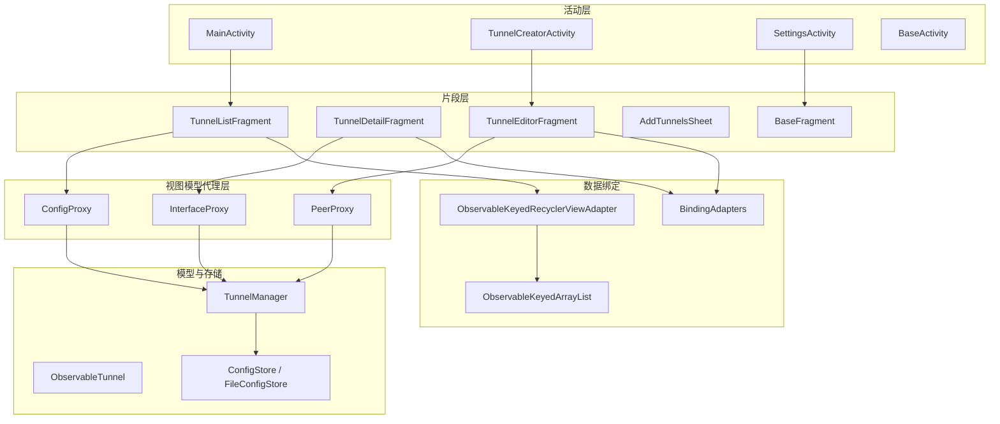
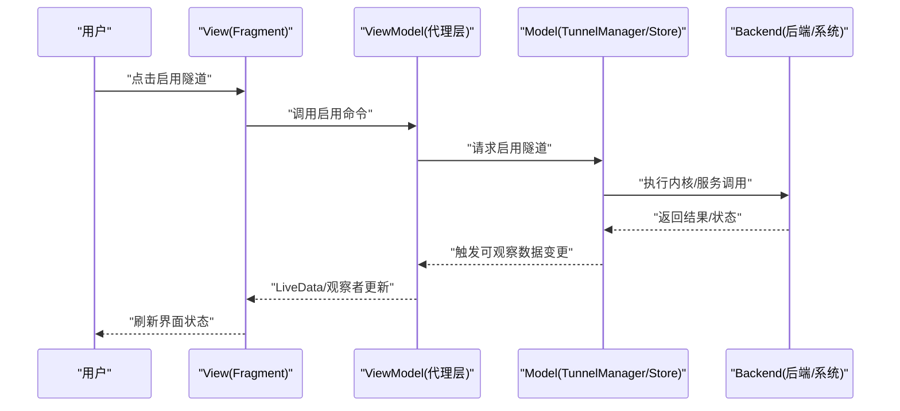
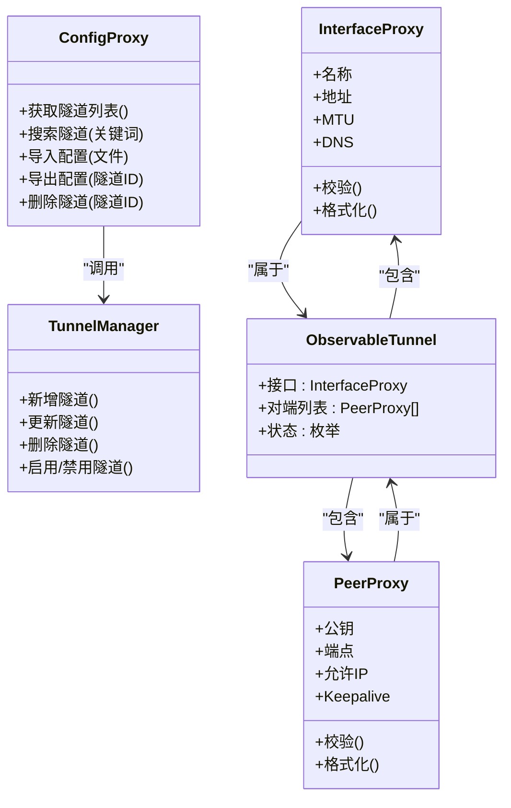
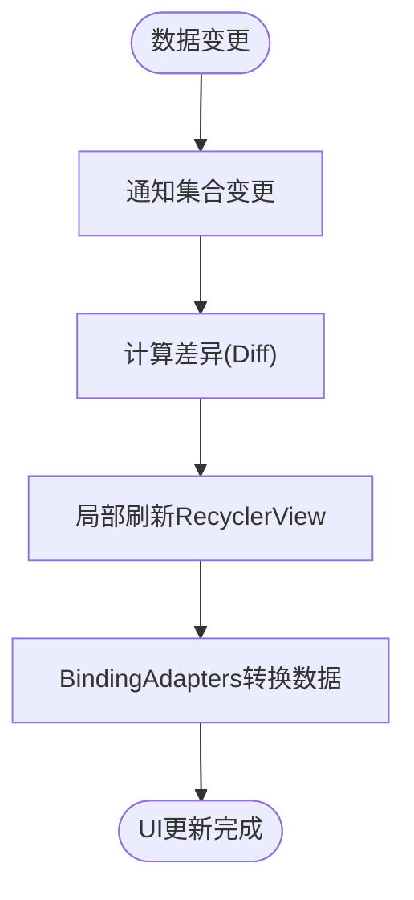
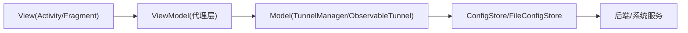

# UI 用户界面模块设计

<cite>
**本文引用的文件**   
- [MainActivity.kt](file://ui/src/main/java/com/wireguard/android/activity/MainActivity.kt)
- [TunnelCreatorActivity.kt](file://ui/src/main/java/com/wireguard/android/activity/TunnelCreatorActivity.kt)
- [SettingsActivity.kt](file://ui/src/main/java/com/wireguard/android/activity/SettingsActivity.kt)
- [BaseActivity.kt](file://ui/src/main/java/com/wireguard/android/activity/BaseActivity.kt)
- [BaseFragment.kt](file://ui/src/main/java/com/wireguard/android/fragment/BaseFragment.kt)
- [TunnelListFragment.kt](file://ui/src/main/java/com/wireguard/android/fragment/TunnelListFragment.kt)
- [TunnelDetailFragment.kt](file://ui/src/main/java/com/wireguard/android/fragment/TunnelDetailFragment.kt)
- [TunnelEditorFragment.kt](file://ui/src/main/java/com/wireguard/android/fragment/TunnelEditorFragment.kt)
- [AddTunnelsSheet.kt](file://ui/src/main/java/com/wireguard/android/fragment/AddTunnelsSheet.kt)
- [ConfigProxy.kt](file://ui/src/main/java/com/wireguard/android/viewmodel/ConfigProxy.kt)
- [InterfaceProxy.kt](file://ui/src/main/java/com/wireguard/android/viewmodel/InterfaceProxy.kt)
- [PeerProxy.kt](file://ui/src/main/java/com/wireguard/android/viewmodel/PeerProxy.kt)
- [BindingAdapters.kt](file://ui/src/main/java/com/wireguard/android/databinding/BindingAdapters.kt)
- [ObservableKeyedArrayList.kt](file://ui/src/main/java/com/wireguard/android/databinding/ObservableKeyedArrayList.kt)
- [ObservableSortedKeyedArrayList.kt](file://ui/src/main/java/com/wireguard/android/databinding/ObservableSortedKeyedArrayList.kt)
- [ObservableKeyedRecyclerViewAdapter.kt](file://ui/src/main/java/com/wireguard/android/databinding/ObservableKeyedRecyclerViewAdapter.kt)
- [ItemChangeListener.kt](file://ui/src/main/java/com/wireguard/android/databinding/ItemChangeListener.kt)
- [Keyed.kt](file://ui/src/main/java/com/wireguard/android/databinding/Keyed.kt)
- [ObservableTunnel.kt](file://ui/src/main/java/com/wireguard/android/model/ObservableTunnel.kt)
- [TunnelManager.kt](file://ui/src/main/java/com/wireguard/android/model/TunnelManager.kt)
- [ConfigStore.kt](file://ui/src/main/java/com/wireguard/android/configStore/ConfigStore.kt)
- [FileConfigStore.kt](file://ui/src/main/java/com/wireguard/android/configStore/FileConfigStore.kt)
- [main_activity.xml](file://ui/src/main/res/layout/main_activity.xml)
- [tunnel_list_fragment.xml](file://ui/src/main/res/layout/tunnel_list_fragment.xml)
- [tunnel_detail_fragment.xml](file://ui/src/main/res/layout/tunnel_detail_fragment.xml)
- [tunnel_editor_fragment.xml](file://ui/src/main/res/layout/tunnel_editor_fragment.xml)
- [themes.xml](file://ui/src/main/res/values/themes.xml)
- [strings.xml](file://ui/src/main/res/values/strings.xml)
</cite>

## 目录
1. [简介](#简介)
2. [项目结构](#项目结构)
3. [核心组件](#核心组件)
4. [架构总览](#架构总览)
5. [详细组件分析](#详细组件分析)
6. [依赖关系分析](#依赖关系分析)
7. [性能考虑](#性能考虑)
8. [故障排查指南](#故障排查指南)
9. [结论](#结论)
10. [附录：开发指南与最佳实践](#附录开发指南与最佳实践)

## 简介
本设计文档聚焦 WireGuard Android 项目的 UI 用户界面模块，围绕 MVVM 架构模式，系统阐述 Activity、Fragment、ViewModel 的分层职责与数据流向。文档覆盖主界面、隧道创建、设置管理等关键 Activity 的设计目的与生命周期管理；梳理 Fragment 层的基类封装与列表、详情、编辑器等页面实现；详解 ViewModel 代理层（ConfigProxy、InterfaceProxy、PeerProxy）的数据绑定机制；说明 BindingAdapters、可观察集合等数据绑定基础设施；并总结资源管理系统（多语言、主题切换、响应式布局）。文末提供架构图、数据流图与状态管理图，以及扩展新功能的开发指南与最佳实践。

## 项目结构
UI 模块采用分层组织：
- activity：应用入口与页面容器，负责导航、生命周期协调与轻量交互。
- fragment：页面级视图与交互逻辑，通过 BaseFragment 统一行为。
- viewmodel：面向 UI 的代理层，暴露可观察数据与操作接口，屏蔽底层配置与后端细节。
- databinding：数据绑定适配器与可观察集合，支撑双向绑定与高效列表刷新。
- model：领域模型与管理器（如 TunnelManager），承载业务状态与变更事件。
- configStore：配置的持久化与导入导出。
- res：布局、主题、字符串等资源，支持多语言与夜间模式。

图表来源 
- [MainActivity.kt](file://ui/src/main/java/com/wireguard/android/activity/MainActivity.kt)
- [TunnelCreatorActivity.kt](file://ui/src/main/java/com/wireguard/android/activity/TunnelCreatorActivity.kt)
- [SettingsActivity.kt](file://ui/src/main/java/com/wireguard/android/activity/SettingsActivity.kt)
- [BaseActivity.kt](file://ui/src/main/java/com/wireguard/android/activity/BaseActivity.kt)
- [TunnelListFragment.kt](file://ui/src/main/java/com/wireguard/android/fragment/TunnelListFragment.kt)
- [TunnelDetailFragment.kt](file://ui/src/main/java/com/wireguard/android/fragment/TunnelDetailFragment.kt)
- [TunnelEditorFragment.kt](file://ui/src/main/java/com/wireguard/android/fragment/TunnelEditorFragment.kt)
- [AddTunnelsSheet.kt](file://ui/src/main/java/com/wireguard/android/fragment/AddTunnelsSheet.kt)
- [ConfigProxy.kt](file://ui/src/main/java/com/wireguard/android/viewmodel/ConfigProxy.kt)
- [InterfaceProxy.kt](file://ui/src/main/java/com/wireguard/android/viewmodel/InterfaceProxy.kt)
- [PeerProxy.kt](file://ui/src/main/java/com/wireguard/android/viewmodel/PeerProxy.kt)
- [BindingAdapters.kt](file://ui/src/main/java/com/wireguard/android/databinding/BindingAdapters.kt)
- [ObservableKeyedArrayList.kt](file://ui/src/main/java/com/wireguard/android/databinding/ObservableKeyedArrayList.kt)
- [ObservableKeyedRecyclerViewAdapter.kt](file://ui/src/main/java/com/wireguard/android/databinding/ObservableKeyedRecyclerViewAdapter.kt)
- [TunnelManager.kt](file://ui/src/main/java/com/wireguard/android/model/TunnelManager.kt)
- [ObservableTunnel.kt](file://ui/src/main/java/com/wireguard/android/model/ObservableTunnel.kt)
- [ConfigStore.kt](file://ui/src/main/java/com/wireguard/android/configStore/ConfigStore.kt)
- [FileConfigStore.kt](file://ui/src/main/java/com/wireguard/android/configStore/FileConfigStore.kt)

章节来源
- [main_activity.xml](file://ui/src/main/res/layout/main_activity.xml)
- [themes.xml](file://ui/src/main/res/values/themes.xml)
- [strings.xml](file://ui/src/main/res/values/strings.xml)

## 核心组件
- Activity 层
  - BaseActivity：统一主题、权限、日志、返回栈处理等横切能力。
  - MainActivity：主界面容器，承载隧道列表与底部导航/抽屉，协调 Fragment 切换。
  - TunnelCreatorActivity：新建/编辑隧道的向导式流程，驱动编辑器 Fragment。
  - SettingsActivity：应用设置入口，聚合偏好项与工具选项。
- Fragment 层
  - BaseFragment：统一的 View 绑定、生命周期回调、错误提示、权限申请封装。
  - TunnelListFragment：隧道列表展示、选择、批量操作、导入/导出入口。
  - TunnelDetailFragment：隧道详情查看、启停控制、统计信息展示。
  - TunnelEditorFragment：隧道配置编辑，含接口与对端字段校验与预览。
  - AddTunnelsSheet：底部弹窗，快速添加多个隧道配置。
- ViewModel 代理层
  - ConfigProxy：暴露隧道集合、排序、搜索、导入导出等操作，驱动列表与编辑器。
  - InterfaceProxy：封装接口属性（名称、地址、MTU、DNS 等）的可观察数据与校验。
  - PeerProxy：封装对端属性（公钥、端点、允许 IP、Keepalive 等）的可观察数据与校验。
- 数据绑定
  - BindingAdapters：自定义属性转换器，将模型字段映射到控件显示。
  - ObservableKeyedArrayList/Sorted：基于 Keyed 的高效可观察集合，支持增量更新与排序。
  - ObservableKeyedRecyclerViewAdapter：结合可观察集合的 RecyclerView 适配器，自动刷新。
- 模型与存储
  - ObservableTunnel：可观察的隧道实体，内部包含 Interface 与 Peer 列表。
  - TunnelManager：集中管理隧道生命周期、状态同步、事件分发。
  - ConfigStore/FileConfigStore：配置文件的读写、校验、备份与恢复。

章节来源
- [BaseActivity.kt](file://ui/src/main/java/com/wireguard/android/activity/BaseActivity.kt)
- [MainActivity.kt](file://ui/src/main/java/com/wireguard/android/activity/MainActivity.kt)
- [TunnelCreatorActivity.kt](file://ui/src/main/java/com/wireguard/android/activity/TunnelCreatorActivity.kt)
- [SettingsActivity.kt](file://ui/src/main/java/com/wireguard/android/activity/SettingsActivity.kt)
- [BaseFragment.kt](file://ui/src/main/java/com/wireguard/android/fragment/BaseFragment.kt)
- [TunnelListFragment.kt](file://ui/src/main/java/com/wireguard/android/fragment/TunnelListFragment.kt)
- [TunnelDetailFragment.kt](file://ui/src/main/java/com/wireguard/android/fragment/TunnelDetailFragment.kt)
- [TunnelEditorFragment.kt](file://ui/src/main/java/com/wireguard/android/fragment/TunnelEditorFragment.kt)
- [AddTunnelsSheet.kt](file://ui/src/main/java/com/wireguard/android/fragment/AddTunnelsSheet.kt)
- [ConfigProxy.kt](file://ui/src/main/java/com/wireguard/android/viewmodel/ConfigProxy.kt)
- [InterfaceProxy.kt](file://ui/src/main/java/com/wireguard/android/viewmodel/InterfaceProxy.kt)
- [PeerProxy.kt](file://ui/src/main/java/com/wireguard/android/viewmodel/PeerProxy.kt)
- [BindingAdapters.kt](file://ui/src/main/java/com/wireguard/android/databinding/BindingAdapters.kt)
- [ObservableKeyedArrayList.kt](file://ui/src/main/java/com/wireguard/android/databinding/ObservableKeyedArrayList.kt)
- [ObservableKeyedRecyclerViewAdapter.kt](file://ui/src/main/java/com/wireguard/android/databinding/ObservableKeyedRecyclerViewAdapter.kt)
- [ObservableTunnel.kt](file://ui/src/main/java/com/wireguard/android/model/ObservableTunnel.kt)
- [TunnelManager.kt](file://ui/src/main/java/com/wireguard/android/model/TunnelManager.kt)
- [ConfigStore.kt](file://ui/src/main/java/com/wireguard/android/configStore/ConfigStore.kt)
- [FileConfigStore.kt](file://ui/src/main/java/com/wireguard/android/configStore/FileConfigStore.kt)

## 架构总览
MVVM 在 UI 模块中的职责划分如下：
- View（Activity/Fragment + Layout）：仅负责展示与用户输入，不直接访问持久化或后端。
- ViewModel（ConfigProxy/InterfaceProxy/PeerProxy）：暴露可观察数据与命令，处理 UI 相关逻辑与校验。
- Model（ObservableTunnel/TunnelManager/ConfigStore）：承载领域状态、业务规则与数据源。

图表来源 
- [TunnelListFragment.kt](file://ui/src/main/java/com/wireguard/android/fragment/TunnelListFragment.kt)
- [ConfigProxy.kt](file://ui/src/main/java/com/wireguard/android/viewmodel/ConfigProxy.kt)
- [TunnelManager.kt](file://ui/src/main/java/com/wireguard/android/model/TunnelManager.kt)
- [ConfigStore.kt](file://ui/src/main/java/com/wireguard/android/configStore/ConfigStore.kt)

## 详细组件分析

### Activity 层设计与生命周期
- BaseActivity
  - 统一主题、字体、权限检查、Toast/Snackbar 提示、返回键处理。
  - 为子类提供通用的初始化与销毁钩子，减少重复代码。
- MainActivity
  - 作为主容器，加载 TunnelListFragment，处理导航与底部菜单。
  - 管理 Fragment 回退栈，确保从详情页/编辑器返回时状态正确。
- TunnelCreatorActivity
  - 引导用户完成隧道创建流程，内部驱动 TunnelEditorFragment。
  - 保存草稿、校验必填字段、生成默认配置。
- SettingsActivity
  - 聚合应用设置项，包括网络、工具、版本信息等。
  - 监听偏好变化，必要时重启服务或刷新 UI。

章节来源
- [BaseActivity.kt](file://ui/src/main/java/com/wireguard/android/activity/BaseActivity.kt)
- [MainActivity.kt](file://ui/src/main/java/com/wireguard/android/activity/MainActivity.kt)
- [TunnelCreatorActivity.kt](file://ui/src/main/java/com/wireguard/android/activity/TunnelCreatorActivity.kt)
- [SettingsActivity.kt](file://ui/src/main/java/com/wireguard/android/activity/SettingsActivity.kt)

### Fragment 层架构与职责
- BaseFragment
  - 封装 ViewBinding、生命周期回调、权限申请、错误提示。
  - 提供统一的初始化流程与清理逻辑，避免内存泄漏。
- TunnelListFragment
  - 使用 ObservableKeyedRecyclerViewAdapter 绑定隧道列表。
  - 支持多选、批量删除、导入/导出、搜索过滤。
- TunnelDetailFragment
  - 展示隧道详情与实时统计，提供启停控制。
  - 订阅 InterfaceProxy/PeerProxy 的可观察数据，实时更新 UI。
- TunnelEditorFragment
  - 编辑接口与对端配置，进行字段校验与预览。
  - 与 ConfigProxy 协作，保存/撤销更改。
- AddTunnelsSheet
  - 底部弹窗，支持批量导入配置文件，解析并写入存储。

章节来源
- [BaseFragment.kt](file://ui/src/main/java/com/wireguard/android/fragment/BaseFragment.kt)
- [TunnelListFragment.kt](file://ui/src/main/java/com/wireguard/android/fragment/TunnelListFragment.kt)
- [TunnelDetailFragment.kt](file://ui/src/main/java/com/wireguard/android/fragment/TunnelDetailFragment.kt)
- [TunnelEditorFragment.kt](file://ui/src/main/java/com/wireguard/android/fragment/TunnelEditorFragment.kt)
- [AddTunnelsSheet.kt](file://ui/src/main/java/com/wireguard/android/fragment/AddTunnelsSheet.kt)

### ViewModel 代理层设计
- ConfigProxy
  - 暴露隧道集合、排序、搜索、导入导出等命令。
  - 与 TunnelManager 通信，处理配置变更与状态同步。
- InterfaceProxy
  - 封装接口属性（名称、地址、MTU、DNS）的可观察字段。
  - 提供字段校验与格式化，供编辑器与详情页使用。
- PeerProxy
  - 封装对端属性（公钥、端点、允许 IP、Keepalive）的可观察字段。
  - 提供校验与默认值填充，保证配置一致性。

图表来源 
- [ConfigProxy.kt](file://ui/src/main/java/com/wireguard/android/viewmodel/ConfigProxy.kt)
- [InterfaceProxy.kt](file://ui/src/main/java/com/wireguard/android/viewmodel/InterfaceProxy.kt)
- [PeerProxy.kt](file://ui/src/main/java/com/wireguard/android/viewmodel/PeerProxy.kt)
- [TunnelManager.kt](file://ui/src/main/java/com/wireguard/android/model/TunnelManager.kt)
- [ObservableTunnel.kt](file://ui/src/main/java/com/wireguard/android/model/ObservableTunnel.kt)

章节来源
- [ConfigProxy.kt](file://ui/src/main/java/com/wireguard/android/viewmodel/ConfigProxy.kt)
- [InterfaceProxy.kt](file://ui/src/main/java/com/wireguard/android/viewmodel/InterfaceProxy.kt)
- [PeerProxy.kt](file://ui/src/main/java/com/wireguard/android/viewmodel/PeerProxy.kt)
- [TunnelManager.kt](file://ui/src/main/java/com/wireguard/android/model/TunnelManager.kt)
- [ObservableTunnel.kt](file://ui/src/main/java/com/wireguard/android/model/ObservableTunnel.kt)

### 数据绑定机制
- BindingAdapters
  - 自定义属性转换器，将模型字段（如时间戳、字节数、布尔值）转换为 UI 可读文本或颜色。
  - 支持双向绑定，提升编辑器与详情页的交互效率。
- ObservableKeyedArrayList/Sorted
  - 基于 Keyed 接口的可观察集合，支持增量更新与排序。
  - 与 RecyclerView 集成，避免全量刷新，提高性能。
- ObservableKeyedRecyclerViewAdapter
  - 自动监听集合变更，调用 DiffUtil 计算差异并刷新。
  - 简化列表适配器的实现复杂度。

图表来源 
- [BindingAdapters.kt](file://ui/src/main/java/com/wireguard/android/databinding/BindingAdapters.kt)
- [ObservableKeyedArrayList.kt](file://ui/src/main/java/com/wireguard/android/databinding/ObservableKeyedArrayList.kt)
- [ObservableKeyedRecyclerViewAdapter.kt](file://ui/src/main/java/com/wireguard/android/databinding/ObservableKeyedRecyclerViewAdapter.kt)
- [ItemChangeListener.kt](file://ui/src/main/java/com/wireguard/android/databinding/ItemChangeListener.kt)
- [Keyed.kt](file://ui/src/main/java/com/wireguard/android/databinding/Keyed.kt)

章节来源
- [BindingAdapters.kt](file://ui/src/main/java/com/wireguard/android/databinding/BindingAdapters.kt)
- [ObservableKeyedArrayList.kt](file://ui/src/main/java/com/wireguard/android/databinding/ObservableKeyedArrayList.kt)
- [ObservableKeyedRecyclerViewAdapter.kt](file://ui/src/main/java/com/wireguard/android/databinding/ObservableKeyedRecyclerViewAdapter.kt)
- [ItemChangeListener.kt](file://ui/src/main/java/com/wireguard/android/databinding/ItemChangeListener.kt)
- [Keyed.kt](file://ui/src/main/java/com/wireguard/android/databinding/Keyed.kt)

### 资源管理与国际化
- 多语言支持
  - 通过 values-xx-rXX 目录下的 strings.xml 提供本地化文本。
  - 运行时根据系统语言动态切换，无需重启应用。
- 主题切换
  - themes.xml 定义浅色/深色主题，values-night 提供夜间模式资源。
  - BaseActivity 统一管理主题应用与切换逻辑。
- 响应式布局
  - layout-sw600dp 为大屏设备提供优化布局。
  - 使用 ConstraintLayout 与百分比布局，适配不同屏幕尺寸。

章节来源
- [themes.xml](file://ui/src/main/res/values/themes.xml)
- [strings.xml](file://ui/src/main/res/values/strings.xml)
- [main_activity.xml](file://ui/src/main/res/layout/main_activity.xml)
- [tunnel_list_fragment.xml](file://ui/src/main/res/layout/tunnel_list_fragment.xml)
- [tunnel_detail_fragment.xml](file://ui/src/main/res/layout/tunnel_detail_fragment.xml)
- [tunnel_editor_fragment.xml](file://ui/src/main/res/layout/tunnel_editor_fragment.xml)

## 依赖关系分析
- 低耦合高内聚
  - Activity/Fragment 仅依赖 ViewModel 代理层，不直接访问存储或后端。
  - ViewModel 代理层封装 Model 与 Store，对外暴露简洁 API。
- 数据流单向
  - View -> ViewModel -> Model -> Store -> Backend，确保状态可预测。
- 可观察性
  - 通过可观察集合与 LiveData/StateFlow，实现 UI 自动刷新。

图表来源 
- [MainActivity.kt](file://ui/src/main/java/com/wireguard/android/activity/MainActivity.kt)
- [TunnelListFragment.kt](file://ui/src/main/java/com/wireguard/android/fragment/TunnelListFragment.kt)
- [ConfigProxy.kt](file://ui/src/main/java/com/wireguard/android/viewmodel/ConfigProxy.kt)
- [TunnelManager.kt](file://ui/src/main/java/com/wireguard/android/model/TunnelManager.kt)
- [ConfigStore.kt](file://ui/src/main/java/com/wireguard/android/configStore/ConfigStore.kt)

章节来源
- [MainActivity.kt](file://ui/src/main/java/com/wireguard/android/activity/MainActivity.kt)
- [TunnelListFragment.kt](file://ui/src/main/java/com/wireguard/android/fragment/TunnelListFragment.kt)
- [ConfigProxy.kt](file://ui/src/main/java/com/wireguard/android/viewmodel/ConfigProxy.kt)
- [TunnelManager.kt](file://ui/src/main/java/com/wireguard/android/model/TunnelManager.kt)
- [ConfigStore.kt](file://ui/src/main/java/com/wireguard/android/configStore/ConfigStore.kt)

## 性能考虑
- 列表性能
  - 使用 ObservableKeyedArrayList 与 DiffUtil 实现增量更新，避免全量刷新。
  - 合理分页与懒加载，减少内存占用。
- 数据绑定
  - BindingAdapters 避免频繁对象创建，复用转换器实例。
  - 双向绑定时注意防抖与节流，减少不必要的 UI 更新。
- 内存管理
  - Fragment 中及时解绑观察者，防止内存泄漏。
  - 大对象（如图片、文件）使用弱引用或缓存策略。

[本节为通用指导，不直接分析具体文件]

## 故障排查指南
- 常见问题
  - 列表不刷新：检查 ObservableKeyedArrayList 是否正确通知变更，Diff 算法是否生效。
  - 数据绑定异常：确认 BindingAdapters 的参数类型与格式转换逻辑。
  - 配置导入失败：验证文件格式与字段完整性，查看错误消息提示。
- 调试技巧
  - 使用 Log 输出关键状态变更，定位问题链路。
  - 模拟异常输入，测试边界条件与错误处理。

章节来源
- [BindingAdapters.kt](file://ui/src/main/java/com/wireguard/android/databinding/BindingAdapters.kt)
- [ObservableKeyedArrayList.kt](file://ui/src/main/java/com/wireguard/android/databinding/ObservableKeyedArrayList.kt)
- [TunnelEditorFragment.kt](file://ui/src/main/java/com/wireguard/android/fragment/TunnelEditorFragment.kt)

## 结论
UI 模块通过清晰的 MVVM 分层与可观察数据绑定，实现了高内聚、低耦合的界面架构。Activity/Fragment 专注展示与交互，ViewModel 代理层封装业务逻辑，Model 与 Store 管理状态与持久化。结合多语言、主题与响应式布局，提供了良好的用户体验。遵循本文档的最佳实践，可高效扩展新功能与维护现有组件。

[本节为总结，不直接分析具体文件]

## 附录：开发指南与最佳实践
- 添加新界面功能
  - 新建 Fragment，继承 BaseFragment，实现 ViewBinding。
  - 创建对应的 ViewModel 代理类，暴露可观察数据与命令。
  - 在 Activity 中注册导航与生命周期管理。
- 扩展现有组件
  - 在 BindingAdapters 中添加新的属性转换器。
  - 扩展 ObservableKeyedArrayList 以支持新的排序或过滤逻辑。
  - 在 TunnelManager 中增加新的业务方法，并在代理层暴露。
- 注意事项
  - 保持数据流单向，避免反向依赖。
  - 合理使用可观察集合，避免频繁全量刷新。
  - 完善错误处理与用户反馈，提升健壮性。

[本节为通用指导，不直接分析具体文件]