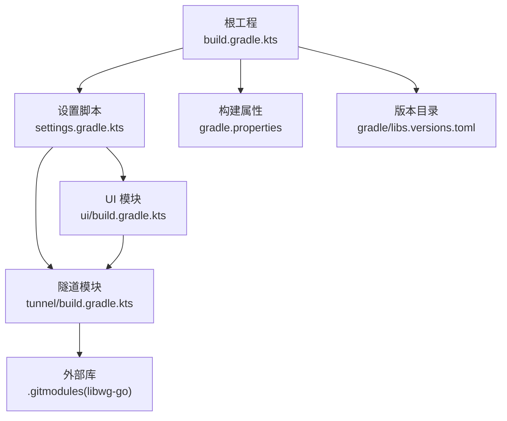
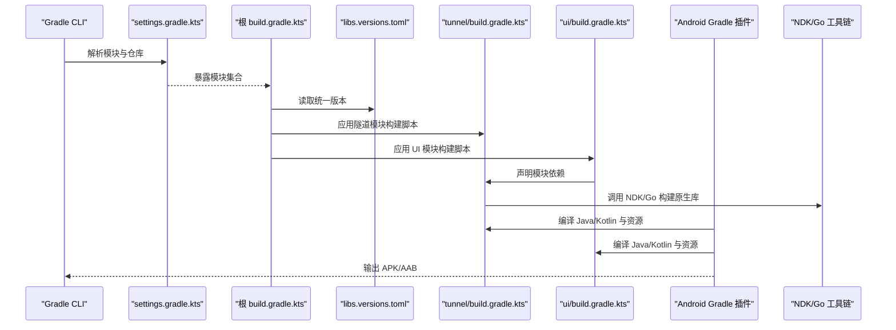
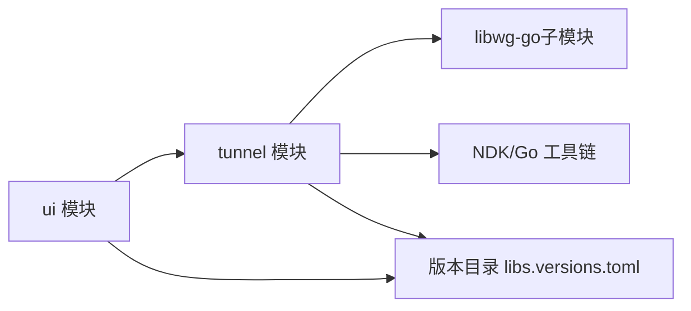
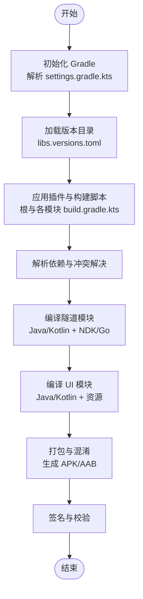

# 模块依赖与构建配置

<cite>
**本文引用的文件**   
- [settings.gradle.kts](file://settings.gradle.kts)
- [build.gradle.kts](file://build.gradle.kts)
- [gradle.properties](file://gradle.properties)
- [.gitmodules](file://.gitmodules)
- [gradle/libs.versions.toml](file://gradle/libs.versions.toml)
- [tunnel/build.gradle.kts](file://tunnel/build.gradle.kts)
- [ui/build.gradle.kts](file://ui/build.gradle.kts)
</cite>

## 目录
1. [简介](#简介)
2. [项目结构](#项目结构)
3. [核心组件](#核心组件)
4. [架构总览](#架构总览)
5. [详细组件分析](#详细组件分析)
6. [依赖关系分析](#依赖关系分析)
7. [性能考虑](#性能考虑)
8. [故障排除指南](#故障排除指南)
9. [结论](#结论)
10. [附录](#附录)

## 简介
本文件面向 WireGuard Android 项目的 Gradle 多模块构建体系，聚焦以下目标：
- 说明 settings.gradle.kts 中的模块声明与依赖管理策略
- 解释 gradle/libs.versions.toml 版本目录的组织方式与统一版本控制策略
- 记录 gradle.properties 的构建属性（编译选项、签名、优化参数等）
- 说明 .gitmodules 子模块集成（如 libwg-go）的方式
- 详解各模块 build.gradle.kts 的插件、依赖、任务与发布配置
- 绘制模块依赖图与构建流程图，展示从源码到 APK 的完整链路
- 提供构建优化技巧与常见问题排查方法

## 项目结构
WireGuard Android 采用 Gradle 多模块组织，顶层包含根构建脚本、全局属性与版本目录；应用层 UI 模块依赖核心隧道模块；核心隧道模块通过 NDK/Go 工具链集成 libwg-go 原生库。

**图表来源**
- [build.gradle.kts](file://build.gradle.kts)
- [settings.gradle.kts](file://settings.gradle.kts)
- [gradle.properties](file://gradle.properties)
- [gradle/libs.versions.toml](file://gradle/libs.versions.toml)
- [tunnel/build.gradle.kts](file://tunnel/build.gradle.kts)
- [ui/build.gradle.kts](file://ui/build.gradle.kts)
- [.gitmodules](file://.gitmodules)

**章节来源**
- [settings.gradle.kts](file://settings.gradle.kts)
- [build.gradle.kts](file://build.gradle.kts)
- [gradle.properties](file://gradle.properties)
- [gradle/libs.versions.toml](file://gradle/libs.versions.toml)
- [.gitmodules](file://.gitmodules)

## 核心组件
- 设置脚本（settings.gradle.kts）：定义模块集合、仓库源、插件管理入口与依赖解析策略。
- 版本目录（gradle/libs.versions.toml）：集中声明所有第三方库与插件的版本号，供各模块引用。
- 构建属性（gradle.properties）：全局开关与优化参数，包括 Kotlin/AGP/NDK 相关选项、并行与缓存开关、签名信息等。
- 模块构建脚本（tunnel/build.gradle.kts、ui/build.gradle.kts）：声明各自插件、依赖、Android 变体、资源与打包任务。
- 子模块（.gitmodules）：声明 libwg-go 等外部库的 Git 子模块路径与更新策略。

**章节来源**
- [settings.gradle.kts](file://settings.gradle.kts)
- [gradle/libs.versions.toml](file://gradle/libs.versions.toml)
- [gradle.properties](file://gradle.properties)
- [tunnel/build.gradle.kts](file://tunnel/build.gradle.kts)
- [ui/build.gradle.kts](file://ui/build.gradle.kts)
- [.gitmodules](file://.gitmodules)

## 架构总览
下图展示了从 Gradle 初始化到生成 APK 的关键阶段与模块交互。

**图表来源**
- [settings.gradle.kts](file://settings.gradle.kts)
- [build.gradle.kts](file://build.gradle.kts)
- [gradle/libs.versions.toml](file://gradle/libs.versions.toml)
- [tunnel/build.gradle.kts](file://tunnel/build.gradle.kts)
- [ui/build.gradle.kts](file://ui/build.gradle.kts)

## 详细组件分析

### 设置脚本（settings.gradle.kts）
- 模块声明：明确列出 tunnel、ui 等模块，确保 Gradle 正确识别并参与构建。
- 仓库与插件管理：集中声明 Maven/GitHub 等仓库源，以及插件版本管理与依赖约束。
- 依赖解析策略：可配置依赖冲突解决策略、平台兼容性与二进制兼容性检查。

建议关注点
- 新增模块需在 settings.gradle.kts 中注册
- 统一仓库源可减少重复配置与下载开销
- 依赖解析策略影响构建稳定性与速度

**章节来源**
- [settings.gradle.kts](file://settings.gradle.kts)

### 版本目录（gradle/libs.versions.toml）
- 组织方式：按类别分组（如 android、kotlin、coroutines、testing 等），每个条目包含名称与版本号。
- 引用方式：在模块构建脚本中使用 catalog 引用，避免硬编码版本号。
- 统一管理策略：升级时仅需修改 toml 文件，全项目生效，降低不一致风险。

建议关注点
- 保持版本对齐，尤其是 AndroidX、Kotlin、Coroutines 等关键栈
- 对不兼容升级进行渐进式迁移与灰度验证

**章节来源**
- [gradle/libs.versions.toml](file://gradle/libs.versions.toml)

### 构建属性（gradle.properties）
- 编译选项：Kotlin 编译器参数、AGP 版本、Java 目标版本等。
- 签名配置：调试/发布密钥信息、签名算法与别名等（注意保密）。
- 优化参数：并行构建、守护进程、增量编译、R8/Proguard 开关等。
- NDK/Go 环境：NDK 路径、Go 工具链版本与交叉编译参数。

建议关注点
- 将敏感信息放入本地环境变量或密钥管理服务，避免提交至仓库
- 合理开启并行与缓存以提升构建速度
- 针对 CI 环境调整内存与线程数

**章节来源**
- [gradle.properties](file://gradle.properties)

### 子模块集成（.gitmodules）
- 目的：将 libwg-go 等外部库作为 Git 子模块纳入版本管理，保证构建一致性。
- 集成方式：克隆仓库后执行子模块初始化与更新，构建前确保子模块可用。
- 维护策略：定期同步上游变更，必要时打补丁以适配 Android/NDK 环境。

建议关注点
- 在 CI 中自动初始化子模块
- 对 Go 运行时与 JNI 桥接进行兼容性测试

**章节来源**
- [.gitmodules](file://.gitmodules)

### 隧道模块（tunnel/build.gradle.kts）
- 插件与应用类型：Android Library 插件，支持多种 ABI 与构建变体。
- 依赖声明：引入 Kotlin、AndroidX、测试框架等依赖，使用版本目录统一管理。
- NDK/Go 构建：通过自定义任务或 CMake/Makefile 调用 Go 与 NDK 编译原生库。
- 资源与清单：合并 AndroidManifest，配置权限与组件。
- 发布配置：可选地生成 AAR 并发布到内部仓库。

建议关注点
- 确保 NDK/Go 工具链版本与系统环境一致
- 合理使用预编译产物加速构建
- 对 JNI 接口进行单元测试与回归测试

**章节来源**
- [tunnel/build.gradle.kts](file://tunnel/build.gradle.kts)

### UI 模块（ui/build.gradle.kts）
- 插件与应用类型：Android Application 插件，负责最终 APK 打包。
- 依赖声明：依赖 tunnel 模块与其他 UI 库，使用版本目录统一管理。
- 构建变体：debug/release、googleplay 等渠道差异配置。
- 资源与主题：多语言、夜间模式、TV 布局等资源配置。
- 代码混淆与优化：启用 R8/Proguard，配置规则文件。
- 发布配置：签名、多渠道包名与资源替换。

建议关注点
- 不同变体的依赖与资源隔离
- 混淆规则需覆盖反射与动态加载场景
- 多渠道打包时需校验资源与权限差异

**章节来源**
- [ui/build.gradle.kts](file://ui/build.gradle.kts)

## 依赖关系分析
模块间依赖方向清晰：UI 模块依赖隧道模块；隧道模块依赖外部库（libwg-go）并通过 NDK/Go 构建原生产物。

**图表来源**
- [ui/build.gradle.kts](file://ui/build.gradle.kts)
- [tunnel/build.gradle.kts](file://tunnel/build.gradle.kts)
- [gradle/libs.versions.toml](file://gradle/libs.versions.toml)
- [.gitmodules](file://.gitmodules)

依赖方向与兼容性要求
- UI 模块仅依赖 tunnel 模块的公开 API，避免直接访问内部实现
- 版本目录确保三方库版本一致，减少冲突
- NDK/Go 工具链版本需与 libwg-go 要求匹配

**章节来源**
- [ui/build.gradle.kts](file://ui/build.gradle.kts)
- [tunnel/build.gradle.kts](file://tunnel/build.gradle.kts)
- [gradle/libs.versions.toml](file://gradle/libs.versions.toml)
- [.gitmodules](file://.gitmodules)

## 性能考虑
- 启用 Gradle 守护进程与并行构建，提升本地与 CI 构建速度
- 使用配置缓存与增量编译，减少无效重建
- 合理划分模块边界，避免循环依赖与过度耦合
- 对大依赖进行按需加载与延迟初始化
- 使用 BOM/版本目录统一依赖版本，减少冲突与解析时间

[本节为通用指导，无需特定文件来源]

## 故障排除指南
常见构建问题与处理步骤
- 依赖冲突
  - 现象：编译期类找不到或版本不兼容
  - 处理：使用依赖树查看冲突来源，强制指定版本或使用 platform/BOM
- NDK/Go 工具链缺失或版本不匹配
  - 现象：原生库构建失败
  - 处理：确认 NDK/Go 安装路径与版本，检查环境变量与构建脚本配置
- 子模块未初始化
  - 现象：libwg-go 相关文件缺失
  - 处理：执行子模块初始化与更新命令，CI 中自动化该步骤
- 签名与渠道配置错误
  - 现象：APK 无法签名或渠道资源不正确
  - 处理：核对签名信息与渠道资源，确保 debug/release 分离

**章节来源**
- [gradle.properties](file://gradle.properties)
- [tunnel/build.gradle.kts](file://tunnel/build.gradle.kts)
- [ui/build.gradle.kts](file://ui/build.gradle.kts)
- [.gitmodules](file://.gitmodules)

## 结论
通过统一的版本目录、清晰的模块边界与完善的构建属性配置，WireGuard Android 项目在可维护性、构建速度与稳定性方面具备良好基础。建议在持续集成中固化子模块初始化与工具链校验流程，并对关键依赖升级进行回归测试，以确保长期稳定演进。

[本节为总结性内容，无需特定文件来源]

## 附录
- 构建流程图（从源码到 APK）

**图表来源**
- [settings.gradle.kts](file://settings.gradle.kts)
- [build.gradle.kts](file://build.gradle.kts)
- [gradle/libs.versions.toml](file://gradle/libs.versions.toml)
- [tunnel/build.gradle.kts](file://tunnel/build.gradle.kts)
- [ui/build.gradle.kts](file://ui/build.gradle.kts)