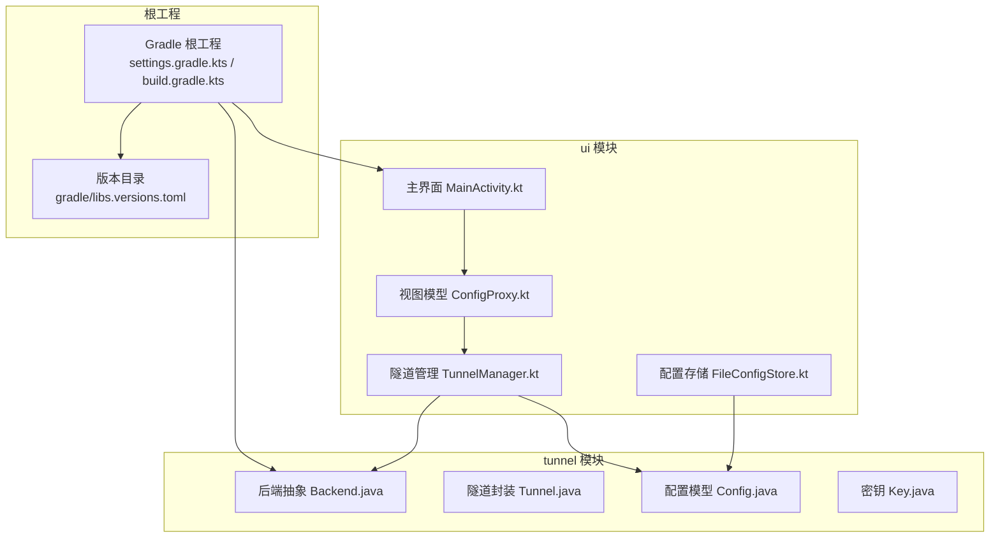
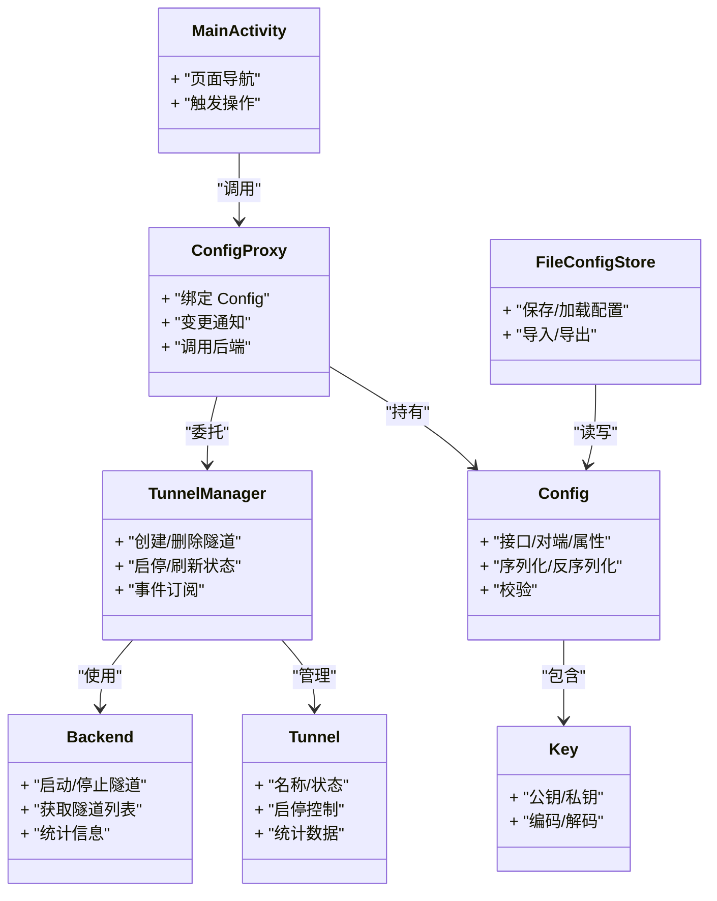
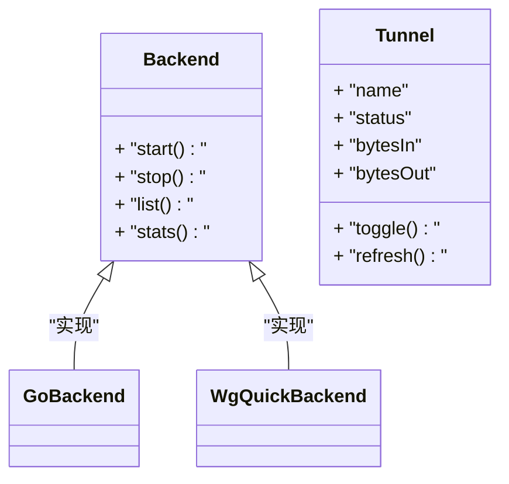
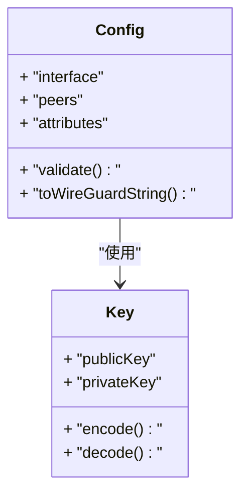
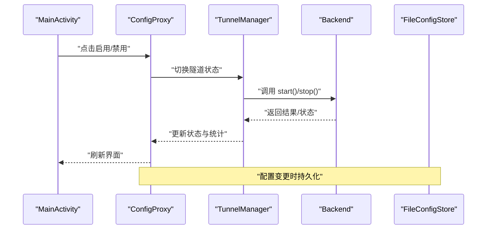
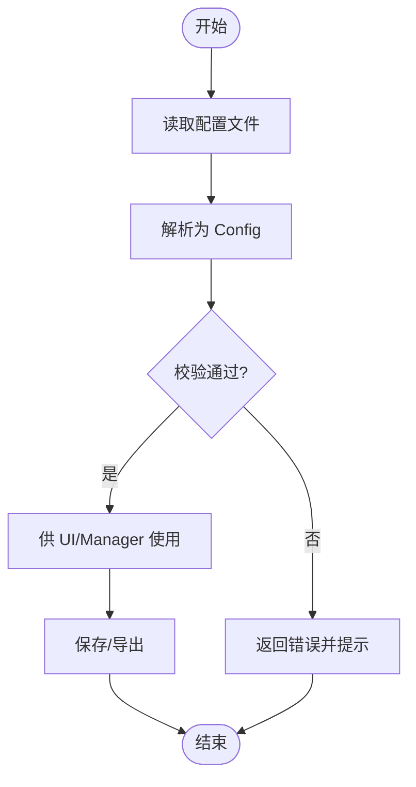
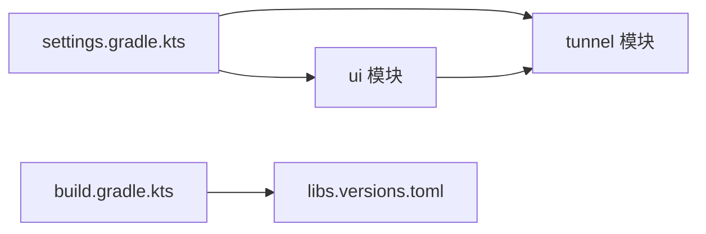
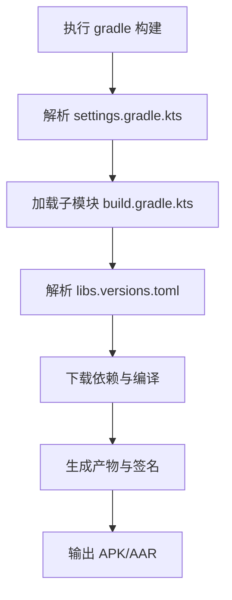

# 模块设计

<cite>
**本文引用的文件**   
- [settings.gradle.kts](file://settings.gradle.kts)
- [build.gradle.kts](file://build.gradle.kts)
- [gradle/libs.versions.toml](file://gradle/libs.versions.toml)
- [tunnel/build.gradle.kts](file://tunnel/build.gradle.kts)
- [ui/build.gradle.kts](file://ui/build.gradle.kts)
- [tunnel/src/main/java/com/wireguard/android/backend/Backend.java](file://tunnel/src/main/java/com/wireguard/android/backend/Backend.java)
- [tunnel/src/main/java/com/wireguard/android/backend/Tunnel.java](file://tunnel/src/main/java/com/wireguard/android/backend/Tunnel.java)
- [tunnel/src/main/java/com/wireguard/config/Config.java](file://tunnel/src/main/java/com/wireguard/config/Config.java)
- [tunnel/src/main/java/com/wireguard/crypto/Key.java](file://tunnel/src/main/java/com/wireguard/crypto/Key.java)
- [ui/src/main/java/com/wireguard/android/model/TunnelManager.kt](file://ui/src/main/java/com/wireguard/android/model/TunnelManager.kt)
- [ui/src/main/java/com/wireguard/android/configStore/FileConfigStore.kt](file://ui/src/main/java/com/wireguard/android/configStore/FileConfigStore.kt)
- [ui/src/main/java/com/wireguard/android/viewmodel/ConfigProxy.kt](file://ui/src/main/java/com/wireguard/android/viewmodel/ConfigProxy.kt)
- [ui/src/main/java/com/wireguard/android/activity/MainActivity.kt](file://ui/src/main/java/com/wireguard/android/activity/MainActivity.kt)
</cite>

## 目录
1. [简介](#简介)
2. [项目结构](#项目结构)
3. [核心组件](#核心组件)
4. [架构总览](#架构总览)
5. [详细组件分析](#详细组件分析)
6. [依赖分析](#依赖分析)
7. [性能考虑](#性能考虑)
8. [故障排查指南](#故障排查指南)
9. [结论](#结论)
10. [附录](#附录)

## 简介
本设计文档聚焦 WireGuard Android 项目的模块划分与协作方式，重点阐述 tunnel 核心模块与 ui 用户界面模块的设计理念、职责边界、接口抽象、数据交换格式以及构建配置与版本管理策略。文档同时给出模块依赖图与 Gradle 多模块构建流程图，帮助读者理解如何通过 Gradle 组织与构建多模块工程，并遵循解耦原则进行扩展与维护。

## 项目结构
项目采用双模块结构：
- tunnel：提供隧道内核交互、配置解析、加密原语等核心能力，面向上层暴露稳定的 Java/Kotlin 接口。
- ui：基于 Android Jetpack（Activity/Fragment/ViewModel/DataBinding）实现用户界面与业务编排，通过代理层调用 tunnel 模块能力。

图表来源
- [settings.gradle.kts](file://settings.gradle.kts)
- [build.gradle.kts](file://build.gradle.kts)
- [gradle/libs.versions.toml](file://gradle/libs.versions.toml)
- [tunnel/build.gradle.kts](file://tunnel/build.gradle.kts)
- [ui/build.gradle.kts](file://ui/build.gradle.kts)

章节来源
- [settings.gradle.kts](file://settings.gradle.kts)
- [build.gradle.kts](file://build.gradle.kts)
- [gradle/libs.versions.toml](file://gradle/libs.versions.toml)
- [tunnel/build.gradle.kts](file://tunnel/build.gradle.kts)
- [ui/build.gradle.kts](file://ui/build.gradle.kts)

## 核心组件
- tunnel 模块核心组件
  - 后端抽象与实现：定义统一的隧道控制接口，屏蔽底层差异。
  - 隧道封装：对单个隧道的生命周期、状态与统计进行封装。
  - 配置模型：描述 Interface、Peer、Attribute 等配置项的解析与校验。
  - 加密原语：提供密钥类型与工具方法，保证安全数据的统一表示。
- ui 模块核心组件
  - 活动与片段：承载页面与交互流程。
  - 视图模型与代理：将 UI 操作映射到 tunnel 能力，并提供可观察的数据流。
  - 配置存储：持久化与导入导出配置文件。
  - 隧道管理器：协调多个隧道的增删改查与启停。

章节来源
- [tunnel/src/main/java/com/wireguard/android/backend/Backend.java](file://tunnel/src/main/java/com/wireguard/android/backend/Backend.java)
- [tunnel/src/main/java/com/wireguard/android/backend/Tunnel.java](file://tunnel/src/main/java/com/wireguard/android/backend/Tunnel.java)
- [tunnel/src/main/java/com/wireguard/config/Config.java](file://tunnel/src/main/java/com/wireguard/config/Config.java)
- [tunnel/src/main/java/com/wireguard/crypto/Key.java](file://tunnel/src/main/java/com/wireguard/crypto/Key.java)
- [ui/src/main/java/com/wireguard/android/model/TunnelManager.kt](file://ui/src/main/java/com/wireguard/android/model/TunnelManager.kt)
- [ui/src/main/java/com/wireguard/android/configStore/FileConfigStore.kt](file://ui/src/main/java/com/wireguard/android/configStore/FileConfigStore.kt)
- [ui/src/main/java/com/wireguard/android/viewmodel/ConfigProxy.kt](file://ui/src/main/java/com/wireguard/android/viewmodel/ConfigProxy.kt)
- [ui/src/main/java/com/wireguard/android/activity/MainActivity.kt](file://ui/src/main/java/com/wireguard/android/activity/MainActivity.kt)

## 架构总览
UI 层通过 ViewModel 与代理对象访问 tunnel 模块的能力；配置由独立的存储组件负责读写；隧道管理器协调具体隧道实例的生命周期。tunnel 模块对外仅暴露稳定接口，内部实现细节（如 Go/JNI 后端）被隐藏。

图表来源
- [tunnel/src/main/java/com/wireguard/android/backend/Backend.java](file://tunnel/src/main/java/com/wireguard/android/backend/Backend.java)
- [tunnel/src/main/java/com/wireguard/android/backend/Tunnel.java](file://tunnel/src/main/java/com/wireguard/android/backend/Tunnel.java)
- [tunnel/src/main/java/com/wireguard/config/Config.java](file://tunnel/src/main/java/com/wireguard/config/Config.java)
- [tunnel/src/main/java/com/wireguard/crypto/Key.java](file://tunnel/src/main/java/com/wireguard/crypto/Key.java)
- [ui/src/main/java/com/wireguard/android/model/TunnelManager.kt](file://ui/src/main/java/com/wireguard/android/model/TunnelManager.kt)
- [ui/src/main/java/com/wireguard/android/configStore/FileConfigStore.kt](file://ui/src/main/java/com/wireguard/android/configStore/FileConfigStore.kt)
- [ui/src/main/java/com/wireguard/android/viewmodel/ConfigProxy.kt](file://ui/src/main/java/com/wireguard/android/viewmodel/ConfigProxy.kt)
- [ui/src/main/java/com/wireguard/android/activity/MainActivity.kt](file://ui/src/main/java/com/wireguard/android/activity/MainActivity.kt)

## 详细组件分析

### tunnel 模块：后端抽象与隧道封装
- 设计理念
  - 以接口为中心：Backend 定义统一控制面，屏蔽不同后端实现（Go/JNI 等）。
  - 隧道作为一等实体：Tunnel 封装单条隧道的标识、状态与统计，便于 UI 展示与操作。
- 关键职责
  - Backend：提供启动/停止、枚举、统计等能力。
  - Tunnel：维护名称、状态、流量统计，暴露启停与查询接口。
- 数据与错误
  - 配置与密钥类型在 config 与 crypto 包中统一定义，确保跨层一致。
  - 异常通过明确的异常类型向上抛出，便于 UI 层捕获与提示。

图表来源
- [tunnel/src/main/java/com/wireguard/android/backend/Backend.java](file://tunnel/src/main/java/com/wireguard/android/backend/Backend.java)
- [tunnel/src/main/java/com/wireguard/android/backend/Tunnel.java](file://tunnel/src/main/java/com/wireguard/android/backend/Tunnel.java)

章节来源
- [tunnel/src/main/java/com/wireguard/android/backend/Backend.java](file://tunnel/src/main/java/com/wireguard/android/backend/Backend.java)
- [tunnel/src/main/java/com/wireguard/android/backend/Tunnel.java](file://tunnel/src/main/java/com/wireguard/android/backend/Tunnel.java)

### tunnel 模块：配置模型与加密原语
- 设计理念
  - 配置模型严格对应 WireGuard 规范，支持解析、校验与序列化。
  - 密钥类型集中管理，避免字符串滥用导致的安全风险。
- 关键职责
  - Config：描述接口、对端、属性，提供校验与转换。
  - Key：封装公钥/私钥，提供编解码与安全比较。

图表来源
- [tunnel/src/main/java/com/wireguard/config/Config.java](file://tunnel/src/main/java/com/wireguard/config/Config.java)
- [tunnel/src/main/java/com/wireguard/crypto/Key.java](file://tunnel/src/main/java/com/wireguard/crypto/Key.java)

章节来源
- [tunnel/src/main/java/com/wireguard/config/Config.java](file://tunnel/src/main/java/com/wireguard/config/Config.java)
- [tunnel/src/main/java/com/wireguard/crypto/Key.java](file://tunnel/src/main/java/com/wireguard/crypto/Key.java)

### ui 模块：视图模型与代理
- 设计理念
  - 通过 ConfigProxy 将 UI 操作与 tunnel 能力解耦，ViewModel 负责状态管理与事件分发。
  - 数据流单向：UI -> ViewModel -> Proxy -> Manager -> Backend。
- 关键职责
  - ConfigProxy：绑定 Config，转发启停请求，更新 UI 状态。
  - TunnelManager：协调多条隧道，处理并发与状态同步。
  - FileConfigStore：负责配置的持久化与导入导出。

图表来源
- [ui/src/main/java/com/wireguard/android/activity/MainActivity.kt](file://ui/src/main/java/com/wireguard/android/activity/MainActivity.kt)
- [ui/src/main/java/com/wireguard/android/viewmodel/ConfigProxy.kt](file://ui/src/main/java/com/wireguard/android/viewmodel/ConfigProxy.kt)
- [ui/src/main/java/com/wireguard/android/model/TunnelManager.kt](file://ui/src/main/java/com/wireguard/android/model/TunnelManager.kt)
- [ui/src/main/java/com/wireguard/android/configStore/FileConfigStore.kt](file://ui/src/main/java/com/wireguard/android/configStore/FileConfigStore.kt)

章节来源
- [ui/src/main/java/com/wireguard/android/viewmodel/ConfigProxy.kt](file://ui/src/main/java/com/wireguard/android/viewmodel/ConfigProxy.kt)
- [ui/src/main/java/com/wireguard/android/model/TunnelManager.kt](file://ui/src/main/java/com/wireguard/android/model/TunnelManager.kt)
- [ui/src/main/java/com/wireguard/android/configStore/FileConfigStore.kt](file://ui/src/main/java/com/wireguard/android/configStore/FileConfigStore.kt)
- [ui/src/main/java/com/wireguard/android/activity/MainActivity.kt](file://ui/src/main/java/com/wireguard/android/activity/MainActivity.kt)

### 配置持久化流程
- 设计理念
  - 配置读写与业务逻辑分离，FileConfigStore 专注于 I/O 与格式转换。
  - 支持导入/导出、校验与回滚，保障数据安全。
- 关键职责
  - 读取：从文件系统加载配置文本，解析为 Config 对象。
  - 写入：将 Config 对象序列化为文本并落盘。
  - 校验：在解析前后执行完整性检查，失败则回滚。

图表来源
- [ui/src/main/java/com/wireguard/android/configStore/FileConfigStore.kt](file://ui/src/main/java/com/wireguard/android/configStore/FileConfigStore.kt)
- [tunnel/src/main/java/com/wireguard/config/Config.java](file://tunnel/src/main/java/com/wireguard/config/Config.java)

章节来源
- [ui/src/main/java/com/wireguard/android/configStore/FileConfigStore.kt](file://ui/src/main/java/com/wireguard/android/configStore/FileConfigStore.kt)
- [tunnel/src/main/java/com/wireguard/config/Config.java](file://tunnel/src/main/java/com/wireguard/config/Config.java)

## 依赖分析
- 模块依赖关系
  - ui 依赖 tunnel：UI 通过代理与管理器调用 tunnel 提供的后端与配置能力。
  - 无循环依赖：tunnel 不依赖 ui，保持核心能力独立。
- 构建依赖
  - 根工程通过 settings.gradle.kts 声明子模块。
  - 各模块通过 build.gradle.kts 引入依赖与插件。
  - 版本统一管理于 gradle/libs.versions.toml。

图表来源
- [settings.gradle.kts](file://settings.gradle.kts)
- [build.gradle.kts](file://build.gradle.kts)
- [gradle/libs.versions.toml](file://gradle/libs.versions.toml)
- [tunnel/build.gradle.kts](file://tunnel/build.gradle.kts)
- [ui/build.gradle.kts](file://ui/build.gradle.kts)

章节来源
- [settings.gradle.kts](file://settings.gradle.kts)
- [build.gradle.kts](file://build.gradle.kts)
- [gradle/libs.versions.toml](file://gradle/libs.versions.toml)
- [tunnel/build.gradle.kts](file://tunnel/build.gradle.kts)
- [ui/build.gradle.kts](file://ui/build.gradle.kts)

## 性能考虑
- 配置解析与校验应在后台线程执行，避免阻塞 UI。
- 隧道启停与状态轮询需合并批量更新，减少频繁刷新。
- 大文件导入/导出应分块处理，降低内存峰值。
- 统计信息增量更新，避免全量重算。

## 故障排查指南
- 常见错误定位
  - 配置解析失败：检查 Config 校验逻辑与输入格式。
  - 后端调用异常：确认权限、内核模块与系统兼容性。
  - 密钥格式错误：核对 Key 编解码与 Base64/Hex 格式。
- 调试建议
  - 在 ConfigProxy 与 TunnelManager 增加日志输出。
  - 使用 FileConfigStore 的导出功能生成可复现的配置样本。
  - 针对异常路径补充单元测试与回归用例。

## 结论
本项目通过清晰的模块边界与接口抽象实现了 UI 与核心能力的解耦。tunnel 模块专注隧道控制与配置解析，ui 模块专注交互与编排。借助 Gradle 的多模块管理与统一版本目录，构建流程清晰可控。未来可在 Backend 抽象上扩展更多实现，并通过代理层与事件机制增强可扩展性与可测试性。

## 附录
- 构建流程图（Gradle 多模块）
