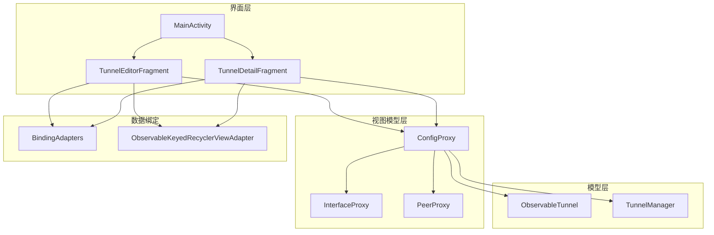
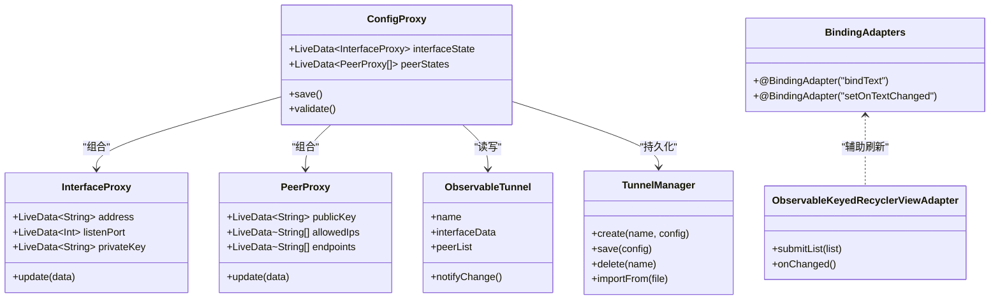
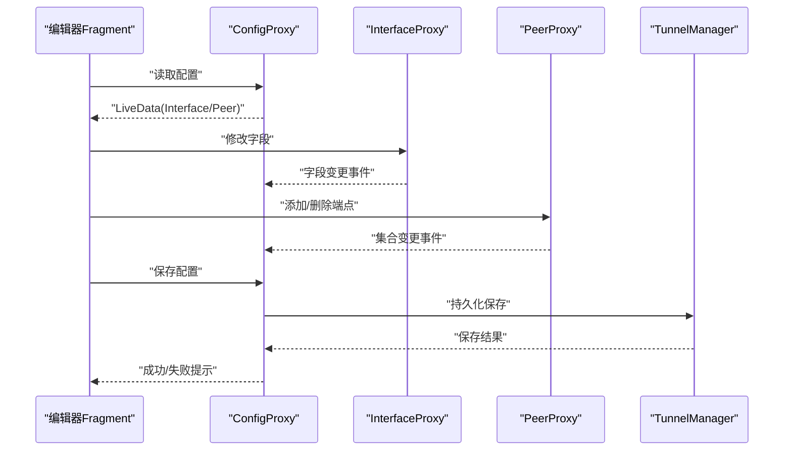
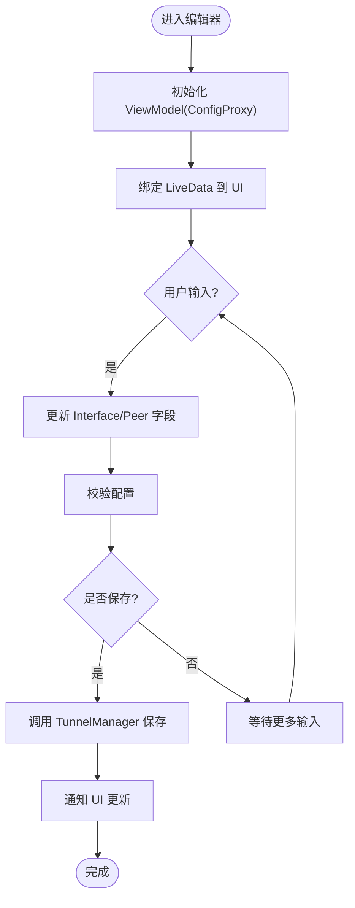
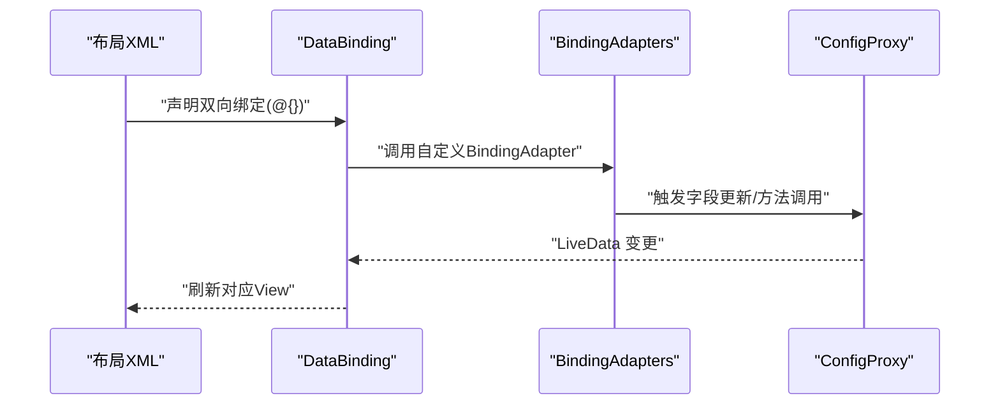
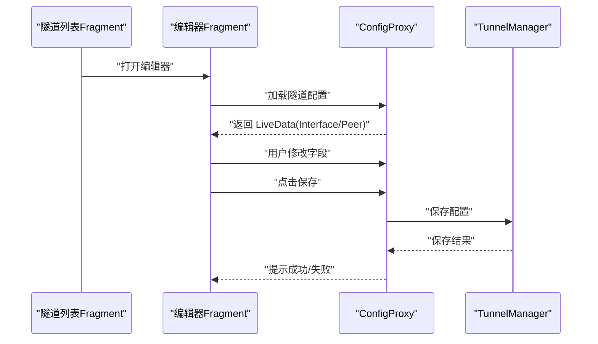
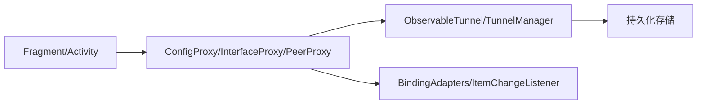

# MVVM 架构模式

<cite>
**本文档引用的文件**   
- [MainActivity.kt](file://ui/src/main/java/com/wireguard/android/activity/MainActivity.kt)
- [TunnelEditorFragment.kt](file://ui/src/main/java/com/wireguard/android/fragment/TunnelEditorFragment.kt)
- [TunnelDetailFragment.kt](file://ui/src/main/java/com/wireguard/android/fragment/TunnelDetailFragment.kt)
- [ConfigProxy.kt](file://ui/src/main/java/com/wireguard/android/viewmodel/ConfigProxy.kt)
- [InterfaceProxy.kt](file://ui/src/main/java/com/wireguard/android/viewmodel/InterfaceProxy.kt)
- [PeerProxy.kt](file://ui/src/main/java/com/wireguard/android/viewmodel/PeerProxy.kt)
- [ObservableTunnel.kt](file://ui/src/main/java/com/wireguard/android/model/ObservableTunnel.kt)
- [TunnelManager.kt](file://ui/src/main/java/com/wireguard/android/model/TunnelManager.kt)
- [BindingAdapters.kt](file://ui/src/main/java/com/wireguard/android/databinding/BindingAdapters.kt)
- [ItemChangeListener.kt](file://ui/src/main/java/com/wireguard/android/databinding/ItemChangeListener.kt)
- [ObservableKeyedRecyclerViewAdapter.kt](file://ui/src/main/java/com/wireguard/android/databinding/ObservableKeyedRecyclerViewAdapter.kt)
- [tunnel_editor_fragment.xml](file://ui/src/main/res/layout/tunnel_editor_fragment.xml)
- [tunnel_detail_fragment.xml](file://ui/src/main/res/layout/tunnel_detail_fragment.xml)
</cite>

## 目录
1. [简介](#简介)
2. [项目结构](#项目结构)
3. [核心组件](#核心组件)
4. [架构总览](#架构总览)
5. [详细组件分析](#详细组件分析)
6. [依赖关系分析](#依赖关系分析)
7. [性能考虑](#性能考虑)
8. [故障排查指南](#故障排查指南)
9. [结论](#结论)
10. [附录](#附录)

## 简介
本文件面向 WireGuard Android 项目的 MVVM（Model-View-ViewModel）架构模式，系统性阐述分层设计理念与实现方式。重点说明 ViewModel 层如何通过 ConfigProxy、InterfaceProxy、PeerProxy 等代理类管理数据状态，Activity/Fragment 如何与 ViewModel 交互，以及 LiveData 与 Data Binding 的双向绑定机制。文档同时给出隧道管理与配置编辑场景中的具体应用示例，并解释该模式对可测试性与可维护性的提升。

## 项目结构
UI 模块采用“按功能域组织”的目录结构：
- activity：页面入口与导航控制
- fragment：页面片段与业务交互
- viewmodel：MVVM 的 ViewModel 层，封装状态与业务逻辑
- model：领域模型与持久化/管理器
- databinding：Data Binding 扩展与双向绑定适配
- res：布局、菜单、资源等

图表来源
- [MainActivity.kt:1-200](file://ui/src/main/java/com/wireguard/android/activity/MainActivity.kt#L1-L200)
- [TunnelEditorFragment.kt:1-300](file://ui/src/main/java/com/wireguard/android/fragment/TunnelEditorFragment.kt#L1-L300)
- [TunnelDetailFragment.kt:1-300](file://ui/src/main/java/com/wireguard/android/fragment/TunnelDetailFragment.kt#L1-L300)
- [ConfigProxy.kt:1-200](file://ui/src/main/java/com/wireguard/android/viewmodel/ConfigProxy.kt#L1-L200)
- [InterfaceProxy.kt:1-200](file://ui/src/main/java/com/wireguard/android/viewmodel/InterfaceProxy.kt#L1-L200)
- [PeerProxy.kt:1-200](file://ui/src/main/java/com/wireguard/android/viewmodel/PeerProxy.kt#L1-L200)
- [ObservableTunnel.kt:1-200](file://ui/src/main/java/com/wireguard/android/model/ObservableTunnel.kt#L1-L200)
- [TunnelManager.kt:1-200](file://ui/src/main/java/com/wireguard/android/model/TunnelManager.kt#L1-L200)
- [BindingAdapters.kt:1-200](file://ui/src/main/java/com/wireguard/android/databinding/BindingAdapters.kt#L1-L200)
- [ObservableKeyedRecyclerViewAdapter.kt:1-200](file://ui/src/main/java/com/wireguard/android/databinding/ObservableKeyedRecyclerViewAdapter.kt#L1-L200)

章节来源
- [MainActivity.kt:1-200](file://ui/src/main/java/com/wireguard/android/activity/MainActivity.kt#L1-L200)
- [TunnelEditorFragment.kt:1-300](file://ui/src/main/java/com/wireguard/android/fragment/TunnelEditorFragment.kt#L1-L300)
- [TunnelDetailFragment.kt:1-300](file://ui/src/main/java/com/wireguard/android/fragment/TunnelDetailFragment.kt#L1-L300)

## 核心组件
- ViewModel 代理层
  - ConfigProxy：聚合 InterfaceProxy 与 PeerProxy，提供统一的隧道配置读写接口，暴露 LiveData 供 UI 订阅。
  - InterfaceProxy：封装 Interface 相关字段的状态与变更事件，如地址、端口、私钥等。
  - PeerProxy：封装 Peer 相关字段的状态与变更事件，如公钥、允许网段、端点等。
- 模型层
  - ObservableTunnel：可观察的隧道对象，支持属性变化通知，便于 Data Binding 与 RecyclerView 刷新。
  - TunnelManager：隧道生命周期与持久化管理，负责创建、保存、删除、导入导出等操作。
- 数据绑定
  - BindingAdapters：自定义 BindingAdapter，将复杂类型或行为映射到 View 属性，支撑双向绑定。
  - ObservableKeyedRecyclerViewAdapter：基于 Key 的高效列表适配器，结合 ObservableList 实现增量更新。

章节来源
- [ConfigProxy.kt:1-200](file://ui/src/main/java/com/wireguard/android/viewmodel/ConfigProxy.kt#L1-L200)
- [InterfaceProxy.kt:1-200](file://ui/src/main/java/com/wireguard/android/viewmodel/InterfaceProxy.kt#L1-L200)
- [PeerProxy.kt:1-200](file://ui/src/main/java/com/wireguard/android/viewmodel/PeerProxy.kt#L1-L200)
- [ObservableTunnel.kt:1-200](file://ui/src/main/java/com/wireguard/android/model/ObservableTunnel.kt#L1-L200)
- [TunnelManager.kt:1-200](file://ui/src/main/java/com/wireguard/android/model/TunnelManager.kt#L1-L200)
- [BindingAdapters.kt:1-200](file://ui/src/main/java/com/wireguard/android/databinding/BindingAdapters.kt#L1-L200)
- [ObservableKeyedRecyclerViewAdapter.kt:1-200](file://ui/src/main/java/com/wireguard/android/databinding/ObservableKeyedRecyclerViewAdapter.kt#L1-L200)

## 架构总览
MVVM 在 WireGuard Android 中的职责划分如下：
- Model：领域模型与数据源（ObservableTunnel、TunnelManager）
- ViewModel：状态持有与业务编排（ConfigProxy、InterfaceProxy、PeerProxy）
- View：UI 展示与用户交互（Activity/Fragment + Data Binding）

图表来源
- [ConfigProxy.kt:1-200](file://ui/src/main/java/com/wireguard/android/viewmodel/ConfigProxy.kt#L1-L200)
- [InterfaceProxy.kt:1-200](file://ui/src/main/java/com/wireguard/android/viewmodel/InterfaceProxy.kt#L1-L200)
- [PeerProxy.kt:1-200](file://ui/src/main/java/com/wireguard/android/viewmodel/PeerProxy.kt#L1-L200)
- [ObservableTunnel.kt:1-200](file://ui/src/main/java/com/wireguard/android/model/ObservableTunnel.kt#L1-L200)
- [TunnelManager.kt:1-200](file://ui/src/main/java/com/wireguard/android/model/TunnelManager.kt#L1-L200)
- [BindingAdapters.kt:1-200](file://ui/src/main/java/com/wireguard/android/databinding/BindingAdapters.kt#L1-L200)
- [ObservableKeyedRecyclerViewAdapter.kt:1-200](file://ui/src/main/java/com/wireguard/android/databinding/ObservableKeyedRecyclerViewAdapter.kt#L1-L200)

## 详细组件分析

### ViewModel 代理层：ConfigProxy、InterfaceProxy、PeerProxy
- ConfigProxy
  - 职责：统一暴露 Interface 与 Peer 的 LiveData，协调验证与保存流程。
  - 关键点：对外只暴露不可变或受控的 LiveData；内部维护 Proxy 实例，处理字段级变更合并。
- InterfaceProxy
  - 职责：管理 Interface 字段（如地址、端口、私钥），提供 update 方法同步底层数据。
  - 关键点：字段变更触发 LiveData 更新，保证 UI 实时响应。
- PeerProxy
  - 职责：管理 Peer 字段（如公钥、允许网段、端点），支持多端点与 IP 列表操作。
  - 关键点：集合变更通过可观察列表传播，避免全量刷新。

图表来源
- [TunnelEditorFragment.kt:1-300](file://ui/src/main/java/com/wireguard/android/fragment/TunnelEditorFragment.kt#L1-L300)
- [ConfigProxy.kt:1-200](file://ui/src/main/java/com/wireguard/android/viewmodel/ConfigProxy.kt#L1-L200)
- [InterfaceProxy.kt:1-200](file://ui/src/main/java/com/wireguard/android/viewmodel/InterfaceProxy.kt#L1-L200)
- [PeerProxy.kt:1-200](file://ui/src/main/java/com/wireguard/android/viewmodel/PeerProxy.kt#L1-L200)
- [TunnelManager.kt:1-200](file://ui/src/main/java/com/wireguard/android/model/TunnelManager.kt#L1-L200)

章节来源
- [ConfigProxy.kt:1-200](file://ui/src/main/java/com/wireguard/android/viewmodel/ConfigProxy.kt#L1-L200)
- [InterfaceProxy.kt:1-200](file://ui/src/main/java/com/wireguard/android/viewmodel/InterfaceProxy.kt#L1-L200)
- [PeerProxy.kt:1-200](file://ui/src/main/java/com/wireguard/android/viewmodel/PeerProxy.kt#L1-L200)

### Activity/Fragment 与 ViewModel 的交互
- 初始化与订阅
  - Fragment 中获取 ViewModel 实例，订阅 LiveData，驱动 UI 更新。
- 用户输入与命令
  - 通过 Data Binding 将输入直接映射到 ViewModel 的字段或方法调用。
- 生命周期安全
  - 使用 lifecycleScope 与协程进行异步任务，避免内存泄漏。

图表来源
- [TunnelEditorFragment.kt:1-300](file://ui/src/main/java/com/wireguard/android/fragment/TunnelEditorFragment.kt#L1-L300)
- [BindingAdapters.kt:1-200](file://ui/src/main/java/com/wireguard/android/databinding/BindingAdapters.kt#L1-L200)
- [ItemChangeListener.kt:1-200](file://ui/src/main/java/com/wireguard/android/databinding/ItemChangeListener.kt#L1-L200)

章节来源
- [TunnelEditorFragment.kt:1-300](file://ui/src/main/java/com/wireguard/android/fragment/TunnelEditorFragment.kt#L1-L300)
- [TunnelDetailFragment.kt:1-300](file://ui/src/main/java/com/wireguard/android/fragment/TunnelDetailFragment.kt#L1-L300)

### Data Binding 与双向绑定
- 双向绑定机制
  - 布局文件中通过 @{} 语法将 View 属性与 ViewModel 字段绑定。
  - 自定义 BindingAdapter 扩展控件能力，如监听文本变化、设置点击回调。
- 列表项绑定
  - ObservableKeyedRecyclerViewAdapter 配合 Keyed 接口，实现高效增量更新。
  - ItemChangeListener 简化单项变更事件的传递。

图表来源
- [tunnel_editor_fragment.xml:1-200](file://ui/src/main/res/layout/tunnel_editor_fragment.xml#L1-L200)
- [tunnel_detail_fragment.xml:1-200](file://ui/src/main/res/layout/tunnel_detail_fragment.xml#L1-L200)
- [BindingAdapters.kt:1-200](file://ui/src/main/java/com/wireguard/android/databinding/BindingAdapters.kt#L1-L200)
- [ItemChangeListener.kt:1-200](file://ui/src/main/java/com/wireguard/android/databinding/ItemChangeListener.kt#L1-L200)
- [ObservableKeyedRecyclerViewAdapter.kt:1-200](file://ui/src/main/java/com/wireguard/android/databinding/ObservableKeyedRecyclerViewAdapter.kt#L1-L200)

章节来源
- [BindingAdapters.kt:1-200](file://ui/src/main/java/com/wireguard/android/databinding/BindingAdapters.kt#L1-L200)
- [ItemChangeListener.kt:1-200](file://ui/src/main/java/com/wireguard/android/databinding/ItemChangeListener.kt#L1-L200)
- [ObservableKeyedRecyclerViewAdapter.kt:1-200](file://ui/src/main/java/com/wireguard/android/databinding/ObservableKeyedRecyclerViewAdapter.kt#L1-L200)

### 隧道管理与配置编辑的应用示例
- 隧道管理
  - 通过 TunnelManager 创建、保存、删除隧道；ObservableTunnel 提供可观察的数据结构。
  - ViewModel 层封装这些操作，对外暴露 LiveData，Fragment 仅负责展示与用户交互。
- 配置编辑
  - 编辑器 Fragment 绑定 Interface/Peer 字段，用户修改后即时反馈到 UI。
  - 保存时由 ConfigProxy 统一校验并调用 TunnelManager 持久化。

图表来源
- [TunnelDetailFragment.kt:1-300](file://ui/src/main/java/com/wireguard/android/fragment/TunnelDetailFragment.kt#L1-L300)
- [TunnelEditorFragment.kt:1-300](file://ui/src/main/java/com/wireguard/android/fragment/TunnelEditorFragment.kt#L1-L300)
- [ObservableTunnel.kt:1-200](file://ui/src/main/java/com/wireguard/android/model/ObservableTunnel.kt#L1-L200)
- [TunnelManager.kt:1-200](file://ui/src/main/java/com/wireguard/android/model/TunnelManager.kt#L1-L200)

章节来源
- [ObservableTunnel.kt:1-200](file://ui/src/main/java/com/wireguard/android/model/ObservableTunnel.kt#L1-L200)
- [TunnelManager.kt:1-200](file://ui/src/main/java/com/wireguard/android/model/TunnelManager.kt#L1-L200)

## 依赖关系分析
- 低耦合高内聚
  - ViewModel 仅依赖 Model 与必要的工具类，不直接操作 View。
  - Fragment 仅依赖 ViewModel 与 Data Binding，避免业务逻辑泄露。
- 外部依赖
  - TunnelManager 可能依赖存储后端（文件/数据库），便于替换与测试。
  - BindingAdapters 解耦 View 与业务逻辑，提高复用性。

图表来源
- [TunnelEditorFragment.kt:1-300](file://ui/src/main/java/com/wireguard/android/fragment/TunnelEditorFragment.kt#L1-L300)
- [ConfigProxy.kt:1-200](file://ui/src/main/java/com/wireguard/android/viewmodel/ConfigProxy.kt#L1-L200)
- [ObservableTunnel.kt:1-200](file://ui/src/main/java/com/wireguard/android/model/ObservableTunnel.kt#L1-L200)
- [TunnelManager.kt:1-200](file://ui/src/main/java/com/wireguard/android/model/TunnelManager.kt#L1-L200)
- [BindingAdapters.kt:1-200](file://ui/src/main/java/com/wireguard/android/databinding/BindingAdapters.kt#L1-L200)

章节来源
- [TunnelEditorFragment.kt:1-300](file://ui/src/main/java/com/wireguard/android/fragment/TunnelEditorFragment.kt#L1-L300)
- [ConfigProxy.kt:1-200](file://ui/src/main/java/com/wireguard/android/viewmodel/ConfigProxy.kt#L1-L200)
- [ObservableTunnel.kt:1-200](file://ui/src/main/java/com/wireguard/android/model/ObservableTunnel.kt#L1-L200)
- [TunnelManager.kt:1-200](file://ui/src/main/java/com/wireguard/android/model/TunnelManager.kt#L1-L200)
- [BindingAdapters.kt:1-200](file://ui/src/main/java/com/wireguard/android/databinding/BindingAdapters.kt#L1-L200)

## 性能考虑
- 增量更新
  - 使用 ObservableKeyedRecyclerViewAdapter 与 Keyed 接口，减少不必要的重绘。
- 避免内存泄漏
  - Fragment 中正确订阅 LiveData，并在 onDestroy 中取消订阅或使用 lifecycleScope。
- 异步操作
  - 使用协程或线程池执行耗时操作，避免阻塞主线程。

## 故障排查指南
- 常见问题
  - LiveData 未更新：检查是否正确订阅与生命周期绑定。
  - 双向绑定失效：确认 BindingAdapter 是否正确注册，变量名与布局一致。
  - 列表不刷新：确保提交新列表并实现 Keyed 接口。
- 调试建议
  - 打印关键状态变更日志，定位数据流断点。
  - 使用单元测试验证 ViewModel 的业务逻辑。

章节来源
- [BindingAdapters.kt:1-200](file://ui/src/main/java/com/wireguard/android/databinding/BindingAdapters.kt#L1-L200)
- [ObservableKeyedRecyclerViewAdapter.kt:1-200](file://ui/src/main/java/com/wireguard/android/databinding/ObservableKeyedRecyclerViewAdapter.kt#L1-L200)

## 结论
MVVM 架构在 WireGuard Android 中实现了清晰的职责分离与良好的可测试性。通过 ConfigProxy、InterfaceProxy、PeerProxy 等代理类管理状态，结合 LiveData 与 Data Binding 的双向绑定，显著提升了代码的可维护性与用户体验。建议在后续开发中继续遵循该模式，并加强单元测试覆盖。

## 附录
- 最佳实践
  - 保持 ViewModel 无 UI 依赖，专注于状态与业务逻辑。
  - 使用不可变数据结构与受控的 LiveData 暴露状态。
  - 为每个重要业务流程编写单元测试，确保稳定性。