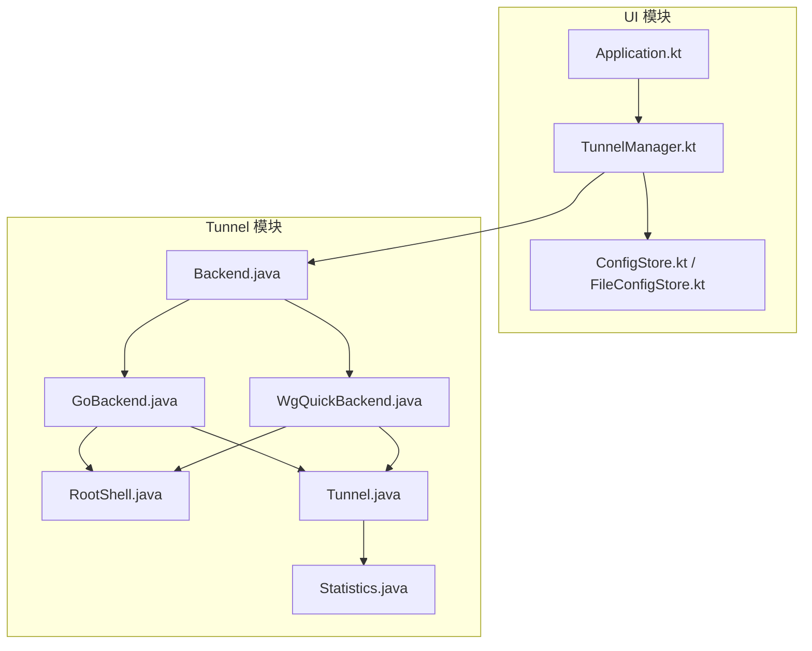
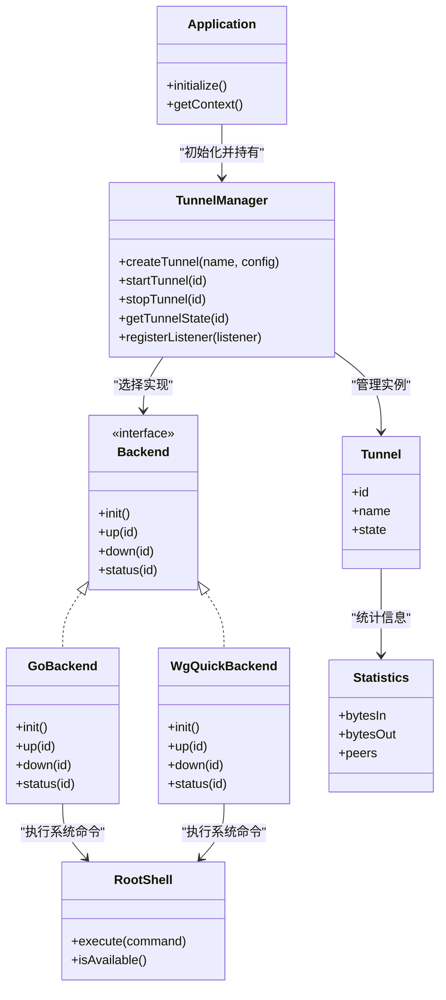
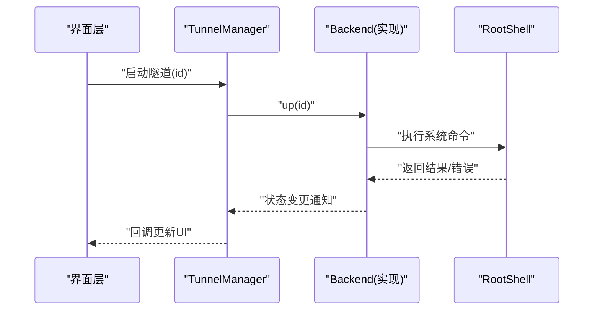
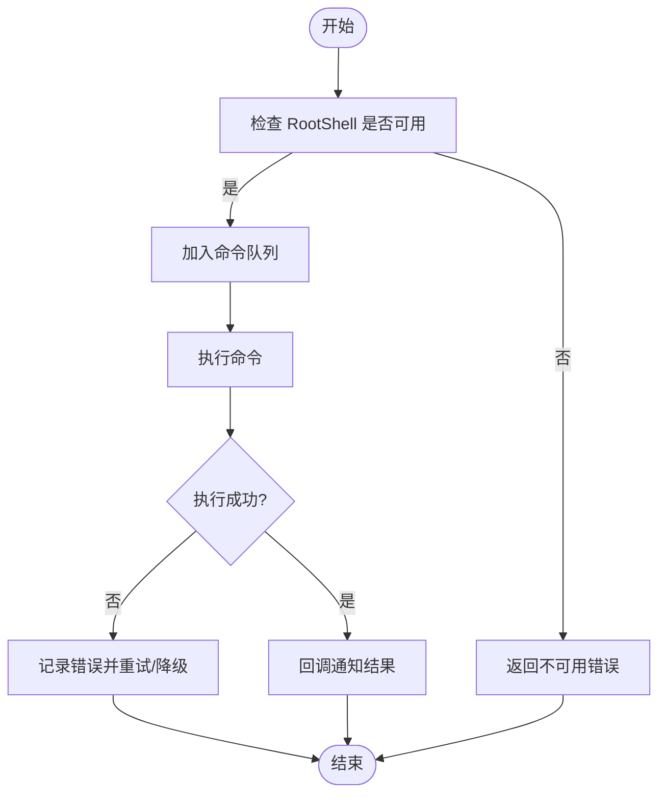
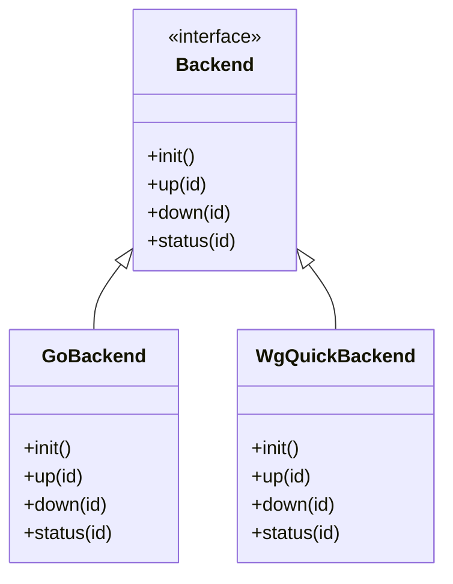
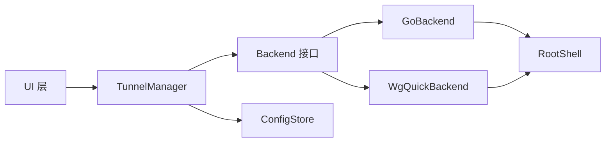

# 单例模式应用

<cite>
**本文档引用的文件**   
- [Application.kt](file://ui/src/main/java/com/wireguard/android/Application.kt)
- [TunnelManager.kt](file://ui/src/main/java/com/wireguard/android/model/TunnelManager.kt)
- [RootShell.java](file://tunnel/src/main/java/com/wireguard/android/util/RootShell.java)
- [Backend.java](file://tunnel/src/main/java/com/wireguard/android/backend/Backend.java)
- [GoBackend.java](file://tunnel/src/main/java/com/wireguard/android/backend/GoBackend.java)
- [WgQuickBackend.java](file://tunnel/src/main/java/com/wireguard/android/backend/WgQuickBackend.java)
- [Tunnel.java](file://tunnel/src/main/java/com/wireguard/android/backend/Tunnel.java)
- [Statistics.java](file://tunnel/src/main/java/com/wireguard/android/backend/Statistics.java)
- [ConfigStore.kt](file://ui/src/main/java/com/wireguard/android/configStore/ConfigStore.kt)
- [FileConfigStore.kt](file://ui/src/main/java/com/wireguard/android/configStore/FileConfigStore.kt)
</cite>

## 目录
1. [简介](#简介)
2. [项目结构](#项目结构)
3. [核心组件](#核心组件)
4. [架构总览](#架构总览)
5. [详细组件分析](#详细组件分析)
6. [依赖关系分析](#依赖关系分析)
7. [性能考虑](#性能考虑)
8. [故障排查指南](#故障排查指南)
9. [结论](#结论)
10. [附录](#附录)

## 简介
本文件面向 WireGuard Android 项目中“单例模式”的应用与实践，重点围绕以下主题展开：
- 全局单例对象的设计与应用场景（如 Application 基类、TunnelManager 隧道管理器、RootShell 根权限管理等）
- 单例在资源管理与状态共享中的作用
- 线程安全的单例实现方式与生命周期管理
- 单例模式可能带来的问题及解决方案
- 具体代码示例路径与使用注意事项

本说明旨在帮助开发者理解如何在 Android 应用中以安全、可维护的方式使用单例，避免常见陷阱。

## 项目结构
WireGuard Android 采用多模块组织：
- ui 模块：负责 UI、ViewModel、配置存储等
- tunnel 模块：封装底层后端、隧道抽象、统计信息与工具类（含 RootShell）

单例相关的关键位置：
- ui/Application.kt：应用级初始化与全局上下文持有
- ui/model/TunnelManager.kt：隧道生命周期与状态管理的中心
- tunnel/util/RootShell.java：系统命令执行与权限管理
- tunnel/backend/*：后端抽象与实现（GoBackend、WgQuickBackend），以及 Tunnel、Statistics 等核心类型

图表来源
- [Application.kt](file://ui/src/main/java/com/wireguard/android/Application.kt)
- [TunnelManager.kt](file://ui/src/main/java/com/wireguard/android/model/TunnelManager.kt)
- [RootShell.java](file://tunnel/src/main/java/com/wireguard/android/util/RootShell.java)
- [Backend.java](file://tunnel/src/main/java/com/wireguard/android/backend/Backend.java)
- [GoBackend.java](file://tunnel/src/main/java/com/wireguard/android/backend/GoBackend.java)
- [WgQuickBackend.java](file://tunnel/src/main/java/com/wireguard/android/backend/WgQuickBackend.java)
- [Tunnel.java](file://tunnel/src/main/java/com/wireguard/android/backend/Tunnel.java)
- [Statistics.java](file://tunnel/src/main/java/com/wireguard/android/backend/Statistics.java)
- [ConfigStore.kt](file://ui/src/main/java/com/wireguard/android/configStore/ConfigStore.kt)
- [FileConfigStore.kt](file://ui/src/main/java/com/wireguard/android/configStore/FileConfigStore.kt)

章节来源
- [Application.kt](file://ui/src/main/java/com/wireguard/android/Application.kt)
- [TunnelManager.kt](file://ui/src/main/java/com/wireguard/android/model/TunnelManager.kt)
- [RootShell.java](file://tunnel/src/main/java/com/wireguard/android/util/RootShell.java)
- [Backend.java](file://tunnel/src/main/java/com/wireguard/android/backend/Backend.java)
- [GoBackend.java](file://tunnel/src/main/java/com/wireguard/android/backend/GoBackend.java)
- [WgQuickBackend.java](file://tunnel/src/main/java/com/wireguard/android/backend/WgQuickBackend.java)
- [Tunnel.java](file://tunnel/src/main/java/com/wireguard/android/backend/Tunnel.java)
- [Statistics.java](file://tunnel/src/main/java/com/wireguard/android/backend/Statistics.java)
- [ConfigStore.kt](file://ui/src/main/java/com/wireguard/android/configStore/ConfigStore.kt)
- [FileConfigStore.kt](file://ui/src/main/java/com/wireguard/android/configStore/FileConfigStore.kt)

## 核心组件
- Application 基类：用于应用启动时的全局初始化，提供稳定的 Context 与全局配置入口
- TunnelManager：集中管理隧道的创建、启动、停止、销毁与状态同步，是跨模块的状态枢纽
- RootShell：封装 root 权限下的系统调用，确保命令执行的统一入口与错误处理
- Backend 抽象与实现：定义统一的隧道后端接口，GoBackend/WgQuickBackend 分别对接不同内核或工具链
- Tunnel/Statistics：描述单个隧道实例及其运行统计信息

这些组件通过单例或受控的工厂方式暴露，保证全局唯一性与一致的状态视图。

章节来源
- [Application.kt](file://ui/src/main/java/com/wireguard/android/Application.kt)
- [TunnelManager.kt](file://ui/src/main/java/com/wireguard/android/model/TunnelManager.kt)
- [RootShell.java](file://tunnel/src/main/java/com/wireguard/android/util/RootShell.java)
- [Backend.java](file://tunnel/src/main/java/com/wireguard/android/backend/Backend.java)
- [GoBackend.java](file://tunnel/src/main/java/com/wireguard/android/backend/GoBackend.java)
- [WgQuickBackend.java](file://tunnel/src/main/java/com/wireguard/android/backend/WgQuickBackend.java)
- [Tunnel.java](file://tunnel/src/main/java/com/wireguard/android/backend/Tunnel.java)
- [Statistics.java](file://tunnel/src/main/java/com/wireguard/android/backend/Statistics.java)

## 架构总览
下图展示了单例化关键组件之间的交互关系与数据流向。Application 作为入口初始化全局上下文；TunnelManager 作为单例协调后端与配置存储；RootShell 为所有需要 root 的命令提供统一通道；后端实现屏蔽差异，对外暴露一致的 Tunnel/Statistics 模型。

图表来源
- [Application.kt](file://ui/src/main/java/com/wireguard/android/Application.kt)
- [TunnelManager.kt](file://ui/src/main/java/com/wireguard/android/model/TunnelManager.kt)
- [RootShell.java](file://tunnel/src/main/java/com/wireguard/android/util/RootShell.java)
- [Backend.java](file://tunnel/src/main/java/com/wireguard/android/backend/Backend.java)
- [GoBackend.java](file://tunnel/src/main/java/com/wireguard/android/backend/GoBackend.java)
- [WgQuickBackend.java](file://tunnel/src/main/java/com/wireguard/android/backend/WgQuickBackend.java)
- [Tunnel.java](file://tunnel/src/main/java/com/wireguard/android/backend/Tunnel.java)
- [Statistics.java](file://tunnel/src/main/java/com/wireguard/android/backend/Statistics.java)

## 详细组件分析

### Application 基类（应用级单例）
- 职责
  - 应用进程启动时完成全局初始化（日志、崩溃收集、基础库加载等）
  - 提供稳定的 Context 引用，供其他模块访问
  - 初始化关键单例（如 TunnelManager、RootShell）
- 单例要点
  - 使用 Application 子类作为全局入口，避免手动持有静态引用导致泄漏
  - 在 onCreate 中按依赖顺序初始化，确保后续组件可用
- 生命周期
  - 随进程生命周期存在，适合持有轻量级全局状态
- 线程安全
  - 初始化阶段需串行执行，避免并发初始化导致的竞态条件

章节来源
- [Application.kt](file://ui/src/main/java/com/wireguard/android/Application.kt)

### TunnelManager（隧道管理器单例）
- 职责
  - 统一管理所有隧道实例的生命周期（创建、启动、停止、销毁）
  - 维护隧道状态与统计信息的缓存，向 UI 层广播变化
  - 协调后端实现的选择与调用
- 单例要点
  - 全局唯一实例，避免重复初始化后端与资源竞争
  - 对外暴露稳定 API，内部封装复杂状态机
- 线程安全
  - 对隧道状态的读写需加锁或使用不可变数据结构
  - 事件回调应在主线程分发，避免 UI 更新异常
- 生命周期
  - 随 Application 初始化，随进程结束释放

图表来源
- [TunnelManager.kt](file://ui/src/main/java/com/wireguard/android/model/TunnelManager.kt)
- [Backend.java](file://tunnel/src/main/java/com/wireguard/android/backend/Backend.java)
- [GoBackend.java](file://tunnel/src/main/java/com/wireguard/android/backend/GoBackend.java)
- [WgQuickBackend.java](file://tunnel/src/main/java/com/wireguard/android/backend/WgQuickBackend.java)
- [RootShell.java](file://tunnel/src/main/java/com/wireguard/android/util/RootShell.java)

章节来源
- [TunnelManager.kt](file://ui/src/main/java/com/wireguard/android/model/TunnelManager.kt)

### RootShell（根权限管理单例）
- 职责
  - 统一封装 root 权限下的命令执行与错误处理
  - 提供可用性检测与重试策略
- 单例要点
  - 全局唯一 Shell 会话，减少权限请求开销
  - 集中处理超时、失败与日志记录
- 线程安全
  - 命令队列串行执行，避免并发冲突
  - 对外暴露异步接口，避免阻塞主线程

图表来源
- [RootShell.java](file://tunnel/src/main/java/com/wireguard/android/util/RootShell.java)

章节来源
- [RootShell.java](file://tunnel/src/main/java/com/wireguard/android/util/RootShell.java)

### Backend 抽象与实现（GoBackend/WgQuickBackend）
- 职责
  - 定义统一的隧道操作接口（初始化、启动、停止、查询状态）
  - 屏蔽不同后端实现的差异，便于扩展与替换
- 单例要点
  - 后端初始化仅一次，避免重复加载库或建立连接
- 线程安全
  - 状态变更通过回调通知，避免直接修改外部可变状态

图表来源
- [Backend.java](file://tunnel/src/main/java/com/wireguard/android/backend/Backend.java)
- [GoBackend.java](file://tunnel/src/main/java/com/wireguard/android/backend/GoBackend.java)
- [WgQuickBackend.java](file://tunnel/src/main/java/com/wireguard/android/backend/WgQuickBackend.java)

章节来源
- [Backend.java](file://tunnel/src/main/java/com/wireguard/android/backend/Backend.java)
- [GoBackend.java](file://tunnel/src/main/java/com/wireguard/android/backend/GoBackend.java)
- [WgQuickBackend.java](file://tunnel/src/main/java/com/wireguard/android/backend/WgQuickBackend.java)

### Tunnel 与 Statistics（隧道实例与统计）
- 职责
  - Tunnel：描述单个隧道的标识、名称、状态等
  - Statistics：聚合流量统计、对端信息等
- 设计要点
  - 作为值对象或轻量模型，避免在单例中持有过多可变状态
  - 通过不可变快照或观察者模式向 UI 推送更新

章节来源
- [Tunnel.java](file://tunnel/src/main/java/com/wireguard/android/backend/Tunnel.java)
- [Statistics.java](file://tunnel/src/main/java/com/wireguard/android/backend/Statistics.java)

### ConfigStore（配置存储）
- 职责
  - 抽象配置持久化接口，支持文件或其他存储后端
- 单例要点
  - 配置读取/写入应去重与缓存，避免频繁 I/O
- 线程安全
  - 读写需序列化，防止并发写导致损坏

章节来源
- [ConfigStore.kt](file://ui/src/main/java/com/wireguard/android/configStore/ConfigStore.kt)
- [FileConfigStore.kt](file://ui/src/main/java/com/wireguard/android/configStore/FileConfigStore.kt)

## 依赖关系分析
- 耦合度
  - TunnelManager 与 Backend 解耦，通过接口切换实现
  - RootShell 被后端实现依赖，但通过统一接口隔离
- 循环依赖
  - 应避免 UI 层反向依赖底层实现，保持单向依赖
- 外部依赖
  - 系统命令、内核接口通过 RootShell 与 Backend 抽象屏蔽

图表来源
- [TunnelManager.kt](file://ui/src/main/java/com/wireguard/android/model/TunnelManager.kt)
- [Backend.java](file://tunnel/src/main/java/com/wireguard/android/backend/Backend.java)
- [GoBackend.java](file://tunnel/src/main/java/com/wireguard/android/backend/GoBackend.java)
- [WgQuickBackend.java](file://tunnel/src/main/java/com/wireguard/android/backend/WgQuickBackend.java)
- [RootShell.java](file://tunnel/src/main/java/com/wireguard/android/util/RootShell.java)
- [ConfigStore.kt](file://ui/src/main/java/com/wireguard/android/configStore/ConfigStore.kt)

章节来源
- [TunnelManager.kt](file://ui/src/main/java/com/wireguard/android/model/TunnelManager.kt)
- [Backend.java](file://tunnel/src/main/java/com/wireguard/android/backend/Backend.java)
- [GoBackend.java](file://tunnel/src/main/java/com/wireguard/android/backend/GoBackend.java)
- [WgQuickBackend.java](file://tunnel/src/main/java/com/wireguard/android/backend/WgQuickBackend.java)
- [RootShell.java](file://tunnel/src/main/java/com/wireguard/android/util/RootShell.java)
- [ConfigStore.kt](file://ui/src/main/java/com/wireguard/android/configStore/ConfigStore.kt)

## 性能考虑
- 初始化成本
  - 将昂贵初始化延迟到首次使用（懒加载），避免冷启动耗时
- 内存占用
  - 单例中避免持有大对象或长生命周期引用，必要时使用弱引用或按需加载
- I/O 与网络
  - 合并请求、批量写入，减少磁盘与系统调用次数
- 线程模型
  - 后台任务使用独立线程池，避免阻塞主线程
  - 回调与状态更新在主线程分发，保证 UI 一致性

[本节为通用指导，不直接分析具体文件]

## 故障排查指南
- 常见问题
  - 单例未正确初始化导致空指针
  - 多线程并发访问导致状态不一致
  - 权限不足导致 RootShell 命令失败
  - 后端初始化失败或版本不兼容
- 定位方法
  - 检查 Application.onCreate 中的初始化顺序
  - 查看 RootShell 的错误码与日志输出
  - 确认后端实现是否已正确加载
  - 使用调试器观察 TunnelManager 的状态流转
- 修复建议
  - 增加健壮的错误处理与降级逻辑
  - 为关键路径添加断言与日志
  - 使用不可变数据与观察者模式降低竞态风险

章节来源
- [RootShell.java](file://tunnel/src/main/java/com/wireguard/android/util/RootShell.java)
- [TunnelManager.kt](file://ui/src/main/java/com/wireguard/android/model/TunnelManager.kt)
- [GoBackend.java](file://tunnel/src/main/java/com/wireguard/android/backend/GoBackend.java)
- [WgQuickBackend.java](file://tunnel/src/main/java/com/wireguard/android/backend/WgQuickBackend.java)

## 结论
在 WireGuard Android 中，单例模式被广泛用于管理全局资源与状态，包括 Application、TunnelManager、RootShell 等。通过合理的单例设计与线程安全策略，可以有效提升系统的稳定性与可维护性。同时，需注意单例带来的耦合与测试难度，通过接口抽象与依赖注入等手段进行缓解。

[本节为总结性内容，不直接分析具体文件]

## 附录
- 最佳实践清单
  - 明确单例的职责边界，避免“上帝对象”
  - 使用懒加载与一次性初始化，控制启动开销
  - 对外暴露只读接口，内部状态变更通过回调通知
  - 为关键路径添加单元测试与集成测试
- 参考路径
  - 应用初始化：[Application.kt](file://ui/src/main/java/com/wireguard/android/Application.kt)
  - 隧道管理：[TunnelManager.kt](file://ui/src/main/java/com/wireguard/android/model/TunnelManager.kt)
  - 根权限管理：[RootShell.java](file://tunnel/src/main/java/com/wireguard/android/util/RootShell.java)
  - 后端接口与实现：[Backend.java](file://tunnel/src/main/java/com/wireguard/android/backend/Backend.java)、[GoBackend.java](file://tunnel/src/main/java/com/wireguard/android/backend/GoBackend.java)、[WgQuickBackend.java](file://tunnel/src/main/java/com/wireguard/android/backend/WgQuickBackend.java)
  - 隧道与统计：[Tunnel.java](file://tunnel/src/main/java/com/wireguard/android/backend/Tunnel.java)、[Statistics.java](file://tunnel/src/main/java/com/wireguard/android/backend/Statistics.java)
  - 配置存储：[ConfigStore.kt](file://ui/src/main/java/com/wireguard/android/configStore/ConfigStore.kt)、[FileConfigStore.kt](file://ui/src/main/java/com/wireguard/android/configStore/FileConfigStore.kt)