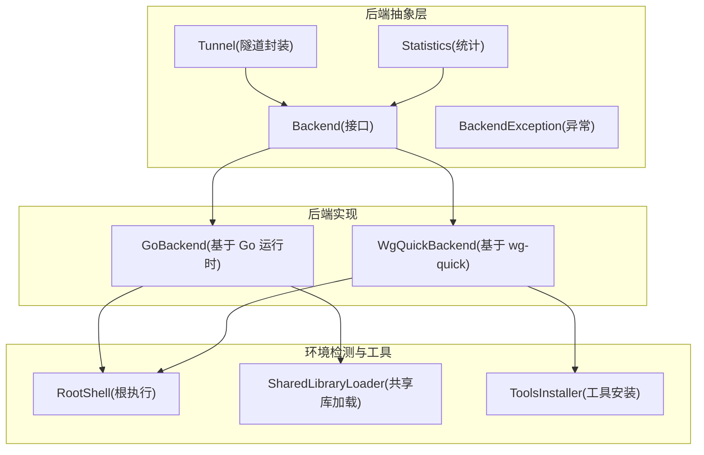
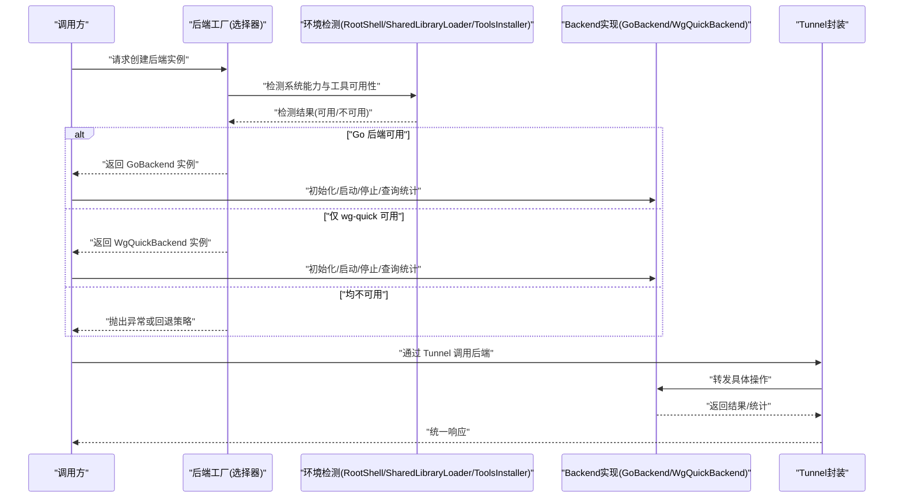
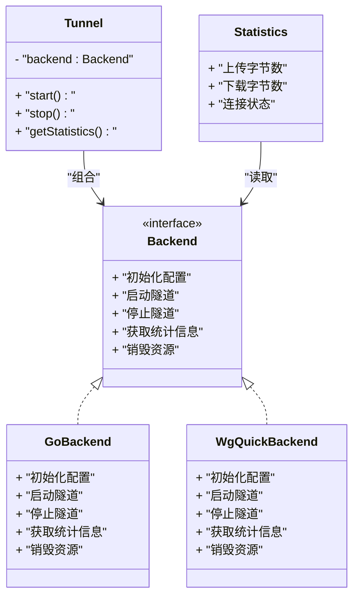
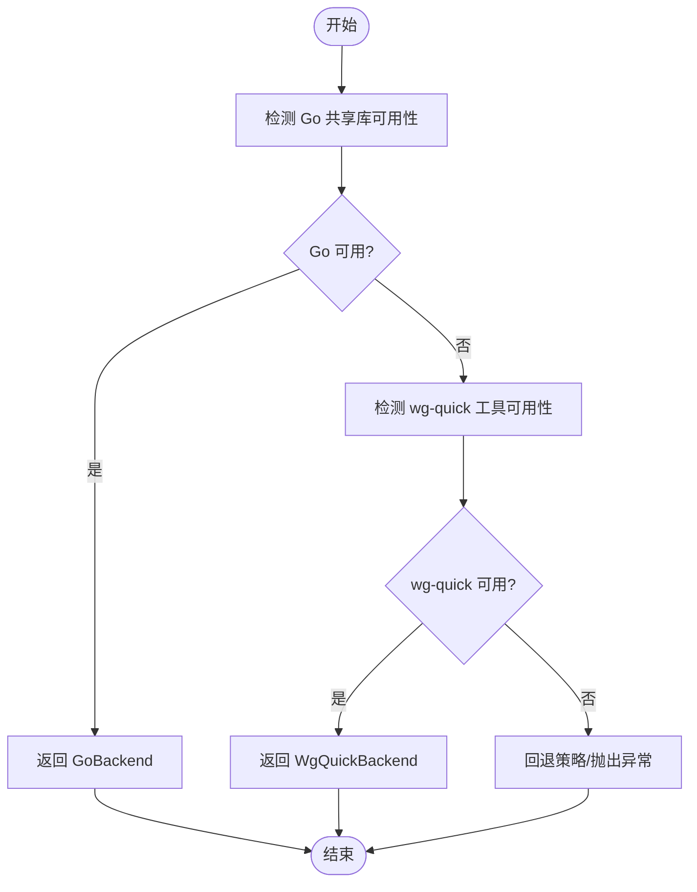
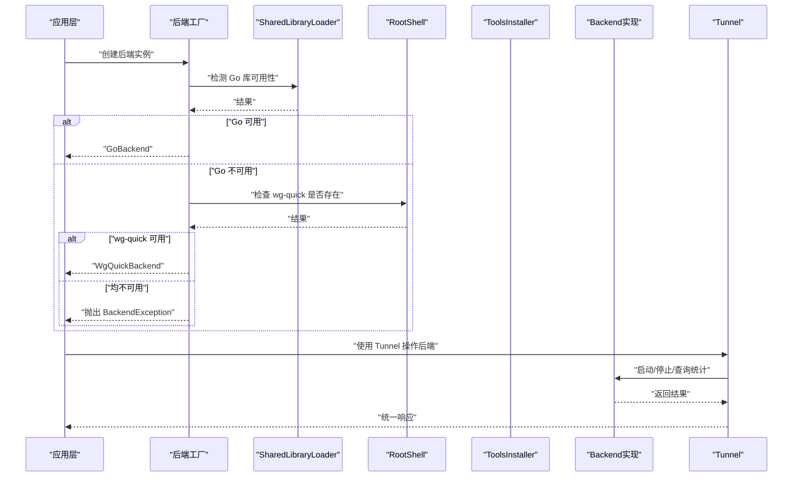
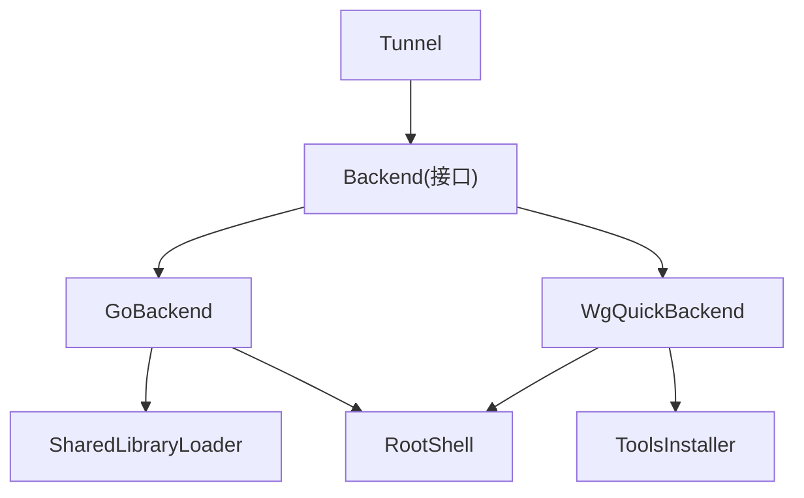

# 工厂模式应用

<cite>
**本文引用的文件**   
- [Backend.java](file://tunnel/src/main/java/com/wireguard/android/backend/Backend.java)
- [GoBackend.java](file://tunnel/src/main/java/com/wireguard/android/backend/GoBackend.java)
- [WgQuickBackend.java](file://tunnel/src/main/java/com/wireguard/android/backend/WgQuickBackend.java)
- [Tunnel.java](file://tunnel/src/main/java/com/wireguard/android/backend/Tunnel.java)
- [Statistics.java](file://tunnel/src/main/java/com/wireguard/android/backend/Statistics.java)
- [BackendException.java](file://tunnel/src/main/java/com/wireguard/android/backend/BackendException.java)
- [RootShell.java](file://tunnel/src/main/java/com/wireguard/android/util/RootShell.java)
- [SharedLibraryLoader.java](file://tunnel/src/main/java/com/wireguard/android/util/SharedLibraryLoader.java)
- [ToolsInstaller.java](file://tunnel/src/main/java/com/wireguard/android/util/ToolsInstaller.java)
</cite>

## 目录
1. [简介](#简介)
2. [项目结构](#项目结构)
3. [核心组件](#核心组件)
4. [架构总览](#架构总览)
5. [详细组件分析](#详细组件分析)
6. [依赖分析](#依赖分析)
7. [性能考虑](#性能考虑)
8. [故障排查指南](#故障排查指南)
9. [结论](#结论)
10. [附录](#附录)

## 简介
本文件聚焦 WireGuard Android 项目中“后端抽象与工厂选择”的设计，围绕 Backend 接口抽象层、GoBackend 与 WgQuickBackend 两种实现，以及通过工厂方法动态选择后端的机制进行系统化说明。文档将解释后端选择器的决策逻辑（系统能力检测与环境适配）、工厂方法的实现要点与使用场景，并给出扩展新后端的最佳实践和调用流程示例路径，帮助读者理解多后端切换的架构优势与落地方式。

## 项目结构
后端相关代码集中在 tunnel 模块的 Java 包中：
- 抽象与实现：Backend、GoBackend、WgQuickBackend、Tunnel、Statistics、BackendException
- 工具与依赖：RootShell、SharedLibraryLoader、ToolsInstaller

图表来源
- [Backend.java](file://tunnel/src/main/java/com/wireguard/android/backend/Backend.java)
- [GoBackend.java](file://tunnel/src/main/java/com/wireguard/android/backend/GoBackend.java)
- [WgQuickBackend.java](file://tunnel/src/main/java/com/wireguard/android/backend/WgQuickBackend.java)
- [Tunnel.java](file://tunnel/src/main/java/com/wireguard/android/backend/Tunnel.java)
- [Statistics.java](file://tunnel/src/main/java/com/wireguard/android/backend/Statistics.java)
- [BackendException.java](file://tunnel/src/main/java/com/wireguard/android/backend/BackendException.java)
- [RootShell.java](file://tunnel/src/main/java/com/wireguard/android/util/RootShell.java)
- [SharedLibraryLoader.java](file://tunnel/src/main/java/com/wireguard/android/util/SharedLibraryLoader.java)
- [ToolsInstaller.java](file://tunnel/src/main/java/com/wireguard/android/util/ToolsInstaller.java)

章节来源
- [Backend.java](file://tunnel/src/main/java/com/wireguard/android/backend/Backend.java)
- [GoBackend.java](file://tunnel/src/main/java/com/wireguard/android/backend/GoBackend.java)
- [WgQuickBackend.java](file://tunnel/src/main/java/com/wireguard/android/backend/WgQuickBackend.java)
- [Tunnel.java](file://tunnel/src/main/java/com/wireguard/android/backend/Tunnel.java)
- [Statistics.java](file://tunnel/src/main/java/com/wireguard/android/backend/Statistics.java)
- [BackendException.java](file://tunnel/src/main/java/com/wireguard/android/backend/BackendException.java)
- [RootShell.java](file://tunnel/src/main/java/com/wireguard/android/util/RootShell.java)
- [SharedLibraryLoader.java](file://tunnel/src/main/java/com/wireguard/android/util/SharedLibraryLoader.java)
- [ToolsInstaller.java](file://tunnel/src/main/java/com/wireguard/android/util/ToolsInstaller.java)

## 核心组件
- Backend 接口：定义统一的隧道生命周期与统计访问契约，屏蔽底层差异，供上层统一调用。
- GoBackend：基于 Go 运行时实现的 WireGuard 后端，通常具备更好的性能与功能完整性。
- WgQuickBackend：基于系统或用户态 wg-quick 脚本的后端，便于在受限环境中快速启用。
- Tunnel：对具体后端实例的封装，提供面向业务层的隧道操作入口。
- Statistics：用于获取连接状态、流量统计等指标。
- BackendException：后端操作异常的标准化封装。

章节来源
- [Backend.java](file://tunnel/src/main/java/com/wireguard/android/backend/Backend.java)
- [GoBackend.java](file://tunnel/src/main/java/com/wireguard/android/backend/GoBackend.java)
- [WgQuickBackend.java](file://tunnel/src/main/java/com/wireguard/android/backend/WgQuickBackend.java)
- [Tunnel.java](file://tunnel/src/main/java/com/wireguard/android/backend/Tunnel.java)
- [Statistics.java](file://tunnel/src/main/java/com/wireguard/android/backend/Statistics.java)
- [BackendException.java](file://tunnel/src/main/java/com/wireguard/android/backend/BackendException.java)

## 架构总览
后端选择采用“工厂方法 + 环境检测”的模式：
- 工厂方法负责根据当前设备能力与运行环境，返回合适的 Backend 实现。
- 环境检测包括：是否可加载 Go 共享库、是否存在 wg-quick 工具、是否有 root 权限等。
- 上层通过 Tunnel 与 Backend 交互，无需关心具体实现细节。

图表来源
- [Backend.java](file://tunnel/src/main/java/com/wireguard/android/backend/Backend.java)
- [GoBackend.java](file://tunnel/src/main/java/com/wireguard/android/backend/GoBackend.java)
- [WgQuickBackend.java](file://tunnel/src/main/java/com/wireguard/android/backend/WgQuickBackend.java)
- [RootShell.java](file://tunnel/src/main/java/com/wireguard/android/util/RootShell.java)
- [SharedLibraryLoader.java](file://tunnel/src/main/java/com/wireguard/android/util/SharedLibraryLoader.java)
- [ToolsInstaller.java](file://tunnel/src/main/java/com/wireguard/android/util/ToolsInstaller.java)

## 详细组件分析

### 后端接口与实现类关系
Backend 作为抽象层，定义了统一的 API；GoBackend 与 WgQuickBackend 分别实现该接口，提供不同的底层能力。Tunnel 持有 Backend 实例，对外暴露一致的隧道操作。

图表来源
- [Backend.java](file://tunnel/src/main/java/com/wireguard/android/backend/Backend.java)
- [GoBackend.java](file://tunnel/src/main/java/com/wireguard/android/backend/GoBackend.java)
- [WgQuickBackend.java](file://tunnel/src/main/java/com/wireguard/android/backend/WgQuickBackend.java)
- [Tunnel.java](file://tunnel/src/main/java/com/wireguard/android/backend/Tunnel.java)
- [Statistics.java](file://tunnel/src/main/java/com/wireguard/android/backend/Statistics.java)

章节来源
- [Backend.java](file://tunnel/src/main/java/com/wireguard/android/backend/Backend.java)
- [GoBackend.java](file://tunnel/src/main/java/com/wireguard/android/backend/GoBackend.java)
- [WgQuickBackend.java](file://tunnel/src/main/java/com/wireguard/android/backend/WgQuickBackend.java)
- [Tunnel.java](file://tunnel/src/main/java/com/wireguard/android/backend/Tunnel.java)
- [Statistics.java](file://tunnel/src/main/java/com/wireguard/android/backend/Statistics.java)

### 工厂方法与后端选择器
工厂方法的核心职责是：
- 检测系统能力：如 Go 共享库是否可加载、wg-quick 工具是否可用、root 权限是否满足。
- 根据检测结果返回合适的 Backend 实现。
- 当所有后端都不可用时，提供回退策略或抛出明确异常。

图表来源
- [RootShell.java](file://tunnel/src/main/java/com/wireguard/android/util/RootShell.java)
- [SharedLibraryLoader.java](file://tunnel/src/main/java/com/wireguard/android/util/SharedLibraryLoader.java)
- [ToolsInstaller.java](file://tunnel/src/main/java/com/wireguard/android/util/ToolsInstaller.java)

章节来源
- [RootShell.java](file://tunnel/src/main/java/com/wireguard/android/util/RootShell.java)
- [SharedLibraryLoader.java](file://tunnel/src/main/java/com/wireguard/android/util/SharedLibraryLoader.java)
- [ToolsInstaller.java](file://tunnel/src/main/java/com/wireguard/android/util/ToolsInstaller.java)

### 后端选择器的决策逻辑（系统能力检测与环境适配）
- 共享库加载检测：通过 SharedLibraryLoader 尝试加载 Go 运行时库，若成功则优先选择 GoBackend。
- 工具可用性检测：通过 RootShell 执行命令探测 wg-quick 是否存在且可执行，若存在则选择 WgQuickBackend。
- 权限与环境适配：某些操作需要 root 权限，若权限不足则降级到非 root 可用的后端或提示用户安装必要工具。
- 回退策略：当所有后端不可用时，应向上层返回明确的错误信息，以便 UI 或日志记录。

章节来源
- [RootShell.java](file://tunnel/src/main/java/com/wireguard/android/util/RootShell.java)
- [SharedLibraryLoader.java](file://tunnel/src/main/java/com/wireguard/android/util/SharedLibraryLoader.java)
- [ToolsInstaller.java](file://tunnel/src/main/java/com/wireguard/android/util/ToolsInstaller.java)

### 工厂方法的具体实现与使用场景
- 典型使用场景：
  - 应用启动时初始化后端实例，供 Tunnel 使用。
  - 设置页中允许用户切换后端（如果支持）。
  - 运行时根据网络环境与权限变化重新选择后端。
- 调用流程建议：
  - 先尝试加载 Go 后端，失败再尝试 wg-quick 后端。
  - 捕获 BackendException 并进行友好提示或重试。
  - 将选择的后端实例缓存，避免重复检测开销。

章节来源
- [Backend.java](file://tunnel/src/main/java/com/wireguard/android/backend/Backend.java)
- [GoBackend.java](file://tunnel/src/main/java/com/wireguard/android/backend/GoBackend.java)
- [WgQuickBackend.java](file://tunnel/src/main/java/com/wireguard/android/backend/WgQuickBackend.java)
- [BackendException.java](file://tunnel/src/main/java/com/wireguard/android/backend/BackendException.java)

### 多后端切换与扩展新后端实现
- 多后端切换：
  - 通过工厂方法在不同实现间切换，保持上层调用一致。
  - 可在设置中提供“首选后端”选项，结合环境检测决定最终实现。
- 扩展新后端：
  - 新增一个类实现 Backend 接口。
  - 在工厂方法中加入新的检测分支，返回新实现。
  - 确保新后端正确实现统计、生命周期管理与异常处理。

章节来源
- [Backend.java](file://tunnel/src/main/java/com/wireguard/android/backend/Backend.java)
- [GoBackend.java](file://tunnel/src/main/java/com/wireguard/android/backend/GoBackend.java)
- [WgQuickBackend.java](file://tunnel/src/main/java/com/wireguard/android/backend/WgQuickBackend.java)

### 调用流程与最佳实践（以序列图展示）

图表来源
- [Backend.java](file://tunnel/src/main/java/com/wireguard/android/backend/Backend.java)
- [GoBackend.java](file://tunnel/src/main/java/com/wireguard/android/backend/GoBackend.java)
- [WgQuickBackend.java](file://tunnel/src/main/java/com/wireguard/android/backend/WgQuickBackend.java)
- [RootShell.java](file://tunnel/src/main/java/com/wireguard/android/util/RootShell.java)
- [SharedLibraryLoader.java](file://tunnel/src/main/java/com/wireguard/android/util/SharedLibraryLoader.java)
- [ToolsInstaller.java](file://tunnel/src/main/java/com/wireguard/android/util/ToolsInstaller.java)

章节来源
- [Backend.java](file://tunnel/src/main/java/com/wireguard/android/backend/Backend.java)
- [GoBackend.java](file://tunnel/src/main/java/com/wireguard/android/backend/GoBackend.java)
- [WgQuickBackend.java](file://tunnel/src/main/java/com/wireguard/android/backend/WgQuickBackend.java)
- [RootShell.java](file://tunnel/src/main/java/com/wireguard/android/util/RootShell.java)
- [SharedLibraryLoader.java](file://tunnel/src/main/java/com/wireguard/android/util/SharedLibraryLoader.java)
- [ToolsInstaller.java](file://tunnel/src/main/java/com/wireguard/android/util/ToolsInstaller.java)

## 依赖分析
- 耦合与内聚：
  - Backend 接口高内聚，屏蔽实现细节；GoBackend/WgQuickBackend 低耦合，仅依赖必要的工具与系统能力。
- 直接依赖：
  - GoBackend 依赖 SharedLibraryLoader 与 RootShell。
  - WgQuickBackend 依赖 RootShell 与 ToolsInstaller。
- 间接依赖：
  - Tunnel 通过 Backend 间接依赖具体实现。
- 外部集成点：
  - 系统命令执行（RootShell）。
  - 共享库加载（SharedLibraryLoader）。
  - 工具安装与检测（ToolsInstaller）。

图表来源
- [Backend.java](file://tunnel/src/main/java/com/wireguard/android/backend/Backend.java)
- [GoBackend.java](file://tunnel/src/main/java/com/wireguard/android/backend/GoBackend.java)
- [WgQuickBackend.java](file://tunnel/src/main/java/com/wireguard/android/backend/WgQuickBackend.java)
- [RootShell.java](file://tunnel/src/main/java/com/wireguard/android/util/RootShell.java)
- [SharedLibraryLoader.java](file://tunnel/src/main/java/com/wireguard/android/util/SharedLibraryLoader.java)
- [ToolsInstaller.java](file://tunnel/src/main/java/com/wireguard/android/util/ToolsInstaller.java)

章节来源
- [Backend.java](file://tunnel/src/main/java/com/wireguard/android/backend/Backend.java)
- [GoBackend.java](file://tunnel/src/main/java/com/wireguard/android/backend/GoBackend.java)
- [WgQuickBackend.java](file://tunnel/src/main/java/com/wireguard/android/backend/WgQuickBackend.java)
- [RootShell.java](file://tunnel/src/main/java/com/wireguard/android/util/RootShell.java)
- [SharedLibraryLoader.java](file://tunnel/src/main/java/com/wireguard/android/util/SharedLibraryLoader.java)
- [ToolsInstaller.java](file://tunnel/src/main/java/com/wireguard/android/util/ToolsInstaller.java)

## 性能考虑
- 优先选择 Go 后端：通常具备更优的性能与功能完整性，适合高性能场景。
- 避免重复检测：工厂方法的结果可缓存，减少每次创建实例时的环境检测开销。
- 异步检测：在后台线程执行环境检测，避免阻塞主线程。
- 资源管理：确保后端启动/停止的生命周期正确释放资源，防止内存泄漏。

[本节为通用指导，不直接分析具体文件]

## 故障排查指南
- 常见异常：
  - BackendException：后端初始化失败、工具缺失、权限不足等。
- 排查步骤：
  - 检查 SharedLibraryLoader 是否能成功加载 Go 库。
  - 使用 RootShell 验证 wg-quick 是否存在并可执行。
  - 确认 ToolsInstaller 是否正确安装必要工具。
  - 查看日志输出，定位具体失败环节。
- 处理建议：
  - 提供友好的错误提示与修复指引。
  - 在 UI 中引导用户安装缺失工具或授予权限。

章节来源
- [BackendException.java](file://tunnel/src/main/java/com/wireguard/android/backend/BackendException.java)
- [RootShell.java](file://tunnel/src/main/java/com/wireguard/android/util/RootShell.java)
- [SharedLibraryLoader.java](file://tunnel/src/main/java/com/wireguard/android/util/SharedLibraryLoader.java)
- [ToolsInstaller.java](file://tunnel/src/main/java/com/wireguard/android/util/ToolsInstaller.java)

## 结论
通过 Backend 接口抽象与工厂方法选择机制，WireGuard Android 实现了灵活的多后端切换与可扩展性。GoBackend 与 WgQuickBackend 分别覆盖高性能与轻量级场景，结合系统能力检测与环境适配，确保在不同设备上都能稳定运行。遵循本文的最佳实践，可有效降低耦合度、提升可维护性，并为未来扩展新的后端实现奠定基础。

[本节为总结，不直接分析具体文件]

## 附录
- 扩展新后端实现清单：
  - 实现 Backend 接口，完成生命周期与统计方法。
  - 在工厂方法中添加检测分支与返回逻辑。
  - 编写单元测试覆盖正常与异常路径。
  - 更新文档与用户界面提示。

[本节为补充信息，不直接分析具体文件]