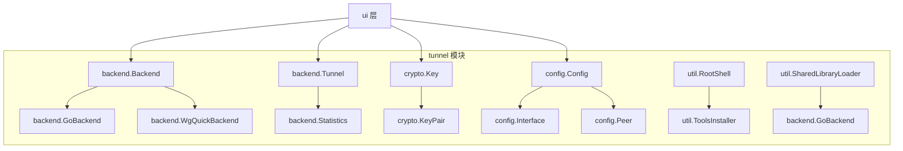
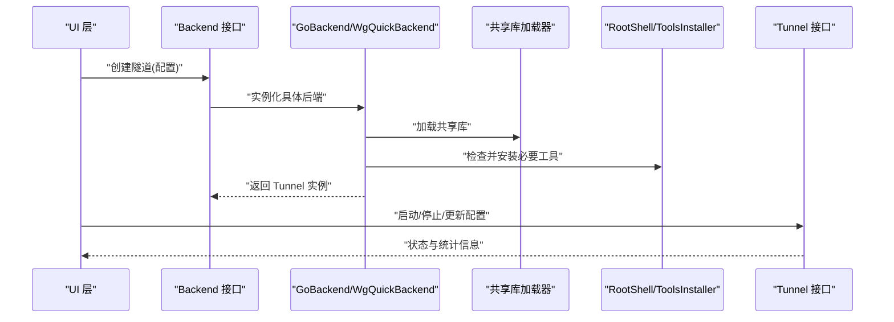
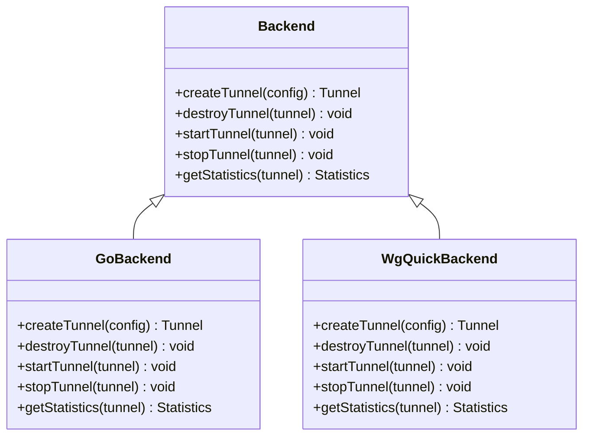
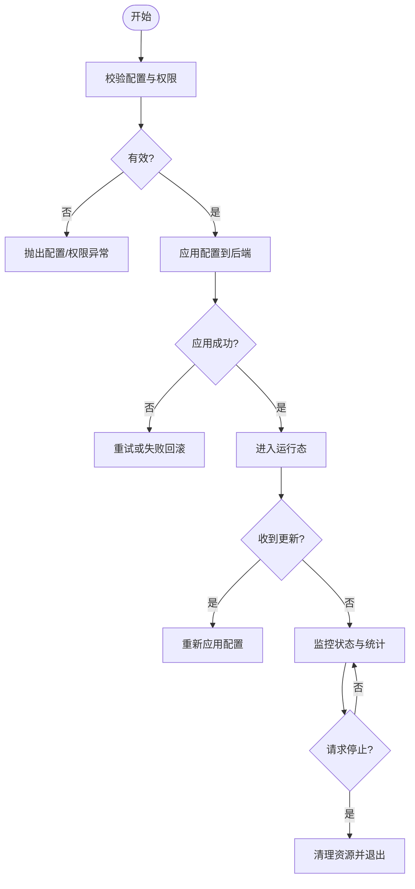
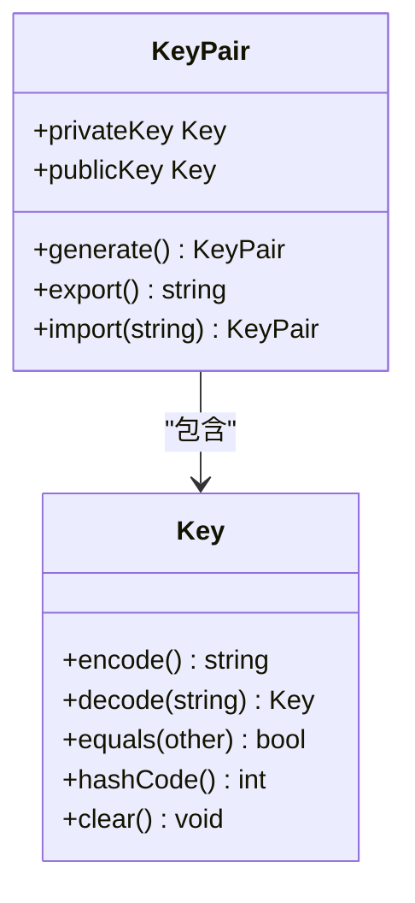
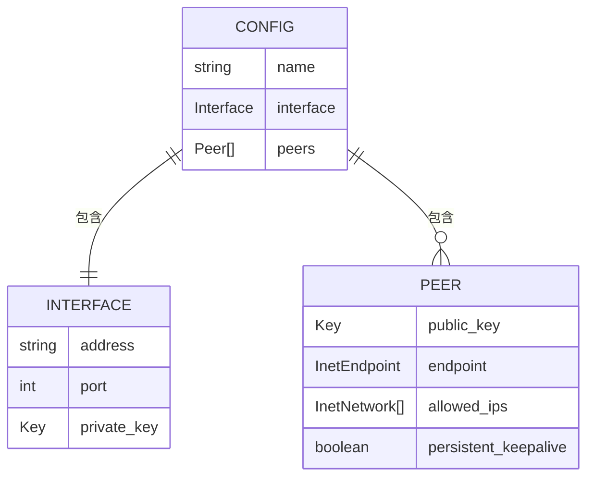
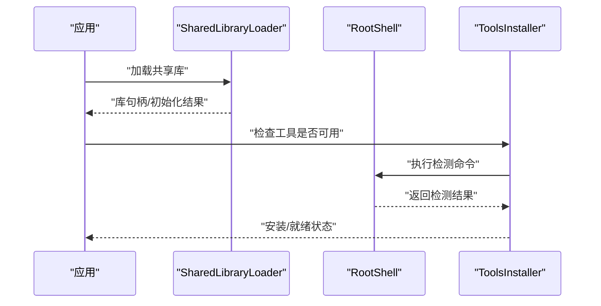
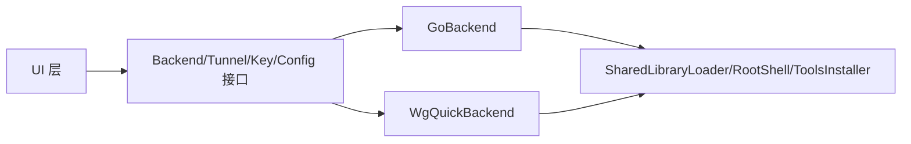

# 接口抽象设计

<cite>
**本文引用的文件**   
- [Backend.java](file://tunnel/src/main/java/com/wireguard/android/backend/Backend.java)
- [GoBackend.java](file://tunnel/src/main/java/com/wireguard/android/backend/GoBackend.java)
- [WgQuickBackend.java](file://tunnel/src/main/java/com/wireguard/android/backend/WgQuickBackend.java)
- [Tunnel.java](file://tunnel/src/main/java/com/wireguard/android/backend/Tunnel.java)
- [Statistics.java](file://tunnel/src/main/java/com/wireguard/android/backend/Statistics.java)
- [Key.java](file://tunnel/src/main/java/com/wireguard/crypto/Key.java)
- [KeyPair.java](file://tunnel/src/main/java/com/wireguard/crypto/KeyPair.java)
- [Curve25519.java](file://tunnel/src/main/java/com/wireguard/crypto/Curve25519.java)
- [Config.java](file://tunnel/src/main/java/com/wireguard/config/Config.java)
- [Interface.java](file://tunnel/src/main/java/com/wireguard/config/Interface.java)
- [Peer.java](file://tunnel/src/main/java/com/wireguard/config/Peer.java)
- [InetEndpoint.java](file://tunnel/src/main/java/com/wireguard/config/InetEndpoint.java)
- [InetNetwork.java](file://tunnel/src/main/java/com/wireguard/config/InetNetwork.java)
- [BadConfigException.java](file://tunnel/src/main/java/com/wireguard/config/BadConfigException.java)
- [ParseException.java](file://tunnel/src/main/java/com/wireguard/config/ParseException.java)
- [RootShell.java](file://tunnel/src/main/java/com/wireguard/android/util/RootShell.java)
- [SharedLibraryLoader.java](file://tunnel/src/main/java/com/wireguard/android/util/SharedLibraryLoader.java)
- [ToolsInstaller.java](file://tunnel/src/main/java/com/wireguard/android/util/ToolsInstaller.java)
</cite>

## 目录
1. [简介](#简介)
2. [项目结构](#项目结构)
3. [核心组件](#核心组件)
4. [架构总览](#架构总览)
5. [详细组件分析](#详细组件分析)
6. [依赖关系分析](#依赖关系分析)
7. [性能考量](#性能考量)
8. [故障排查指南](#故障排查指南)
9. [结论](#结论)
10. [附录](#附录)

## 简介
本文件聚焦 WireGuard Android 项目的接口抽象设计，围绕 Backend、Tunnel、Key 等关键接口展开，阐述其职责边界、设计原则与实现要求。通过清晰的接口分层，屏蔽底层 Go 内核模块、JNI 调用、系统工具安装等复杂性，提升系统的可扩展性与可测试性。文档同时给出方法定义规范、常见陷阱与良好实践示例路径，帮助开发者在扩展或替换实现时保持一致性与稳定性。

## 项目结构
- tunnel 模块提供核心接口与配置模型：
  - backend：后端抽象（Backend）、隧道抽象（Tunnel）、统计信息（Statistics）及具体实现（GoBackend、WgQuickBackend）。
  - crypto：密钥抽象（Key、KeyPair）与曲线算法（Curve25519）。
  - config：配置模型（Config、Interface、Peer、InetEndpoint、InetNetwork）与解析异常（BadConfigException、ParseException）。
  - util：系统交互工具（RootShell、SharedLibraryLoader、ToolsInstaller）。
- ui 模块负责用户界面与业务编排，依赖 tunnel 模块的接口进行功能编排。

图表来源
- [Backend.java:1-200](file://tunnel/src/main/java/com/wireguard/android/backend/Backend.java#L1-L200)
- [GoBackend.java:1-200](file://tunnel/src/main/java/com/wireguard/android/backend/GoBackend.java#L1-L200)
- [WgQuickBackend.java:1-200](file://tunnel/src/main/java/com/wireguard/android/backend/WgQuickBackend.java#L1-L200)
- [Tunnel.java:1-200](file://tunnel/src/main/java/com/wireguard/android/backend/Tunnel.java#L1-L200)
- [Statistics.java:1-200](file://tunnel/src/main/java/com/wireguard/android/backend/Statistics.java#L1-L200)
- [Key.java:1-200](file://tunnel/src/main/java/com/wireguard/crypto/Key.java#L1-L200)
- [KeyPair.java:1-200](file://tunnel/src/main/java/com/wireguard/crypto/KeyPair.java#L1-L200)
- [Config.java:1-200](file://tunnel/src/main/java/com/wireguard/config/Config.java#L1-L200)
- [Interface.java:1-200](file://tunnel/src/main/java/com/wireguard/config/Interface.java#L1-L200)
- [Peer.java:1-200](file://tunnel/src/main/java/com/wireguard/config/Peer.java#L1-L200)
- [RootShell.java:1-200](file://tunnel/src/main/java/com/wireguard/android/util/RootShell.java#L1-L200)
- [SharedLibraryLoader.java:1-200](file://tunnel/src/main/java/com/wireguard/android/util/SharedLibraryLoader.java#L1-L200)
- [ToolsInstaller.java:1-200](file://tunnel/src/main/java/com/wireguard/android/util/ToolsInstaller.java#L1-L200)

章节来源
- [Backend.java:1-200](file://tunnel/src/main/java/com/wireguard/android/backend/Backend.java#L1-L200)
- [Tunnel.java:1-200](file://tunnel/src/main/java/com/wireguard/android/backend/Tunnel.java#L1-L200)
- [Key.java:1-200](file://tunnel/src/main/java/com/wireguard/crypto/Key.java#L1-L200)
- [Config.java:1-200](file://tunnel/src/main/java/com/wireguard/config/Config.java#L1-L200)

## 核心组件
- Backend：后端抽象，负责创建、销毁、启停 Tunnel，以及获取统计信息。它屏蔽了底层 Go 库或 WgQuick 的差异，使上层仅依赖统一接口。
- Tunnel：隧道抽象，封装单个隧道的生命周期与状态管理，包括启动、停止、更新配置、查询统计等。
- Key：密钥抽象，表示不可变的安全密钥，提供序列化/反序列化和校验能力，确保跨平台一致性。
- Config/Interface/Peer：配置模型，描述接口与对端参数，配合解析器完成配置加载与校验。
- Statistics：统计信息载体，用于暴露流量计数、连接时长等指标。

章节来源
- [Backend.java:1-200](file://tunnel/src/main/java/com/wireguard/android/backend/Backend.java#L1-L200)
- [Tunnel.java:1-200](file://tunnel/src/main/java/com/wireguard/android/backend/Tunnel.java#L1-L200)
- [Key.java:1-200](file://tunnel/src/main/java/com/wireguard/crypto/Key.java#L1-L200)
- [Config.java:1-200](file://tunnel/src/main/java/com/wireguard/config/Config.java#L1-L200)
- [Interface.java:1-200](file://tunnel/src/main/java/com/wireguard/config/Interface.java#L1-L200)
- [Peer.java:1-200](file://tunnel/src/main/java/com/wireguard/config/Peer.java#L1-L200)
- [Statistics.java:1-200](file://tunnel/src/main/java/com/wireguard/android/backend/Statistics.java#L1-L200)

## 架构总览
下图展示了后端抽象与隧道抽象如何协同工作，并通过工具类屏蔽 JNI 与系统工具依赖。

图表来源
- [Backend.java:1-200](file://tunnel/src/main/java/com/wireguard/android/backend/Backend.java#L1-L200)
- [GoBackend.java:1-200](file://tunnel/src/main/java/com/wireguard/android/backend/GoBackend.java#L1-L200)
- [WgQuickBackend.java:1-200](file://tunnel/src/main/java/com/wireguard/android/backend/WgQuickJarBackend.java#L1-L200)
- [SharedLibraryLoader.java:1-200](file://tunnel/src/main/java/com/wireguard/android/util/SharedLibraryLoader.java#L1-L200)
- [RootShell.java:1-200](file://tunnel/src/main/java/com/wireguard/android/util/RootShell.java#L1-L200)
- [ToolsInstaller.java:1-200](file://tunnel/src/main/java/com/wireguard/android/util/ToolsInstaller.java#L1-L200)
- [Tunnel.java:1-200](file://tunnel/src/main/java/com/wireguard/android/backend/Tunnel.java#L1-L200)

## 详细组件分析

### Backend 接口分析
- 职责：
  - 创建与销毁 Tunnel 实例。
  - 提供统一的启停控制入口。
  - 暴露统计信息访问点。
- 设计原则：
  - 面向接口编程，避免直接依赖具体实现。
  - 错误处理通过异常类型区分（如后端不可用、权限不足等）。
- 可扩展性：
  - 新增后端只需实现 Backend 接口，并在工厂或选择逻辑中注册。
- 可测试性：
  - 可通过 Mock 实现快速验证上层逻辑，无需真实内核或 JNI。

图表来源
- [Backend.java:1-200](file://tunnel/src/main/java/com/wireguard/android/backend/Backend.java#L1-L200)
- [GoBackend.java:1-200](file://tunnel/src/main/java/com/wireguard/android/backend/GoBackend.java#L1-L200)
- [WgQuickBackend.java:1-200](file://tunnel/src/main/java/com/wireguard/android/backend/WgQuickBackend.java#L1-L200)

章节来源
- [Backend.java:1-200](file://tunnel/src/main/java/com/wireguard/android/backend/Backend.java#L1-L200)
- [GoBackend.java:1-200](file://tunnel/src/main/java/com/wireguard/android/backend/GoBackend.java#L1-L200)
- [WgQuickBackend.java:1-200](file://tunnel/src/main/java/com/wireguard/android/backend/WgQuickBackend.java#L1-L200)

### Tunnel 接口分析
- 职责：
  - 管理单个隧道的生命周期（启动、停止、重启）。
  - 动态更新配置（增量或全量）。
  - 查询运行状态与统计数据。
- 设计原则：
  - 将“隧道”视为独立实体，隔离不同后端的差异。
  - 状态变更需具备幂等性与可观测性。
- 可测试性：
  - 使用 Stub/TunnelMock 模拟状态机变化，验证 UI 与业务逻辑。

图表来源
- [Tunnel.java:1-200](file://tunnel/src/main/java/com/wireguard/android/backend/Tunnel.java#L1-L200)
- [Statistics.java:1-200](file://tunnel/src/main/java/com/wireguard/android/backend/Statistics.java#L1-L200)

章节来源
- [Tunnel.java:1-200](file://tunnel/src/main/java/com/wireguard/android/backend/Tunnel.java#L1-L200)
- [Statistics.java:1-200](file://tunnel/src/main/java/com/wireguard/android/backend/Statistics.java#L1-L200)

### Key 与 KeyPair 分析
- Key：
  - 不可变安全对象，提供编码/解码、长度校验、常量时间比较等方法。
  - 禁止泄露敏感数据，支持安全清除。
- KeyPair：
  - 组合私钥与公钥，提供生成、导出、导入能力。
  - 保证私钥最小暴露面，仅在必要时持有引用。

图表来源
- [Key.java:1-200](file://tunnel/src/main/java/com/wireguard/crypto/Key.java#L1-L200)
- [KeyPair.java:1-200](file://tunnel/src/main/java/com/wireguard/crypto/KeyPair.java#L1-L200)

章节来源
- [Key.java:1-200](file://tunnel/src/main/java/com/wireguard/crypto/Key.java#L1-L200)
- [KeyPair.java:1-200](file://tunnel/src/main/java/com/wireguard/crypto/KeyPair.java#L1-L200)

### Config/Interface/Peer 配置模型
- Config：顶层配置容器，包含 Interface 与多个 Peer。
- Interface：本地接口参数（地址、端口、密钥等）。
- Peer：对端参数（公钥、端点、允许 IP、持久保持等）。
- 解析与校验：
  - 使用 BadConfigException、ParseException 表达解析错误。
  - 严格校验字段范围与格式，防止非法配置进入运行时。

图表来源
- [Config.java:1-200](file://tunnel/src/main/java/com/wireguard/config/Config.java#L1-L200)
- [Interface.java:1-200](file://tunnel/src/main/java/com/wireguard/config/Interface.java#L1-L200)
- [Peer.java:1-200](file://tunnel/src/main/java/com/wireguard/config/Peer.java#L1-L200)
- [InetEndpoint.java:1-200](file://tunnel/src/main/java/com/wireguard/config/InetEndpoint.java#L1-L200)
- [InetNetwork.java:1-200](file://tunnel/src/main/java/com/wireguard/config/InetNetwork.java#L1-L200)

章节来源
- [Config.java:1-200](file://tunnel/src/main/java/com/wireguard/config/Config.java#L1-L200)
- [Interface.java:1-200](file://tunnel/src/main/java/com/wireguard/config/Interface.java#L1-L200)
- [Peer.java:1-200](file://tunnel/src/main/java/com/wireguard/config/Peer.java#L1-L200)

### 工具与系统交互
- SharedLibraryLoader：负责加载 Go 共享库，屏蔽 JNI 初始化细节。
- RootShell：执行需要 root 权限的命令，封装输出与错误处理。
- ToolsInstaller：检测并安装必要的系统工具，确保运行环境完备。

图表来源
- [SharedLibraryLoader.java:1-200](file://tunnel/src/main/java/com/wireguard/android/util/SharedLibraryLoader.java#L1-L200)
- [RootShell.java:1-200](file://tunnel/src/main/java/com/wireguard/android/util/RootShell.java#L1-L200)
- [ToolsInstaller.java:1-200](file://tunnel/src/main/java/com/wireguard/android/util/ToolsInstaller.java#L1-L200)

章节来源
- [SharedLibraryLoader.java:1-200](file://tunnel/src/main/java/com/wireguard/android/util/SharedLibraryLoader.java#L1-L200)
- [RootShell.java:1-200](file://tunnel/src/main/java/com/wireguard/android/util/RootShell.java#L1-L200)
- [ToolsInstaller.java:1-200](file://tunnel/src/main/java/com/wireguard/android/util/ToolsInstaller.java#L1-L200)

## 依赖关系分析
- 低耦合：
  - UI 层仅依赖 Backend、Tunnel、Key、Config 等接口，不感知具体实现。
  - 后端实现通过工具类与系统交互，避免被上层直接依赖。
- 内聚性：
  - 配置模型集中管理，解析与校验集中在 config 包。
  - 密钥相关逻辑集中在 crypto 包，便于安全审计。
- 外部依赖：
  - JNI 与系统工具通过 util 层隔离，便于替换与测试。

图表来源
- [Backend.java:1-200](file://tunnel/src/main/java/com/wireguard/android/backend/Backend.java#L1-L200)
- [Tunnel.java:1-200](file://tunnel/src/main/java/com/wireguard/android/backend/Tunnel.java#L1-L200)
- [Key.java:1-200](file://tunnel/src/main/java/com/wireguard/crypto/Key.java#L1-L200)
- [Config.java:1-200](file://tunnel/src/main/java/com/wireguard/config/Config.java#L1-L200)
- [GoBackend.java:1-200](file://tunnel/src/main/java/com/wireguard/android/backend/GoBackend.java#L1-L200)
- [WgQuickBackend.java:1-200](file://tunnel/src/main/java/com/wireguard/android/backend/WgQuickBackend.java#L1-L200)
- [SharedLibraryLoader.java:1-200](file://tunnel/src/main/java/com/wireguard/android/util/SharedLibraryLoader.java#L1-L200)
- [RootShell.java:1-200](file://tunnel/src/main/java/com/wireguard/android/util/RootShell.java#L1-L200)
- [ToolsInstaller.java:1-200](file://tunnel/src/main/java/com/wireguard/android/util/ToolsInstaller.java#L1-L200)

章节来源
- [Backend.java:1-200](file://tunnel/src/main/java/com/wireguard/android/backend/Backend.java#L1-L200)
- [Tunnel.java:1-200](file://tunnel/src/main/java/com/wireguard/android/backend/Tunnel.java#L1-L200)
- [Key.java:1-200](file://tunnel/src/main/java/com/wireguard/crypto/Key.java#L1-L200)
- [Config.java:1-200](file://tunnel/src/main/java/com/wireguard/config/Config.java#L1-L200)

## 性能考量
- 配置更新策略：
  - 优先增量更新，减少重编译与重分配开销。
  - 批量合并多次更新，降低频繁切换带来的抖动。
- 统计采样：
  - 使用轻量级计数器，避免阻塞主线程。
  - 按需聚合与上报，避免高频 IO。
- 内存与安全性：
  - Key 对象使用后及时清理，避免残留敏感数据。
  - 避免在日志中打印密钥或敏感配置片段。

[本节为通用指导，不涉及具体文件分析]

## 故障排查指南
- 配置解析失败：
  - 检查 BadConfigException、ParseException 的具体原因，定位字段缺失或格式错误。
- 后端不可用：
  - 确认共享库加载成功、工具安装完整、root 权限可用。
- 隧道状态异常：
  - 查看 Tunnel 的状态机流转，确认是否有重复启动/停止或配置冲突。
- 统计信息异常：
  - 核对统计采集频率与上报通道，避免丢数或重复计数。

章节来源
- [BadConfigException.java:1-200](file://tunnel/src/main/java/com/wireguard/config/BadConfigException.java#L1-L200)
- [ParseException.java:1-200](file://tunnel/src/main/java/com/wireguard/config/ParseException.java#L1-L200)
- [SharedLibraryLoader.java:1-200](file://tunnel/src/main/java/com/wireguard/android/util/SharedLibraryLoader.java#L1-L200)
- [ToolsInstaller.java:1-200](file://tunnel/src/main/java/com/wireguard/android/util/ToolsInstaller.java#L1-L200)
- [RootShell.java:1-200](file://tunnel/src/main/java/com/wireguard/android/util/RootShell.java#L1-L200)

## 结论
通过 Backend、Tunnel、Key 等接口的清晰抽象，WireGuard Android 实现了高内聚、低耦合的系统架构。接口层屏蔽了底层实现差异与系统依赖，提升了可扩展性与可测试性。遵循方法定义规范与实现要求，可有效避免常见陷阱，保障系统在复杂环境下的稳定运行。

[本节为总结性内容，不涉及具体文件分析]

## 附录
- 接口方法定义规范：
  - 命名清晰、语义明确，避免歧义。
  - 输入参数需做合法性校验，失败时抛出明确的异常类型。
  - 返回值应包含必要上下文，便于上层决策。
- 实现要求：
  - 线程安全：并发访问需加锁或使用不可变对象。
  - 资源管理：显式释放 JNI 句柄、进程与文件描述符。
  - 日志与调试：记录关键事件，避免泄露敏感信息。
- 良好实践示例路径：
  - 后端工厂与选择逻辑：参考后端实现中的选择与初始化流程。
  - 配置校验与转换：参考配置模型的解析与校验方法。
  - 密钥安全操作：参考 Key/KeyPair 的编码、解码与安全清理方法。

[本节为补充说明，不涉及具体文件分析]