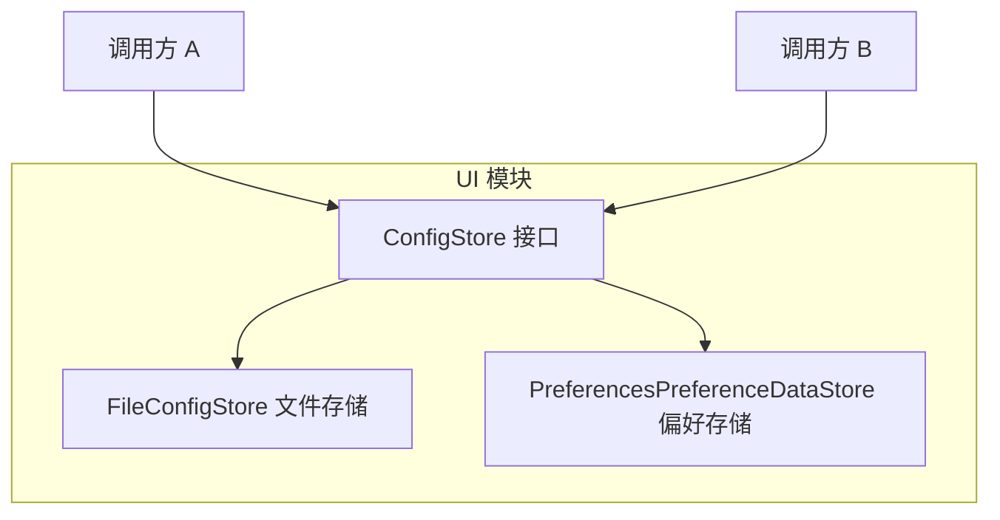
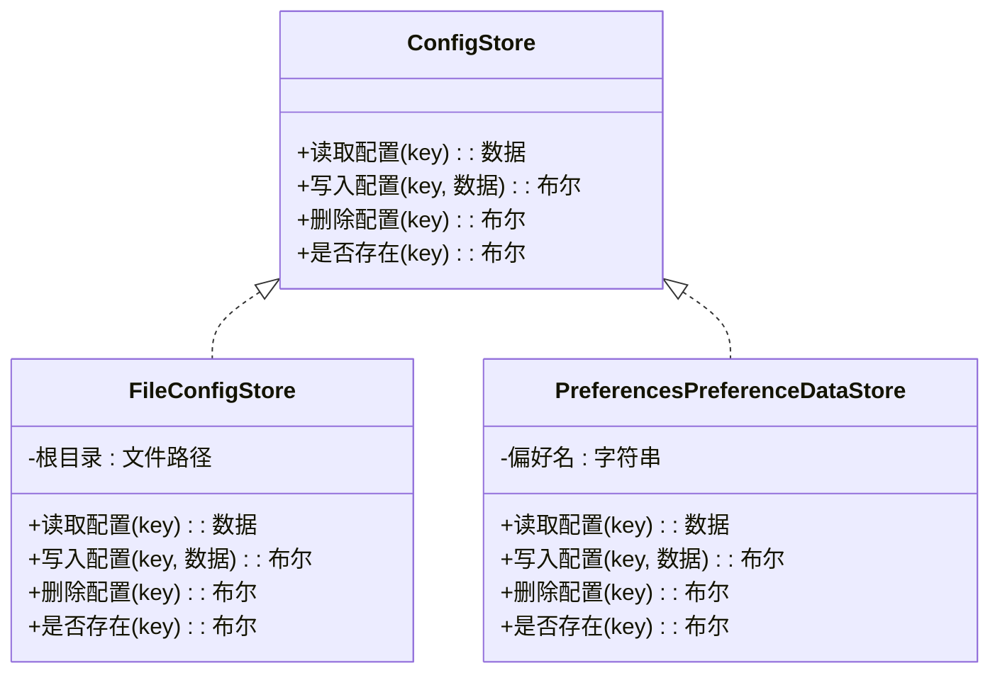
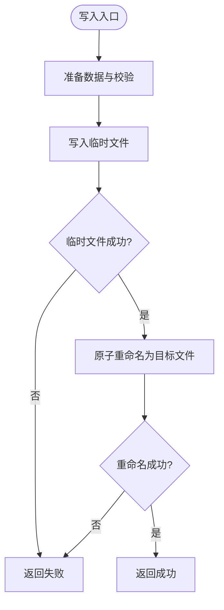
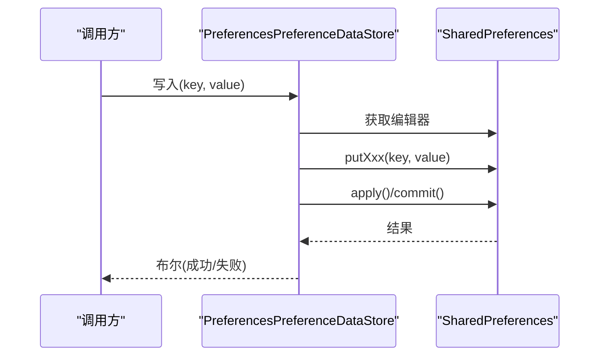
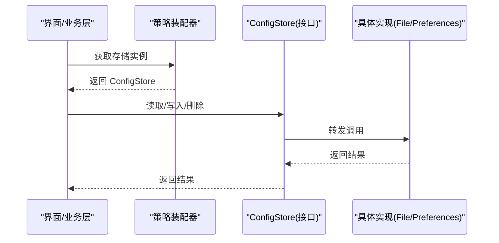
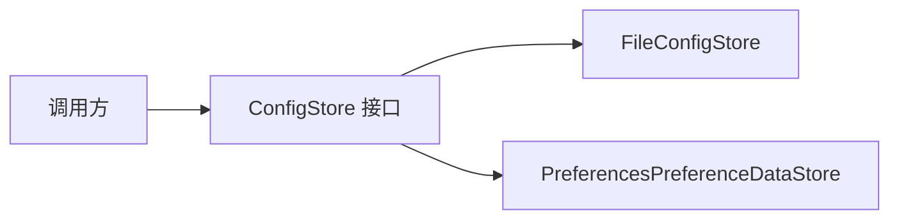

# 策略模式应用

<cite>
**本文引用的文件**   
- [ConfigStore.kt](file://ui/src/main/java/com/wireguard/android/configStore/ConfigStore.kt)
- [FileConfigStore.kt](file://ui/src/main/java/com/wireguard/android/configStore/FileConfigStore.kt)
- [PreferencesPreferenceDataStore.kt](file://ui/src/main/java/com/wireguard/android/preference/PreferencesPreferenceDataStore.kt)
</cite>

## 目录
1. [简介](#简介)
2. [项目结构](#项目结构)
3. [核心组件](#核心组件)
4. [架构总览](#架构总览)
5. [详细组件分析](#详细组件分析)
6. [依赖分析](#依赖分析)
7. [性能考量](#性能考量)
8. [故障排查指南](#故障排查指南)
9. [结论](#结论)
10. [附录](#附录)

## 简介
本文件聚焦 WireGuard Android 项目中“策略模式”在配置存储层的应用。通过定义统一的 ConfigStore 接口，将“如何持久化隧道配置”的具体实现与上层业务解耦，从而支持在不同存储后端之间灵活切换（如文件系统、Android SharedPreferences）。文档将详细说明接口设计、两种具体策略（文件存储与偏好设置存储）的实现要点、适用场景与性能特点，并给出扩展新存储后端的步骤与示例路径。

## 项目结构
与策略模式相关的代码位于 ui 模块的 configStore 与 preference 包中：
- configStore 包：定义配置存储抽象与默认的文件实现
- preference 包：提供基于 Android Preferences 的数据存储适配

图表来源 
- [ConfigStore.kt](file://ui/src/main/java/com/wireguard/android/configStore/ConfigStore.kt)
- [FileConfigStore.kt](file://ui/src/main/java/com/wireguard/android/configStore/FileConfigStore.kt)
- [PreferencesPreferenceDataStore.kt](file://ui/src/main/java/com/wireguard/android/preference/PreferencesPreferenceDataStore.kt)

章节来源
- [ConfigStore.kt](file://ui/src/main/java/com/wireguard/android/configStore/ConfigStore.kt)
- [FileConfigStore.kt](file://ui/src/main/java/com/wireguard/android/configStore/FileConfigStore.kt)
- [PreferencesPreferenceDataStore.kt](file://ui/src/main/java/com/wireguard/android/preference/PreferencesPreferenceDataStore.kt)

## 核心组件
- ConfigStore 接口：定义配置读取、写入、删除等统一操作契约，屏蔽底层存储差异
- FileConfigStore：以文件系统为后端，适合大对象或结构化配置的持久化
- PreferencesPreferenceDataStore：以 Android SharedPreferences 为后端，适合轻量键值对配置

章节来源
- [ConfigStore.kt](file://ui/src/main/java/com/wireguard/android/configStore/ConfigStore.kt)
- [FileConfigStore.kt](file://ui/src/main/java/com/wireguard/android/configStore/FileConfigStore.kt)
- [PreferencesPreferenceDataStore.kt](file://ui/src/main/java/com/wireguard/android/preference/PreferencesPreferenceDataStore.kt)

## 架构总览
策略模式在此处的体现是：上层仅依赖 ConfigStore 接口，运行时根据环境或配置选择具体实现（文件存储或偏好存储），从而实现“同接口、多实现”的灵活替换。

图表来源 
- [ConfigStore.kt](file://ui/src/main/java/com/wireguard/android/configStore/ConfigStore.kt)
- [FileConfigStore.kt](file://ui/src/main/java/com/wireguard/android/configStore/FileConfigStore.kt)
- [PreferencesPreferenceDataStore.kt](file://ui/src/main/java/com/wireguard/android/preference/PreferencesPreferenceDataStore.kt)

## 详细组件分析

### 接口设计：ConfigStore
- 目标：为所有配置存储提供一致的操作契约
- 典型方法：读取、写入、删除、存在性检查
- 设计要点：
  - 方法签名尽量简单明确，避免暴露底层细节
  - 错误处理采用异常或返回码，由调用方统一处理
  - 线程模型：建议对外提供同步接口，内部可异步落盘（如需）

章节来源
- [ConfigStore.kt](file://ui/src/main/java/com/wireguard/android/configStore/ConfigStore.kt)

### 文件存储策略：FileConfigStore
- 适用场景：
  - 配置体积较大（如完整隧道配置文件）
  - 需要跨进程共享或外部工具可读写的场景
  - 需要版本化或迁移时便于备份/对比
- 性能特点：
  - 读写涉及 I/O，延迟高于内存/SharedPreferences
  - 可通过缓冲、批量写入优化吞吐
  - 并发写需加锁或原子替换，避免损坏
- 关键实现点：
  - 文件命名与目录组织（按 key 映射到文件名）
  - 序列化/反序列化（文本或二进制）
  - 失败回滚与幂等写入（先写临时文件再原子替换）

图表来源 
- [FileConfigStore.kt](file://ui/src/main/java/com/wireguard/android/configStore/FileConfigStore.kt)

章节来源
- [FileConfigStore.kt](file://ui/src/main/java/com/wireguard/android/configStore/FileConfigStore.kt)

### 偏好设置存储策略：PreferencesPreferenceDataStore
- 适用场景：
  - 轻量键值配置（开关、小段文本、ID 等）
  - 与系统设置一致的访问方式，生命周期与 App 绑定
- 性能特点：
  - 读快写慢（写会触发持久化），频繁写入应合并或使用事务
  - 不适合大对象或复杂结构
- 关键实现点：
  - 类型安全封装（String/Int/Boolean/Long 等）
  - 默认值与缺失键处理
  - 提交策略（commit vs apply）与错误处理

图表来源 
- [PreferencesPreferenceDataStore.kt](file://ui/src/main/java/com/wireguard/android/preference/PreferencesPreferenceDataStore.kt)

章节来源
- [PreferencesPreferenceDataStore.kt](file://ui/src/main/java/com/wireguard/android/preference/PreferencesPreferenceDataStore.kt)

### 策略选择与执行流程
- 选择策略：
  - 启动时根据构建变体、用户设置或设备能力决定使用 FileConfigStore 还是 PreferencesPreferenceDataStore
  - 也可通过工厂/依赖注入容器装配具体实现
- 执行流程：
  - 调用方仅依赖 ConfigStore 接口
  - 运行时调用被转发到具体策略实现
  - 错误由具体实现抛出或返回，调用方统一处理

[此图为概念流程图，不直接映射具体源码文件]

## 依赖分析
- 松耦合：调用方只依赖 ConfigStore 接口，降低与具体实现的耦合度
- 内聚性：每个实现类职责单一，专注一种存储介质
- 可扩展性：新增存储后端只需实现接口，无需修改既有调用方

图表来源 
- [ConfigStore.kt](file://ui/src/main/java/com/wireguard/android/configStore/ConfigStore.kt)
- [FileConfigStore.kt](file://ui/src/main/java/com/wireguard/android/configStore/FileConfigStore.kt)
- [PreferencesPreferenceDataStore.kt](file://ui/src/main/java/com/wireguard/android/preference/PreferencesPreferenceDataStore.kt)

章节来源
- [ConfigStore.kt](file://ui/src/main/java/com/wireguard/android/configStore/ConfigStore.kt)
- [FileConfigStore.kt](file://ui/src/main/java/com/wireguard/android/configStore/FileConfigStore.kt)
- [PreferencesPreferenceDataStore.kt](file://ui/src/main/java/com/wireguard/android/preference/PreferencesPreferenceDataStore.kt)

## 性能考量
- 文件存储
  - 优点：容量大、可移植性强、易备份
  - 缺点：I/O 开销高，需关注并发与原子性
  - 优化：批量写入、缓存热点键、异步落盘
- 偏好设置存储
  - 优点：API 简洁、读性能较好
  - 缺点：写性能一般，不适合大对象
  - 优化：合并多次写入、避免在主线程频繁 commit

[本节为通用指导，不直接分析具体文件]

## 故障排查指南
- 常见问题
  - 权限不足：文件存储需确保目录可写；偏好设置通常无额外权限问题
  - 数据损坏：文件写入未原子化导致半写状态；偏好设置写入冲突
  - 性能抖动：频繁写入造成卡顿；大对象导致 I/O 阻塞
- 定位思路
  - 增加日志记录 key、大小、耗时
  - 对文件写入采用“先写临时再原子替换”的策略
  - 对偏好设置使用 apply 并在必要时降级为 commit
- 恢复策略
  - 文件：保留备份与回滚机制
  - 偏好设置：提供默认值与重置入口

章节来源
- [FileConfigStore.kt](file://ui/src/main/java/com/wireguard/android/configStore/FileConfigStore.kt)
- [PreferencesPreferenceDataStore.kt](file://ui/src/main/java/com/wireguard/android/preference/PreferencesPreferenceDataStore.kt)

## 结论
通过策略模式，WireGuard Android 将配置存储的“变化点”从调用方中抽离出来，形成清晰的接口边界与多种实现。这使得在不同运行环境与需求下，能够以最小改动切换或扩展存储后端，提升系统的可维护性与可扩展性。

## 附录
- 扩展新存储后端的步骤
  1. 新建类实现 ConfigStore 接口
  2. 实现读取、写入、删除、存在性检查等方法
  3. 在装配层注册新实现，并按条件选择
  4. 编写单元测试覆盖正常与异常路径
- 参考路径
  - 接口定义：[ConfigStore.kt](file://ui/src/main/java/com/wireguard/android/configStore/ConfigStore.kt)
  - 文件实现：[FileConfigStore.kt](file://ui/src/main/java/com/wireguard/android/configStore/FileConfigStore.kt)
  - 偏好实现：[PreferencesPreferenceDataStore.kt](file://ui/src/main/java/com/wireguard/android/preference/PreferencesPreferenceDataStore.kt)