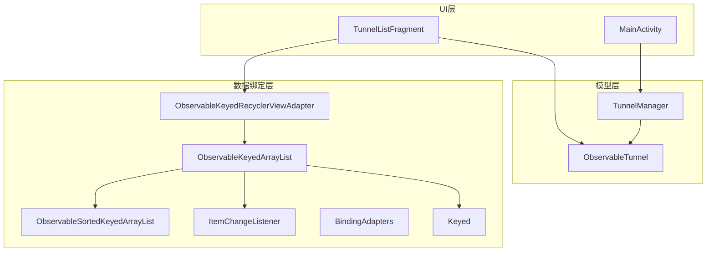
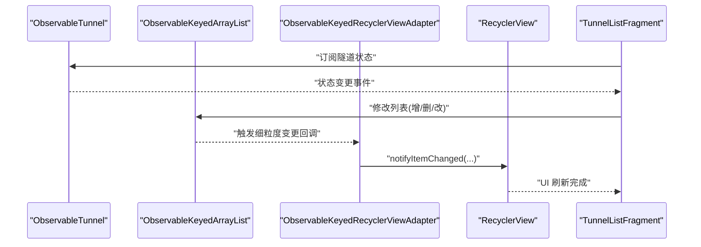
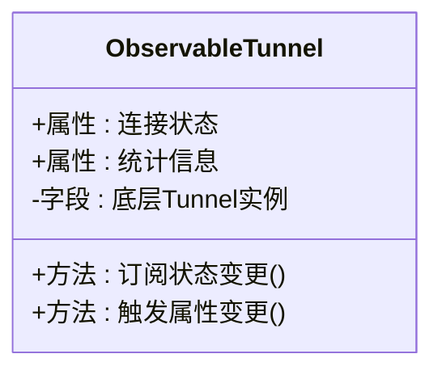
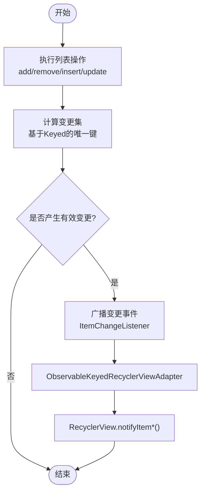
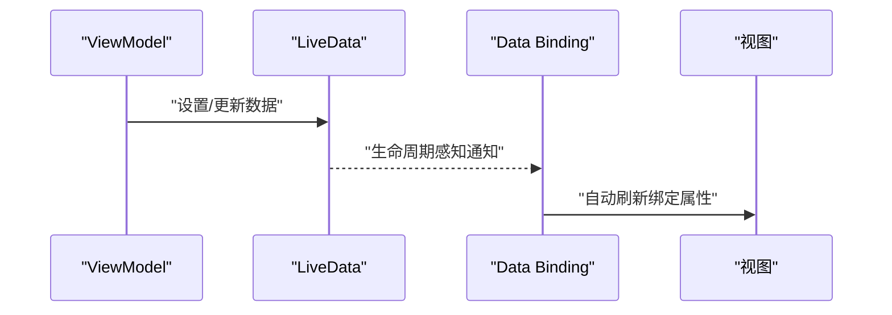
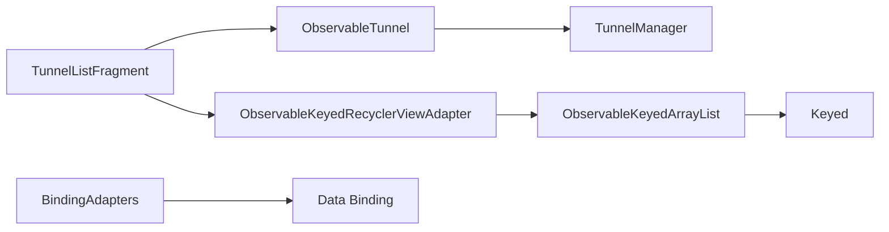

# 观察者模式实现

<cite>
**本文引用的文件**
- [ObservableTunnel.kt](file://ui/src/main/java/com/wireguard/android/model/ObservableTunnel.kt)
- [ItemChangeListener.kt](file://ui/src/main/java/com/wireguard/android/databinding/ItemChangeListener.kt)
- [ObservableKeyedArrayList.kt](file://ui/src/main/java/com/wireguard/android/databinding/ObservableKeyedArrayList.kt)
- [ObservableSortedKeyedArrayList.kt](file://ui/src/main/java/com/wireguard/android/databinding/ObservableSortedKeyedArrayList.kt)
- [ObservableKeyedRecyclerViewAdapter.kt](file://ui/src/main/java/com/wireguard/android/databinding/ObservableKeyedRecyclerViewAdapter.kt)
- [BindingAdapters.kt](file://ui/src/main/java/com/wireguard/android/databinding/BindingAdapters.kt)
- [Keyed.kt](file://ui/src/main/java/com/wireguard/android/databinding/Keyed.kt)
- [TunnelManager.kt](file://ui/src/main/java/com/wireguard/android/model/TunnelManager.kt)
- [MainActivity.kt](file://ui/src/main/java/com/wireguard/android/activity/MainActivity.kt)
- [TunnelListFragment.kt](file://ui/src/main/java/com/wireguard/android/fragment/TunnelListFragment.kt)
</cite>

## 目录
1. [简介](#简介)
2. [项目结构](#项目结构)
3. [核心组件](#核心组件)
4. [架构总览](#架构总览)
5. [详细组件分析](#详细组件分析)
6. [依赖关系分析](#依赖关系分析)
7. [性能考虑](#性能考虑)
8. [故障排查指南](#故障排查指南)
9. [结论](#结论)
10. [附录](#附录)

## 简介
本文件聚焦 WireGuard Android 项目中观察者模式的实现，重点说明：
- ObservableTunnel 如何实现可观察的隧道状态管理以及数据变更通知机制。
- ObservableKeyedArrayList 与 ItemChangeListener 在列表数据绑定中的作用。
- LiveData 与 Data Binding 框架中观察者模式的应用方式。
- 如何构建高效的 UI 更新与数据同步机制，并给出具体使用示例路径。

## 项目结构
围绕观察者模式的相关代码主要分布在 ui 模块的 databinding 与 model 包下：
- databinding：提供可观察集合、适配器与数据绑定扩展，支撑 RecyclerView 高效刷新与双向绑定。
- model：封装隧道模型与管理器，暴露可观察状态供 UI 订阅。

图表来源
- [TunnelListFragment.kt](file://ui/src/main/java/com/wireguard/android/fragment/TunnelListFragment.kt)
- [ObservableKeyedArrayList.kt](file://ui/src/main/java/com/wireguard/android/databinding/ObservableKeyedArrayList.kt)
- [ObservableSortedKeyedArrayList.kt](file://ui/src/main/java/com/wireguard/android/databinding/ObservableSortedKeyedArrayList.kt)
- [ObservableKeyedRecyclerViewAdapter.kt](file://ui/src/main/java/com/wireguard/android/databinding/ObservableKeyedRecyclerViewAdapter.kt)
- [ItemChangeListener.kt](file://ui/src/main/java/com/wireguard/android/databinding/ItemChangeListener.kt)
- [BindingAdapters.kt](file://ui/src/main/java/com/wireguard/android/databinding/BindingAdapters.kt)
- [Keyed.kt](file://ui/src/main/java/com/wireguard/android/databinding/Keyed.kt)
- [ObservableTunnel.kt](file://ui/src/main/java/com/wireguard/android/model/ObservableTunnel.kt)
- [TunnelManager.kt](file://ui/src/main/java/com/wireguard/android/model/TunnelManager.kt)
- [MainActivity.kt](file://ui/src/main/java/com/wireguard/android/activity/MainActivity.kt)

章节来源
- [TunnelListFragment.kt](file://ui/src/main/java/com/wireguard/android/fragment/TunnelListFragment.kt)
- [ObservableKeyedArrayList.kt](file://ui/src/main/java/com/wireguard/android/databinding/ObservableKeyedArrayList.kt)
- [ObservableSortedKeyedArrayList.kt](file://ui/src/main/java/com/wireguard/android/databinding/ObservableSortedKeyedArrayList.kt)
- [ObservableKeyedRecyclerViewAdapter.kt](file://ui/src/main/java/com/wireguard/android/databinding/ObservableKeyedRecyclerViewAdapter.kt)
- [ItemChangeListener.kt](file://ui/src/main/java/com/wireguard/android/databinding/ItemChangeListener.kt)
- [BindingAdapters.kt](file://ui/src/main/java/com/wireguard/android/databinding/BindingAdapters.kt)
- [Keyed.kt](file://ui/src/main/java/com/wireguard/android/databinding/Keyed.kt)
- [ObservableTunnel.kt](file://ui/src/main/java/com/wireguard/android/model/ObservableTunnel.kt)
- [TunnelManager.kt](file://ui/src/main/java/com/wireguard/android/model/TunnelManager.kt)
- [MainActivity.kt](file://ui/src/main/java/com/wireguard/android/activity/MainActivity.kt)

## 核心组件
- ObservableTunnel：将底层隧道状态包装为可观察对象，对外暴露属性变化事件，供 ViewModel/Fragment 订阅，驱动 UI 更新。
- ObservableKeyedArrayList：基于 Keyed 的可观察列表，支持按唯一键增删改查时触发细粒度变更回调，避免全量刷新。
- ObservableSortedKeyedArrayList：在有序场景下维护排序稳定性，并在元素变动时广播最小化变更集。
- ObservableKeyedRecyclerViewAdapter：与 Data Binding 协作，监听列表变更并调用 RecyclerView 的局部刷新 API（如 notifyItemChanged），提升性能。
- ItemChangeListener：定义列表项变更回调接口，用于在数据源变化时通知上层进行 UI 调整或业务处理。
- BindingAdapters：Data Binding 的自定义适配器，桥接 Kotlin/Java 属性与 XML 布局，使视图自动响应数据变化。
- Keyed：为列表项定义稳定唯一标识，确保 Diff 算法能精准定位变更位置。

章节来源
- [ObservableTunnel.kt](file://ui/src/main/java/com/wireguard/android/model/ObservableTunnel.kt)
- [ObservableKeyedArrayList.kt](file://ui/src/main/java/com/wireguard/android/databinding/ObservableKeyedArrayList.kt)
- [ObservableSortedKeyedArrayList.kt](file://ui/src/main/java/com/wireguard/android/databinding/ObservableSortedKeyedArrayList.kt)
- [ObservableKeyedRecyclerViewAdapter.kt](file://ui/src/main/java/com/wireguard/android/databinding/ObservableKeyedRecyclerViewAdapter.kt)
- [ItemChangeListener.kt](file://ui/src/main/java/com/wireguard/android/databinding/ItemChangeListener.kt)
- [BindingAdapters.kt](file://ui/src/main/java/com/wireguard/android/databinding/BindingAdapters.kt)
- [Keyed.kt](file://ui/src/main/java/com/wireguard/android/databinding/Keyed.kt)

## 架构总览
下图展示了从数据源到 UI 的完整观察者链：模型层通过可观察对象暴露状态，数据绑定层监听变更并驱动 RecyclerView 局部刷新，Fragment/Activity 作为订阅者消费状态变化。

图表来源
- [ObservableTunnel.kt](file://ui/src/main/java/com/wireguard/android/model/ObservableTunnel.kt)
- [ObservableKeyedArrayList.kt](file://ui/src/main/java/com/wireguard/android/databinding/ObservableKeyedArrayList.kt)
- [ObservableKeyedRecyclerViewAdapter.kt](file://ui/src/main/java/com/wireguard/android/databinding/ObservableKeyedRecyclerViewAdapter.kt)
- [TunnelListFragment.kt](file://ui/src/main/java/com/wireguard/android/fragment/TunnelListFragment.kt)

## 详细组件分析

### ObservableTunnel：可观察的隧道状态
- 设计要点
  - 将隧道状态属性暴露为可观察字段，内部持有底层 Tunnel 实例。
  - 当底层状态变化时，触发属性级变更事件，供 LiveData/Data Binding 订阅。
  - 提供统一的访问方法，保证线程安全与一致性。
- 典型用法
  - 在 Fragment/ViewModel 中订阅状态变化，更新界面显示（如连接状态、统计信息）。
  - 在配置变更时，重新计算并广播新状态，确保 UI 与后端一致。

图表来源
- [ObservableTunnel.kt](file://ui/src/main/java/com/wireguard/android/model/ObservableTunnel.kt)

章节来源
- [ObservableTunnel.kt](file://ui/src/main/java/com/wireguard/android/model/ObservableTunnel.kt)

### ObservableKeyedArrayList 与 ItemChangeListener：列表数据绑定
- 设计要点
  - 每个列表项实现 Keyed 接口，提供稳定唯一键，便于 Diff 算法定位变更。
  - 对 add/remove/insert/update 等操作进行拦截，生成最小化变更集。
  - ItemChangeListener 定义统一回调，供 Adapter 与上层逻辑消费。
- 典型用法
  - 在 ViewModel 中维护列表数据，操作后自动通知 Adapter。
  - Adapter 接收变更并调用 RecyclerView 的局部刷新 API，减少重绘开销。

图表来源
- [ObservableKeyedArrayList.kt](file://ui/src/main/java/com/wireguard/android/databinding/ObservableKeyedArrayList.kt)
- [ObservableSortedKeyedArrayList.kt](file://ui/src/main/java/com/wireguard/android/databinding/ObservableSortedKeyedArrayList.kt)
- [ObservableKeyedRecyclerViewAdapter.kt](file://ui/src/main/java/com/wireguard/android/databinding/ObservableKeyedRecyclerViewAdapter.kt)
- [ItemChangeListener.kt](file://ui/src/main/java/com/wireguard/android/databinding/ItemChangeListener.kt)
- [Keyed.kt](file://ui/src/main/java/com/wireguard/android/databinding/Keyed.kt)

章节来源
- [ObservableKeyedArrayList.kt](file://ui/src/main/java/com/wireguard/android/databinding/ObservableKeyedArrayList.kt)
- [ObservableSortedKeyedArrayList.kt](file://ui/src/main/java/com/wireguard/android/databinding/ObservableSortedKeyedArrayList.kt)
- [ObservableKeyedRecyclerViewAdapter.kt](file://ui/src/main/java/com/wireguard/android/databinding/ObservableKeyedRecyclerViewAdapter.kt)
- [ItemChangeListener.kt](file://ui/src/main/java/com/wireguard/android/databinding/ItemChangeListener.kt)
- [Keyed.kt](file://ui/src/main/java/com/wireguard/android/databinding/Keyed.kt)

### LiveData 与 Data Binding 中的观察者模式
- LiveData
  - 以生命周期感知的方式持有可观察数据，仅在活跃状态下通知观察者。
  - 与 ViewModel 配合，避免内存泄漏与无效更新。
- Data Binding
  - 在 XML 中直接绑定属性，当数据变化时自动更新视图。
  - 通过 BindingAdapters 扩展自定义属性绑定逻辑，增强灵活性。

图表来源
- [BindingAdapters.kt](file://ui/src/main/java/com/wireguard/android/databinding/BindingAdapters.kt)

章节来源
- [BindingAdapters.kt](file://ui/src/main/java/com/wireguard/android/databinding/BindingAdapters.kt)

### 高效 UI 更新与数据同步机制
- 关键策略
  - 使用 Keyed 与 Diff 算法，仅刷新受影响条目。
  - 在后台线程处理耗时操作，主线程分发最小化变更。
  - 合并频繁变更，减少不必要的刷新。
- 实践建议
  - 在列表操作中批量提交变更，降低回调频率。
  - 避免在 onBindViewHolder 中进行复杂计算，提前准备数据。

章节来源
- [ObservableKeyedArrayList.kt](file://ui/src/main/java/com/wireguard/android/databinding/ObservableKeyedArrayList.kt)
- [ObservableKeyedRecyclerViewAdapter.kt](file://ui/src/main/java/com/wireguard/android/databinding/ObservableKeyedRecyclerViewAdapter.kt)

## 依赖关系分析
- ObservableTunnel 依赖底层 Tunnel 状态，向上传递可观察事件。
- ObservableKeyedArrayList 依赖 Keyed 接口，确保列表项唯一性。
- ObservableKeyedRecyclerViewAdapter 依赖列表变更事件，驱动 RecyclerView 局部刷新。
- BindingAdapters 依赖 Data Binding 框架，桥接属性与视图。

图表来源
- [ObservableTunnel.kt](file://ui/src/main/java/com/wireguard/android/model/ObservableTunnel.kt)
- [TunnelManager.kt](file://ui/src/main/java/com/wireguard/android/model/TunnelManager.kt)
- [ObservableKeyedArrayList.kt](file://ui/src/main/java/com/wireguard/android/databinding/ObservableKeyedArrayList.kt)
- [ObservableKeyedRecyclerViewAdapter.kt](file://ui/src/main/java/com/wireguard/android/databinding/ObservableKeyedRecyclerViewAdapter.kt)
- [BindingAdapters.kt](file://ui/src/main/java/com/wireguard/android/databinding/BindingAdapters.kt)
- [TunnelListFragment.kt](file://ui/src/main/java/com/wireguard/android/fragment/TunnelListFragment.kt)

章节来源
- [ObservableTunnel.kt](file://ui/src/main/java/com/wireguard/android/model/ObservableTunnel.kt)
- [TunnelManager.kt](file://ui/src/main/java/com/wireguard/android/model/TunnelManager.kt)
- [ObservableKeyedArrayList.kt](file://ui/src/main/java/com/wireguard/android/databinding/ObservableKeyedArrayList.kt)
- [ObservableKeyedRecyclerViewAdapter.kt](file://ui/src/main/java/com/wireguard/android/databinding/ObservableKeyedRecyclerViewAdapter.kt)
- [BindingAdapters.kt](file://ui/src/main/java/com/wireguard/android/databinding/BindingAdapters.kt)
- [TunnelListFragment.kt](file://ui/src/main/java/com/wireguard/android/fragment/TunnelListFragment.kt)

## 性能考虑
- 使用 Keyed 与 Diff 算法，避免全量刷新。
- 合并高频变更，减少 UI 抖动。
- 在后台线程处理数据转换，主线程仅分发最小化变更。
- 合理拆分列表项，避免单条数据过大导致渲染缓慢。

[本节为通用指导，不直接分析具体文件]

## 故障排查指南
- 常见问题
  - 列表未刷新：检查 Keyed 唯一性是否正确，确认变更事件是否被正确广播。
  - UI 卡顿：检查是否在 onBindViewHolder 中进行耗时操作，优化数据准备逻辑。
  - 内存泄漏：确认 LiveData 订阅在合适的生命周期内取消。
- 调试建议
  - 打印变更事件日志，定位问题环节。
  - 使用 Android Profiler 分析 UI 刷新热点。

章节来源
- [ObservableKeyedArrayList.kt](file://ui/src/main/java/com/wireguard/android/databinding/ObservableKeyedArrayList.kt)
- [ObservableKeyedRecyclerViewAdapter.kt](file://ui/src/main/java/com/wireguard/android/databinding/ObservableKeyedRecyclerViewAdapter.kt)
- [BindingAdapters.kt](file://ui/src/main/java/com/wireguard/android/databinding/BindingAdapters.kt)

## 结论
通过 ObservableTunnel、ObservableKeyedArrayList、ItemChangeListener 与 Data Binding 的协同，WireGuard Android 实现了高效、可维护的观察者模式架构。该架构确保了隧道状态与 UI 的一致性，同时通过细粒度刷新与生命周期感知，提升了性能与用户体验。

[本节为总结性内容，不直接分析具体文件]

## 附录
- 使用示例路径
  - 隧道状态监控：参考 [ObservableTunnel.kt](file://ui/src/main/java/com/wireguard/android/model/ObservableTunnel.kt)
  - 列表数据绑定：参考 [ObservableKeyedArrayList.kt](file://ui/src/main/java/com/wireguard/android/databinding/ObservableKeyedArrayList.kt)、[ObservableKeyedRecyclerViewAdapter.kt](file://ui/src/main/java/com/wireguard/android/databinding/ObservableKeyedRecyclerViewAdapter.kt)
  - 配置变更通知：参考 [TunnelManager.kt](file://ui/src/main/java/com/wireguard/android/model/TunnelManager.kt)
  - UI 订阅与展示：参考 [TunnelListFragment.kt](file://ui/src/main/java/com/wireguard/android/fragment/TunnelListFragment.kt)、[MainActivity.kt](file://ui/src/main/java/com/wireguard/android/activity/MainActivity.kt)