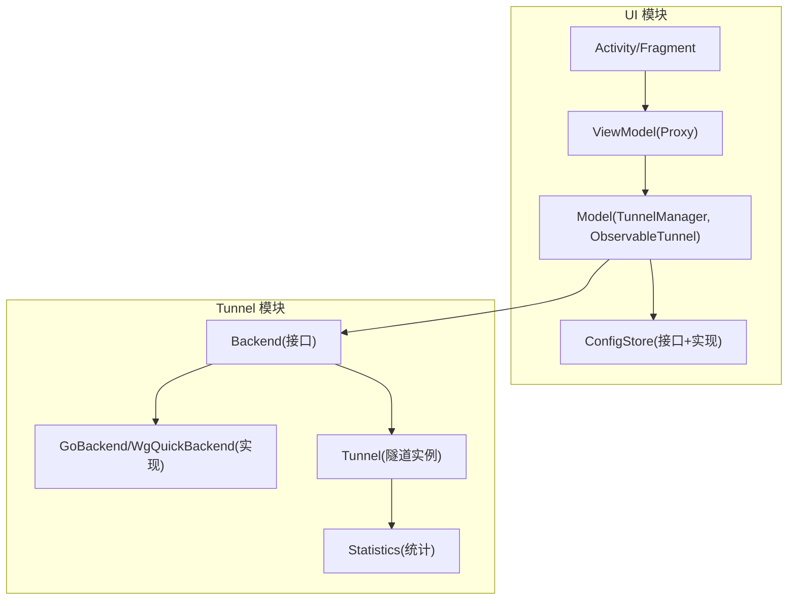
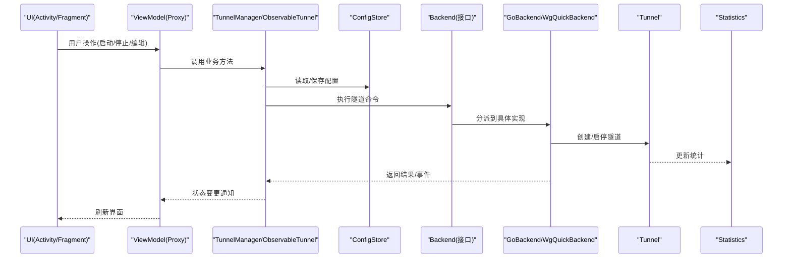
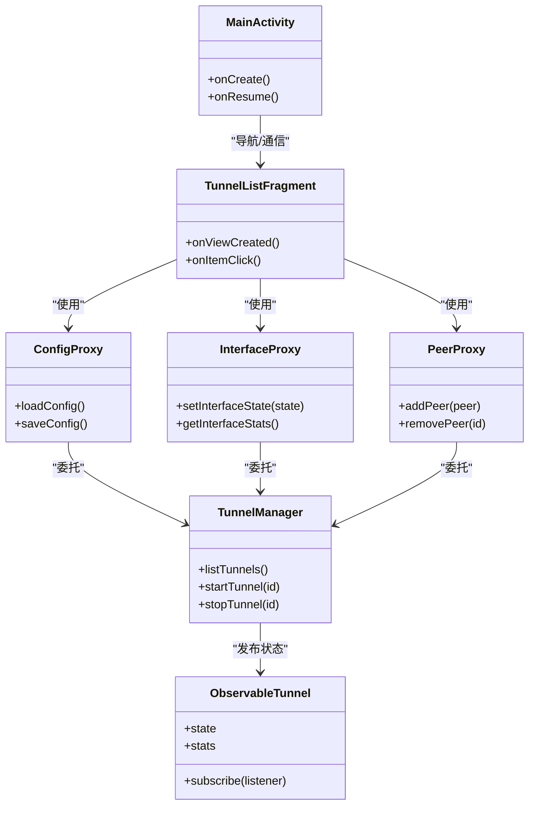
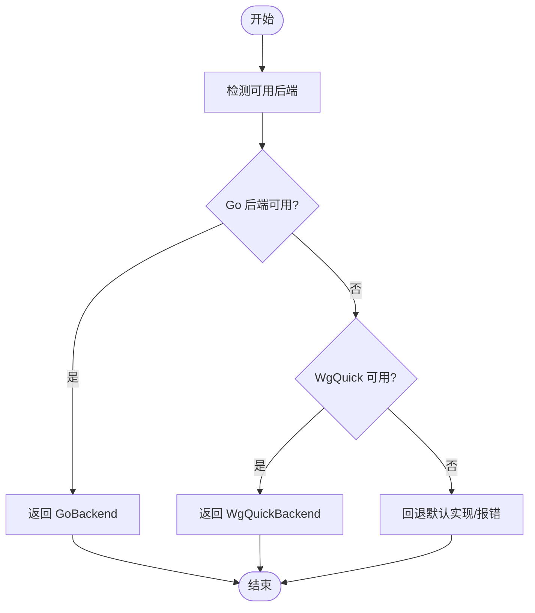
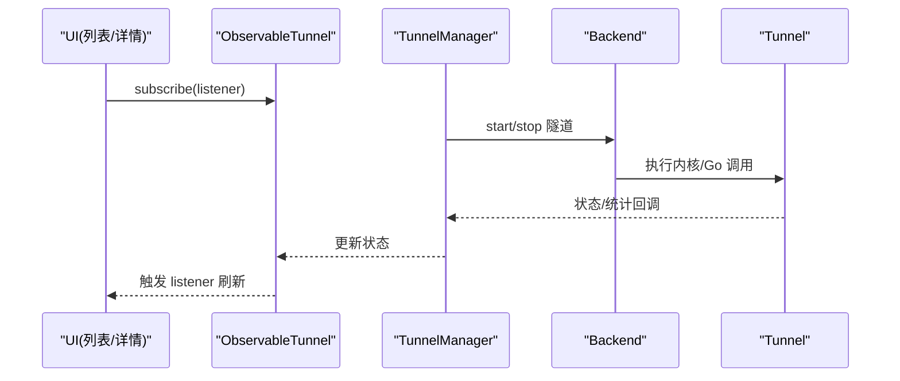
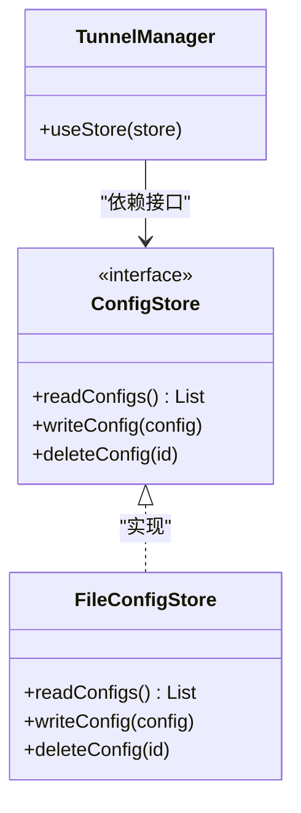
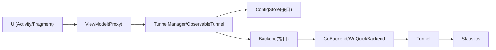

# 设计模式应用

<cite>
**本文引用的文件**   
- [Backend.java](file://tunnel/src/main/java/com/wireguard/android/backend/Backend.java)
- [GoBackend.java](file://tunnel/src/main/java/com/wireguard/android/backend/GoBackend.java)
- [WgQuickBackend.java](file://tunnel/src/main/java/com/wireguard/android/backend/WgQuickBackend.java)
- [Tunnel.java](file://tunnel/src/main/java/com/wireguard/android/backend/Tunnel.java)
- [Statistics.java](file://tunnel/src/main/java/com/wireguard/android/backend/Statistics.java)
- [ConfigStore.kt](file://ui/src/main/java/com/wireguard/android/configStore/ConfigStore.kt)
- [FileConfigStore.kt](file://ui/src/main/java/com/wireguard/android/configStore/FileConfigStore.kt)
- [TunnelManager.kt](file://ui/src/main/java/com/wireguard/android/model/TunnelManager.kt)
- [ObservableTunnel.kt](file://ui/src/main/java/com/wireguard/android/model/ObservableTunnel.kt)
- [BaseActivity.kt](file://ui/src/main/java/com/wireguard/android/activity/BaseActivity.kt)
- [MainActivity.kt](file://ui/src/main/java/com/wireguard/android/activity/MainActivity.kt)
- [TunnelListFragment.kt](file://ui/src/main/java/com/wireguard/android/fragment/TunnelListFragment.kt)
- [TunnelDetailFragment.kt](file://ui/src/main/java/com/wireguard/android/fragment/TunnelDetailFragment.kt)
- [TunnelEditorFragment.kt](file://ui/src/main/java/com/wireguard/android/fragment/TunnelEditorFragment.kt)
- [ConfigProxy.kt](file://ui/src/main/java/com/wireguard/android/viewmodel/ConfigProxy.kt)
- [InterfaceProxy.kt](file://ui/src/main/java/com/wireguard/android/viewmodel/InterfaceProxy.kt)
- [PeerProxy.kt](file://ui/src/main/java/com/wireguard/android/viewmodel/PeerProxy.kt)
- [RootShell.java](file://tunnel/src/main/java/com/wireguard/android/util/RootShell.java)
- [SharedLibraryLoader.java](file://tunnel/src/main/java/com/wireguard/android/util/SharedLibraryLoader.java)
- [ToolsInstaller.java](file://tunnel/src/main/java/com/wireguard/android/util/ToolsInstaller.java)
</cite>

## 目录
1. [简介](#简介)
2. [项目结构](#项目结构)
3. [核心组件](#核心组件)
4. [架构总览](#架构总览)
5. [详细组件分析](#详细组件分析)
6. [依赖关系分析](#依赖关系分析)
7. [性能考量](#性能考量)
8. [故障排查指南](#故障排查指南)
9. [结论](#结论)
10. [附录](#附录)

## 简介
本文件聚焦 WireGuard Android 项目中各类设计模式的实际应用，包括 MVVM、工厂模式、观察者模式、策略模式和单例模式等。文档将结合后端选择器与配置存储抽象，解释这些模式如何解耦 UI 与底层实现、提升可维护性与可扩展性，并给出关键流程的时序图与类图，帮助读者快速理解代码结构与职责边界。

## 项目结构
项目采用多模块组织：
- tunnel 模块：封装与系统内核/Go 后端的交互，提供统一的隧道控制接口与统计信息。
- ui 模块：基于 Kotlin 的 MVVM 界面层，包含 Activity、Fragment、ViewModel（以 Proxy 命名）、数据绑定与偏好设置等。

图表来源
- [MainActivity.kt:1-200](file://ui/src/main/java/com/wireguard/android/activity/MainActivity.kt#L1-L200)
- [TunnelListFragment.kt:1-200](file://ui/src/main/java/com/wireguard/android/fragment/TunnelListFragment.kt#L1-L200)
- [TunnelManager.kt:1-200](file://ui/src/main/java/com/wireguard/android/model/TunnelManager.kt#L1-L200)
- [ConfigStore.kt:1-200](file://ui/src/main/java/com/wireguard/android/configStore/ConfigStore.kt#L1-L200)
- [Backend.java:1-200](file://tunnel/src/main/java/com/wireguard/android/backend/Backend.java#L1-L200)
- [GoBackend.java:1-200](file://tunnel/src/main/java/com/wireguard/android/backend/GoBackend.java#L1-L200)
- [WgQuickBackend.java:1-200](file://tunnel/src/main/java/com/wireguard/android/backend/WgQuickBackend.java#L1-L200)
- [Tunnel.java:1-200](file://tunnel/src/main/java/com/wireguard/android/backend/Tunnel.java#L1-L200)
- [Statistics.java:1-200](file://tunnel/src/main/java/com/wireguard/android/backend/Statistics.java#L1-L200)

章节来源
- [MainActivity.kt:1-200](file://ui/src/main/java/com/wireguard/android/activity/MainActivity.kt#L1-L200)
- [TunnelListFragment.kt:1-200](file://ui/src/main/java/com/wireguard/android/fragment/TunnelListFragment.kt#L1-L200)
- [TunnelManager.kt:1-200](file://ui/src/main/java/com/wireguard/android/model/TunnelManager.kt#L1-L200)
- [ConfigStore.kt:1-200](file://ui/src/main/java/com/wireguard/android/configStore/ConfigStore.kt#L1-L200)
- [Backend.java:1-200](file://tunnel/src/main/java/com/wireguard/android/backend/Backend.java#L1-L200)
- [GoBackend.java:1-200](file://tunnel/src/main/java/com/wireguard/android/backend/GoBackend.java#L1-L200)
- [WgQuickBackend.java:1-200](file://tunnel/src/main/java/com/wireguard/android/backend/WgQuickBackend.java#L1-L200)
- [Tunnel.java:1-200](file://tunnel/src/main/java/com/wireguard/android/backend/Tunnel.java#L1-L200)
- [Statistics.java:1-200](file://tunnel/src/main/java/com/wireguard/android/backend/Statistics.java#L1-L200)

## 核心组件
- 后端抽象与实现：通过 Backend 接口统一封装 Go/WgQuick 等不同后端能力；Tunnel 表示具体隧道实例；Statistics 提供流量统计。
- 配置存储抽象：ConfigStore 定义配置的读写契约，FileConfigStore 提供基于文件的持久化实现。
- 模型与状态：TunnelManager 管理隧道集合与生命周期；ObservableTunnel 暴露可观察的状态变化供 UI 订阅。
- ViewModel（Proxy）：ConfigProxy/InterfaceProxy/PeerProxy 作为 UI 与业务逻辑之间的适配层，屏蔽底层差异。

章节来源
- [Backend.java:1-200](file://tunnel/src/main/java/com/wireguard/android/backend/Backend.java#L1-L200)
- [GoBackend.java:1-200](file://tunnel/src/main/java/com/wireguard/android/backend/GoBackend.java#L1-L200)
- [WgQuickBackend.java:1-200](file://tunnel/src/main/java/com/wireguard/android/backend/WgQuickBackend.java#L1-L200)
- [Tunnel.java:1-200](file://tunnel/src/main/java/com/wireguard/android/backend/Tunnel.java#L1-L200)
- [Statistics.java:1-200](file://tunnel/src/main/java/com/wireguard/android/backend/Statistics.java#L1-L200)
- [ConfigStore.kt:1-200](file://ui/src/main/java/com/wireguard/android/configStore/ConfigStore.kt#L1-L200)
- [FileConfigStore.kt:1-200](file://ui/src/main/java/com/wireguard/android/configStore/FileConfigStore.kt#L1-L200)
- [TunnelManager.kt:1-200](file://ui/src/main/java/com/wireguard/android/model/TunnelManager.kt#L1-L200)
- [ObservableTunnel.kt:1-200](file://ui/src/main/java/com/wireguard/android/model/ObservableTunnel.kt#L1-L200)
- [ConfigProxy.kt:1-200](file://ui/src/main/java/com/wireguard/android/viewmodel/ConfigProxy.kt#L1-L200)
- [InterfaceProxy.kt:1-200](file://ui/src/main/java/com/wireguard/android/viewmodel/InterfaceProxy.kt#L1-L200)
- [PeerProxy.kt:1-200](file://ui/src/main/java/com/wireguard/android/viewmodel/PeerProxy.kt#L1-L200)

## 架构总览
整体采用分层架构：UI 层通过 ViewModel（Proxy）访问 Model 层，Model 层通过 ConfigStore 进行持久化，并通过 Backend 抽象调用 Tunnel 模块的具体后端实现。该结构清晰分离关注点，便于替换后端与存储实现。

图表来源
- [MainActivity.kt:1-200](file://ui/src/main/java/com/wireguard/android/activity/MainActivity.kt#L1-L200)
- [TunnelListFragment.kt:1-200](file://ui/src/main/java/com/wireguard/android/fragment/TunnelListFragment.kt#L1-L200)
- [TunnelManager.kt:1-200](file://ui/src/main/java/com/wireguard/android/model/TunnelManager.kt#L1-L200)
- [ConfigStore.kt:1-200](file://ui/src/main/java/com/wireguard/android/configStore/ConfigStore.kt#L1-L200)
- [Backend.java:1-200](file://tunnel/src/main/java/com/wireguard/android/backend/Backend.java#L1-L200)
- [GoBackend.java:1-200](file://tunnel/src/main/java/com/wireguard/android/backend/GoBackend.java#L1-L200)
- [WgQuickBackend.java:1-200](file://tunnel/src/main/java/com/wireguard/android/backend/WgQuickBackend.java#L1-L200)
- [Tunnel.java:1-200](file://tunnel/src/main/java/com/wireguard/android/backend/Tunnel.java#L1-L200)
- [Statistics.java:1-200](file://tunnel/src/main/java/com/wireguard/android/backend/Statistics.java#L1-L200)

## 详细组件分析

### MVVM 模式（Activity/Fragment + ViewModel + Model）
- 角色划分
  - View：Activity/Fragment 负责展示与用户交互。
  - ViewModel（Proxy）：ConfigProxy/InterfaceProxy/PeerProxy 聚合业务调用，屏蔽底层差异，向 UI 暴露稳定 API。
  - Model：TunnelManager 管理隧道集合与生命周期；ObservableTunnel 提供可观察状态。
- 数据流
  - UI 触发操作 -> ViewModel 调用 Model -> Model 通过 ConfigStore 读写配置 -> 通过 Backend 调用 Tunnel -> 状态回传 -> UI 更新。
- 优势
  - 解耦 UI 与业务逻辑，便于测试与复用。
  - 通过可观察对象驱动 UI 自动刷新。

图表来源
- [MainActivity.kt:1-200](file://ui/src/main/java/com/wireguard/android/activity/MainActivity.kt#L1-L200)
- [TunnelListFragment.kt:1-200](file://ui/src/main/java/com/wireguard/android/fragment/TunnelListFragment.kt#L1-L200)
- [ConfigProxy.kt:1-200](file://ui/src/main/java/com/wireguard/android/viewmodel/ConfigProxy.kt#L1-L200)
- [InterfaceProxy.kt:1-200](file://ui/src/main/java/com/wireguard/android/viewmodel/InterfaceProxy.kt#L1-L200)
- [PeerProxy.kt:1-200](file://ui/src/main/java/com/wireguard/android/viewmodel/PeerProxy.kt#L1-L200)
- [TunnelManager.kt:1-200](file://ui/src/main/java/com/wireguard/android/model/TunnelManager.kt#L1-L200)
- [ObservableTunnel.kt:1-200](file://ui/src/main/java/com/wireguard/android/model/ObservableTunnel.kt#L1-L200)

章节来源
- [MainActivity.kt:1-200](file://ui/src/main/java/com/wireguard/android/activity/MainActivity.kt#L1-L200)
- [TunnelListFragment.kt:1-200](file://ui/src/main/java/com/wireguard/android/fragment/TunnelListFragment.kt#L1-L200)
- [ConfigProxy.kt:1-200](file://ui/src/main/java/com/wireguard/android/viewmodel/ConfigProxy.kt#L1-L200)
- [InterfaceProxy.kt:1-200](file://ui/src/main/java/com/wireguard/android/viewmodel/InterfaceProxy.kt#L1-L200)
- [PeerProxy.kt:1-200](file://ui/src/main/java/com/wireguard/android/viewmodel/PeerProxy.kt#L1-L200)
- [TunnelManager.kt:1-200](file://ui/src/main/java/com/wireguard/android/model/TunnelManager.kt#L1-L200)
- [ObservableTunnel.kt:1-200](file://ui/src/main/java/com/wireguard/android/model/ObservableTunnel.kt#L1-L200)

### 工厂模式（后端选择器）
- 目标：根据运行环境或配置动态选择 GoBackend 或 WgQuickBackend，避免在调用处硬编码具体实现。
- 关键点
  - 定义统一的 Backend 接口。
  - 工厂方法依据条件（如特性检测、配置项）返回具体实现。
  - 上层仅依赖接口，降低耦合度。
- 典型流程
  - 初始化时调用工厂获取 Backend 实例。
  - 后续所有隧道操作通过该实例完成。

图表来源
- [Backend.java:1-200](file://tunnel/src/main/java/com/wireguard/android/backend/Backend.java#L1-L200)
- [GoBackend.java:1-200](file://tunnel/src/main/java/com/wireguard/android/backend/GoBackend.java#L1-L200)
- [WgQuickBackend.java:1-200](file://tunnel/src/main/java/com/wireguard/android/backend/WgQuickBackend.java#L1-L200)

章节来源
- [Backend.java:1-200](file://tunnel/src/main/java/com/wireguard/android/backend/Backend.java#L1-L200)
- [GoBackend.java:1-200](file://tunnel/src/main/java/com/wireguard/android/backend/GoBackend.java#L1-L200)
- [WgQuickBackend.java:1-200](file://tunnel/src/main/java/com/wireguard/android/backend/WgQuickBackend.java#L1-L200)

### 观察者模式（状态订阅与 UI 刷新）
- 目标：当隧道状态或统计数据变化时，自动通知订阅者（UI），避免轮询。
- 关键点
  - ObservableTunnel 暴露状态字段与订阅机制。
  - UI（Fragment/Activity）注册监听器，收到变更后刷新界面。
- 适用场景
  - 连接状态切换、上行/下行流量更新、错误提示等。

图表来源
- [ObservableTunnel.kt:1-200](file://ui/src/main/java/com/wireguard/android/model/ObservableTunnel.kt#L1-L200)
- [TunnelManager.kt:1-200](file://ui/src/main/java/com/wireguard/android/model/TunnelManager.kt#L1-L200)
- [Backend.java:1-200](file://tunnel/src/main/java/com/wireguard/android/backend/Backend.java#L1-L200)
- [Tunnel.java:1-200](file://tunnel/src/main/java/com/wireguard/android/backend/Tunnel.java#L1-L200)

章节来源
- [ObservableTunnel.kt:1-200](file://ui/src/main/java/com/wireguard/android/model/ObservableTunnel.kt#L1-L200)
- [TunnelManager.kt:1-200](file://ui/src/main/java/com/wireguard/android/model/TunnelManager.kt#L1-L200)
- [Backend.java:1-200](file://tunnel/src/main/java/com/wireguard/android/backend/Backend.java#L1-L200)
- [Tunnel.java:1-200](file://tunnel/src/main/java/com/wireguard/android/backend/Tunnel.java#L1-L200)

### 策略模式（配置存储抽象）
- 目标：为不同存储介质（文件、数据库、网络）提供统一接口，运行时可切换实现。
- 关键点
  - ConfigStore 定义 read/write 等契约。
  - FileConfigStore 提供基于文件的实现。
  - 上层仅依赖接口，新增存储类型无需改动调用方。
- 适用场景
  - 配置导入导出、跨设备迁移、加密存储扩展等。

图表来源
- [ConfigStore.kt:1-200](file://ui/src/main/java/com/wireguard/android/configStore/ConfigStore.kt#L1-L200)
- [FileConfigStore.kt:1-200](file://ui/src/main/java/com/wireguard/android/configStore/FileConfigStore.kt#L1-L200)
- [TunnelManager.kt:1-200](file://ui/src/main/java/com/wireguard/android/model/TunnelManager.kt#L1-L200)

章节来源
- [ConfigStore.kt:1-200](file://ui/src/main/java/com/wireguard/android/configStore/ConfigStore.kt#L1-L200)
- [FileConfigStore.kt:1-200](file://ui/src/main/java/com/wireguard/android/configStore/FileConfigStore.kt#L1-L200)
- [TunnelManager.kt:1-200](file://ui/src/main/java/com/wireguard/android/model/TunnelManager.kt#L1-L200)

### 单例模式（全局资源与工具）
- 目标：确保某些资源（如库加载器、工具安装器）在全局唯一且延迟初始化。
- 关键点
  - SharedLibraryLoader、ToolsInstaller、RootShell 等通常以单例形式提供，避免重复初始化与资源竞争。
  - 注意线程安全与生命周期管理。
- 适用场景
  - JNI 库加载、root 权限工具安装、全局日志开关等。

章节来源
- [SharedLibraryLoader.java:1-200](file://tunnel/src/main/java/com/wireguard/android/util/SharedLibraryLoader.java#L1-L200)
- [ToolsInstaller.java:1-200](file://tunnel/src/main/java/com/wireguard/android/util/ToolsInstaller.java#L1-L200)
- [RootShell.java:1-200](file://tunnel/src/main/java/com/wireguard/android/util/RootShell.java#L1-L200)

## 依赖关系分析
- 低耦合高内聚
  - UI 仅依赖 ViewModel（Proxy），不直接触碰后端与存储细节。
  - Model 层通过接口依赖 Backend 与 ConfigStore，便于替换实现。
- 可能的循环依赖
  - 需避免 UI 反向依赖 Model 的实现细节，保持单向依赖。
- 外部依赖
  - 与系统内核/Go 后端的交互通过 JNI 或进程间通信完成，应隔离异常与权限处理。

图表来源
- [MainActivity.kt:1-200](file://ui/src/main/java/com/wireguard/android/activity/MainActivity.kt#L1-L200)
- [TunnelListFragment.kt:1-200](file://ui/src/main/java/com/wireguard/android/fragment/TunnelListFragment.kt#L1-L200)
- [TunnelManager.kt:1-200](file://ui/src/main/java/com/wireguard/android/model/TunnelManager.kt#L1-L200)
- [ConfigStore.kt:1-200](file://ui/src/main/java/com/wireguard/android/configStore/ConfigStore.kt#L1-L200)
- [Backend.java:1-200](file://tunnel/src/main/java/com/wireguard/android/backend/Backend.java#L1-L200)
- [GoBackend.java:1-200](file://tunnel/src/main/java/com/wireguard/android/backend/GoBackend.java#L1-L200)
- [WgQuickBackend.java:1-200](file://tunnel/src/main/java/com/wireguard/android/backend/WgQuickBackend.java#L1-L200)
- [Tunnel.java:1-200](file://tunnel/src/main/java/com/wireguard/android/backend/Tunnel.java#L1-L200)
- [Statistics.java:1-200](file://tunnel/src/main/java/com/wireguard/android/backend/Statistics.java#L1-L200)

章节来源
- [MainActivity.kt:1-200](file://ui/src/main/java/com/wireguard/android/activity/MainActivity.kt#L1-L200)
- [TunnelListFragment.kt:1-200](file://ui/src/main/java/com/wireguard/android/fragment/TunnelListFragment.kt#L1-L200)
- [TunnelManager.kt:1-200](file://ui/src/main/java/com/wireguard/android/model/TunnelManager.kt#L1-L200)
- [ConfigStore.kt:1-200](file://ui/src/main/java/com/wireguard/android/configStore/ConfigStore.kt#L1-L200)
- [Backend.java:1-200](file://tunnel/src/main/java/com/wireguard/android/backend/Backend.java#L1-L200)
- [GoBackend.java:1-200](file://tunnel/src/main/java/com/wireguard/android/backend/GoBackend.java#L1-L200)
- [WgQuickBackend.java:1-200](file://tunnel/src/main/java/com/wireguard/android/backend/WgQuickBackend.java#L1-L200)
- [Tunnel.java:1-200](file://tunnel/src/main/java/com/wireguard/android/backend/Tunnel.java#L1-L200)
- [Statistics.java:1-200](file://tunnel/src/main/java/com/wireguard/android/backend/Statistics.java#L1-L200)

## 性能考量
- 后端选择与初始化
  - 工厂模式应在应用启动时完成一次检测与缓存，避免重复开销。
- 观察者与 UI 刷新
  - 批量更新状态，减少频繁重绘；对高频统计数据进行节流或采样。
- I/O 与存储
  - 配置读写尽量异步化，避免阻塞主线程；大文件导入导出建议分块处理。
- 内存与生命周期
  - ViewModel 持有必要引用即可，避免长生命周期对象泄漏；及时释放监听器。

## 故障排查指南
- 后端不可用
  - 检查工厂选择的条件与依赖库是否加载成功；查看 RootShell 权限与 ToolsInstaller 安装状态。
- 配置读写失败
  - 校验 ConfigStore 实现路径权限与文件格式；确认写入原子性与回滚策略。
- UI 未刷新
  - 确认 ObservableTunnel 的订阅是否正确注册与取消；检查状态变更是否在正确线程回调。
- 统计异常
  - 核对 Statistics 的数据源与更新频率；区分瞬时峰值与持续增长。

章节来源
- [SharedLibraryLoader.java:1-200](file://tunnel/src/main/java/com/wireguard/android/util/SharedLibraryLoader.java#L1-L200)
- [ToolsInstaller.java:1-200](file://tunnel/src/main/java/com/wireguard/android/util/ToolsInstaller.java#L1-L200)
- [RootShell.java:1-200](file://tunnel/src/main/java/com/wireguard/android/util/RootShell.java#L1-L200)
- [ConfigStore.kt:1-200](file://ui/src/main/java/com/wireguard/android/configStore/ConfigStore.kt#L1-L200)
- [FileConfigStore.kt:1-200](file://ui/src/main/java/com/wireguard/android/configStore/FileConfigStore.kt#L1-L200)
- [ObservableTunnel.kt:1-200](file://ui/src/main/java/com/wireguard/android/model/ObservableTunnel.kt#L1-L200)

## 结论
通过 MVVM、工厂、观察者、策略与单例等模式的组合应用，WireGuard Android 实现了清晰的层次划分与良好的可扩展性。后端选择器与配置存储抽象使系统在兼容多种实现的同时保持稳定的上层接口；观察者模式有效驱动 UI 实时响应；单例模式统一管理全局资源。建议在后续迭代中继续强化接口契约、完善错误处理与性能监控，进一步提升可维护性与用户体验。

## 附录
- 最佳实践清单
  - 始终面向接口编程，避免直接依赖具体实现。
  - 使用工厂集中管理复杂对象的创建与选择。
  - 通过观察者模式解耦状态变化与 UI 刷新。
  - 对 I/O 操作进行异步化与错误重试。
  - 单例需保证线程安全与生命周期可控。
- 参考文件路径
  - 后端与隧道：[Backend.java](file://tunnel/src/main/java/com/wireguard/android/backend/Backend.java)、[GoBackend.java](file://tunnel/src/main/java/com/wireguard/android/backend/GoBackend.java)、[WgQuickBackend.java](file://tunnel/src/main/java/com/wireguard/android/backend/WgQuickBackend.java)、[Tunnel.java](file://tunnel/src/main/java/com/wireguard/android/backend/Tunnel.java)、[Statistics.java](file://tunnel/src/main/java/com/wireguard/android/backend/Statistics.java)
  - 配置存储：[ConfigStore.kt](file://ui/src/main/java/com/wireguard/android/configStore/ConfigStore.kt)、[FileConfigStore.kt](file://ui/src/main/java/com/wireguard/android/configStore/FileConfigStore.kt)
  - 模型与状态：[TunnelManager.kt](file://ui/src/main/java/com/wireguard/android/model/TunnelManager.kt)、[ObservableTunnel.kt](file://ui/src/main/java/com/wireguard/android/model/ObservableTunnel.kt)
  - ViewModel（Proxy）：[ConfigProxy.kt](file://ui/src/main/java/com/wireguard/android/viewmodel/ConfigProxy.kt)、[InterfaceProxy.kt](file://ui/src/main/java/com/wireguard/android/viewmodel/InterfaceProxy.kt)、[PeerProxy.kt](file://ui/src/main/java/com/wireguard/android/viewmodel/PeerProxy.kt)
  - UI 入口：[BaseActivity.kt](file://ui/src/main/java/com/wireguard/android/activity/BaseActivity.kt)、[MainActivity.kt](file://ui/src/main/java/com/wireguard/android/activity/MainActivity.kt)、[TunnelListFragment.kt](file://ui/src/main/java/com/wireguard/android/fragment/TunnelListFragment.kt)、[TunnelDetailFragment.kt](file://ui/src/main/java/com/wireguard/android/fragment/TunnelDetailFragment.kt)、[TunnelEditorFragment.kt](file://ui/src/main/java/com/wireguard/android/fragment/TunnelEditorFragment.kt)
  - 工具与资源：[RootShell.java](file://tunnel/src/main/java/com/wireguard/android/util/RootShell.java)、[SharedLibraryLoader.java](file://tunnel/src/main/java/com/wireguard/android/util/SharedLibraryLoader.java)、[ToolsInstaller.java](file://tunnel/src/main/java/com/wireguard/android/util/ToolsInstaller.java)