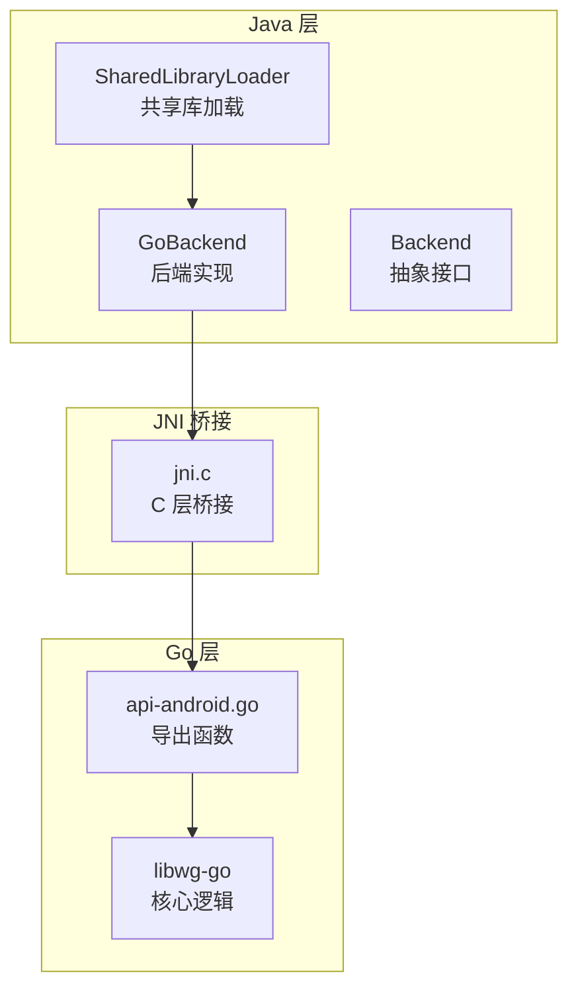
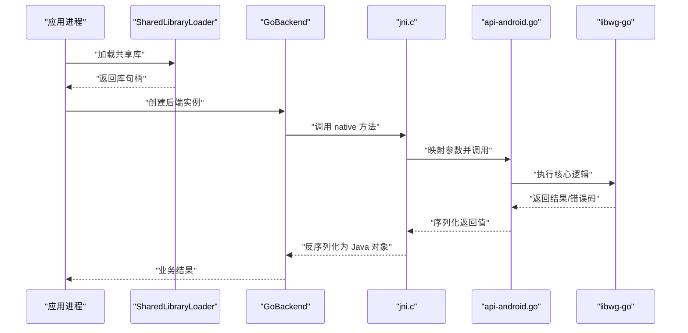
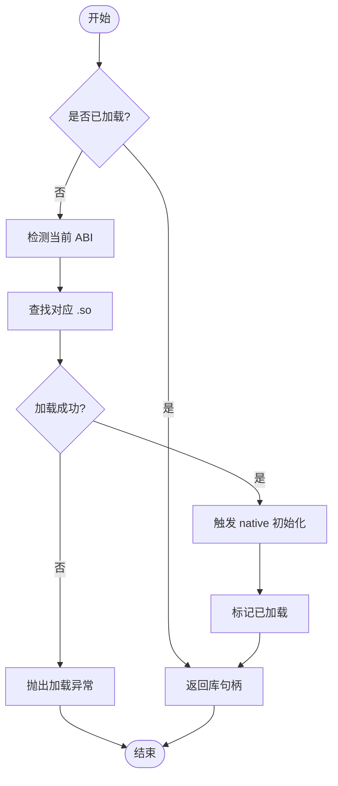
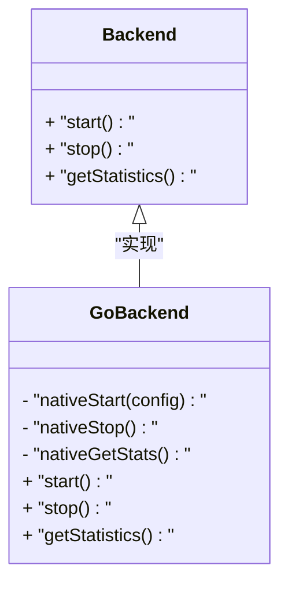
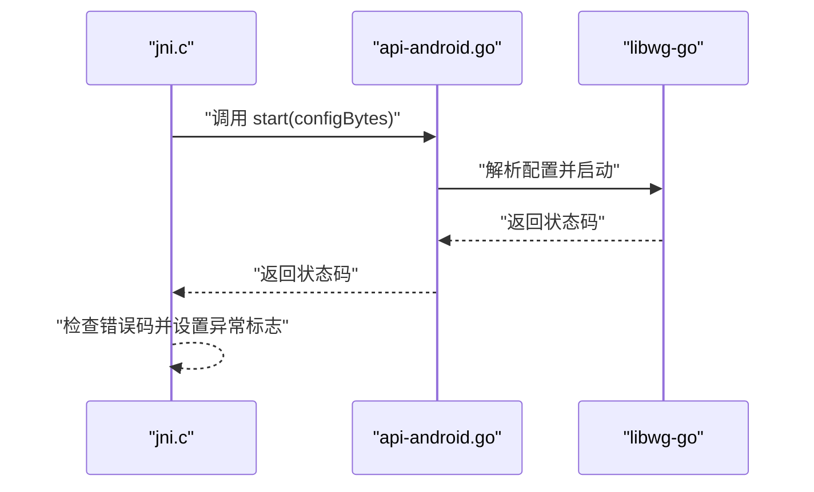
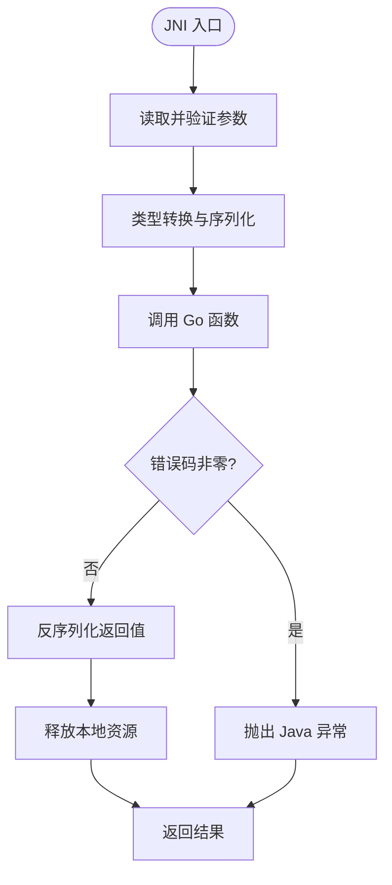
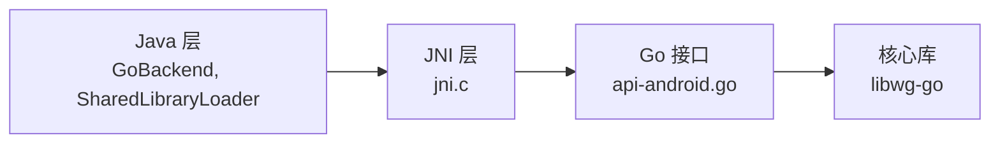
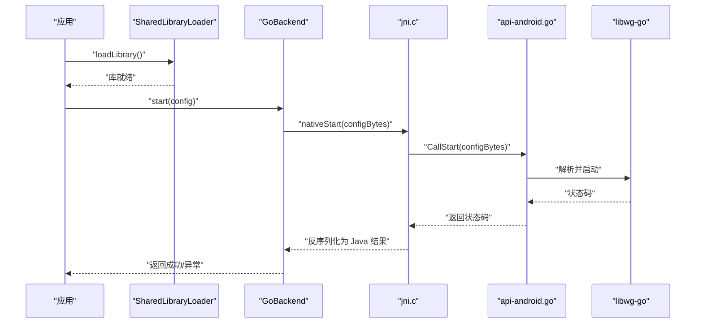

# JNI 集成

<cite>
**本文引用的文件**   
- [SharedLibraryLoader.java](file://tunnel/src/main/java/com/wireguard/android/util/SharedLibraryLoader.java)
- [GoBackend.java](file://tunnel/src/main/java/com/wireguard/android/backend/GoBackend.java)
- [Backend.java](file://tunnel/src/main/java/com/wireguard/android/backend/Backend.java)
- [api-android.go](file://tunnel/tools/libwg-go/api-android.go)
- [jni.c](file://tunnel/tools/libwg-go/jni.c)
- [Makefile](file://tunnel/tools/libwg-go/Makefile)
- [CMakeLists.txt](file://tunnel/tools/CMakeLists.txt)
</cite>

## 目录
1. [简介](#简介)
2. [项目结构](#项目结构)
3. [核心组件](#核心组件)
4. [架构总览](#架构总览)
5. [详细组件分析](#详细组件分析)
6. [依赖关系分析](#依赖关系分析)
7. [性能考虑](#性能考虑)
8. [故障排查指南](#故障排查指南)
9. [结论](#结论)
10. [附录](#附录)

## 简介
本文件面向 WireGuard Android 项目的 JNI 集成，聚焦 Java 与 Go 之间的跨语言通信机制。内容涵盖：
- 共享库加载流程（SharedLibraryLoader）
- Go 侧函数接口定义（api-android.go）
- C 层桥接实现（jni.c）
- 数据类型转换、内存管理与异常处理策略
- 原生库编译与打包、多架构兼容性
- JNI 调用流程图与数据序列化细节
- 跨语言通信最佳实践

## 项目结构
JNI 相关代码主要分布在以下位置：
- Java 层：tunnel/src/main/java/com/wireguard/android/backend 与 util
- Go 层：tunnel/tools/libwg-go
- C 层桥接：tunnel/tools/libwg-go/jni.c
- 构建脚本：tunnel/tools/libwg-go/Makefile 与 tunnel/tools/CMakeLists.txt

图表来源
- [SharedLibraryLoader.java](file://tunnel/src/main/java/com/wireguard/android/util/SharedLibraryLoader.java)
- [GoBackend.java](file://tunnel/src/main/java/com/wireguard/android/backend/GoBackend.java)
- [Backend.java](file://tunnel/src/main/java/com/wireguard/android/backend/Backend.java)
- [jni.c](file://tunnel/tools/libwg-go/jni.c)
- [api-android.go](file://tunnel/tools/libwg-go/api-android.go)

章节来源
- [SharedLibraryLoader.java](file://tunnel/src/main/java/com/wireguard/android/util/SharedLibraryLoader.java)
- [GoBackend.java](file://tunnel/src/main/java/com/wireguard/android/backend/GoBackend.java)
- [Backend.java](file://tunnel/src/main/java/com/wireguard/android/backend/Backend.java)
- [api-android.go](file://tunnel/tools/libwg-go/api-android.go)
- [jni.c](file://tunnel/tools/libwg-go/jni.c)

## 核心组件
- SharedLibraryLoader：负责在运行时按设备 ABI 查找并加载 libwg-go.so，确保首次使用即初始化。
- GoBackend：封装对 Go 后端的调用，提供统一的 Java API，处理参数序列化和结果反序列化。
- api-android.go：定义供 JNI 调用的 Go 函数签名，暴露隧道生命周期与统计等能力。
- jni.c：实现 JNI 入口，完成 Java 类型到 Go 类型的转换、错误传播与资源释放。

章节来源
- [SharedLibraryLoader.java](file://tunnel/src/main/java/com/wireguard/android/util/SharedLibraryLoader.java)
- [GoBackend.java](file://tunnel/src/main/java/com/wireguard/android/backend/GoBackend.java)
- [api-android.go](file://tunnel/tools/libwg-go/api-android.go)
- [jni.c](file://tunnel/tools/libwg-go/jni.c)

## 架构总览
下图展示从 Java 调用到 Go 执行的完整链路，包括库加载、JNI 桥接与 Go 函数执行。

图表来源
- [SharedLibraryLoader.java](file://tunnel/src/main/java/com/wireguard/android/util/SharedLibraryLoader.java)
- [GoBackend.java](file://tunnel/src/main/java/com/wireguard/android/backend/GoBackend.java)
- [jni.c](file://tunnel/tools/libwg-go/jni.c)
- [api-android.go](file://tunnel/tools/libwg-go/api-android.go)

## 详细组件分析

### 共享库加载（SharedLibraryLoader）
- 职责：根据系统 ABI 定位并加载 libwg-go.so；保证单例式加载以避免重复初始化。
- 关键点：
  - 支持多架构（arm64-v8a、armeabi-v7a、x86_64、x86），通过 Android NDK 提供的 ABI 列表选择。
  - 失败时抛出明确异常，便于上层捕获与回退。
  - 与 GoBackend 的静态初始化顺序解耦，避免循环依赖。

图表来源
- [SharedLibraryLoader.java](file://tunnel/src/main/java/com/wireguard/android/util/SharedLibraryLoader.java)

章节来源
- [SharedLibraryLoader.java](file://tunnel/src/main/java/com/wireguard/android/util/SharedLibraryLoader.java)

### Go 后端封装（GoBackend）
- 职责：对外暴露统一 Java API，内部将 Java 对象序列化为 Go 可接收的数据格式，并处理返回值与异常。
- 关键点：
  - 所有 native 方法声明为 private，由公共方法包装以进行参数校验与异常转换。
  - 对字符串、字节数组、配置对象等进行安全序列化，避免空指针与越界访问。
  - 将 Go 错误码转换为 Java 异常，保持调用栈清晰。

图表来源
- [Backend.java](file://tunnel/src/main/java/com/wireguard/android/backend/Backend.java)
- [GoBackend.java](file://tunnel/src/main/java/com/wireguard/android/backend/GoBackend.java)

章节来源
- [Backend.java](file://tunnel/src/main/java/com/wireguard/android/backend/Backend.java)
- [GoBackend.java](file://tunnel/src/main/java/com/wireguard/android/backend/GoBackend.java)

### Go 函数接口（api-android.go）
- 职责：定义供 JNI 调用的导出函数，通常包含隧道启动、停止、状态查询、统计获取等。
- 关键点：
  - 函数签名需与 jni.c 中的映射一致，参数与返回值采用简单、可序列化的类型。
  - 错误通过返回码或指针参数传递，避免跨语言异常直接传播。
  - 对输入参数做基本校验，防止非法值进入核心逻辑。

图表来源
- [api-android.go](file://tunnel/tools/libwg-go/api-android.go)
- [jni.c](file://tunnel/tools/libwg-go/jni.c)

章节来源
- [api-android.go](file://tunnel/tools/libwg-go/api-android.go)

### C 层桥接（jni.c）
- 职责：实现 JNI 入口点，完成 Java 类型到 Go 类型的转换、错误传播与资源释放。
- 关键点：
  - 使用 NewStringUTF/GetStringUTFChars 等 API 进行字符串转换，注意释放局部引用。
  - 对字节数组使用 GetByteArrayElements/ReleaseByteArrayElements，避免内存泄漏。
  - 通过 ThrowNew 抛出 Java 异常，携带错误信息以便调试。
  - 对 Go 返回的错误码进行判断，必要时设置 Java 异常标志。

图表来源
- [jni.c](file://tunnel/tools/libwg-go/jni.c)

章节来源
- [jni.c](file://tunnel/tools/libwg-go/jni.c)

### 数据序列化与类型映射
- 字符串：Java String <-> Go []byte，使用 UTF-8 编码，注意长度与空字符处理。
- 字节数组：Java byte[] <-> Go []byte，直接内存拷贝，避免额外分配。
- 配置对象：Java Config -> JSON/二进制 -> Go 结构体，建议固定版本化协议。
- 统计信息：Go 结构体 -> JSON/二进制 -> Java 对象，字段命名保持一致。

章节来源
- [GoBackend.java](file://tunnel/src/main/java/com/wireguard/android/backend/GoBackend.java)
- [api-android.go](file://tunnel/tools/libwg-go/api-android.go)
- [jni.c](file://tunnel/tools/libwg-go/jni.c)

### 内存管理策略
- 原则：谁分配谁释放，JNI 层严格配对释放局部引用与元素指针。
- 实践：
  - 使用 PushLocalFrame/PopLocalFrame 控制局部引用生命周期。
  - 对大对象优先使用 DirectByteBuffer 减少拷贝。
  - 避免在热点路径频繁分配临时对象。

章节来源
- [jni.c](file://tunnel/tools/libwg-go/jni.c)

### 异常处理策略
- Go 侧：返回错误码或错误指针，不直接抛异常。
- JNI 侧：根据错误码调用 ThrowNew 抛出具体 Java 异常类。
- Java 侧：捕获并记录上下文，必要时重试或降级。

章节来源
- [GoBackend.java](file://tunnel/src/main/java/com/wireguard/android/backend/GoBackend.java)
- [jni.c](file://tunnel/tools/libwg-go/jni.c)

## 依赖关系分析
- Java 层依赖：
  - GoBackend 依赖 Backend 接口与 SharedLibraryLoader。
- JNI 层依赖：
  - jni.c 依赖 Go 导出的符号（来自 api-android.go）。
- Go 层依赖：
  - api-android.go 依赖 libwg-go 核心模块。

图表来源
- [GoBackend.java](file://tunnel/src/main/java/com/wireguard/android/backend/GoBackend.java)
- [SharedLibraryLoader.java](file://tunnel/src/main/java/com/wireguard/android/util/SharedLibraryLoader.java)
- [jni.c](file://tunnel/tools/libwg-go/jni.c)
- [api-android.go](file://tunnel/tools/libwg-go/api-android.go)

章节来源
- [GoBackend.java](file://tunnel/src/main/java/com/wireguard/android/backend/GoBackend.java)
- [SharedLibraryLoader.java](file://tunnel/src/main/java/com/wireguard/android/util/SharedLibraryLoader.java)
- [jni.c](file://tunnel/tools/libwg-go/jni.c)
- [api-android.go](file://tunnel/tools/libwg-go/api-android.go)

## 性能考虑
- 减少拷贝：优先使用 DirectByteBuffer 与零拷贝策略。
- 批量操作：合并多次 JNI 调用，降低跨边界开销。
- 缓存热点对象：避免重复创建大型配置或统计对象。
- 异步回调：对于耗时操作，采用回调或事件通知，避免阻塞 UI 线程。

[本节为通用指导，无需特定文件来源]

## 故障排查指南
- 常见问题：
  - 库加载失败：检查 ABI 匹配与 so 包完整性。
  - 参数序列化错误：确认编码与长度限制。
  - 内存泄漏：检查 JNI 局部引用与元素指针释放。
  - 崩溃与 SIGSEGV：使用 ndk-stack 定位堆栈，核对指针有效性。
- 调试技巧：
  - 在 JNI 层打印关键参数与返回值。
  - 启用 Go 日志输出，结合 Android Logcat 过滤。
  - 使用 ASAN/UBSAN 检测内存问题。

章节来源
- [SharedLibraryLoader.java](file://tunnel/src/main/java/com/wireguard/android/util/SharedLibraryLoader.java)
- [jni.c](file://tunnel/tools/libwg-go/jni.c)

## 结论
WireGuard Android 的 JNI 集成通过清晰的层次划分与严格的内存与异常管理，实现了 Java 与 Go 的高效通信。遵循本文的最佳实践，可在保证稳定性的同时获得良好的性能表现。

[本节为总结性内容，无需特定文件来源]

## 附录

### 编译与打包原生库
- 使用 Makefile 构建 libwg-go.so：
  - 指定目标 ABI 与 NDK 工具链。
  - 生成对应架构的 so 文件并放入相应目录。
- 使用 CMakeLists.txt 整合构建：
  - 统一管理多模块依赖与输出路径。
  - 支持增量编译与并行构建。

章节来源
- [Makefile](file://tunnel/tools/libwg-go/Makefile)
- [CMakeLists.txt](file://tunnel/tools/CMakeLists.txt)

### 多架构兼容性
- 支持的 ABI：arm64-v8a、armeabi-v7a、x86_64、x86。
- 打包策略：按 ABI 分包，安装时按需下载。
- 运行时检测：SharedLibraryLoader 自动选择合适库。

章节来源
- [SharedLibraryLoader.java](file://tunnel/src/main/java/com/wireguard/android/util/SharedLibraryLoader.java)

### JNI 调用流程图（端到端）

图表来源
- [SharedLibraryLoader.java](file://tunnel/src/main/java/com/wireguard/android/util/SharedLibraryLoader.java)
- [GoBackend.java](file://tunnel/src/main/java/com/wireguard/android/backend/GoBackend.java)
- [jni.c](file://tunnel/tools/libwg-go/jni.c)
- [api-android.go](file://tunnel/tools/libwg-go/api-android.go)