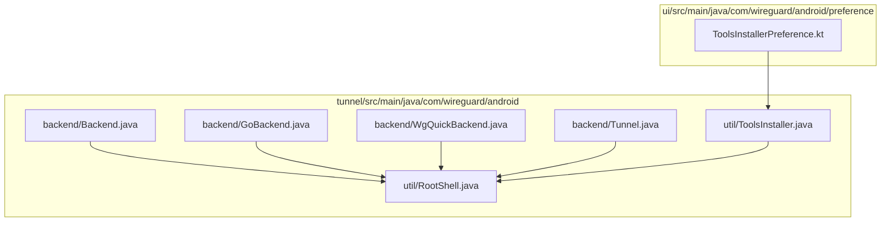
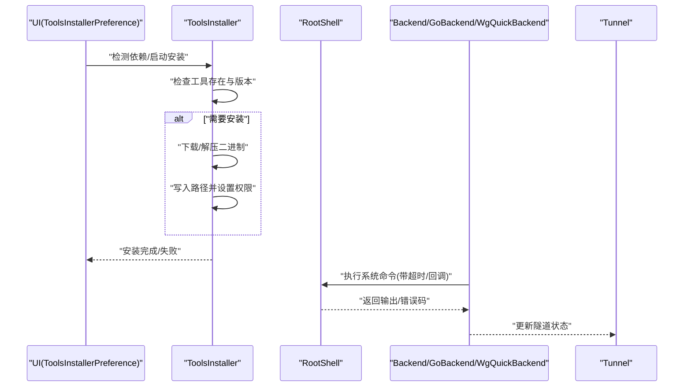
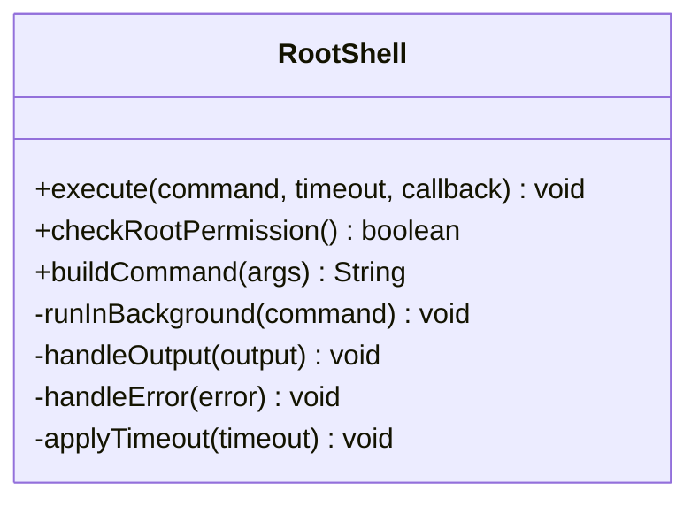
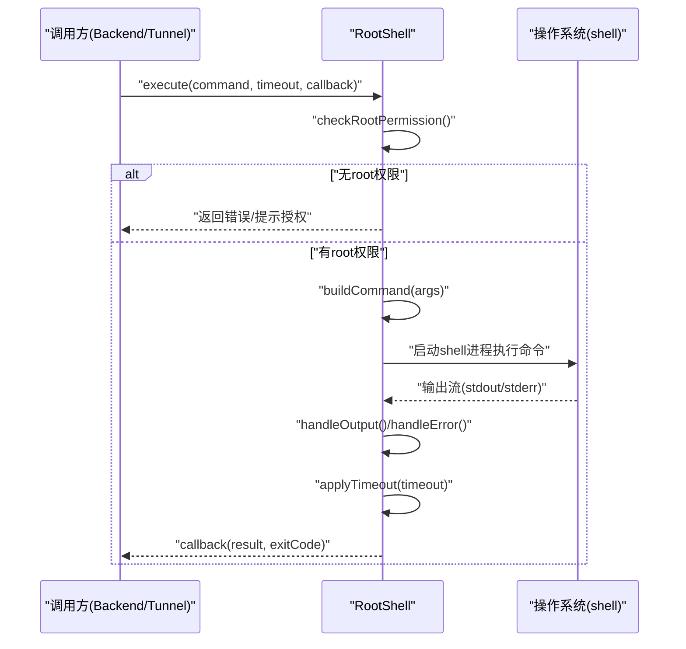
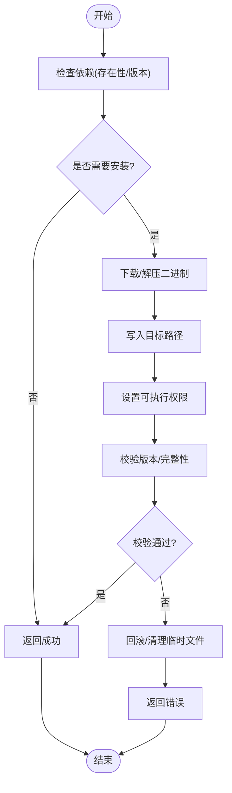
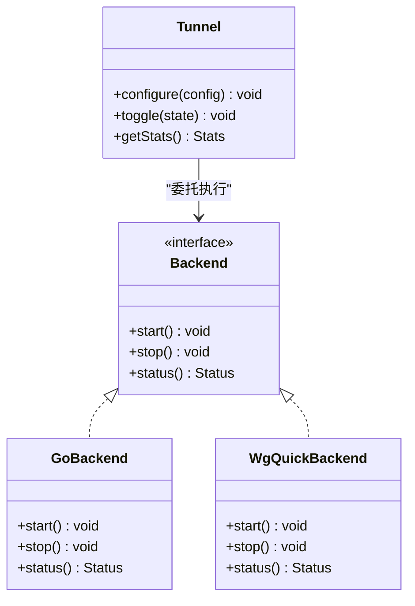
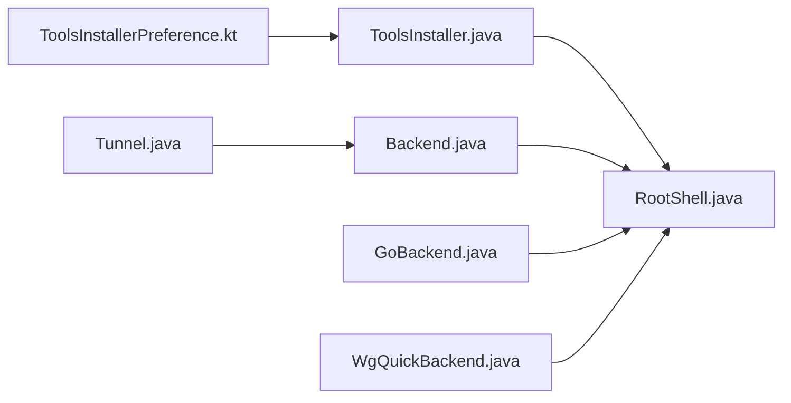

# Root Shell 集成

<cite>
**本文档引用的文件**   
- [RootShell.java](file://tunnel/src/main/java/com/wireguard/android/util/RootShell.java)
- [ToolsInstaller.java](file://tunnel/src/main/java/com/wireguard/android/util/ToolsInstaller.java)
- [Backend.java](file://tunnel/src/main/java/com/wireguard/android/backend/Backend.java)
- [GoBackend.java](file://tunnel/src/main/java/com/wireguard/android/backend/GoBackend.java)
- [WgQuickBackend.java](file://tunnel/src/main/java/com/wireguard/android/backend/WgQuickBackend.java)
- [Tunnel.java](file://tunnel/src/main/java/com/wireguard/android/backend/Tunnel.java)
- [ToolsInstallerPreference.kt](file://ui/src/main/java/com/wireguard/android/preference/ToolsInstallerPreference.kt)
</cite>

## 目录
1. [简介](#简介)
2. [项目结构](#项目结构)
3. [核心组件](#核心组件)
4. [架构总览](#架构总览)
5. [详细组件分析](#详细组件分析)
6. [依赖关系分析](#依赖关系分析)
7. [性能考虑](#性能考虑)
8. [故障排查指南](#故障排查指南)
9. [结论](#结论)
10. [附录](#附录)

## 简介
本文件面向 WireGuard Android 项目中与 Root Shell 集成的实现，重点说明 RootShell 类的命令执行机制（权限检查、命令封装、异步执行与结果处理），以及 ToolsInstaller 工具安装器的依赖检测、自动安装与版本管理。文档还涵盖 root 权限获取、命令超时与错误恢复策略，安全注意事项、日志记录与调试技巧，并总结常见的系统命令使用模式与最佳实践。

## 项目结构
与 Root Shell 集成相关的代码主要位于 tunnel 模块的 util 包中：
- RootShell.java：封装 root shell 命令执行、回调与生命周期管理
- ToolsInstaller.java：负责工具二进制文件的依赖检测、下载与安装、版本管理
- Backend 相关类：通过 RootShell 或 Go 后端执行系统级操作
- UI 层的 ToolsInstallerPreference.kt：提供用户可见的安装器入口与状态展示

图表来源
- [RootShell.java](file://tunnel/src/main/java/com/wireguard/android/util/RootShell.java)
- [ToolsInstaller.java](file://tunnel/src/main/java/com/wireguard/android/util/ToolsInstaller.java)
- [Backend.java](file://tunnel/src/main/java/com/wireguard/android/backend/Backend.java)
- [GoBackend.java](file://tunnel/src/main/java/com/wireguard/android/backend/GoBackend.java)
- [WgQuickBackend.java](file://tunnel/src/main/java/com/wireguard/android/backend/WgQuickBackend.java)
- [Tunnel.java](file://tunnel/src/main/java/com/wireguard/android/backend/Tunnel.java)
- [ToolsInstallerPreference.kt](file://ui/src/main/java/com/wireguard/android/preference/ToolsInstallerPreference.kt)

章节来源
- [RootShell.java](file://tunnel/src/main/java/com/wireguard/android/util/RootShell.java)
- [ToolsInstaller.java](file://tunnel/src/main/java/com/wireguard/android/util/ToolsInstaller.java)
- [Backend.java](file://tunnel/src/main/java/com/wireguard/android/backend/Backend.java)
- [GoBackend.java](file://tunnel/src/main/java/com/wireguard/android/backend/GoBackend.java)
- [WgQuickBackend.java](file://tunnel/src/main/java/com/wireguard/android/backend/WgQuickBackend.java)
- [Tunnel.java](file://tunnel/src/main/java/com/wireguard/android/backend/Tunnel.java)
- [ToolsInstallerPreference.kt](file://ui/src/main/java/com/wireguard/android/preference/ToolsInstallerPreference.kt)

## 核心组件
- RootShell：提供 root 权限下的命令执行能力，包括权限校验、命令封装、异步执行、输出流处理、超时控制与错误恢复。
- ToolsInstaller：负责检测系统工具是否可用、从应用资源或网络下载二进制文件、写入设备存储、设置可执行权限并进行版本管理。
- Backend 层：根据运行环境选择 Go 后端或直接通过 RootShell 调用系统命令；Tunnel 作为隧道实例协调这些操作。
- UI 层：ToolsInstallerPreference 暴露安装器入口，驱动依赖检测与安装流程。

章节来源
- [RootShell.java](file://tunnel/src/main/java/com/wireguard/android/util/RootShell.java)
- [ToolsInstaller.java](file://tunnel/src/main/java/com/wireguard/android/util/ToolsInstaller.java)
- [Backend.java](file://tunnel/src/main/java/com/wireguard/android/backend/Backend.java)
- [GoBackend.java](file://tunnel/src/main/java/com/wireguard/android/backend/GoBackend.java)
- [WgQuickBackend.java](file://tunnel/src/main/java/com/wireguard/android/backend/WgQuickBackend.java)
- [Tunnel.java](file://tunnel/src/main/java/com/wireguard/android/backend/Tunnel.java)
- [ToolsInstallerPreference.kt](file://ui/src/main/java/com/wireguard/android/preference/ToolsInstallerPreference.kt)

## 架构总览
下图展示了 Root Shell 在整体架构中的位置与交互关系：UI 层触发安装器，安装器确保工具可用；后端通过 RootShell 执行系统命令，Tunnel 协调具体任务。

图表来源
- [ToolsInstallerPreference.kt](file://ui/src/main/java/com/wireguard/android/preference/ToolsInstallerPreference.kt)
- [ToolsInstaller.java](file://tunnel/src/main/java/com/wireguard/android/util/ToolsInstaller.java)
- [RootShell.java](file://tunnel/src/main/java/com/wireguard/android/util/RootShell.java)
- [Backend.java](file://tunnel/src/main/java/com/wireguard/android/backend/Backend.java)
- [GoBackend.java](file://tunnel/src/main/java/com/wireguard/android/backend/GoBackend.java)
- [WgQuickBackend.java](file://tunnel/src/main/java/com/wireguard/android/backend/WgQuickBackend.java)
- [Tunnel.java](file://tunnel/src/main/java/com/wireguard/android/backend/Tunnel.java)

## 详细组件分析

### RootShell 组件分析
RootShell 是执行 root 命令的核心抽象，职责包括：
- 权限检查：在执行前判断当前进程是否具有 root 权限，必要时提示或回退
- 命令封装：将命令参数化，避免注入风险，统一构建命令行
- 异步执行：通过后台线程执行命令，避免阻塞 UI
- 结果处理：收集标准输出与错误输出，解析退出码，回调通知上层
- 超时控制：为长时间运行的命令设置超时，防止卡死
- 错误恢复：对常见错误进行重试或降级处理

图表来源
- [RootShell.java](file://tunnel/src/main/java/com/wireguard/android/util/RootShell.java)

章节来源
- [RootShell.java](file://tunnel/src/main/java/com/wireguard/android/util/RootShell.java)

#### 命令执行时序

图表来源
- [RootShell.java](file://tunnel/src/main/java/com/wireguard/android/util/RootShell.java)

章节来源
- [RootShell.java](file://tunnel/src/main/java/com/wireguard/android/util/RootShell.java)

### ToolsInstaller 组件分析
ToolsInstaller 负责系统工具的依赖检测、自动安装与版本管理：
- 依赖检测：检查目标二进制是否存在、可执行、版本匹配
- 自动安装：从资源或网络下载二进制，解压到指定目录，设置可执行权限
- 版本管理：维护版本号与校验信息，支持升级与回滚
- 错误处理：捕获 IO 异常、权限不足、校验失败等场景，给出明确错误信息

图表来源
- [ToolsInstaller.java](file://tunnel/src/main/java/com/wireguard/android/util/ToolsInstaller.java)

章节来源
- [ToolsInstaller.java](file://tunnel/src/main/java/com/wireguard/android/util/ToolsInstaller.java)

### 后端与隧道协作
Backend、GoBackend、WgQuickBackend 与 Tunnel 协同工作，根据环境选择合适的方式执行系统命令：
- 若 Go 后端可用，优先通过 JNI 调用内核接口
- 否则回退到 RootShell 执行系统命令（如 ip、wg 等）
- Tunnel 负责状态管理与事件回调

图表来源
- [Backend.java](file://tunnel/src/main/java/com/wireguard/android/backend/Backend.java)
- [GoBackend.java](file://tunnel/src/main/java/com/wireguard/android/backend/GoBackend.java)
- [WgQuickBackend.java](file://tunnel/src/main/java/com/wireguard/android/backend/WgQuickBackend.java)
- [Tunnel.java](file://tunnel/src/main/java/com/wireguard/android/backend/Tunnel.java)

章节来源
- [Backend.java](file://tunnel/src/main/java/com/wireguard/android/backend/Backend.java)
- [GoBackend.java](file://tunnel/src/main/java/com/wireguard/android/backend/GoBackend.java)
- [WgQuickBackend.java](file://tunnel/src/main/java/com/wireguard/android/backend/WgQuickBackend.java)
- [Tunnel.java](file://tunnel/src/main/java/com/wireguard/android/backend/Tunnel.java)

### UI 层安装器偏好项
ToolsInstallerPreference 提供用户界面入口，驱动依赖检测与安装流程，并在安装过程中反馈进度与结果。

章节来源
- [ToolsInstallerPreference.kt](file://ui/src/main/java/com/wireguard/android/preference/ToolsInstallerPreference.kt)

## 依赖关系分析
- RootShell 被多个后端组件依赖，用于执行系统命令
- ToolsInstaller 被 UI 层与安装逻辑依赖，确保工具链可用
- Backend 与 Tunnel 通过抽象接口解耦，便于在不同平台或环境下切换实现

图表来源
- [ToolsInstallerPreference.kt](file://ui/src/main/java/com/wireguard/android/preference/ToolsInstallerPreference.kt)
- [ToolsInstaller.java](file://tunnel/src/main/java/com/wireguard/android/util/ToolsInstaller.java)
- [RootShell.java](file://tunnel/src/main/java/com/wireguard/android/util/RootShell.java)
- [Backend.java](file://tunnel/src/main/java/com/wireguard/android/backend/Backend.java)
- [GoBackend.java](file://tunnel/src/main/java/com/wireguard/android/backend/GoBackend.java)
- [WgQuickBackend.java](file://tunnel/src/main/java/com/wireguard/android/backend/WgQuickBackend.java)
- [Tunnel.java](file://tunnel/src/main/java/com/wireguard/android/backend/Tunnel.java)

章节来源
- [RootShell.java](file://tunnel/src/main/java/com/wireguard/android/util/RootShell.java)
- [ToolsInstaller.java](file://tunnel/src/main/java/com/wireguard/android/util/ToolsInstaller.java)
- [Backend.java](file://tunnel/src/main/java/com/wireguard/android/backend/Backend.java)
- [GoBackend.java](file://tunnel/src/main/java/com/wireguard/android/backend/GoBackend.java)
- [WgQuickBackend.java](file://tunnel/src/main/java/com/wireguard/android/backend/WgQuickBackend.java)
- [Tunnel.java](file://tunnel/src/main/java/com/wireguard/android/backend/Tunnel.java)
- [ToolsInstallerPreference.kt](file://ui/src/main/java/com/wireguard/android/preference/ToolsInstallerPreference.kt)

## 性能考虑
- 避免频繁创建 shell 进程：复用连接或批量执行命令以减少开销
- 合理设置超时：长耗时命令需配置超时，避免阻塞主线程
- 输出缓冲与分页：大输出应分块处理，减少内存占用
- 异步与回调：所有 I/O 操作应在后台线程执行，并通过回调更新 UI
- 缓存检测结果：依赖检测与版本校验结果可短期缓存，降低重复计算

[本节为通用指导，不直接分析具体文件]

## 故障排查指南
- 权限问题：确认进程已获取 root 权限；若无权限，提示用户授权或回退到非 root 模式
- 命令超时：检查命令是否挂起，适当调整超时时间；记录超时日志以便定位
- 安装失败：检查下载源可用性、磁盘空间与权限；查看校验失败原因并清理临时文件
- 输出异常：区分 stdout 与 stderr，打印关键错误信息；必要时启用更详细的日志级别
- 版本不一致：对比期望版本与实际版本，必要时执行升级或回滚

章节来源
- [RootShell.java](file://tunnel/src/main/java/com/wireguard/android/util/RootShell.java)
- [ToolsInstaller.java](file://tunnel/src/main/java/com/wireguard/android/util/ToolsInstaller.java)

## 结论
RootShell 与 ToolsInstaller 共同构成了 WireGuard Android 的 root 集成基础：前者提供稳定可靠的系统命令执行能力，后者确保工具链的可用性与一致性。通过合理的权限检查、命令封装、异步执行与错误恢复机制，系统在复杂 Android 环境中仍能保持健壮性。结合安全注意事项与调试技巧，开发者可以更高效地维护和扩展该集成。

[本节为总结性内容，不直接分析具体文件]

## 附录
- 常见系统命令模式：
  - 网络接口管理：ip link、ip addr、ip route
  - VPN 配置：wg show、wg set
  - 防火墙规则：iptables/nftables（视系统而定）
- 最佳实践：
  - 始终对用户输入进行参数化与白名单校验
  - 最小权限原则：仅请求必要的 root 权限
  - 清晰的错误消息与日志：便于用户与开发者定位问题
  - 渐进式降级：当 root 不可用时，尽可能提供受限功能

[本节为通用指导，不直接分析具体文件]