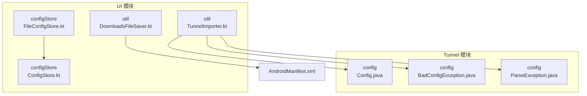
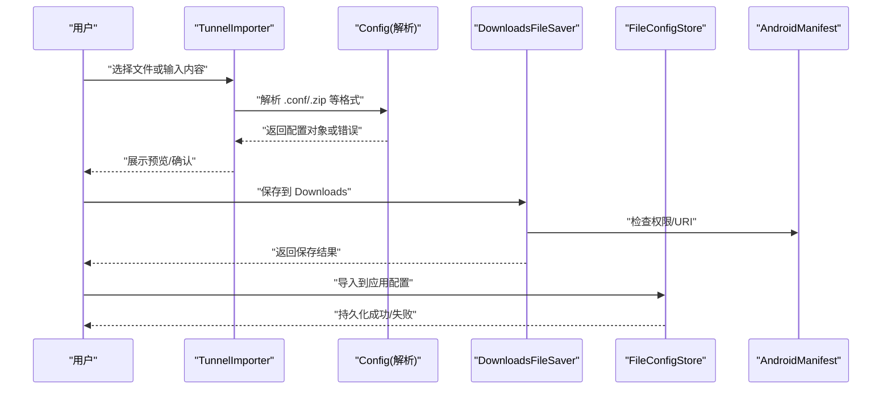
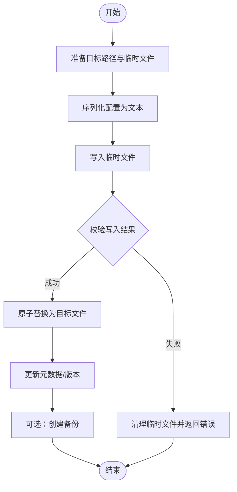
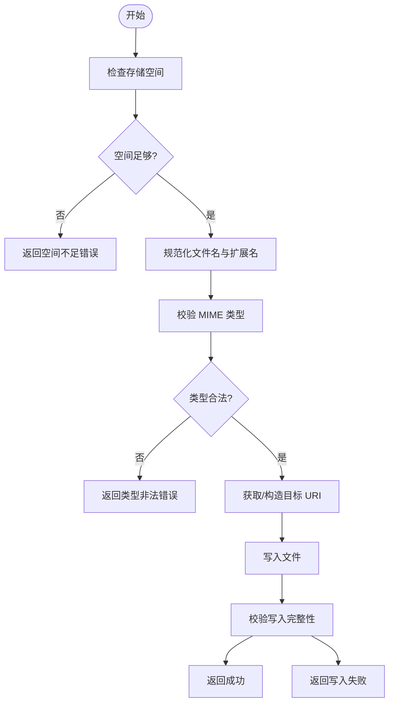
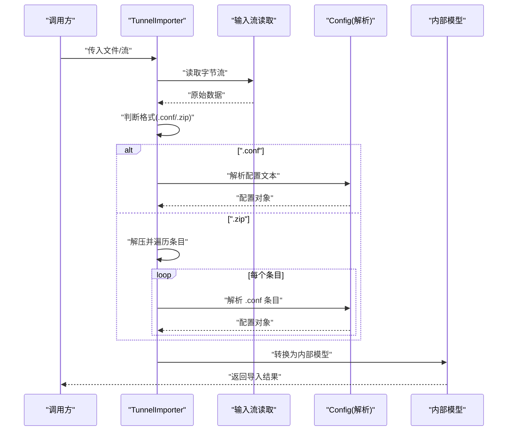
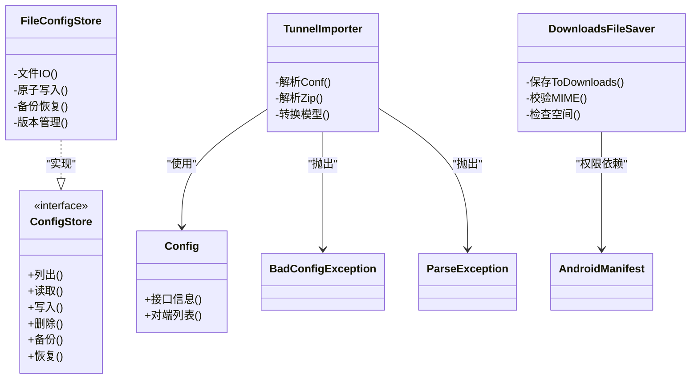

# 文件系统集成

<cite>
**本文引用的文件**   
- [FileConfigStore.kt](file://ui/src/main/java/com/wireguard/android/configStore/FileConfigStore.kt)
- [ConfigStore.kt](file://ui/src/main/java/com/wireguard/android/configStore/ConfigStore.kt)
- [DownloadsFileSaver.kt](file://ui/src/main/java/com/wireguard/android/util/DownloadsFileSaver.kt)
- [TunnelImporter.kt](file://ui/src/main/java/com/wireguard/android/util/TunnelImporter.kt)
- [Config.java](file://tunnel/src/main/java/com/wireguard/config/Config.java)
- [BadConfigException.java](file://tunnel/src/main/java/com/wireguard/config/BadConfigException.java)
- [ParseException.java](file://tunnel/src/main/java/com/wireguard/config/ParseException.java)
- [AndroidManifest.xml](file://ui/src/main/AndroidManifest.xml)
</cite>

## 目录
1. [简介](#简介)
2. [项目结构](#项目结构)
3. [核心组件](#核心组件)
4. [架构总览](#架构总览)
5. [详细组件分析](#详细组件分析)
6. [依赖分析](#依赖分析)
7. [性能考虑](#性能考虑)
8. [故障排查指南](#故障排查指南)
9. [结论](#结论)
10. [附录](#附录)

## 简介
本文件系统集成文档聚焦 WireGuard Android 项目中与“文件”相关的核心实现，包括：
- 配置文件存储（FileConfigStore）：负责配置文件的读写、备份恢复与版本管理。
- 下载文件保存器（DownloadsFileSaver）：负责将用户下载的隧道配置保存到系统 Downloads 目录，并进行必要的安全校验。
- 隧道导入器（TunnelImporter）：负责解析多种格式的隧道配置文件，并转换为应用内部模型。
- 文件权限管理、存储空间检查与异常处理策略。
- 文件操作最佳实践、性能优化与安全性建议。

## 项目结构
与文件系统集成直接相关的代码位于 ui 模块的 configStore 与 util 包中，以及 tunnel 模块的配置解析类。整体组织方式如下：
- ui/src/main/java/com/wireguard/android/configStore：配置文件存储接口与基于文件的实现。
- ui/src/main/java/com/wireguard/android/util：工具类，包含下载文件保存器与隧道导入器。
- tunnel/src/main/java/com/wireguard/config：配置解析与错误类型定义。

图表来源
- [FileConfigStore.kt](file://ui/src/main/java/com/wireguard/android/configStore/FileConfigStore.kt)
- [ConfigStore.kt](file://ui/src/main/java/com/wireguard/android/configStore/ConfigStore.kt)
- [DownloadsFileSaver.kt](file://ui/src/main/java/com/wireguard/android/util/DownloadsFileSaver.kt)
- [TunnelImporter.kt](file://ui/src/main/java/com/wireguard/android/util/TunnelImporter.kt)
- [Config.java](file://tunnel/src/main/java/com/wireguard/config/Config.java)
- [BadConfigException.java](file://tunnel/src/main/java/com/wireguard/config/BadConfigException.java)
- [ParseException.java](file://tunnel/src/main/java/com/wireguard/config/ParseException.java)
- [AndroidManifest.xml](file://ui/src/main/AndroidManifest.xml)

章节来源
- [FileConfigStore.kt](file://ui/src/main/java/com/wireguard/android/configStore/FileConfigStore.kt)
- [ConfigStore.kt](file://ui/src/main/java/com/wireguard/android/configStore/ConfigStore.kt)
- [DownloadsFileSaver.kt](file://ui/src/main/java/com/wireguard/android/util/DownloadsFileSaver.kt)
- [TunnelImporter.kt](file://ui/src/main/java/com/wireguard/android/util/TunnelImporter.kt)
- [Config.java](file://tunnel/src/main/java/com/wireguard/config/Config.java)
- [BadConfigException.java](file://tunnel/src/main/java/com/wireguard/config/BadConfigException.java)
- [ParseException.java](file://tunnel/src/main/java/com/wireguard/config/ParseException.java)
- [AndroidManifest.xml](file://ui/src/main/AndroidManifest.xml)

## 核心组件
- FileConfigStore：实现 ConfigStore 接口，提供基于本地文件的配置持久化能力，支持读取、写入、删除、备份与恢复，以及版本管理。
- ConfigStore：配置文件存储的抽象接口，定义统一的配置访问契约。
- DownloadsFileSaver：封装系统 Downloads 目录的文件保存流程，包含 MIME 类型推断、文件名规范化与安全校验。
- TunnelImporter：解析 .conf、.zip 等格式，提取隧道配置并转换为内部模型，供上层 UI 使用。
- Config、BadConfigException、ParseException：配置解析的核心数据结构与异常类型。

章节来源
- [ConfigStore.kt](file://ui/src/main/java/com/wireguard/android/configStore/ConfigStore.kt)
- [FileConfigStore.kt](file://ui/src/main/java/com/wireguard/android/configStore/FileConfigStore.kt)
- [DownloadsFileSaver.kt](file://ui/src/main/java/com/wireguard/android/util/DownloadsFileSaver.kt)
- [TunnelImporter.kt](file://ui/src/main/java/com/wireguard/android/util/TunnelImporter.kt)
- [Config.java](file://tunnel/src/main/java/com/wireguard/config/Config.java)
- [BadConfigException.java](file://tunnel/src/main/java/com/wireguard/config/BadConfigException.java)
- [ParseException.java](file://tunnel/src/main/java/com/wireguard/config/ParseException.java)

## 架构总览
下图展示了文件系统在导入、保存与持久化过程中的交互关系：

图表来源
- [TunnelImporter.kt](file://ui/src/main/java/com/wireguard/android/util/TunnelImporter.kt)
- [Config.java](file://tunnel/src/main/java/com/wireguard/config/Config.java)
- [DownloadsFileSaver.kt](file://ui/src/main/java/com/wireguard/android/util/DownloadsFileSaver.kt)
- [FileConfigStore.kt](file://ui/src/main/java/com/wireguard/android/configStore/FileConfigStore.kt)
- [AndroidManifest.xml](file://ui/src/main/AndroidManifest.xml)

## 详细组件分析

### FileConfigStore：配置文件存储
职责与特性
- 读取与写入：以文件形式持久化隧道配置，保证原子性写入（先写临时文件再替换），避免损坏。
- 备份与恢复：在关键操作前创建备份，支持回滚恢复，确保数据一致性。
- 版本管理：维护配置版本信息，便于迁移与兼容性处理。
- 并发与锁：对文件访问进行必要的同步控制，防止竞态条件。
- 异常处理：统一包装 IO 异常与业务异常，向上层抛出明确错误信息。

关键流程（写入）

图表来源
- [FileConfigStore.kt](file://ui/src/main/java/com/wireguard/android/configStore/FileConfigStore.kt)

章节来源
- [FileConfigStore.kt](file://ui/src/main/java/com/wireguard/android/configStore/FileConfigStore.kt)

### ConfigStore：配置存储接口
职责与特性
- 定义统一的配置访问方法：列出、读取、写入、删除、备份、恢复等。
- 屏蔽底层存储细节，便于替换实现（如未来引入加密存储）。
- 提供错误语义化：通过异常类型区分 IO 错误、权限错误、格式错误等。

章节来源
- [ConfigStore.kt](file://ui/src/main/java/com/wireguard/android/configStore/ConfigStore.kt)

### DownloadsFileSaver：下载文件保存器
职责与特性
- 保存至系统 Downloads：使用合适的 URI 与 MIME 类型，确保兼容性与可分享性。
- 安全校验：校验文件名、扩展名、MIME 类型，拒绝潜在危险内容。
- 空间检查：在写入前检查可用空间，避免部分写入导致的数据不一致。
- 权限处理：根据 Android 版本与存储访问框架（SAF）要求处理权限。

关键流程（保存）

图表来源
- [DownloadsFileSaver.kt](file://ui/src/main/java/com/wireguard/android/util/DownloadsFileSaver.kt)
- [AndroidManifest.xml](file://ui/src/main/AndroidManifest.xml)

章节来源
- [DownloadsFileSaver.kt](file://ui/src/main/java/com/wireguard/android/util/DownloadsFileSaver.kt)
- [AndroidManifest.xml](file://ui/src/main/AndroidManifest.xml)

### TunnelImporter：隧道导入器
职责与特性
- 多格式支持：解析 .conf 文本与 .zip 压缩包，提取单个或多个隧道配置。
- 解析流程：读取字节流 -> 识别格式 -> 调用配置解析器 -> 生成内部模型。
- 错误处理：捕获解析异常并转换为友好的错误提示。
- 批量导入：支持从 zip 中提取多个 conf 并逐一导入。

关键流程（导入）

图表来源
- [TunnelImporter.kt](file://ui/src/main/java/com/wireguard/android/util/TunnelImporter.kt)
- [Config.java](file://tunnel/src/main/java/com/wireguard/config/Config.java)

章节来源
- [TunnelImporter.kt](file://ui/src/main/java/com/wireguard/android/util/TunnelImporter.kt)
- [Config.java](file://tunnel/src/main/java/com/wireguard/config/Config.java)

### 配置解析与异常（Config、BadConfigException、ParseException）
- Config：表示一个完整的隧道配置，包含接口与对端信息。
- BadConfigException：用于标识配置结构或值不合法的错误。
- ParseException：用于标识语法解析阶段的错误。

这些类型在导入与验证过程中被广泛使用，确保错误语义清晰且可追溯。

章节来源
- [Config.java](file://tunnel/src/main/java/com/wireguard/config/Config.java)
- [BadConfigException.java](file://tunnel/src/main/java/com/wireguard/config/BadConfigException.java)
- [ParseException.java](file://tunnel/src/main/java/com/wireguard/config/ParseException.java)

## 依赖分析
- FileConfigStore 依赖 ConfigStore 接口，实现具体文件存取逻辑。
- TunnelImporter 依赖 Config 解析器与异常类型，完成格式转换。
- DownloadsFileSaver 依赖 Android 存储 API 与清单权限声明。
- 各组件之间通过清晰的接口与异常边界解耦，降低耦合度。

图表来源
- [ConfigStore.kt](file://ui/src/main/java/com/wireguard/android/configStore/ConfigStore.kt)
- [FileConfigStore.kt](file://ui/src/main/java/com/wireguard/android/configStore/FileConfigStore.kt)
- [TunnelImporter.kt](file://ui/src/main/java/com/wireguard/android/util/TunnelImporter.kt)
- [Config.java](file://tunnel/src/main/java/com/wireguard/config/Config.java)
- [BadConfigException.java](file://tunnel/src/main/java/com/wireguard/config/BadConfigException.java)
- [ParseException.java](file://tunnel/src/main/java/com/wireguard/config/ParseException.java)
- [DownloadsFileSaver.kt](file://ui/src/main/java/com/wireguard/android/util/DownloadsFileSaver.kt)
- [AndroidManifest.xml](file://ui/src/main/AndroidManifest.xml)

章节来源
- [ConfigStore.kt](file://ui/src/main/java/com/wireguard/android/configStore/ConfigStore.kt)
- [FileConfigStore.kt](file://ui/src/main/java/com/wireguard/android/configStore/FileConfigStore.kt)
- [TunnelImporter.kt](file://ui/src/main/java/com/wireguard/android/util/TunnelImporter.kt)
- [Config.java](file://tunnel/src/main/java/com/wireguard/config/Config.java)
- [BadConfigException.java](file://tunnel/src/main/java/com/wireguard/config/BadConfigException.java)
- [ParseException.java](file://tunnel/src/main/java/com/wireguard/config/ParseException.java)
- [DownloadsFileSaver.kt](file://ui/src/main/java/com/wireguard/android/util/DownloadsFileSaver.kt)
- [AndroidManifest.xml](file://ui/src/main/AndroidManifest.xml)

## 性能考虑
- 原子写入与缓冲：优先使用缓冲 I/O，减少系统调用次数；采用临时文件+原子替换避免部分写入。
- 批量导入优化：对 zip 中的多个 conf 采用流式解析，避免一次性加载全部内存。
- 空间预检：在写入前检查可用空间，减少失败重试开销。
- 缓存元数据：对频繁读取的配置元数据进行轻量缓存，降低重复解析成本。
- 线程隔离：I/O 操作应在后台线程执行，避免阻塞 UI。

[本节为通用指导，无需特定文件引用]

## 故障排查指南
常见问题与定位要点
- 权限问题：检查 AndroidManifest 中相关权限声明与运行时授权；确认 Downloads 目录 URI 是否可写。
- 空间不足：在保存前检查可用空间；若不足，提示用户清理存储。
- 文件格式错误：解析阶段抛出 BadConfigException 或 ParseException，需检查配置语法与字段合法性。
- 写入失败：确认目标路径存在、无只读属性；检查临时文件清理逻辑。
- 备份恢复失败：验证备份文件完整性与版本匹配；必要时回滚到上一版本。

章节来源
- [AndroidManifest.xml](file://ui/src/main/AndroidManifest.xml)
- [BadConfigException.java](file://tunnel/src/main/java/com/wireguard/config/BadConfigException.java)
- [ParseException.java](file://tunnel/src/main/java/com/wireguard/config/ParseException.java)

## 结论
WireGuard Android 的文件系统集成围绕 FileConfigStore、DownloadsFileSaver 与 TunnelImporter 三大组件展开，分别承担配置持久化、下载保存与多格式解析的职责。通过清晰的接口设计、严格的异常分类与完善的备份恢复机制，系统在可靠性、安全性与可维护性方面具备良好基础。建议在后续迭代中继续强化空间检查、权限适配与性能优化，以提升用户体验与稳定性。

[本节为总结性内容，无需特定文件引用]

## 附录
- 最佳实践
  - 始终使用原子写入与备份机制保护配置数据。
  - 对输入内容进行严格校验（文件名、扩展名、MIME 类型）。
  - 在后台线程执行 I/O 操作，避免主线程阻塞。
  - 对异常进行分类与日志记录，便于快速定位问题。
- 安全性考虑
  - 限制可接受的 MIME 类型与扩展名，防止恶意文件注入。
  - 谨慎处理外部来源的 URI，遵循最小权限原则。
  - 对敏感信息进行脱敏与加密存储（如需）。
- 兼容性建议
  - 针对不同 Android 版本的存储访问框架（SAF）进行适配。
  - 对旧版设备提供降级策略与友好提示。

[本节为通用指导，无需特定文件引用]