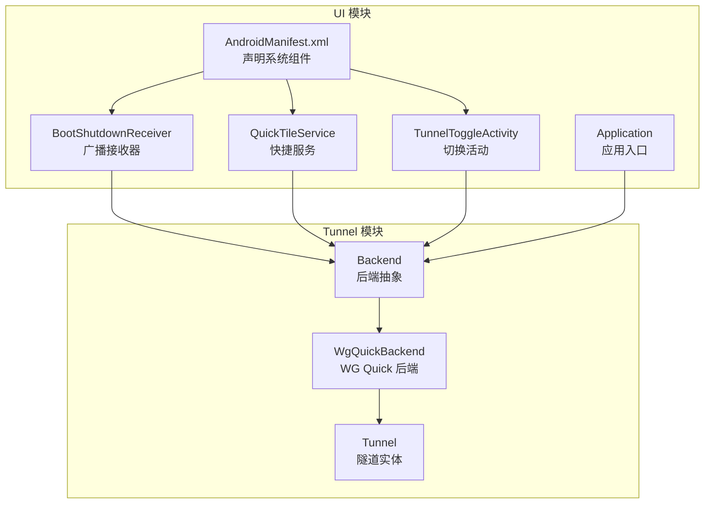
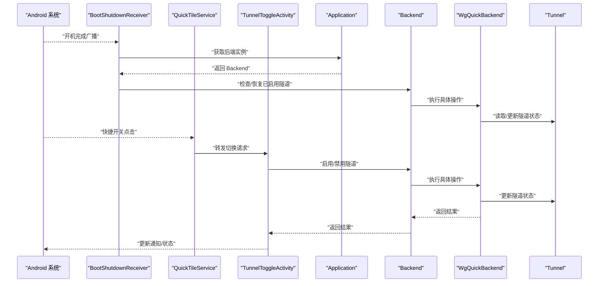
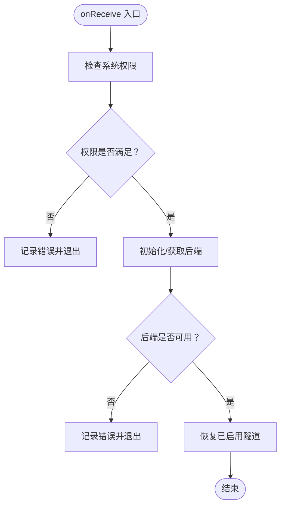
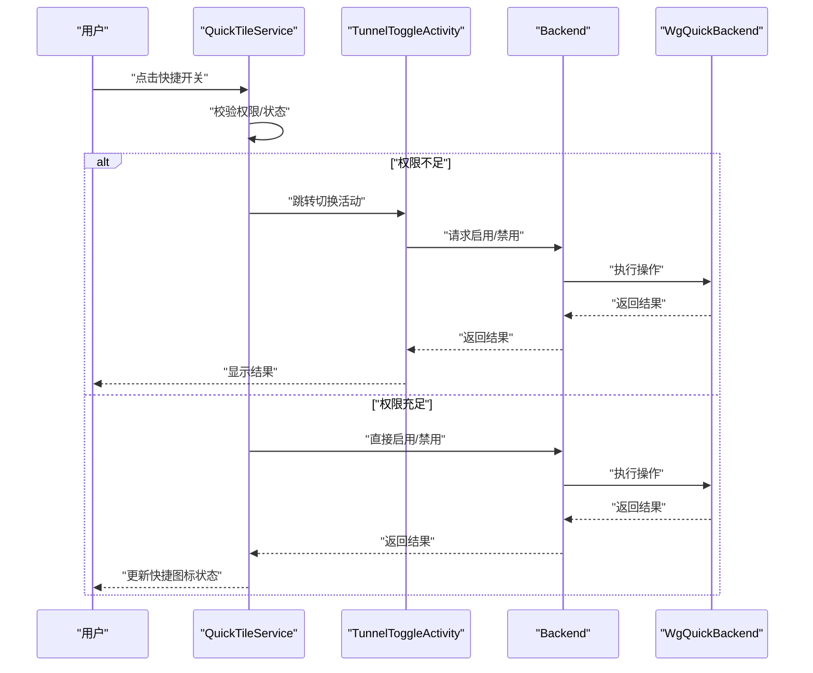
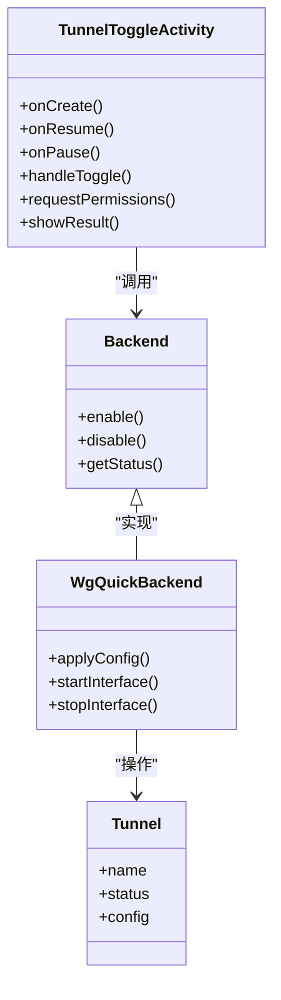
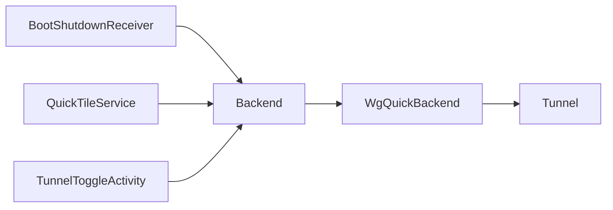

# 系统服务集成

<cite>
**本文引用的文件**   
- [BootShutdownReceiver.kt](file://ui/src/main/java/com/wireguard/android/BootShutdownReceiver.kt)
- [QuickTileService.kt](file://ui/src/main/java/com/wireguard/android/QuickTileService.kt)
- [TunnelToggleActivity.kt](file://ui/src/main/java/com/wireguard/android/activity/TunnelToggleActivity.kt)
- [AndroidManifest.xml（UI模块）](file://ui/src/main/AndroidManifest.xml)
- [Backend.java](file://tunnel/src/main/java/com/wireguard/android/backend/Backend.java)
- [WgQuickBackend.java](file://tunnel/src/main/java/com/wireguard/android/backend/WgQuickBackend.java)
- [Tunnel.java](file://tunnel/src/main/java/com/wireguard/android/backend/Tunnel.java)
- [Application.kt](file://ui/src/main/java/com/wireguard/android/Application.kt)
</cite>

## 目录
1. [简介](#简介)
2. [项目结构](#项目结构)
3. [核心组件](#核心组件)
4. [架构总览](#架构总览)
5. [详细组件分析](#详细组件分析)
6. [依赖关系分析](#依赖关系分析)
7. [性能考虑](#性能考虑)
8. [故障排查指南](#故障排查指南)
9. [结论](#结论)

## 简介
本文件面向 WireGuard Android 项目的系统服务集成，聚焦应用与 Android 系统服务的交互方式，包括：
- 广播接收器 BootShutdownReceiver 处理开机自启动
- 通知栏快捷服务 QuickTileService 提供快速开关功能
- 隧道切换活动 TunnelToggleActivity 实现状态控制
文档同时覆盖系统权限管理、生命周期管理与错误处理策略，并给出系统服务架构图与事件流程图，帮助开发者理解各系统组件的交互方式。

## 项目结构
WireGuard Android 采用多模块结构，UI 模块负责用户交互与系统服务集成，tunnel 模块封装底层后端能力。与系统服务集成相关的代码主要位于 ui 模块中，通过 AndroidManifest 注册广播与服务，并在运行时调用 tunnel 模块提供的后端接口以控制隧道状态。

图表来源
- [AndroidManifest.xml（UI模块）](file://ui/src/main/AndroidManifest.xml)
- [BootShutdownReceiver.kt](file://ui/src/main/java/com/wireguard/android/BootShutdownReceiver.kt)
- [QuickTileService.kt](file://ui/src/main/java/com/wireguard/android/QuickTileService.kt)
- [TunnelToggleActivity.kt](file://ui/src/main/java/com/wireguard/android/activity/TunnelToggleActivity.kt)
- [Application.kt](file://ui/src/main/java/com/wireguard/android/Application.kt)
- [Backend.java](file://tunnel/src/main/java/com/wireguard/android/backend/Backend.java)
- [WgQuickBackend.java](file://tunnel/src/main/java/com/wireguard/android/backend/WgQuickBackend.java)
- [Tunnel.java](file://tunnel/src/main/java/com/wireguard/android/backend/Tunnel.java)

章节来源
- [AndroidManifest.xml（UI模块）](file://ui/src/main/AndroidManifest.xml)
- [Application.kt](file://ui/src/main/java/com/wireguard/android/Application.kt)

## 核心组件
- 广播接收器 BootShutdownReceiver：监听系统开机完成等广播，用于恢复或启动已启用的隧道。
- 快捷服务 QuickTileService：响应通知栏快捷开关点击，触发隧道启用/禁用逻辑。
- 切换活动 TunnelToggleActivity：作为 UI 入口，协调隧道状态切换，必要时请求系统权限。
- 后端抽象 Backend：统一封装隧道操作（启用、停止、查询状态），由 WgQuickBackend 实现具体逻辑。
- 应用入口 Application：初始化全局上下文与后端实例，确保系统服务可用。

章节来源
- [BootShutdownReceiver.kt](file://ui/src/main/java/com/wireguard/android/BootShutdownReceiver.kt)
- [QuickTileService.kt](file://ui/src/main/java/com/wireguard/android/QuickTileService.kt)
- [TunnelToggleActivity.kt](file://ui/src/main/java/com/wireguard/android/activity/TunnelToggleActivity.kt)
- [Backend.java](file://tunnel/src/main/java/com/wireguard/android/backend/Backend.java)
- [WgQuickBackend.java](file://tunnel/src/main/java/com/wireguard/android/backend/WgQuickBackend.java)
- [Application.kt](file://ui/src/main/java/com/wireguard/android/Application.kt)

## 架构总览
下图展示系统服务与后端之间的交互关系：系统广播和服务回调进入 UI 层，再由 UI 层调用后端抽象进行隧道状态控制；后端通过 WG Quick 实现与内核/工具链交互。

图表来源
- [BootShutdownReceiver.kt](file://ui/src/main/java/com/wireguard/android/BootShutdownReceiver.kt)
- [QuickTileService.kt](file://ui/src/main/java/com/wireguard/android/QuickTileService.kt)
- [TunnelToggleActivity.kt](file://ui/src/main/java/com/wireguard/android/activity/TunnelToggleActivity.kt)
- [Application.kt](file://ui/src/main/java/com/wireguard/android/Application.kt)
- [Backend.java](file://tunnel/src/main/java/com/wireguard/android/backend/Backend.java)
- [WgQuickBackend.java](file://tunnel/src/main/java/com/wireguard/android/backend/WgQuickBackend.java)
- [Tunnel.java](file://tunnel/src/main/java/com/wireguard/android/backend/Tunnel.java)

## 详细组件分析

### 广播接收器 BootShutdownReceiver（开机自启动）
- 职责
  - 监听系统广播（如开机完成），在系统就绪后恢复已启用的隧道。
  - 校验必要权限与后端可用性，避免非法状态。
- 生命周期
  - 由系统在广播到达时创建并回调 onReceive，完成后立即销毁。
- 权限与系统事件
  - 需要系统广播权限（如接收开机广播），在 Manifest 中声明。
  - 若后端未就绪或权限不足，应记录错误并安全退出。
- 错误处理
  - 捕获异常并上报日志，保证接收器健壮性。
  - 对“无可用隧道”“后端不可用”等场景做降级处理。

图表来源
- [BootShutdownReceiver.kt](file://ui/src/main/java/com/wireguard/android/BootShutdownReceiver.kt)
- [Backend.java](file://tunnel/src/main/java/com/wireguard/android/backend/Backend.java)
- [WgQuickBackend.java](file://tunnel/src/main/java/com/wireguard/android/backend/WgQuickBackend.java)

章节来源
- [BootShutdownReceiver.kt](file://ui/src/main/java/com/wireguard/android/BootShutdownReceiver.kt)
- [AndroidManifest.xml（UI模块）](file://ui/src/main/AndroidManifest.xml)

### 快捷服务 QuickTileService（通知栏快捷开关）
- 职责
  - 响应通知栏快捷开关点击，触发隧道启用/禁用。
  - 与 Activity 协作，必要时跳转至切换界面完成授权流程。
- 生命周期
  - 由系统按需创建，处理点击后尽快释放资源。
- 权限与系统事件
  - 可能需要网络相关权限或 VPN 相关权限，按系统要求申请。
  - 若权限不足，提示用户并引导授权。
- 错误处理
  - 捕获后端调用异常，向用户反馈失败原因。
  - 对并发点击进行去抖处理，避免重复操作。

图表来源
- [QuickTileService.kt](file://ui/src/main/java/com/wireguard/android/QuickTileService.kt)
- [TunnelToggleActivity.kt](file://ui/src/main/java/com/wireguard/android/activity/TunnelToggleActivity.kt)
- [Backend.java](file://tunnel/src/main/java/com/wireguard/android/backend/Backend.java)
- [WgQuickBackend.java](file://tunnel/src/main/java/com/wireguard/android/backend/WgQuickBackend.java)

章节来源
- [QuickTileService.kt](file://ui/src/main/java/com/wireguard/android/QuickTileService.kt)
- [AndroidManifest.xml（UI模块）](file://ui/src/main/AndroidManifest.xml)

### 隧道切换活动 TunnelToggleActivity（状态控制）
- 职责
  - 作为用户可见的状态控制入口，协调隧道启用/禁用流程。
  - 处理系统权限申请与授权结果回调。
- 生命周期
  - 由系统根据任务栈创建/销毁，注意在 onPause/onStop 中释放资源。
- 权限与系统事件
  - 可能涉及 VPN 权限、网络权限等，需在运行时动态申请。
  - 处理系统配置变更（如屏幕旋转）时的状态保持。
- 错误处理
  - 对后端调用失败进行友好提示，支持重试或回滚。
  - 对超时、中断等异常进行兜底处理。

图表来源
- [TunnelToggleActivity.kt](file://ui/src/main/java/com/wireguard/android/activity/TunnelToggleActivity.kt)
- [Backend.java](file://tunnel/src/main/java/com/wireguard/android/backend/Backend.java)
- [WgQuickBackend.java](file://tunnel/src/main/java/com/wireguard/android/backend/WgQuickBackend.java)
- [Tunnel.java](file://tunnel/src/main/java/com/wireguard/android/backend/Tunnel.java)

章节来源
- [TunnelToggleActivity.kt](file://ui/src/main/java/com/wireguard/android/activity/TunnelToggleActivity.kt)

### 应用入口 Application（初始化与后端管理）
- 职责
  - 初始化全局上下文、后端实例与必要的系统服务。
  - 为广播、服务、活动提供统一的后端访问点。
- 生命周期
  - 随进程启动而创建，进程结束时销毁。
- 错误处理
  - 初始化失败时记录日志，避免影响主流程。
  - 提供健康检查方法供其他组件使用。

章节来源
- [Application.kt](file://ui/src/main/java/com/wireguard/android/Application.kt)
- [Backend.java](file://tunnel/src/main/java/com/wireguard/android/backend/Backend.java)

## 依赖关系分析
- 组件耦合
  - BootShutdownReceiver、QuickTileService、TunnelToggleActivity 均依赖 Backend 抽象，降低与具体实现的耦合。
  - WgQuickBackend 实现 Backend，并操作 Tunnel 实体。
- 外部依赖
  - Android 系统广播与服务机制
  - VPN/网络相关权限（由系统管控）
- 潜在循环依赖
  - 通过抽象解耦，避免 UI 层与后端实现直接耦合，减少循环依赖风险。

图表来源
- [BootShutdownReceiver.kt](file://ui/src/main/java/com/wireguard/android/BootShutdownReceiver.kt)
- [QuickTileService.kt](file://ui/src/main/java/com/wireguard/android/QuickTileService.kt)
- [TunnelToggleActivity.kt](file://ui/src/main/java/com/wireguard/android/activity/TunnelToggleActivity.kt)
- [Backend.java](file://tunnel/src/main/java/com/wireguard/android/backend/Backend.java)
- [WgQuickBackend.java](file://tunnel/src/main/java/com/wireguard/android/backend/WgQuickBackend.java)
- [Tunnel.java](file://tunnel/src/main/java/com/wireguard/android/backend/Tunnel.java)

章节来源
- [Backend.java](file://tunnel/src/main/java/com/wireguard/android/backend/Backend.java)
- [WgQuickBackend.java](file://tunnel/src/main/java/com/wireguard/android/backend/WgQuickBackend.java)
- [Tunnel.java](file://tunnel/src/main/java/com/wireguard/android/backend/Tunnel.java)

## 性能考虑
- 广播与服务生命周期短，应避免在 onReceive 中执行耗时操作，将重任务下沉到后端或后台线程。
- 快捷开关点击需去抖，防止频繁触发导致后端抖动。
- 后端操作尽量批量合并，减少系统调用次数。
- 状态同步采用最小化刷新，仅在关键节点更新 UI。

## 故障排查指南
- 常见问题
  - 开机后隧道未恢复：检查广播权限、后端初始化与健康状态。
  - 快捷开关无效：确认权限申请流程与授权结果回调。
  - 切换活动崩溃：检查生命周期回调中的资源释放与异常兜底。
- 定位步骤
  - 查看系统日志与自定义日志输出，关注权限拒绝与后端异常。
  - 验证 Manifest 中组件声明与权限配置。
  - 使用调试模式逐步跟踪从系统事件到后端调用的完整链路。
- 恢复策略
  - 对可恢复错误提供重试机制，对不可恢复错误提示用户并回滚状态。

章节来源
- [BootShutdownReceiver.kt](file://ui/src/main/java/com/wireguard/android/BootShutdownReceiver.kt)
- [QuickTileService.kt](file://ui/src/main/java/com/wireguard/android/QuickTileService.kt)
- [TunnelToggleActivity.kt](file://ui/src/main/java/com/wireguard/android/activity/TunnelToggleActivity.kt)

## 结论
WireGuard Android 通过广播接收器、快捷服务与切换活动与系统服务深度集成，借助后端抽象屏蔽底层差异，实现稳定的隧道状态控制。合理的权限管理、生命周期管理与错误处理策略保障了用户体验与系统稳定性。建议持续优化性能与可观测性，完善异常恢复与用户提示，提升整体可靠性。