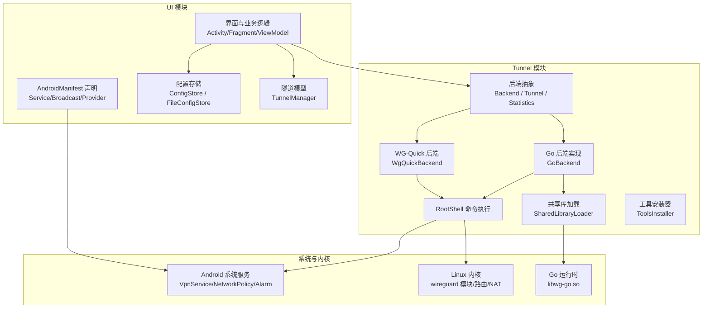
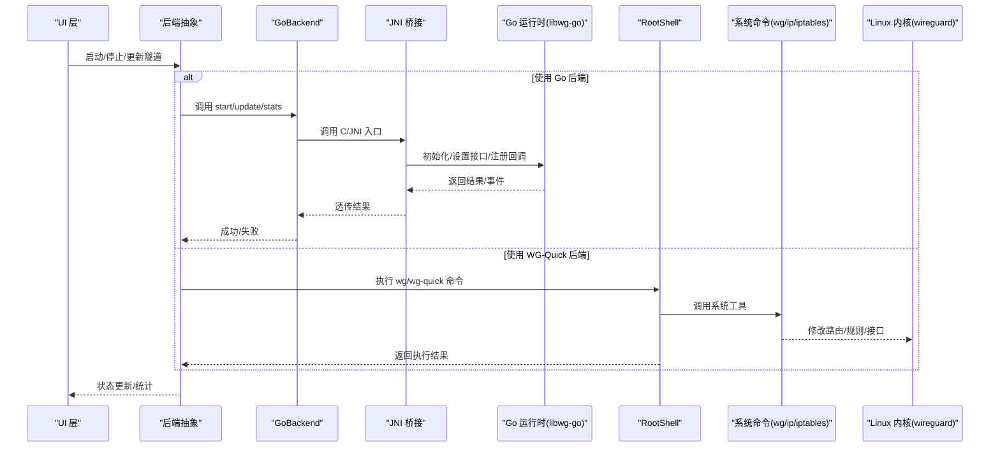
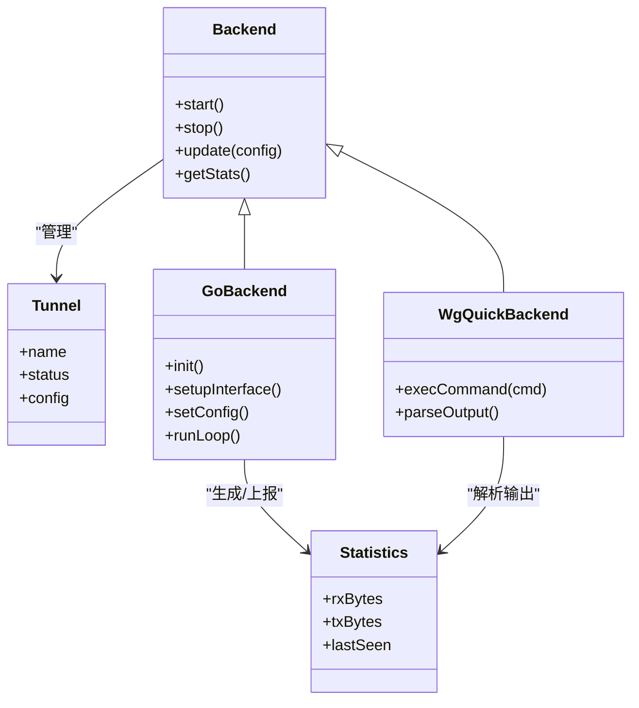
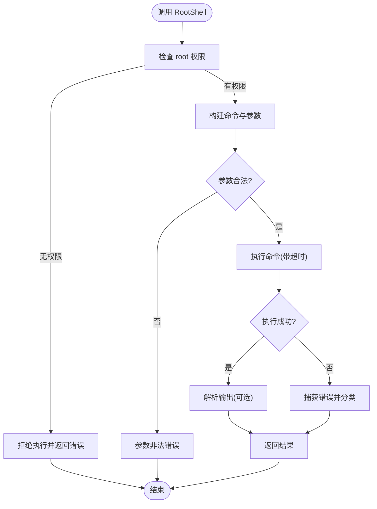
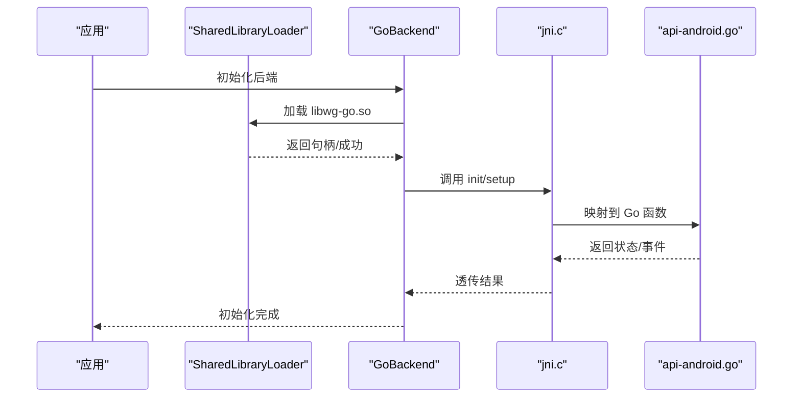
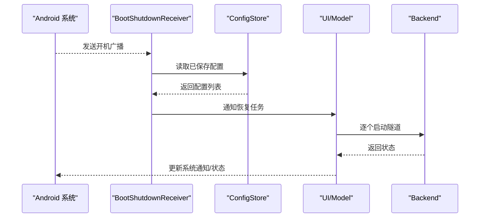
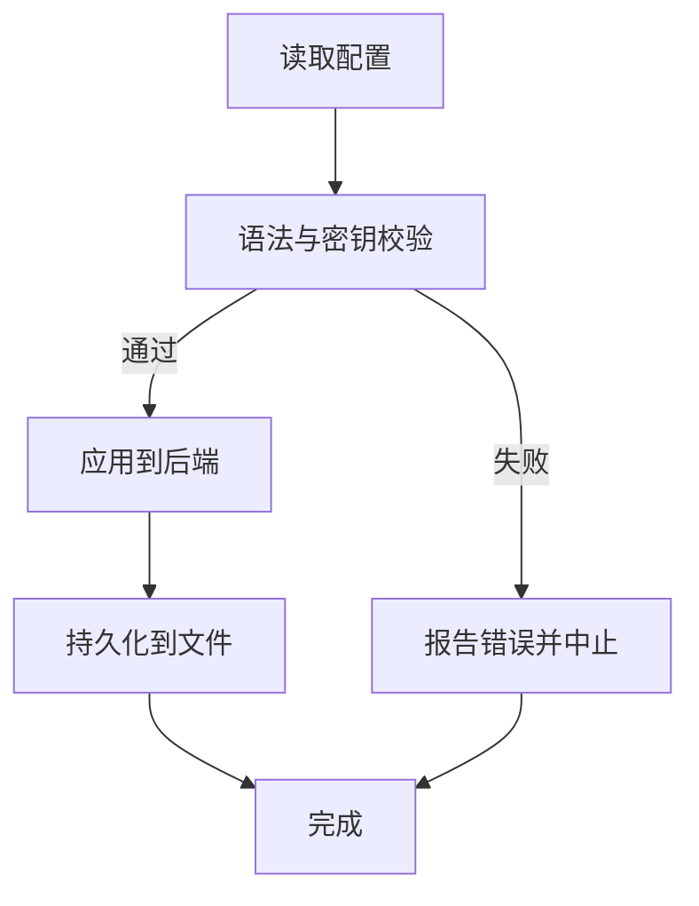
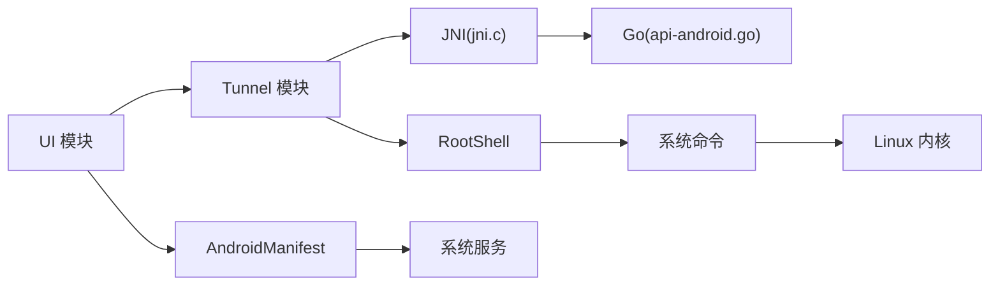

# 集成模式

<cite>
**本文引用的文件**   
- [Backend.java](file://tunnel/src/main/java/com/wireguard/android/backend/Backend.java)
- [GoBackend.java](file://tunnel/src/main/java/com/wireguard/android/backend/GoBackend.java)
- [WgQuickBackend.java](file://tunnel/src/main/java/com/wireguard/android/backend/WgQuickBackend.java)
- [Tunnel.java](file://tunnel/src/main/java/com/wireguard/android/backend/Tunnel.java)
- [Statistics.java](file://tunnel/src/main/java/com/wireguard/android/backend/Statistics.java)
- [RootShell.java](file://tunnel/src/main/java/com/wireguard/android/util/RootShell.java)
- [SharedLibraryLoader.java](file://tunnel/src/main/java/com/wireguard/android/util/SharedLibraryLoader.java)
- [ToolsInstaller.java](file://tunnel/src/main/java/com/wireguard/android/util/ToolsInstaller.java)
- [api-android.go](file://tunnel/tools/libwg-go/api-android.go)
- [jni.c](file://tunnel/tools/libwg-go/jni.c)
- [AndroidManifest.xml](file://ui/src/main/AndroidManifest.xml)
- [BootShutdownReceiver.kt](file://ui/src/main/java/com/wireguard/android/BootShutdownReceiver.kt)
- [QuickTileService.kt](file://ui/src/main/java/com/wireguard/android/QuickTileService.kt)
- [ConfigStore.kt](file://ui/src/main/java/com/wireguard/android/configStore/ConfigStore.kt)
- [FileConfigStore.kt](file://ui/src/main/java/com/wireguard/android/configStore/FileConfigStore.kt)
- [TunnelManager.kt](file://ui/src/main/java/com/wireguard/android/model/TunnelManager.kt)
</cite>

## 目录
1. [简介](#简介)
2. [项目结构](#项目结构)
3. [核心组件](#核心组件)
4. [架构总览](#架构总览)
5. [详细组件分析](#详细组件分析)
6. [依赖关系分析](#依赖关系分析)
7. [性能考量](#性能考量)
8. [故障排查指南](#故障排查指南)
9. [结论](#结论)
10. [附录](#附录)

## 简介
本文件面向 WireGuard Android 项目的“集成模式”，聚焦应用层与 Android 系统服务、Linux 内核、Go 运行时及外部工具链的协作方式。内容涵盖：
- RootShell 命令执行流程与权限模型
- 共享库加载与 JNI 调用路径（Java ↔ Go）
- 广播接收器与系统服务的集成（开机自启、快捷开关等）
- 进程间通信与文件操作策略
- 权限管理、安全考虑与错误处理
- 架构图与关键交互时序，帮助读者理解各组件如何协同工作

## 项目结构
WireGuard Android 采用多模块组织：
- tunnel 模块：封装后端抽象、JNI/Go 集成、RootShell 工具、配置解析与统计等
- ui 模块：Android UI、系统服务集成（Broadcast、Service）、配置持久化、模型与 ViewModel

**图表来源** 
- [AndroidManifest.xml](file://ui/src/main/AndroidManifest.xml)
- [Backend.java](file://tunnel/src/main/java/com/wireguard/android/backend/Backend.java)
- [GoBackend.java](file://tunnel/src/main/java/com/wireguard/android/backend/GoBackend.java)
- [WgQuickBackend.java](file://tunnel/src/main/java/com/wireguard/android/backend/WgQuickBackend.java)
- [RootShell.java](file://tunnel/src/main/java/com/wireguard/android/util/RootShell.java)
- [SharedLibraryLoader.java](file://tunnel/src/main/java/com/wireguard/android/util/SharedLibraryLoader.java)
- [ToolsInstaller.java](file://tunnel/src/main/java/com/wireguard/android/util/ToolsInstaller.java)
- [api-android.go](file://tunnel/tools/libwg-go/api-android.go)
- [jni.c](file://tunnel/tools/libwg-go/jni.c)

**章节来源**
- [AndroidManifest.xml](file://ui/src/main/AndroidManifest.xml)
- [Backend.java](file://tunnel/src/main/java/com/wireguard/android/backend/Backend.java)
- [GoBackend.java](file://tunnel/src/main/java/com/wireguard/android/backend/GoBackend.java)
- [WgQuickBackend.java](file://tunnel/src/main/java/com/wireguard/android/backend/WgQuickBackend.java)
- [RootShell.java](file://tunnel/src/main/java/com/wireguard/android/util/RootShell.java)
- [SharedLibraryLoader.java](file://tunnel/src/main/java/com/wireguard/android/util/SharedLibraryLoader.java)
- [ToolsInstaller.java](file://tunnel/src/main/java/com/wireguard/android/util/ToolsInstaller.java)
- [api-android.go](file://tunnel/tools/libwg-go/api-android.go)
- [jni.c](file://tunnel/tools/libwg-go/jni.c)

## 核心组件
- 后端抽象与实现
  - Backend/Tunnel/Statistics：定义隧道生命周期、状态与统计接口
  - GoBackend：通过 JNI 调用 libwg-go，驱动 wireguard-go 用户态实现
  - WgQuickBackend：基于 wg(8)/wg-quick 脚本，使用 RootShell 执行系统命令
- 系统与服务集成
  - BootShutdownReceiver：监听系统广播，处理开机启动/关机事件
  - QuickTileService：响应系统快捷开关，触发连接/断开
  - AndroidManifest：声明 Service、Broadcast、权限等
- 工具与底层访问
  - RootShell：以 root 权限执行 shell 命令（如 ip、wg、iptables/nftables）
  - SharedLibraryLoader：按需加载 libwg-go.so，避免不必要的内存占用
  - ToolsInstaller：检测并安装必要的系统工具（wg、wg-quick 等）
- 配置与数据
  - ConfigStore/FileConfigStore：统一配置读写接口，支持文件/其他存储后端
  - TunnelManager：维护隧道集合与状态同步

**章节来源**
- [Backend.java](file://tunnel/src/main/java/com/wireguard/android/backend/Backend.java)
- [Tunnel.java](file://tunnel/src/main/java/com/wireguard/android/backend/Tunnel.java)
- [Statistics.java](file://tunnel/src/main/java/com/wireguard/android/backend/Statistics.java)
- [GoBackend.java](file://tunnel/src/main/java/com/wireguard/android/backend/GoBackend.java)
- [WgQuickBackend.java](file://tunnel/src/main/java/com/wireguard/android/backend/WgQuickBackend.java)
- [RootShell.java](file://tunnel/src/main/java/com/wireguard/android/util/RootShell.java)
- [SharedLibraryLoader.java](file://tunnel/src/main/java/com/wireguard/android/util/SharedLibraryLoader.java)
- [ToolsInstaller.java](file://tunnel/src/main/java/com/wireguard/android/util/ToolsInstaller.java)
- [ConfigStore.kt](file://ui/src/main/java/com/wireguard/android/configStore/ConfigStore.kt)
- [FileConfigStore.kt](file://ui/src/main/java/com/wireguard/android/configStore/FileConfigStore.kt)
- [TunnelManager.kt](file://ui/src/main/java/com/wireguard/android/model/TunnelManager.kt)

## 架构总览
下图展示从 UI 到内核的关键调用链：UI 通过后端抽象发起隧道操作；GoBackend 经 JNI 进入 Go 运行时；WgQuickBackend 通过 RootShell 调用系统命令；两者最终都依赖 Linux 内核的 wireguard 模块完成数据面转发。

**图表来源** 
- [GoBackend.java](file://tunnel/src/main/java/com/wireguard/android/backend/GoBackend.java)
- [WgQuickBackend.java](file://tunnel/src/main/java/com/wireguard/android/backend/WgQuickBackend.java)
- [RootShell.java](file://tunnel/src/main/java/com/wireguard/android/util/RootShell.java)
- [api-android.go](file://tunnel/tools/libwg-go/api-android.go)
- [jni.c](file://tunnel/tools/libwg-go/jni.c)

## 详细组件分析

### 后端抽象与实现（Backend/Tunnel/Statistics）
- 职责划分
  - Backend：定义统一的隧道控制接口（创建、启动、停止、更新、查询统计）
  - Tunnel：表示一个具体隧道的元数据与状态
  - Statistics：聚合流量统计指标
- 设计要点
  - 抽象隔离不同后端（Go 与 WG-Quick），便于切换与测试
  - 状态机清晰，错误码与异常类型明确，便于上层处理

**图表来源** 
- [Backend.java](file://tunnel/src/main/java/com/wireguard/android/backend/Backend.java)
- [Tunnel.java](file://tunnel/src/main/java/com/wireguard/android/backend/Tunnel.java)
- [Statistics.java](file://tunnel/src/main/java/com/wireguard/android/backend/Statistics.java)
- [GoBackend.java](file://tunnel/src/main/java/com/wireguard/android/backend/GoBackend.java)
- [WgQuickBackend.java](file://tunnel/src/main/java/com/wireguard/android/backend/WgQuickBackend.java)

**章节来源**
- [Backend.java](file://tunnel/src/main/java/com/wireguard/android/backend/Backend.java)
- [Tunnel.java](file://tunnel/src/main/java/com/wireguard/android/backend/Tunnel.java)
- [Statistics.java](file://tunnel/src/main/java/com/wireguard/android/backend/Statistics.java)
- [GoBackend.java](file://tunnel/src/main/java/com/wireguard/android/backend/GoBackend.java)
- [WgQuickBackend.java](file://tunnel/src/main/java/com/wireguard/android/backend/WgQuickBackend.java)

### RootShell 命令执行与权限管理
- 功能概述
  - 以 root 权限执行系统命令（如 ip link、wg、iptables/nftables）
  - 提供异步执行、超时控制、错误捕获与日志记录
- 权限与安全
  - 需要设备具备 root 能力或受信任的管理员权限
  - 对敏感命令进行白名单校验与参数清洗，防止注入
- 错误处理
  - 区分网络错误、权限不足、命令不存在等场景
  - 重试与降级策略（例如切换到备用命令或提示用户授权）

**图表来源** 
- [RootShell.java](file://tunnel/src/main/java/com/wireguard/android/util/RootShell.java)

**章节来源**
- [RootShell.java](file://tunnel/src/main/java/com/wireguard/android/util/RootShell.java)

### 共享库加载与 JNI 调用（Go 后端）
- 加载流程
  - SharedLibraryLoader 负责按需加载 libwg-go.so，避免冷启动开销
  - GoBackend 在首次使用时触发加载与初始化
- JNI 桥接
  - jni.c 暴露 C 函数供 Java 调用
  - api-android.go 提供 Go 侧 API，绑定到 JNI 入口，处理回调与事件
- 错误与稳定性
  - 加载失败时回退或提示用户重新安装
  - 崩溃保护与堆栈收集，便于定位问题

**图表来源** 
- [SharedLibraryLoader.java](file://tunnel/src/main/java/com/wireguard/android/util/SharedLibraryLoader.java)
- [GoBackend.java](file://tunnel/src/main/java/com/wireguard/android/backend/GoBackend.java)
- [jni.c](file://tunnel/tools/libwg-go/jni.c)
- [api-android.go](file://tunnel/tools/libwg-go/api-android.go)

**章节来源**
- [SharedLibraryLoader.java](file://tunnel/src/main/java/com/wireguard/android/util/SharedLibraryLoader.java)
- [GoBackend.java](file://tunnel/src/main/java/com/wireguard/android/backend/GoBackend.java)
- [jni.c](file://tunnel/tools/libwg-go/jni.c)
- [api-android.go](file://tunnel/tools/libwg-go/api-android.go)

### 广播接收器与系统服务集成
- BootShutdownReceiver
  - 监听系统开机广播，恢复已配置的隧道状态
  - 与配置存储联动，确保重启后一致性
- QuickTileService
  - 响应系统快捷开关，快速切换隧道连接
  - 与 VpnService/网络策略服务交互，保证系统级生效
- 权限声明
  - AndroidManifest 中声明所需权限（如 VpnService、INTERNET、RECEIVE_BOOT_COMPLETED 等）

**图表来源** 
- [BootShutdownReceiver.kt](file://ui/src/main/java/com/wireguard/android/BootShutdownReceiver.kt)
- [ConfigStore.kt](file://ui/src/main/java/com/wireguard/android/configStore/ConfigStore.kt)
- [AndroidManifest.xml](file://ui/src/main/AndroidManifest.xml)

**章节来源**
- [BootShutdownReceiver.kt](file://ui/src/main/java/com/wireguard/android/BootShutdownReceiver.kt)
- [QuickTileService.kt](file://ui/src/main/java/com/wireguard/android/QuickTileService.kt)
- [AndroidManifest.xml](file://ui/src/main/AndroidManifest.xml)

### 配置与文件操作
- ConfigStore/FileConfigStore
  - 统一配置读写接口，支持 JSON/YAML 等格式
  - 原子写入与校验，避免损坏配置文件
- 导入导出
  - 支持从 QR/剪贴板/ZIP 导入配置
  - 导出为可分享的文件或压缩包

**图表来源** 
- [ConfigStore.kt](file://ui/src/main/java/com/wireguard/android/configStore/ConfigStore.kt)
- [FileConfigStore.kt](file://ui/src/main/java/com/wireguard/android/configStore/FileConfigStore.kt)

**章节来源**
- [ConfigStore.kt](file://ui/src/main/java/com/wireguard/android/configStore/ConfigStore.kt)
- [FileConfigStore.kt](file://ui/src/main/java/com/wireguard/android/configStore/FileConfigStore.kt)

## 依赖关系分析
- 模块内依赖
  - UI 依赖 Tunnel 模块的后端抽象与工具类
  - Tunnel 模块依赖系统命令与内核能力（通过 RootShell）
- 外部依赖
  - Go 运行时（libwg-go.so）由 JNI 桥接
  - Android 系统服务（VpnService、Alarm、Broadcast）
- 潜在循环依赖
  - 通过抽象接口解耦，避免 UI 与后端直接耦合
- 集成点
  - JNI 入口（jni.c → api-android.go）
  - RootShell 命令执行（ip/wg/iptables/nftables）
  - 配置存储（文件/其他后端）

**图表来源** 
- [AndroidManifest.xml](file://ui/src/main/AndroidManifest.xml)
- [RootShell.java](file://tunnel/src/main/java/com/wireguard/android/util/RootShell.java)
- [jni.c](file://tunnel/tools/libwg-go/jni.c)
- [api-android.go](file://tunnel/tools/libwg-go/api-android.go)

**章节来源**
- [AndroidManifest.xml](file://ui/src/main/AndroidManifest.xml)
- [RootShell.java](file://tunnel/src/main/java/com/wireguard/android/util/RootShell.java)
- [jni.c](file://tunnel/tools/libwg-go/jni.c)
- [api-android.go](file://tunnel/tools/libwg-go/api-android.go)

## 性能考量
- 懒加载共享库：仅在首次使用时加载 libwg-go.so，降低冷启动时间
- 命令执行优化：批量执行与缓存结果，减少 RootShell 调用次数
- 统计采样：按周期采集流量统计，避免频繁 I/O
- 线程模型：后台任务使用独立线程池，避免阻塞 UI
- 内存管理：及时释放 JNI 资源，避免泄漏

[本节为通用指导，不直接分析具体文件]

## 故障排查指南
- 常见错误分类
  - 权限不足：确认 root 授权或管理员权限是否授予
  - 命令缺失：检查 wg/wg-quick/ip 等工具是否安装
  - 配置错误：校验语法与密钥格式
  - 加载失败：确认 libwg-go.so 存在且架构匹配
- 诊断步骤
  - 查看 RootShell 执行日志与返回码
  - 检查系统服务状态（VpnService、网络策略）
  - 验证配置文件完整性与权限
  - 收集崩溃堆栈（JNI/Go）

**章节来源**
- [RootShell.java](file://tunnel/src/main/java/com/wireguard/android/util/RootShell.java)
- [AndroidManifest.xml](file://ui/src/main/AndroidManifest.xml)
- [SharedLibraryLoader.java](file://tunnel/src/main/java/com/wireguard/android/util/SharedLibraryLoader.java)

## 结论
WireGuard Android 通过清晰的后端抽象、稳健的 RootShell 命令执行、可靠的 JNI 桥接与完善的系统服务集成，实现了与 Android 系统、Linux 内核与 Go 运行时的深度协作。本文档总结了关键集成模式、数据流与错误处理策略，并提供可视化图示辅助理解。实际部署中应重点关注权限与安全、性能优化与故障排查，以确保稳定高效的 VPN 体验。

[本节为总结性内容，不直接分析具体文件]

## 附录
- 术语表
  - RootShell：以 root 权限执行系统命令的工具
  - JNI：Java Native Interface，用于 Java 与本地代码互操作
  - VpnService：Android 提供的虚拟网络服务
  - WG-Quick：基于 wg(8) 的自动化配置脚本
- 参考文件
  - 后端抽象与实现：Backend.java, GoBackend.java, WgQuickBackend.java, Tunnel.java, Statistics.java
  - 工具与集成：RootShell.java, SharedLibraryLoader.java, ToolsInstaller.java
  - JNI 与 Go：jni.c, api-android.go
  - 系统服务与清单：AndroidManifest.xml, BootShutdownReceiver.kt, QuickTileService.kt
  - 配置与模型：ConfigStore.kt, FileConfigStore.kt, TunnelManager.kt

[本节为附录信息，不直接分析具体文件]