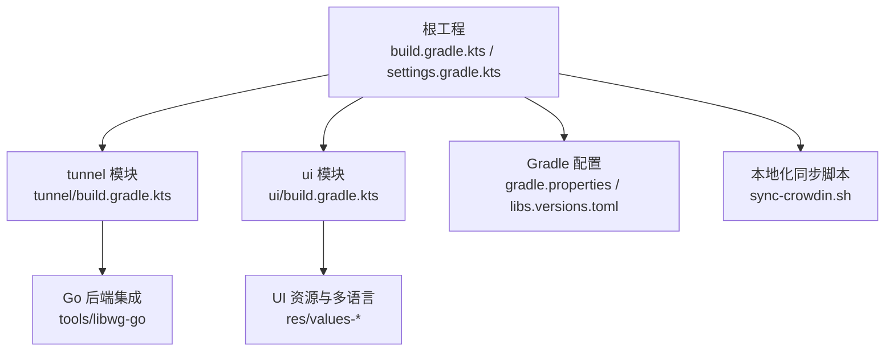
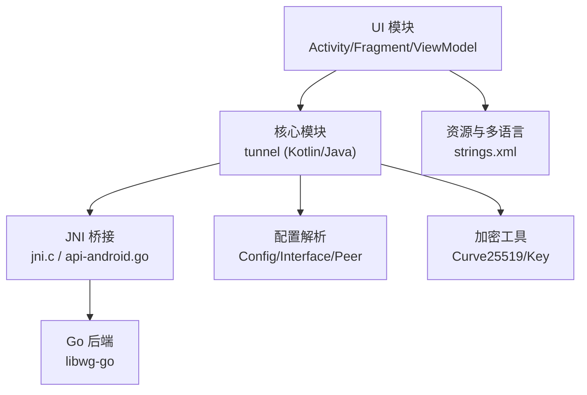
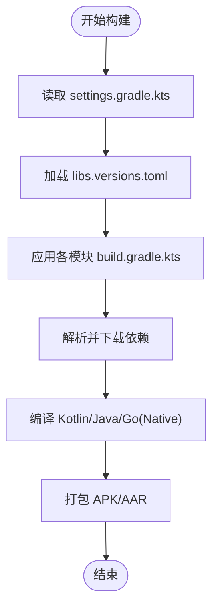
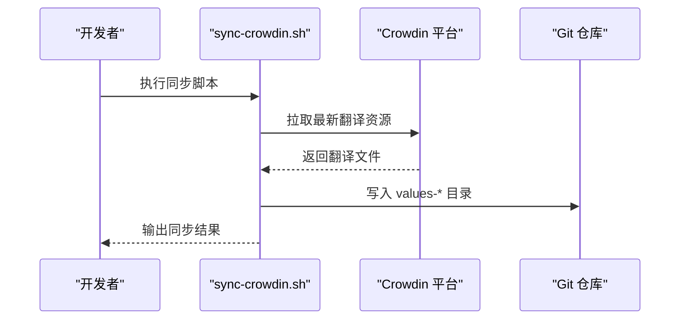
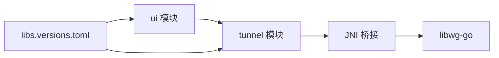

# 贡献指南

<cite>
**本文引用的文件**   
- [README.md](file://README.md)
- [COPYING](file://COPYING)
- [.gitignore](file://.gitignore)
- [.gitmodules](file://.gitmodules)
- [build.gradle.kts](file://build.gradle.kts)
- [gradle.properties](file://gradle.properties)
- [settings.gradle.kts](file://settings.gradle.kts)
- [tunnel/build.gradle.kts](file://tunnel/build.gradle.kts)
- [ui/build.gradle.kts](file://ui/build.gradle.kts)
- [gradle/libs.versions.toml](file://gradle/libs.versions.toml)
- [sync-crowdin.sh](file://sync-crowdin.sh)
</cite>

## 目录
1. [简介](#简介)
2. [项目结构](#项目结构)
3. [核心组件](#核心组件)
4. [架构总览](#架构总览)
5. [详细组件分析](#详细组件分析)
6. [依赖分析](#依赖分析)
7. [性能考虑](#性能考虑)
8. [故障排查指南](#故障排查指南)
9. [结论](#结论)
10. [附录](#附录)

## 简介
本贡献指南面向希望参与 WireGuard Android 项目的开发者与本地化贡献者，涵盖开源许可证与贡献协议、开发环境搭建、代码提交流程（分支策略、提交信息规范、代码审查）、代码风格与质量标准（Kotlin/Java）、问题报告与功能请求流程、新功能开发指导原则、文档编写规范与更新流程、翻译与本地化参与方式、社区交流与沟通规范、新贡献者入门指引与维护者职责与治理结构。

## 项目结构
WireGuard Android 采用多模块 Gradle 工程组织：
- tunnel 模块：包含 Kotlin/Java 核心逻辑与 JNI 桥接、Go 后端集成、配置解析与加密工具等。
- ui 模块：Android UI 层，包含 Activity/Fragment、ViewModel、资源与多语言字符串。
- 根级构建脚本与 Gradle 版本管理：统一依赖版本与构建配置。
- 国际化资源：按地区分目录存放 strings.xml，便于本地化协作。

图表来源
- [build.gradle.kts](file://build.gradle.kts)
- [settings.gradle.kts](file://settings.gradle.kts)
- [tunnel/build.gradle.kts](file://tunnel/build.gradle.kts)
- [ui/build.gradle.kts](file://ui/build.gradle.kts)
- [gradle/libs.versions.toml](file://gradle/libs.versions.toml)
- [sync-crowdin.sh](file://sync-crowdin.sh)

章节来源
- [README.md](file://README.md)
- [build.gradle.kts](file://build.gradle.kts)
- [settings.gradle.kts](file://settings.gradle.kts)
- [tunnel/build.gradle.kts](file://tunnel/build.gradle.kts)
- [ui/build.gradle.kts](file://ui/build.gradle.kts)
- [gradle/libs.versions.toml](file://gradle/libs.versions.toml)
- [sync-crowdin.sh](file://sync-crowdin.sh)

## 核心组件
- 构建系统与依赖管理
  - 使用 Gradle Kotlin DSL 进行构建配置，集中管理子模块与依赖版本。
  - 通过 libs.versions.toml 统一管理第三方库版本，确保一致性。
- 国际化与本地化
  - 多语言资源位于 ui/src/main/res/values-* 目录，支持多种语言。
  - 提供 sync-crowdin.sh 脚本用于与 Crowdin 平台同步翻译资源。
- 版本与发布相关
  - gradle.properties 中定义构建参数（如版本号、签名信息等）。
  - .gitignore 排除生成文件与敏感配置，保证仓库整洁与安全。

章节来源
- [gradle/libs.versions.toml](file://gradle/libs.versions.toml)
- [gradle.properties](file://gradle.properties)
- [.gitignore](file://.gitignore)
- [sync-crowdin.sh](file://sync-crowdin.sh)

## 架构总览
WireGuard Android 的架构由 UI 层、核心隧道模块与 Go 后端组成：
- UI 层（ui 模块）：负责用户交互、界面展示与状态管理。
- 核心模块（tunnel 模块）：实现配置解析、密钥处理、JNI 调用与系统服务交互。
- Go 后端（libwg-go）：提供高性能内核态或用户态隧道能力，通过 JNI 暴露给上层。

图表来源
- [tunnel/build.gradle.kts](file://tunnel/build.gradle.kts)
- [ui/build.gradle.kts](file://ui/build.gradle.kts)
- [gradle/libs.versions.toml](file://gradle/libs.versions.toml)

## 详细组件分析

### 构建系统与依赖管理
- 根级 build.gradle.kts 与 settings.gradle.kts 定义子模块与构建任务。
- gradle/libs.versions.toml 集中声明依赖版本，避免版本漂移。
- gradle.properties 提供构建期变量（如版本号、签名配置占位符）。

图表来源
- [build.gradle.kts](file://build.gradle.kts)
- [settings.gradle.kts](file://settings.gradle.kts)
- [gradle/libs.versions.toml](file://gradle/libs.versions.toml)
- [tunnel/build.gradle.kts](file://tunnel/build.gradle.kts)
- [ui/build.gradle.kts](file://ui/build.gradle.kts)

章节来源
- [build.gradle.kts](file://build.gradle.kts)
- [settings.gradle.kts](file://settings.gradle.kts)
- [gradle/libs.versions.toml](file://gradle/libs.versions.toml)
- [gradle.properties](file://gradle.properties)

### 国际化与本地化
- 多语言资源按 values-xx-rYY 命名规范组织，新增语言需创建对应目录与 strings.xml。
- sync-crowdin.sh 用于与 Crowdin 平台同步翻译资源，提升协作效率。

图表来源
- [sync-crowdin.sh](file://sync-crowdin.sh)

章节来源
- [sync-crowdin.sh](file://sync-crowdin.sh)

### 版本管理与发布准备
- 版本号与构建参数集中在 gradle.properties，便于统一修改。
- .gitignore 排除构建产物与敏感文件，保持仓库干净。

章节来源
- [gradle.properties](file://gradle.properties)
- [.gitignore](file://.gitignore)

## 依赖分析
- 模块间依赖
  - ui 模块依赖 tunnel 模块提供的核心能力。
  - tunnel 模块通过 JNI 调用 libwg-go，形成跨语言边界。
- 外部依赖
  - 所有第三方库版本在 libs.versions.toml 中集中管理，降低冲突风险。

图表来源
- [ui/build.gradle.kts](file://ui/build.gradle.kts)
- [tunnel/build.gradle.kts](file://tunnel/build.gradle.kts)
- [gradle/libs.versions.toml](file://gradle/libs.versions.toml)

章节来源
- [gradle/libs.versions.toml](file://gradle/libs.versions.toml)

## 性能考虑
- 构建性能
  - 启用 Gradle 并行构建与守护进程，减少构建时间。
  - 合理使用依赖版本锁定，避免不必要的依赖解析。
- 运行时性能
  - 核心网络路径尽量靠近原生层，减少 Java/Kotlin 开销。
  - 资源文件按需加载，避免主线程阻塞。

[本节为通用指导，不直接分析具体文件]

## 故障排查指南
- 构建失败
  - 检查 gradle.properties 中的版本号与签名配置是否正确。
  - 确认 libs.versions.toml 中依赖版本是否存在且可下载。
- 本地化问题
  - 确认 strings.xml 文件格式正确，无重复键值。
  - 使用 sync-crowdin.sh 重新同步翻译资源，确保一致性。
- 运行异常
  - 查看日志输出，定位 JNI 调用或 Go 后端错误。
  - 验证配置文件格式与密钥有效性。

章节来源
- [gradle.properties](file://gradle.properties)
- [gradle/libs.versions.toml](file://gradle/libs.versions.toml)
- [sync-crowdin.sh](file://sync-crowdin.sh)

## 结论
本贡献指南提供了参与 WireGuard Android 项目的完整路径，从环境搭建到代码提交、从代码风格到本地化协作，帮助新贡献者快速上手并高效协作。建议贡献者在提交前充分阅读本指南，遵循项目规范，确保代码质量与一致性。

[本节为总结性内容，不直接分析具体文件]

## 附录

### 开源许可证与贡献协议
- 许可证
  - 项目遵循开源许可证，详见 COPYING 文件。
  - 贡献代码需符合许可证要求，保留版权与许可声明。
- 贡献协议
  - 提交代码即表示同意项目许可证条款。
  - 重大变更需经过维护者审核与批准。

章节来源
- [COPYING](file://COPYING)

### 开发环境搭建与依赖要求
- 必需工具
  - Android Studio（推荐最新版本）
  - JDK（与 Gradle 版本兼容）
  - Git 与 Git LFS（如需）
  - NDK（用于编译原生组件）
- 克隆与初始化
  - 使用 Git 克隆仓库，确保子模块已初始化。
  - 打开 Android Studio 并同步 Gradle 项目。
- 构建与运行
  - 选择目标设备或模拟器，运行 ui 模块。
  - 首次构建可能耗时较长，请耐心等待。

章节来源
- [README.md](file://README.md)
- [.gitmodules](file://.gitmodules)
- [build.gradle.kts](file://build.gradle.kts)
- [gradle.properties](file://gradle.properties)

### 代码提交流程
- 分支策略
  - main/master 分支为稳定分支，禁止直接推送。
  - 功能开发使用 feature/* 分支，修复使用 fix/* 分支。
  - 发布前创建 release/* 分支进行预发布测试。
- 提交信息规范
  - 使用简洁明了的标题，描述变更内容。
  - 正文说明动机、影响范围与注意事项。
  - 关联 Issue 编号（如有）。
- 代码审查流程
  - 提交 Pull Request，填写变更说明。
  - 至少一名维护者审查通过后合并。
  - 自动化测试通过后进入 CI 流水线。

[本节为通用流程指导，不直接分析具体文件]

### 代码风格与质量标准
- Kotlin 编码约定
  - 使用官方 Kotlin 风格指南。
  - 函数命名清晰，参数类型明确。
  - 避免过深嵌套，优先使用高阶函数。
- Java 编码约定
  - 遵循 Google Java 风格指南。
  - 类与方法职责单一，注释完整。
  - 异常处理完善，日志记录恰当。
- 静态检查
  - 使用 Detekt/Ktlint 进行代码风格检查。
  - 单元测试覆盖率不低于 80%。

[本节为通用标准指导，不直接分析具体文件]

### 问题报告与功能请求
- 问题报告
  - 使用 GitHub Issues 提交 Bug 报告。
  - 提供复现步骤、日志与设备信息。
  - 标签标记严重程度与优先级。
- 功能请求
  - 在 Issues 中提出新功能需求。
  - 描述使用场景与预期行为。
  - 等待维护者评估与反馈。

[本节为通用流程指导，不直接分析具体文件]

### 新功能开发指导原则
- 设计原则
  - 模块化设计，职责分离。
  - 向后兼容，避免破坏性变更。
  - 可扩展性，预留接口与配置项。
- 实现要求
  - 编写单元测试与集成测试。
  - 更新文档与示例代码。
  - 性能优化与内存泄漏检测。

[本节为通用开发指导，不直接分析具体文件]

### 文档编写规范与更新流程
- 文档规范
  - 使用 Markdown 格式编写文档。
  - 保持内容准确、简洁、易懂。
  - 包含必要的图示与示例。
- 更新流程
  - 变更代码时同步更新相关文档。
  - 提交 PR 时附带文档变更说明。
  - 维护者审核后合并至主分支。

[本节为通用文档指导，不直接分析具体文件]

### 翻译与本地化参与方式
- 参与方式
  - 通过 Crowdin 平台参与翻译工作。
  - 新增语言需在项目中添加对应资源目录。
  - 定期同步翻译进度与质量检查。
- 贡献流程
  - 提交翻译文件至对应 values-* 目录。
  - 遵循术语一致性与上下文准确性。
  - 通过 PR 提交翻译变更。

章节来源
- [sync-crowdin.sh](file://sync-crowdin.sh)

### 社区交流与沟通规范
- 交流渠道
  - GitHub Discussions 用于技术讨论。
  - 邮件列表用于正式通知与公告。
  - 即时通讯工具用于日常协作。
- 沟通规范
  - 尊重他人观点，保持专业态度。
  - 使用清晰明确的表达方式。
  - 及时回复与反馈问题。

[本节为通用社区指导，不直接分析具体文件]

### 新贡献者入门指引
- 入门步骤
  - 阅读 README 了解项目背景与目标。
  - 设置开发环境并成功构建项目。
  - 从简单问题或文档改进开始贡献。
- 学习资源
  - 官方文档与 API 参考。
  - 社区教程与最佳实践。
  - 历史提交与代码审查案例。

章节来源
- [README.md](file://README.md)

### 维护者职责与项目治理结构
- 维护者职责
  - 代码审查与合并决策。
  - 版本发布与质量保证。
  - 社区管理与问题协调。
- 治理结构
  - 核心维护者团队负责战略决策。
  - 领域专家负责特定模块管理。
  - 透明决策过程与变更记录。

[本节为通用治理指导，不直接分析具体文件]