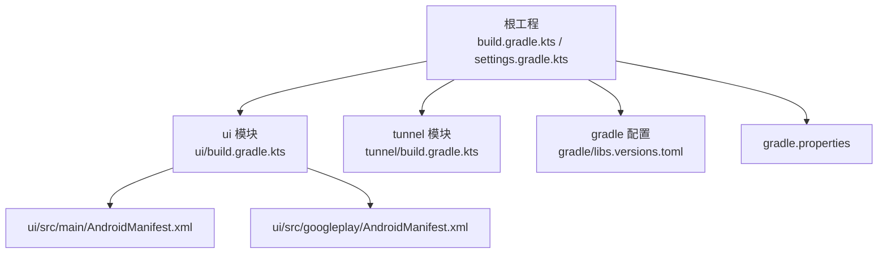
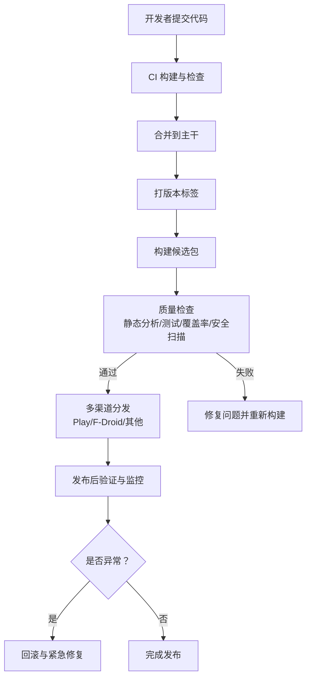
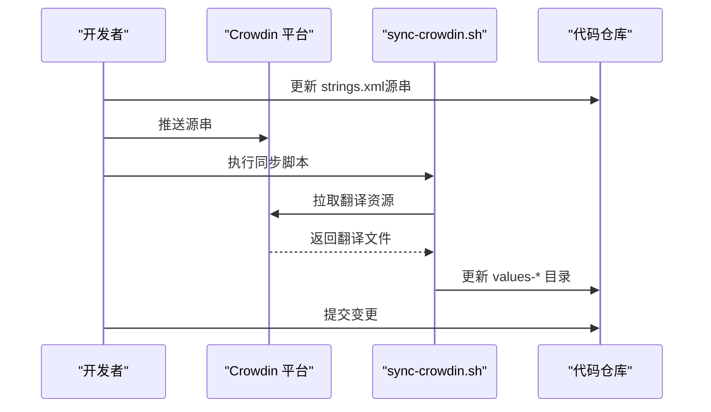
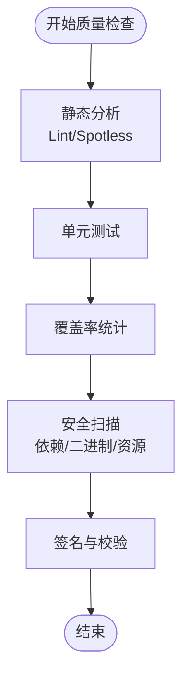
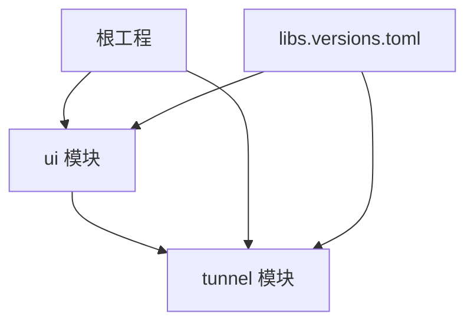

# 发布流程

<cite>
**本文引用的文件**   
- [README.md](file://README.md)
- [build.gradle.kts](file://build.gradle.kts)
- [gradle.properties](file://gradle.properties)
- [settings.gradle.kts](file://settings.gradle.kts)
- [gradle/libs.versions.toml](file://gradle/libs.versions.toml)
- [tunnel/build.gradle.kts](file://tunnel/build.gradle.kts)
- [ui/build.gradle.kts](file://ui/build.gradle.kts)
- [ui/src/main/AndroidManifest.xml](file://ui/src/main/AndroidManifest.xml)
- [ui/src/googleplay/AndroidManifest.xml](file://ui/src/googleplay/AndroidManifest.xml)
- [sync-crowdin.sh](file://sync-crowdin.sh)
</cite>

## 目录
1. [简介](#简介)
2. [项目结构](#项目结构)
3. [核心组件](#核心组件)
4. [架构总览](#架构总览)
5. [详细组件分析](#详细组件分析)
6. [依赖分析](#依赖分析)
7. [性能考虑](#性能考虑)
8. [故障排查指南](#故障排查指南)
9. [结论](#结论)
10. [附录](#附录)

## 简介
本文件为 WireGuard Android 项目的完整发布流程文档，覆盖版本管理、分支策略、语义化版本控制、Git 工作流、国际化资源同步（Crowdin）、代码审查与合并流程、发布前质量检查（静态分析、测试覆盖率、安全扫描）、多渠道发布配置（Google Play Store、F-Droid 及其他分发平台）、发布后验证与监控、回滚策略与紧急修复流程，以及发布自动化脚本使用指南。内容基于仓库现有构建与资源配置进行梳理，确保可操作性和一致性。

## 项目结构
本项目采用多模块 Gradle 工程：
- ui：Android 应用主模块，包含界面、资源、清单及渠道变体（如 googleplay）。
- tunnel：底层隧道实现与 JNI 桥接，包含 Go 后端与工具链。
- gradle：Gradle 包装器与统一依赖版本管理（libs.versions.toml）。
- 根级构建脚本与属性：定义全局构建行为与变量。

**图表来源** 
- [build.gradle.kts](file://build.gradle.kts)
- [settings.gradle.kts](file://settings.gradle.kts)
- [ui/build.gradle.kts](file://ui/build.gradle.kts)
- [tunnel/build.gradle.kts](file://tunnel/build.gradle.kts)
- [gradle/libs.versions.toml](file://gradle/libs.versions.toml)
- [ui/src/main/AndroidManifest.xml](file://ui/src/main/AndroidManifest.xml)
- [ui/src/googleplay/AndroidManifest.xml](file://ui/src/googleplay/AndroidManifest.xml)

**章节来源**
- [README.md](file://README.md)
- [build.gradle.kts](file://build.gradle.kts)
- [settings.gradle.kts](file://settings.gradle.kts)
- [gradle/libs.versions.toml](file://gradle/libs.versions.toml)

## 核心组件
- 版本与元数据
  - 应用版本号与名称由 AndroidManifest 中的 application 节点提供，作为发布产物标识的基础。
  - Gradle 属性 gradle.properties 用于集中管理构建参数（如签名、编译选项等）。
- 构建与打包
  - 根 build.gradle.kts 与模块 build.gradle.kts 协调依赖版本、插件与任务。
  - libs.versions.toml 统一管理第三方库版本，保证跨模块一致性与可复现性。
- 渠道与变体
  - ui 模块通过 src/googleplay 下的 AndroidManifest.xml 提供 Google Play 渠道特定配置，支持差异化发布。
- 国际化资源
  - 多语言 strings.xml 位于 ui/src/main/res/values-* 目录；通过 sync-crowdin.sh 脚本与 Crowdin 集成，实现翻译资源的拉取与推送。

**章节来源**
- [ui/src/main/AndroidManifest.xml](file://ui/src/main/AndroidManifest.xml)
- [gradle.properties](file://gradle.properties)
- [build.gradle.kts](file://build.gradle.kts)
- [ui/build.gradle.kts](file://ui/build.gradle.kts)
- [tunnel/build.gradle.kts](file://tunnel/build.gradle.kts)
- [gradle/libs.versions.toml](file://gradle/libs.versions.toml)
- [ui/src/googleplay/AndroidManifest.xml](file://ui/src/googleplay/AndroidManifest.xml)
- [sync-crowdin.sh](file://sync-crowdin.sh)

## 架构总览
发布流水线概览（概念图）：
- 开发者提交代码至功能分支，触发 CI 构建与检查。
- 合并到主干后打标签并生成候选包。
- 执行静态分析、单元测试、覆盖率与安全扫描。
- 生成多渠道产物（Play/F-Droid/其他），上传至对应平台。
- 发布后进行冒烟测试与监控告警。

[此图为概念流程图，不直接映射具体源码文件]

## 详细组件分析

### 版本管理与分支策略
- 语义化版本控制
  - 遵循 MAJOR.MINOR.PATCH 规范，变更类型决定版本号递增规则。
  - 版本号在 AndroidManifest 的 application 节点中体现，作为产物标识基础。
- 分支模型
  - 主干分支（main/release）用于稳定版本维护。
  - 功能分支（feature/*）用于开发新功能，完成后通过 PR 合并。
  - 热修复分支（hotfix/*）针对线上问题进行快速修复。
- Git 工作流
  - 提交信息遵循约定式提交（Conventional Commits），便于自动生成变更日志。
  - 合并前需通过代码审查与 CI 检查。

**章节来源**
- [ui/src/main/AndroidManifest.xml](file://ui/src/main/AndroidManifest.xml)
- [README.md](file://README.md)

### 国际化资源同步（Crowdin）
- 资源位置
  - 多语言字符串资源位于 ui/src/main/res/values-* 目录。
- 同步脚本
  - 使用 sync-crowdin.sh 与 Crowdin 集成，支持拉取翻译与推送源串。
- 流程建议
  - 新增或修改源串后，先推送至 Crowdin。
  - 运行脚本拉取翻译，校验差异后提交。
  - 发布前确保所有目标语言的翻译完整性。

**图表来源** 
- [sync-crowdin.sh](file://sync-crowdin.sh)
- [ui/src/main/AndroidManifest.xml](file://ui/src/main/AndroidManifest.xml)

**章节来源**
- [sync-crowdin.sh](file://sync-crowdin.sh)
- [ui/src/main/AndroidManifest.xml](file://ui/src/main/AndroidManifest.xml)

### 代码审查与合并流程
- Pull Request 规范
  - 标题与描述清晰说明变更目的与影响范围。
  - 关联相关 Issue 或需求编号。
  - 包含必要的测试用例与截图（如涉及 UI）。
- 检查清单
  - 代码风格与静态分析通过。
  - 单元测试与集成测试通过。
  - 无敏感信息泄露（密钥、证书等）。
  - 变更日志已更新（如适用）。
- 合并策略
  - 至少一名维护者批准。
  - CI 全部绿灯后方可合并。

[本节为通用流程说明，不直接引用具体文件]

### 发布前质量检查
- 静态分析
  - 使用 Lint/Spotless 等工具确保代码质量与格式一致。
- 测试覆盖率
  - 运行单元测试与仪器测试，收集覆盖率报告。
- 安全扫描
  - 依赖漏洞扫描（如 OWASP Dependency-Check）。
  - 二进制与资源安全检查（如 APK 签名、权限最小化）。
- 构建产物
  - 生成签名后的 APK/AAB，并进行签名校验。

[此图为概念流程图，不直接映射具体源码文件]

### 多渠道发布配置
- Google Play Store
  - 使用 ui/src/googleplay/AndroidManifest.xml 进行渠道特定配置。
  - 构建 AAB 并通过 Play Console 上传。
- F-Droid
  - 遵循 F-Droid 构建要求，确保依赖开源且可复现。
  - 提交构建配方至 F-Droid 仓库。
- 其他分发平台
  - 根据平台要求生成相应产物（APK/AAB），并上传至自有服务器或第三方托管。

**章节来源**
- [ui/src/googleplay/AndroidManifest.xml](file://ui/src/googleplay/AndroidManifest.xml)
- [ui/build.gradle.kts](file://ui/build.gradle.kts)

### 发布后验证与监控
- 冒烟测试
  - 安装最新包，验证核心功能（连接、配置导入导出、设置项等）。
- 监控设置
  - 接入崩溃上报与性能监控（如 Firebase Crashlytics、Sentry）。
  - 关注用户反馈与应用商店评论。
- 健康检查
  - 定期检查后台服务状态与网络连通性。

[本节为通用流程说明，不直接引用具体文件]

### 回滚策略与紧急修复
- 回滚策略
  - 优先回退至上一稳定版本，避免扩大影响面。
  - 保留问题版本快照以便后续分析。
- 紧急修复流程
  - 创建 hotfix/* 分支，快速修复问题。
  - 走简化版审查与 CI 流程，尽快发布补丁版本。
  - 通知用户并更新变更日志。

[本节为通用流程说明，不直接引用具体文件]

### 发布自动化脚本使用指南
- 脚本职责
  - 执行构建、签名、测试、扫描与上传等步骤。
- 使用方式
  - 配置环境变量（如签名密钥、平台凭据）。
  - 执行脚本并传入版本参数。
  - 查看输出日志确认各阶段结果。
- 注意事项
  - 确保本地环境满足构建要求（SDK、NDK、JDK 版本）。
  - 妥善保管敏感信息，避免硬编码。

[本节为通用流程说明，不直接引用具体文件]

## 依赖分析
- 模块依赖
  - ui 模块依赖 tunnel 模块提供的底层能力。
  - 根工程通过 settings.gradle.kts 声明子模块。
- 依赖版本管理
  - libs.versions.toml 集中管理第三方库版本，确保一致性。
- 外部依赖
  - Go 后端与 JNI 桥接位于 tunnel/tools/libwg-go。
  - NDK 兼容层位于 tunnel/tools/ndk-compat。

**图表来源** 
- [settings.gradle.kts](file://settings.gradle.kts)
- [ui/build.gradle.kts](file://ui/build.gradle.kts)
- [tunnel/build.gradle.kts](file://tunnel/build.gradle.kts)
- [gradle/libs.versions.toml](file://gradle/libs.versions.toml)

**章节来源**
- [settings.gradle.kts](file://settings.gradle.kts)
- [ui/build.gradle.kts](file://ui/build.gradle.kts)
- [tunnel/build.gradle.kts](file://tunnel/build.gradle.kts)
- [gradle/libs.versions.toml](file://gradle/libs.versions.toml)

## 性能考虑
- 构建优化
  - 启用增量构建与并行编译。
  - 缓存依赖与构建产物。
- 运行时性能
  - 减少不必要的资源加载与初始化。
  - 优化网络请求与数据处理逻辑。
- 内存与功耗
  - 避免长时间持有大对象与上下文。
  - 合理使用后台任务与唤醒锁。

[本节为通用指导，不直接引用具体文件]

## 故障排查指南
- 构建失败
  - 检查 JDK/SDK/NDK 版本与环境变量。
  - 清理构建缓存并重新构建。
- 测试失败
  - 定位失败用例，检查依赖与模拟数据。
  - 增加日志输出以辅助调试。
- 安全扫描告警
  - 升级存在漏洞的依赖。
  - 审查自定义代码是否存在安全风险。
- 发布失败
  - 检查签名与凭据配置。
  - 确认平台限制与配额。

[本节为通用指导，不直接引用具体文件]

## 结论
本文档系统化梳理了 WireGuard Android 项目的发布流程，涵盖版本管理、分支策略、国际化同步、代码审查、质量检查、多渠道发布、发布后验证与监控、回滚与紧急修复，以及自动化脚本使用。通过遵循本文档所述流程，团队可确保发布过程的可控性与高质量交付。

## 附录
- 术语表
  - 语义化版本控制：MAJOR.MINOR.PATCH 版本命名规范。
  - CI/CD：持续集成与持续交付。
  - AAB/APK：Android App Bundle 与 Android Package 安装包格式。
- 参考链接
  - 项目 README 与贡献指南。
  - Crowdin 平台文档。
  - Google Play 与 F-Droid 发布规范。

[本节为补充信息，不直接引用具体文件]