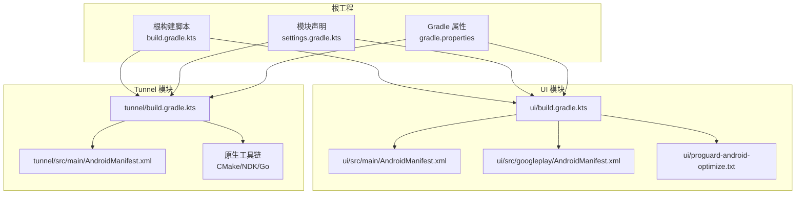
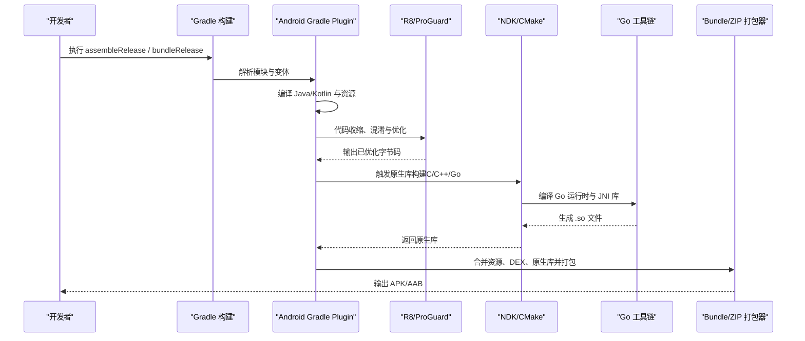
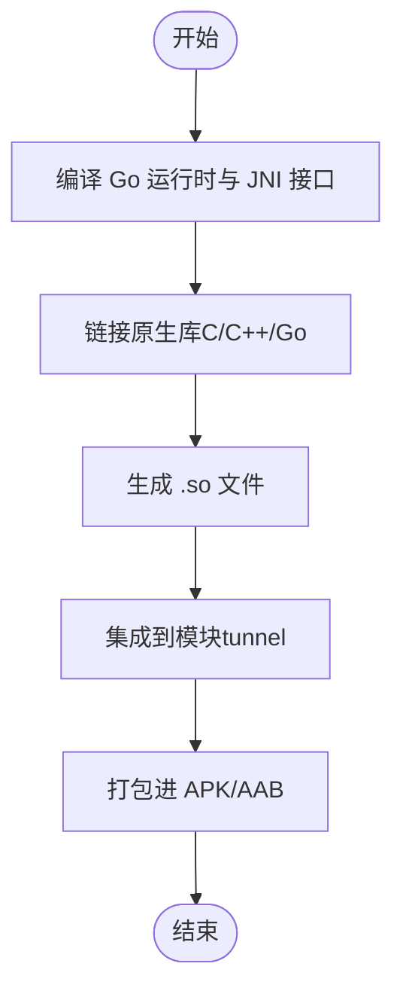
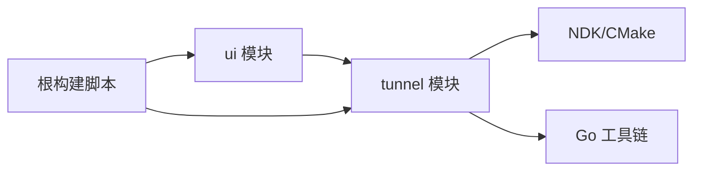

# 打包与优化

<cite>
**本文引用的文件**   
- [build.gradle.kts](file://build.gradle.kts)
- [settings.gradle.kts](file://settings.gradle.kts)
- [gradle.properties](file://gradle.properties)
- [tunnel/build.gradle.kts](file://tunnel/build.gradle.kts)
- [ui/build.gradle.kts](file://ui/build.gradle.kts)
- [ui/proguard-android-optimize.txt](file://ui/proguard-android-optimize.txt)
- [tunnel/tools/libwg-go/Makefile](file://tunnel/tools/libwg-go/Makefile)
- [tunnel/tools/libwg-go/api-android.go](file://tunnel/tools/libwg-go/api-android.go)
- [tunnel/tools/libwg-go/jni.c](file://tunnel/tools/libwg-go/jni.c)
- [tunnel/src/main/AndroidManifest.xml](file://tunnel/src/main/AndroidManifest.xml)
- [ui/src/main/AndroidManifest.xml](file://ui/src/main/AndroidManifest.xml)
- [ui/src/googleplay/AndroidManifest.xml](file://ui/src/googleplay/AndroidManifest.xml)
- [tunnel/tools/CMakeLists.txt](file://tunnel/tools/CMakeLists.txt)
</cite>

## 目录
1. [简介](#简介)
2. [项目结构](#项目结构)
3. [核心组件](#核心组件)
4. [架构总览](#架构总览)
5. [详细组件分析](#详细组件分析)
6. [依赖关系分析](#依赖关系分析)
7. [性能考虑](#性能考虑)
8. [故障排查指南](#故障排查指南)
9. [结论](#结论)
10. [附录](#附录)（如有需要）

## 简介
本文件面向 WireGuard Android 项目的构建工程师与维护者，系统化说明如何生成 APK/AAB、配置签名与多架构支持、ProGuard/R8 混淆与优化、原生库（Go 运行时与 JNI）集成、资源压缩与优化、多 ABI 支持与分包策略，以及包大小优化与性能调优建议，并给出常见错误的排查方法。文档基于仓库中的 Gradle 构建脚本、模块清单与原生工具链配置进行归纳总结，确保与实际代码一致。

## 项目结构
WireGuard Android 采用多模块结构：
- ui 模块：Kotlin/Java UI 层与资源，负责应用界面、设置、更新等逻辑。
- tunnel 模块：核心隧道逻辑，包含 Java/Kotlin 与 Go/JNI 原生实现，提供底层网络能力。
- 根级构建脚本与 Gradle 属性：统一版本管理、构建选项与全局配置。

**图表来源** 
- [build.gradle.kts](file://build.gradle.kts)
- [settings.gradle.kts](file://settings.gradle.kts)
- [gradle.properties](file://gradle.properties)
- [ui/build.gradle.kts](file://ui/build.gradle.kts)
- [ui/src/main/AndroidManifest.xml](file://ui/src/main/AndroidManifest.xml)
- [ui/src/googleplay/AndroidManifest.xml](file://ui/src/googleplay/AndroidManifest.xml)
- [ui/proguard-android-optimize.txt](file://ui/proguard-android-optimize.txt)
- [tunnel/build.gradle.kts](file://tunnel/build.gradle.kts)
- [tunnel/src/main/AndroidManifest.xml](file://tunnel/src/main/AndroidManifest.xml)
- [tunnel/tools/CMakeLists.txt](file://tunnel/tools/CMakeLists.txt)

**章节来源**
- [build.gradle.kts](file://build.gradle.kts)
- [settings.gradle.kts](file://settings.gradle.kts)
- [gradle.properties](file://gradle.properties)
- [ui/build.gradle.kts](file://ui/build.gradle.kts)
- [tunnel/build.gradle.kts](file://tunnel/build.gradle.kts)

## 核心组件
- 构建系统与模块编排：通过根级 build.gradle.kts 与 settings.gradle.kts 定义模块、插件与公共依赖；gradle.properties 控制构建行为（如并行、内存、R8/AGP 版本等）。
- UI 模块：包含应用入口、界面与资源，使用 ProGuard/R8 进行混淆与优化。
- Tunnel 模块：封装 Go 后端与 JNI 桥接，编译原生库并随 APK/AAB 分发。
- 清单与变体：ui 模块提供 googleplay 源集以适配商店渠道差异；各模块清单声明权限与组件。

**章节来源**
- [build.gradle.kts](file://build.gradle.kts)
- [settings.gradle.kts](file://settings.gradle.kts)
- [gradle.properties](file://gradle.properties)
- [ui/build.gradle.kts](file://ui/build.gradle.kts)
- [tunnel/build.gradle.kts](file://tunnel/build.gradle.kts)
- [ui/src/main/AndroidManifest.xml](file://ui/src/main/AndroidManifest.xml)
- [ui/src/googleplay/AndroidManifest.xml](file://ui/src/googleplay/AndroidManifest.xml)
- [tunnel/src/main/AndroidManifest.xml](file://tunnel/src/main/AndroidManifest.xml)

## 架构总览
下图展示从源码到产物（APK/AAB）的端到端流程，包括 Java/Kotlin 编译、资源处理、ProGuard/R8 优化、原生库构建与打包。

**图表来源** 
- [ui/build.gradle.kts](file://ui/build.gradle.kts)
- [tunnel/build.gradle.kts](file://tunnel/build.gradle.kts)
- [tunnel/tools/CMakeLists.txt](file://tunnel/tools/CMakeLists.txt)
- [tunnel/tools/libwg-go/Makefile](file://tunnel/tools/libwg-go/Makefile)

## 详细组件分析

### APK 与 AAB 生成流程
- 目标任务：
  - APK：assembleRelease 生成调试或发布版 APK。
  - AAB：bundleRelease 生成 Google Play 所需的 AAB 包。
- 关键步骤：
  - 编译 Kotlin/Java 与资源。
  - 运行 R8/ProGuard 进行代码优化与混淆。
  - 构建原生库（NDK/CMake/Go）。
  - 打包 DEX、资源与原生库为 APK/AAB。
- 变体与源集：
  - ui 模块包含 googleplay 源集，用于渠道差异化配置（如清单覆盖）。
  - 可通过 buildTypes 与 productFlavors 扩展更多变体。

**章节来源**
- [ui/build.gradle.kts](file://ui/build.gradle.kts)
- [tunnel/build.gradle.kts](file://tunnel/build.gradle.kts)
- [ui/src/googleplay/AndroidManifest.xml](file://ui/src/googleplay/AndroidManifest.xml)

### 签名配置
- 发布签名：在 release 构建类型中配置 keystore、alias、密码等信息，确保产物具备有效签名。
- 本地调试签名：debug 构建类型通常自动签名，便于快速测试。
- 安全建议：避免将密钥明文写入脚本，建议使用环境变量或外部密钥管理服务。

**章节来源**
- [ui/build.gradle.kts](file://ui/build.gradle.kts)
- [tunnel/build.gradle.kts](file://tunnel/build.gradle.kts)
- [gradle.properties](file://gradle.properties)

### 多架构（ABI）支持与分包策略
- 支持的 ABI：通常为 arm64-v8a、armeabi-v7a、x86_64、x86。
- 配置要点：
  - 在 abiFilters 中限定需要的 ABI，减少包体积。
  - 启用 splitPerAbi 或基于 ABIs 的分包，使商店按设备 ABI 下发对应包。
  - 原生库构建需针对每个 ABI 分别编译。
- 分包效果：
  - 降低单包大小，提升下载与安装速度。
  - 提高兼容性，避免加载不匹配的原生库。

**章节来源**
- [ui/build.gradle.kts](file://ui/build.gradle.kts)
- [tunnel/build.gradle.kts](file://tunnel/build.gradle.kts)
- [tunnel/tools/CMakeLists.txt](file://tunnel/tools/CMakeLists.txt)

### ProGuard/R8 混淆与优化
- 混淆规则：
  - 保留反射与 JNI 相关类与方法，避免运行时找不到符号。
  - 保留序列化、反序列化与数据绑定相关成员。
  - 排除第三方库中需要保持原样的类。
- 优化选项：
  - 启用代码收缩、无用代码移除、字节码优化。
  - 调整优化级别与日志输出，定位问题。
- 调试信息：
  - 发布构建默认移除调试符号，减小体积。
  - 如需崩溃堆栈映射，保留 mapping 文件并上传至分析平台。

**章节来源**
- [ui/proguard-android-optimize.txt](file://ui/proguard-android-optimize.txt)
- [ui/build.gradle.kts](file://ui/build.gradle.kts)

### 原生库打包策略（Go 运行时与 JNI）
- Go 后端：
  - 通过 Makefile 与 Go 工具链编译 Go 运行时与 JNI 接口。
  - api-android.go 暴露给 JNI 的 API，jni.c 实现 C 侧桥接。
- NDK/CMake：
  - CMakeLists.txt 描述原生库构建过程，链接 Go 生成的库与系统库。
- 打包策略：
  - 将编译后的 .so 文件随 APK/AAB 分发。
  - 确保 ABI 与设备匹配，避免 UnsatisfiedLinkError。

**图表来源** 
- [tunnel/tools/libwg-go/Makefile](file://tunnel/tools/libwg-go/Makefile)
- [tunnel/tools/libwg-go/api-android.go](file://tunnel/tools/libwg-go/api-android.go)
- [tunnel/tools/libwg-go/jni.c](file://tunnel/tools/libwg-go/jni.c)
- [tunnel/tools/CMakeLists.txt](file://tunnel/tools/CMakeLists.txt)

**章节来源**
- [tunnel/tools/libwg-go/Makefile](file://tunnel/tools/libwg-go/Makefile)
- [tunnel/tools/libwg-go/api-android.go](file://tunnel/tools/libwg-go/api-android.go)
- [tunnel/tools/libwg-go/jni.c](file://tunnel/tools/libwg-go/jni.c)
- [tunnel/tools/CMakeLists.txt](file://tunnel/tools/CMakeLists.txt)

### 资源压缩与优化
- 图片资源：
  - 使用矢量图（XML drawable）替代位图，减少体积。
  - 对位图进行无损压缩或按需裁剪。
- 字符串资源：
  - 移除未使用的字符串与重复项。
  - 按语言拆分资源，仅包含必要语言。
- 其他资源：
  - 清理未引用的布局、样式与动画。
  - 启用资源压缩与 shrinkResources。

**章节来源**
- [ui/build.gradle.kts](file://ui/build.gradle.kts)

### 清单与渠道差异
- 主清单：声明权限、组件与基础配置。
- 渠道清单：googleplay 源集可覆盖或补充主清单，适配商店要求。

**章节来源**
- [ui/src/main/AndroidManifest.xml](file://ui/src/main/AndroidManifest.xml)
- [ui/src/googleplay/AndroidManifest.xml](file://ui/src/googleplay/AndroidManifest.xml)
- [tunnel/src/main/AndroidManifest.xml](file://tunnel/src/main/AndroidManifest.xml)

## 依赖关系分析
- 模块间依赖：
  - ui 模块依赖 tunnel 模块提供的原生能力。
  - 根构建脚本统一管理插件与版本。
- 原生依赖：
  - NDK/CMake 与 Go 工具链协同工作，生成平台特定的 .so。
- 构建依赖：
  - AGP、R8/ProGuard、NDK、Go 工具链的版本需兼容。

**图表来源** 
- [build.gradle.kts](file://build.gradle.kts)
- [ui/build.gradle.kts](file://ui/build.gradle.kts)
- [tunnel/build.gradle.kts](file://tunnel/build.gradle.kts)
- [tunnel/tools/CMakeLists.txt](file://tunnel/tools/CMakeLists.txt)

**章节来源**
- [build.gradle.kts](file://build.gradle.kts)
- [ui/build.gradle.kts](file://ui/build.gradle.kts)
- [tunnel/build.gradle.kts](file://tunnel/build.gradle.kts)

## 性能考虑
- 构建性能：
  - 启用 Gradle 并行与守护进程，合理分配 JVM 内存。
  - 缓存 NDK/Go 构建产物，避免重复编译。
- 运行性能：
  - 通过 R8/ProGuard 移除无用代码，减少启动时间。
  - 精简 ABI 与资源，降低内存占用与 I/O 开销。
- 包大小：
  - 使用 AAB 与 ABI 分包，按需下发。
  - 启用资源压缩与代码收缩。

[本节为通用指导，无需特定文件来源]

## 故障排查指南
- 常见问题与解决思路：
  - 原生库加载失败：检查 ABI 是否匹配，确认 .so 是否正确打包。
  - ProGuard 混淆导致崩溃：检查保留规则，确保反射与 JNI 符号未被误删。
  - 构建超时或内存不足：调整 Gradle 与 JVM 参数，减少并行度。
  - 渠道清单冲突：核对 googleplay 源集与主清单的差异。
- 诊断手段：
  - 查看构建日志与 R8 报告。
  - 使用 bundletool 校验 AAB。
  - 在设备上打印 JNI 错误与堆栈。

**章节来源**
- [ui/proguard-android-optimize.txt](file://ui/proguard-android-optimize.txt)
- [ui/build.gradle.kts](file://ui/build.gradle.kts)
- [tunnel/build.gradle.kts](file://tunnel/build.gradle.kts)
- [gradle.properties](file://gradle.properties)

## 结论
通过合理的 Gradle 配置、ProGuard/R8 优化、原生库构建与资源压缩，WireGuard Android 能够在保证功能与性能的前提下，显著降低包体积并提升用户体验。遵循本文档的流程与建议，可有效提升构建稳定性与发布质量。

[本节为总结性内容，无需特定文件来源]

## 附录
- 常用命令参考：
  - 生成 APK：./gradlew assembleRelease
  - 生成 AAB：./gradlew bundleRelease
  - 清理构建：./gradlew clean
- 推荐工具：
  - bundletool：AAB 校验与转换
  - R8/ProGuard 报告：分析代码收缩与优化结果

[本节为补充信息，无需特定文件来源]