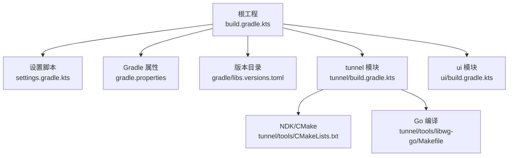
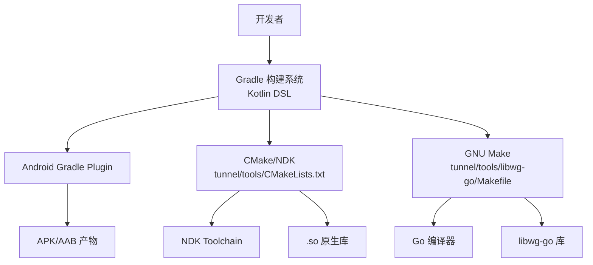
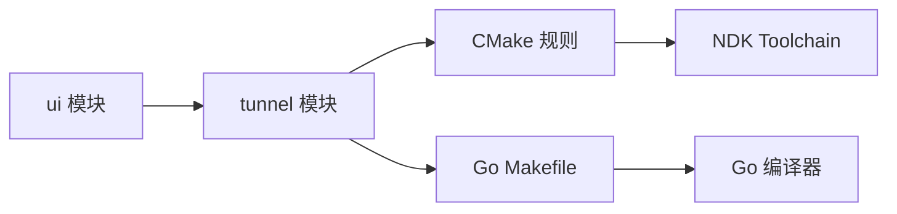

# 构建配置

<cite>
**本文引用的文件**   
- [build.gradle.kts](file://build.gradle.kts)
- [settings.gradle.kts](file://settings.gradle.kts)
- [gradle.properties](file://gradle.properties)
- [libs.versions.toml](file://gradle/libs.versions.toml)
- [tunnel/build.gradle.kts](file://tunnel/build.gradle.kts)
- [ui/build.gradle.kts](file://ui/build.gradle.kts)
- [tunnel/tools/libwg-go/Makefile](file://tunnel/tools/libwg-go/Makefile)
- [tunnel/tools/CMakeLists.txt](file://tunnel/tools/CMakeLists.txt)
</cite>

## 目录
1. [简介](#简介)
2. [项目结构](#项目结构)
3. [核心组件](#核心组件)
4. [架构总览](#架构总览)
5. [详细组件分析](#详细组件分析)
6. [依赖分析](#依赖分析)
7. [性能考虑](#性能考虑)
8. [故障排查指南](#故障排查指南)
9. [结论](#结论)
10. [附录](#附录)

## 简介
本文件面向 WireGuard Android 项目的构建系统，系统性说明 Gradle（Kotlin DSL）在项目级与模块级的构建配置、Gradle 属性、模块依赖管理、集中化版本管理、构建变体差异、NDK 与 Go 编译器集成方式，以及构建性能优化建议与常见问题解决方案。文档力求兼顾技术深度与可读性，帮助开发者快速理解并高效维护构建流程。

## 项目结构
WireGuard Android 采用多模块 Gradle 工程：
- 根目录包含项目级构建脚本与全局设置
- tunnel 模块提供核心后端与原生库集成
- ui 模块提供用户界面与业务逻辑
- gradle/libs.versions.toml 集中管理依赖版本

图表来源
- [build.gradle.kts](file://build.gradle.kts)
- [settings.gradle.kts](file://settings.gradle.kts)
- [gradle.properties](file://gradle.properties)
- [libs.versions.toml](file://gradle/libs.versions.toml)
- [tunnel/build.gradle.kts](file://tunnel/build.gradle.kts)
- [ui/build.gradle.kts](file://ui/build.gradle.kts)
- [tunnel/tools/CMakeLists.txt](file://tunnel/tools/CMakeLists.txt)
- [tunnel/tools/libwg-go/Makefile](file://tunnel/tools/libwg-go/Makefile)

章节来源
- [build.gradle.kts](file://build.gradle.kts)
- [settings.gradle.kts](file://settings.gradle.kts)
- [gradle.properties](file://gradle.properties)
- [libs.versions.toml](file://gradle/libs.versions.toml)
- [tunnel/build.gradle.kts](file://tunnel/build.gradle.kts)
- [ui/build.gradle.kts](file://ui/build.gradle.kts)

## 核心组件
- 项目级构建脚本：统一插件、仓库、公共任务与全局变量
- 模块级构建脚本：定义各模块的 Android 应用/库配置、构建变体、资源与产物处理
- 设置脚本：声明模块、插件管理与构建缓存等
- 版本目录：集中声明依赖与插件版本，供所有模块引用
- Gradle 属性：控制 JVM 内存、并行度、守护进程、签名与调试开关等

章节来源
- [build.gradle.kts](file://build.gradle.kts)
- [settings.gradle.kts](file://settings.gradle.kts)
- [gradle.properties](file://gradle.properties)
- [libs.versions.toml](file://gradle/libs.versions.toml)

## 架构总览
下图展示构建系统与外部工具链的交互关系：Gradle 通过 Kotlin DSL 驱动 Android Gradle Plugin，调用 NDK/CMake 生成原生库，并通过 Makefile 触发 Go 编译产出 libwg-go。

图表来源
- [tunnel/build.gradle.kts](file://tunnel/build.gradle.kts)
- [tunnel/tools/CMakeLists.txt](file://tunnel/tools/CMakeLists.txt)
- [tunnel/tools/libwg-go/Makefile](file://tunnel/tools/libwg-go/Makefile)

## 详细组件分析

### 项目级构建脚本（根 build.gradle.kts）
- 作用：声明全局插件、仓库源、公共依赖与任务；为子模块提供统一的构建环境
- 关键点：
  - 插件与版本由版本目录统一管理
  - 仓库源集中配置，便于切换镜像或私有仓库
  - 公共任务（如清理、检查）可在此扩展
  - 可通过 ext 或版本目录向子模块暴露常量

章节来源
- [build.gradle.kts](file://build.gradle.kts)
- [libs.versions.toml](file://gradle/libs.versions.toml)

### 设置脚本（settings.gradle.kts）
- 作用：声明模块、启用插件管理、配置构建缓存与远程缓存
- 关键点：
  - include 子模块（tunnel、ui）
  - pluginManagement 与 dependencyResolutionManagement 集中化
  - 可配置 Gradle 缓存、并行与离线模式

章节来源
- [settings.gradle.kts](file://settings.gradle.kts)

### 版本目录（gradle/libs.versions.toml）
- 作用：集中管理插件与依赖版本，提升一致性与可维护性
- 关键点：
  - 使用 [versions] 与 [libraries] 段定义版本与别名
  - 子模块通过 alias 引用，避免硬编码版本号
  - 支持平台与 ABI 相关依赖的统一升级

章节来源
- [libs.versions.toml](file://gradle/libs.versions.toml)

### Gradle 属性（gradle.properties）
- 作用：控制 Gradle 运行时与构建行为
- 常见项：
  - org.gradle.jvmargs：JVM 堆大小与 GC 参数
  - org.gradle.parallel：开启并行构建
  - org.gradle.caching：启用构建缓存
  - android.useAndroidX、android.enableJetifier：AndroidX 迁移
  - 签名与调试开关（如 signing.*、debuggable）
  - NDK/SDK 路径与环境变量（若未通过环境变量注入）

章节来源
- [gradle.properties](file://gradle.properties)

### 模块级构建脚本（tunnel/build.gradle.kts）
- 作用：定义 Android 库模块的配置、构建变体、NDK/CMake 集成与 Go 构建任务
- 关键点：
  - 声明 Android Library 插件与依赖
  - 配置 ndk { abiFilters } 与 cmake 目标
  - 自定义任务调用 Makefile 生成 Go 库
  - 将生成的 .so 打包进 AAR/APK

章节来源
- [tunnel/build.gradle.kts](file://tunnel/build.gradle.kts)
- [tunnel/tools/CMakeLists.txt](file://tunnel/tools/CMakeLists.txt)
- [tunnel/tools/libwg-go/Makefile](file://tunnel/tools/libwg-go/Makefile)

### 模块级构建脚本（ui/build.gradle.kts）
- 作用：定义 Android 应用模块的配置、构建变体、资源与签名
- 关键点：
  - 声明 Android Application 插件与依赖
  - 配置 applicationId、versionCode/versionName
  - 构建变体：debug、release、googleplay（清单与资源覆盖）
  - ProGuard/R8 规则与混淆配置

章节来源
- [ui/build.gradle.kts](file://ui/build.gradle.kts)

### NDK 与 CMake 集成（tunnel/tools/CMakeLists.txt）
- 作用：描述原生库的构建规则、源码与依赖
- 关键点：
  - 指定 C/C++ 标准与特性
  - 添加源文件与头文件路径
  - 链接第三方库（如 OpenSSL、mbedTLS 等）
  - 输出目标库名称与安装位置

章节来源
- [tunnel/tools/CMakeLists.txt](file://tunnel/tools/CMakeLists.txt)

### Go 编译器集成（tunnel/tools/libwg-go/Makefile）
- 作用：通过 Makefile 调用 Go 工具链编译 libwg-go
- 关键点：
  - 设置 CGO_ENABLED=1 与目标三元组（GOOS=android）
  - 指定 CC 为 NDK 提供的 clang
  - 交叉编译不同 ABI 的静态库/动态库
  - 输出产物路径与清理规则

章节来源
- [tunnel/tools/libwg-go/Makefile](file://tunnel/tools/libwg-go/Makefile)

### 构建变体差异（debug、release、googleplay）
- 差异点：
  - 清单覆盖：googleplay 可能包含 Google Play 服务或特定权限
  - 资源覆盖：不同变体的字符串、主题与图标
  - 构建类型：debug 启用调试符号与日志，release 启用 R8 与优化
  - 签名：debug 自动签名，release/googleplay 使用正式密钥
  - 功能开关：通过 BuildConfig 或资源值控制功能开关

章节来源
- [ui/build.gradle.kts](file://ui/build.gradle.kts)

## 依赖分析
下图展示模块间依赖关系与外部工具链依赖：

图表来源
- [ui/build.gradle.kts](file://ui/build.gradle.kts)
- [tunnel/build.gradle.kts](file://tunnel/build.gradle.kts)
- [tunnel/tools/CMakeLists.txt](file://tunnel/tools/CMakeLists.txt)
- [tunnel/tools/libwg-go/Makefile](file://tunnel/tools/libwg-go/Makefile)

章节来源
- [ui/build.gradle.kts](file://ui/build.gradle.kts)
- [tunnel/build.gradle.kts](file://tunnel/build.gradle.kts)

## 性能考虑
- 启用并行构建与守护进程：在 gradle.properties 中开启 org.gradle.parallel 与 org.gradle.daemon=true
- 使用构建缓存：org.gradle.caching=true，配合本地或远程缓存
- 限制并发任务数：org.gradle.workers.max 与 org.gradle.parallel.threads
- 合理分配 JVM 内存：org.gradle.jvmargs 调整堆大小与 GC 参数
- 增量编译与配置缓存：启用 android.enableBuildCache、org.gradle.configuration-cache
- 减少不必要的 ABI 与资源：ndk.abiFilters 仅包含目标架构
- 预编译与缓存第三方库：对 Go/NDK 产物进行缓存与复用
- 避免全量重编译：合理使用 sourceSets 与 task 依赖图

[本节为通用指导，不直接分析具体文件]

## 故障排查指南
- NDK 路径或版本不匹配：确认 NDK 版本与 CMake 版本兼容，必要时在 gradle.properties 或环境变量中指定路径
- Go 交叉编译失败：检查 CGO_ENABLED、GOARCH/GOARM/GOAMD64 与 NDK 的 clang 路径是否正确
- 构建内存不足：增大 org.gradle.jvmargs，减少并行任务数，关闭不必要插件
- 依赖冲突：通过版本目录统一升级，使用 dependencyInsight 定位冲突
- 构建缓存污染：清理 .gradle 与 build 目录后重试
- 清单合并问题：检查 googleplay/debug 变体覆盖的资源与权限是否冲突

章节来源
- [gradle.properties](file://gradle.properties)
- [tunnel/tools/CMakeLists.txt](file://tunnel/tools/CMakeLists.txt)
- [tunnel/tools/libwg-go/Makefile](file://tunnel/tools/libwg-go/Makefile)

## 结论
WireGuard Android 的构建系统以 Gradle Kotlin DSL 为核心，结合版本目录集中化管理依赖，通过 NDK/CMake 与 Go 工具链实现原生库与 Go 库的交叉编译。合理的构建属性与缓存策略可显著提升构建速度与稳定性。建议在团队内统一版本目录与构建属性，确保一致的构建体验。

[本节为总结性内容，不直接分析具体文件]

## 附录
- 常用命令参考：
  - 清理与构建：./gradlew clean assembleDebug / assembleRelease
  - 指定变体：./gradlew assembleGooglePlayDebug
  - 查看依赖树：./gradlew :ui:dependencies
  - 诊断冲突：./gradlew :ui:dependencyInsight --configuration releaseRuntimeClasspath
- 关键目录：
  - 版本目录：gradle/libs.versions.toml
  - 原生构建：tunnel/tools/CMakeLists.txt
  - Go 构建：tunnel/tools/libwg-go/Makefile

[本节为补充信息，不直接分析具体文件]