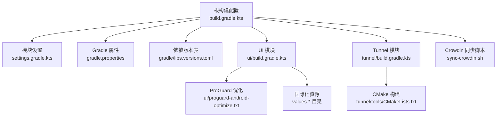
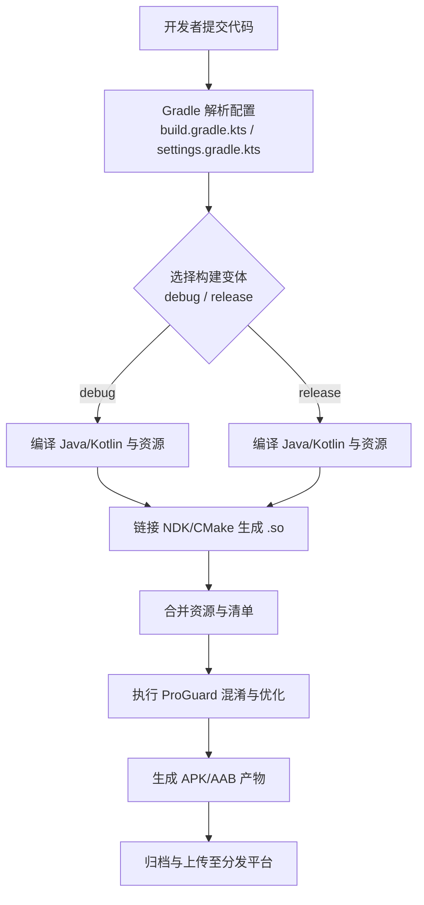
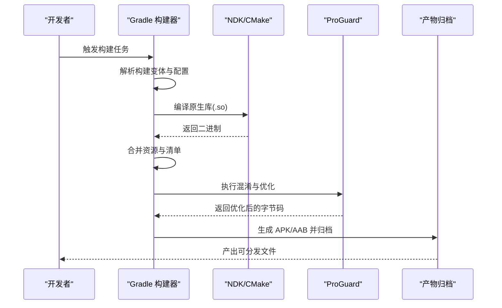
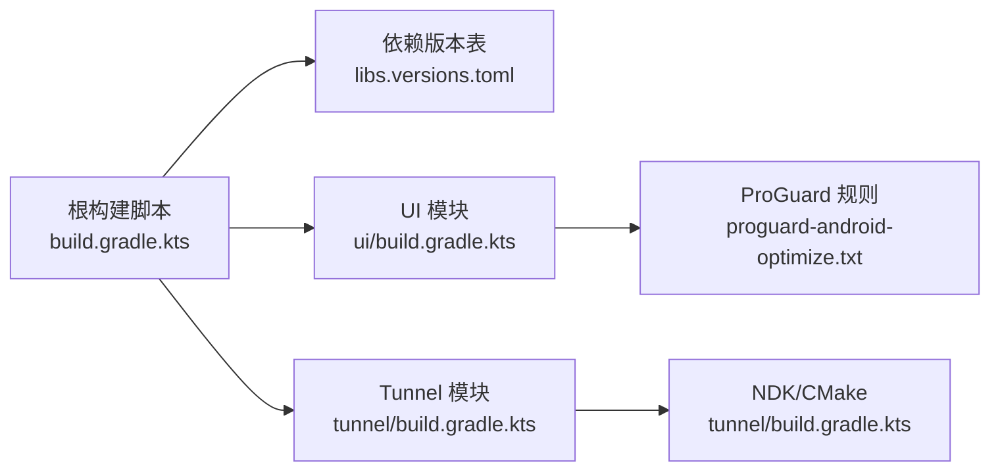

# 部署与发布

<cite>
**本文引用的文件**   
- [README.md](file://README.md)
- [build.gradle.kts](file://build.gradle.kts)
- [settings.gradle.kts](file://settings.gradle.kts)
- [gradle.properties](file://gradle.properties)
- [gradle/libs.versions.toml](file://gradle/libs.versions.toml)
- [tunnel/build.gradle.kts](file://tunnel/build.gradle.kts)
- [ui/build.gradle.kts](file://ui/build.gradle.kts)
- [ui/proguard-android-optimize.txt](file://ui/proguard-android-optimize.txt)
- [sync-crowdin.sh](file://sync-crowdin.sh)
</cite>

## 目录
1. [简介](#简介)
2. [项目结构](#项目结构)
3. [核心组件](#核心组件)
4. [架构总览](#架构总览)
5. [详细组件分析](#详细组件分析)
6. [依赖分析](#依赖分析)
7. [性能考虑](#性能考虑)
8. [故障排查指南](#故障排查指南)
9. [结论](#结论)
10. [附录](#附录)

## 简介
本文件面向 WireGuard Android 项目的构建、打包、混淆、国际化、发布渠道配置、版本管理、持续集成、回滚策略以及发布后验证与监控，提供端到端的部署与发布指导。内容基于仓库中的 Gradle 构建脚本、资源与脚本文件进行梳理，确保读者能够按步骤完成本地与 CI 环境下的稳定发布。

## 项目结构
WireGuard Android 采用多模块结构：
- ui：Android 应用层（Kotlin/Java），包含界面、资源、ProGuard 优化配置等
- tunnel：底层隧道实现（Go + JNI + NDK），通过 CMake 构建原生库并供 ui 模块使用
- 根级 Gradle 配置：统一依赖版本、构建参数与任务编排

图表来源
- [build.gradle.kts](file://build.gradle.kts)
- [settings.gradle.kts](file://settings.gradle.kts)
- [gradle.properties](file://gradle.properties)
- [gradle/libs.versions.toml](file://gradle/libs.versions.toml)
- [ui/build.gradle.kts](file://ui/build.gradle.kts)
- [tunnel/build.gradle.kts](file://tunnel/build.gradle.kts)
- [ui/proguard-android-optimize.txt](file://ui/proguard-android-optimize.txt)
- [sync-crowdin.sh](file://sync-crowdin.sh)

章节来源
- [README.md](file://README.md)
- [build.gradle.kts](file://build.gradle.kts)
- [settings.gradle.kts](file://settings.gradle.kts)
- [gradle.properties](file://gradle.properties)
- [gradle/libs.versions.toml](file://gradle/libs.versions.toml)
- [ui/build.gradle.kts](file://ui/build.gradle.kts)
- [tunnel/build.gradle.kts](file://tunnel/build.gradle.kts)
- [ui/proguard-android-optimize.txt](file://ui/proguard-android-optimize.txt)
- [sync-crowdin.sh](file://sync-crowdin.sh)

## 核心组件
- 构建系统与版本管理
  - 根级 build.gradle.kts 定义全局插件、仓库与通用任务
  - settings.gradle.kts 声明模块与子项目
  - gradle.properties 集中构建开关与签名相关变量
  - gradle/libs.versions.toml 统一管理第三方依赖版本
- UI 模块
  - ui/build.gradle.kts 定义 Android 应用构建变体、签名、产物输出、资源处理与 ProGuard 优化
  - ui/proguard-android-optimize.txt 提供混淆与优化规则
- Tunnel 模块
  - tunnel/build.gradle.kts 配置 NDK、CMake 与 Go 后端编译流程，生成 .so 供 ui 模块使用
- 国际化
  - sync-crowdin.sh 用于与 Crowdin 平台同步 strings.xml 资源
- 文档与说明
  - README.md 提供项目背景与使用说明

章节来源
- [build.gradle.kts](file://build.gradle.kts)
- [settings.gradle.kts](file://settings.gradle.kts)
- [gradle.properties](file://gradle.properties)
- [gradle/libs.versions.toml](file://gradle/libs.versions.toml)
- [ui/build.gradle.kts](file://ui/build.gradle.kts)
- [tunnel/build.gradle.kts](file://tunnel/build.gradle.kts)
- [ui/proguard-android-optimize.txt](file://ui/proguard-android-optimize.txt)
- [sync-crowdin.sh](file://sync-crowdin.sh)
- [README.md](file://README.md)

## 架构总览
下图展示从源码到可分发产物的整体流程，包括构建变体、NDK/CMake、混淆与产物归档。

图表来源
- [build.gradle.kts](file://build.gradle.kts)
- [ui/build.gradle.kts](file://ui/build.gradle.kts)
- [tunnel/build.gradle.kts](file://tunnel/build.gradle.kts)
- [ui/proguard-android-optimize.txt](file://ui/proguard-android-optimize.txt)

## 详细组件分析

### 构建系统与版本管理
- 根级构建脚本负责统一插件、仓库与任务；settings.gradle.kts 声明模块；gradle.properties 集中构建参数；libs.versions.toml 管理依赖版本。
- 建议将版本号与构建号集中在单一位置，便于自动化脚本读取与更新。

章节来源
- [build.gradle.kts](file://build.gradle.kts)
- [settings.gradle.kts](file://settings.gradle.kts)
- [gradle.properties](file://gradle.properties)
- [gradle/libs.versions.toml](file://gradle/libs.versions.toml)

### UI 模块构建与签名
- ui/build.gradle.kts 中定义 Android 应用模块的构建变体、签名配置、产物输出路径与资源处理。
- 签名信息通常来自 gradle.properties 或外部密钥库；建议在 CI 中使用受保护的凭据注入。
- 产物类型支持 APK 与 AAB；AAB 适用于 Google Play Store 的分发与动态交付。

章节来源
- [ui/build.gradle.kts](file://ui/build.gradle.kts)
- [gradle.properties](file://gradle.properties)

### Tunnel 模块与 NDK/CMake 构建
- tunnel/build.gradle.kts 配置 NDK 工具链与 CMake 构建，生成不同 ABI 的 .so 文件供 ui 模块使用。
- Go 后端通过 JNI 桥接，需确保 Go 工具链与依赖在构建环境中可用。

章节来源
- [tunnel/build.gradle.kts](file://tunnel/build.gradle.kts)

### ProGuard 混淆与优化
- ui/proguard-android-optimize.txt 提供混淆与优化规则，减少包体积并提升安全性。
- 建议为反射、JNI、序列化与第三方库添加保留规则，避免运行时异常。

章节来源
- [ui/proguard-android-optimize.txt](file://ui/proguard-android-optimize.txt)

### 国际化资源同步与管理
- sync-crowdin.sh 用于与 Crowdin 平台同步 strings.xml，保证多语言资源一致性。
- 建议在每次发布前执行同步脚本，并在 CI 中校验资源完整性。

章节来源
- [sync-crowdin.sh](file://sync-crowdin.sh)

### 构建变体与产物生成流程
- 构建变体通常包括 debug 与 release；release 变体启用混淆、压缩与签名。
- 产物生成顺序：编译源码 → 链接原生库 → 合并资源 → 混淆优化 → 打包 APK/AAB → 归档。

图表来源
- [ui/build.gradle.kts](file://ui/build.gradle.kts)
- [tunnel/build.gradle.kts](file://tunnel/build.gradle.kts)
- [ui/proguard-android-optimize.txt](file://ui/proguard-android-optimize.txt)

章节来源
- [ui/build.gradle.kts](file://ui/build.gradle.kts)
- [tunnel/build.gradle.kts](file://tunnel/build.gradle.kts)
- [ui/proguard-android-optimize.txt](file://ui/proguard-android-optimize.txt)

## 依赖分析
- 依赖版本由 gradle/libs.versions.toml 统一管理，确保跨模块一致性与可维护性。
- 根级 build.gradle.kts 声明公共插件与仓库源，避免重复配置。
- 模块间依赖清晰：ui 依赖 tunnel 生成的 .so；tunnel 依赖 NDK/CMake 工具链。

图表来源
- [build.gradle.kts](file://build.gradle.kts)
- [gradle/libs.versions.toml](file://gradle/libs.versions.toml)
- [ui/build.gradle.kts](file://ui/build.gradle.kts)
- [tunnel/build.gradle.kts](file://tunnel/build.gradle.kts)
- [ui/proguard-android-optimize.txt](file://ui/proguard-android-optimize.txt)

章节来源
- [build.gradle.kts](file://build.gradle.kts)
- [gradle/libs.versions.toml](file://gradle/libs.versions.toml)
- [ui/build.gradle.kts](file://ui/build.gradle.kts)
- [tunnel/build.gradle.kts](file://tunnel/build.gradle.kts)
- [ui/proguard-android-optimize.txt](file://ui/proguard-android-optimize.txt)

## 性能考虑
- 启用 R8/ProGuard 的优化与压缩，减少包体积与启动时间
- 合理配置 NDK 构建选项，仅编译目标 ABI，避免冗余
- 使用增量构建与缓存加速 CI 流水线
- 对大资源进行按需加载与懒初始化

[本节为通用指导，不直接分析具体文件]

## 故障排查指南
- 构建失败
  - 检查 Gradle 版本与插件兼容性
  - 确认 NDK/CMake 路径与版本正确
  - 查看构建日志定位错误行
- 签名问题
  - 校验密钥库路径、别名与密码
  - 在 CI 中通过安全变量注入签名信息
- 混淆崩溃
  - 为反射、JNI、序列化与第三方库添加保留规则
  - 使用映射文件定位混淆后堆栈
- 国际化缺失
  - 运行 sync-crowdin.sh 同步资源
  - 校验 values-* 目录完整性

章节来源
- [ui/build.gradle.kts](file://ui/build.gradle.kts)
- [tunnel/build.gradle.kts](file://tunnel/build.gradle.kts)
- [ui/proguard-android-optimize.txt](file://ui/proguard-android-optimize.txt)
- [sync-crowdin.sh](file://sync-crowdin.sh)

## 结论
通过统一的构建配置、清晰的模块划分与完善的混淆与国际化流程，WireGuard Android 能够实现稳定高效的构建与发布。建议在 CI 中固化构建与测试流程，结合严格的版本管理与回滚策略，确保发布质量与可恢复性。

[本节为总结性内容，不直接分析具体文件]

## 附录

### 构建与发布最佳实践
- 版本管理
  - 使用语义化版本号（主.次.修订）
  - 将版本号与构建号集中管理，便于自动化脚本读取
- 构建变体
  - debug：快速迭代，禁用混淆与压缩
  - release：启用混淆、压缩与签名，生成 AAB/APK
- 签名与安全
  - 使用强密码与受保护的密钥库
  - 在 CI 中通过安全变量注入签名信息
- 产物归档
  - 归档 APK/AAB 与混淆映射文件
  - 记录构建环境与依赖版本

[本节为通用指导，不直接分析具体文件]

### 持续集成示例（概念性）
- 触发条件：推送或拉取请求
- 步骤：
  - 安装 JDK、Gradle、NDK、CMake
  - 下载依赖与缓存
  - 执行单元测试与集成测试
  - 构建 release 变体并生成 AAB/APK
  - 上传产物与报告

[本节为概念性流程，不直接分析具体文件]

### 回滚策略与版本兼容性管理
- 回滚策略
  - 保留最近多个版本的产物与映射文件
  - 在分发平台支持快速下架与重新上架
- 兼容性管理
  - 明确最低 API 级别与目标 API 级别
  - 针对不同 ABI 与设备形态进行测试

[本节为通用指导，不直接分析具体文件]

### 发布后验证与监控
- 验证
  - 安装测试覆盖主要功能与网络场景
  - 检查日志与崩溃上报
- 监控
  - 接入崩溃统计与性能监控
  - 关注用户反馈与评分变化

[本节为通用指导，不直接分析具体文件]