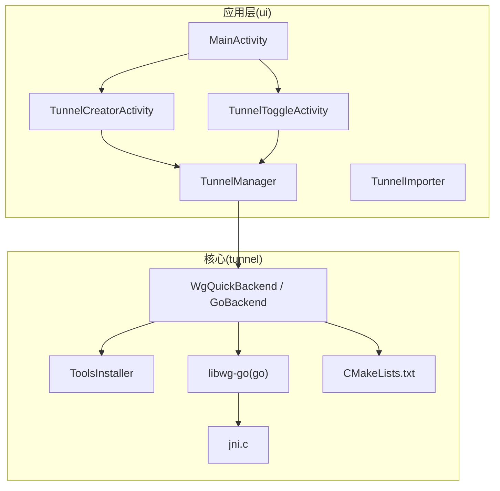
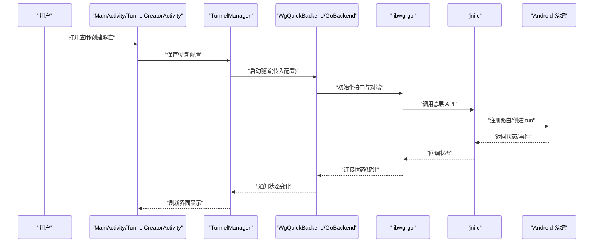
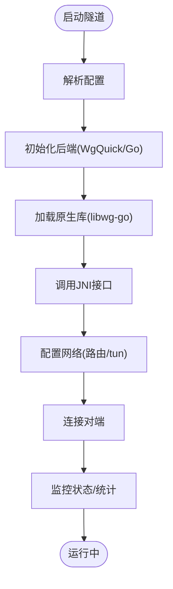
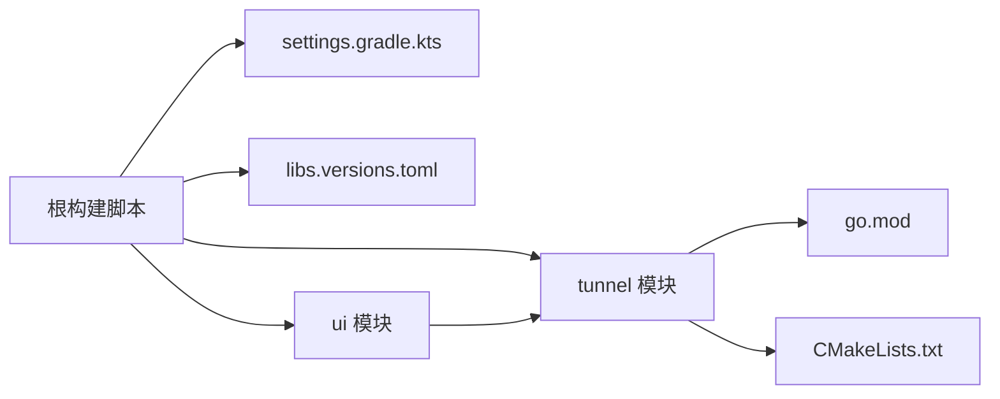

# 快速开始

<cite>
**本文引用的文件**   
- [README.md](file://README.md)
- [build.gradle.kts](file://build.gradle.kts)
- [settings.gradle.kts](file://settings.gradle.kts)
- [gradle.properties](file://gradle.properties)
- [gradle/libs.versions.toml](file://gradle/libs.versions.toml)
- [tunnel/build.gradle.kts](file://tunnel/build.gradle.kts)
- [ui/build.gradle.kts](file://ui/build.gradle.kts)
- [tunnel/src/main/AndroidManifest.xml](file://tunnel/src/main/AndroidManifest.xml)
- [ui/src/main/AndroidManifest.xml](file://ui/src/main/AndroidManifest.xml)
- [ui/src/googleplay/AndroidManifest.xml](file://ui/src/googleplay/AndroidManifest.xml)
- [tunnel/tools/libwg-go/go.mod](file://tunnel/tools/libwg-go/go.mod)
- [tunnel/tools/libwg-go/api-android.go](file://tunnel/tools/libwg-go/api-android.go)
- [tunnel/tools/libwg-go/jni.c](file://tunnel/tools/libwg-go/jni.c)
- [tunnel/tools/CMakeLists.txt](file://tunnel/tools/CMakeLists.txt)
- [tunnel/src/main/java/com/wireguard/android/backend/WgQuickBackend.java](file://tunnel/src/main/java/com/wireguard/android/backend/WgQuickBackend.java)
- [tunnel/src/main/java/com/wireguard/android/backend/GoBackend.java](file://tunnel/src/main/java/com/wireguard/android/backend/GoBackend.java)
- [tunnel/src/main/java/com/wireguard/android/util/ToolsInstaller.java](file://tunnel/src/main/java/com/wireguard/android/util/ToolsInstaller.java)
- [ui/src/main/java/com/wireguard/android/activity/MainActivity.kt](file://ui/src/main/java/com/wireguard/android/activity/MainActivity.kt)
- [ui/src/main/java/com/wireguard/android/activity/TunnelCreatorActivity.kt](file://ui/src/main/java/com/wireguard/android/activity/TunnelCreatorActivity.kt)
- [ui/src/main/java/com/wireguard/android/activity/TunnelToggleActivity.kt](file://ui/src/main/java/com/wireguard/android/activity/TunnelToggleActivity.kt)
- [ui/src/main/java/com/wireguard/android/model/TunnelManager.kt](file://ui/src/main/java/com/wireguard/android/model/TunnelManager.kt)
- [ui/src/main/java/com/wireguard/android/util/TunnelImporter.kt](file://ui/src/main/java/com/wireguard/android/util/TunnelImporter.kt)
- [ui/src/main/res/values/strings.xml](file://ui/src/main/res/values/strings.xml)
</cite>

## 目录
1. [简介](#简介)
2. [项目结构](#项目结构)
3. [核心组件](#核心组件)
4. [架构总览](#架构总览)
5. [详细组件分析](#详细组件分析)
6. [依赖分析](#依赖分析)
7. [性能考虑](#性能考虑)
8. [故障排除指南](#故障排除指南)
9. [结论](#结论)
10. [附录](#附录)

## 简介
本快速开始指南面向首次接触 WireGuard Android 的开发者与用户，目标是帮助你在最短时间内完成环境搭建、代码克隆、依赖下载、构建运行，并掌握导入配置文件、建立 VPN 连接、查看连接状态等基础用法。文档同时覆盖常见构建失败与权限问题的排查方法，确保你能顺利体验项目功能。

## 项目结构
WireGuard Android 采用多模块 Gradle 工程：
- ui：Android 应用层（Kotlin），提供界面、配置管理、Tunnel 生命周期交互等。
- tunnel：核心隧道模块（Java + Go + C JNI），封装 WireGuard 内核/用户态实现与系统交互。
- gradle：Gradle 版本与依赖版本集中管理。
- tools：NDK/Go 工具链与原生库构建脚本。

图表来源
- [ui/src/main/java/com/wireguard/android/activity/MainActivity.kt](file://ui/src/main/java/com/wireguard/android/activity/MainActivity.kt)
- [ui/src/main/java/com/wireguard/android/activity/TunnelCreatorActivity.kt](file://ui/src/main/java/com/wireguard/android/activity/TunnelCreatorActivity.kt)
- [ui/src/main/java/com/wireguard/android/activity/TunnelToggleActivity.kt](file://ui/src/main/java/com/wireguard/android/activity/TunnelToggleActivity.kt)
- [ui/src/main/java/com/wireguard/android/model/TunnelManager.kt](file://ui/src/main/java/com/wireguard/android/model/TunnelManager.kt)
- [ui/src/main/java/com/wireguard/android/util/TunnelImporter.kt](file://ui/src/main/java/com/wireguard/android/util/TunnelImporter.kt)
- [tunnel/src/main/java/com/wireguard/android/backend/WgQuickBackend.java](file://tunnel/src/main/java/com/wireguard/android/backend/WgQuickBackend.java)
- [tunnel/src/main/java/com/wireguard/android/backend/GoBackend.java](file://tunnel/src/main/java/com/wireguard/android/backend/GoBackend.java)
- [tunnel/tools/libwg-go/api-android.go](file://tunnel/tools/libwg-go/api-android.go)
- [tunnel/tools/libwg-go/jni.c](file://tunnel/tools/libwg-go/jni.c)
- [tunnel/tools/CMakeLists.txt](file://tunnel/tools/CMakeLists.txt)

章节来源
- [build.gradle.kts](file://build.gradle.kts)
- [settings.gradle.kts](file://settings.gradle.kts)
- [gradle/libs.versions.toml](file://gradle/libs.versions.toml)

## 核心组件
- 应用入口与页面
  - MainActivity：主界面入口，导航到隧道列表、设置、日志等。
  - TunnelCreatorActivity：创建/编辑隧道配置。
  - TunnelToggleActivity：启动/停止隧道切换入口。
- 模型与管理
  - TunnelManager：集中管理隧道实例的生命周期与状态。
  - TunnelImporter：导入 .conf 或二维码等格式的配置文件。
- 后端与原生
  - WgQuickBackend/GoBackend：对接 Go 实现的 WireGuard 内核/用户态驱动。
  - ToolsInstaller：安装必要的系统工具与权限。
  - libwg-go + jni.c：Go 绑定与 JNI 桥接，最终调用底层 WireGuard。

章节来源
- [ui/src/main/java/com/wireguard/android/activity/MainActivity.kt](file://ui/src/main/java/com/wireguard/android/activity/MainActivity.kt)
- [ui/src/main/java/com/wireguard/android/activity/TunnelCreatorActivity.kt](file://ui/src/main/java/com/wireguard/android/activity/TunnelCreatorActivity.kt)
- [ui/src/main/java/com/wireguard/android/activity/TunnelToggleActivity.kt](file://ui/src/main/java/com/wireguard/android/activity/TunnelToggleActivity.kt)
- [ui/src/main/java/com/wireguard/android/model/TunnelManager.kt](file://ui/src/main/java/com/wireguard/android/model/TunnelManager.kt)
- [ui/src/main/java/com/wireguard/android/util/TunnelImporter.kt](file://ui/src/main/java/com/wireguard/android/util/TunnelImporter.kt)
- [tunnel/src/main/java/com/wireguard/android/backend/WgQuickBackend.java](file://tunnel/src/main/java/com/wireguard/android/backend/WgQuickBackend.java)
- [tunnel/src/main/java/com/wireguard/android/backend/GoBackend.java](file://tunnel/src/main/java/com/wireguard/android/backend/GoBackend.java)
- [tunnel/tools/libwg-go/api-android.go](file://tunnel/tools/libwg-go/api-android.go)
- [tunnel/tools/libwg-go/jni.c](file://tunnel/tools/libwg-go/jni.c)

## 架构总览
WireGuard Android 通过 Kotlin UI 层发起操作，经由 Java 后端封装调用 Go 实现的 WireGuard 引擎，并通过 JNI 与系统网络栈交互。构建阶段使用 Gradle + NDK + Go 工具链生成原生库，运行时由 Android 系统加载。

图表来源
- [ui/src/main/java/com/wireguard/android/activity/MainActivity.kt](file://ui/src/main/java/com/wireguard/android/activity/MainActivity.kt)
- [ui/src/main/java/com/wireguard/android/activity/TunnelCreatorActivity.kt](file://ui/src/main/java/com/wireguard/android/activity/TunnelCreatorActivity.kt)
- [ui/src/main/java/com/wireguard/android/model/TunnelManager.kt](file://ui/src/main/java/com/wireguard/android/model/TunnelManager.kt)
- [tunnel/src/main/java/com/wireguard/android/backend/WgQuickBackend.java](file://tunnel/src/main/java/com/wireguard/android/backend/WgQuickBackend.java)
- [tunnel/src/main/java/com/wireguard/android/backend/GoBackend.java](file://tunnel/src/main/java/com/wireguard/android/backend/GoBackend.java)
- [tunnel/tools/libwg-go/api-android.go](file://tunnel/tools/libwg-go/api-android.go)
- [tunnel/tools/libwg-go/jni.c](file://tunnel/tools/libwg-go/jni.c)

## 详细组件分析

### 环境与构建准备
- 安装 Android Studio（推荐最新稳定版）。
- 在 SDK Manager 中安装：
  - Android SDK Platform（建议与项目目标版本一致）
  - Android SDK Build-Tools
  - Android NDK（建议使用与项目兼容的版本）
- 配置环境变量（如需要）：
  - ANDROID_HOME/ANDROID_SDK_ROOT
  - NDK 路径（若未自动识别）
- 确认 Gradle 版本与插件版本与项目一致（见 libs.versions.toml）。

章节来源
- [gradle/libs.versions.toml](file://gradle/libs.versions.toml)
- [gradle.properties](file://gradle.properties)

### 克隆与依赖下载
- 克隆仓库（含子模块）：
  - git clone --recursive <仓库地址>
- 首次同步 Gradle 将自动下载依赖；如需离线构建，请提前缓存。
- 若 Go 依赖拉取失败，检查代理与网络。

章节来源
- [tunnel/tools/libwg-go/go.mod](file://tunnel/tools/libwg-go/go.mod)

### 构建步骤
- 在 Android Studio 中打开项目根目录。
- 选择构建变体：
  - debug：开发调试
  - googleplay：发布渠道（包含 Play 相关清单）
- 点击“Build”或执行命令行：
  - ./gradlew assembleDebug
  - ./gradlew assembleGooglePlayDebug
- 首次构建会编译 Go 与 NDK 原生库，耗时较长。

章节来源
- [build.gradle.kts](file://build.gradle.kts)
- [tunnel/build.gradle.kts](file://tunnel/build.gradle.kts)
- [ui/build.gradle.kts](file://ui/build.gradle.kts)
- [ui/src/googleplay/AndroidManifest.xml](file://ui/src/googleplay/AndroidManifest.xml)

### 首次运行与权限授权
- 安装后首次运行，应用会请求必要权限：
  - “创建VPN连接”系统权限（必须）
  - 后台运行、自启动等（视设备而定）
- 按提示允许“创建VPN连接”，并在系统 VPN 设置中信任该应用。
- 若出现“无法建立 VPN”错误，检查：
  - 是否已授予 VPN 权限
  - 是否有其他 VPN 冲突
  - 设备是否支持所需内核特性

章节来源
- [tunnel/src/main/AndroidManifest.xml](file://tunnel/src/main/AndroidManifest.xml)
- [ui/src/main/AndroidManifest.xml](file://ui/src/main/AndroidManifest.xml)
- [ui/src/main/res/values/strings.xml](file://ui/src/main/res/values/strings.xml)

### 导入配置文件
- 支持从以下来源导入：
  - 本地 .conf 文件
  - 剪贴板文本
  - 扫描二维码
- 操作步骤：
  - 进入“添加隧道”界面，选择“导入”
  - 选择文件或粘贴配置内容
  - 校验通过后保存

章节来源
- [ui/src/main/java/com/wireguard/android/activity/TunnelCreatorActivity.kt](file://ui/src/main/java/com/wireguard/android/activity/TunnelCreatorActivity.kt)
- [ui/src/main/java/com/wireguard/android/util/TunnelImporter.kt](file://ui/src/main/java/com/wireguard/android/util/TunnelImporter.kt)

### 建立 VPN 连接与查看状态
- 启动连接：
  - 在隧道列表中点击“连接”或“启用”
  - 或在快捷开关中切换
- 查看状态：
  - 主界面显示连接状态、上传/下载统计
  - 日志界面可查看详细日志
- 断开连接：
  - 再次点击“断开”或关闭快捷开关

章节来源
- [ui/src/main/java/com/wireguard/android/activity/TunnelToggleActivity.kt](file://ui/src/main/java/com/wireguard/android/activity/TunnelToggleActivity.kt)
- [ui/src/main/java/com/wireguard/android/model/TunnelManager.kt](file://ui/src/main/java/com/wireguard/android/model/TunnelManager.kt)
- [ui/src/main/res/values/strings.xml](file://ui/src/main/res/values/strings.xml)

### 后端与原生库交互流程
- WgQuickBackend/GoBackend 负责解析配置、初始化接口、建立对端连接。
- Go 层通过 JNI 调用系统能力（如 tun 设备、路由表）。
- ToolsInstaller 在安装时或首次运行时检查并安装必要工具。

图表来源
- [tunnel/src/main/java/com/wireguard/android/backend/WgQuickBackend.java](file://tunnel/src/main/java/com/wireguard/android/backend/WgQuickBackend.java)
- [tunnel/src/main/java/com/wireguard/android/backend/GoBackend.java](file://tunnel/src/main/java/com/wireguard/android/backend/GoBackend.java)
- [tunnel/tools/libwg-go/api-android.go](file://tunnel/tools/libwg-go/api-android.go)
- [tunnel/tools/libwg-go/jni.c](file://tunnel/tools/libwg-go/jni.c)
- [tunnel/src/main/java/com/wireguard/android/util/ToolsInstaller.java](file://tunnel/src/main/java/com/wireguard/android/util/ToolsInstaller.java)

章节来源
- [tunnel/tools/CMakeLists.txt](file://tunnel/tools/CMakeLists.txt)

## 依赖分析
- Gradle 版本与插件由 libs.versions.toml 统一管理。
- 应用模块依赖核心 tunnel 模块。
- Go 模块依赖由 go.mod 管理，构建时需联网拉取。
- NDK 与 CMake 用于编译原生库。

图表来源
- [build.gradle.kts](file://build.gradle.kts)
- [settings.gradle.kts](file://settings.gradle.kts)
- [gradle/libs.versions.toml](file://gradle/libs.versions.toml)
- [tunnel/build.gradle.kts](file://tunnel/build.gradle.kts)
- [ui/build.gradle.kts](file://ui/build.gradle.kts)
- [tunnel/tools/libwg-go/go.mod](file://tunnel/tools/libwg-go/go.mod)
- [tunnel/tools/CMakeLists.txt](file://tunnel/tools/CMakeLists.txt)

章节来源
- [gradle/libs.versions.toml](file://gradle/libs.versions.toml)
- [tunnel/tools/libwg-go/go.mod](file://tunnel/tools/libwg-go/go.mod)

## 性能考虑
- 首次构建会编译 Go 与 NDK 库，建议开启 Gradle 并行与守护进程。
- 避免在低内存设备上频繁切换构建变体。
- 合理配置 ProGuard/R8（发布变体默认启用优化）。
- 减少不必要的日志输出以提升运行时性能。

[本节为通用指导，不直接分析具体文件]

## 故障排除指南
- 构建失败
  - 现象：NDK/Go 工具链找不到或版本不匹配
  - 处理：确认 NDK 与 Go 版本与项目要求一致；清理缓存后重试
  - 参考：NDK/CMake 构建脚本与 Go 模块定义
- 依赖拉取失败
  - 现象：Gradle/Go 依赖下载超时
  - 处理：配置代理或镜像；检查网络；必要时离线缓存
- 权限问题
  - 现象：无法创建 VPN 连接
  - 处理：授予“创建VPN连接”权限；移除冲突 VPN；重启设备
- 连接失败
  - 现象：隧道启动后立即断开或对端不可达
  - 处理：检查配置参数（端口、密钥、DNS、路由）；查看日志定位错误

章节来源
- [tunnel/tools/CMakeLists.txt](file://tunnel/tools/CMakeLists.txt)
- [tunnel/tools/libwg-go/go.mod](file://tunnel/tools/libwg-go/go.mod)
- [tunnel/src/main/AndroidManifest.xml](file://tunnel/src/main/AndroidManifest.xml)
- [ui/src/main/res/values/strings.xml](file://ui/src/main/res/values/strings.xml)

## 结论
通过本指南，你应已完成环境搭建、成功构建并运行 WireGuard Android，掌握了导入配置、建立连接与查看状态的基本流程。遇到常见问题可参考故障排除部分快速定位解决。建议在熟悉基本用法后，进一步阅读源码以理解后端与原生库的交互细节。

## 附录
- 常用命令
  - 清理构建：./gradlew clean
  - 构建 Debug：./gradlew assembleDebug
  - 构建 Google Play 变体：./gradlew assembleGooglePlayDebug
- 关键清单与资源
  - 应用与模块清单：AndroidManifest.xml
  - 字符串与主题：values/strings.xml, values/themes.xml

章节来源
- [build.gradle.kts](file://build.gradle.kts)
- [ui/src/main/AndroidManifest.xml](file://ui/src/main/AndroidManifest.xml)
- [ui/src/main/res/values/strings.xml](file://ui/src/main/res/values/strings.xml)