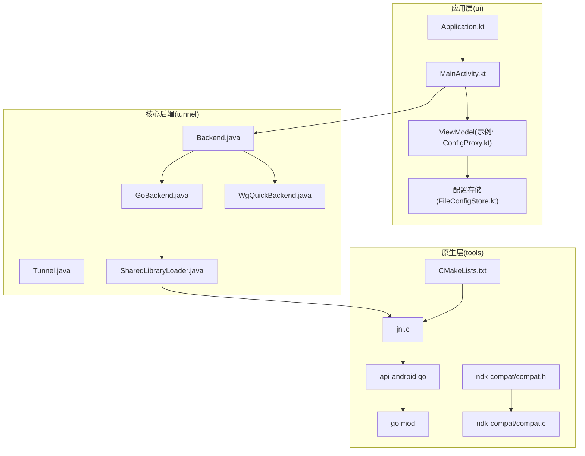
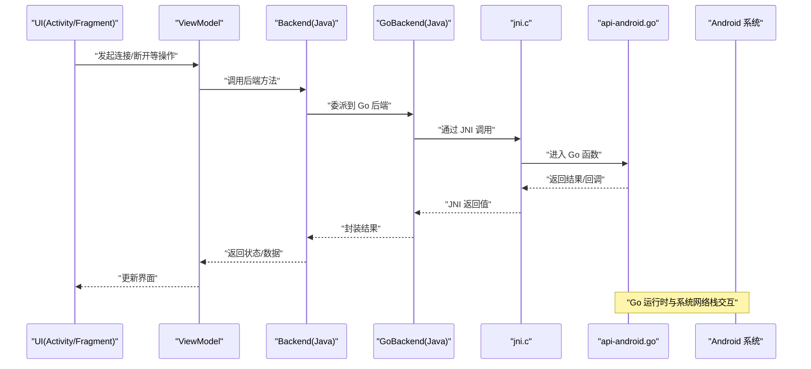
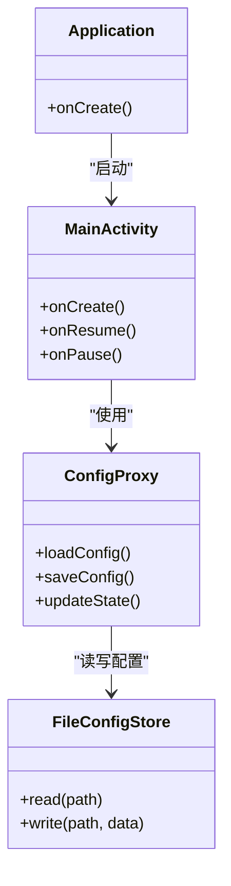
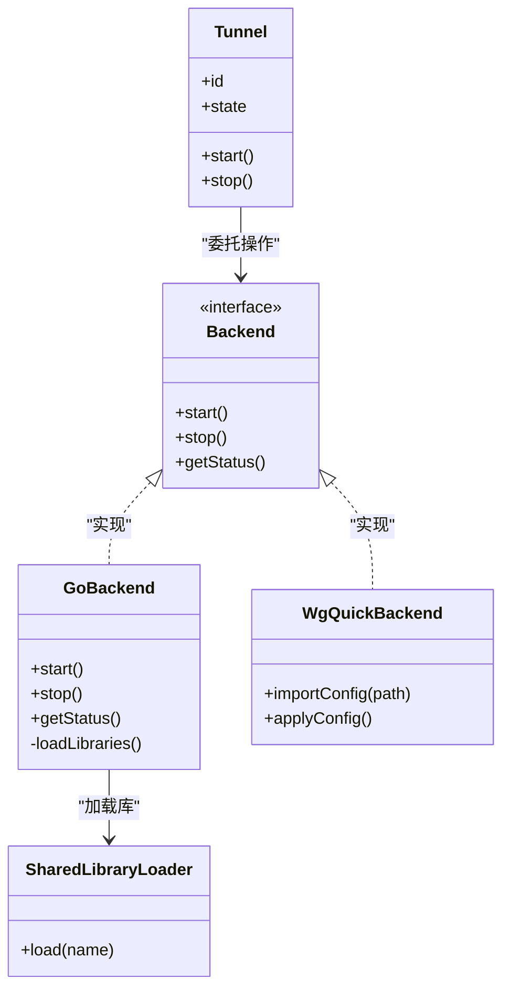
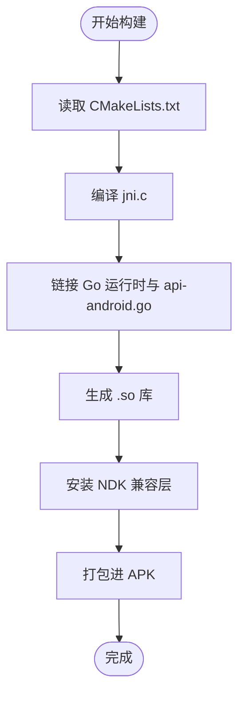
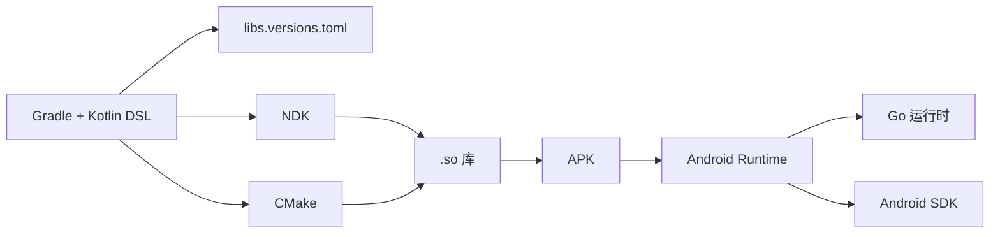

# 技术栈概览

<cite>
**本文引用的文件**   
- [README.md](file://README.md)
- [build.gradle.kts](file://build.gradle.kts)
- [settings.gradle.kts](file://settings.gradle.kts)
- [gradle.properties](file://gradle.properties)
- [gradle/libs.versions.toml](file://gradle/libs.versions.toml)
- [tunnel/build.gradle.kts](file://tunnel/build.gradle.kts)
- [ui/build.gradle.kts](file://ui/build.gradle.kts)
- [tunnel/src/main/AndroidManifest.xml](file://tunnel/src/main/AndroidManifest.xml)
- [ui/src/main/AndroidManifest.xml](file://ui/src/main/AndroidManifest.xml)
- [tunnel/src/main/java/com/wireguard/android/backend/Backend.java](file://tunnel/src/main/java/com/wireguard/android/backend/Backend.java)
- [tunnel/src/main/java/com/wireguard/android/backend/GoBackend.java](file://tunnel/src/main/java/com/wireguard/android/backend/GoBackend.java)
- [tunnel/src/main/java/com/wireguard/android/backend/WgQuickBackend.java](file://tunnel/src/main/java/com/wireguard/android/backend/WgQuickBackend.java)
- [tunnel/src/main/java/com/wireguard/android/backend/Tunnel.java](file://tunnel/src/main/java/com/wireguard/android/backend/Tunnel.java)
- [tunnel/src/main/java/com/wireguard/android/util/SharedLibraryLoader.java](file://tunnel/src/main/java/com/wireguard/android/util/SharedLibraryLoader.java)
- [tunnel/tools/libwg-go/jni.c](file://tunnel/tools/libwg-go/jni.c)
- [tunnel/tools/libwg-go/api-android.go](file://tunnel/tools/libwg-go/api-android.go)
- [tunnel/tools/libwg-go/go.mod](file://tunnel/tools/libwg-go/go.mod)
- [tunnel/tools/CMakeLists.txt](file://tunnel/tools/CMakeLists.txt)
- [tunnel/tools/ndk-compat/compat.h](file://tunnel/tools/ndk-compat/compat.h)
- [tunnel/tools/ndk-compat/compat.c](file://tunnel/tools/ndk-compat/compat.c)
- [ui/src/main/java/com/wireguard/android/Application.kt](file://ui/src/main/java/com/wireguard/android/Application.kt)
- [ui/src/main/java/com/wireguard/android/activity/MainActivity.kt](file://ui/src/main/java/com/wireguard/android/activity/MainActivity.kt)
- [ui/src/main/java/com/wireguard/android/viewmodel/ConfigProxy.kt](file://ui/src/main/java/com/wireguard/android/viewmodel/ConfigProxy.kt)
- [ui/src/main/java/com/wireguard/android/configStore/FileConfigStore.kt](file://ui/src/main/java/com/wireguard/android/configStore/FileConfigStore.kt)
- [ui/src/main/java/com/wireguard/android/updater/Updater.kt](file://ui/src/main/java/com/wireguard/android/updater/Updater.kt)
</cite>

## 目录
1. [简介](#简介)
2. [项目结构](#项目结构)
3. [核心组件](#核心组件)
4. [架构总览](#架构总览)
5. [详细组件分析](#详细组件分析)
6. [依赖关系分析](#依赖关系分析)
7. [性能考量](#性能考量)
8. [故障排查指南](#故障排查指南)
9. [结论](#结论)
10. [附录](#附录)

## 简介
本技术栈概览面向 WireGuard Android 项目的开发者与贡献者，系统梳理 UI 层（Kotlin）、核心后端（Java）、底层内核能力（Go + JNI）、以及 Android SDK 的集成方式；同时覆盖构建系统与工具链（Gradle、NDK、CMake）、关键框架与库（Jetpack Components、Material Design、Go Runtime）等。文档还解释了技术选型的原因与优势（性能、兼容性、开发效率），并提供版本兼容性与开发环境要求说明。

## 项目结构
项目采用多模块组织：
- ui：Android 应用 UI 与业务逻辑（Kotlin），包含 Activity/Fragment、ViewModel、Data Binding、偏好设置、更新器等。
- tunnel：核心后端模块（Java + Go + C），封装 WireGuard 隧道管理、配置解析、加密原语、JNI 桥接与原生库加载。
- gradle：集中式版本管理与 Gradle Wrapper。
- tools：原生构建脚本与 NDK 兼容层、Go 运行时补丁、CMake 配置等。

图表来源
- [ui/src/main/java/com/wireguard/android/activity/MainActivity.kt](file://ui/src/main/java/com/wireguard/android/activity/MainActivity.kt)
- [ui/src/main/java/com/wireguard/android/viewmodel/ConfigProxy.kt](file://ui/src/main/java/com/wireguard/android/viewmodel/ConfigProxy.kt)
- [ui/src/main/java/com/wireguard/android/configStore/FileConfigStore.kt](file://ui/src/main/java/com/wireguard/android/configStore/FileConfigStore.kt)
- [ui/src/main/java/com/wireguard/android/Application.kt](file://ui/src/main/java/com/wireguard/android/Application.kt)
- [tunnel/src/main/java/com/wireguard/android/backend/Backend.java](file://tunnel/src/main/java/com/wireguard/android/backend/Backend.java)
- [tunnel/src/main/java/com/wireguard/android/backend/GoBackend.java](file://tunnel/src/main/java/com/wireguard/android/backend/GoBackend.java)
- [tunnel/src/main/java/com/wireguard/android/backend/WgQuickBackend.java](file://tunnel/src/main/java/com/wireguard/android/backend/WgQuickBackend.java)
- [tunnel/src/main/java/com/wireguard/android/backend/Tunnel.java](file://tunnel/src/main/java/com/wireguard/android/backend/Tunnel.java)
- [tunnel/src/main/java/com/wireguard/android/util/SharedLibraryLoader.java](file://tunnel/src/main/java/com/wireguard/android/util/SharedLibraryLoader.java)
- [tunnel/tools/libwg-go/jni.c](file://tunnel/tools/libwg-go/jni.c)
- [tunnel/tools/libwg-go/api-android.go](file://tunnel/tools/libwg-go/api-android.go)
- [tunnel/tools/libwg-go/go.mod](file://tunnel/tools/libwg-go/go.mod)
- [tunnel/tools/CMakeLists.txt](file://tunnel/tools/CMakeLists.txt)
- [tunnel/tools/ndk-compat/compat.h](file://tunnel/tools/ndk-compat/compat.h)
- [tunnel/tools/ndk-compat/compat.c](file://tunnel/tools/ndk-compat/compat.c)

章节来源
- [build.gradle.kts](file://build.gradle.kts)
- [settings.gradle.kts](file://settings.gradle.kts)
- [gradle/libs.versions.toml](file://gradle/libs.versions.toml)
- [tunnel/build.gradle.kts](file://tunnel/build.gradle.kts)
- [ui/build.gradle.kts](file://ui/build.gradle.kts)

## 核心组件
- Kotlin UI 层
  - 使用 Activity/Fragment 组织界面，ViewModel 承载状态与业务编排，Data Binding 简化视图绑定，Preference 管理用户设置。
  - 通过 Updater 提供应用更新能力，FileConfigStore 负责配置文件持久化。
- Java 核心后端
  - Backend 抽象接口统一隧道后端实现；GoBackend 通过 JNI 调用 Go 实现的 WireGuard 核心；WgQuickBackend 支持 wg-quick 风格配置。
  - Tunnel 表示一个隧道实例的生命周期与状态；SharedLibraryLoader 负责动态加载 .so 库。
- Go + JNI 原生层
  - api-android.go 暴露给 JNI 的函数入口；jni.c 作为 JNI 桥接；CMakeLists.txt 定义原生构建流程；ndk-compat 提供 NDK 兼容适配。
  - go.mod 声明 Go 模块与依赖，确保可复现构建。

章节来源
- [ui/src/main/java/com/wireguard/android/activity/MainActivity.kt](file://ui/src/main/java/com/wireguard/android/activity/MainActivity.kt)
- [ui/src/main/java/com/wireguard/android/viewmodel/ConfigProxy.kt](file://ui/src/main/java/com/wireguard/android/viewmodel/ConfigProxy.kt)
- [ui/src/main/java/com/wireguard/android/configStore/FileConfigStore.kt](file://ui/src/main/java/com/wireguard/android/configStore/FileConfigStore.kt)
- [ui/src/main/java/com/wireguard/android/updater/Updater.kt](file://ui/src/main/java/com/wireguard/android/updater/Updater.kt)
- [tunnel/src/main/java/com/wireguard/android/backend/Backend.java](file://tunnel/src/main/java/com/wireguard/android/backend/Backend.java)
- [tunnel/src/main/java/com/wireguard/android/backend/GoBackend.java](file://tunnel/src/main/java/com/wireguard/android/backend/GoBackend.java)
- [tunnel/src/main/java/com/wireguard/android/backend/WgQuickBackend.java](file://tunnel/src/main/java/com/wireguard/android/backend/WgQuickBackend.java)
- [tunnel/src/main/java/com/wireguard/android/backend/Tunnel.java](file://tunnel/src/main/java/com/wireguard/android/backend/Tunnel.java)
- [tunnel/src/main/java/com/wireguard/android/util/SharedLibraryLoader.java](file://tunnel/src/main/java/com/wireguard/android/util/SharedLibraryLoader.java)
- [tunnel/tools/libwg-go/jni.c](file://tunnel/tools/libwg-go/jni.c)
- [tunnel/tools/libwg-go/api-android.go](file://tunnel/tools/libwg-go/api-android.go)
- [tunnel/tools/libwg-go/go.mod](file://tunnel/tools/libwg-go/go.mod)
- [tunnel/tools/CMakeLists.txt](file://tunnel/tools/CMakeLists.txt)
- [tunnel/tools/ndk-compat/compat.h](file://tunnel/tools/ndk-compat/compat.h)
- [tunnel/tools/ndk-compat/compat.c](file://tunnel/tools/ndk-compat/compat.c)

## 架构总览
WireGuard Android 采用分层架构：UI 层（Kotlin）通过 ViewModel 与后端交互；后端（Java）抽象出统一的 Backend 接口，具体由 GoBackend（JNI 到 Go）或 WgQuickBackend 实现；Go 层通过 jni.c 暴露 API，并由 CMake 构建为 .so 供 Android 加载。

图表来源
- [ui/src/main/java/com/wireguard/android/activity/MainActivity.kt](file://ui/src/main/java/com/wireguard/android/activity/MainActivity.kt)
- [ui/src/main/java/com/wireguard/android/viewmodel/ConfigProxy.kt](file://ui/src/main/java/com/wireguard/android/viewmodel/ConfigProxy.kt)
- [tunnel/src/main/java/com/wireguard/android/backend/Backend.java](file://tunnel/src/main/java/com/wireguard/android/backend/Backend.java)
- [tunnel/src/main/java/com/wireguard/android/backend/GoBackend.java](file://tunnel/src/main/java/com/wireguard/android/backend/GoBackend.java)
- [tunnel/tools/libwg-go/jni.c](file://tunnel/tools/libwg-go/jni.c)
- [tunnel/tools/libwg-go/api-android.go](file://tunnel/tools/libwg-go/api-android.go)

## 详细组件分析

### Kotlin UI 层与 Jetpack 组件
- Activity/Fragment 负责页面生命周期与用户交互。
- ViewModel 持有可观察状态，配合 Data Binding 驱动 UI。
- Preference 用于设置项持久化；Updater 处理应用更新流程。
- FileConfigStore 读写配置文件，保证配置一致性。

图表来源
- [ui/src/main/java/com/wireguard/android/activity/MainActivity.kt](file://ui/src/main/java/com/wireguard/android/activity/MainActivity.kt)
- [ui/src/main/java/com/wireguard/android/viewmodel/ConfigProxy.kt](file://ui/src/main/java/com/wireguard/android/viewmodel/ConfigProxy.kt)
- [ui/src/main/java/com/wireguard/android/configStore/FileConfigStore.kt](file://ui/src/main/java/com/wireguard/android/configStore/FileConfigStore.kt)
- [ui/src/main/java/com/wireguard/android/Application.kt](file://ui/src/main/java/com/wireguard/android/Application.kt)

章节来源
- [ui/src/main/java/com/wireguard/android/activity/MainActivity.kt](file://ui/src/main/java/com/wireguard/android/activity/MainActivity.kt)
- [ui/src/main/java/com/wireguard/android/viewmodel/ConfigProxy.kt](file://ui/src/main/java/com/wireguard/android/viewmodel/ConfigProxy.kt)
- [ui/src/main/java/com/wireguard/android/configStore/FileConfigStore.kt](file://ui/src/main/java/com/wireguard/android/configStore/FileConfigStore.kt)
- [ui/src/main/java/com/wireguard/android/Application.kt](file://ui/src/main/java/com/wireguard/android/Application.kt)

### Java 核心后端与 Go 集成
- Backend 抽象了隧道后端能力，屏蔽具体实现差异。
- GoBackend 通过 JNI 调用 Go 实现的 WireGuard 核心，提供高性能的数据面转发。
- WgQuickBackend 支持 wg-quick 风格的配置文件导入与解析。
- SharedLibraryLoader 负责在运行时加载 .so 库，避免启动时阻塞。

图表来源
- [tunnel/src/main/java/com/wireguard/android/backend/Backend.java](file://tunnel/src/main/java/com/wireguard/android/backend/Backend.java)
- [tunnel/src/main/java/com/wireguard/android/backend/GoBackend.java](file://tunnel/src/main/java/com/wireguard/android/backend/GoBackend.java)
- [tunnel/src/main/java/com/wireguard/android/backend/WgQuickBackend.java](file://tunnel/src/main/java/com/wireguard/android/backend/WgQuickBackend.java)
- [tunnel/src/main/java/com/wireguard/android/backend/Tunnel.java](file://tunnel/src/main/java/com/wireguard/android/backend/Tunnel.java)
- [tunnel/src/main/java/com/wireguard/android/util/SharedLibraryLoader.java](file://tunnel/src/main/java/com/wireguard/android/util/SharedLibraryLoader.java)

章节来源
- [tunnel/src/main/java/com/wireguard/android/backend/Backend.java](file://tunnel/src/main/java/com/wireguard/android/backend/Backend.java)
- [tunnel/src/main/java/com/wireguard/android/backend/GoBackend.java](file://tunnel/src/main/java/com/wireguard/android/backend/GoBackend.java)
- [tunnel/src/main/java/com/wireguard/android/backend/WgQuickBackend.java](file://tunnel/src/main/java/com/wireguard/android/backend/WgQuickBackend.java)
- [tunnel/src/main/java/com/wireguard/android/backend/Tunnel.java](file://tunnel/src/main/java/com/wireguard/android/backend/Tunnel.java)
- [tunnel/src/main/java/com/wireguard/android/util/SharedLibraryLoader.java](file://tunnel/src/main/java/com/wireguard/android/util/SharedLibraryLoader.java)

### Go + JNI 原生层与构建
- api-android.go 定义对外暴露的函数，供 jni.c 调用。
- jni.c 实现 JNI 桥接，将 Java 方法映射到 Go 函数。
- CMakeLists.txt 描述原生库构建规则，链接必要的系统库。
- ndk-compat 提供跨 NDK 版本的兼容函数，提升构建稳定性。
- go.mod 锁定 Go 模块版本，确保可重复构建。

图表来源
- [tunnel/tools/CMakeLists.txt](file://tunnel/tools/CMakeLists.txt)
- [tunnel/tools/libwg-go/jni.c](file://tunnel/tools/libwg-go/jni.c)
- [tunnel/tools/libwg-go/api-android.go](file://tunnel/tools/libwg-go/api-android.go)
- [tunnel/tools/libwg-go/go.mod](file://tunnel/tools/libwg-go/go.mod)
- [tunnel/tools/ndk-compat/compat.h](file://tunnel/tools/ndk-compat/compat.h)
- [tunnel/tools/ndk-compat/compat.c](file://tunnel/tools/ndk-compat/compat.c)

章节来源
- [tunnel/tools/libwg-go/jni.c](file://tunnel/tools/libwg-go/jni.c)
- [tunnel/tools/libwg-go/api-android.go](file://tunnel/tools/libwg-go/api-android.go)
- [tunnel/tools/libwg-go/go.mod](file://tunnel/tools/libwg-go/go.mod)
- [tunnel/tools/CMakeLists.txt](file://tunnel/tools/CMakeLists.txt)
- [tunnel/tools/ndk-compat/compat.h](file://tunnel/tools/ndk-compat/compat.h)
- [tunnel/tools/ndk-compat/compat.c](file://tunnel/tools/ndk-compat/compat.c)

## 依赖关系分析
- 构建系统
  - Gradle 作为主构建系统，Kotlin DSL 编写脚本，集中版本管理位于 libs.versions.toml。
  - NDK 与 CMake 用于构建原生库，确保 Go + JNI 产物正确链接。
- 运行时依赖
  - Android SDK 提供系统 API（网络、权限、服务）。
  - Go Runtime 被打包并随应用运行，提供高性能网络栈。
  - Material Design 与 Jetpack Components 提升 UI 一致性与开发效率。

图表来源
- [gradle/libs.versions.toml](file://gradle/libs.versions.toml)
- [tunnel/build.gradle.kts](file://tunnel/build.gradle.kts)
- [ui/build.gradle.kts](file://ui/build.gradle.kts)
- [tunnel/tools/CMakeLists.txt](file://tunnel/tools/CMakeLists.txt)

章节来源
- [gradle/libs.versions.toml](file://gradle/libs.versions.toml)
- [tunnel/build.gradle.kts](file://tunnel/build.gradle.kts)
- [ui/build.gradle.kts](file://ui/build.gradle.kts)
- [tunnel/tools/CMakeLists.txt](file://tunnel/tools/CMakeLists.txt)

## 性能考量
- Go 数据面：Go 实现的 WireGuard 核心具备高并发与低延迟特性，适合移动端网络转发。
- JNI 开销：尽量减少 JNI 调用频率，批量传递数据，避免频繁对象创建。
- 原生库加载：按需加载 .so，降低冷启动时间。
- 内存管理：Go 与 Java 侧注意对象生命周期，避免泄漏；合理使用缓存与池化。
- I/O 优化：大文件读写使用缓冲流，减少系统调用次数。

[本节为通用指导，不直接分析具体文件]

## 故障排查指南
- 无法加载 .so 库
  - 检查 SharedLibraryLoader 是否正确加载目标架构的库。
  - 确认 NDK 与 CMake 构建产物存在且签名有效。
- Go 运行时异常
  - 查看 Go 日志输出与崩溃堆栈；确认 go.mod 版本与依赖一致性。
- 配置解析失败
  - 校验配置文件语法与字段合法性；参考测试资源中的样例与错误用例。
- 权限问题
  - 确认 AndroidManifest 中所需权限已声明并在运行时申请。

章节来源
- [tunnel/src/main/java/com/wireguard/android/util/SharedLibraryLoader.java](file://tunnel/src/main/java/com/wireguard/android/util/SharedLibraryLoader.java)
- [tunnel/tools/libwg-go/go.mod](file://tunnel/tools/libwg-go/go.mod)
- [tunnel/src/main/AndroidManifest.xml](file://tunnel/src/main/AndroidManifest.xml)
- [ui/src/main/AndroidManifest.xml](file://ui/src/main/AndroidManifest.xml)

## 结论
WireGuard Android 通过 Kotlin UI、Java 后端与 Go 原生层的清晰分层，实现了高性能、可维护的 VPN 客户端。Gradle + NDK + CMake 的构建体系确保了跨平台与可重复性；Jetpack 与 Material Design 提升了用户体验与开发效率。合理的性能优化与完善的故障排查策略，使项目在复杂移动环境中保持稳定与高效。

[本节为总结性内容，不直接分析具体文件]

## 附录

### 技术选型原因与优势
- Kotlin（UI 与业务逻辑）
  - 简洁安全、协程支持异步任务，提升开发效率与代码可读性。
- Java（核心后端）
  - 与 Android 生态深度集成，便于管理生命周期与系统 API。
- Go（WireGuard 核心）
  - 高性能网络栈，并发模型优秀，易于跨平台移植。
- Android SDK
  - 提供稳定的系统能力与兼容性保障。
- Gradle + NDK + CMake
  - 标准化构建流程，支持多架构与增量编译。
- Jetpack Components 与 Material Design
  - 统一 UI 规范，减少样板代码，提高可访问性与主题一致性。

[本节为通用指导，不直接分析具体文件]

### 版本兼容性与环境要求
- Android 版本
  - 最低支持版本与目标版本由 AndroidManifest 与 Gradle 配置决定。
- Gradle 与插件
  - 使用 Gradle Wrapper 与 libs.versions.toml 统一管理版本。
- NDK 与 CMake
  - 需要安装对应版本的 NDK 与 CMake，确保原生构建成功。
- Go 版本
  - 由 go.mod 指定，需保持与构建脚本一致。

章节来源
- [tunnel/src/main/AndroidManifest.xml](file://tunnel/src/main/AndroidManifest.xml)
- [ui/src/main/AndroidManifest.xml](file://ui/src/main/AndroidManifest.xml)
- [gradle/libs.versions.toml](file://gradle/libs.versions.toml)
- [tunnel/tools/libwg-go/go.mod](file://tunnel/tools/libwg-go/go.mod)

### 开发环境与依赖安装指南
- 安装 Android Studio 与 SDK
  - 选择与项目匹配的 Android 版本与构建工具。
- 安装 NDK 与 CMake
  - 通过 SDK Manager 安装对应版本的 NDK 与 CMake。
- 配置 Go 环境
  - 安装与 go.mod 一致的 Go 版本，确保模块下载可用。
- 同步与构建
  - 使用 Gradle Wrapper 同步依赖，执行构建任务生成 APK。

[本节为通用指导，不直接分析具体文件]