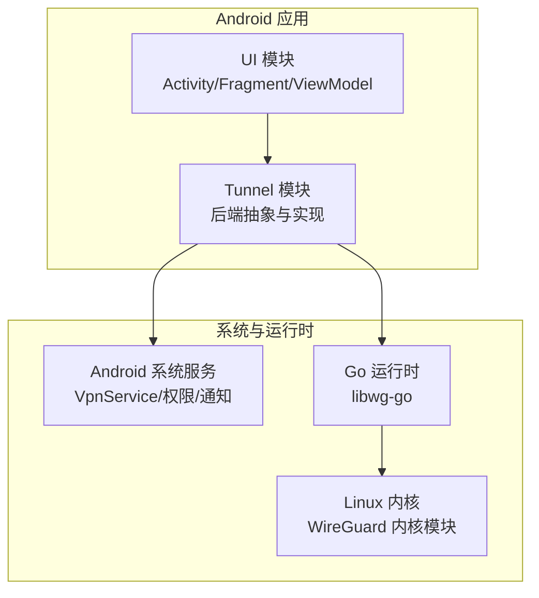
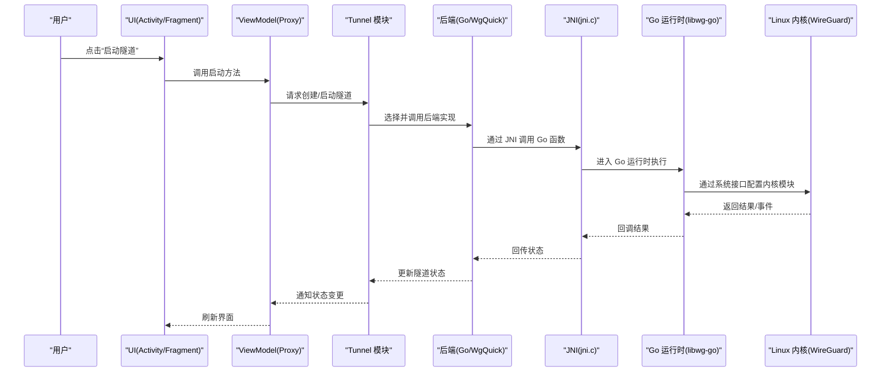
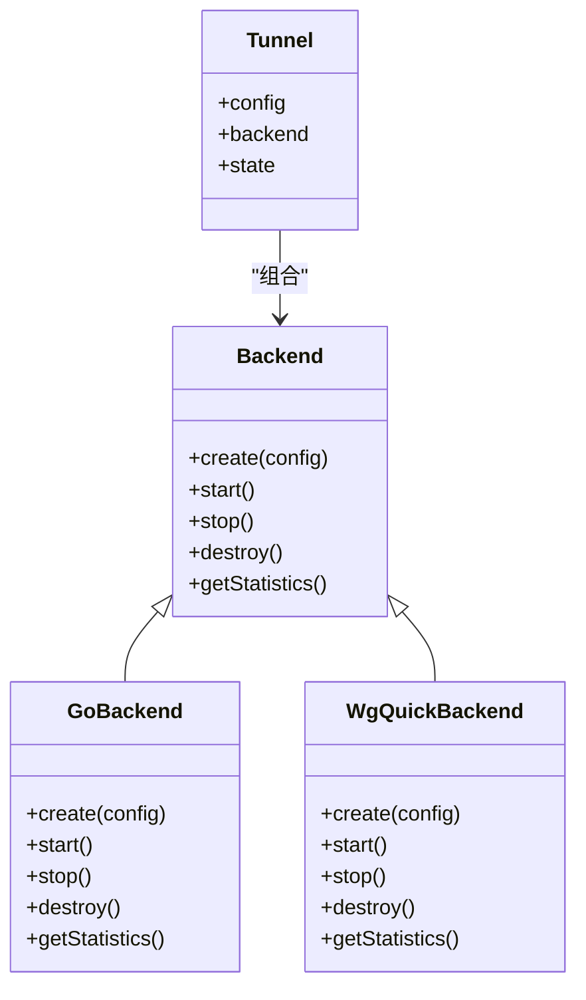
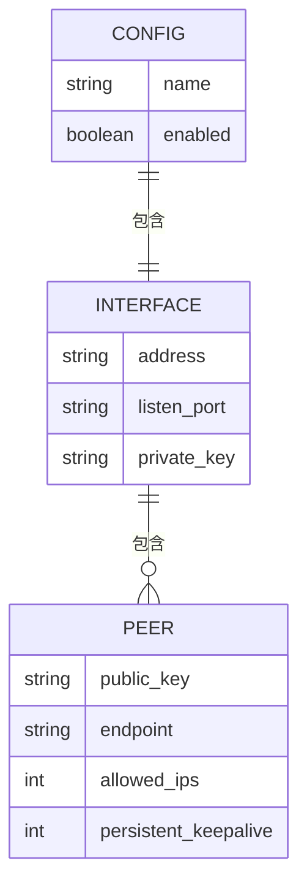
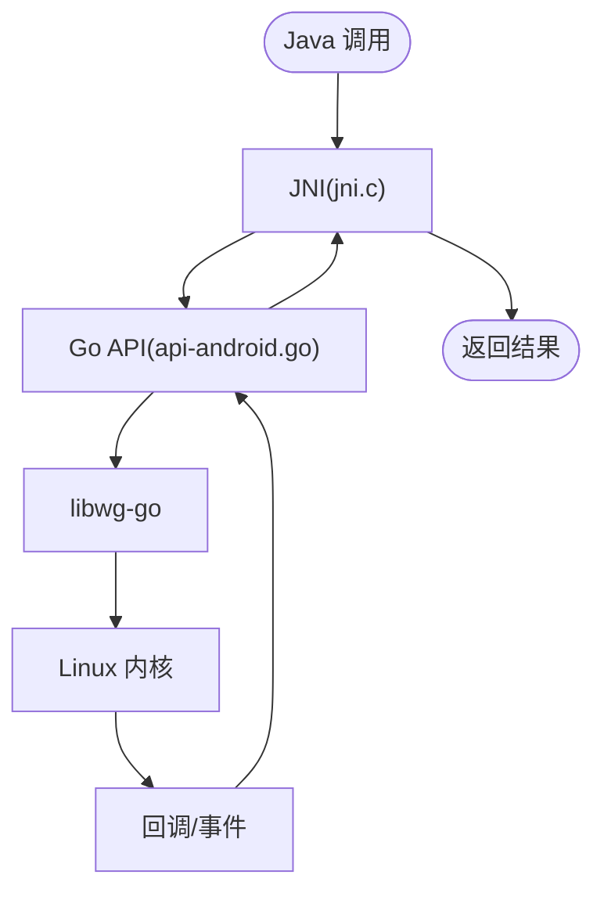
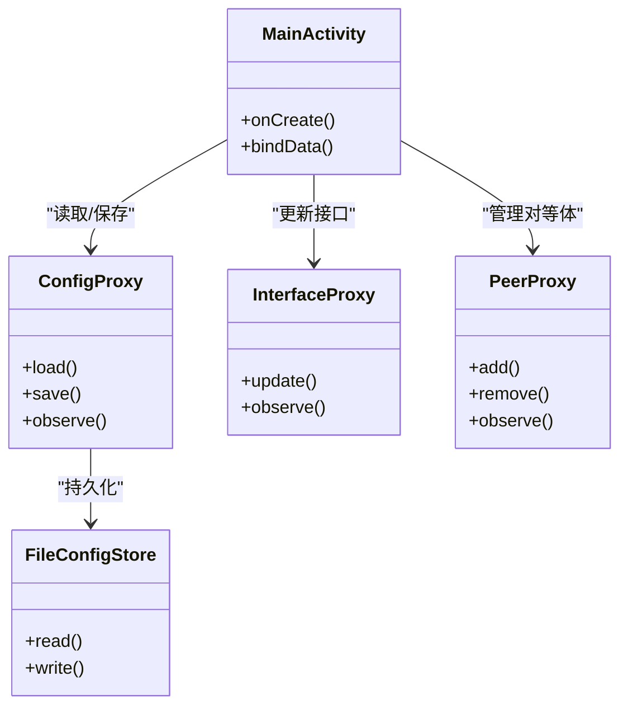
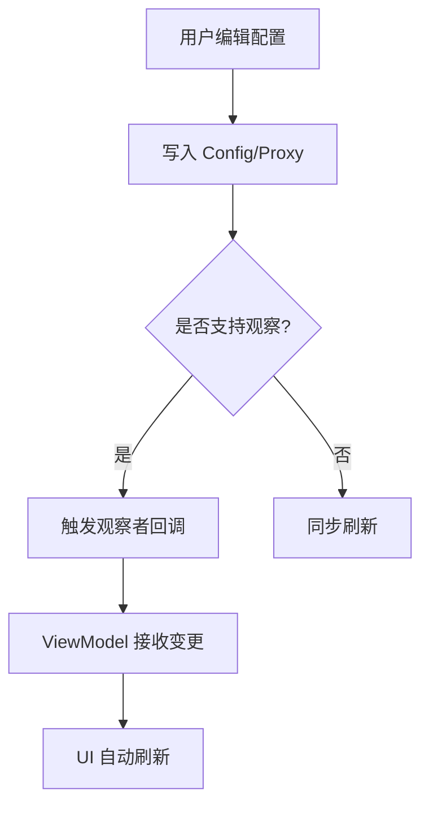
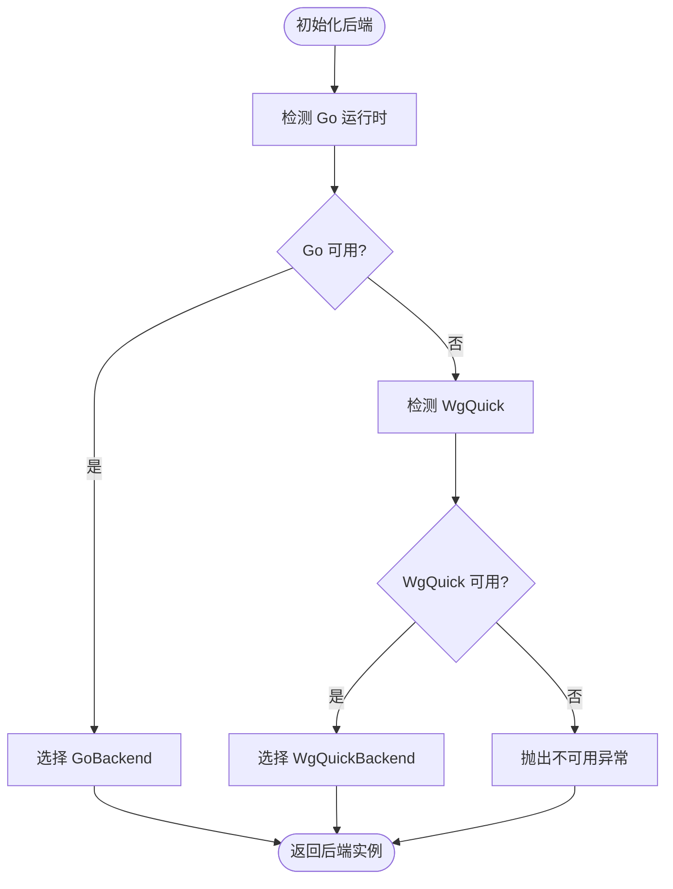
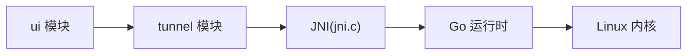

# 架构概览

<cite>
**本文引用的文件**   
- [README.md](file://README.md)
- [settings.gradle.kts](file://settings.gradle.kts)
- [build.gradle.kts](file://build.gradle.kts)
- [tunnel/build.gradle.kts](file://tunnel/build.gradle.kts)
- [ui/build.gradle.kts](file://ui/build.gradle.kts)
- [tunnel/src/main/java/com/wireguard/android/backend/Backend.java](file://tunnel/src/main/java/com/wireguard/android/backend/Backend.java)
- [tunnel/src/main/java/com/wireguard/android/backend/GoBackend.java](file://tunnel/src/main/java/com/wireguard/android/backend/GoBackend.java)
- [tunnel/src/main/java/com/wireguard/android/backend/WgQuickBackend.java](file://tunnel/src/main/java/com/wireguard/android/backend/WgQuickBackend.java)
- [tunnel/src/main/java/com/wireguard/android/backend/Tunnel.java](file://tunnel/src/main/java/com/wireguard/android/backend/Tunnel.java)
- [tunnel/src/main/java/com/wireguard/config/Config.java](file://tunnel/src/main/java/com/wireguard/config/Config.java)
- [tunnel/src/main/java/com/wireguard/config/Interface.java](file://tunnel/src/main/java/com/wireguard/config/Interface.java)
- [tunnel/src/main/java/com/wireguard/config/Peer.java](file://tunnel/src/main/java/com/wireguard/config/Peer.java)
- [tunnel/tools/libwg-go/api-android.go](file://tunnel/tools/libwg-go/api-android.go)
- [tunnel/tools/libwg-go/jni.c](file://tunnel/tools/libwg-go/jni.c)
- [ui/src/main/java/com/wireguard/android/Application.kt](file://ui/src/main/java/com/wireguard/android/Application.kt)
- [ui/src/main/java/com/wireguard/android/activity/MainActivity.kt](file://ui/src/main/java/com/wireguard/android/activity/MainActivity.kt)
- [ui/src/main/java/com/wireguard/android/model/TunnelManager.kt](file://ui/src/main/java/com/wireguard/android/model/TunnelManager.kt)
- [ui/src/main/java/com/wireguard/android/viewmodel/ConfigProxy.kt](file://ui/src/main/java/com/wireguard/android/viewmodel/ConfigProxy.kt)
- [ui/src/main/java/com/wireguard/android/viewmodel/InterfaceProxy.kt](file://ui/src/main/java/com/wireguard/android/viewmodel/InterfaceProxy.kt)
- [ui/src/main/java/com/wireguard/android/viewmodel/PeerProxy.kt](file://ui/src/main/java/com/wireguard/android/viewmodel/PeerProxy.kt)
- [ui/src/main/java/com/wireguard/android/configStore/FileConfigStore.kt](file://ui/src/main/java/com/wireguard/android/configStore/FileConfigStore.kt)
</cite>

## 目录
1. [简介](#简介)
2. [项目结构](#项目结构)
3. [核心组件](#核心组件)
4. [架构总览](#架构总览)
5. [详细组件分析](#详细组件分析)
6. [依赖关系分析](#依赖关系分析)
7. [性能考量](#性能考量)
8. [故障排查指南](#故障排查指南)
9. [结论](#结论)
10. [附录](#附录)

## 简介
本概览面向 WireGuard Android 项目的开发者与贡献者，系统性阐述双模块（tunnel、ui）的职责边界与交互方式，解释 MVVM 分层设计在 UI 层的落地，并说明关键设计模式（工厂、观察者、策略）在项目中的体现。文档同时给出从用户界面到业务逻辑再到系统内核的完整数据流路径，以及 Android 系统服务、Linux 内核与 Go 运行时的集成点，帮助读者快速建立对整体架构的认知。

## 项目结构
项目采用 Gradle 多模块组织：
- tunnel 模块：封装 WireGuard 核心能力，包括配置解析、后端抽象与实现（Go 运行时与 WgQuick）、JNI 桥接、工具链与原生库构建。
- ui 模块：基于 Kotlin + Jetpack（Activity/Fragment/ViewModel/DataBinding），提供隧道管理、编辑、导入导出、设置等用户界面，并通过代理层调用 tunnel 模块。

图表来源
- [settings.gradle.kts](file://settings.gradle.kts)
- [build.gradle.kts](file://build.gradle.kts)
- [tunnel/build.gradle.kts](file://tunnel/build.gradle.kts)
- [ui/build.gradle.kts](file://ui/build.gradle.kts)

章节来源
- [README.md](file://README.md)
- [settings.gradle.kts](file://settings.gradle.kts)
- [build.gradle.kts](file://build.gradle.kts)
- [tunnel/build.gradle.kts](file://tunnel/build.gradle.kts)
- [ui/build.gradle.kts](file://ui/build.gradle.kts)

## 核心组件
- 后端抽象与选择
  - Backend 接口定义统一的后端能力；GoBackend 与 WgQuickBackend 为两种具体实现，形成策略模式；通过工厂机制按环境或配置选择具体后端。
- 配置模型
  - Config/Interface/Peer 等类描述 WireGuard 配置语义，负责校验与序列化/反序列化。
- JNI 与 Go 运行时
  - api-android.go 暴露 Java 可调用的 API；jni.c 完成 JNI 绑定，将 Java 调用转交给 libwg-go。
- UI 层与 MVVM
  - Activity/Fragment 作为 View；ViewModel 持有状态与业务编排；Model 由 tunnel 模块提供；UI 通过 Proxy 对象访问 tunnel 能力。

章节来源
- [tunnel/src/main/java/com/wireguard/android/backend/Backend.java](file://tunnel/src/main/java/com/wireguard/android/backend/Backend.java)
- [tunnel/src/main/java/com/wireguard/android/backend/GoBackend.java](file://tunnel/src/main/java/com/wireguard/android/backend/GoBackend.java)
- [tunnel/src/main/java/com/wireguard/android/backend/WgQuickBackend.java](file://tunnel/src/main/java/com/wireguard/android/backend/WgQuickBackend.java)
- [tunnel/src/main/java/com/wireguard/config/Config.java](file://tunnel/src/main/java/com/wireguard/config/Config.java)
- [tunnel/src/main/java/com/wireguard/config/Interface.java](file://tunnel/src/main/java/com/wireguard/config/Interface.java)
- [tunnel/src/main/java/com/wireguard/config/Peer.java](file://tunnel/src/main/java/com/wireguard/config/Peer.java)
- [tunnel/tools/libwg-go/api-android.go](file://tunnel/tools/libwg-go/api-android.go)
- [tunnel/tools/libwg-go/jni.c](file://tunnel/tools/libwg-go/jni.c)
- [ui/src/main/java/com/wireguard/android/viewmodel/ConfigProxy.kt](file://ui/src/main/java/com/wireguard/android/viewmodel/ConfigProxy.kt)
- [ui/src/main/java/com/wireguard/android/viewmodel/InterfaceProxy.kt](file://ui/src/main/java/com/wireguard/android/viewmodel/InterfaceProxy.kt)
- [ui/src/main/java/com/wireguard/android/viewmodel/PeerProxy.kt](file://ui/src/main/java/com/wireguard/android/viewmodel/PeerProxy.kt)

## 架构总览
下图展示从 UI 到内核的端到端调用链，以及各层职责与交互点。

图表来源
- [tunnel/src/main/java/com/wireguard/android/backend/Backend.java](file://tunnel/src/main/java/com/wireguard/android/backend/Backend.java)
- [tunnel/src/main/java/com/wireguard/android/backend/GoBackend.java](file://tunnel/src/main/java/com/wireguard/android/backend/GoBackend.java)
- [tunnel/tools/libwg-go/jni.c](file://tunnel/tools/libwg-go/jni.c)
- [tunnel/tools/libwg-go/api-android.go](file://tunnel/tools/libwg-go/api-android.go)
- [ui/src/main/java/com/wireguard/android/activity/MainActivity.kt](file://ui/src/main/java/com/wireguard/android/activity/MainActivity.kt)
- [ui/src/main/java/com/wireguard/android/viewmodel/ConfigProxy.kt](file://ui/src/main/java/com/wireguard/android/viewmodel/ConfigProxy.kt)

## 详细组件分析

### 后端抽象与策略模式（Backend/GoBackend/WgQuickBackend）
- 设计要点
  - Backend 接口统一了隧道生命周期操作（创建、启动、停止、销毁、统计等）。
  - GoBackend 与 WgQuickBackend 分别对应不同实现路径：前者直接对接 Go 运行时，后者通过 WgQuick 脚本/工具链。
  - 通过工厂/选择器根据设备能力与配置决定使用哪种后端，体现策略模式。
- 数据与状态
  - 后端维护隧道句柄与运行状态，向上传递统计信息与事件。
- 错误处理
  - 异常封装为统一的 BackendException，便于上层捕获与提示。

图表来源
- [tunnel/src/main/java/com/wireguard/android/backend/Backend.java](file://tunnel/src/main/java/com/wireguard/android/backend/Backend.java)
- [tunnel/src/main/java/com/wireguard/android/backend/GoBackend.java](file://tunnel/src/main/java/com/wireguard/android/backend/GoBackend.java)
- [tunnel/src/main/java/com/wireguard/android/backend/WgQuickBackend.java](file://tunnel/src/main/java/com/wireguard/android/backend/WgQuickBackend.java)
- [tunnel/src/main/java/com/wireguard/android/backend/Tunnel.java](file://tunnel/src/main/java/com/wireguard/android/backend/Tunnel.java)

章节来源
- [tunnel/src/main/java/com/wireguard/android/backend/Backend.java](file://tunnel/src/main/java/com/wireguard/android/backend/Backend.java)
- [tunnel/src/main/java/com/wireguard/android/backend/GoBackend.java](file://tunnel/src/main/java/com/wireguard/android/backend/GoBackend.java)
- [tunnel/src/main/java/com/wireguard/android/backend/WgQuickBackend.java](file://tunnel/src/main/java/com/wireguard/android/backend/WgQuickBackend.java)
- [tunnel/src/main/java/com/wireguard/android/backend/Tunnel.java](file://tunnel/src/main/java/com/wireguard/android/backend/Tunnel.java)

### 配置模型与解析（Config/Interface/Peer）
- 设计要点
  - 以领域模型表达 WireGuard 配置文件语义，包含接口地址、密钥、对等体列表等。
  - 提供解析、校验与序列化工具，确保配置合法性。
- 数据流向
  - UI 编辑后生成配置对象，经 ViewModel 传递至 Tunnel 模块，最终下发给后端。
- 复杂度与约束
  - 解析过程需处理网络地址、端口、加密参数等，时间复杂度与配置规模线性相关。

图表来源
- [tunnel/src/main/java/com/wireguard/config/Config.java](file://tunnel/src/main/java/com/wireguard/config/Config.java)
- [tunnel/src/main/java/com/wireguard/config/Interface.java](file://tunnel/src/main/java/com/wireguard/config/Interface.java)
- [tunnel/src/main/java/com/wireguard/config/Peer.java](file://tunnel/src/main/java/com/wireguard/config/Peer.java)

章节来源
- [tunnel/src/main/java/com/wireguard/config/Config.java](file://tunnel/src/main/java/com/wireguard/config/Config.java)
- [tunnel/src/main/java/com/wireguard/config/Interface.java](file://tunnel/src/main/java/com/wireguard/config/Interface.java)
- [tunnel/src/main/java/com/wireguard/config/Peer.java](file://tunnel/src/main/java/com/wireguard/config/Peer.java)

### JNI 与 Go 运行时集成（api-android.go / jni.c）
- 设计要点
  - api-android.go 暴露 Java 可调用函数，负责与 libwg-go 交互。
  - jni.c 实现 JNI 入口，完成类型转换、异常传播与回调。
- 数据流
  - Java -> JNI -> Go -> 内核；内核事件/日志通过回调回传。
- 性能与安全
  - JNI 调用开销需最小化，避免频繁跨语言切换；敏感数据（密钥）应谨慎处理。

图表来源
- [tunnel/tools/libwg-go/api-android.go](file://tunnel/tools/libwg-go/api-android.go)
- [tunnel/tools/libwg-go/jni.c](file://tunnel/tools/libwg-go/jni.c)

章节来源
- [tunnel/tools/libwg-go/api-android.go](file://tunnel/tools/libwg-go/api-android.go)
- [tunnel/tools/libwg-go/jni.c](file://tunnel/tools/libwg-go/jni.c)

### UI 层与 MVVM（Activity/Fragment/ViewModel/Proxy）
- 设计要点
  - View：Activity/Fragment 仅负责展示与用户交互。
  - ViewModel：持有可观察状态，编排业务调用，屏蔽底层细节。
  - Model：由 tunnel 模块提供的后端与配置模型。
  - Proxy：ConfigProxy/InterfaceProxy/PeerProxy 作为适配层，统一访问 tunnel 能力。
- 数据绑定
  - 通过 DataBinding 与可观察集合，实现 UI 自动刷新。
- 配置持久化
  - FileConfigStore 负责配置的读写与版本兼容。

图表来源
- [ui/src/main/java/com/wireguard/android/activity/MainActivity.kt](file://ui/src/main/java/com/wireguard/android/activity/MainActivity.kt)
- [ui/src/main/java/com/wireguard/android/viewmodel/ConfigProxy.kt](file://ui/src/main/java/com/wireguard/android/viewmodel/ConfigProxy.kt)
- [ui/src/main/java/com/wireguard/android/viewmodel/InterfaceProxy.kt](file://ui/src/main/java/com/wireguard/android/viewmodel/InterfaceProxy.kt)
- [ui/src/main/java/com/wireguard/android/viewmodel/PeerProxy.kt](file://ui/src/main/java/com/wireguard/android/viewmodel/PeerProxy.kt)
- [ui/src/main/java/com/wireguard/android/configStore/FileConfigStore.kt](file://ui/src/main/java/com/wireguard/android/configStore/FileConfigStore.kt)

章节来源
- [ui/src/main/java/com/wireguard/android/activity/MainActivity.kt](file://ui/src/main/java/com/wireguard/android/activity/MainActivity.kt)
- [ui/src/main/java/com/wireguard/android/viewmodel/ConfigProxy.kt](file://ui/src/main/java/com/wireguard/android/viewmodel/ConfigProxy.kt)
- [ui/src/main/java/com/wireguard/android/viewmodel/InterfaceProxy.kt](file://ui/src/main/java/com/wireguard/android/viewmodel/InterfaceProxy.kt)
- [ui/src/main/java/com/wireguard/android/viewmodel/PeerProxy.kt](file://ui/src/main/java/com/wireguard/android/viewmodel/PeerProxy.kt)
- [ui/src/main/java/com/wireguard/android/configStore/FileConfigStore.kt](file://ui/src/main/java/com/wireguard/android/configStore/FileConfigStore.kt)

### 观察者模式（配置变更通知）
- 设计要点
  - 配置对象与代理层暴露可观察接口，当配置变化时通知订阅者（如 UI）。
  - 适用于隧道状态、统计数据、对等体列表等动态信息。
- 典型流程
  - 修改配置 -> 触发观察者 -> ViewModel 更新状态 -> UI 刷新。

章节来源
- [ui/src/main/java/com/wireguard/android/viewmodel/ConfigProxy.kt](file://ui/src/main/java/com/wireguard/android/viewmodel/ConfigProxy.kt)
- [ui/src/main/java/com/wireguard/android/viewmodel/InterfaceProxy.kt](file://ui/src/main/java/com/wireguard/android/viewmodel/InterfaceProxy.kt)
- [ui/src/main/java/com/wireguard/android/viewmodel/PeerProxy.kt](file://ui/src/main/java/com/wireguard/android/viewmodel/PeerProxy.kt)

### 工厂模式（后端选择器）
- 设计要点
  - 根据设备能力、权限、可用性与配置项选择 GoBackend 或 WgQuickBackend。
  - 对外暴露统一接口，隐藏实现差异。
- 决策依据
  - 内核模块可用性、Go 运行时加载情况、WgQuick 工具链是否存在。

章节来源
- [tunnel/src/main/java/com/wireguard/android/backend/Backend.java](file://tunnel/src/main/java/com/wireguard/android/backend/Backend.java)
- [tunnel/src/main/java/com/wireguard/android/backend/GoBackend.java](file://tunnel/src/main/java/com/wireguard/android/backend/GoBackend.java)
- [tunnel/src/main/java/com/wireguard/android/backend/WgQuickBackend.java](file://tunnel/src/main/java/com/wireguard/android/backend/WgQuickBackend.java)

## 依赖关系分析
- 模块依赖
  - ui 依赖 tunnel；tunnel 不依赖 ui。
- 运行时依赖
  - tunnel 依赖 Go 运行时与 Linux 内核；UI 依赖 Android 框架。
- 耦合度
  - 通过 Backend 接口解耦后端实现；通过 Proxy 解耦 UI 与 tunnel 内部细节。

图表来源
- [settings.gradle.kts](file://settings.gradle.kts)
- [build.gradle.kts](file://build.gradle.kts)
- [tunnel/build.gradle.kts](file://tunnel/build.gradle.kts)
- [ui/build.gradle.kts](file://ui/build.gradle.kts)

章节来源
- [settings.gradle.kts](file://settings.gradle.kts)
- [build.gradle.kts](file://build.gradle.kts)
- [tunnel/build.gradle.kts](file://tunnel/build.gradle.kts)
- [ui/build.gradle.kts](file://ui/build.gradle.kts)

## 性能考量
- JNI 调用频率
  - 批量操作与缓存可减少跨语言调用次数。
- 内存与线程
  - 大配置解析应在后台线程进行；避免在主线程阻塞。
- 内核交互
  - 尽量合并配置更新，减少内核态切换。
- 资源释放
  - 及时关闭隧道与释放 native 资源，防止泄漏。

## 故障排查指南
- 常见错误
  - 后端不可用：检查 Go 运行时与 WgQuick 可用性。
  - 权限不足：确认 VpnService 权限与 Root 需求。
  - 配置错误：校验 Config/Interface/Peer 字段合法性。
- 定位手段
  - 查看日志输出（内核与 Go 层）；通过统计接口获取隧道状态。
  - 使用 FileConfigStore 导出/导入配置进行对比。

章节来源
- [tunnel/src/main/java/com/wireguard/android/backend/Backend.java](file://tunnel/src/main/java/com/wireguard/android/backend/Backend.java)
- [tunnel/src/main/java/com/wireguard/android/backend/Tunnel.java](file://tunnel/src/main/java/com/wireguard/android/backend/Tunnel.java)
- [ui/src/main/java/com/wireguard/android/configStore/FileConfigStore.kt](file://ui/src/main/java/com/wireguard/android/configStore/FileConfigStore.kt)

## 结论
WireGuard Android 通过清晰的双模块划分与 MVVM 分层，实现了高内聚、低耦合的系统设计。策略模式与工厂模式使后端实现可替换与可扩展；观察者模式保障 UI 与状态的实时一致性。JNI 与 Go 运行时的结合让高性能内核能力得以复用。遵循本文档的数据流与集成点说明，开发者可高效扩展功能、定位问题并优化性能。

## 附录
- 术语
  - 后端：指实际执行隧道操作的实现（Go 或 WgQuick）。
  - Proxy：UI 与 tunnel 之间的适配层，统一访问接口。
  - 观察者：用于响应配置或状态变化的回调机制。
- 参考
  - README 与构建脚本用于了解项目结构与构建流程。