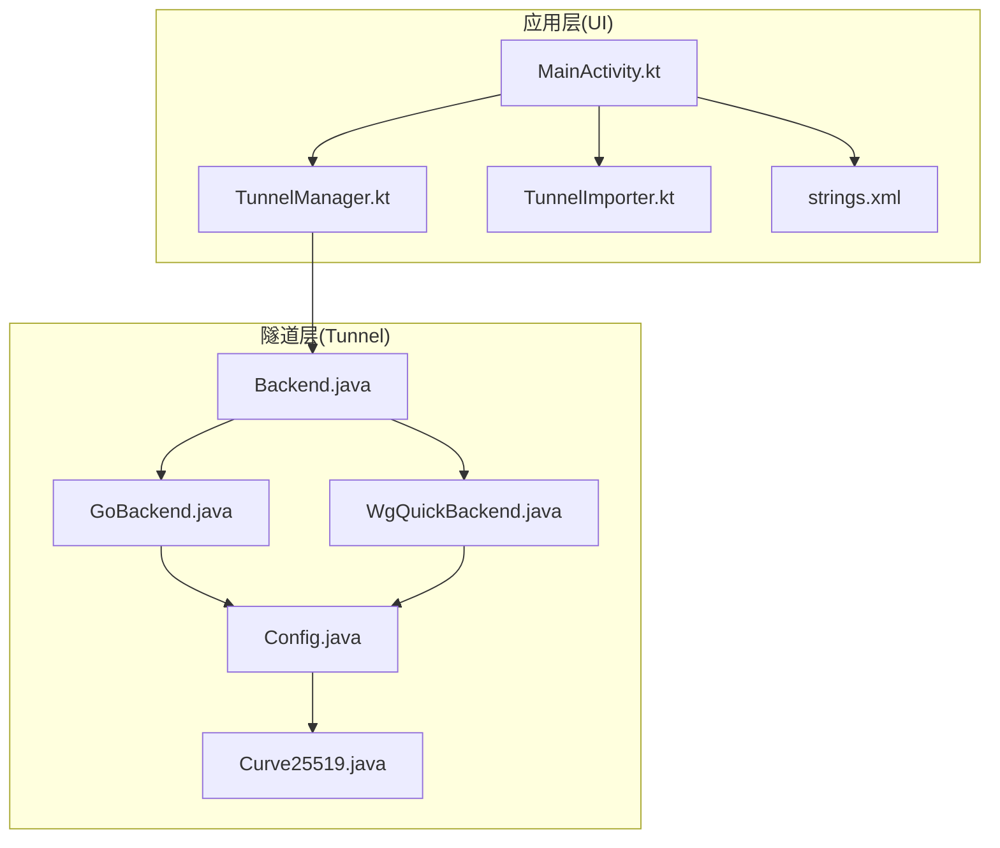
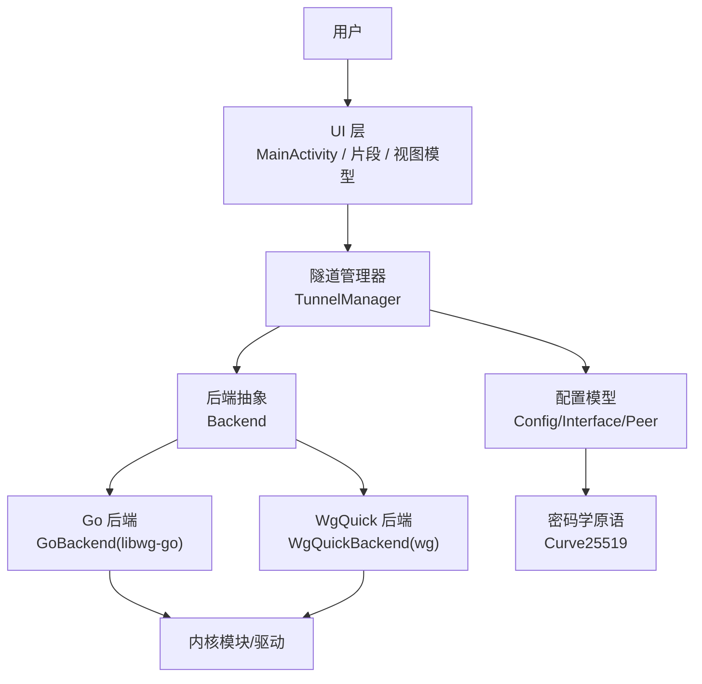
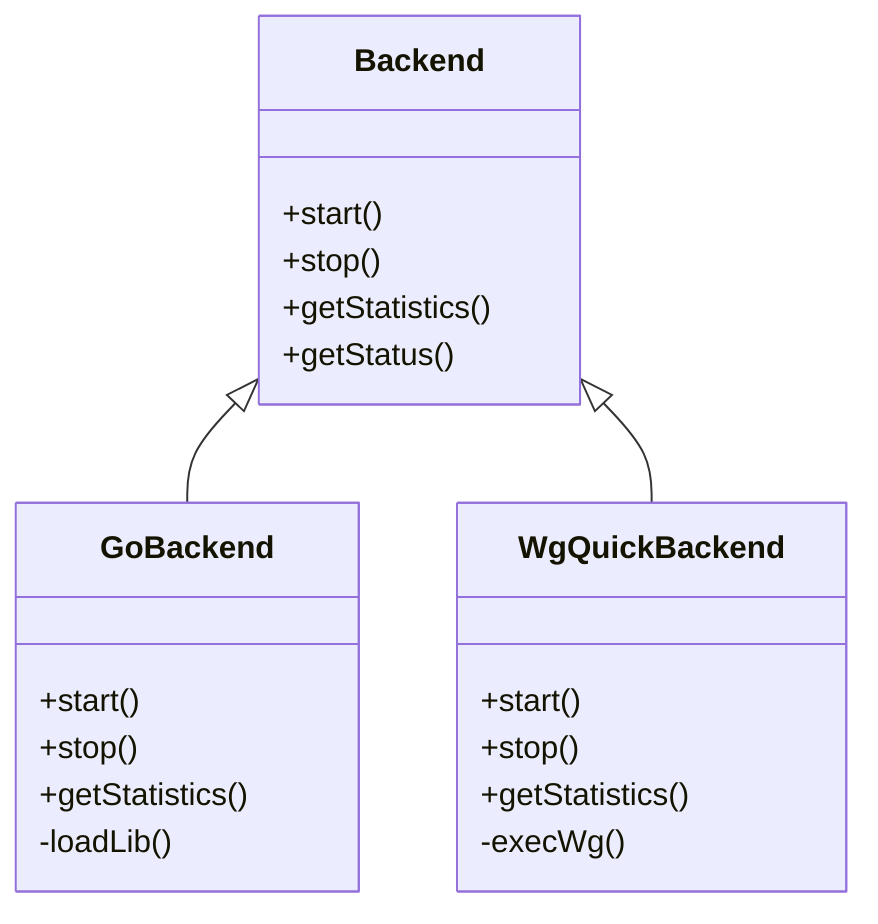
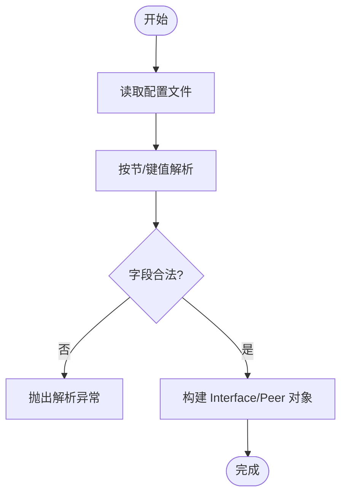
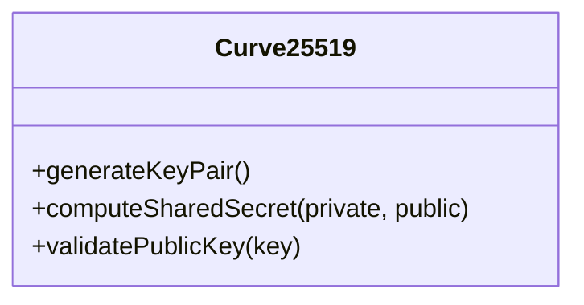
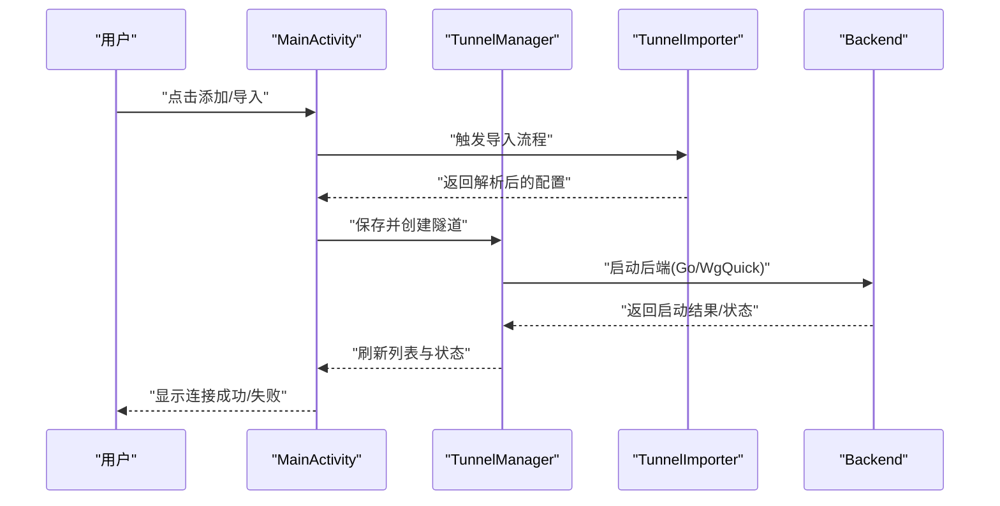
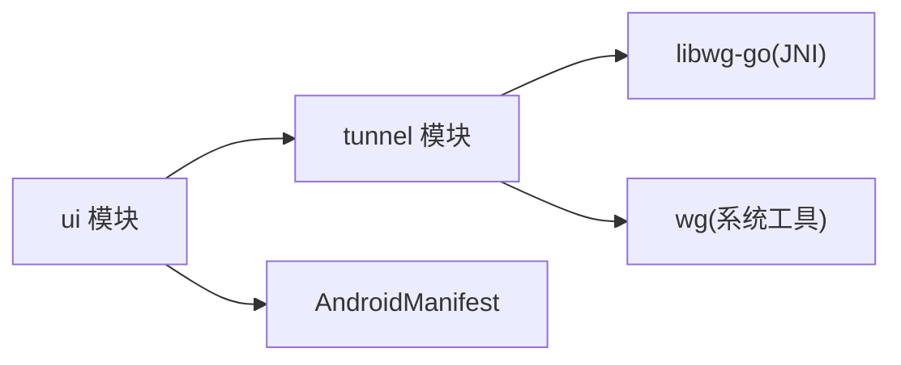

# 项目介绍

<cite>
**本文引用的文件**   
- [README.md](file://README.md)
- [COPYING](file://COPYING)
- [build.gradle.kts](file://build.gradle.kts)
- [settings.gradle.kts](file://settings.gradle.kts)
- [gradle.properties](file://gradle.properties)
- [tunnel/build.gradle.kts](file://tunnel/build.gradle.kts)
- [ui/build.gradle.kts](file://ui/build.gradle.kts)
- [tunnel/src/main/AndroidManifest.xml](file://tunnel/src/main/AndroidManifest.xml)
- [ui/src/main/AndroidManifest.xml](file://ui/src/main/AndroidManifest.xml)
- [tunnel/src/main/java/com/wireguard/android/backend/Backend.java](file://tunnel/src/main/java/com/wireguard/android/backend/Backend.java)
- [tunnel/src/main/java/com/wireguard/android/backend/GoBackend.java](file://tunnel/src/main/java/com/wireguard/android/backend/GoBackend.java)
- [tunnel/src/main/java/com/wireguard/android/backend/WgQuickBackend.java](file://tunnel/src/main/java/com/wireguard/android/backend/WgQuickBackend.java)
- [tunnel/src/main/java/com/wireguard/config/Config.java](file://tunnel/src/main/java/com/wireguard/config/Config.java)
- [tunnel/src/main/java/com/wireguard/crypto/Curve25519.java](file://tunnel/src/main/java/com/wireguard/crypto/Curve25519.java)
- [ui/src/main/java/com/wireguard/android/activity/MainActivity.kt](file://ui/src/main/java/com/wireguard/android/activity/MainActivity.kt)
- [ui/src/main/java/com/wireguard/android/model/TunnelManager.kt](file://ui/src/main/java/com/wireguard/android/model/TunnelManager.kt)
- [ui/src/main/java/com/wireguard/android/util/TunnelImporter.kt](file://ui/src/main/java/com/wireguard/android/util/TunnelImporter.kt)
- [ui/src/main/res/values/strings.xml](file://ui/src/main/res/values/strings.xml)
</cite>

## 目录
1. [简介](#简介)
2. [项目结构](#项目结构)
3. [核心组件](#核心组件)
4. [架构总览](#架构总览)
5. [详细组件分析](#详细组件分析)
6. [依赖关系分析](#依赖关系分析)
7. [性能考量](#性能考量)
8. [故障排查指南](#故障排查指南)
9. [结论](#结论)
10. [附录](#附录)

## 简介
WireGuard Android 是 Android 平台上的官方 WireGuard VPN 客户端，提供高性能、安全且易于使用的 VPN 连接能力。其核心价值在于：
- 以极简配置实现端到端加密隧道，兼顾速度与安全性
- 原生与 Go 双后端支持，适配不同设备与内核环境
- 直观的图形界面与丰富的导入方式（二维码、剪贴板、配置文件）
- 开源透明、社区活跃，持续演进并遵循严格的安全标准

适用场景与用户群体：
- 个人用户：在公共 Wi-Fi 下保护隐私与安全访问
- 企业/开发者：快速接入公司网络或测试多节点拓扑
- 高级用户：通过 WgQuick 兼容格式管理复杂配置

历史背景与发展历程：
- 基于 WireGuard 协议（现代、轻量、高性能的 VPN 方案）
- Android 端由 Kotlin/Java 构建 UI 与业务层，底层通过 Go 运行时或系统工具链对接内核模块
- 持续迭代，完善多语言本地化、权限与无障碍体验、更新机制等

与其他方案的对比优势：
- 相比传统 IPSec/OpenVPN：更少的握手开销、更低的延迟与内存占用
- 相比部分第三方实现：官方维护、代码审计频繁、向后兼容性好

许可证与贡献：
- 采用开源许可证（详见 COPYING），鼓励社区参与改进与本地化
- 欢迎提交问题、功能请求与补丁，遵循仓库贡献规范

**章节来源**
- [README.md](file://README.md)
- [COPYING](file://COPYING)

## 项目结构
项目采用多模块 Gradle 工程组织，清晰分离“隧道内核交互”和“用户界面”两层：
- tunnel 模块：封装 WireGuard 后端抽象、配置解析、密码学原语与 JNI/NDK 集成
- ui 模块：Kotlin 实现的 Android 应用，包含活动、片段、数据绑定、偏好设置与资源

**图表来源**
- [ui/src/main/java/com/wireguard/android/activity/MainActivity.kt](file://ui/src/main/java/com/wireguard/android/activity/MainActivity.kt)
- [ui/src/main/java/com/wireguard/android/model/TunnelManager.kt](file://ui/src/main/java/com/wireguard/android/model/TunnelManager.kt)
- [ui/src/main/java/com/wireguard/android/util/TunnelImporter.kt](file://ui/src/main/java/com/wireguard/android/util/TunnelImporter.kt)
- [tunnel/src/main/java/com/wireguard/android/backend/Backend.java](file://tunnel/src/main/java/com/wireguard/android/backend/Backend.java)
- [tunnel/src/main/java/com/wireguard/android/backend/GoBackend.java](file://tunnel/src/main/java/com/wireguard/android/backend/GoBackend.java)
- [tunnel/src/main/java/com/wireguard/android/backend/WgQuickBackend.java](file://tunnel/src/main/java/com/wireguard/android/backend/WgQuickBackend.java)
- [tunnel/src/main/java/com/wireguard/config/Config.java](file://tunnel/src/main/java/com/wireguard/config/Config.java)
- [tunnel/src/main/java/com/wireguard/crypto/Curve25519.java](file://tunnel/src/main/java/com/wireguard/crypto/Curve25519.java)

**章节来源**
- [build.gradle.kts](file://build.gradle.kts)
- [settings.gradle.kts](file://settings.gradle.kts)
- [gradle.properties](file://gradle.properties)
- [tunnel/build.gradle.kts](file://tunnel/build.gradle.kts)
- [ui/build.gradle.kts](file://ui/build.gradle.kts)

## 核心组件
- 后端抽象与实现
  - Backend 接口统一了启动、停止、统计、状态查询等操作
  - GoBackend 通过 JNI 调用 libwg-go 运行 Go 实现的 WireGuard
  - WgQuickBackend 利用系统工具链（如 wg）执行 WgQuick 兼容配置
- 配置模型与解析
  - Config/Interface/Peer 等类描述接口与对等体属性，支持严格的语法校验
- 密码学原语
  - Curve25519 等用于密钥交换与对称加密相关操作
- 用户界面与数据流
  - MainActivity 作为入口，TunnelManager 管理隧道生命周期
  - TunnelImporter 支持从多种来源导入配置（二维码、剪贴板、文件）
  - strings.xml 提供多语言文案

**章节来源**
- [tunnel/src/main/java/com/wireguard/android/backend/Backend.java](file://tunnel/src/main/java/com/wireguard/android/backend/Backend.java)
- [tunnel/src/main/java/com/wireguard/android/backend/GoBackend.java](file://tunnel/src/main/java/com/wireguard/android/backend/GoBackend.java)
- [tunnel/src/main/java/com/wireguard/android/backend/WgQuickBackend.java](file://tunnel/src/main/java/com/wireguard/android/backend/WgQuickBackend.java)
- [tunnel/src/main/java/com/wireguard/config/Config.java](file://tunnel/src/main/java/com/wireguard/config/Config.java)
- [tunnel/src/main/java/com/wireguard/crypto/Curve25519.java](file://tunnel/src/main/java/com/wireguard/crypto/Curve25519.java)
- [ui/src/main/java/com/wireguard/android/activity/MainActivity.kt](file://ui/src/main/java/com/wireguard/android/activity/MainActivity.kt)
- [ui/src/main/java/com/wireguard/android/model/TunnelManager.kt](file://ui/src/main/java/com/wireguard/android/model/TunnelManager.kt)
- [ui/src/main/java/com/wireguard/android/util/TunnelImporter.kt](file://ui/src/main/java/com/wireguard/android/util/TunnelImporter.kt)
- [ui/src/main/res/values/strings.xml](file://ui/src/main/res/values/strings.xml)

## 架构总览
整体架构分为三层：UI 层负责交互与展示；Tunnel 层抽象后端与配置；底层通过 Go 运行时或系统工具与内核模块通信。

**图表来源**
- [ui/src/main/java/com/wireguard/android/activity/MainActivity.kt](file://ui/src/main/java/com/wireguard/android/activity/MainActivity.kt)
- [ui/src/main/java/com/wireguard/android/model/TunnelManager.kt](file://ui/src/main/java/com/wireguard/android/model/TunnelManager.kt)
- [tunnel/src/main/java/com/wireguard/android/backend/Backend.java](file://tunnel/src/main/java/com/wireguard/android/backend/Backend.java)
- [tunnel/src/main/java/com/wireguard/android/backend/GoBackend.java](file://tunnel/src/main/java/com/wireguard/android/backend/GoBackend.java)
- [tunnel/src/main/java/com/wireguard/android/backend/WgQuickBackend.java](file://tunnel/src/main/java/com/wireguard/android/backend/WgQuickBackend.java)
- [tunnel/src/main/java/com/wireguard/config/Config.java](file://tunnel/src/main/java/com/wireguard/config/Config.java)
- [tunnel/src/main/java/com/wireguard/crypto/Curve25519.java](file://tunnel/src/main/java/com/wireguard/crypto/Curve25519.java)

## 详细组件分析

### 后端抽象与实现（Backend/GoBackend/WgQuickBackend）
- 设计要点
  - 统一的 Backend 接口屏蔽差异，便于切换与扩展
  - GoBackend 通过 JNI 加载 libwg-go，适合无内核模块或需要灵活调度的场景
  - WgQuickBackend 复用系统 wg 工具，兼容广泛配置生态
- 关键流程
  - 启动/停止：创建/销毁虚拟网卡、写入配置、建立对等体连接
  - 统计：读取发送/接收字节数、最近活动时间
  - 错误处理：捕获异常并向上抛出，供 UI 提示

**图表来源**
- [tunnel/src/main/java/com/wireguard/android/backend/Backend.java](file://tunnel/src/main/java/com/wireguard/android/backend/Backend.java)
- [tunnel/src/main/java/com/wireguard/android/backend/GoBackend.java](file://tunnel/src/main/java/com/wireguard/android/backend/GoBackend.java)
- [tunnel/src/main/java/com/wireguard/android/backend/WgQuickBackend.java](file://tunnel/src/main/java/com/wireguard/android/backend/WgQuickBackend.java)

**章节来源**
- [tunnel/src/main/java/com/wireguard/android/backend/Backend.java](file://tunnel/src/main/java/com/wireguard/android/backend/Backend.java)
- [tunnel/src/main/java/com/wireguard/android/backend/GoBackend.java](file://tunnel/src/main/java/com/wireguard/android/backend/GoBackend.java)
- [tunnel/src/main/java/com/wireguard/android/backend/WgQuickBackend.java](file://tunnel/src/main/java/com/wireguard/android/backend/WgQuickBackend.java)

### 配置模型与解析（Config/Interface/Peer）
- 数据结构
  - Interface：监听端口、私钥、DNS、MTU 等
  - Peer：公钥、允许 IP、Endpoint、Keepalive、传输统计
- 解析与校验
  - 严格语法检查，缺失/非法字段抛出异常
  - 支持注释、空白行、大小写不敏感等特性

**图表来源**
- [tunnel/src/main/java/com/wireguard/config/Config.java](file://tunnel/src/main/java/com/wireguard/config/Config.java)

**章节来源**
- [tunnel/src/main/java/com/wireguard/config/Config.java](file://tunnel/src/main/java/com/wireguard/config/Config.java)

### 密码学原语（Curve25519）
- 作用
  - 提供曲线 25519 相关的密钥生成、共享密钥计算等基础能力
- 使用位置
  - 配置中的公钥/私钥校验与转换
  - 与后端实现协作完成握手前的参数准备

**图表来源**
- [tunnel/src/main/java/com/wireguard/crypto/Curve25519.java](file://tunnel/src/main/java/com/wireguard/crypto/Curve25519.java)

**章节来源**
- [tunnel/src/main/java/com/wireguard/crypto/Curve25519.java](file://tunnel/src/main/java/com/wireguard/crypto/Curve25519.java)

### 用户界面与数据流（MainActivity/TunnelManager/TunnelImporter）
- 入口与导航
  - MainActivity 承载主列表与操作入口
  - 片段与对话框用于编辑、详情与导入
- 数据管理
  - TunnelManager 负责隧道的增删改查与生命周期协调
- 导入能力
  - TunnelImporter 支持二维码扫描、剪贴板粘贴、文件选择等方式导入配置

**图表来源**
- [ui/src/main/java/com/wireguard/android/activity/MainActivity.kt](file://ui/src/main/java/com/wireguard/android/activity/MainActivity.kt)
- [ui/src/main/java/com/wireguard/android/model/TunnelManager.kt](file://ui/src/main/java/com/wireguard/android/model/TunnelManager.kt)
- [ui/src/main/java/com/wireguard/android/util/TunnelImporter.kt](file://ui/src/main/java/com/wireguard/android/util/TunnelImporter.kt)
- [tunnel/src/main/java/com/wireguard/android/backend/Backend.java](file://tunnel/src/main/java/com/wireguard/android/backend/Backend.java)

**章节来源**
- [ui/src/main/java/com/wireguard/android/activity/MainActivity.kt](file://ui/src/main/java/com/wireguard/android/activity/MainActivity.kt)
- [ui/src/main/java/com/wireguard/android/model/TunnelManager.kt](file://ui/src/main/java/com/wireguard/android/model/TunnelManager.kt)
- [ui/src/main/java/com/wireguard/android/util/TunnelImporter.kt](file://ui/src/main/java/com/wireguard/android/util/TunnelImporter.kt)

## 依赖关系分析
- 模块依赖
  - ui 依赖 tunnel（通过 Gradle 声明）
  - tunnel 依赖 NDK/Go 工具链进行编译与打包
- 运行时依赖
  - GoBackend 依赖 libwg-go（JNI）
  - WgQuickBackend 依赖系统 wg 工具
- 清单与权限
  - AndroidManifest 声明 VPNService、通知、前台服务等必要权限

**图表来源**
- [build.gradle.kts](file://build.gradle.kts)
- [settings.gradle.kts](file://settings.gradle.kts)
- [tunnel/build.gradle.kts](file://tunnel/build.gradle.kts)
- [ui/build.gradle.kts](file://ui/build.gradle.kts)
- [tunnel/src/main/AndroidManifest.xml](file://tunnel/src/main/AndroidManifest.xml)
- [ui/src/main/AndroidManifest.xml](file://ui/src/main/AndroidManifest.xml)

**章节来源**
- [build.gradle.kts](file://build.gradle.kts)
- [settings.gradle.kts](file://settings.gradle.kts)
- [tunnel/build.gradle.kts](file://tunnel/build.gradle.kts)
- [ui/build.gradle.kts](file://ui/build.gradle.kts)
- [tunnel/src/main/AndroidManifest.xml](file://tunnel/src/main/AndroidManifest.xml)
- [ui/src/main/AndroidManifest.xml](file://ui/src/main/AndroidManifest.xml)

## 性能考量
- 选择合适后端
  - 有内核模块时优先 WgQuickBackend，减少拷贝与上下文切换
  - 无内核模块或需动态调度时使用 GoBackend
- 配置优化
  - 合理设置 MTU、Keepalive、AllowedIPs 范围
  - 避免过多对等体导致握手与路由表膨胀
- 资源与功耗
  - 控制日志级别与统计上报频率
  - 合理使用前台服务与通知，降低唤醒开销

[本节为通用指导，无需特定文件引用]

## 故障排查指南
- 常见错误
  - 配置解析失败：检查必填字段、数值范围、注释与大小写
  - 启动失败：确认权限、内核模块可用性、端口冲突
  - 连接不稳定：检查 Endpoint 可达性、NAT 穿透、防火墙策略
- 定位方法
  - 查看应用日志与系统 VPN 日志
  - 使用 wg show 验证内核状态（WgQuick 路径）
  - 逐步简化配置，定位问题段

**章节来源**
- [tunnel/src/main/java/com/wireguard/config/Config.java](file://tunnel/src/main/java/com/wireguard/config/Config.java)
- [tunnel/src/main/java/com/wireguard/android/backend/Backend.java](file://tunnel/src/main/java/com/wireguard/android/backend/Backend.java)
- [tunnel/src/main/java/com/wireguard/android/backend/WgQuickBackend.java](file://tunnel/src/main/java/com/wireguard/android/backend/WgQuickBackend.java)

## 结论
WireGuard Android 以清晰的模块化架构、强大的后端抽象与友好的用户体验，成为 Android 平台上高效可靠的 VPN 解决方案。它既满足普通用户的易用需求，也为高级用户提供灵活的配置与扩展能力。借助开源生态与持续维护，项目在安全性、性能与兼容性方面具备显著优势。

[本节为总结性内容，无需特定文件引用]

## 附录
- 许可证信息
  - 参见 COPYING，了解开源许可条款与使用限制
- 版本与构建
  - 参考 build.gradle.kts、settings.gradle.kts、gradle.properties 了解构建配置与依赖版本
- 国际化
  - 多语言文案位于 ui/src/main/res/values 下的 strings.xml 及各语言子目录

**章节来源**
- [COPYING](file://COPYING)
- [build.gradle.kts](file://build.gradle.kts)
- [settings.gradle.kts](file://settings.gradle.kts)
- [gradle.properties](file://gradle.properties)
- [ui/src/main/res/values/strings.xml](file://ui/src/main/res/values/strings.xml)