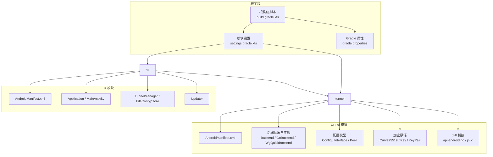
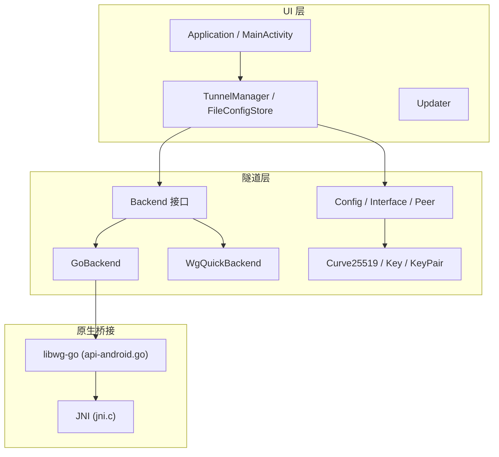
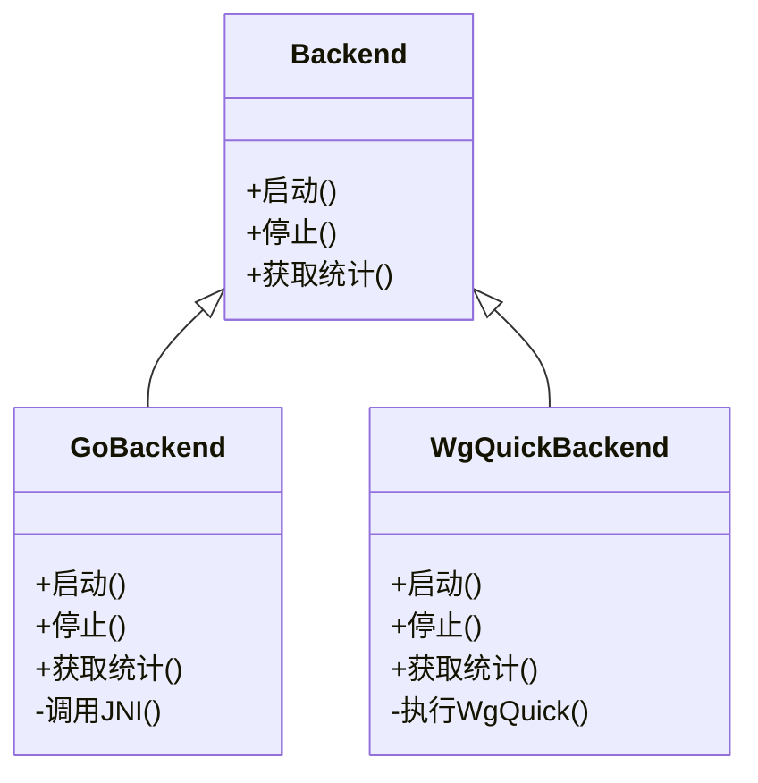
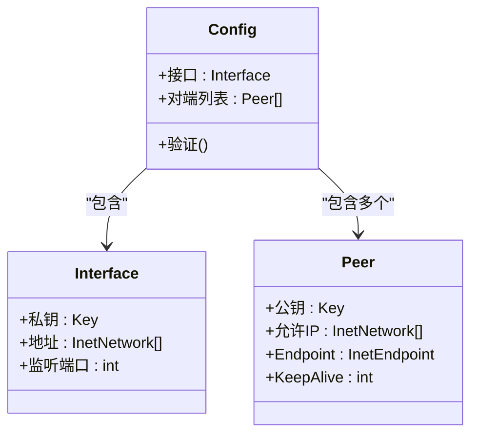
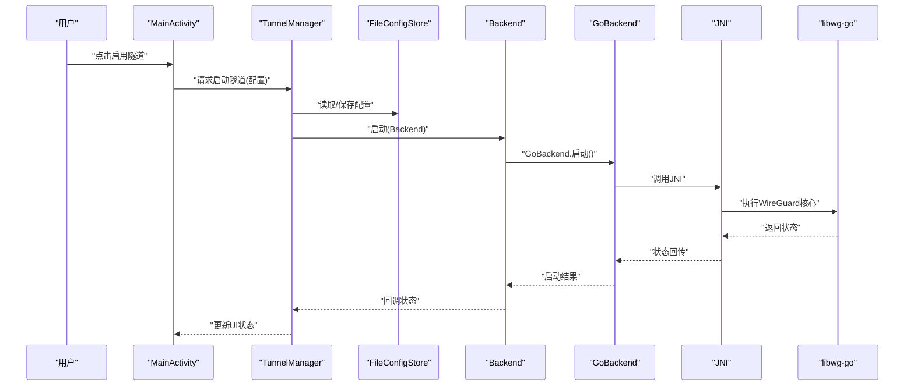
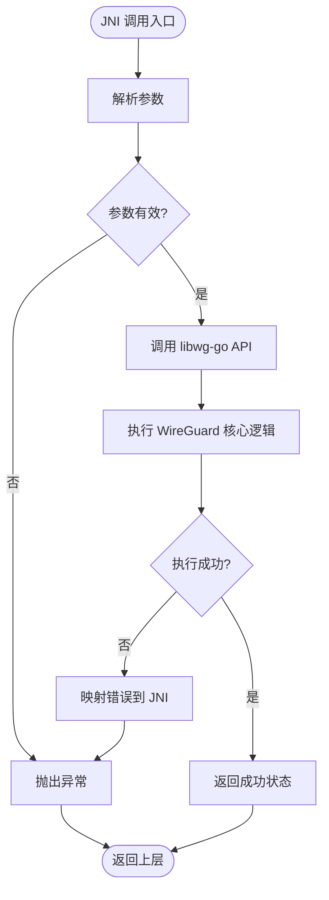
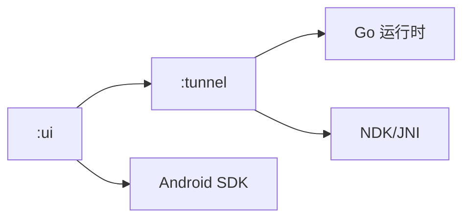

# 项目概述

<cite>
**本文引用的文件**   
- [README.md](file://README.md)
- [build.gradle.kts](file://build.gradle.kts)
- [settings.gradle.kts](file://settings.gradle.kts)
- [gradle.properties](file://gradle.properties)
- [tunnel/build.gradle.kts](file://tunnel/build.gradle.kts)
- [ui/build.gradle.kts](file://ui/build.gradle.kts)
- [tunnel/src/main/AndroidManifest.xml](file://tunnel/src/main/AndroidManifest.xml)
- [ui/src/main/AndroidManifest.xml](file://ui/src/main/AndroidManifest.xml)
- [tunnel/src/main/java/com/wireguard/android/backend/Backend.java](file://tunnel/src/main/java/com/wireguard/android/backend/Backend.java)
- [tunnel/src/main/java/com/wireguard/android/backend/GoBackend.java](file://tunnel/src/main/java/com/wireguard/android/backend/GoBackend.java)
- [tunnel/src/main/java/com/wireguard/android/backend/WgQuickBackend.java](file://tunnel/src/main/java/com/wireguard/android/backend/WgQuickBackend.java)
- [tunnel/src/main/java/com/wireguard/config/Config.java](file://tunnel/src/main/java/com/wireguard/config/Config.java)
- [tunnel/src/main/java/com/wireguard/config/Interface.java](file://tunnel/src/main/java/com/wireguard/config/Interface.java)
- [tunnel/src/main/java/com/wireguard/config/Peer.java](file://tunnel/src/main/java/com/wireguard/config/Peer.java)
- [tunnel/tools/libwg-go/api-android.go](file://tunnel/tools/libwg-go/api-android.go)
- [tunnel/tools/libwg-go/jni.c](file://tunnel/tools/libwg-go/jni.c)
- [ui/src/main/java/com/wireguard/android/Application.kt](file://ui/src/main/java/com/wireguard/android/Application.kt)
- [ui/src/main/java/com/wireguard/android/activity/MainActivity.kt](file://ui/src/main/java/com/wireguard/android/activity/MainActivity.kt)
- [ui/src/main/java/com/wireguard/android/model/TunnelManager.kt](file://ui/src/main/java/com/wireguard/android/model/TunnelManager.kt)
- [ui/src/main/java/com/wireguard/android/configStore/FileConfigStore.kt](file://ui/src/main/java/com/wireguard/android/configStore/FileConfigStore.kt)
- [ui/src/main/java/com/wireguard/android/updater/Updater.kt](file://ui/src/main/java/com/wireguard/android/updater/Updater.kt)
</cite>

## 目录
1. [简介](#简介)
2. [项目结构](#项目结构)
3. [核心组件](#核心组件)
4. [架构总览](#架构总览)
5. [详细组件分析](#详细组件分析)
6. [依赖关系分析](#依赖关系分析)
7. [性能考量](#性能考量)
8. [故障排查指南](#故障排查指南)
9. [结论](#结论)
10. [附录：快速开始与使用示例](#附录快速开始与使用示例)

## 简介
WireGuard Android 是一个在 Android 平台上运行 WireGuard VPN 的客户端实现。其目标是为移动设备提供高性能、低开销且安全的 VPN 连接能力，同时提供直观的界面用于配置管理、连接控制与日志查看。项目的价值主张包括：
- 高性能内核级隧道：通过 Go 实现的 WireGuard 核心与 JNI 桥接，充分利用系统资源。
- 双模块设计：将“隧道内核”（tunnel）与“用户界面”（ui）解耦，便于独立演进与复用。
- 多后端支持：抽象出 Backend 接口，支持不同实现（如 GoBackend、WgQuickBackend），提升可移植性与扩展性。
- 完善的配置模型：统一的 Config/Interface/Peer 模型，兼容标准配置文件格式。
- 丰富的 Android 特性集成：开机自启、快捷开关、应用列表选择、生物识别等。

## 项目结构
项目采用 Gradle 多模块组织，核心分为两个模块：
- tunnel：封装 WireGuard 隧道逻辑、配置解析、加密原语以及与 Go/JNI 的交互。
- ui：基于 Kotlin 的 Android 应用层，负责界面、配置持久化、更新检查与系统集成。

**图表来源** 
- [build.gradle.kts](file://build.gradle.kts)
- [settings.gradle.kts](file://settings.gradle.kts)
- [gradle.properties](file://gradle.properties)
- [tunnel/src/main/AndroidManifest.xml](file://tunnel/src/main/AndroidManifest.xml)
- [ui/src/main/AndroidManifest.xml](file://ui/src/main/AndroidManifest.xml)

**章节来源**
- [build.gradle.kts](file://build.gradle.kts)
- [settings.gradle.kts](file://settings.gradle.kts)
- [gradle.properties](file://gradle.properties)

## 核心组件
- 后端抽象与实现
  - Backend：定义启动、停止、统计查询等统一接口。
  - GoBackend：通过 JNI 调用 libwg-go 提供的 Go 实现。
  - WgQuickBackend：面向 wg-quick 风格的配置执行路径。
- 配置模型
  - Config/Interface/Peer：描述接口地址、密钥、对端、路由等。
- 加密原语
  - Curve25519/Key/KeyPair：提供密钥生成、交换与校验能力。
- UI 层
  - Application/MainActivity：应用入口与主界面。
  - TunnelManager/FileConfigStore：隧道生命周期管理与配置持久化。
  - Updater：版本更新检查与提示。

**章节来源**
- [tunnel/src/main/java/com/wireguard/android/backend/Backend.java](file://tunnel/src/main/java/com/wireguard/android/backend/Backend.java)
- [tunnel/src/main/java/com/wireguard/android/backend/GoBackend.java](file://tunnel/src/main/java/com/wireguard/android/backend/GoBackend.java)
- [tunnel/src/main/java/com/wireguard/android/backend/WgQuickBackend.java](file://tunnel/src/main/java/com/wireguard/android/backend/WgQuickBackend.java)
- [tunnel/src/main/java/com/wireguard/config/Config.java](file://tunnel/src/main/java/com/wireguard/config/Config.java)
- [tunnel/src/main/java/com/wireguard/config/Interface.java](file://tunnel/src/main/java/com/wireguard/config/Interface.java)
- [tunnel/src/main/java/com/wireguard/config/Peer.java](file://tunnel/src/main/java/com/wireguard/config/Peer.java)
- [ui/src/main/java/com/wireguard/android/Application.kt](file://ui/src/main/java/com/wireguard/android/Application.kt)
- [ui/src/main/java/com/wireguard/android/activity/MainActivity.kt](file://ui/src/main/java/com/wireguard/android/activity/MainActivity.kt)
- [ui/src/main/java/com/wireguard/android/model/TunnelManager.kt](file://ui/src/main/java/com/wireguard/android/model/TunnelManager.kt)
- [ui/src/main/java/com/wireguard/android/configStore/FileConfigStore.kt](file://ui/src/main/java/com/wireguard/android/configStore/FileConfigStore.kt)
- [ui/src/main/java/com/wireguard/android/updater/Updater.kt](file://ui/src/main/java/com/wireguard/android/updater/Updater.kt)

## 架构总览
整体架构遵循“UI 层 + 隧道层 + 原生桥接”的分层设计：
- UI 层（Kotlin）：负责用户交互、配置编辑、状态展示与系统能力集成。
- 隧道层（Java/Kotlin）：封装配置解析、后端调度、统计与工具方法。
- 原生桥接（Go + JNI）：通过 libwg-go 暴露 API，由 JNI 桥接到 Android 进程。

**图表来源** 
- [ui/src/main/java/com/wireguard/android/Application.kt](file://ui/src/main/java/com/wireguard/android/Application.kt)
- [ui/src/main/java/com/wireguard/android/activity/MainActivity.kt](file://ui/src/main/java/com/wireguard/android/activity/MainActivity.kt)
- [ui/src/main/java/com/wireguard/android/model/TunnelManager.kt](file://ui/src/main/java/com/wireguard/android/model/TunnelManager.kt)
- [ui/src/main/java/com/wireguard/android/configStore/FileConfigStore.kt](file://ui/src/main/java/com/wireguard/android/configStore/FileConfigStore.kt)
- [ui/src/main/java/com/wireguard/android/updater/Updater.kt](file://ui/src/main/java/com/wireguard/android/updater/Updater.kt)
- [tunnel/src/main/java/com/wireguard/android/backend/Backend.java](file://tunnel/src/main/java/com/wireguard/android/backend/Backend.java)
- [tunnel/src/main/java/com/wireguard/android/backend/GoBackend.java](file://tunnel/src/main/java/com/wireguard/android/backend/GoBackend.java)
- [tunnel/src/main/java/com/wireguard/android/backend/WgQuickBackend.java](file://tunnel/src/main/java/com/wireguard/android/backend/WgQuickBackend.java)
- [tunnel/src/main/java/com/wireguard/config/Config.java](file://tunnel/src/main/java/com/wireguard/config/Config.java)
- [tunnel/src/main/java/com/wireguard/config/Interface.java](file://tunnel/src/main/java/com/wireguard/config/Interface.java)
- [tunnel/src/main/java/com/wireguard/config/Peer.java](file://tunnel/src/main/java/com/wireguard/config/Peer.java)
- [tunnel/tools/libwg-go/api-android.go](file://tunnel/tools/libwg-go/api-android.go)
- [tunnel/tools/libwg-go/jni.c](file://tunnel/tools/libwg-go/jni.c)

## 详细组件分析

### 后端抽象与实现（Backend / GoBackend / WgQuickBackend）
- 职责
  - Backend：定义统一的隧道生命周期与统计接口。
  - GoBackend：通过 JNI 调用 libwg-go，实现高性能数据面。
  - WgQuickBackend：面向 wg-quick 风格配置的便捷路径。
- 关键交互
  - UI 层通过 TunnelManager 调用 Backend 接口。
  - GoBackend 经由 JNI 进入 Go 运行时，执行 WireGuard 核心逻辑。
- 错误处理
  - 异常类型与返回码需向上抛出，供 UI 层提示或重试。

**图表来源** 
- [tunnel/src/main/java/com/wireguard/android/backend/Backend.java](file://tunnel/src/main/java/com/wireguard/android/backend/Backend.java)
- [tunnel/src/main/java/com/wireguard/android/backend/GoBackend.java](file://tunnel/src/main/java/com/wireguard/android/backend/GoBackend.java)
- [tunnel/src/main/java/com/wireguard/android/backend/WgQuickBackend.java](file://tunnel/src/main/java/com/wireguard/android/backend/WgQuickBackend.java)

**章节来源**
- [tunnel/src/main/java/com/wireguard/android/backend/Backend.java](file://tunnel/src/main/java/com/wireguard/android/backend/Backend.java)
- [tunnel/src/main/java/com/wireguard/android/backend/GoBackend.java](file://tunnel/src/main/java/com/wireguard/android/backend/GoBackend.java)
- [tunnel/src/main/java/com/wireguard/android/backend/WgQuickBackend.java](file://tunnel/src/main/java/com/wireguard/android/backend/WgQuickBackend.java)

### 配置模型（Config / Interface / Peer）
- 职责
  - Config：顶层容器，包含 Interface 与可选的对端集合。
  - Interface：本地接口地址、私钥、监听端口等。
  - Peer：对端公钥、允许 IP、Endpoint、Keepalive 等。
- 复杂度
  - 解析与校验涉及网络地址、端口范围、密钥格式等，时间复杂度与配置项数量线性相关。
- 优化点
  - 缓存已解析的配置对象，避免重复解析；增量更新时仅变更必要字段。

**图表来源** 
- [tunnel/src/main/java/com/wireguard/config/Config.java](file://tunnel/src/main/java/com/wireguard/config/Config.java)
- [tunnel/src/main/java/com/wireguard/config/Interface.java](file://tunnel/src/main/java/com/wireguard/config/Interface.java)
- [tunnel/src/main/java/com/wireguard/config/Peer.java](file://tunnel/src/main/java/com/wireguard/config/Peer.java)

**章节来源**
- [tunnel/src/main/java/com/wireguard/config/Config.java](file://tunnel/src/main/java/com/wireguard/config/Config.java)
- [tunnel/src/main/java/com/wireguard/config/Interface.java](file://tunnel/src/main/java/com/wireguard/config/Interface.java)
- [tunnel/src/main/java/com/wireguard/config/Peer.java](file://tunnel/src/main/java/com/wireguard/config/Peer.java)

### UI 层与应用入口（Application / MainActivity / TunnelManager / FileConfigStore / Updater）
- 职责
  - Application：初始化全局上下文与依赖。
  - MainActivity：主界面导航与状态展示。
  - TunnelManager：协调隧道生命周期与配置存储。
  - FileConfigStore：以文件形式持久化配置。
  - Updater：检查并提示新版本。
- 典型流程
  - 用户操作 -> MainActivity -> TunnelManager -> FileConfigStore/Backend -> 结果回传 UI。

**图表来源** 
- [ui/src/main/java/com/wireguard/android/Application.kt](file://ui/src/main/java/com/wireguard/android/Application.kt)
- [ui/src/main/java/com/wireguard/android/activity/MainActivity.kt](file://ui/src/main/java/com/wireguard/android/activity/MainActivity.kt)
- [ui/src/main/java/com/wireguard/android/model/TunnelManager.kt](file://ui/src/main/java/com/wireguard/android/model/TunnelManager.kt)
- [ui/src/main/java/com/wireguard/android/configStore/FileConfigStore.kt](file://ui/src/main/java/com/wireguard/android/configStore/FileConfigStore.kt)
- [tunnel/src/main/java/com/wireguard/android/backend/Backend.java](file://tunnel/src/main/java/com/wireguard/android/backend/Backend.java)
- [tunnel/src/main/java/com/wireguard/android/backend/GoBackend.java](file://tunnel/src/main/java/com/wireguard/android/backend/GoBackend.java)
- [tunnel/tools/libwg-go/api-android.go](file://tunnel/tools/libwg-go/api-android.go)
- [tunnel/tools/libwg-go/jni.c](file://tunnel/tools/libwg-go/jni.c)

**章节来源**
- [ui/src/main/java/com/wireguard/android/Application.kt](file://ui/src/main/java/com/wireguard/android/Application.kt)
- [ui/src/main/java/com/wireguard/android/activity/MainActivity.kt](file://ui/src/main/java/com/wireguard/android/activity/MainActivity.kt)
- [ui/src/main/java/com/wireguard/android/model/TunnelManager.kt](file://ui/src/main/java/com/wireguard/android/model/TunnelManager.kt)
- [ui/src/main/java/com/wireguard/android/configStore/FileConfigStore.kt](file://ui/src/main/java/com/wireguard/android/configStore/FileConfigStore.kt)
- [ui/src/main/java/com/wireguard/android/updater/Updater.kt](file://ui/src/main/java/com/wireguard/android/updater/Updater.kt)

### 原生桥接（libwg-go + JNI）
- 职责
  - api-android.go：暴露给 JNI 的 Go API。
  - jni.c：C 侧 JNI 绑定，负责参数转换与调用。
- 关键点
  - 线程安全：确保 JNI 调用与 Go 运行时正确协作。
  - 内存管理：避免泄漏与越界访问。
  - 错误传播：将 Go 错误映射为 Java 异常。

**图表来源** 
- [tunnel/tools/libwg-go/api-android.go](file://tunnel/tools/libwg-go/api-android.go)
- [tunnel/tools/libwg-go/jni.c](file://tunnel/tools/libwg-go/jni.c)

**章节来源**
- [tunnel/tools/libwg-go/api-android.go](file://tunnel/tools/libwg-go/api-android.go)
- [tunnel/tools/libwg-go/jni.c](file://tunnel/tools/libwg-go/jni.c)

## 依赖关系分析
- 模块依赖
  - ui 依赖 tunnel（通过 AAR/库引用）。
  - tunnel 依赖 Go 运行时与 NDK 工具链。
- 外部依赖
  - Android SDK/NDK、Gradle、Go 工具链。
- 潜在循环依赖
  - 通过清晰的接口边界（Backend）避免 UI 与隧道层的耦合。

**图表来源** 
- [settings.gradle.kts](file://settings.gradle.kts)
- [tunnel/build.gradle.kts](file://tunnel/build.gradle.kts)
- [ui/build.gradle.kts](file://ui/build.gradle.kts)

**章节来源**
- [settings.gradle.kts](file://settings.gradle.kts)
- [tunnel/build.gradle.kts](file://tunnel/build.gradle.kts)
- [ui/build.gradle.kts](file://ui/build.gradle.kts)

## 性能考量
- 数据面路径
  - 尽量保持 JNI 调用最小化，批量处理统计与事件。
  - 合理设置 Keepalive 与 MTU，平衡延迟与吞吐。
- 内存与 CPU
  - 避免频繁创建临时对象，重用配置解析结果。
  - 在后台线程执行耗时任务（导入、导出、更新检查）。
- I/O 与持久化
  - 配置读写采用缓冲与异步写入，减少阻塞。
  - 日志滚动与限流，避免磁盘压力。

## 故障排查指南
- 常见问题
  - 启动失败：检查权限、SELinux 策略、内核支持。
  - 配置错误：校验接口地址、对端公钥、端口范围。
  - 网络不通：确认路由规则、DNS、防火墙。
- 定位步骤
  - 查看日志：通过 LogViewerActivity 收集日志。
  - 验证配置：使用测试用例中的示例配置进行对比。
  - 检查后端：切换 GoBackend/WgQuickBackend 观察差异。
- 恢复措施
  - 重置配置、重启服务、重新授权。

**章节来源**
- [ui/src/main/java/com/wireguard/android/activity/LogViewerActivity.kt](file://ui/src/main/java/com/wireguard/android/activity/LogViewerActivity.kt)
- [tunnel/src/test/resources/working.conf](file://tunnel/src/test/resources/working.conf)
- [tunnel/src/test/resources/broken.conf](file://tunnel/src/test/resources/broken.conf)

## 结论
WireGuard Android 通过清晰的双模块设计与分层架构，实现了高性能、可扩展且易用的 VPN 客户端。其核心价值在于将强大的 WireGuard 内核能力与 Android 生态无缝结合，为用户提供稳定可靠的网络连接体验。建议在新功能开发中继续坚持接口抽象、模块化与性能优先的原则。

## 附录：快速开始与使用示例
- 环境要求
  - Android Studio、Gradle、Go 工具链、Android NDK。
- 构建步骤
  - 克隆仓库并同步子模块。
  - 使用 Gradle 构建 ui 与 tunnel 模块。
  - 安装到设备或模拟器。
- 基本使用方法
  - 导入配置文件（文本或 QR 码）。
  - 在列表中启用/禁用隧道。
  - 查看实时日志与统计数据。
- 使用场景示例
  - 企业远程访问：配置公司服务器对端，开启后访问内网资源。
  - 公共 Wi-Fi 安全：启用隧道保护流量，防止窃听。
  - 跨地域组网：多对端聚合，实现灵活的路由策略。

**章节来源**
- [README.md](file://README.md)
- [ui/src/main/java/com/wireguard/android/activity/MainActivity.kt](file://ui/src/main/java/com/wireguard/android/activity/MainActivity.kt)
- [ui/src/main/java/com/wireguard/android/configStore/FileConfigStore.kt](file://ui/src/main/java/com/wireguard/android/configStore/FileConfigStore.kt)
- [ui/src/main/java/com/wireguard/android/updater/Updater.kt](file://ui/src/main/java/com/wireguard/android/updater/Updater.kt)